各种参数的含义可以参考秋叶的视频:

[【AI绘画/科普】AI训练中的黑话都是什么意思？AI又是如何训练出来的？如何调节参数？不用一行公式带你看懂梯度下降](https://www.bilibili.com/video/BV1A8411775m)

[【AI绘画】LoRA 模型训练 参数相关问答](https://www.bilibili.com/read/cv21652043?from=articleDetail)

其他人写的我看过比较好的视频和专栏:

[Lora人物训练（多concept）导论，炼了三十多炉人物lora（以及十多炉焦茶），经历了很多试错。写一篇专栏，总结与分享我的经验。这是我的c站账号https://civitai.com/user/zbw这是一篇关于lora人物训练中，关于分concept，打标，尤其是防止concept之间融合的详细教程。夕史尔特尔铃兰零.训练配置训练脚本是直接从github上面直接拉的https://github.com/derriandistro/LoRA\_Easy\_Training\_Scripts（不知道为什么一样的训练集一样的参数用秋叶包每次都炸炉）](https://www.bilibili.com/read/cv22050074?from=articleDetail)

[lora训练进阶教程，6分半教会你怎么训练一个好的lora，及明日方舟等角色lora分享](https://www.bilibili.com/video/BV1jP411f7kV)

  

        lora训练这个东西其实是没有例规怎么做才对, 现在其实就是八仙过海各显神通. 我这篇专栏可能和其他人写的有出入, 不要见怪, 你可以都试试, 实践是检验真理的唯一标准, 找到最适合自己且效果较好的的才是王道.

        为了达到喂饭级别的效果, 本文会以五部分组成, 顺序如下:

                1. 本专栏所用到的插件的详细安装方式

                2.本专栏所使用的GuiLora训练脚本安装使用方法, 及我平时使用的参数

                3.数据集选择与处理(三种打标方式)

                4.训练流程  

                5.后记

        由于b站专栏我找不到怎么快速跳转分段, 所以我在不同分段插入一个分段标记如下, 找到你需要的部分, 多动手去尝试, 尝试完有问题的可以问一下, 大家交流交流, 指不定是能解决的, 不说客套话, 正文开始.


# **第一部分:本专栏所用到的插件的详细安装方式**

先记一下我用到的几个插件:

1.tagger

2.webui标签处理插件

3.txt批量修改工具

安装方法及说明:

# **一.Waifu Diffusion 1.4 标签器(tagger)**

为什么是用tagger而不是用Deepboorn?

其实我一开始也是用Deepboorn的, 后面发现Deepboorn经常打错标, 用tagger就好了很少出现打错标的情况

(1). 打开扩展页面, 选择可用:

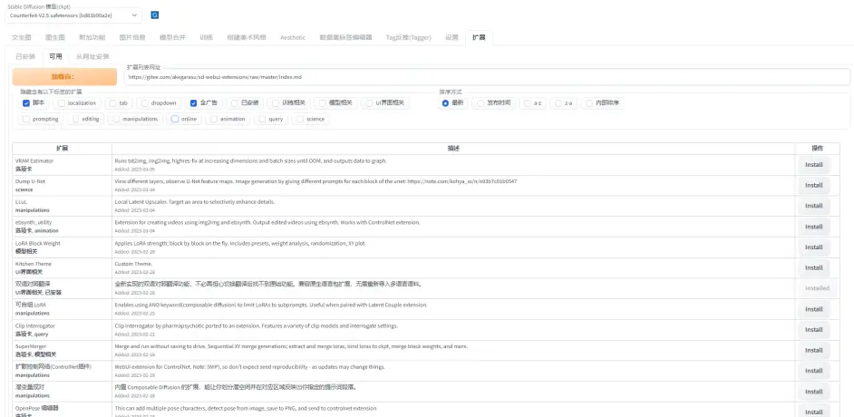

(2). 键盘敲击crtrl + f, 打开浏览器业内搜索, 输入WD并按回车

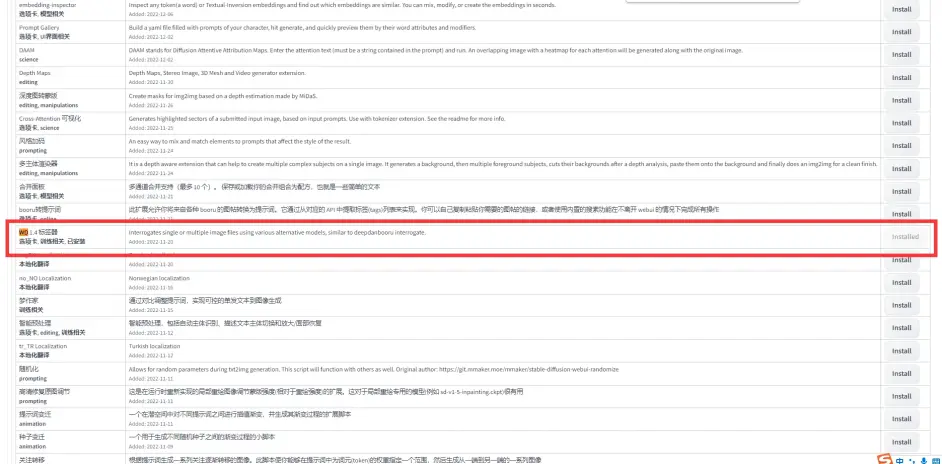

(3). 等待安装完成, 重启webui

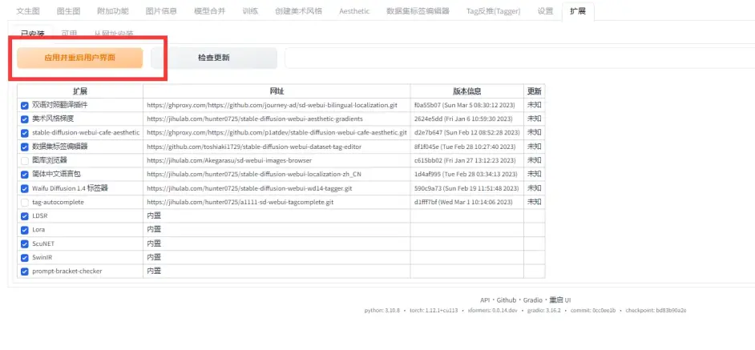

(4). 安装成功并重启webui后, 会出现以下备选框  

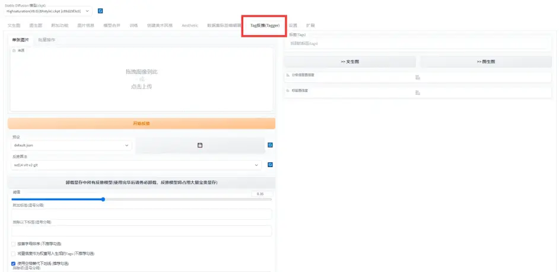

使用教程:  

(1). 备选框选择批量操作, 在输入目录下放入已经预处理好的图片, 可信度阈值设置为0.3, 开始打标.

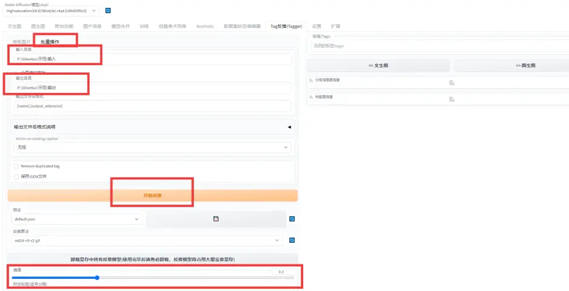

# **二. 数据集标签编辑器**

这个插件需要在github下载, github地址为:

https://github.com/toshiaki1729/stable-diffusion-webui-dataset-tag-editor

下载方法:

  

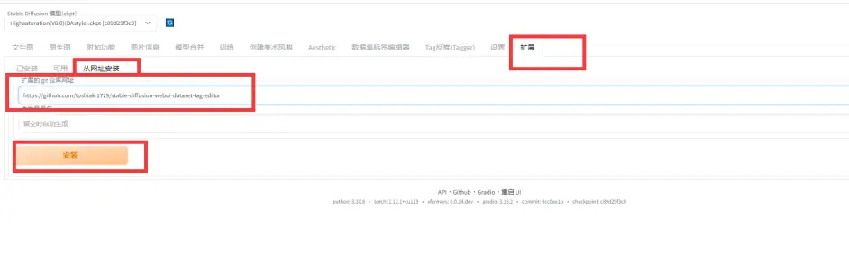

老规矩, 下载完后需要重启webui才能出现新的备选框.

使用教程:

按照下图进行选择, 目前选项为移除指定, tag以出现频率进行排序:  

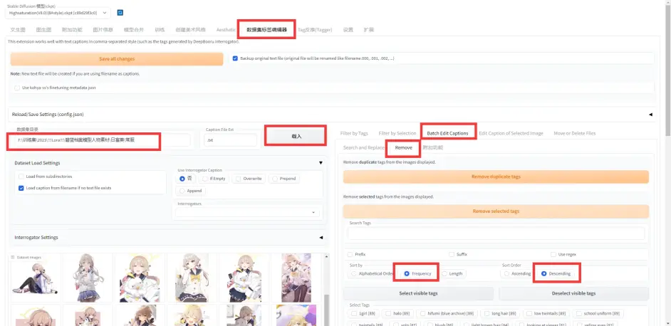

第一步: 清除重复tag:

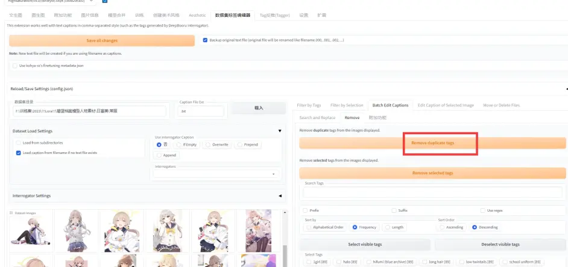

第二步, 清除特定tag及保存, 至于要怎么筛选, 第三部分再说:

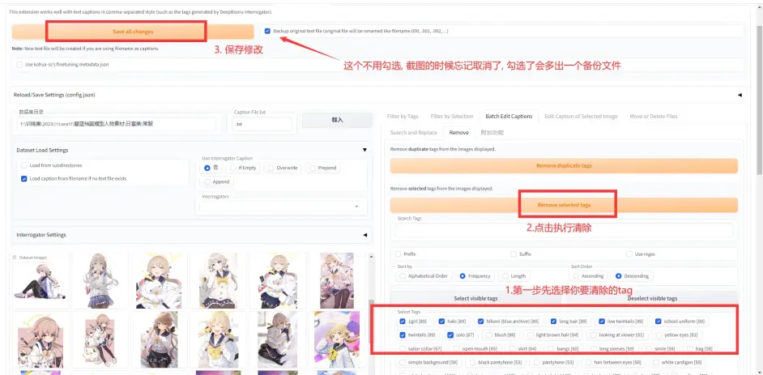

# 三. txt批量修改工具

**需要处理完训练集在执行, 一般触发词用1girl就行.**  

1\. 不需要安装解压即用, 很简单的一个软件, 软件内自带编写者的签名, 软件来源网络

链接：https://pan.baidu.com/s/1FEOG\_8EjG1BWIvAaICDSiA?pwd=hyoa 

提取码：hyoa 

2\. 使用方法:

打开软件, 选择添加文件夹, 找到你处理好标签的训练集所在的位置, 然后按照红框选择, 输入你想要的触发词并在触发词后面加一个英文的逗号, 开始添加到行的首尾执行.(注意, 只有txt内本身有内容才能添加, 空txt会添加失败)

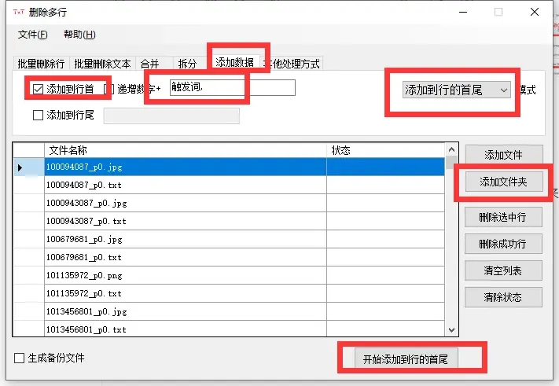


  

# **第二部分:本专栏所使用的GuiLora训练脚本安装使用方法, 及我平时使用的参数**

        lora训练脚本有很多个, 比如秋叶的脚本, gui脚本等, 一开始我也是用的秋叶脚本, 用起来很方便快捷且生成lora模型质量也没有问题, 但是后面用着用着发现找不到keep token, 然后发现以前占用有问题的gui版好像又修复好了, 所以有用回了gui版(为了keeptoken)

gui有人在油管搬运了安装教程视频

[

21:14

AI绘画 | 赛博coser自训练终极教程 | LORA安装指南✓参数详解✓使用指南✓最新更新✓Stable Diffusion训练✓【搬运机翻人工修改】

8.1万 264

视频 故障工作室


](https://www.bilibili.com/video/BV12s4y1b759)

我这里就用文字版简单概括一下  

github项目位置:

github.com/bmaltais/kohya\_ss

# **安装步骤:**

**一. 包依赖环境:**

python3.10.9:

https://www.python.org/ftp/python/3.10.9/python-3.10.9-amd64.exe

Git:

https://git-scm.com/download/win

Visual Studio:

https://aka.ms/vs/17/release/vc\_redist.x64.exe

**二.通过powershell安装该项目**

1.点击windows键, 如下图所示找到powershell, 右键点击, 以管理员模式运行

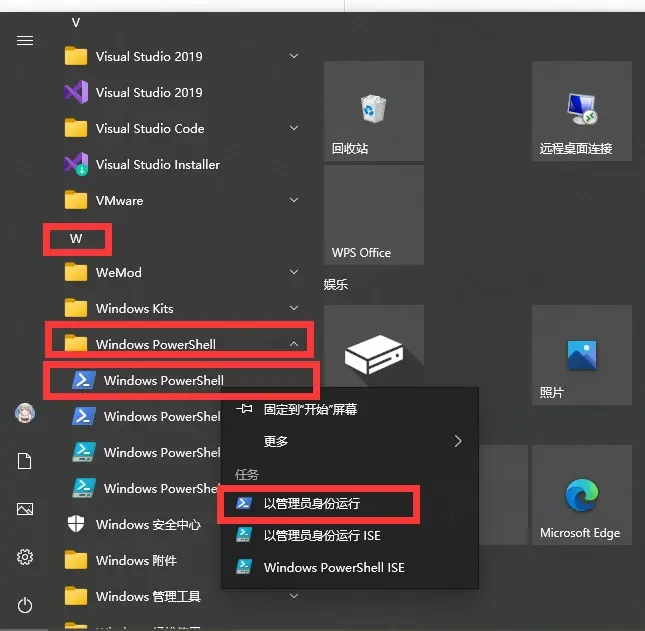

2\. 输入如下代码, 并填写A

```javascript
Set-ExecutionPolicy Unrestricted
```

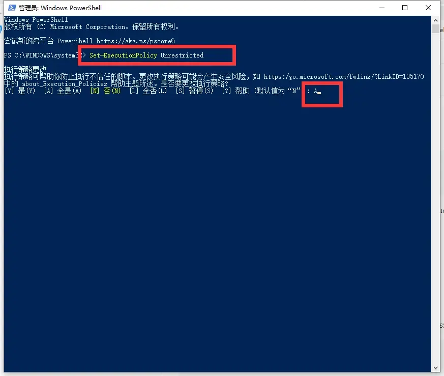

3.在你所想安装地位置先创建一个文件夹, 我这里示例是在P盘下建立一个文件夹, 并在文件夹内建立一个叫kohya\_ss的文件夹, 因为等下的脚本需要在kohya\_ss文件夹位置下运行, 当然你可以自己修改下面的脚本, 你喜欢就好

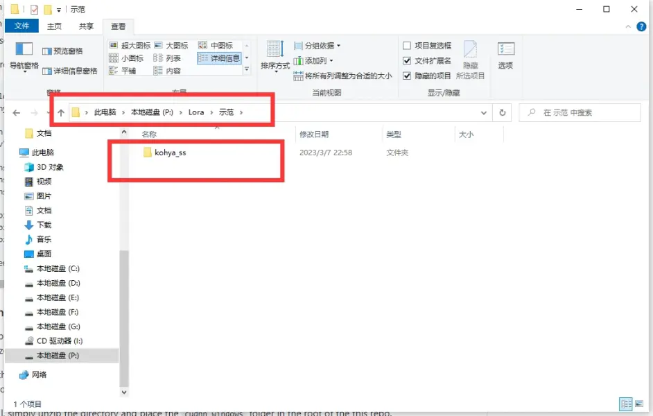

像第二步一样, 用管理员权限打开powershell, 切换到所需的盘符, 再CD到所在文件夹目录

```javascript
git clone https://github.com/bmaltais/kohya_ss.git
cd kohya_ss

python -m venv venv
.\venv\Scripts\activate

pip install torch==1.12.1+cu116 torchvision==0.13.1+cu116 --extra-index-url https://download.pytorch.org/whl/cu116
pip install --use-pep517 --upgrade -r requirements.txt
pip install -U -I --no-deps https://github.com/C43H66N12O12S2/stable-diffusion-webui/releases/download/f/xformers-0.0.14.dev0-cp310-cp310-win_amd64.whl

cp .\bitsandbytes_windows\*.dll .\venv\Lib\site-packages\bitsandbytes\
cp .\bitsandbytes_windows\cextension.py .\venv\Lib\site-packages\bitsandbytes\cextension.py
cp .\bitsandbytes_windows\main.py .\venv\Lib\site-packages\bitsandbytes\cuda_setup\main.py

accelerate config
```

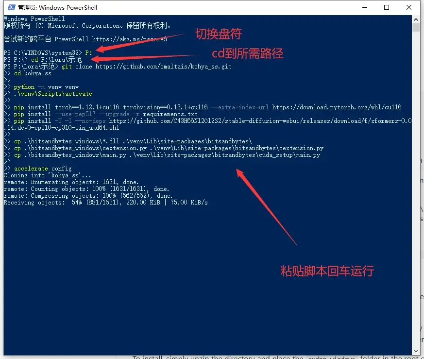

安装完以后, 会出现几个选项让你自己选择参数, 我懒得重新下载一遍, 直接用视频的截图代替

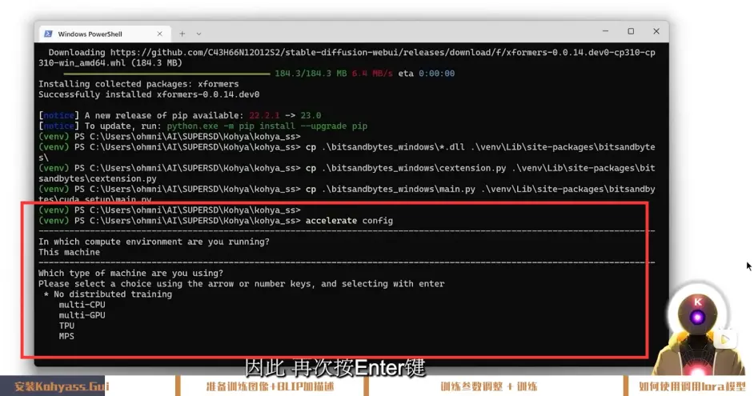

这里你需要选择的是(按顺序):

1.  This machine
    
2.  No distributed training
    
3.  no
    
4.  no
    
5.  no
    
6.  all
    
7.  fp16  
    

**注意, 视频内说选择是按键盘上下键, 如果不生效, 请尝试按键盘上的数字键1,2,3来选择**

**第三步, 额外步骤, 非N卡30系, 40系或同期运算卡的请跳过这一步.**

有一段优化代码, 下载一个环境插件实现提速, 再powershell内执行(记得是第二步的kohya\_ss目录下):

```javascript
.\venv\Scripts\activate

python .\tools\cudann_1.8_install.py
```

安装好以后, 在目录下找到gui.bat

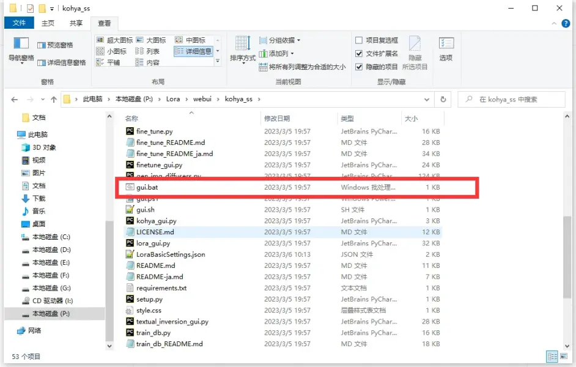

运行后, 复制下方的http到浏览器, 访问webui  

  

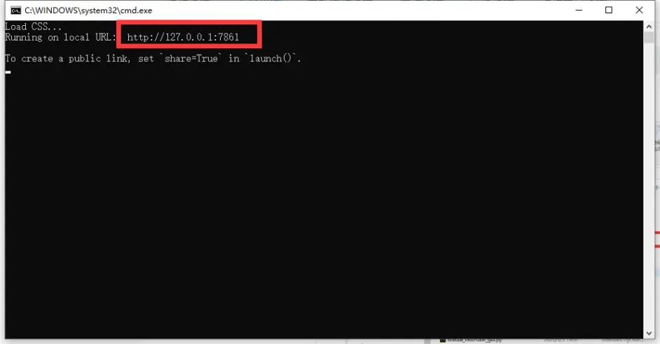

我的设置参数已经上传, 下载地址如下, 请根据自己需要修改:  

链接：https://pan.baidu.com/s/1FEOG\_8EjG1BWIvAaICDSiA?pwd=hyoa 

提取码：hyoa 

文件名为: LoraBasicSettings.json

因为gui是英文版的, 怕用的人看不懂, 下面介绍一下页面:

1.source model页面

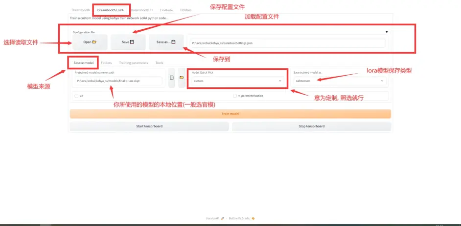

2.Folders页面

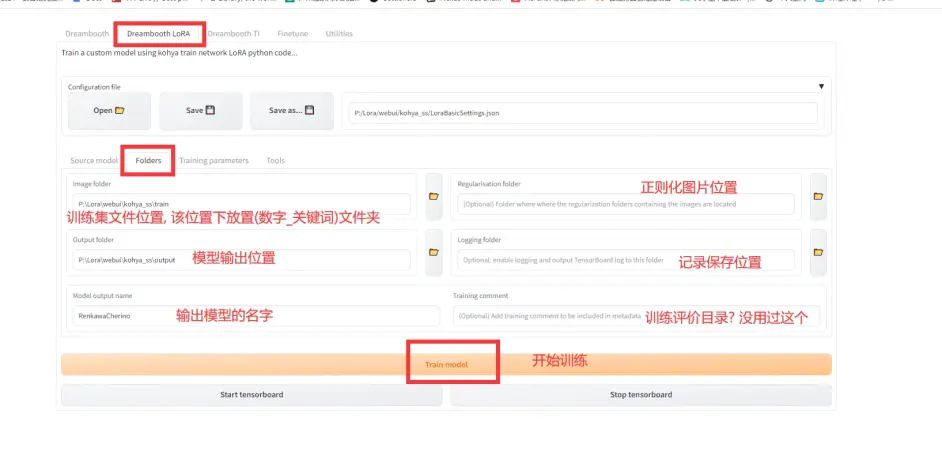

3.Training parameters, 这个页面参数太多了, 只挑一部分说

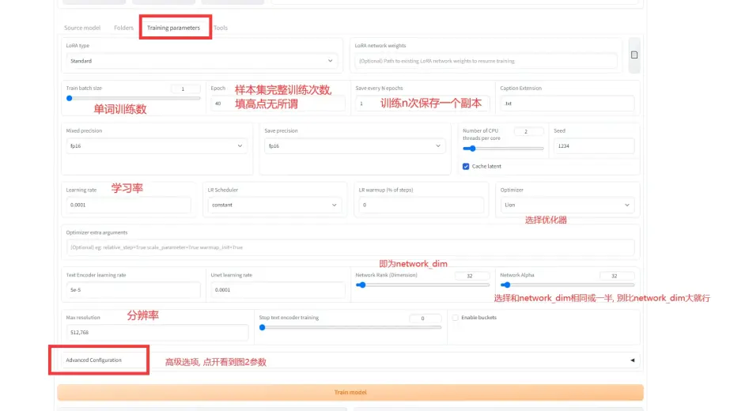

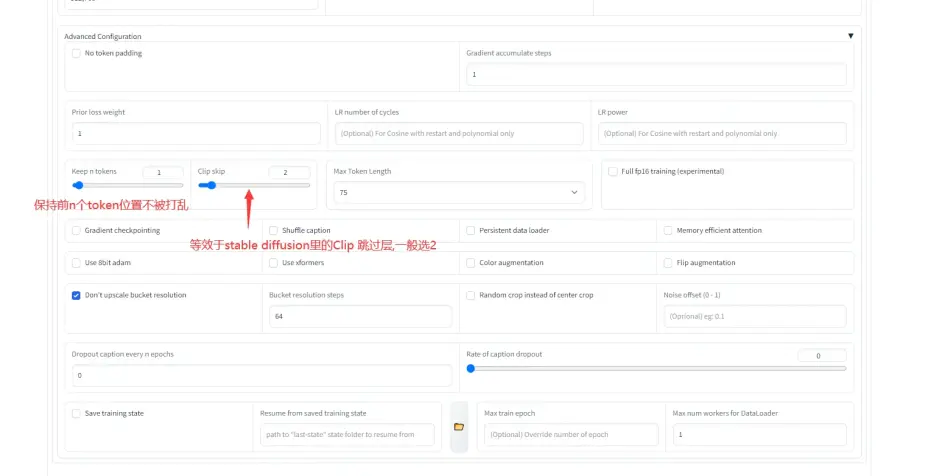

每个页面下的train model都是一样的, 就是开始训练的意思

4.lora融合工具, 和SD的模型融合一样, 感兴趣的自己研究

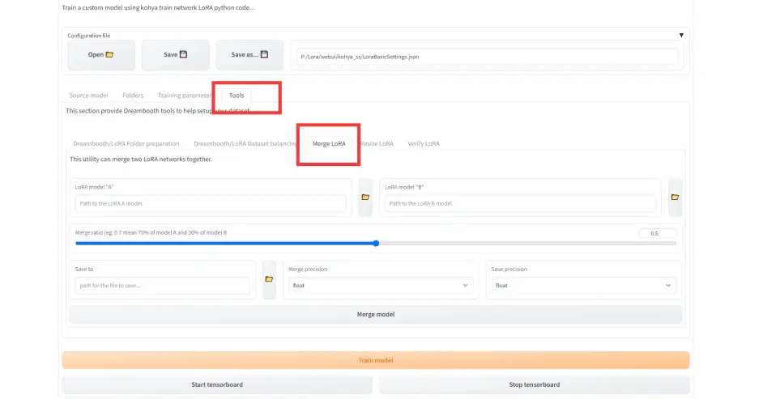


# 第三部分:数据集选择与处理(三种打标方式)

**数据集打标一般有三种方式:**  

1.全标

2.自定义剔除部分特征

3\. 单标+体位视角标

三种标效果其实都差不太多, 主要是调用方法和画风污染的区别, 我们后面一个个来说, 先说数据集的筛选.


  

# **(第三部分第一区块)训练集与模型质量等相关问题:**

**1\. 如何选取一个好的数据集?**

首先先放几个排序:

(1). 高质量(人物细节充足, 包括细节充足的3D模型截图) > 低质量(细节不充足, 模糊, 包括细节较少的人物建模)

(2). 多角度, 表情, 体位的训练集 > 只有正面和少量侧面的训练集 > 只有正面的训练集

(3). 不同的原图 > 差分(有较大区别) > 差分(只有表情变化) > 镜像原图

(4). 同一张原图分别裁剪成远中近 > 纯自动处理原图

(5). 不同服装同角色的训练集放到不同concept里 > 不同服装同角色的训练集放到一个concept里

(6). 不同服装同觉得在一个epoch内, repeat \* 图片总数相近 > 不同服装同觉得在一个epoch内, repeat \* 图片总数相差较大, 或不同图片数采用了相同repeat

(7). (这一条是最近六十多次尝试的情况下得到的结果, 样本量较少不一定有普遍性, 请把每个模型都进行尝试, 寻找你想要的哪一个) 

(打全标)同一训练集下Epoch在(8-20) > 同一训练集下Epoch在(5-7) > 同一训练集下Epoch在(21-40) > 同一训练集下Epoch在(>40) 

(自定义剔除部分特征与单标+体位视角标)同一训练集下Epoch在(6-10)  > 同一训练集下Epoch在(4-5) > 同一训练集下Epoch在(10-15) > 同一训练集下Epoch在(>15)

(8). 图片数量多的训练集, 可以按照需要适度提高repeat

(9). (这个要画个重点), 进过多次尝试, lora模型在画与训练集分辨率比例相同的图片时, 可以出更好的效果, 比如说你是512\*768的训练集, 换下来就是2:3, 那你画2:3的图片是, 比例畸形和丢细节的概率会下降, 打出阶段结论:

生成与训练集同长宽比例的图 > 正方形训练接的图生成长方形比例的图 > 比例差距较大的图(如2:3训练集的lora画3:2的full body图片)

(10). 在没有明显关系的数据集内切不可把人物切碎, 不然会出鬼图.(后面素材剪切介绍会详细说)

**2\. 如何判定素材质量**

(1). 细节是否清晰, 有没有出现细节反转(比如瞳色反转等),  原图分辨率

(2). 如果是3D模型图, 就要看模型是细节较多的建模还是细节较少的改模, 细节多可以提高3D模型图片的比重, 占比30%左右已经算是比较高的了, 这部分的作用是补全人物在不同身位的细节, 不用担心lora认不出这是人的哪部分, 他甚至能帮你把鞋底的花纹都给学了

(3). 训练集分辨率在原图原生支持的情况下高点比较好, 高分辨率可以提高细节的精细程度, 但是不宜过高, 我觉得最长边900-1024之间已经是极限了, 再提升已无明显收益, 当然你有钱嗯造, 那你喜欢就好. 一般不建议最短边小于512, 小于512出来的图片, 丢细节几率太高(不是绝对, 实践出真知)

(4). 模型nsfw性能与原始训练集有无nsfw有关, nsfw请放在一个独立的concept中,因为lora内不存在的标签, 就会在底膜里提取, 且nsfw数据集不可过多

**3.如何判定模型质量**

(1).老生常谈, 模型的细节还原程度

(2). 输入训练集原始token的基础上, 对这些tag进行小量且明显的修改(如衣服等), 看看会不会吐出原图, 吐出原图的话那大概率是过拟合了

(3). 检查不同concept之间是否出现了融合, 出现了融合会出现二合一, 严重影响还原度

(4). 使用时尝试多个不同的底模, 测试模型泛化性, 如果画风污染严重, 一般是过拟合了, 第二种可能就是数据集实在过少且过于单一.

(5). 个人认为触发词形lora和多token调用的lora没有孰优孰劣, 我只看还原度, 但是触发词形确实可以提高调用效率, 只是需要在数据集处理上多花时间.

  


  

# **(第三部分第二区块)训练集裁剪及tag处理:**

**1.如何裁剪好一张素材**

        训练集需要抽取出一小部分质量最好的图, 对图进行切分来扩充细节, 下图以BA的设定集切分为例:

原始图片:  

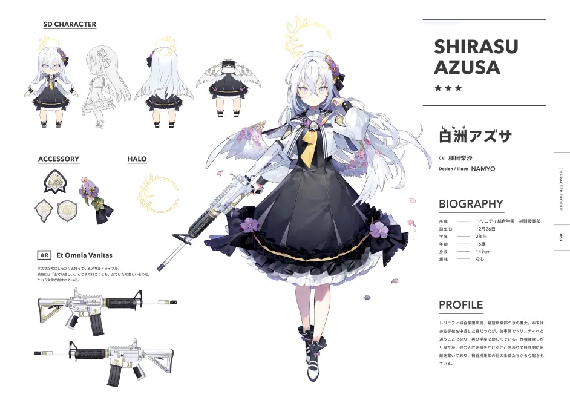

简单处理全身照(不一定要其他东西涂掉, 因为tag会自动过滤, 有时间涂掉的话一般会更好):

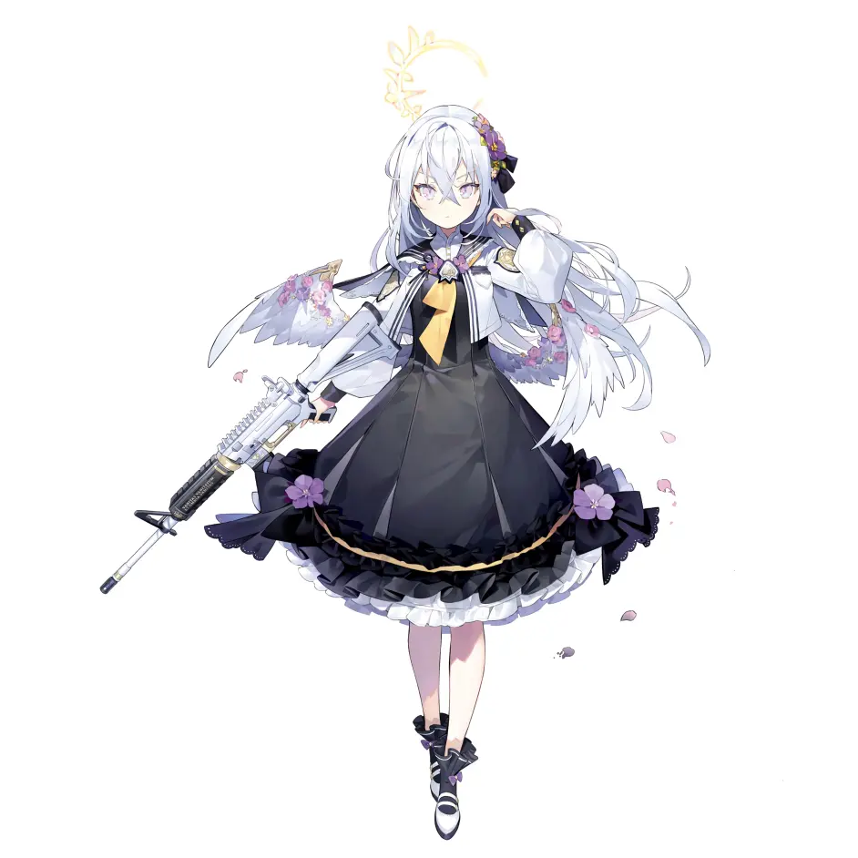

上本身与下半身:

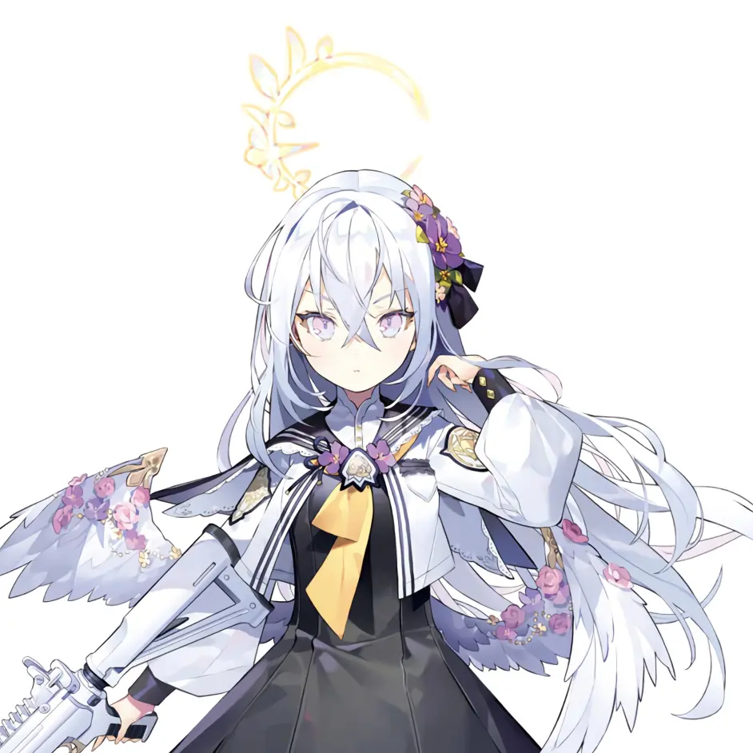

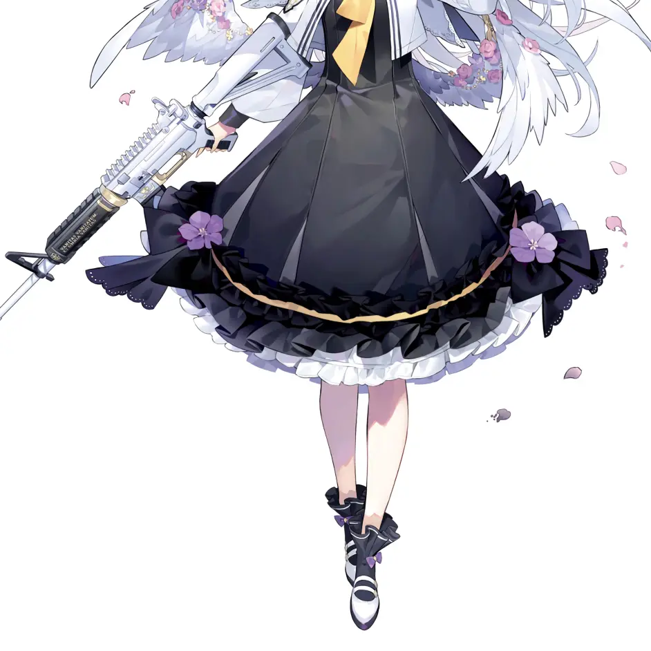

特写:


像这样图片之间存在明显关系, 一般是不会鬼图的, 比例可以近似于(全身 : 半身 : 局部特写) = (1 : 1 : 1), 不宜高过(1 : 1 : 2),(注意, 像BA这一类的, 可以增加特写数量, 保证光环质量)

其他的图片, 主要是追求更多的角度, 如下:

背后:

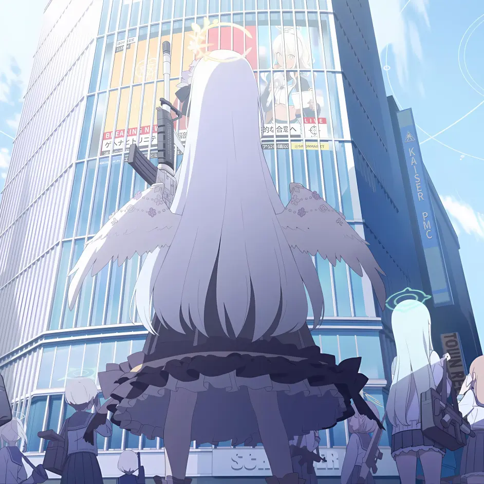

俯视特写:

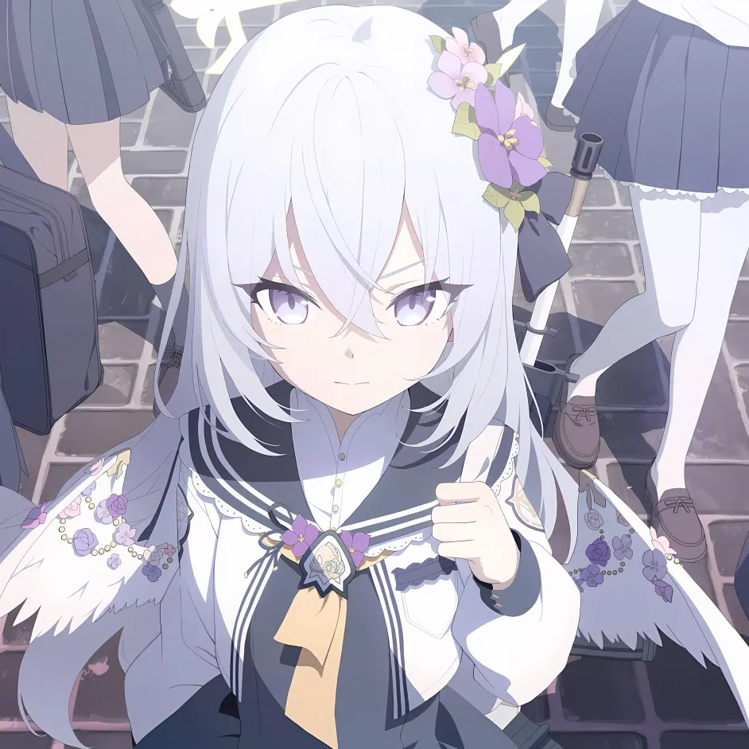

侧身

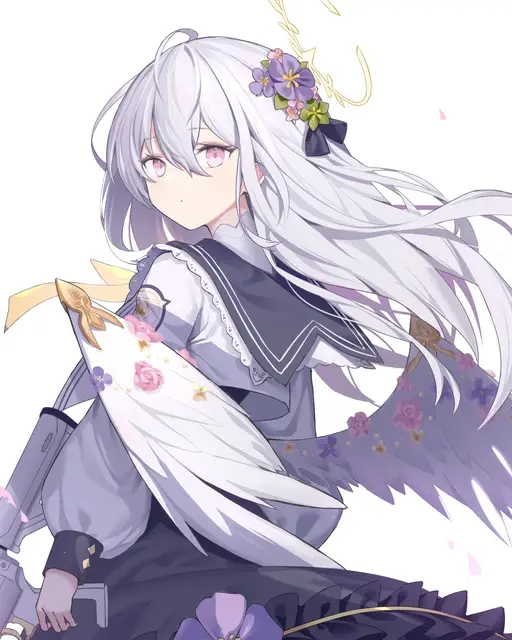

除了视角以外, 就是不同动作与表情的补全, 这里就不一一列举了, 可以自行尝试.

  


# **2.tag的处理**

这里要回收第一部分批量修改插件那部分的话头, 接着讲完  

在第三部分开头我提到了一般有三种打标方法:

1.全标

2.自定义剔除部分特征

3\. 单标+体位视角标

一个个来说:

(我个人比较喜欢打全标)

**一. 全标**  
全标一般用在两种情况: (1). 画风, (2). 省事快速地炼人物模型

全标的意思就是tagger打出来的标不做删标处理, 直接放进去训练, 因为在训练时, lora脚本会自动把图片拆分, 把相对应的部分加入到tag中, 在调用的时候, 就可以直接用tag调用所需的部分.

优点: 

1.不用处理tag少了一步麻烦

2.训练过程中的损失函数能真实地反应拟合程度, 观感上拟合度会稳定提高.

3.过拟合的可能性是三种训练方法里最低的

缺点:

1.画风污染可能性偏大

2.调用较困难

3\. 需要训练较高epoch

**二.自定义剔除部分特征**

        就是tagger打完标以后, 使用数据集标签编辑器删除特定tag, 使这个tag的内容寄存到第一个(也有说法是前4个, 我翻了一下项目没找到说这部分的内容, 也可能是我看的太快看漏了)tag中, 正因如此, 这个词就成为了你的lora模型的触发词.

        这里就要引入keep token 这个插件, 因为在lora训练的过程中, 是会读取tagger文本, 并将其打乱再放入训练的, 所以在没有keep token的情况下, 你无法保证你的触发词在第一位, 所以就会出现触发词无效的情况.

        另外, 任何需要删除tag后进行训练的模型, 那他在训练中的损失函数参考性就下降了,所以你在训练的过程中很可能会出现损失值在较高位振动的情况, 这是这种训练方法很容易导致的情况, 所以该训练方法下不看损失率, 只看试渲染图.  

下面是剔除tag操作指南:

老规矩, 打开页面, 加载训练集文件夹, 然后频率排序:

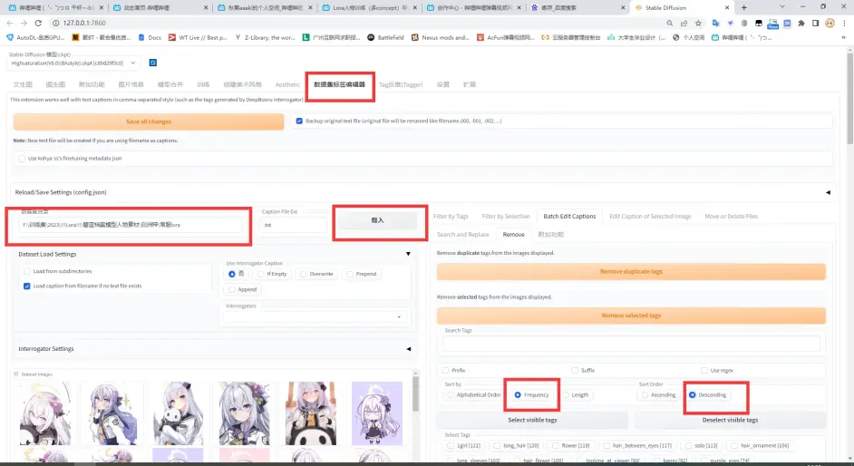

可以看到全部tag都读取好了

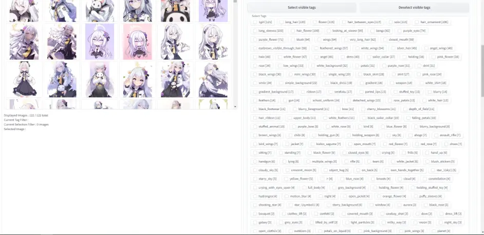

这时候就要人工寻找这些tag中属于人的部分, 处理分为下面几步:

1.  因为后续要加关键词, 所以1girl, solo这两个直接删掉, 等后面加回来
    
2.  需要删掉的部分: 找到人物的特征, 如long hair, hair\_between\_eyes, wings之类的, 删掉. 如果你想把人物和服装绑定, 那就把人物服装tag也删掉, 如school\_uniform, dress, skirt一类, 还有人物职业类的词条, 如angel之类, 也要删掉
    
3.  不能删掉的部分: (1)人物动作, 如: stand, sit, lying,holding之类; (2)人物表情, 如: smile, close eyes之类; (3)背景, 如simple\_background, white\_background之类; (4). 图片类型, 如full\_body, upper\_body, close\_up之类
    
4.  (BA角色不建议删除halo关键词)
    

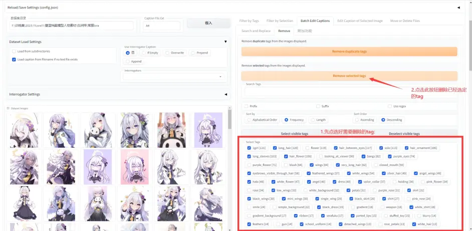

例图删的标不一定准确, 因为这只是为了演示, 我没仔细看

处理好以后别忘了回到页面最上面点击保存修改

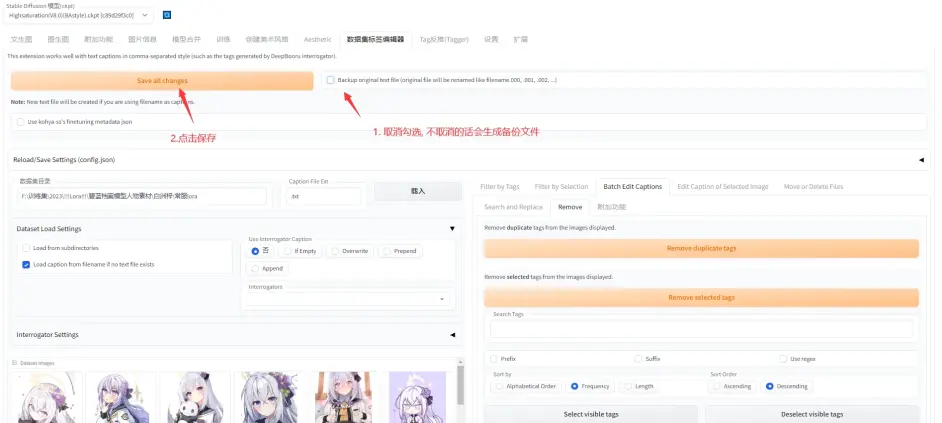

说完剔除tag以后, 说一下怎么回填关键词:  

打开txt批量处理工具(第一章有写下载地址, 没下载的翻回去看)

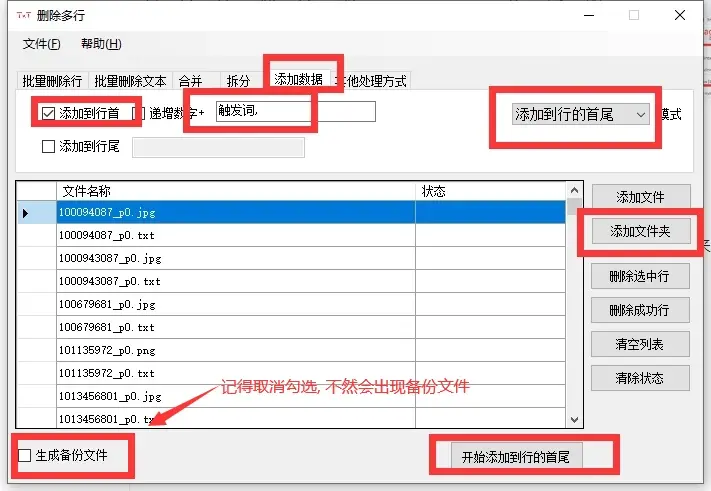

实际使用:

因为片面为了方便校准触发词, 所以把1girl ,solo也删了, 所以这里要补上

我这里填入了:

azusaoriginal(触发词), 1girl, solo,

  

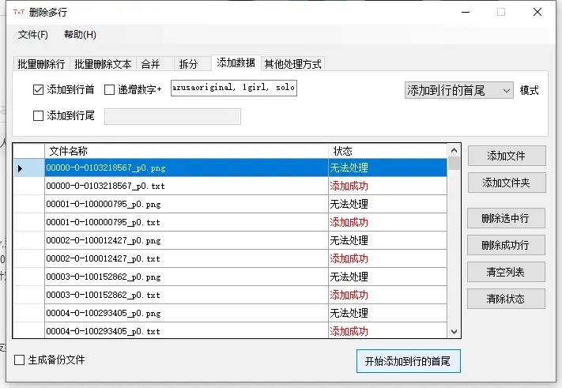

打开txt可以看到已经写入成功了

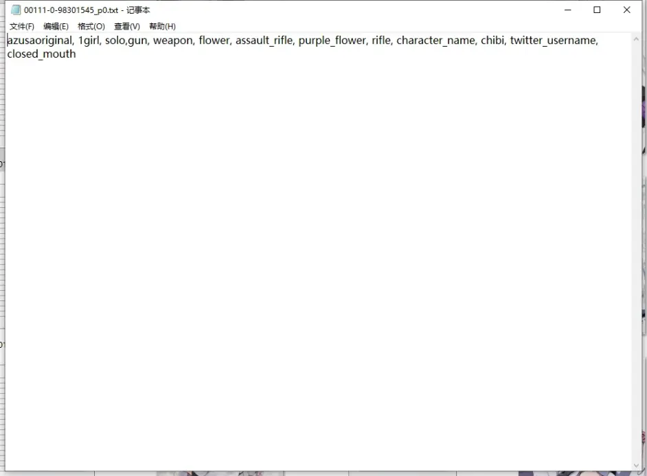

优缺点分析:

优点:

1.  可以使用触发词触发, 方便使用
    
2.  epoch次数需求较少
    

缺点:

1.太容易删漏了, 有些时候一下不注意触发词触发的图像会少部分细节

2\. 训练过程中损失函数可能会失效, 实际效果要看试渲染图才知道(其实也不算是缺点)

**三.单标+体位视角标**

这个方法最后开始是在群里看到的, 有人提到: "直接把全部标全部删了, 只留个触发词标就可以一了", 一开始的时候听了觉得, wc, 这是什么异端玩法, 后面试了试, 唉好像确实可行, 质量没有问题, 不得不感叹lora训练的亲民. 后面看到空佬还写了个脚本, 就是用前面的单tag外, 另外保留了人物动作, 他的专栏是:

[

Lora人物训练（多concept）导论

炼了三十多炉人物lora（以及十多炉焦茶），经历了很多试错。写一篇专栏，总结与分享我的经验。这是我的c站账号https://civitai.com/user/zbw这是一篇关于lora人物训练中，关于分concept，打标，尤其是防止concept之间融合的详细教程。夕史尔特尔铃兰零.训练配置训练脚本是直接从github上面直接拉的https://github.com/derriandistro/LoRA\_Easy\_Training\_Scripts（不知道为什么一样的训练集一样的参数用秋叶包每次都炸炉）。

文章 A-回首空城 4951 135 48


](https://www.bilibili.com/read/cv22050074?from=articleDetail)

  

这个方法用脚本一运行就行了, 非常省事

优缺点:

优点

1.  标签处理简单暴力, 处理的时候很方便
    
2.  可以使用触发词触发, 方便使用
    
3.  epoch次数需求较少
    

缺点:

1.训练过程中损失函数可能会失效, 实际效果要看试渲染图才知道(其实也不算是缺点)


  

# **第四部分:训练流程及后记**

训练流程其实没什么好说的, gui页面, 安装请翻到第二部分, 已经做了较为详细的说明.

主要来讲一下其他小问题:

1.  有说法说打标的标就是负面tag, 我个人觉得这个说法对也不完全对, 应该说, 有tag的就会寄存到tag自身, 如果没有tag的, 就会寄存到关键词文档的第一个token中, 即触发词, 触发词需要keep token来固定位置才能成为触发词, 不然可能会失效.
    
2.  在训练过程中, 尽量在低epoch中寻找效果较好的模型, 一般来说想提高质量需要都是在repeat上拉高一点点数值, 不是很建议采用高epoch, epoch高了过拟合可能性感觉比repeat高的过拟合可能性大.
    
3.  高质量素材越多越好
    
4.  在训练时, 使用batch size(单批处理图片数)可以加快训练进度, 但是batch size使用中应该遵循图量少batch size低的关系, 反之亦然. 我试过一般batch size和图片数在1:20左右比较好, 图片少batch size高很容易过拟合或者扭曲
    

训练集目录下文件如何划分:

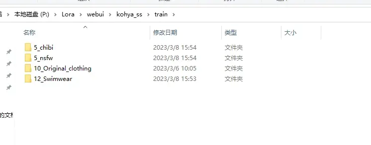

尽可能做到以下两点:

1.  不同concept(概念, 即同一人物不同衣服), repeat(即文件夹下划线前面的数字) \* 文件夹内图片数尽可能相同, 不要差距大到上百
    
2.  某些官设以外的服装(可以额外建立一个concept存放)  
    
3.  chibi, nsfw, 这类不要超过总训练量的5%, 训练量为全部concept训练数(即repeat \* 文件夹内图片数)相加, 不然有概率出现衣服在些奇奇怪怪的地方缺一块, 或者人物扭曲
    

**啊, 还有一件事**

如果你是用秋叶镜像(我不知道现在有没有加入keep token), 没有keep token 的情况下, 打全标会比较稳 

模型最重要的其实不是什么打标技巧, 是训练集的质量, 我是只看成果的, 难不难触发那些倒是次要的

  

还有关于network\_dim 和 network\_alpha这两个参数:

1.我建议做画风或者概念事可以拉满, 人物的话32-32其实已经足够了, 因为这两个数值越高, 画风污染的可能性越大

2.一个模型压到最低network\_dim 和 network\_alpha(即4-1)会怎样, 以下是实例

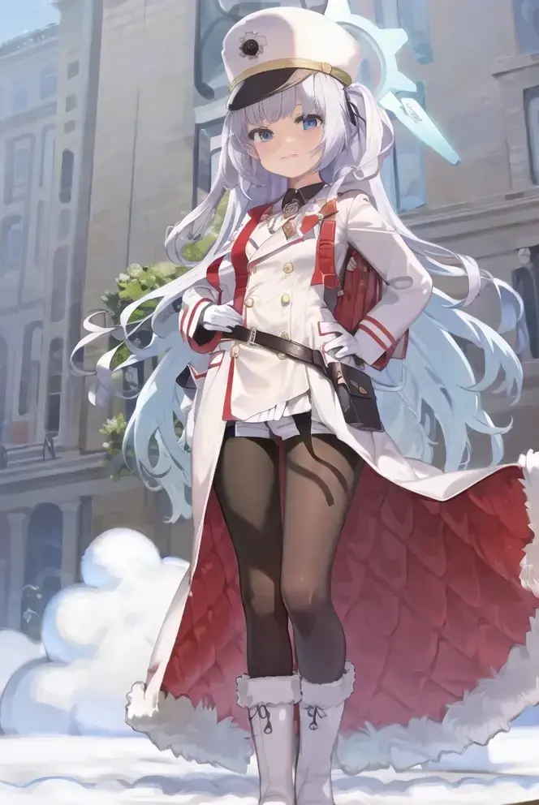

可以看到确实会丢细节, 但是认还是认得出人物的.  

  

如果已经确定关键词融合了怎么补救?  

在被融合了的关键词下, 添加被融合部分的正确token, 有概率能补救, 当然一般建议还是找未融合的备份, 或者检查训练次数后重新开始训练

  


  

# **第五部分: 后记**

你居然看完了这个专栏, 我很佩服你能把这个大量重复信息的文档看完, 这些重复信息是为了达到喂饭级的效果做出的牺牲, 写的尽可能详细.

 因为这个专栏我在编写的时候是没有写大纲的, 所以结构很混乱, 可能会提高你的理解成本, 我在此深表歉意.

因为编写时间较短, 且基本是我想到什么写什么的, 很可能有纰漏, 欢迎在评论区补充更正

还有最后:

这个专栏敲字敲了快7300+个字了, 把我敲麻了, 给我点个赞吧大佬, 谢谢大佬.