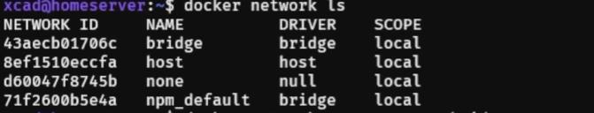
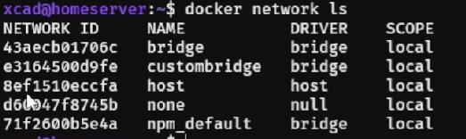

## 显示网络
```shell
docker network ls
```


## 创建网络
```shell
docker network create custombridge
```


## macvlan & ipvlan
虚拟同网段网络
```shell
# -d 驱动 子网 网关 ip范围 网卡 自定义名
docker network create -d macvlan --subnet 10.10.10.0/24 --gateway 10.10.10.1 --ip-range 10.10.10.5/32 -o parent=ens18 custommacvlan
```