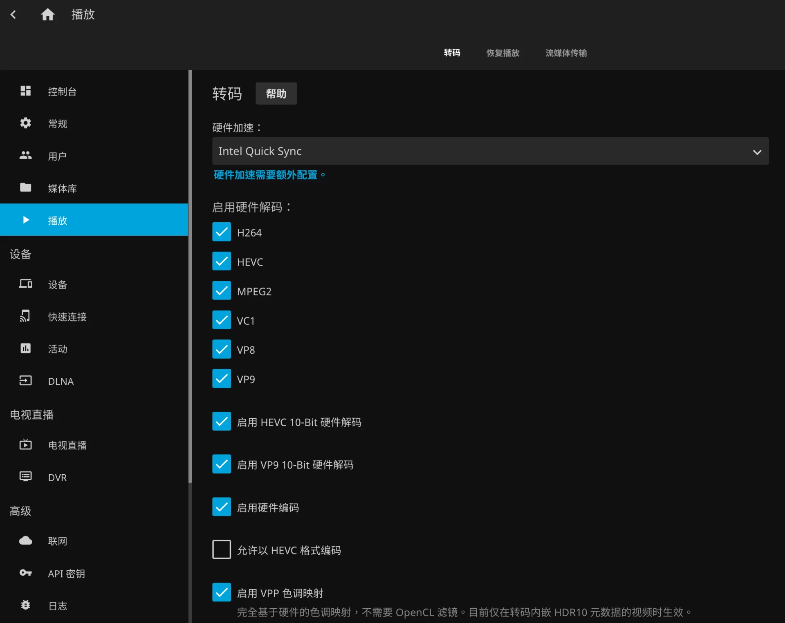
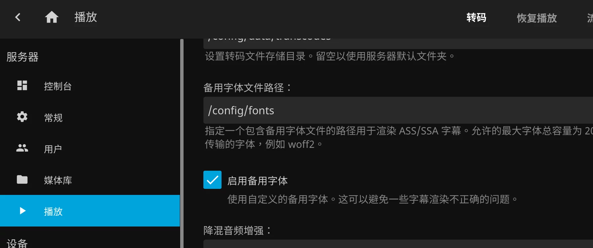

## 选择镜像
这里选择 LinuxServer.io 出品的 Jellyfin 镜像,镜像内已经配置了intel数据源，方便安装核显驱动

## 编辑docker-compose.yml文件
网络模式选择host，方便开启DLNA
   ```yml
   network_mode: host
   ```
映射显卡
   ```yml
   devices:
    - /dev/dri:/dev/dri
   ```
`docker-compose.yml`文件内容如下
```yml
version: "2.1"
services:
  jellyfin:
    image: lscr.io/linuxserver/jellyfin
    container_name: jellyfin
    network_mode: host
    environment:
      - PUID=1000
      - PGID=1000
      - TZ=Asia/Shanghai
    volumes:
      - /usr/local/docker/jellyfin/config:/config
      - /srv/dev-disk-by-id-ata-APPLE_HDD_ST2000DM001_S1E26LXJ-part1/cache:/cache
      - /srv/19a760a7-3df3-40fe-a787-818d39cefd52/me/medias:/aduiltmedias
      - /srv/19a760a7-3df3-40fe-a787-818d39cefd52/kid/animes:/animes
      - /srv/19a760a7-3df3-40fe-a787-818d39cefd52/kid/movies:/movies
      - /srv/19a760a7-3df3-40fe-a787-818d39cefd52/kid/tvshows:/tvshows
    ports:
      - 8096:8096
    restart: unless-stopped    
    devices:
      - /dev/dri:/dev/dri
```

## 进入容器的 bash 进行进一步操作
检查`ffmpeg-jellyfin`版本,4.0以上
```shell
/usr/lib/jellyfin-ffmpeg/ffmpeg version
```

## 安装 Intel 核显的解码驱动（non-free）
添加intel驱动源(linuxserver源已经添加)
```shell
sudo apt-get install -y gpg-agent wget
wget -qO - https://repositories.intel.com/graphics/intel-graphics.key | sudo apt-key add -
sudo apt-add-repository 'deb [arch=amd64] https://repositories.intel.com/graphics/ubuntu focal main'
```
安装
```shell
sudo apt update
sudo apt install intel-media-va-driver-non-free vainfo -y
```
装好以后，可以通过 vainfo 检查，能看到 iHD driver 的版本号是 21.1.1 以上几成功了：
```shell
libva info: Trying to open /usr/lib/x86_64-linux-gnu/dri/iHD_drv_video.so
vainfo: Driver version: Intel iHD driver for Intel(R) Gen Graphics - 21.2.1 (12ca7a4)
```

## 在 Jellyfin 中打开 Intel Quick Sync 和相应的功能
如图


## 安装cjk字体，解决部分封面中文显示方块的问题
在容器中执行
```shell
apt update
apt install fonts-noto-cjk-extra
```
## 为字幕添加中文备用字体，解决部分ass字幕乱码的问题
在 Jellyfin 挂载的目录中，新建一个文件夹 fonts。我放在了挂载的 config 目录中。
首先下载 [Noto Sans SC woff2 字体包](NotoSansCJKsc-hinted-standard.zip)。
解压后找到 NotoSansCJKsc-Medium.woff2 这个文件，将其复制到上面说的 fonts 目录中。
然后在控制台-播放中设置启用备用字体：
