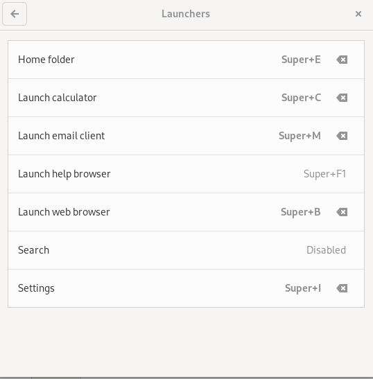
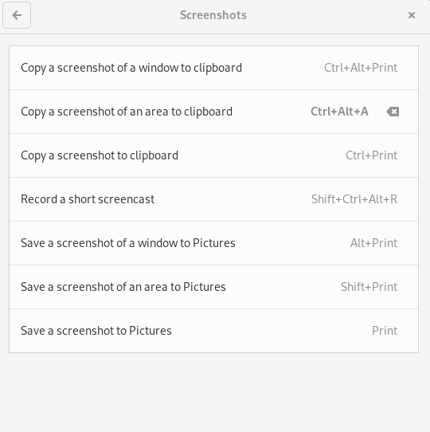
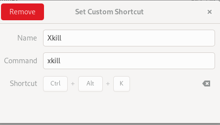
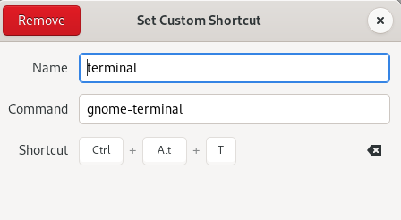

## 添加用户到sudo组

切换到root
```shell
su -
```
> 注意`-`不可忽略，否则可能出现部分命令无法执行的情况

添加`syaofox`用户到`sudo`组

```shell
usermod -aG sudo syaofox
```
## 安装wifi驱动
在仓库源中开启non-free
```shell
sudo apt update
sudo apt install firmware-iwlwifi

sudo modprobe -r iwlwifi
sudo modprobe iwlwifi
```


## 升级为sid

修改软件源为
```shell
deb http://repo.huaweicloud.com/debian/ sid main non-free contrib
deb-src http://repo.huaweicloud.com/debian/ sid main non-free contrib
```
更新后重启
```shell
sudo apt update
sudo apt dist-upgrade
```
重启后登录时切换到xorg显示模式

## 安装Synaptic包管理工具
作为系统自带软件商店的补充,可以看作apt的gui版
```shell
sudo apt install synaptic
```

## 启用Snap 和 FlatPak
打开`software` > 查找 `gnome software` > 进入第一个结果 > 下拉找到开关启用 > 重新启动software
<!-- 
## 安装flakpat
安装`gnmoe`插件
```shell
gnome-software-plugin-flatpak 
```

## 安装snap
```shell
sudo apt install snapd
``` -->
重启确保snap path正确更新
```shell
sudo snap install core
```
## 显卡驱动
### AMD 
```shell
sudo apt install firmware-linux firmware-linux-nonfree libdrm-amdgpu1 xserver-xorg-video-amdgpu
```
如果是游戏玩家,还可以安装vulkan
```shell
sudo apt install mesa-vulkan-drivers libvulkan1 vulkan-tools vulkan-validationlayers
```
### Nvida
```shell
# Install tool for hardware detection
sudo apt install nvidia-detect

# Perform the scan
sudo nvidia-detect

# Install recommended driver. It is nvidia-driver for me. Yours could be different.
sudo apt install nvidia-driver
```
## 安装微代码
```shell
# amd
sudo apt install amd64-microcode

# intel 
sudo apt install intel-microcode
```
## 安装 build-essential
```shell
sudo apt install build-essential dkms linux-headers-$(uname -r)
```
## 安装 restricted-extras
```shell
sudo apt install ttf-mscorefonts-installer rar unrar libavcodec-extra gstreamer1.0-libav gstreamer1.0-plugins-ugly gstreamer1.0-vaapi
```
## 设置Swappiness

让操作系统更多的使用内存而不是交换区

查看
```shell
cat /proc/sys/vm/swappiness # 60 (default)
```
修改配置文件
```shell
sudo nano /etc/sysctl.conf
```
在最后面追加
```shell
vm.swappiness=10 
```
重启后生效

## 修改grub菜单启动等待时间
```shell
sudo nano /etc/default/grub

sudo update-grub
```
修改`GRUB_TIMEOUT`时间为0

当需要选择菜单的时候可以在启动时按住`shift`键

## 安装中文输入法
卸载可能存在的输入法框架
```shell
sudo apt purge fcitx* ibus*
```
如果存在卸载就重启后继续

安装fcitx5输入法框架
```shell
sudo apt install --install-recommends fcitx5 fcitx5-chinese-addons fcitx5-material-color
```
gnome
```shell
sudo apt install gnome-shell-extension-kimpanel
```
在应用程序面板启动`fcitx5`,并启动`fcitx5 configuration`添加拼音输入法

重启

## 调整鼠标滚轮
安装
```shell
sudo apt install imwheel
```
创建配置文件
```shell
sudo nano ~/.imwheelrc
```
编辑如下内容
```nginx
".*"
None,      Up,   Button4, 3
None,      Down, Button5, 3
Control_L, Up,   Control_L|Button4
Control_L, Down, Control_L|Button5
Shift_L,   Up,   Shift_L|Button4
Shift_L,   Down, Shift_L|Button5
```
`3`就是鼠标滚轮的速度,可以自行调节

重新加载配置
```shell
imwheel -kill
```
添加一个登录运行脚本
```shell
nano ~/.config/autostart/imwheel.desktop 
```
编辑内容如下
```nginx
[Desktop Entry]
Name=imwheel
Exec=/usr/bin/imwheel
Terminal=false
Type=Application
Comment=custum mouse wheel speed
Categories=System;
```

## 设置常用快捷键

Settings > Keyboard 
Launchers



screenshots



view and customize Shortcuts




## 设置人脸解锁

安装[howdy](https://github.com/boltgolt/howdy)

下载deb包 `howdy_2.6.1.deb`
安装
```shell
sudo dpkg -i howdy_2.6.1.deb
```
出现依赖错误后执行一下命令修复并安装
```shell
sudo apt install -f
```
安装辅助包
```shell
sudo apt install v4l-utils
```
查看摄像头设备
```shell
v4l2-ctl --list-devices
```
得到自己的涉嫌头设备路径
```shell
Integrated Camera: Integrated C (usb-0000:03:00.3-3):
	/dev/video0
	/dev/video1
	/dev/video2
	/dev/video3
	/dev/media0
	/dev/media1

```
配置摄像头
```shell
sudo howdy config
```
修改为自己的设备地址
```shell
# The path of the device to capture frames from
# Should be set automatically by an installer if your distro has one
device_path = /dev/video0

```
添加脸部
```shell
sudo howdy add
```
给脸部取一个名字后按提示完成操作即可

## 安装 Gnome Extensions
访问[GNOME Extensions website](https://extensions.gnome.org/)

## 安装 Extension manager
```shell
flatpak install flathub com.mattjakeman.ExtensionManager
```

## 通过 Gnome Extensions 安装一些插件
- Dash to Dock 让dock一直显示
- internet Speed Monitor 在toppanel显示网速
- TopIconsFix 常用应用程序状态栏图标
- User Themes 开启,设置主题

## 安装主题
访问 [GNOME Look](https://www.gnome-look.org/browse/) 挑选
好看的图标Papirus

**主题的安装方法**
将下载的主题解压后放入`~/.themes`,文件夹不存在就创建
将下载的图标解压后放入`~/.icons`,文件夹不存在就创建
然后在`tweaks`的`appearance`中启用

## 找回标题栏最小化按钮
Tweaks > Window Titlebars > Enable Minimize

## 安装hugo
```shell
snap install hugo --channel=extended
```
## 安装htop
```shell
sudo apt install htop
```
## 安装nerd字体
```shell
sudo apt install fonts-firacode
```

## 安装git并设置github

安装git
```shell
sudp apt install git
```
设置git信息
```shell
# 用户名
git config --global user.name "syaofox"

# 密码
git config --global user.email "syaofox@gmail.com"

# pull 默认合并
git config --global pull.rebase false

# 大小写敏感
git config --global core.ignorecase false 
```
创建ssh密钥
```shell
ssh-keygen -t rsa -b 4096 -C "syaofox@gmail.com"
```
密钥文件默认保存在`~/.ssh`目录下

配置github
- 打开[github ssh key设置页面](https://github.com/settings/keys)
- 添加SSHKey
- 取个名字，填入公钥`~/.ssh/id_rsa.pub`的内容
测试github是否配置成功
```shell
ssh -T git@github.com
```
## 设置nas上的ssh免密码登录
通常免密码访问的公钥是添加在登录用户的 `$HOME/.ssh/authorized_keys` 文件中的，但第一次配置时 `$HOME/.ssh` 目录可能不存在，手工创建`.ssh` 目录又可能因目录权限问题导致免密码配置失败。

因此，简单方法就是让系统生成`.ssh` 目录，方法是让系统生成一个 RSA 密钥对时会自动创建`.ssh` 目录，具体操作命令如下：
```shell
ssh-keygen -C "syaofox_dnas" -b 1024 -f $HOME/.ssh/id_rsa -N "" -t rsa

# 内容为本地公钥~/.ssh/id_rsa.pub内容
echo "内容" >> $HOME/.ssh/authorized_keys

# 修改权限
chmod 644 $HOME/.ssh/authorized_keys
```

## 安装微软软件

安装必要依赖
```shell
sudo apt install apt-transport-https ca-certificates curl software-properties-common wget -y
```
导入微软GPGKey和Repository
```shell
# edge
curl https://packages.microsoft.com/keys/microsoft.asc | gpg --dearmor > microsoft.gpg
sudo install -o root -g root -m 644 microsoft.gpg /etc/apt/trusted.gpg.d/

sudo sh -c 'echo "deb [arch=amd64] https://packages.microsoft.com/repos/edge stable main" > /etc/apt/sources.list.d/microsoft-edge-dev.list'
sudo rm microsoft.gpg

# code
curl https://packages.microsoft.com/keys/microsoft.asc | gpg --dearmor > microsoft.gpg
sudo install -o root -g root -m 644 microsoft.gpg /usr/share/keyrings/microsoft-archive-keyring.gpg
sudo sh -c 'echo "deb [arch=amd64,arm64,armhf signed-by=/usr/share/keyrings/microsoft-archive-keyring.gpg] https://packages.microsoft.com/repos/vscode stable main" > /etc/apt/sources.list.d/vscode.list'

```
更新仓库
```shell
sudo apt update
```
安装edge
```shell
sudo apt install microsoft-edge-stable
```
安装vscode
```shell
sudo apt install -y code
```
## 安装utools
[tools](https://u.tools/)

## 安装fdm
[freedownloadmanager.org/](https://www.freedownloadmanager.org/zh/download.htm)


## 安装kvm虚拟机
现实虚拟核心数,越高越好
```shell
egrep -c '(vmx|svm)' /proc/cpuinfo
```
更新缓存
```shell
sudo apt update
```
安装包
```shell
sudo apt install qemu-kvm libvirt-clients libvirt-daemon-system bridge-utils virtinst libvirt-daemon
```
安装GUI
```shell
sudo apt install virt-manager -y
```
查看并开启虚拟网络
```shell
sudo virsh net-list --all

sudo virsh net-start default
sudo virsh net-autostart default
```
设置加载虚拟模块
```shell
sudo modprobe vhost_net
```
确认是否加载
```shell
lsmod | grep vhost
```
创建桥接网络(可选)

查看ip
```shell
ip a
```
编辑ip配置文件
```shell
sudo nano /etc/network/interfaces
```
固定ip
```shell
#Configure bridge and give it a static ip
auto br0
iface br0 inet static
        address 10.10.10.100
        netmask 255.255.255.0
        network 10.10.10.1
        broadcast 10.10.10.255
        gateway 10.10.10.1
       bridge_ports enp0s3
        bridge_stp off
        bridge_fd 0
        bridge_maxwait 0
        dns-nameservers 10.10.10.1

```
动态ip
```shell
## DHCP ip config file for br0 ##
auto br0
 
# Bridge setup
iface br0 inet dhcp
bridge_ports enp0s3
```
重启网络管理让配置生效
```shell
sudo systemctl restart networking.service
or
sudo /etc/init.d/networking restart
```
用`ip a`查看可以看到`br0`的桥接网络

gui创建虚拟机安装windows
用virt-io提高虚拟机性能,参考

<!--  -->


安装remmina远程链接虚拟机创建共享目录

```shell
flatpat install remmina
```
