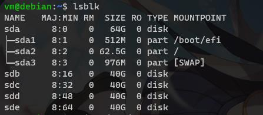
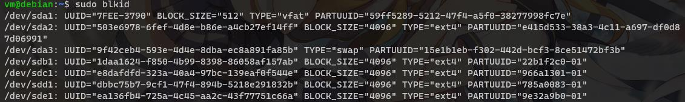
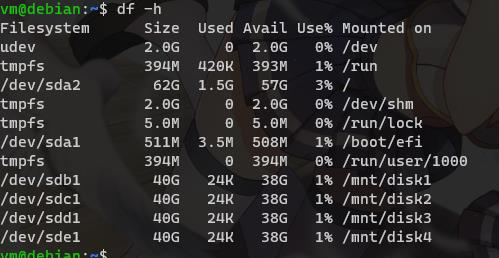

## 安装sudo
```shell
apt install sudo
```

## 添加用户到sudo
```shell
usermod -aG sudo username
```

## 设置静态ip

备份配置文件

```shell
sudo cp /etc/network/interfaces /etc/network/interfaces.bak
```
修改配置文件
```shell
sudo nano /etc/network/interfaces
```
原配置文件内容
```shell
# This file describes the network interfaces available on your system
# and how to activate them. For more information, see interfaces(5).

source /etc/network/interfaces.d/*

# The loopback network interface
auto lo
iface lo inet loopback

# The primary network interface
allow-hotplug eth0
iface eth0 inet dhcp

```

修改后内容
```shell
# This file describes the network interfaces available on your system
# and how to activate them. For more information, see interfaces(5).

source /etc/network/interfaces.d/*

# The loopback network interface
auto lo
iface lo inet loopback

# The primary network interface
allow-hotplug eth0
iface eth0 inet static
  address 10.10.10.101
  netmast 255.255.255.0
  gateway 10.10.10.1
  dns-nameservers 10.10.10.1
```
重启网络服务
```shell
sudo systemctl restart networking
```

## 更换软件源
备份软件源配置文件
```shell
sudo cp /etc/apt/sources.list /etc/apt/sources.list.bak
```
打开源配置
```shell
sudo nano /etc/apt/sources.list
```
替换`security.debian.org`为`repo.huaweicloud.com`
修改后的`source.list`如下:
```shell
# deb http://repo.huaweicloud.com/debian/ bullseye main

deb http://repo.huaweicloud.com/debian/ bullseye main non-free contrib
deb-src http://repo.huaweicloud.com/debian/ bullseye main non-free contrib

deb http://repo.huaweicloud.com/debian-security bullseye-security main contrib non-free
deb-src http://repo.huaweicloud.com/debian-security bullseye-security main contrib non-free

# bullseye-updates, to get updates before a point release is made;
# see https://www.debian.org/doc/manuals/debian-reference/ch02.en.html#_updates_and_backports
deb http://repo.huaweicloud.com/debian/ bullseye-updates main contrib non-free
deb-src http://repo.huaweicloud.com/debian/ bullseye-updates main contrib non-free
```
更新
```shell
sudo apt update && sudo apt upgrade
```
## 增加别名
编辑home目录下的`.bashrc`文件
```shell
nano .bashrc
```
增加一行
```shell
alias ll='ls -lha'
```
重新加载
```shell
source .bashrc
```

## 设置硬盘
### 初始化硬盘
用`lsblk`查看硬盘

分区并格式化硬盘
```shell
sudo fdisk /dev/sdb
sudo mkfs.ext4 /dev/sdb1

sudo fdisk /dev/sdc
sudo mkfs.ext4 /dev/sdc1

sudo fdisk /dev/sdd
sudo mkfs.ext4 /dev/sdd1

sudo fdisk /dev/sde
sudo mkfs.ext4 /dev/sde1
```
## 挂载硬盘
创建挂载点目录
```shell
sudo mkdir /mnt/disk{1,2,3,4} 
sudo mkdir /mnt/storage


```


用`UUID`来挂载

使用`blkid`命令查看硬盘`uuid`



备份`/etc/fstab`
```shell
sudo cp /etc/fstab /etc/fstab.bak
```

往`/etc/fstab`追加硬盘uuid信息方便后续修改
```shell
sudo blkid | grep "/dev/sd" | sudo tee -a /etc/fstab
```
修改`/etc/fstab`挂载硬盘
```shell
sudo nano /etc/fstab
```
编辑挂载信息
```shell
# data disks
UUID=1daa1624-f850-4b99-8398-86058af157ab       /mnt/disk1      ext4    noatime,rw      0       0
UUID=e8dafdfd-323a-40a4-97bc-139eaf0f544e       /mnt/disk2      ext4    noatime,rw      0       0
UUID=dbbc75b7-9cf1-47f4-894b-5218e291832b       /mnt/disk3      ext4    noatime,rw      0       0
UUID=ea136fb4-725a-4c45-aa2c-43f77751c66a       /mnt/disk4      ext4    noatime,rw      0       0
```
挂载硬盘
```shell
sudo mount -a
```
检查挂载是否成功
```shell
df -h
```


## mergerfs
### 安装
安装依赖
```shell
sudo apt install fuse
```
安装mergerfs
```shell
wget https://github.com/trapexit/mergerfs/releases/download/2.33.3/mergerfs_2.33.3.debian-bullseye_amd64.deb
sudo dpkg -i mergerfs_2.33.3.debian-bullseye_amd64.deb
```
编辑`/etc/fstab`添加以下内容
```shell
# mergerfs
/mnt/disk*      /mnt/storage    fuse.mergerfs   allow_other,use_ino,cache.files=off,dropcacheonclose=true,category.create=mfs,ignorepponrename=true,minfreespace=1G     0       0
```
挂载硬盘
```shell
sudo mount -a
```
检查挂载是否成功
```shell
df -h
```
修改权限
```shell
sudo chown -R vm:vm /mnt/disk1
sudo chown -R vm:vm /mnt/disk2
sudo chown -R vm:vm /mnt/disk3
sudo chown -R vm:vm /mnt/disk4
sudo chown -R vm:vm /mnt/storage
```
## 设置samba共享
安装samba
```shell
sudo apt update
sudo apt install samba
```
查看`smbd`服务是否开启
```shell
sudo systemctl status smbd
```
如果开启就关闭服务
```shell
sudo systemctl stop smbd
```
备份配置文件
```shell
sudo mv /etc/samba/smb.conf /etc/samba/smb.conf.bak
```
创建新的配置文件
```shell
sudo nano /etc/samba/smb.conf
```
编辑如下内容
```shell
[global]
server string = debian Server
workgroup = WORKGROUP
security = user
map to guest = Bad User
name resolve order = bcast host
include = /etc/samba/shares.conf
```
创建单独的shares配置文件
```shell
sudo nano /etc/samba/shares.conf
```
编辑如下内容
```shell
[storage]
path = /mnt/storage
# force user = vm
# force group = vm
valid users = me
create mask = 0664
force create mode = 0664
directory mask = 0775
force directory mode = 0775
public = yes
writable = yes

```
设置对应用户`vm`的samba登录密码
```shell
sudo smbpasswd -a vm
```

启动smbd服务
```shell
 sudo systemctl start smbd
```

## 安装docker
安装https支持
```shell
sudo apt install ca-certificates curl gnupg lsb-release
```
添加docker官方GPG key
```shell
curl -fsSL https://download.docker.com/linux/debian/gpg | sudo gpg --dearmor -o /usr/share/keyrings/docker-archive-keyring.gpg
```
添加稳定版仓库
```shell
echo \
  "deb [arch=$(dpkg --print-architecture) signed-by=/usr/share/keyrings/docker-archive-keyring.gpg] https://download.docker.com/linux/debian \
  $(lsb_release -cs) stable" | sudo tee /etc/apt/sources.list.d/docker.list > /dev/null
```
安装docker
```shell
 sudo apt update
 sudo apt install docker-ce docker-ce-cli containerd.io
```
安装docker-compose
```shell
sudo curl -L https://github.com/docker/compose/releases/download/v2.2.3/docker-compose-linux-`uname -m` > ./docker-compose
sudo chmod +x ./docker-compose
sudo mv ./docker-compose /usr/local/bin/docker-compose
```
添加vm用户docker启动权限
```shell
sudo usermod -aG docker vm
```
切换用户后生效

<!-- ## 安装图形面板cockpit
```shell
sudo apt install cockpit 
```
默认端口9090 -->

<!-- 安装`cockpit-file-sharing`
```shell
curl -sSL https://repo.45drives.com/setup | sudo bash
sudo apt install cockpit-file-sharing
``` -->

## 软件
- [Photoview](https://github.com/photoview/photoview) 局域网相册
- [photoprism](https://docs.photoprism.app/getting-started/docker-compose/) 局域网相册
  - 数据库密码不能小于6位数
- [jellyfin](https://hub.docker.com/r/linuxserver/jellyfin) 局域网影音服务
- [homer](https://github.com/bastienwirtz/homer) 个性化控制台
- [netdata](https://github.com/netdata/netdata) 监控面版