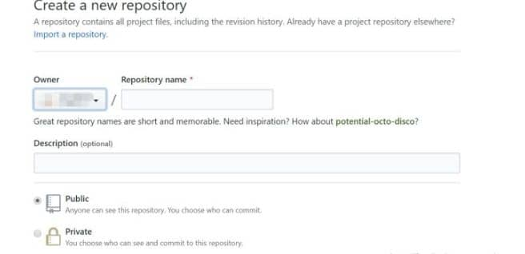
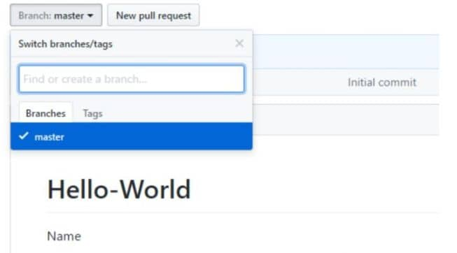
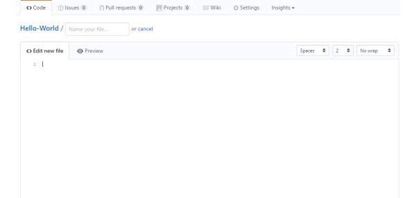
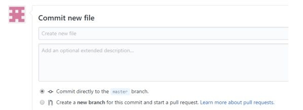
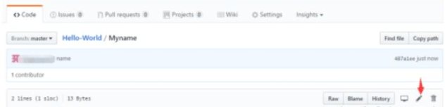
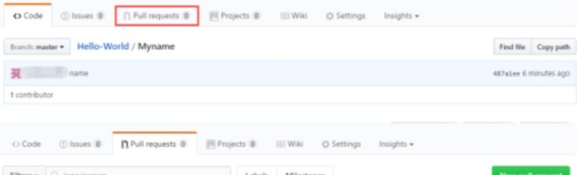
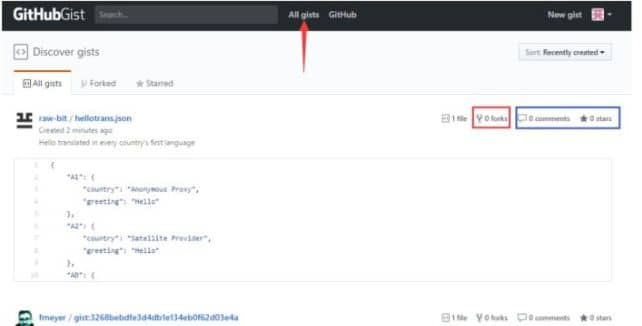
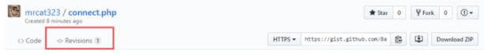

即使作为编程新手，刚刚接触GitHub，也建议你从最简单的项目入手，而不是单纯研究大量理论。

这个3000+ starts的优（宅）秀（男）项目：[komeiji-satori](https://link.zhihu.com/?target=https%3A//github.com/komeiji-satori)/[Dress](https://link.zhihu.com/?target=https%3A//github.com/komeiji-satori/Dress)就非常适合初学者Pick。

作为全球最大同性交友平台，这个项目里集结了大量的女装大佬。

而且，这应该是 **GitHub 最低准入门槛项目**了，就算不会写代码也都可以参加。你可以在这里学习 GitHub 的用法，从克隆项目、创建分支、提交和同步修改，到合并分支请求的整套流程，只需一次即可熟悉 Git/GitHub 的使用。

  

**当然，你还要事先准备至少一张你的女装照。**

好了，接下来分享一些正经的。

基于这个项目，你就可以马上开始你的实践了。

  

**第一步：打开官网**：[https://github.com](https://link.zhihu.com/?target=https%3A//github.com/)

注册一个帐户。

**第二步：创建仓库**

填写仓库的名字和描述。

创建好了之后，点击“Branch master”，创建分支——在文本框中输入分支名称和描述，然后点击蓝色部分确认。

### **第三步：点击创建一个新文件**

  

输入想要提交的代码以及下方的文件名和描述后，点击最下方的Commit new file即可。

### **第四步：修改&保存修改**

在github上，提交&保存修改的操作是commits。每一次的commit都会被记录，可以被其他用户查看。

  

点击铅笔图案即可修改，修改后点击Commit changes即可。

  

### **第五步：提交Pull request**

点击New pull request，选择你所做的分支，编辑你想修改的内容，经过与原来内容的对比，确认后提交请求。然后@特定的人或者团队，请求他们review，并反馈给你（还可以请求把你的代码加入他们的分支）。

  

### **第六步：合并修改历史**

  

点击绿色按钮，将自述编辑合并到Branch master。

合并成功后可以删除该分支。

## **应用：**

**1、查看别人的代码or项目，给其点赞评论或关注**

点击“gist"

然后选择“All gists”，可以查看别人写的代码。

  

蓝色框“commonts”、“stars”，可以评论或跟踪关注别人的代码。

**2、clone别人的代码，修修改改，然后变成自己的代码**

点击别人代码右上方的”forks”，然后点击“Embed”，选择Clone，即可克隆保存别人的代码。点击Download，可以下载他人代码到本地。

  

**3、查看别人代码的修改历史**

点击“Revisions”即可查看修改历史，以及修改前和修改后的对比。

当然，除了这些基础的功能之外，GitHub 更是一个强大的宝库，怎么发现宝藏，是有诀窍的。

### **寻找 Demo 节省时间**

当我们在工作中需要快速掌握和使用新的技术，又没有太多精力从头开始学习，我们就可以在 GitHub 上寻找相应的 Demo，在简单了解原理、稍作尝试之后，引入到项目中。

你可以按照**技术栈的关键字搜索，并根据更新时间进行排序**，以查找是否有合适的 Demo。

### 寻找脚手架：加快前期开发

有时候，我们需要寻找一个合适的脚手架来帮助我们做出想要的东西，

这时候我们可以，直接使用技术栈 + boilerplate 或者 starter 等关键词进行搜索，如 [react boilerplate](https://www.zhihu.com/search?q=react+boilerplate&search_source=Entity&hybrid_search_source=Entity&hybrid_search_extra=%7B%22sourceType%22%3A%22answer%22%2C%22sourceId%22%3A790851463%7D)。如果其中找到的组合技术栈不大符合自己的要求，那么再加上相应技术栈的关键字，如 [react redux boilerplate](https://www.zhihu.com/search?q=react+redux+boilerplate&search_source=Entity&hybrid_search_source=Entity&hybrid_search_extra=%7B%22sourceType%22%3A%22answer%22%2C%22sourceId%22%3A790851463%7D) 即可。

### 寻找 awesome-xxx：探索可能性

在Github上，有一些前人总结整理好的宝库，比如[Awesome-xxx 系列](https://www.zhihu.com/search?q=Awesome-xxx+%E7%B3%BB%E5%88%97&search_source=Entity&hybrid_search_source=Entity&hybrid_search_extra=%7B%22sourceType%22%3A%22answer%22%2C%22sourceId%22%3A790851463%7D)。

只要有一定知识广度的领域、语言、框架等，都有自己的 awesome-xxx 系列的项目，如 awesome-python, awesome-iot, awesome-react 等等。在这样的项目里，都以一定的知识体系整理出来的，从索引和查阅上也相应的更为方便。如果你想学习一些新的东西，进入一个新的领域，那就搜索 awesome xxx 吧。

### 学习资源

GitHub 上拥有大量的学习资源，从各类文章到各种笔记，还有各式各样的电子书。如：

*   搜索： 类型 + 笔记，如 [操作系统](https://www.zhihu.com/search?q=%E6%93%8D%E4%BD%9C%E7%B3%BB%E7%BB%9F&search_source=Entity&hybrid_search_source=Entity&hybrid_search_extra=%7B%22sourceType%22%3A%22answer%22%2C%22sourceId%22%3A790851463%7D) 笔记 就能找到一些操作系统相关的笔记。
*   搜索： 书名 就能找到一些和这本书相关的资源，如 重构 改善既有代码的设计。

GitHub 上还可以搜索到各种 **未经授权** 的英文书籍的翻译，或是各种电子书的 PDF 版。还有一些库，可以提供相应的学习资源，如 free-programming-books-zh\_CN，即免费的编程中文书籍索引。

与此同时，Github上不乏简单的新手项目，实践练手再好不过

[令狐老师的算法小抄](https://link.zhihu.com/?target=https%3A//github.com/ninechapter-algorithm/linghu-algorithm-templete)：刷题超过3000+的FB大佬令狐老师，在Github仓库里分享了一套自己爆肝整理的算法模板（Java+Python两种模板），新手都可以直接套用！近期还有更新新手编程必刷100题，非常适合入门级，但刷题又没头绪的同学。

[ZKEACMS](https://link.zhihu.com/?target=https%3A//github.com/SeriaWei/ZKEACMS)：一个可视化设计的CMS系统（[内容管理系统](https://www.zhihu.com/search?q=%E5%86%85%E5%AE%B9%E7%AE%A1%E7%90%86%E7%B3%BB%E7%BB%9F&search_source=Entity&hybrid_search_source=Entity&hybrid_search_extra=%7B%22sourceType%22%3A%22answer%22%2C%22sourceId%22%3A790851463%7D)）。页面布局是可以直接在线设计，页面也是可以在线设计，编辑的，模板是可以直接在线编辑的，样式还可以可视化直接编辑，内容板块可以直接从现有板块中快速添加。是一个非常适合新手跟进的优质项目。

[textgenrnn](https://link.zhihu.com/?target=https%3A//github.com/minimaxir/textgenrnn)：一款基于 Keras/TensorFlow 的 Python 3 模块，可以用来创建字符级的循环神经网络。

[JEESNS](https://link.zhihu.com/?target=https%3A//github.com/zchuanzhao/jeesns/)：一款基于JAVA企业级平台研发的社交管理系统，依托企业级JAVA的高效、安全、稳定等优势，开创国内JAVA版开源SNS先河。数据库使用MYSQL，全部源代码开放。

最后，祝你寻宝愉快~~

> 以上部分内容来源 [@phodal](http://www.zhihu.com/people/fea2f801ab1dc87a87f8bdeb6fdb3394)  
> 经作者授权发布

* * *

**看完这个回答后，有两件小事，能帮助你快速提升自己哟：**

免费试听**[九章算法班](https://link.zhihu.com/?target=https%3A//www.jiuzhang.com/course/71/%3Futm_source%3Dsc-zhihu-lm0628-2)**，前FB高级架构师、资深面试官[令狐冲](https://www.zhihu.com/search?q=%E4%BB%A4%E7%8B%90%E5%86%B2&search_source=Entity&hybrid_search_source=Entity&hybrid_search_extra=%7B%22sourceType%22%3A%22answer%22%2C%22sourceId%22%3A790851463%7D)老师讲授。覆盖90%国内外一线大厂算法面试高频考点，帮助你1个月内搞定算法面试，横扫大厂offer。
