看完后，很是震惊于这样一部佳作。但知乎上的答案却并不是尽如人意。于是便在专栏里发出个人的一些看法，希望能有更多的交流来加深对这部佳作的理解。

请注意：以下截图仅用于个人学习欣赏，如果喜欢作品，请支持正版，谢谢：）

**前戏：**

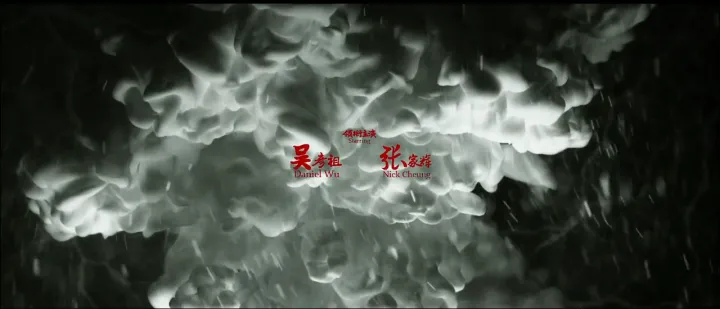

不得不说刚开始是冲着张家辉开始关注《警魔》这部作品的。后来听说吴彦祖更是为这部片子真刀实枪地瘦了30斤，并真实地对自己抽打以演好其中的片段，如此卖力，于是便更加关注许多。这部作品的成功，真的很感谢他们的认真付出。  

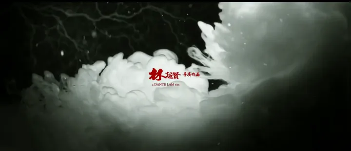

林超贤+张家辉的保证有多靠谱呢？

> *   08年 《证人》 10年《线人》 13年《激战》 14年《魔警》  
>     
> *   以上作品全部帮影帝辉在不同影会上收获最佳男主角 《证人》更是助辉哥第七次拿下影帝。  
>     

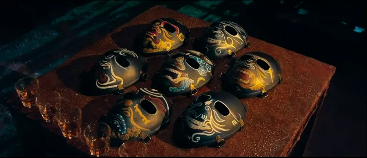

一直期待华语电影中的警匪片能加入些更有趣的成分，不再是单纯的枪战追车简单感情的老套路。这一次，作为暴力美学的新一代接班人，近年来屡次凭借警匪片拿下奖项的林超贤这次甚至加入了一些本土宗教色彩，让影篇增色不少，电影配乐更是启用了一些例如唢呐的乐器很是贴合氛围。在气氛营造上，这部作品真可作为典范。

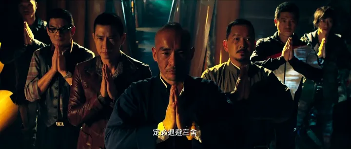

不错的阵容。好的作品总是需要好的演员，哪怕只是配角。

**言归正传，正文开始：**  

  

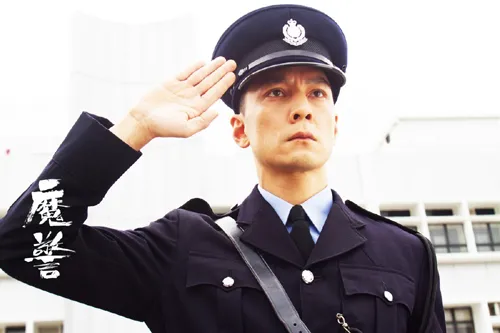

吴彦祖在片中饰演一名对自我很是严格的警察。  

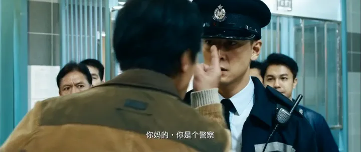

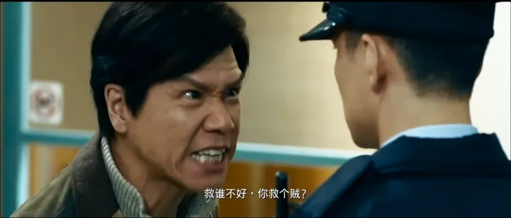

故事的一开始，便从这里展开：  
由吴彦祖饰演的警察王伟业帮受伤失血过多的匪徒韩江（张家辉饰演）输血而受到失去两个手下的同行愤怒的指责。

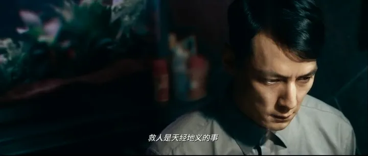

王伟业陷入了思考和自责中，但他此时他还较为清醒，他也相信他父亲所说的救人是天经地义的，不论贼匪或警察。  

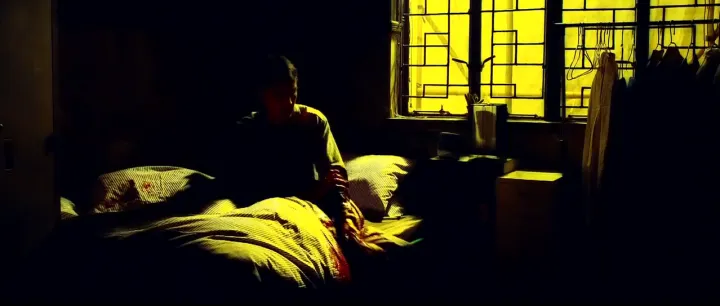

但同行的愤怒和处于对自己的格守，他还是对自己的行为产生了动摇。

对自己的怀疑就像他梦中自己从输血的手臂不停溢出的血那样占据了他的大脑。  

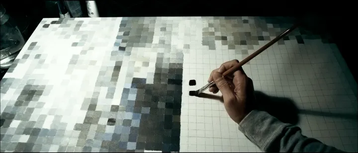

虽然画的是马赛克画，但这看起来与其说是艺术修养不如说是对自己恪守的一种冷静方式更来得贴切一些。

甚至，也许我们可以说，这画和他此时内心的心理状态是一样的，一样的模糊不清，一样的混沌迷惘。  

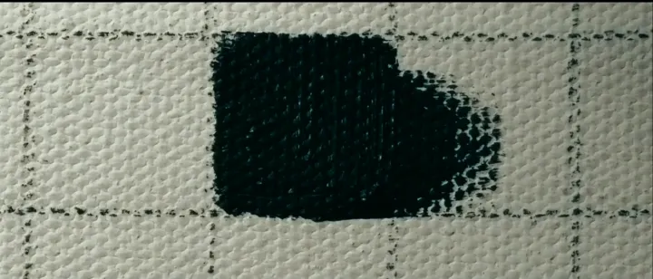

正是因为这样的心态，所以导演给了一个特写。

**墨超出了格子，就像他的思绪超出了他所能承受的程度一样。**

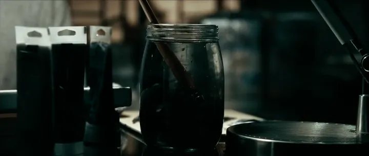

懊恼地把笔扔进了水放弃作画。  
**此时他的心就像这瓶水一般，想要洗净这墨，却不想被墨愈染愈浓。**  

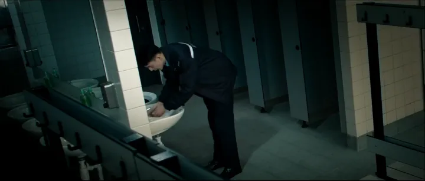

甚至在履行职责找到一具无名尸体后，**他不停地强迫似地神经质般不停地洗手**。  
**是死亡的气息又让他嗅到了罪孽的味道。**  

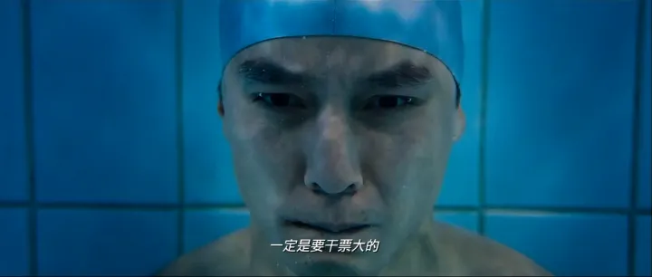

就连跳入最令他冷静的水池中他也会不断地想起这段话。  

**有时候，恐惧并不可怕。  
**

**可怕的是我们所想象地由整个点发散到它之后会影响的结果。**

**有一个说法，我们所担心的事情中只会有10%左右甚至更小的概率会发生。**

**但是，正是这10%摧毁了那原本可以平静的90%，100%地影响了整个人。**  

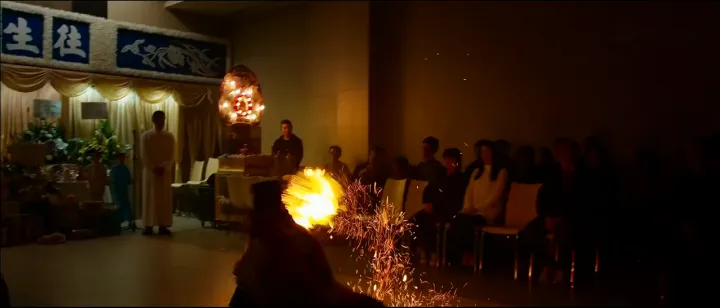

这里不禁要赞下林大师  
画面很精美细致，再次插入了一些宗教气氛在里面。很是真实地表现出了灵堂气氛。令鬼王党更添几分邪气。  
而看到这里的火，送故人归去的火，不禁令人想到了**火图腾**。  
**似乎火是可以烧去一切人世间的罪孽的。这里也可以算是一个隐喻一个伏笔。  
但火又是多元的，有净火，还有业火，最普通的还有怒火。**  

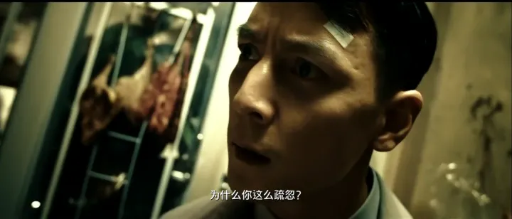

而在紧张之中的王伟业得知了他一直在意并照顾的阿婆不小心受伤后内心怒火更烧  

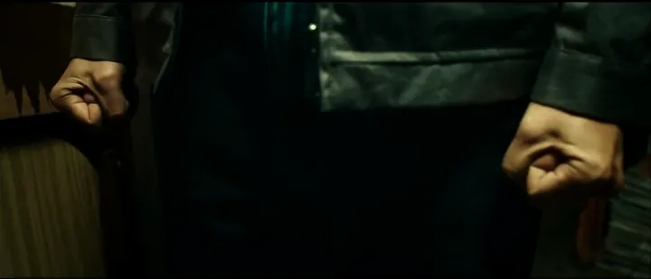

**而他的怒火也正如溢出的墨和愈浓的墨汁一样，在慢慢超出他所能控制的程度。  
怒火不仅烧着他自己，也正慢慢蔓延出来燃烧他人，燃烧他眼中的“不对的事”**  

看到那些害他奶奶的小混混，他非常地愤怒，进入了一个近乎**魔障**的状态。  
此时的他也不再忍耐，狠狠地揍了那两个小混混。  
**这时他仍然是为着“正义”的，对方也还是“坏人”。  
所以于情于理，他都似乎是在试图保护，似乎是保护老人和住户。  
但更多的，可能是在保护一个秩序，一个他心理让他正常运行的秩序。**  

他还保持着基本的判断。  
虽然对方不对，但是动手打人私刑是不对的，所以他也要**惩罚自己**。  
为了“正义”所以他惩罚那些小混混。为了“正义”所以他也发狠地自我惩罚。  
但是，真的是为了“正义”吗？还是说——  
**其实只是为了他自己心中的“正义”而已，也就是，只是为了他自己而已？**

直到后来王伟业去调解吵架却被市民倒打一耙，认为他有过失主动打人。  
**正确的出发却收获了错误的结果。**  
正义所保护的人们却指责他的正义，用邪恶去伤害他。  
他更进一步地去怀疑自己所坚持的正义的意义和想要保护自己。  
为了保护自己，保护自己心中的执着，他想反击——我要杀了他们。  

*   **在萨特的意识空无化中他这样论述到：由于意识有选择性，它会选择意识到什么内容，所以经常会对现存的一切产生一种否定性。**

  

**简单地说也就是当人为了存在而存在，正如王伟业为了“正义”而正义的时候，就会陷入生活无意义的认识状态中，会下意识地否定这一切。而过度地自我保护意识就会让他想要毁掉这一切。**

**但是他还有“正义”要坚持，他不可以的。**

那怎么办？韩江出现了，他穿着警服，一脸**得意又似安慰**地看着王伟业。

把那些不正义的交给他，那么自己的“正义”不就还可以维护吗？

但韩江所做的正是他内心所渴望做的，正是他的欲望，这样的“正义”从根本上还是正义吗？这如果不是为了正义而正义那又是什么？

到底什么是正义？

这里实在太有意味了。

这里**看似是在交代王伟业扭曲紧张的心理状态的原因**。

**其实可能更多地对“爱的表达”进行了讨论。**

我们在这里其实可以看到王伟业的父亲其实还是个好父亲。  
希望自己的孩子走正道，关心孩子，不断地试图纠正引导——  
但，**又有多少暴力打着“爱”之名？**  
似乎正是出于“棍棒底下出孝子”的心态，很多“恨铁不成钢”的父母常打着“我打你是因为我关心你，我爱你”的旗号**坦然地，肆无忌惮地用对孩子的暴力维持着他自己心中的“正义”。**  
  

王伟业的父亲说的全是错的吗？不。至少，在我们能看到的例如“救人是天经地义的”　“谨记善恶一线差别”　“做人要问心无愧”　“穷不要紧，但心要正”这些，他是对的，而且看得出，他也相当地关心孩子。  
那他说的是对的，那又怎么会错了呢？这就涉及到了他的表达方式。  
  

**太过于急切的表达，太过于极端地表达。不仅难以理解也许还会错误引导。**  
急切，过度，错误的惩罚最终的效果又会是什么呢？  
王伟业是爱他爸爸的，是尊重他爸爸的，甚至以他爸爸为精神支柱。所以在他爸爸被误杀后他实行了复仇，不停地贯彻他爸爸的理念，甚至，在他的世界里，他爸爸从来没有离开过他。  
这就是王伟业对他爸爸的爱，甚至他爱这个社会的方式也是如此。  
**错误的表达方式混淆了所要表达的含义本质。错误引导，继而扩散开来。**  

王伟业心中他自己是“正义”的，他要找出韩江这个“不正义”的人来：

**有趣的是这里有个细节。**

王伟业开始通过绘画鬼王面具来试图找出鬼王面具的来历来找到韩江。

**但是，为什么第一张图里画的是一张人脸而第二张图就变成了鬼王面具呢？**

**他是画人画鬼？那个人是谁？那个鬼又是不是由那个人画出来的？**

**人鬼难辨，善恶难分。别急，后面有更精彩的。**

当王伟业找到了鬼王党的余伙中的小角色时，他们正电晕了一个曼妙的盲女企图强奸她。王伟业是正义的。鬼王党是邪恶的，他又岂能容忍这样的不正义的行为在他眼皮底下发生呢？王伟业立马追了上去，却在最后的一个岔口跟丢了，选择了其中的一个路口追上去，追上去的话，就能阻止了！然而，他错了。急忙回去从另一条道追上去时，他们的奸污已经完成，“**因为自己没能赶上，就让这样邪恶的行径再一次发生。**”王伟业彻底对自己愤怒了。他愤怒地和其中一个落下的余党搏斗，余党的脚被兽夹夹住了，不能动弹，如何惩罚他，怎么办——

此时，韩江出现了。**他干净利落地杀了余党并回头耐人寻味地看：**

**似玩味，又似嘲讽。嘲笑王伟文的可笑的束缚，鄙夷他那可笑的正义。**

**此时最有趣的一点出现了。这张图像什么？**

让我们把刚刚王伟业的图竖过来看看这个神情和眼睛，像谁？

王伟业，画的究竟是什么，是谁，也许，**这里就已经有暗示了**。

韩江做了他会做而且该做的，那么，王伟业知道“韩江杀了人”要维护正义，就必须抓到他。

老婆婆的病逝无疑是给了王伟业最后一个打击。他感到了更加紧迫不可推卸的任务。他要马上抓到凶手。

最终，经历了背叛，混乱，残酷的拼杀后最后一名歹徒也受到了惩罚。王伟业的任务完成了，他的正义，终于得到了伸张，他终于得到宣泄般释放自己，审视着自己：

镜子里的非但不是自己，而且还是韩江，为什么？

**这个反应真是太真实了，好评点赞。**

据一项统计显示：人在生气的时候如果看到镜子里自己的表情也会马上被自己吓到。因为自己也没想到自己生气的样子如此愤怒如此丑陋，所以一度诞生了一个有趣的说法：**人们生气时是不认识自己的。**

而这时根据之前交代的内容韩江早就死了，所以他一直看到的韩江，不，不如说是他所期待的韩江，一直都是他自己内心中的幻想，不如说是另一个他，他内心中的“心魔”他回想起之前为什么老阿婆会说那句“为什么是你？”了——

为了报误杀父亲的仇，年幼的王伟业缩了他家的门并烧死了那名和韩江很像的警察。之后出于内心的不安，**为了救赎**，他便照顾起了阿婆。

王伟业企图通过捉住韩江来救赎自己，洗刷自己，消除自己过去的过错。

**有时，正如莫言所说，无意伤害到别人的人其实更痛苦。**

而痛苦，就是因为没有办法或很难得到救赎。王伟业的正义终于崩塌了，他打算选择自杀。

但——他却听到了——

于是，他便放弃了自杀，把他救了出来——

**可是，事实真是如此吗**？

请注意，**这里原本受伤的坏警察此时脸上却没有伤痕。**姿势和位置也和前面所处的地方不对。**那这也是幻想？那又为什么要救他呢？**

此时王伟业救的只是一具火尸罢了，而且也引火自焚，最终烧死在业火里。由于本案关键的证人最终都死了，所以最后指证王伟业为这一切的凶手，成了本文的标题——“魔警”。

**为什么 王伟业要去”救”那具火尸呢？**

**答案其实很简单——是为了自我救赎。就连最后，王伟业也在坚持着他的或正确或不正确的正义，都在努力地想要洗刷自己的罪孽，完成最终的自我救赎。**

在这一点的剧情设置上，和麦浚龙导演的《僵尸：七日重生》中钱小豪的自杀有着类似自我救赎般的死亡。

最终画面打出，完成了导演最终的叙述：

**人心，总纳一点黑。**

人心，总纳一点黑，如果我们能平静地接受它，**也许最终的结局并不会是这样。**所以导演也在最后放出了这样一幅温馨的图：

**似乎在劝导我们接受自己的不完美，又好像在告诉我们生活原本的样子，也可能是在追求一种“静”的境界。这里的“墨”通了最终的“魔”，当然，也可以只让它只是“墨”。魔警，便也是警惕心魔。**

**究竟这句话的真正含义是什么？仁者见仁，智者见智吧**。我只是在分享对这个故事的个人看法，而导演只是在叙述这样一个故事，这样——就已经够了，**也许不必深究。**

**当然，故事也告诉了我们一些其他简单有趣的东西：**

请恕我冒昧，把故事的最开头放到了这篇文章的结尾。因为我觉得，这个结尾，真是再好不过了。

**人心 总纳一点墨**

**不同的人有不同的恐惧**

**有的恐惧只需要一套制服就能有安全感**

**而有的恐惧则需要文凭，金钱，职称，谈资，汽车，名牌，收藏……等等来满足**

**你的恐惧是什么——**

**你的“那套制服”——又是什么？**

  
  

\------------------------------------------------------------------------------------------------------------------------

ps：我才不要知乎成为我的制服…以后再也不花那么长的时间来写专栏了…好累…看书去了…希望有人能支持我的劳动吧…真的是一张图一张图手动截的啊…

就酱，谢谢各位看官支持啦：D
