徐克，号“老怪”，其电影以惊人的想象力和视觉冲击力著称。

他沉迷创意和特技，甚至不惜割裂故事的完整性和深度。即使在《笑傲江湖》、《东方不败》这样开创武侠新潮流的名作里，也难掩故事的破碎感、人物的脸谱化等毛病。

2010年，他执导的《狄仁杰之通天帝国》上映了。动作、武侠、奇幻、探案、悬疑……看到这些元素，我相当笃定，这一定又是一部重视觉、轻故事的徐老怪风格作品。

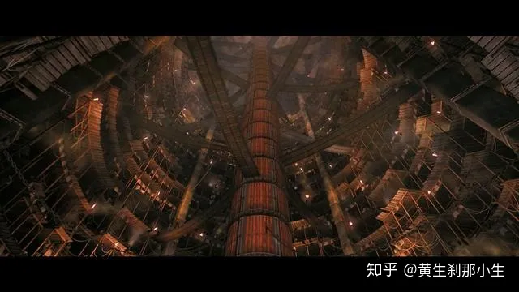

影片中的通天浮屠

当年看完，心想，果然如此，还是熟悉的配方熟悉的味道，想象和视觉天马行空，剧情硬伤不少。但是说也奇怪，不时想起这部电影，总感觉故事里还有点什么不一样的东西吸引着我。这些年来，陆续重温了几遍，才越发确信，《狄仁杰之通天帝国》的故事既简单，也不简单，在类型片的表层下，贯穿着难以直言的人物内心冲突，弥漫着感伤的氛围，在徐克电影中着实罕见。

表面上，电影讲的是一个神探破案的故事：武则天登基前，京城里一伙恐怖分子制造焚尸案，不断杀害朝廷官员，阻扰登基大典。武则天把神探狄仁杰从监狱中放出来，命他为钦差大臣，前去破案。在多方势力的斗智斗勇中，狄仁杰的朋友一一遇害，他也查到了幕后真凶，原来是当年和自己共同入狱的好友沙陀，他想要在登基大典上谋杀武则天。一番搏斗后，凶手身亡，武则天得救，狄仁杰归隐鬼市。

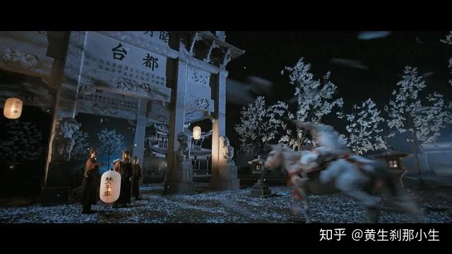

《通天帝国》是一部精彩的类型片

而表面之下，电影其实讲的是狄仁杰的内心冲突——武则天，想“爱”你真的很难！不是男女之爱，而是指政治认同。整个故事说的是狄仁杰从反对武则天，到支持武则天的痛苦转变，以及他最终做出的出人意料的选择。

## 武则天，想“爱”你真的好难

电影一开始就交代，武则天即将登基成为历史上第一位女皇帝，李唐宗室、元老重臣难忍女子篡位，暗中集结，意图颠覆。

多年来挺武派和反武派斗争激烈，狄仁杰则是反武派的代表人物。狄仁杰有多反对武则天？他入狱八年，就是因为当年带头反对武则天垂帘听政，被判处逆反罪。出狱后第一次见到武则天，武则天问他你来见我为什么不脱了囚服，狄仁杰说你都要登基了，我这身囚衣迟早要穿回去。摆明了还是坚决反对她，要跟她斗到底。

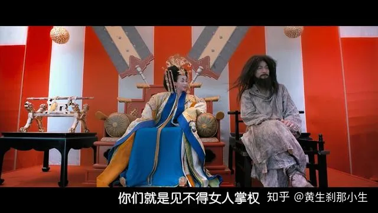

狄仁杰穿囚服见武则天

狄仁杰反武，因为他心系李唐正朔，对唐高宗忠心不二。高宗信任狄仁杰，曾赐他亢龙锏，赋予他直言上谏的使命。亢龙锏对狄仁杰有多重要？影片中有个貌似boss、其实打酱油的琅玡王李宵，对狄仁杰总是一副高高在上的神气。狄仁杰从来不正眼看他，也不按例下跪请礼，可是当李宵取出亢龙锏还给狄仁杰时，他立即敛容下跪，恭恭敬敬接锏。亢龙锏，或者说高宗，是狄仁杰的精神支柱。

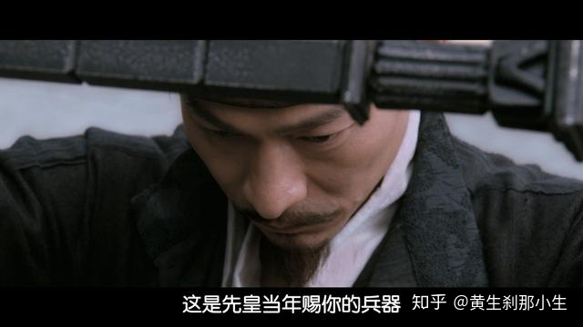

狄仁杰接过亢龙锏，神情庄重

狄仁杰反武，还因为她不齿武则天强硬无底线的执政手段。为了铲除异己，武则天不择手段，她让身边心腹上官静儿装扮国师，组成秘密团队，专门暗杀反对者。她的名言是，欲成大事者，至亲亦可杀。狄仁杰太了解武则天了。

所有人都认为狄仁杰是反武派的标志性人物，所以李唐宗室，琅玡王李宵想拉拢狄仁杰入伙，一起推翻武则天。令人错愕的是，狄仁杰拒绝了，反而为武则天卖命查案。李宵身边的人便嘲讽狄仁杰，开口就是“败类”，一句一个“晚节不保”，视其为叛徒，狄仁杰神情复杂，没有辩解。可见狄仁杰为武则天效力，出乎所有人的意料。

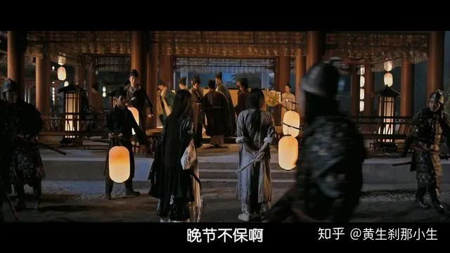

狄仁杰被骂晚节不保1

既然狄仁杰反对武则天，为何还要替她查案，为她除掉敌人？让武则天倒台不正是他的目标吗？

## 奏折，放不下的理想

狄仁杰和李唐宗室等人反对武则天不同，他不是简单的站队，而是内心里追随某些价值。

李唐是正朔，是狄仁杰坚信不疑的信念价值，为了维护这个价值，他甘愿锒铛入狱。

国富民强，百姓安居乐业，则是狄仁杰看得很重的另一个价值。狄仁杰在狱中负责焚烧奏折，看看多么牵强的设定，就为了告诉观众，狄仁杰通过读奏折，了解到武则天把天下管理得井井有条，欣欣向荣。

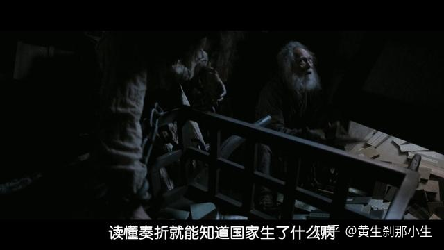

狄仁杰狱中仍心系天下

一边是坚信不疑，曾为之付出一切的信念，一边是理性相信武则天就是最好的执政人选，武则天倒掉，稳定繁荣的局面将难以为继。狄仁杰陷入了内心的冲突。

狄仁杰该如何抉择？查案过程，就是狄仁杰做出决定的过程。拒绝李宵，他和武则天结成了临时的同盟。

狄仁杰内心波澜最大的一次，是当李宵告诉他一个秘密，说高宗不是病死，而是武则天下毒害死的时候。听完他瞬间方寸大乱，如果是真的，他绝不可能再站在武则天一边。这段影片拍得极为精彩。

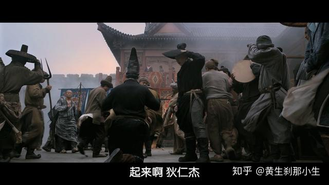

狄仁杰听说是武则天害死高宗，内心激荡

狄仁杰手握亢龙锏，当面质问武则天。武则天回答他说，高宗是病死的，自己当皇帝是顺应天意，却总是因为女人的身份而被恶意中伤。

狄仁杰相信武则天的话吗？我们不知道，他明明知道武则天“欲成大事，至亲可杀”。

倒是武则天决定翻脸，命令心腹上官静儿除掉狄仁杰。因为狄仁杰一度怀疑武则天是焚尸案的幕后真凶，他查出武则天让上官静儿装扮国师，以各种见不得人的手段杀害宗室、老臣，铺平登基之路。但上官静儿爱上了狄仁杰，不忍下手，反而为了救他而被焚尸案的恐怖分子杀害。

看上去武则天把狄仁杰逼到了对立面，狄仁杰会怎么办？他做出了一个让武则天吃惊的选择。

## 亢龙锏，两难的决定

《通天帝国》中人物死法很惨烈。除了上官静儿，狄仁杰的另一个好友裴东来也因为查案被活活烧死。惨烈的死法不仅止于吓人，而是震撼人心地渲染出了你死我活的残酷环境。

两个朋友为案件而死去，坚定了狄仁杰查获真凶的信念。没想到凶手却是当年的战友沙陀。他们曾拥有共同的信念，一起反对武则天，一起入狱。

曾经的战友走上了不同的道路。当年沙陀跟着狄仁杰反武，现在他要继续反武的事业。他斥责狄仁杰叛变了理想。沙陀被武则天砍断一只手，他造反带有复仇的意味。狄仁杰被武则天关了八年，却并没有变成复仇狂人。

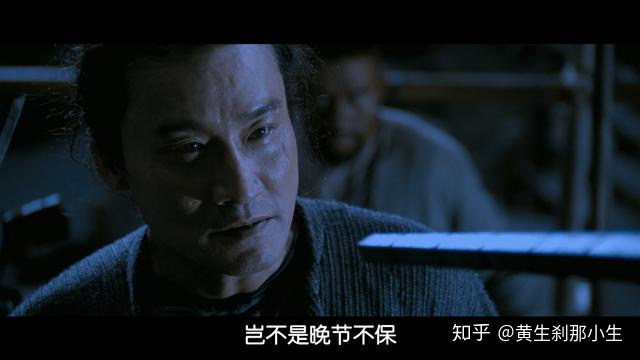

狄仁杰被曾经同志骂晚节不保

在大佛碎片即将击中武则天时，狄仁杰做出了选择，他奋不顾身救下了她。武则天很诧异，很感动。更让她吃惊的是，狄仁杰举着亢龙锏，先是历数她的罪行，接着承认她是皇帝，最后恳请她将来再把皇位传回李唐。

他的原话是：治国需要权力、谋略，但是非曲直不可苟且，请皇上知所进退，再传宗室后代，回归正朔。

支持你，但不认同你，请你将来回归正道。这就是狄仁杰的决定。

武则天默应后，狄仁杰将亢龙锏交给武则天，并说我的使命已经完成。可见，在他心中，追随李唐正朔是他坚定不移的使命。

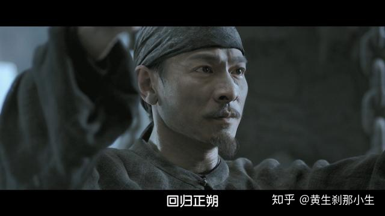

李唐是狄仁杰心中永远追随的价值

武则天知道怎么打动狄仁杰，她说希望你为了社稷百姓，留下来帮帮我。狄仁杰拒绝了，宁愿归隐鬼市，从此不见阳光。

狄仁杰和武则天终究是两类不相容的人。在波诡云谲、险恶残酷的环境中，只有上官静儿和狄仁杰是知己，他们不会因为“远大的目标”而牺牲感情和身边的人。

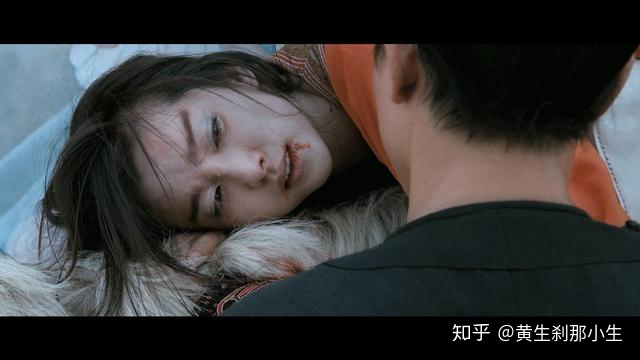

诀别

狄仁杰和沙陀撕破脸决斗时，狄仁杰曾直面沙陀的质疑，说武则天是妖后，你现在杀的人比她还多，你也要把自己变成鬼吗？

我不由得想起张艺谋的《英雄》，差不多的立意，主人公都由于“为天下”而放弃与暴君为敌。《英雄》用“大义”美化暴君，《通天帝国》却依然认为她是鬼。

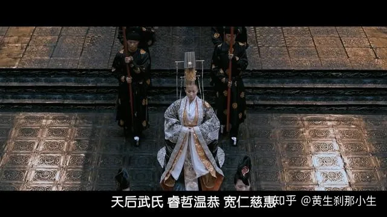

反讽

正是这种复杂性的认识，让狄仁杰无法简单的选边站，也因此，影片一下子具有了深度。

至于狄仁杰对李唐是不是愚忠？或许替换成其他的价值，会更耐人寻味。