**《心迷宫》是导演忻钰坤的大荧幕处女作，讲述了中国某偏远村庄里，因为一具莫名出现的尸体而引发的一连串离奇怪事的故事。**

# 剧情介绍

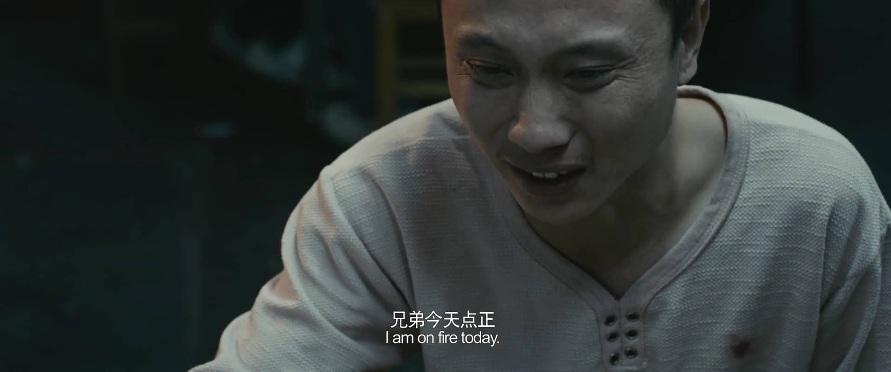

村里的痞子白虎，常年无业，爱好赌博，常常赔的血本无归，欠下城里二哥一屁股债。因为得了一种怪病，白虎经常不自觉的流鼻血，治病的钱都被他用来赌博了，所以身体不是很好。

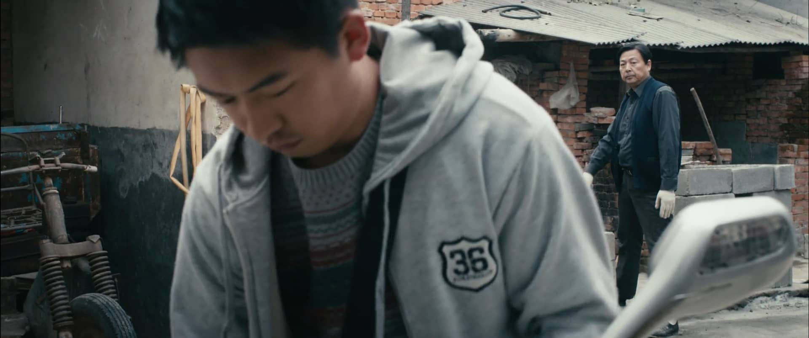

肖宗耀是村长肖卫国的儿子，大学毕业之后，肖卫国为了把儿子留在身边，执意让儿子辞职，在县城里托人给宗耀找了一份办公室的工作。为此父子二人反目成仇，心生隔阂。

黄欢是肖宗耀的女朋友，两人的关系还没有在村里说破。这天，黄欢和闺蜜通话，闺蜜提醒黄欢，别被肖宗耀给骗了。黄欢告诉闺蜜，自己有办法拴住他。

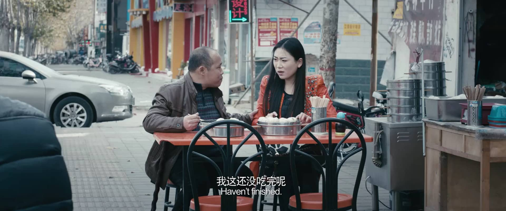

赌了一夜，白虎在路边的包子铺，看到了村里的陈自立。陈自立是个瘸子，在他的身边坐着一个花枝招展的女人。白虎询问这女人是谁，陈自立说是自己的干妹妹。白虎开玩笑说，是你的情人吧。

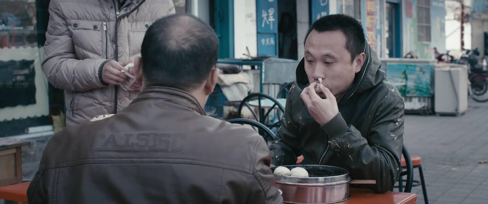

无心应付白虎的陈自立，结了账选择离开。陈自立刚刚要账回来，钱包里放满了钱，这引起了白虎的兴趣，心生歹意。他决定偷走陈自立的钱包。

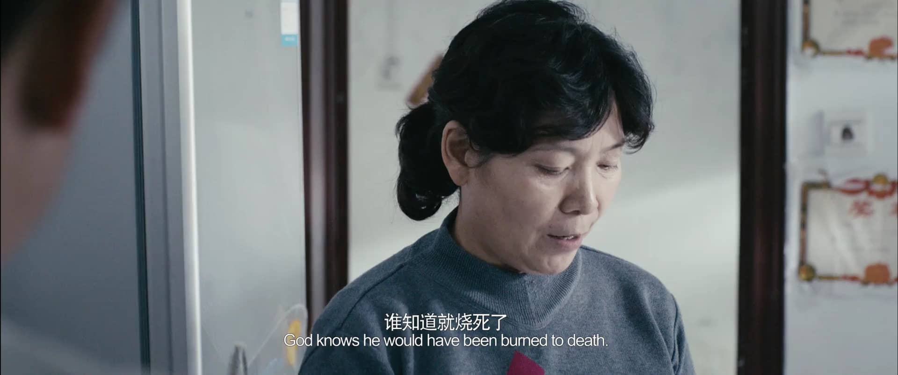

肖宗耀回到家，母亲告诉他，村里有个老人烧荒草，腿脚不利索，烧死了自己，今天出殡，大家都去吃席。

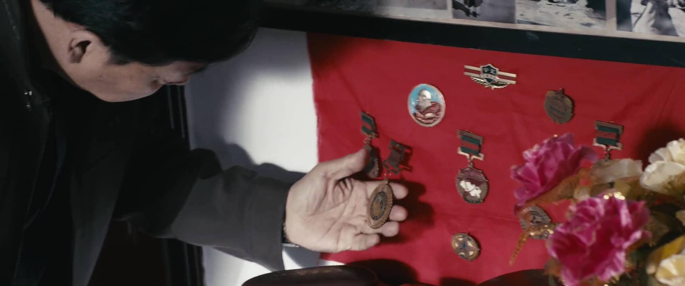

在家里，肖卫国最喜爱的，是墙上那些勋章。这对一位村长来说，这都是一份份的荣誉。

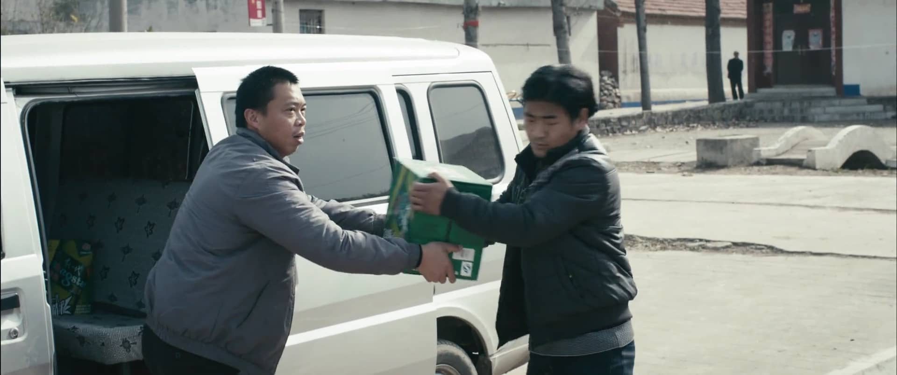

超市的大壮来给葬礼上送酒水，遇见了陈自立的妻子丽琴。从大壮的表现看出，他喜欢丽琴。

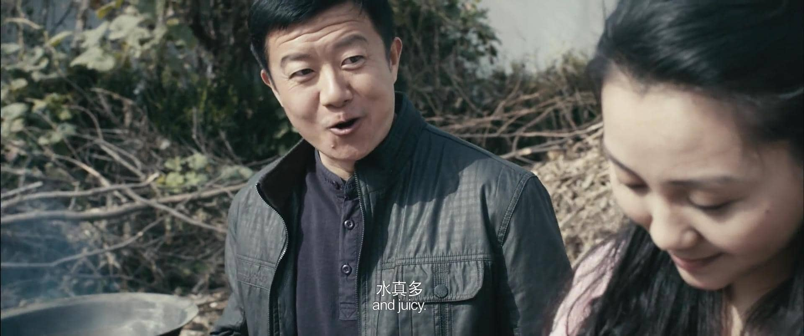

大壮走后，王宝山来找丽琴搭讪。以前，王宝山和丽琴谈过恋爱，后来因为王宝山家人反对，两人没有结婚。不得已，丽琴下嫁给了陈自立。

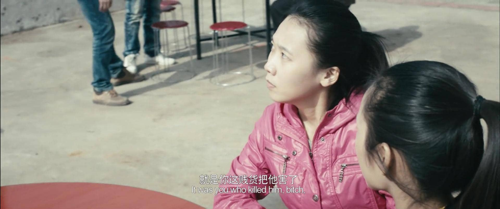

正当两人暧昧的时候，王宝山看见了表弟以前的女朋友，黄欢。王宝山的表弟，前些日子因为和黄欢分手，喝醉了酒，跑到闲人坡上摔死了。王宝山和黄欢因为此事争吵了起来，扬言要弄死黄欢，一名抵一命。

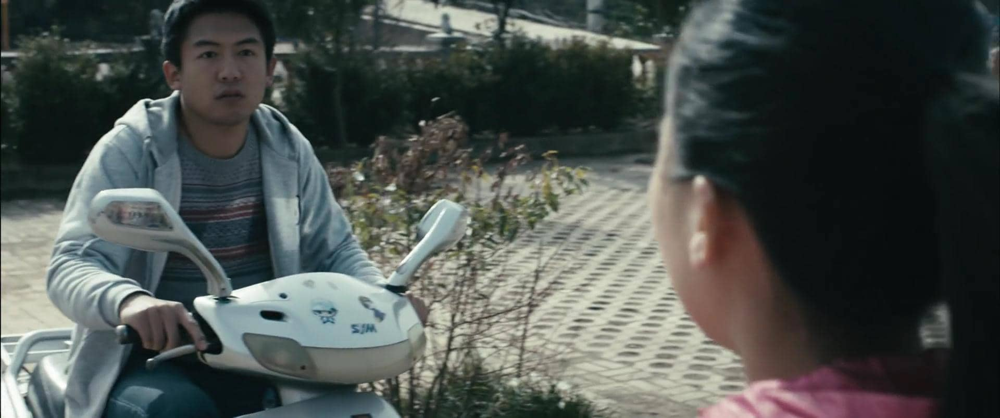

黄欢生气以后选择离开，遇到刚刚来的肖宗耀，两人默默看了一眼，没有说话。

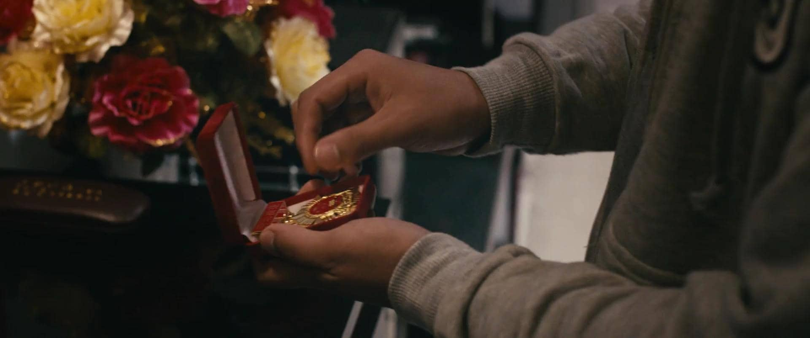

晚上，黄欢给肖宗耀发信息，两人相约在后山的树林见面，临走之时，肖宗耀拿走了肖卫国的一枚勋章。

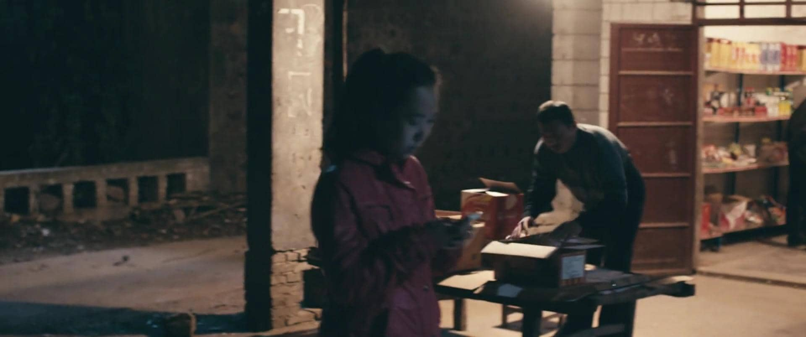

晚上，王宝山打算和丽琴幽会，路上来到大壮的超市买烟。关门的时候，大壮看见了路过的黄欢，王宝山也跟在后面离开了超市。

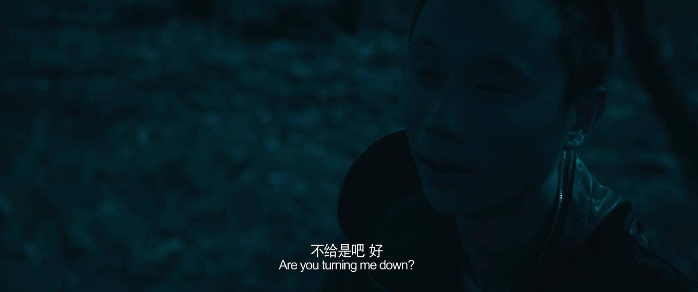

白虎偷了陈自立的钱包，在回家的路上，看见了约会的肖宗耀和黄欢。

黄欢故意告诉肖宗耀自己怀孕了，想要借此，逼迫肖宗耀向父母坦明两人的关系，早日结婚。

不料，此事被路过的白虎听到，白虎威胁两人，如果不拿钱消灾，明天就把两人的关系告诉村里的人。

肖宗耀没有答应白虎的要求，白虎想要离开，肖宗耀不让，两人扭打在一起。争斗当中，肖宗耀把白虎推翻在地，白虎头部磕在了石头上，流了一地的血。

肖宗耀和黄欢傻了眼，慌乱中捡起地上的荒草，盖在了白虎身上，逃离了现场。

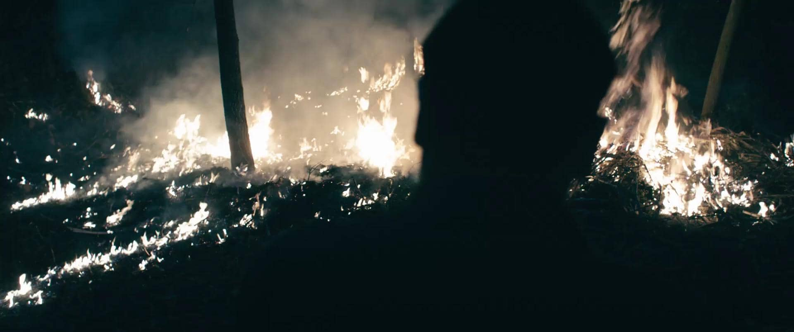

两人逃走之后，本是无意路过的肖卫国，看见了儿子杀人的过程。随后，肖卫国一把火，把白虎的尸体给烧了。

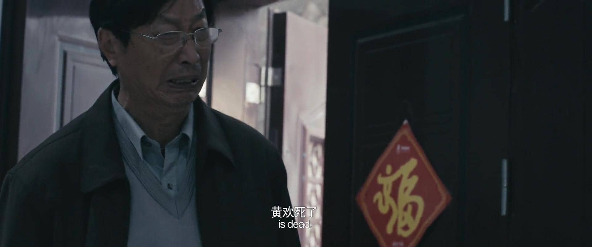

惊魂未定的肖卫国，原本想第二天，借着和张会计晨练的时候，一同发现尸体，再把线索引向同村的白虎，不料自己在沙发上睡了过去。

第二天，张会计来找肖卫国，说村里的黄欢在后山上烧死了。肖卫国明白自己误事了，匆匆起身与张会计来到后山。

正当众人打算报警的时候，村里传来消息，凶手抓到了。正是白天与黄欢吵架的王宝山。

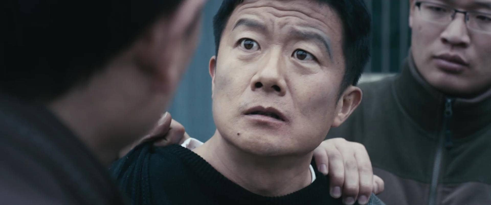

肖卫国无奈的来到村里，黄欢的家人已经把王宝山给绑了起来。王宝山哭诉自己冤枉，并说昨天晚上自己在丽琴家。

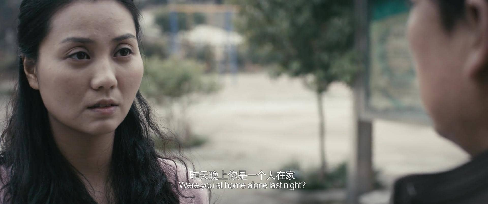

大家把丽琴找来询问情况，丽琴为了自己的名声，没有说实话，匆匆离开。

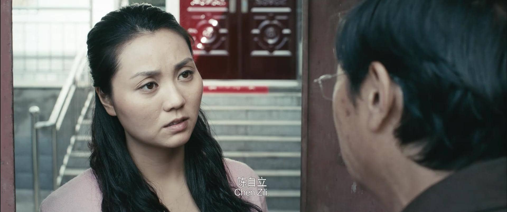

刚刚回到家中的丽琴，被赶来的村民告知，山上那具烧焦的尸体不是黄欢，是自己的丈夫陈自立。这突如其来的改变，让丽琴想到了昨天晚上与王宝山的对话，她怀疑是王宝山杀死了陈自立。

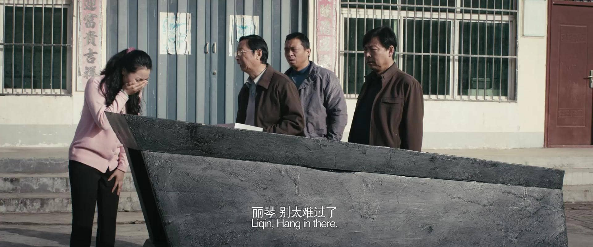

丽琴来到村支部，村长把烧掉一半的陈自立的身份证给她。对于丈夫的死，丽琴表现的很平静。随后，大家把棺材抬到了丽琴家里，打算举行葬礼。

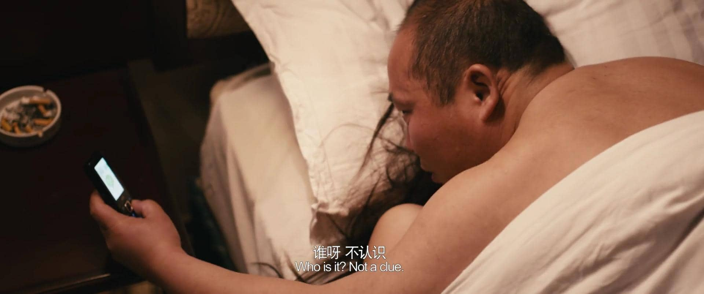

明知真相的肖卫国，回到家中，找到陈自立的电话，陈自立没有接。

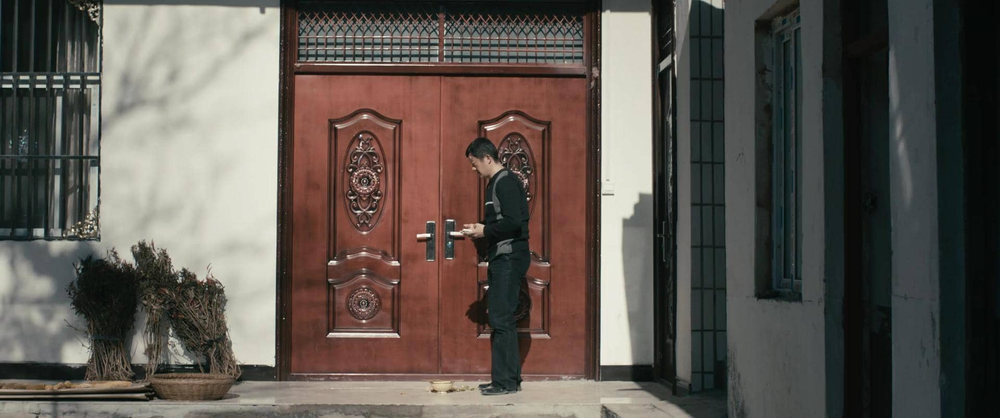

丽琴给王宝山打电话，想要确定是不是王宝山杀了陈自立。王宝山说人不是他杀的。随后王宝山来找自己的妻子，妻子得知了王宝山的丑事，闭门不见。

为了讨好妻子，王宝山独自来到县城，拿妻子的检验报告。

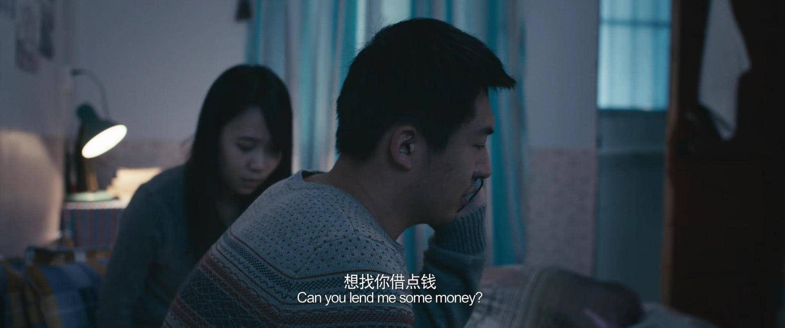

逃离现场的肖宗耀和黄欢，在宾馆里住了一晚。肖宗耀出去借钱，打算离开家乡去广州。黄欢发现自己来月经了，于是，出门去买卫生巾。

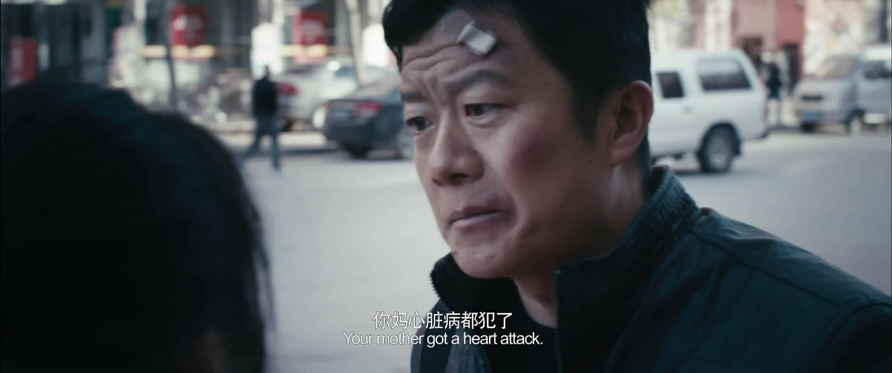

黄欢在回宾馆的路上，恰巧碰见来县城的王宝山，王宝山告诉黄欢，家里人找她都找疯了。黄欢寒暄了几句，匆匆离开。

这一幕，恰好被对面的肖宗耀看见，肖宗耀以为黄欢把事情告诉了王宝山，当晚，他没有回宾馆。

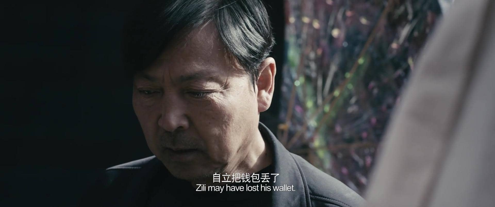

葬礼上，肖卫国提醒丽琴，要不要确认下尸体的身份，万一陈自立的钱包被偷了呢。为了挽回局面，他再次拨通了陈自立的电话。

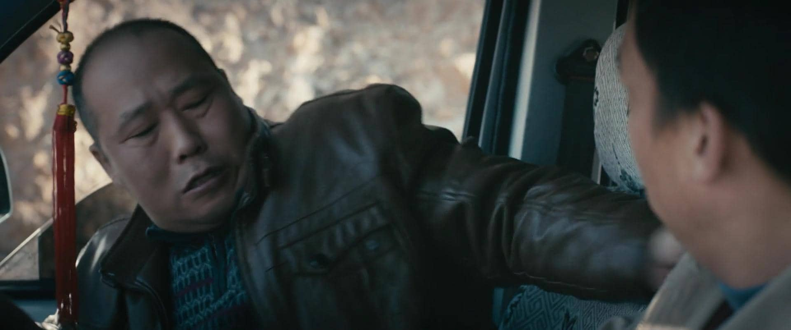

大壮去城里进货，回来的路上，遇到了丢失钱包的陈自立。因为身上没有钱，他只能步行回家。看见陈自立坐在自己面前，大壮很是吃惊。在路上，大壮为了能和丽琴在一起，打算杀死陈自立，但是最后他没有下手。

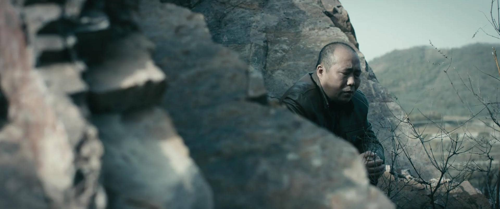

半路上，陈自立独自难受，独自去悬崖边上厕所。此时，村长的电话打来，为了接电话，陈自立不小心掉进了悬崖。

陈自立坠崖身亡，大壮把陈自立的东西也一同扔了下午，回到了村里。

为了白虎的尸体不被发现，肖卫国偷偷的从棺材里，把白虎的尸体埋进了自家的猪圈里。

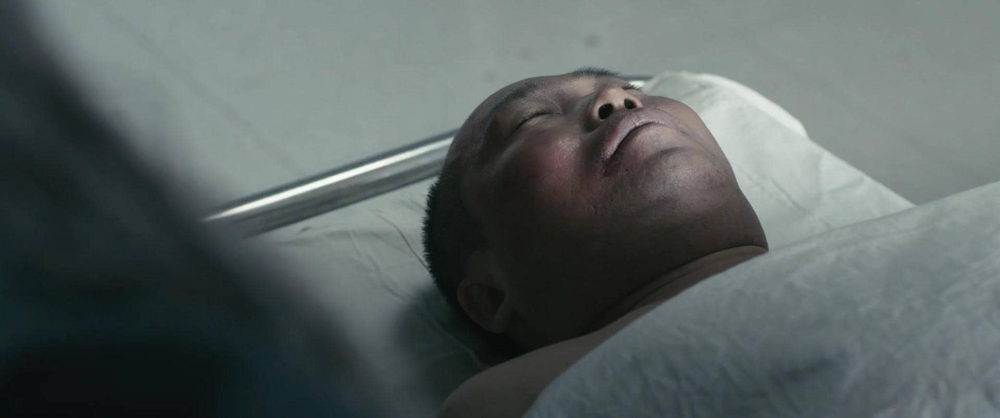

就在丽琴准备出殡的时候，派出所打来电话，让丽琴来认尸。去派出所的路上，丽琴看见了陈自立留在大壮车里的拐杖，以为是大壮杀了陈自立。

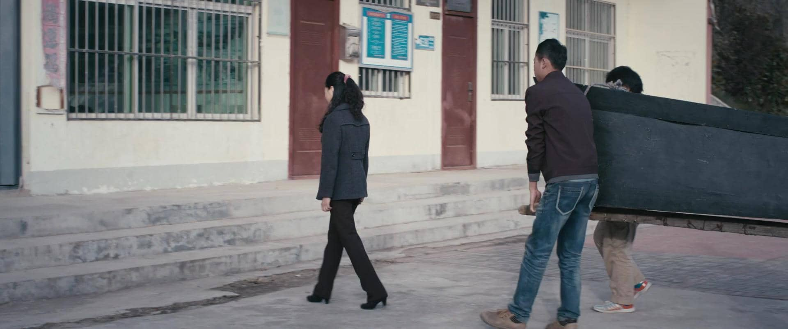

得知棺材里不是陈自立的丽琴，又把棺材给抬了回来。

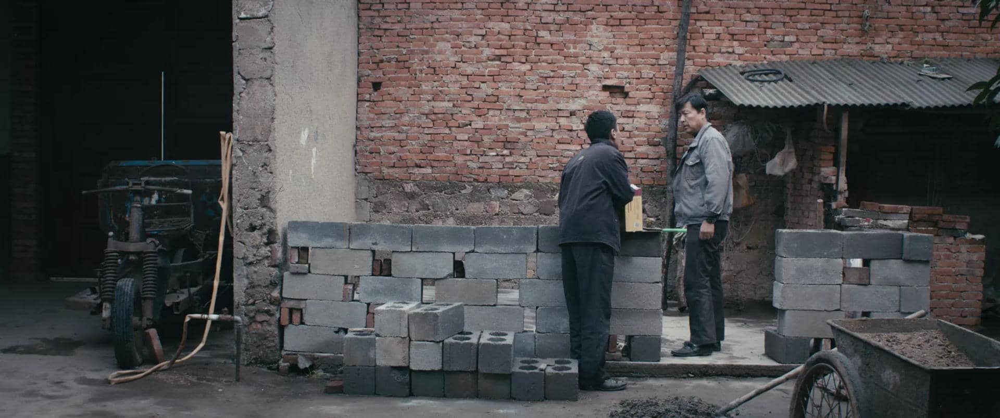

就在肖卫国翻修猪圈的时候，白虎的哥哥来找肖卫国。他打算用棺材里的尸体，来敷衍那些前来要债的人。肖卫国为了白虎能入土为安，又把尸体挖了出来。

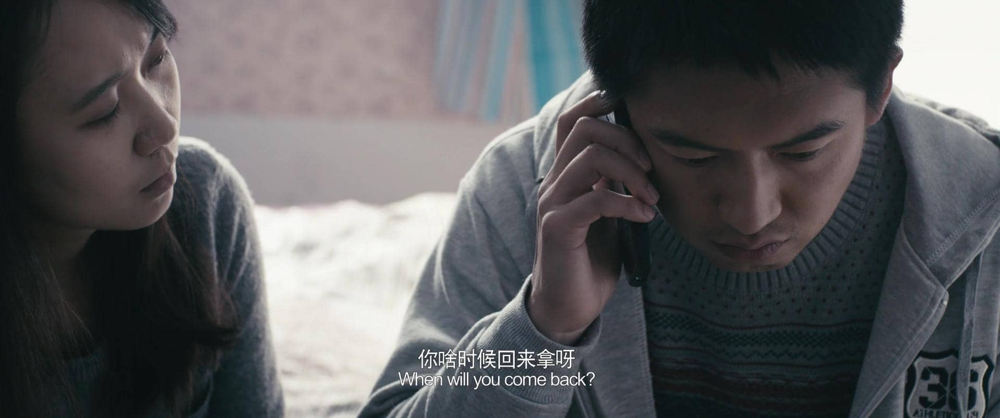

回到宾馆的肖宗耀，突然想起他身上的那枚勋章。寻找未果后，为了不连累父亲，他和黄欢打算回家自首。

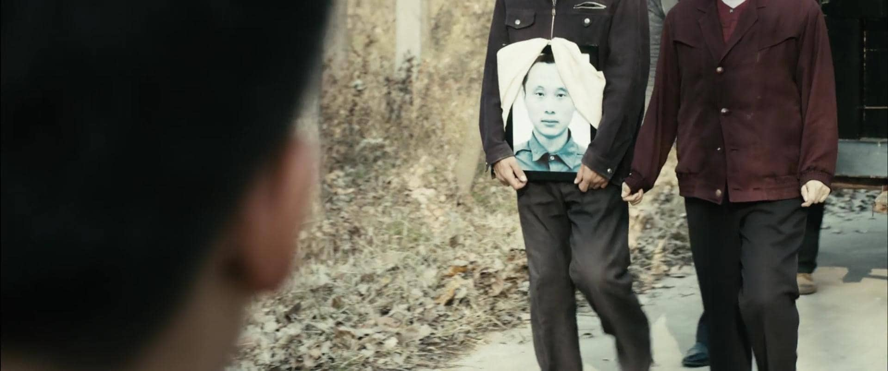

回家的路上，肖宗耀正巧遇到白家人出殡，询问过后，村民告诉他，白虎喝醉酒在后山自己烧死了。

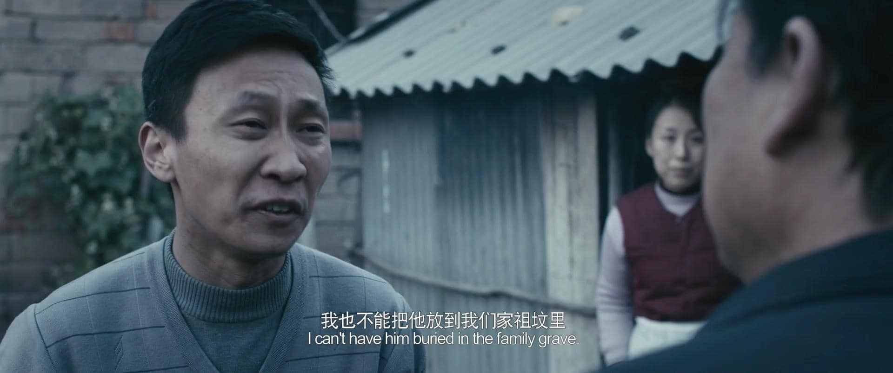

本以为万事大吉的肖卫国，在后山上又看见了那口棺材。他来到白家，询问为什么没把棺材埋了。白虎的哥哥说，出殡只是为了应付那些前来要债的，不能把什么人都往自己家坟里埋。

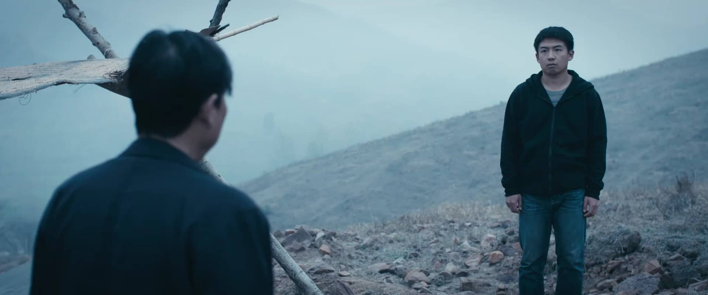

绝望的肖卫国，来到了山上，遇到了自己的儿子，肖宗耀。

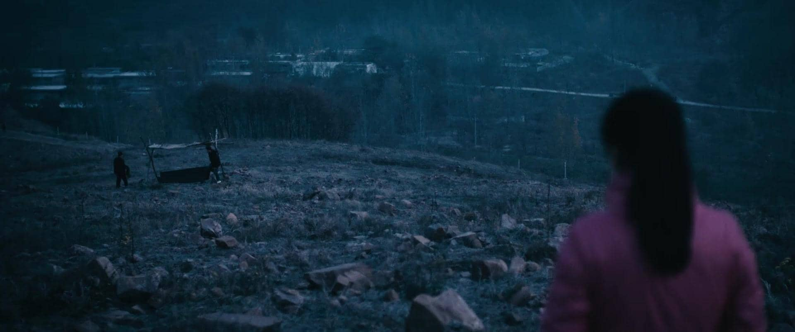

远处的山顶上，黄欢把手里的勋章埋在了土里，俯视着两人。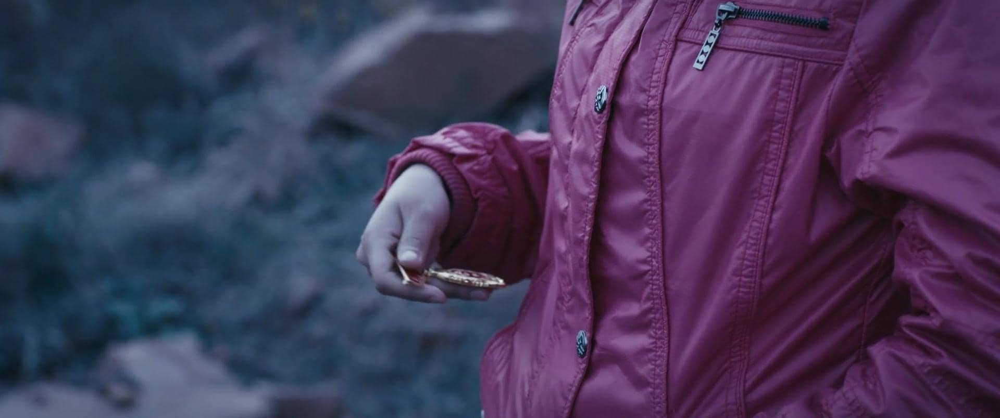

# 写在最后

​在电影中，导演将故事的前因后果打乱，围绕白虎尸体的归属问题，牵扯出关于两个女人的故事。我们不能由此定义这两个女人的好坏，只能说，她们都做出了最正确的选择。

总言之，人在做，天在看。