1、_我瞧不上的人太多了，虽然我自己狗屁不是，但这两者并不冲突。_

_——王朔_

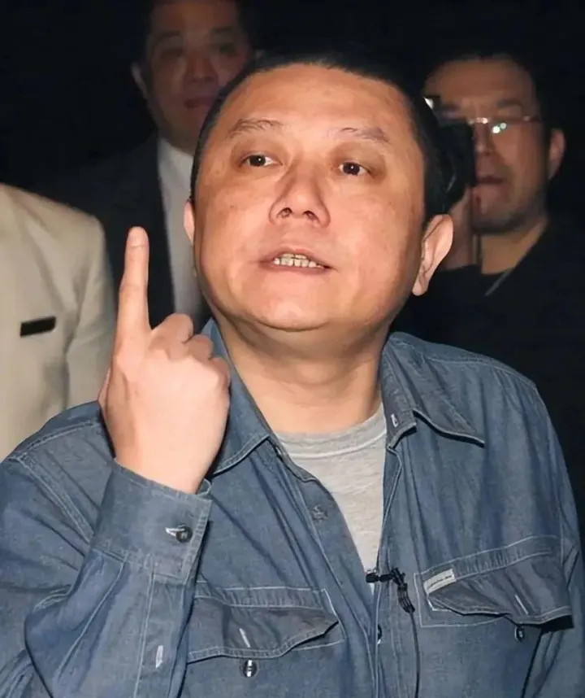

2、如果善良得不到应有的尊重，那么最好的方式就是翻脸。

_——稻盛和夫_

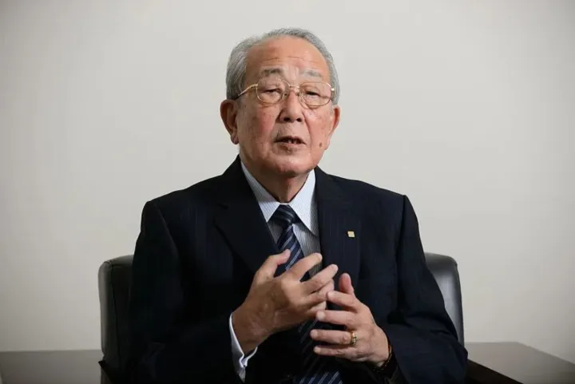

3、人的一切痛苦，本质上都是对自己无能的愤怒。

_——王小波_

4、如果你所爱的人不是同样爱着你，那么就必然是在暗地里轻蔑着你。

_——培根_

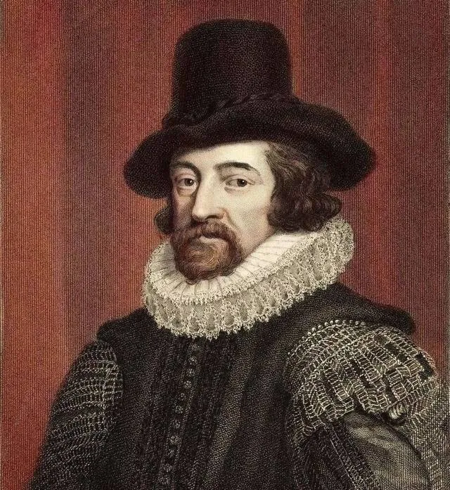

5、为什么很多女人会长期反复被男人骗？因为她们的要求，只有骗子才能满足，正常人满足不了。

_——毛姆_

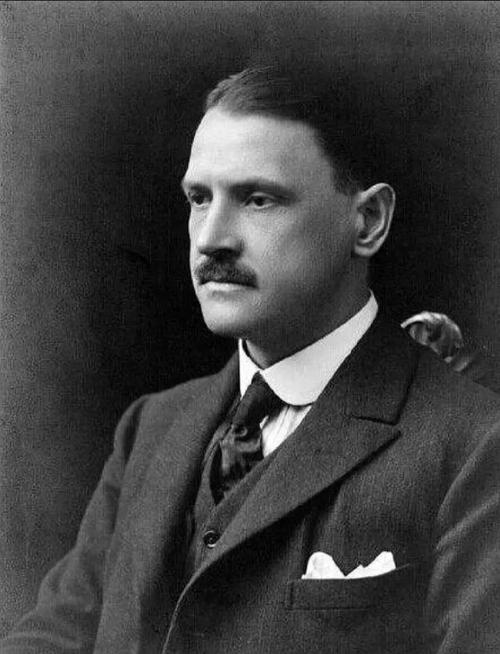

6、情商一定是让别人和自己都舒服。如果让别人舒服自己却很痛苦，那不叫情商，叫智障。

_——[霍普金斯](https://www.zhihu.com/search?q=%E9%9C%8D%E6%99%AE%E9%87%91%E6%96%AF&search_source=Entity&hybrid_search_source=Entity&hybrid_search_extra=%7B%22sourceType%22%3A%22answer%22%2C%22sourceId%22%3A2933809976%7D)_

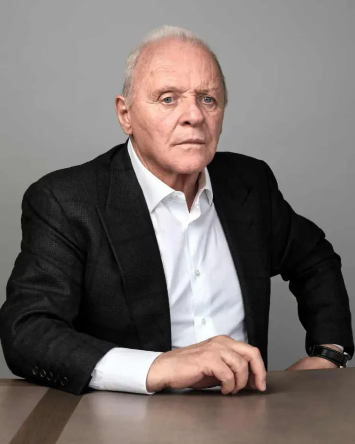

7、生活总会让我们遍体鳞伤，但到后来那些受伤的地方，一定会变成我们最强壮地方。

_——海明威_

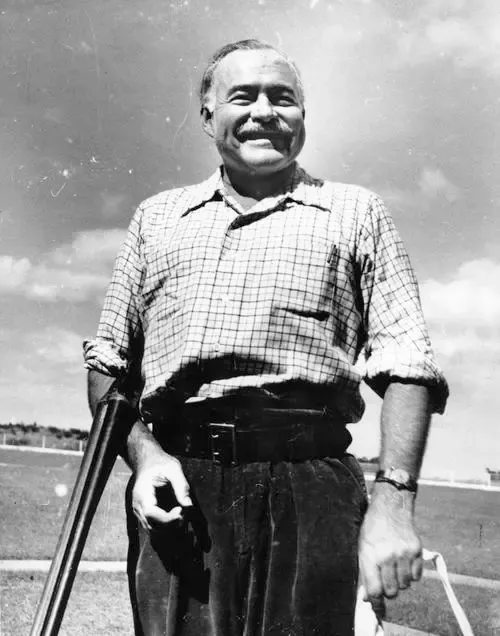

8、遇到事先处理情绪，后处理事情，情绪处理不好，事情会更糟糕。

_——《狼道》_

  

9、一见面就问你谋生方式的人，本质上是在计算对你的尊重程度。

——罗素

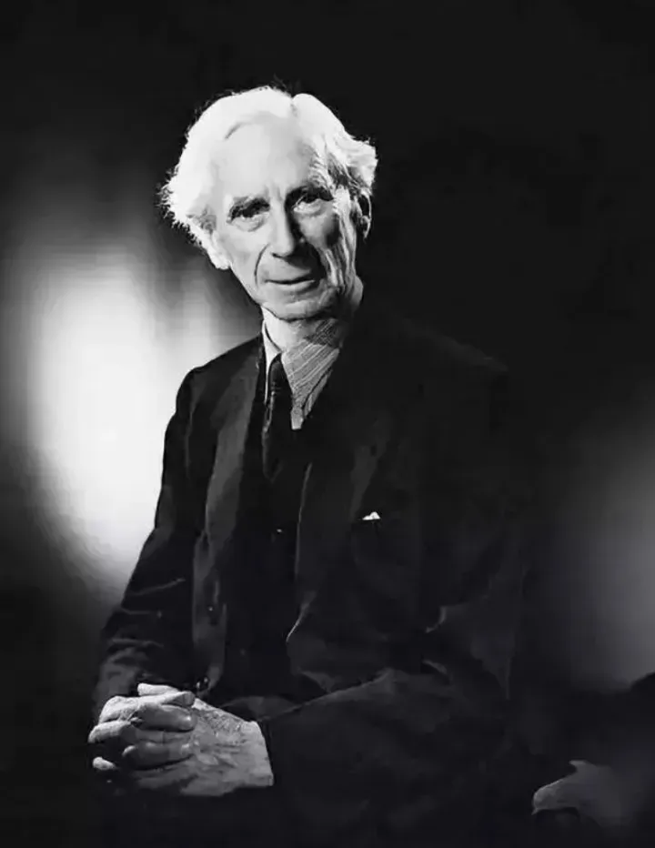

10、生活里80％的痛苦都来自于上班，但如果不上班，就会有100％的痛苦来自于没钱。

_——帕特里克．莫迪亚诺_

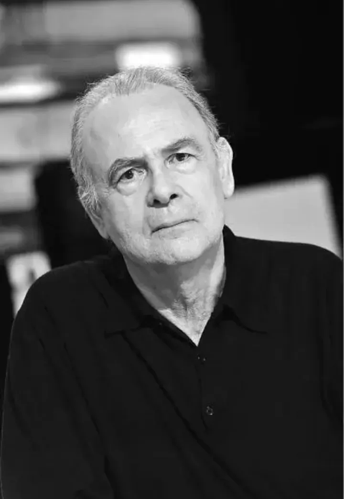

11、无法做出决策的人，或欲望过大，或觉悟不足。

_——笛卡尔_

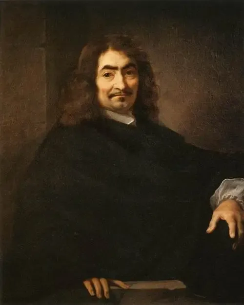

12、人生而自由，却无往不在枷锁中。

_——卢梭_

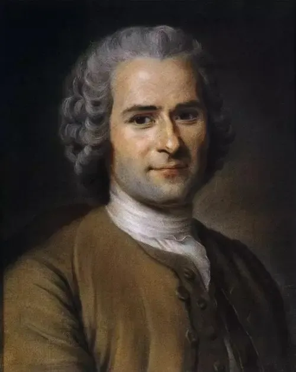

13、我们手里的金钱是保持自由的一种工具。

_——卢梭_

*   **点赞记忆更深刻哟！**

  

14、没有相当程度的孤独，是不可能有内心平和。

_——叔本华_

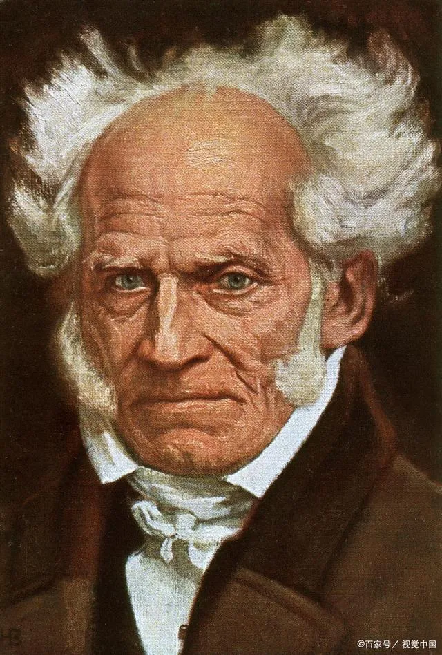

15、在纯粹的[光明](https://www.zhihu.com/search?q=%E5%85%89%E6%98%8E&search_source=Entity&hybrid_search_source=Entity&hybrid_search_extra=%7B%22sourceType%22%3A%22answer%22%2C%22sourceId%22%3A2933809976%7D)中就像在纯黑暗中一样，看不清什么东西。

_——黑格尔_

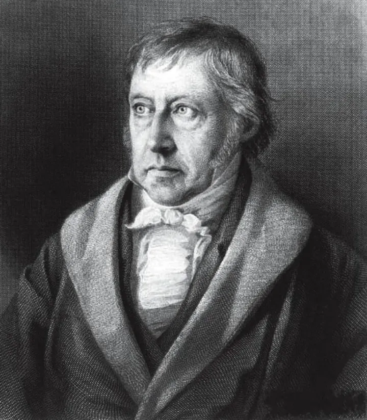

16、弱者选择复仇，强者选择原谅，智者选择忽略。

_——[萧伯纳](https://www.zhihu.com/search?q=%E8%90%A7%E4%BC%AF%E7%BA%B3&search_source=Entity&hybrid_search_source=Entity&hybrid_search_extra=%7B%22sourceType%22%3A%22answer%22%2C%22sourceId%22%3A2933809976%7D)_

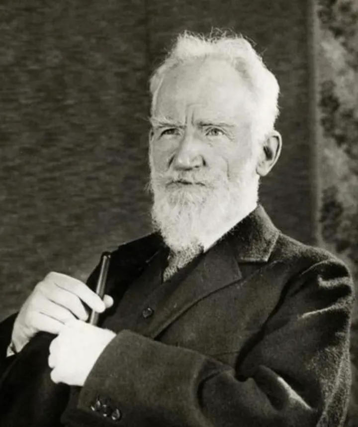

17、每个月几千块钱，买断你所有的时间和梦想，不可悲吗？

_——巴菲特_

18、唾手可得的东西，没人会珍惜，恰到好处的冷漠，反而让人心生欢喜。

_——[戴尔·卡耐基](https://www.zhihu.com/search?q=%E6%88%B4%E5%B0%94%C2%B7%E5%8D%A1%E8%80%90%E5%9F%BA&search_source=Entity&hybrid_search_source=Entity&hybrid_search_extra=%7B%22sourceType%22%3A%22answer%22%2C%22sourceId%22%3A2933809976%7D)_

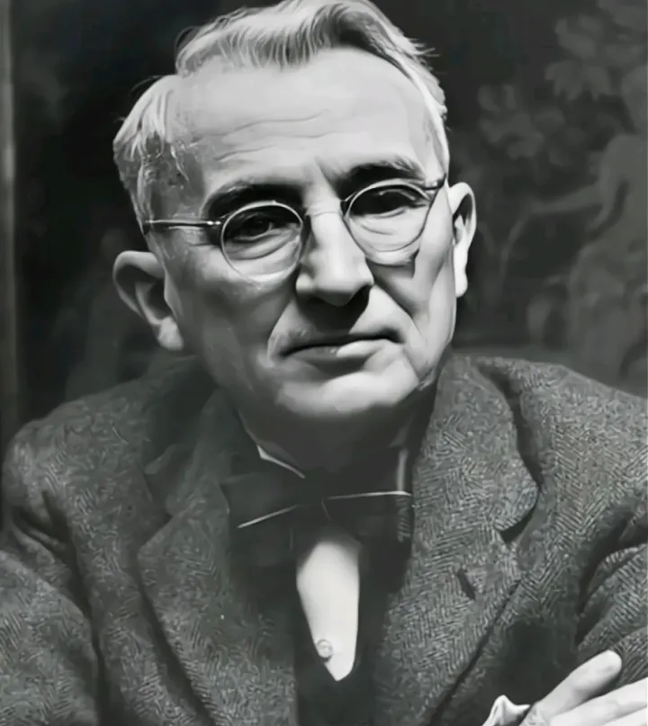

19、只要你成功了，丑是耐看的，胖是圆润的，矮是精华，黑是质感，什么缺点都圆的过去。

_——王尔德_

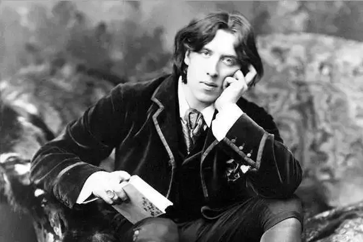

20、盲目的努力是在消耗生命，认知、资源、方法、哪个不比努力重要。

_——[汤因比](https://www.zhihu.com/search?q=%E6%B1%A4%E5%9B%A0%E6%AF%94&search_source=Entity&hybrid_search_source=Entity&hybrid_search_extra=%7B%22sourceType%22%3A%22answer%22%2C%22sourceId%22%3A2933809976%7D)_

*   **时时拿出来品一品，会有新的收获，好文耐人寻味，别忘了点赞加收藏**

  

21、成年了，要学会控制自己的情绪，温柔说话，如果吼叫可以解决问题的话，驴将统治世界。

_——稻盛和夫_

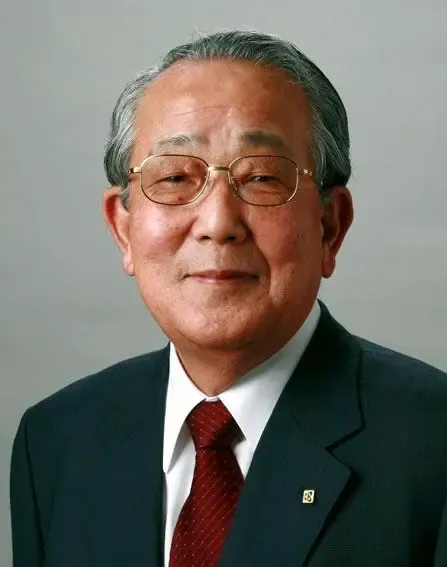

22、改变自己最快的方法，就是做你害怕的事。

_——罗素_

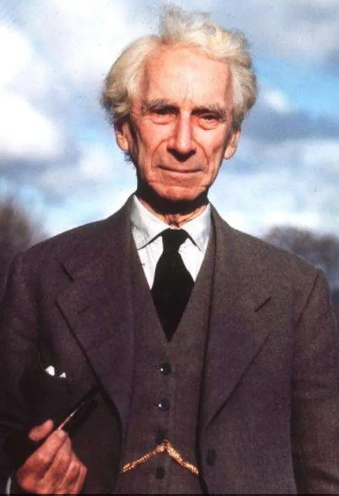

23、你在人群中看到每一个耀眼的人，都是踩着刀尖过来的，你如履平地般的舒服，当然不配拥有任何光芒。

_——路遥_

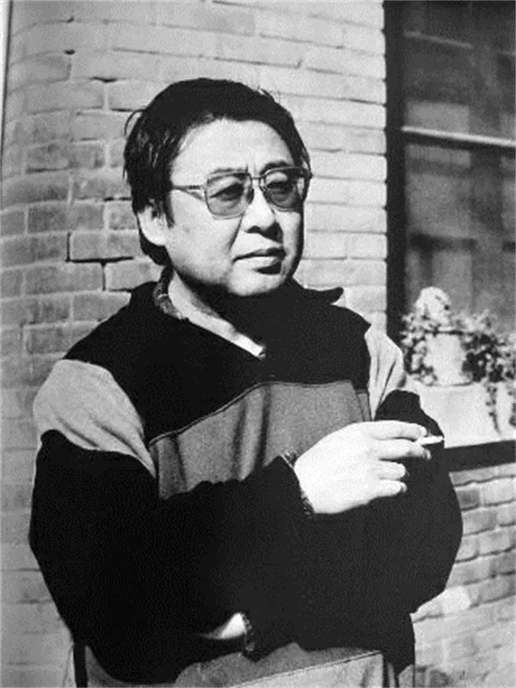

24、原来很多的关心，只是为了打探清楚，你过得到底有多惨。

_——毛姆_

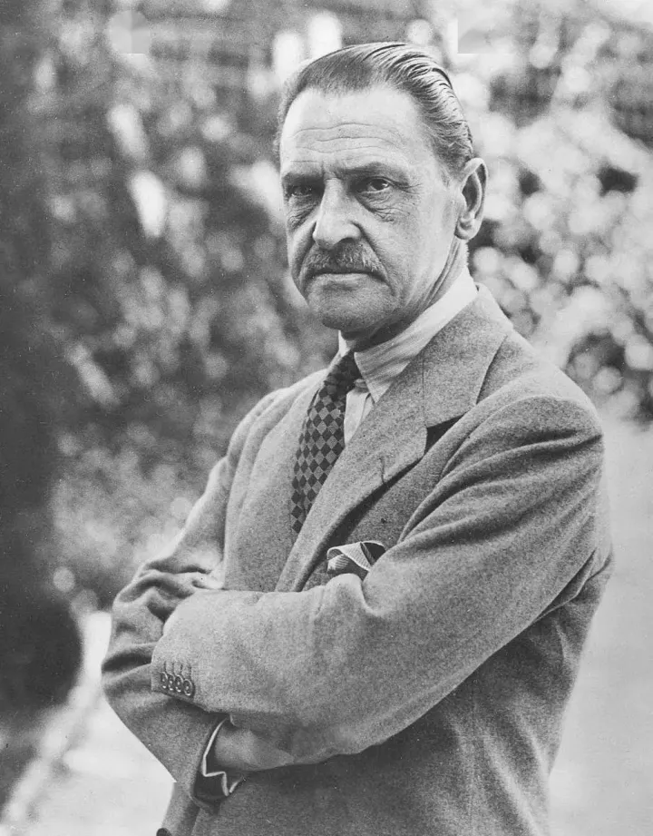

25、为什么钞票一天比一天少，我们会紧张，可生命一天比一天少，却没人在乎。

_——[怀特海](https://www.zhihu.com/search?q=%E6%80%80%E7%89%B9%E6%B5%B7&search_source=Entity&hybrid_search_source=Entity&hybrid_search_extra=%7B%22sourceType%22%3A%22answer%22%2C%22sourceId%22%3A2933809976%7D)_

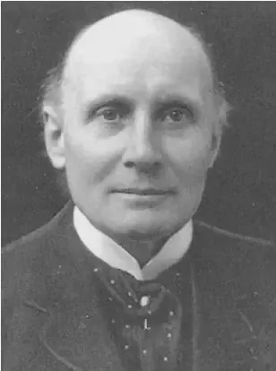

26、如果你找不到睡觉都能赚钱的方法，那么你将工作到死。

_——巴菲特_

27、活下去的诀窍是：保持愚蠢，但又不能知道自己有多愚蠢。

_——王小波_

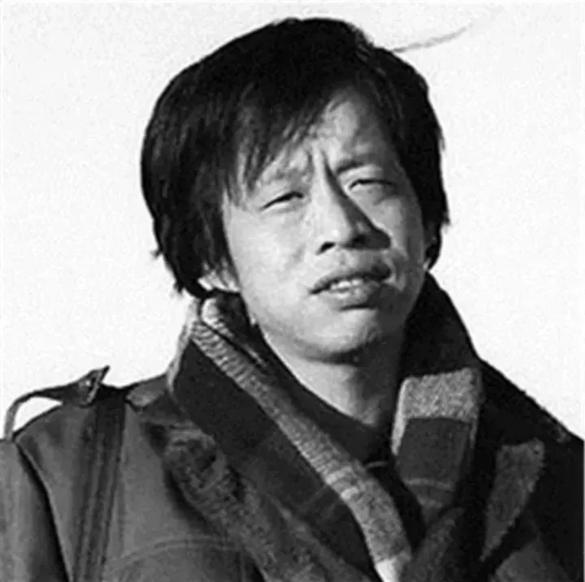

28、良知这种东西就跟天赋一样，有就有，没有就没有，不存在唤醒。

_——[王志文](https://www.zhihu.com/search?q=%E7%8E%8B%E5%BF%97%E6%96%87&search_source=Entity&hybrid_search_source=Entity&hybrid_search_extra=%7B%22sourceType%22%3A%22answer%22%2C%22sourceId%22%3A2933809976%7D)_

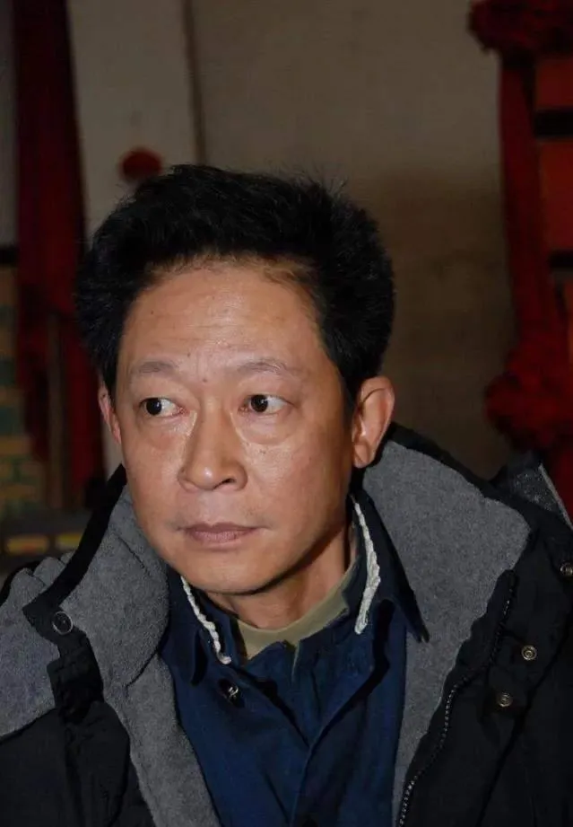

29、99%的情况下，不管犯下多大错误，人们都不会责备自己。——

_——戴尔·卡耐基_

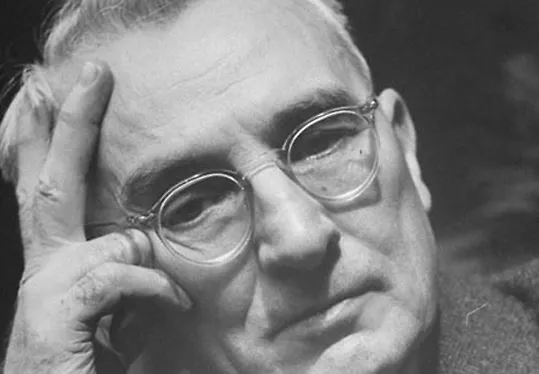

30、只有用金钱支持你的人，才是最认可你的人，真心想帮你的人从来没有那么废话。

_——毛姆_

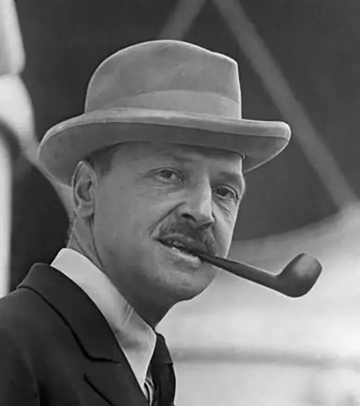

31、即使闭嘴看起来像个傻瓜，也比开口让人家确定你就是个傻瓜来的强。

_——[马克吐温](https://www.zhihu.com/search?q=%E9%A9%AC%E5%85%8B%E5%90%90%E6%B8%A9&search_source=Entity&hybrid_search_source=Entity&hybrid_search_extra=%7B%22sourceType%22%3A%22answer%22%2C%22sourceId%22%3A2933809976%7D)_

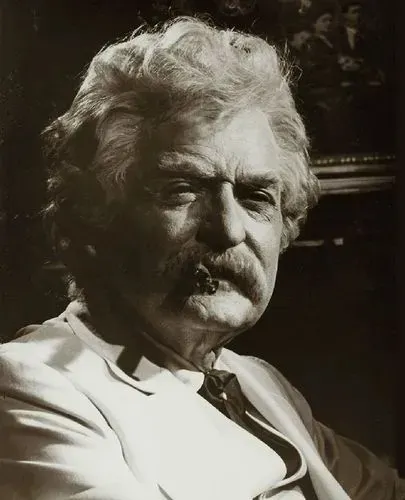

32、刚开始什么都好，到最后才发现不开始最好。

_——[奥黛丽·赫本](https://www.zhihu.com/search?q=%E5%A5%A5%E9%BB%9B%E4%B8%BD%C2%B7%E8%B5%AB%E6%9C%AC&search_source=Entity&hybrid_search_source=Entity&hybrid_search_extra=%7B%22sourceType%22%3A%22answer%22%2C%22sourceId%22%3A2933809976%7D)_

33、你越冷血，越果断，越不拖泥带水，就越有人欣赏你。

_——[赫伯特](https://www.zhihu.com/search?q=%E8%B5%AB%E4%BC%AF%E7%89%B9&search_source=Entity&hybrid_search_source=Entity&hybrid_search_extra=%7B%22sourceType%22%3A%22answer%22%2C%22sourceId%22%3A2933809976%7D)_

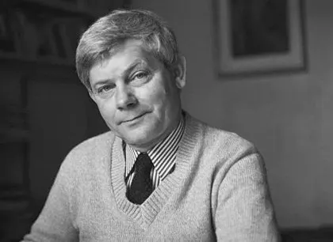

34、生小孩的前提是，你已经证明了人生是快乐的。

_——[米兰·昆德拉](https://www.zhihu.com/search?q=%E7%B1%B3%E5%85%B0%C2%B7%E6%98%86%E5%BE%B7%E6%8B%89&search_source=Entity&hybrid_search_source=Entity&hybrid_search_extra=%7B%22sourceType%22%3A%22answer%22%2C%22sourceId%22%3A2933809976%7D)_

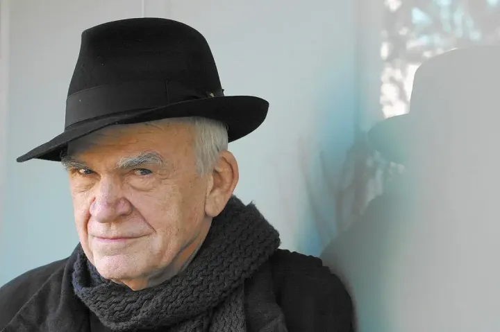

35、人生下来的时候只是无知，但并不是愚蠢，愚蠢是后来的教育造成的。

_——罗素_

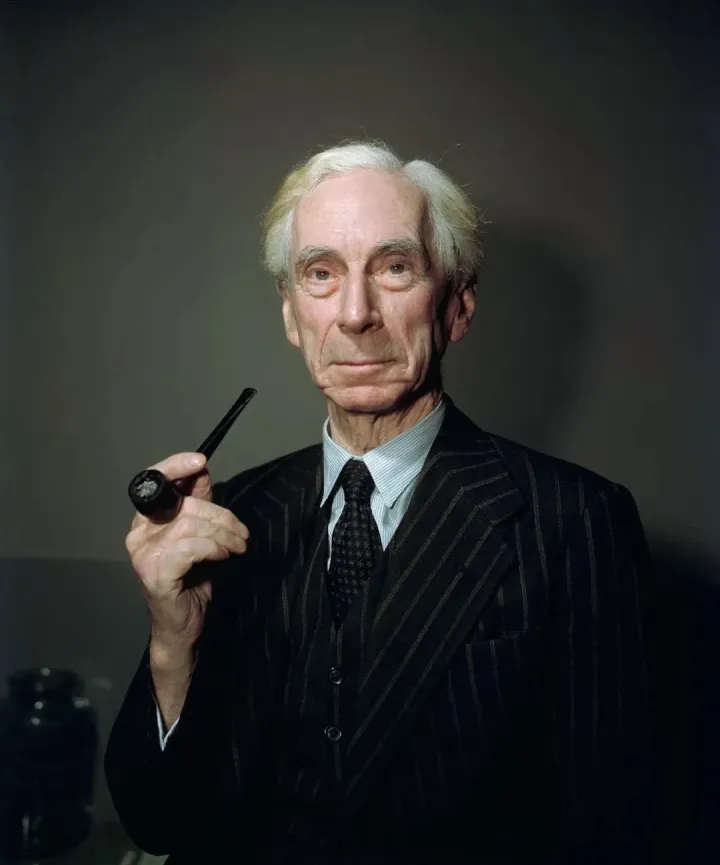

36、让他们相信他们被骗了，比骗他们还难。

_——马克吐温_

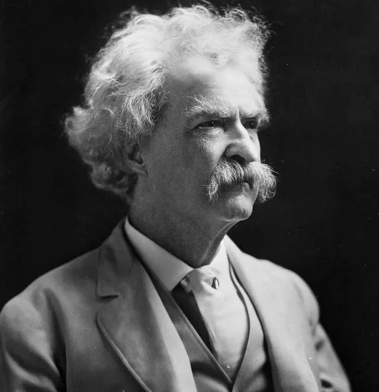

37、能控制自己嘴巴的人都很厉害，不管是吃饭还是说话。

_——[爱默生](https://www.zhihu.com/search?q=%E7%88%B1%E9%BB%98%E7%94%9F&search_source=Entity&hybrid_search_source=Entity&hybrid_search_extra=%7B%22sourceType%22%3A%22answer%22%2C%22sourceId%22%3A2933809976%7D)_

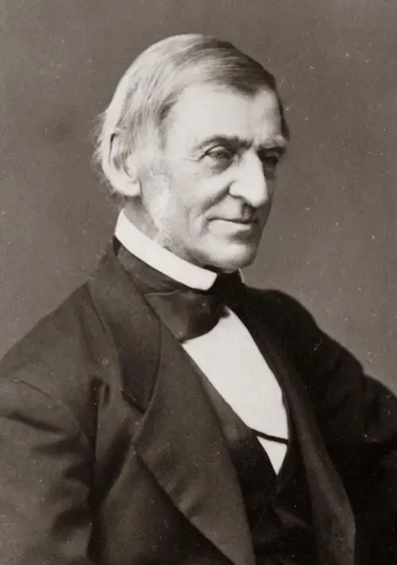

38、心软和不好意思，只会杀死自己。理性的薄情和无情，才是生存利器。

_——毛姆_

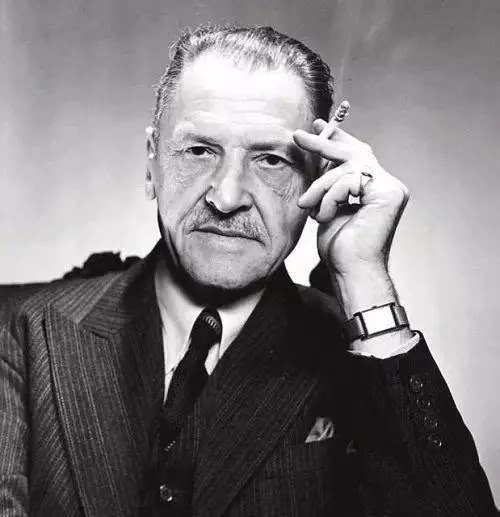

39、社会资源永远是有限的，好东西要靠抢。只有弱者才会坐等分配。

_——[利弗莫尔](https://www.zhihu.com/search?q=%E5%88%A9%E5%BC%97%E8%8E%AB%E5%B0%94&search_source=Entity&hybrid_search_source=Entity&hybrid_search_extra=%7B%22sourceType%22%3A%22answer%22%2C%22sourceId%22%3A2933809976%7D)_

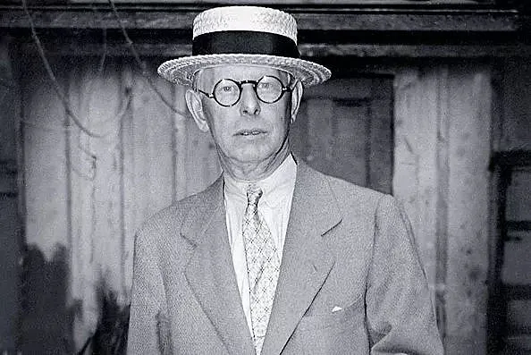

40、不是读书没用，是你读的那点破书没用，多花点时间塑造自己，少花点时间研究别人

_——罗素_

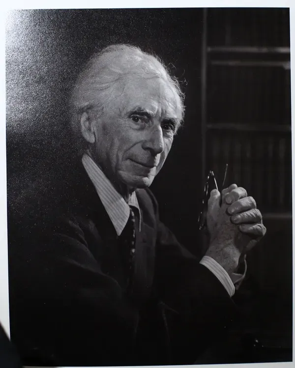