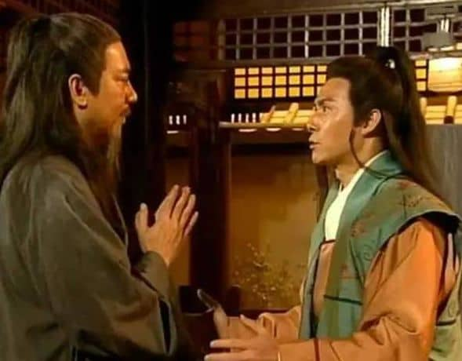
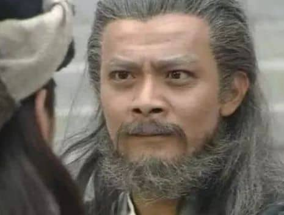
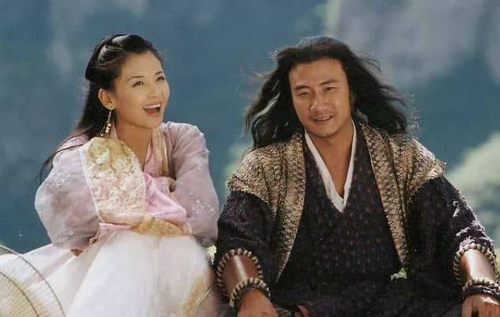
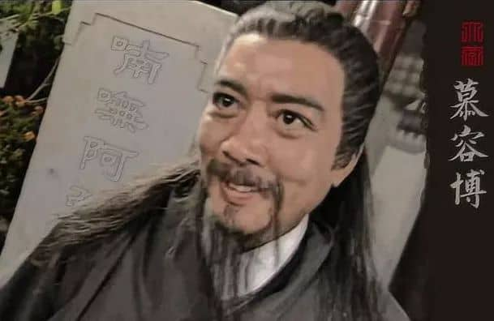
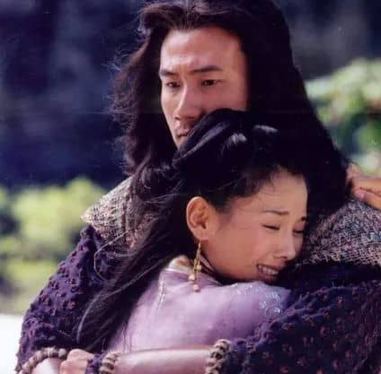

因为金庸在创作过程中，临时改了思路，**把“大恶人”从慕容博变成萧远山**，只为了维护**阿朱**这个女主角的“爱情纯粹”，以至于留下一堆难以自圆其说的bug。

上世纪60年代，最初在《明报》连载《天龙八部》时，写到萧峰和阿朱的相关剧情时，金庸的本来创作思路应该是什么？

一个惊骇的结论：**慕容博才是易容术冒充萧峰，四处杀人的大boss。**阿朱奉慕容博之命，潜伏在萧峰身边，一边传递消息，一边不停潜移默化地洗脑，令他对慕容氏大具好感，施舍偌大人情。

先看看**阿朱向萧峰撒的一个谎**：

她说某日慕容博和慕容复父子，在家谈论武功，自己站在旁斟茶，听到了几句：慕容博称「大理段氏的六脉神剑，和少林易筋经并为武林两大绝技」。慕容复鄙视王夫人李青萝和王语嫣「王家舅母和表妹就爱自夸多识天下武功，可是博而不精，有何用处。」又说慕容博去世时，已经五十多岁，「忽然早上生病，到得晚间，公子便大声号哭，出来告知众人，老爷死了。」

然而，从《天龙八部》后续剧情，我们知道的明显事实：慕容博假死，是因为30年前雁门关之战，他是假传讯息的罪魁祸首，无颜面对少林玄慈方丈的追责，因此，当少林玄悲大师到燕子坞登门拜访时，他和自己妻子商议，就决定假死了。而且还瞒过了年龄尚轻的慕容复，以免其露出破绽。根据新修版《天龙》旁白，慕容博是【离家数月后，由妻子向儿子及众家臣言明，老爷已在外逝世，接着筹办丧事，棺殓、发讣、设灵、开吊、祭奠、入葬等事宜一一齐办】

数年之后，慕容复年岁渐长，形貌俊雅，学武有成，亦在江湖上闯出一番名头，“南慕容”遂与“北乔峰”并称中原武林两大高手。

又过数年，慕容博得悉玄悲前赴大理，于是暗中跟随，以“斗转星移”将玄悲绝技“大韦陀杵”还击其自身，将其杀死，接着进入《天龙八部》主线剧情，此时，慕容博约60岁，慕容复约28岁，王语嫣和阿朱这对血亲姊妹大致是18岁上下。

好了，**阿朱这段话的明显破绽**：1、慕容博假死，明明是离家数月后，由其妻慕容夫人宣布，慕容博死在外面，接着筹办丧事。阿朱为何要说他是在燕子坞，早上生病，晚上死的？

2、慕容博假死，发生在《天龙》主线剧情之前若干年，慕容复尚无“南慕容”之名，那么比他小了10岁的王语嫣才多大？一个萝莉幼女，就已经到了慕容复和父亲谈论武功时，还要念念不忘地吐槽一番的地步了？

而且，一个在小木屋之战，连五虎断门刀、柴刀十八路等几十种杂门武功都练了个遍，还颇以此精通百家刀法为荣的慕容复，真好意思鄙视自己表妹「博而不精，有何用处？」

整部《天龙八部》，除了阿朱以外，还有谁精通易容术，到其他熟人都无法辨认的地步？化名“燕龙渊”，潜藏少林寺盗经的慕容博。恰好也正是阿朱的旧主公。

那么，阿朱神乎其神的易容术，当真是如她自己所说，耍着玩就能“无师自通”的？——她的生母阮星竹，虽然也粗通易容术，但实际效果一戳就破，远不及阿朱冠绝金庸十四书的出神入化。

玄慈方丈公开声称，玄悲之所以被杀，想必是他在燕子坞登门拜访时，发现了慕容氏图谋造反的蛛丝马迹，才会被慕容博寻机杀人灭口。慕容博默认了这项指责。而易容术，恰恰就是对谋反大业极有助力的一项技能。因此，阿朱在慕容氏的重要地位，比起包不同风波恶这种四处惹祸、无事生非的家将，肯定是远过之无不及的。

阿朱为什么会身负重伤，进而引发一场萧峰屠戮中原武林，结下无数仇怨，再也难以立足的聚贤庄大战？是因为她去少林寺盗取其镇寺之宝《易筋经》。

《易筋经》既是天龙世界和《六脉神剑》并列的顶级神功，看看鸠摩智去天龙寺夺经是何等阵势，要说慕容氏一个婢女，自己突发奇想，就轻轻松松偷窃得手，若非被寺内的萧峰意外搅局，甚至可以全身而退，这简直匪夷所思到犹如神话。

她有没有内应？内应是何人？潜藏寺内数十年的慕（燕）容（龙）博（渊），是否就是重大嫌疑人？

萧远山虽然和萧峰相貌相似，但一个60岁的老者，一个30岁的壮年，任何正常人无论如何也不会认错。玄苦身边的小沙弥，一口咬定重伤玄苦的是萧峰，「瞧得清清楚楚的，他身穿灰布直缀，方脸蛋，眉毛这般上翘，大口大耳朵，正是他」，这个凶手当真是萧远山么？他不但特意化妆，让自己年轻了30岁，而且连衣着也特意和萧峰一样？

在那之后，萧峰一路追查坑害自己的“大恶人”，为何总是被捷足先登，提前将人证杀人灭口？“大恶人”真是最后自己承认的萧远山么？他吃饱了撑的，非要一路坑害亲儿子，非要害得他身败名裂，痛苦不堪？

而且，萧远山既然连续杀了玄苦、谭婆、赵钱孙、单正等人，为何真正坑陷他儿子的罪魁祸首，马夫人康敏偏偏留着不杀，让她给萧峰提供一个“大恶人是段正淳”的大笑话？

阿朱和萧峰同行过程中，不断向萧峰提起姑苏慕容氏的好话，令萧峰大为赞叹：「深得我心，深得我心。可惜慕容先生已然逝世，否则萧峰定要到他庄上，见一见这位天下奇人。」「姑苏慕容氏名满天下，却不狂妄自大，甚是难得。」「可惜，可惜。可惜薛神医不在左近，否则好歹也要请了他来，救活慕容先生一命。」，以至于对慕容博【颇为钦慕，再加上阿朱的渊源，更多了一层亲厚之意。】

阿朱还用姑苏慕容氏那套价值观，潜移默化地对萧峰洗脑：「父母之仇不共戴天，只求报得大仇，什么阴险毒辣、卑鄙肮脏之事，那也都干得了」，让萧峰凛然心惊，向她深深一揖：「贤妹责备得是，为大事者岂可拘泥小节？」

此前深受中原武林30年侠义教育的萧峰，连遭丧变后，不由自主地认同了她这套理论，一度将复仇当成了人生至大之事。

阿朱连本欲上交给慕容复的《易筋经》，先给萧峰去观看，籍此报仇，更如此一步步让萧峰对她感激有加。而《易筋经》为梵文之事，以她的才识，竟会当真甘冒奇险盗出经书后，都不先看看真伪？直到要交给萧峰时方知？——当真不怕少林寺故布疑阵么？

梵文在当时宋朝，虽然懂的人不多，但也绝不是什么特别机密、不可破译的密码，很多学富五车之人，或名寺的高僧大德都会。比如几十年后的《九阴真经》作者黄裳，作为一个汉人文官，一样识得梵文。

所以，如果萧峰当真心切报仇，急需凭《易筋经》来迅速提高自己武力，阿朱不就可以顺理成章向他介绍懂得梵文的某位高人，比如那位潜藏少林寺数十年，不知偷阅多少秘本的燕（慕）龙（容）渊（博）老先生了么？

为了结好鸠摩智这个吐蕃国师，慕容博可以将少林七十二绝技倾囊相授，令其武功大进；那么对潜力极大、神威盖世，却又不容于中原武林的萧峰，雪中送炭来送一部《易筋经》，算不算天大的人情？

通行版《天龙》里，还有极诡异的一段剧情，就是某神秘高手，假扮马大元鬼魂，掐死了白世镜，又和萧峰比赛，连跑两个时辰，奔出一百多里，也刚好将萧峰引开，令康敏被阿紫虐杀。——此后第五卷少室山大战时，证实此人是萧远山。

然而，萧峰却将此人和在聚贤庄大战后营救自己的萧远山，当做了截然不同的两个人，两个武功都和自己相当的高手。还对不能与他结交，极是惋惜：【萧峰每喝得一两碗，便拍桌赞叹：“好男儿，好汉子，哎，可惜，可惜！”】

萧峰和萧远山曾就近切磋过多招，此刻怎么判断力这么差了？和萧远山分别才多久，居然就认不出自己的救命恩人了？

要知道任何超一流高手对武功路数的敏感，是金庸世界固有设定。《射雕》西域石屋一战，郭靖、欧阳锋、裘千仞、周伯通等四人拆了一招，登时对彼此的身份基本了然。

再者说了，萧远山既已是萧峰的“恩公”，又何必多造一个身份再和他见面比拼？

如果不考虑《天龙》第五卷，按金庸写作的本来意图，这个人更像谁？

白世镜和康敏谋杀马大元，假造现场，把黑锅栽赃给了慕容氏，令丐帮大举到江南寻仇。按行事风格而论，谁最有动机，让白世镜也死于马大元的“锁喉擒拿手”之下？是不是“以彼之道还施彼身”的慕容博？

而且，如果是后来被论证是“行事暴戾、滥杀无辜”的萧远山所为，多半顺手把段正淳也宰了。只有慕容博的行事风格，才故意要留下「让白世镜自食其果」的相关人证，一如他此前“以彼之道还施彼身”，对付黄眉僧、章虚道人等人的风格。

正因为这段剧情，和后续《天龙》第五卷里，假扮者变成了萧远山，相互冲突，bug太多，所以新修版里，金庸才索性直接删了，将假扮马大元鬼魂的人换成了萧峰自己。只是版本可以改动，但作者的原本创作意图，也在之前版本中，有相应的脉络可寻了。

在康敏撒谎之后，顺水推舟，让萧峰去杀死段正淳，和大理段氏结下不可解之仇，是唯恐天下不乱的慕容博的既定计划，然而千算万算，唯独没有算到，阿朱是段正淳之女之事，被她自己知晓了。

对阿朱来说，虽然和生父、生母都毫无感情，但自己此前对爱人的种种欺瞒，都因此成了愚不可及的大笑话后，既无勇气揭开真正的幕后真相，用情越深越是无颜面对，才决然选择了以死谢罪。

事实上，萧峰真正彻底爱上阿朱，爱到「四海列国，千秋万代，也只有一个阿朱」的程度，正是在她为自己死后。此前很大程度上是连遭困窘之下，“贫不择妻”，随后出生入死，彼此感情日深而已，至少两人杏子林初会时，尚无任何“一见钟情”的冲动。哪怕是聚贤庄血战后，萧峰也一度并未将阿朱当做恋人，直到雁门关一会方始定情。

然而，随着剧情的推演，阿朱虽已身死，萧峰此后数年时光，时时刻刻的怀念、点点滴滴的用情，最后终于让金庸“不忍心”揭开这样的残酷真相，因此写到第五卷少室山大战时，紧急修改了相关剧情大纲。

阿朱的主公慕容博，因此从处心积虑的大阴谋家，变成了纯损人不利己、专坑儿子的脑残。

萧远山不但死而复生，而且将“大恶人”的罪行的全背了，也从惊鸿一瞥的慷慨英雄，变成了另一个行事完全不合逻辑、专坑儿子的脑残。最后为了让此二人尽快退场，影响原本大纲，又只好空降一个扫地僧来“机械降神”。

整部《天龙八部》，因此产生了无数不合情理、常年被人诟病的剧情bug，正是作者创作态度过于随意的后果。

为了撇清阿朱和慕容氏的关系，连载版《天龙》里，阿碧催请慕容复带领众家将上少林寻阿朱，随后慕容诸家将才遇上丁春秋和函谷八友的剧情，此后三联、新修版本也被删除了。

金老先生尚嫌不足，新修版《天龙》又加上了包不同见到阿朱和萧峰，认可他们关系，萧峰帮慕容氏打败星宿派摩云子等人，抢回两万两银子，让萧峰觉得「总算帮了慕容公子一个忙，以后带了阿朱北上，不再回来，也就心安理得」，让阿朱对包不同说「三哥，慕容家待我和阿碧很好，从小把我们养大，就当自己女儿一样，待你们也好，就像是自己兄弟。我本该好好报答，但我这一生一世，已跟定了萧大哥，他死也罢，活也罢，我心里总之再没第二个男人了」等“蛇足”剧情。

少室山大战时，又让萧峰主动发问慕容复「你要找我报仇，是因为我杀了姑苏慕容家那一个人吗？」，慕容复居然“无言可对”，反说「你和我齐名已久，今日要分个高下」，证明慕容氏并没把阿朱当成自己人，没把她死活放在心上，以消解慕容复挑战萧峰的合理性。

而且，新修版《天龙》为了帮阿朱此前的说辞【圆谎】，不得不尽可能拖长慕容博假死的时间，拖到雁门关惨案后的二十多年，五十多岁时才诈死，让他自己的诈死之举，以及玄慈方丈对他的相关追责，都变成不知所谓的笑话。

连载版和三联版里，本已肯定死去的慕容王氏夫人，慕容博之妻，慕容复之母，王语嫣名义上的姑母，也因此在新修版被死而复生，一直在幕后策划，替慕容博当传声筒。

然而第二卷曼陀山庄的相关剧情，偏偏没跟着改动，王语嫣依旧称她早已过世，恶婆婆严妈妈依旧扬言「去掘了慕容家姑太太的坟，将她尸骨拿到花肥房来」……留下了一目了然的新bug。

不得不说，金老先生的创作意图很明确，但就是打补丁修复bug的水平，已经远不能和壮年时创作黄金期相比了。

比较成功的写法，其实是紧接《天龙》之后的《笑傲江湖》，少林武当两派谋算五岳剑派的种种谋划，向问天坑陷令狐冲的种种阴谋，都是含而不露，识者自识。拿掉这些阴谋论，把方证和冲虚当作真正的守序善良系的武林高人，把向问天当做慷慨豪迈、赤胆忠心的义士，就是各个版本电视剧的简单处理，故事仍然完全成立，而且精彩。

这才是巅峰金庸的极厉害处，充分体现了文学作品的功能性、戏剧性和美学的全方位统一。

其实《天龙》的“萧朱恋”相关情节，也完全可以设计类似的两层真相。一层慕容博大恶人的“阴”，一层兼容阴谋论的“阳”，而且都完全能够成立。所需要做的，仅仅是将三联版《天龙》第五卷，萧远山杀玄苦、杀白世镜的自白都虚化、删除就行了。这样表面一层真相，仍然如大家所通常认知的这样，给意识不到这些的读者或观众看，故事也同样完全成立。

而有心的读者亦可从情节种种不合理处，自行推导出深一层真相：当时举世皆敌，眼见父子二人难以脱身，萧远山索性破罐子破摔，帮儿子顶罪。而他和真正的“大恶人”慕容博的举动，也因此变得极有逻辑，不再是不知所谓，只会坑儿子的脑残

萧峰也不必再担负起「因为凶手是生父，就不替养父母、恩师报仇，或出言谴责、声讨真凶」的道德负担，岂不美哉？
