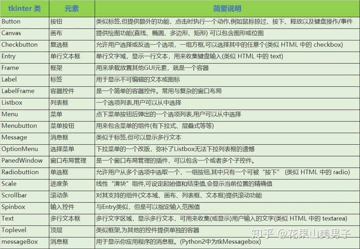
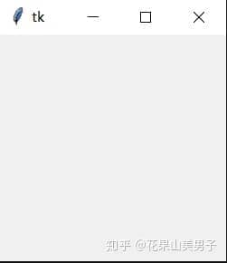
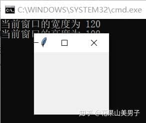
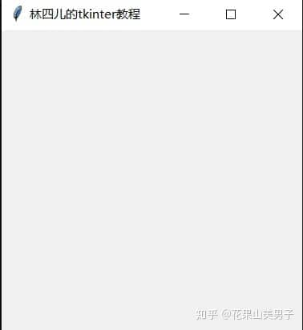
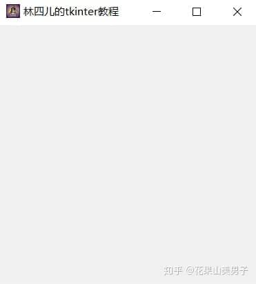

## **前言**

我是从2017年，也就是研究生入学后才开始接触python语言的。在此期间做过一些项目，用到了python的GUI编程，先后使用过tkinter和pyqt5两个模块。与pyqt5相比，tkinter无疑是更简单的选择，在对图形化界面没有太高要求的情况下，个人十分推荐选择tkinter。

当然，如果你本身具备了一定Qt的使用经验，转移到pyqt并不会很复杂。而且与tkinter相比，pyqt可以用拖控件的方式设计界面，tkinter却只能自己写代码。如果你想做一个复杂点的项目，动辄上千行代码就出去了，写起来很累，但写完了会很有成就感。然而，虽然代码很多，但有很多地方可以通过复制粘贴来重现，不要以为上千行代码就很复杂。

那么我们为什么还要使用tkinter呢？在我看来主要有以下三点原因：

_其一，tkinter是python自带的库，无需安装，性能很好而且具有良好的技术支持。_

_其二，门槛低，即使你只学过python也能很快上手。虽然tkinter里面有很多组件，每个组件又有各自的方法、参数等等，但通用性很高，而且可以即查即用。_

_其三，tkinter制作界面的能力被很多人低估了，其实它也可以做出漂亮的UI。_

我学习tkinter已经有两年多的时间了，在专栏里陆陆续续发过一些实战项目。之前我就说过，个人认为学习tkinter最好的方法是以练代学、边查边做。这次我想自己写一本tkinter的学习教程，其中结合了大量的实战项目，包含了许多个人见解和学习经验，或许是你在其他地方搜不到的。

在学习本书之前，你唯一需要掌握的就是**python的基础语法知识**。另外，本书所有代码是基于python3.x的版本。

* * *

## 1.认识tkinter

**1.1 tkinter是什么？**

Tkinter 模块(Tk 接口)是 Python 的标准 Tk GUI 工具包的接口，TCL/Tk的GUI工具组。Tk 和 Tkinter 可以在大多数的 Unix 平台下使用，也可以应用在 Windows 和 Mac 系统里。在使用Tkinter时，我们不需要关注TCL/Tk的实现，而可以将Tkinter看成python一个独立的扩展。

> 你可能注意到了，为什么这里的Tkinter变成大写了呢？其实，如今网上的各类教程里都习惯写作Tkinter，这是由于在Python3之后，它才改名为tkinter，而后文会统一采用tkinter的写法。

tkinter模块下，还有许多增强模块，如tkinter.ttk 和 tkinter.tix等，它们为tkinter补充了更多的组件。另外，scrolledtext提供了带滚动条的文本框，messagebox、filedialog等模块提供了各种对话框。本书的内容是以tkinter基本组件的学习为主（如图1.1），在实战项目需要时，会介绍其他模块的相关内容。



图1.1 tkinter的基本组件

由于 tkinter 是内置到 python 的安装包中、只要安装好 Python 之后就能导入库、然后创建GUI程序了。就连 IDLE 都是用 tkinter 编写而成，因此对于简单的图形界面 ，tkinter 无疑是能应付自如。

**1.2 创建第一个tkinter程序**

创建程序的第一步，一定是要导入tkinter模块，通常我们会用以下两种方式：

> from tkinter import \*  
> import tkinter as tk

如果采用第一种，在引用组件时不需要加前缀，第二种方式则必须加上tk.的前缀。当然，这两种引用方式仅限于tkinter本身的模块，不包括上文提到的扩展模块。以ttk为例，它的导入方式应该为：

> from tkinter import ttk

第二步，创建控件实例：

> root = Tk()

第三步，进入事件循环：

> root.mainloop()

mainloop方法一定要放在最后执行。如果我们把tkinter程序看成一本连环画的话，那么mainloop方法就是翻阅连环画的动作，没有它是无法实现连环画效果的。也就是说，**如果你想要设计并布局一个界面，其内容应该放在创建控件实例和进入事件循环之间**：

```python
from tkinter import *

root = Tk()
'''
在这里实现界面
'''
root.mainloop()
```



图1.2 空白界面

如图1.2就是我们创建的一个空白界面，它没有任何的功能。tkinter默认的窗口大小是200x200，默认标题是tk。我们可以用下面的方法获取它的大小：

```python
from tkinter import *

root = Tk()
root.update()  #一定要刷新界面，否则打印出的值是1
print("当前窗口的宽度为",root.winfo_width())
print("当前窗口的高度为",root.winfo_height())
root.mainloop()
```

在上面这段代码中，我们用update方法刷新了界面，这又是为什么呢？

其实，**利用winfo\_width和winfo\_height获得的宽高其实是tkinter初始化时的值**，因此在创建实例后，必须刷新界面，才能得到它当前正确的宽和高。

既然能够获取窗口大小，就一定有办法自定义。这次我们要用到geometry方法：

> root.geometry("100x100") #“宽度x高度”

奇怪的事情发生了，创建的窗口宽度不是100，而是120，这是咋回事呢？



图1.3 奇怪的现象

原来啊，tkinter帮我们创建了窗口装饰器，装饰器有以下几个部分：图标、标题、最大化、最小化和关闭按钮。在win10系统下，这些装饰器的最小宽度就是120，高度则不受影响。也就是说，**图中灰色部分，才是我们创建的界面，最上方的装饰器是自带的**。

接下来，我们再用title方法为界面取一个名字吧：

```python
from tkinter import *

root = Tk()
root.geometry("300x300") 
root.title("林四儿的tkinter教程")  #设置标题
root.mainloop()
```



图1.4 给程序命名

但是这自带的图标也太丑了，有没有办法换成自己的图片呢？办法当然有，不过一定要事先准备好.ico文件，然后输入正确的路径：

```python
from tkinter import *

root = Tk()
root.geometry("300x300") 
root.title("林四儿的tkinter教程")
root.iconbitmap('icon.ico')  #设置图标，仅支持.ico文件
root.mainloop()
```

到这里，第一个tkinter程序总算完成了：



图1.5 第一个tkinter程序

* * *

下一节，我们会详细学习tkinter两个最常用的组件——标签Label和按钮Button。
