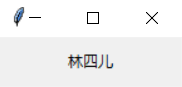
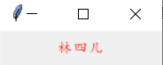
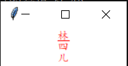
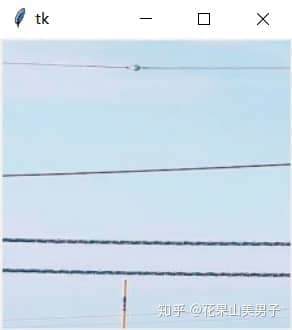
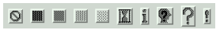

## 2.标签控件——Label

在tkinter中，可以显示文本和图像的控件有很多，但能够二者兼顾的一个最简单的控件，就是标签（Label）。如果你需要显示一行或多行文本，且不允许用户直接进行修改，那么就可以使用Label。

让我们先来创建一个空白的Label：

```python
from tkinter import *

root = Tk()
l = Label(root)  #如果只有一个窗口，root也可以省略
l.pack()  #布局的方法，先别管它，后面再介绍
root.mainloop()
```

运行这段代码后可以发现（用上一节的方法输出窗口大小），原本默认大小是200x200的窗口，由于Label的存在，默认大小变成了120x23。这说明在win10系统下，Label默认的最小高度就是23。

那么我们先来改变一下Label的宽和高吧，只需要改变width和height这两个参数：

```python
from tkinter import *

root = Tk()
l = Label(root,width=20,height=2)
l.pack()
root.mainloop()
```

这次窗口的宽度和高度又变了。改变width和height的值，再输出窗口大小可以发现，Label控件和宽度和高度，并非直接对应像素值——width每增加一个，像素值增加7；height每增加一个，像素值则增加17。这是因为Label默认的尺寸单位是文本单元，如果你显示的是图像，那么它的单位就是像素单元了。**其实其他控件的width和height参数同样如此**。

接下来，试着用Label显示一段文本吧：

```python
from tkinter import *

root = Tk()
l = Label(root,width=20,height=2,text="林四儿")
l.pack()
root.mainloop()
```



图2.1 显示文本

字体太普通了，这次我们改变一下字号、字体和颜色：

```python
from tkinter import *

root = Tk()
l = Label(root,width=20,height=2,text="林四儿",fg="red",font=('楷体',10))
l.pack()
root.mainloop()
```



图2.2 改变文本属性

再试一下更多的属性，比如将背景设为白色，文字按列显示，第一个字加下划线：

```python
from tkinter import *

root = Tk()
l = Label(root,width=20,height=3,text="林四儿",fg="red",font=('楷体',10),bg="white",wraplength=3,underline=0)
l.pack()
root.mainloop()
```



图2.3 更多属性

比较遗憾的是，underline这个属性只能设置某一个字符下面加下划线，不能设置多个。另外，**wraplength参数并不是说设置成几就会分几行显示**（但网上的参考资料是这么描述的），只要设置成非0的数，它都会显示成一列。

如果你想让文本换行，在wraplength=0时，'\\n'是有效的；但在wraplength≠0时，'\\n'也会失效。也就是说，Label的文本可以换行，但不能换列。

下面是Label控件包含的所有参数，其中有许多通用参数，在其他控件也会用到，等讲到其他控件的时候就会看到了：

1.  **anchor** 文本或图像在背景内容区的位置，默认为 center，可选值为（n,s,w,e,ne,nw,sw,se,center）eswn 是东南西北英文的首字母，表示：上北下南左西右东。
2.  **bg** 标签背景颜色
3.  **bd** 标签的大小，默认为 2 个像素
4.  **bitmap** 指定标签上的位图，如果指定了图片，则该选项忽略
5.  **cursor** 鼠标移动到标签时，光标的形状，可以设置为 arrow, circle, cross, plus 等。
6.  **font** 设置字体。
7.  **fg** 设置前景色。
8.  **height** 标签的高度，默认值是 0。
9.  **image** 设置标签图像。
10.  **justify** 定义对齐方式，可选值有：LEFT,RIGHT,CENTER，默认为 CENTER。
11.  **padx** x 轴间距，以像素计，默认 1。
12.  **pady** y 轴间距，以像素计，默认 1。
13.  **relief** 边框样式，可选的有：FLAT、SUNKEN、RAISED、GROOVE、RIDGE。默认为 FLAT。
14.  **text** 设置文本，可以包含换行符(\\n)。
15.  **textvariable** 标签显示 Tkinter 变量，StringVar。如果变量被修改，标签文本将自动更新。
16.  **underline** 设置下划线，默认 -1，如果设置 1，则是从第二个字符开始画下划线。
17.  **width** 设置标签宽度，默认值是 0，自动计算，单位以像素计。
18.  **wraplength** 设置标签文本按行或列显示，默认为 0。

Label的文本也可以改变，而且有两种方法：一种是利用text属性，另一种则是利用textvariable属性。具体的实现方法，我们会在下一节Button中讲述。

除了文本以外，Label的image属性还可以显示图片。但tkinter自带的PhotoImage模块只能识别png和gif图像，想要显示其他格式的图片，需要借助PIL库进行格式转换：

```python
from tkinter import *

root = Tk()
img = PhotoImage(file='1.png')
l = Label(root,image=img)
l.pack()
root.mainloop()
```



图2.4 显示png图像

如果用上面的方法直接显示jpg文件，Label会因无法识别图片而显示一片空白，需要改成下面的方法：

```python
from tkinter import *
from PIL import Image,ImageTk

root = Tk()
img = Image.open('1.jpg')
img = ImageTk.PhotoImage(img)
l = Label(root,image=img)
l.pack()
root.mainloop()
```

最后是位图的显示。在tkinter中，有下面这些位图是可用的：



图2.5 位图

它们从左到右依次表示为：“error”, “gray75”, “gray50”, “gray25”, “gray12”, “hourglass”, “info”, “questhead”,“question”, “warning”。如果你想要显示位图，可以简单地写作：

```python
l = Label(root,bitmap="error")
```

除了在创建时设定Label的属性，也可以用config方法随时改变属性，例如：

```python
from tkinter import *

root = Tk()
l = Label(root)
l.pack()
l.config(text="林四儿")
root.mainloop()
```

结果是一样的，Label会显示出我们设定的文本。一般来说，config方法会与Button或鼠标事件结合，用于即时改变Label的属性。

什么？你说你还想同时显示图像和文字……那你为什么不创建两个Label？——好吧，其实是有办法的，先卖个关子，下节再讲。
