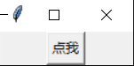
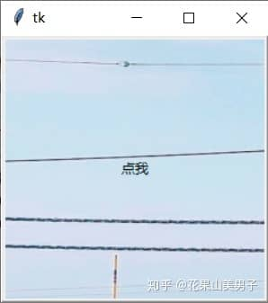

## 3.按钮控件——Button

Button组件用于在 tkinter 应用程序中添加按钮，按钮上可以设置文本或图像，用于监听用户行为，能够与一个 Python 函数关联；当按钮被按下时，自动调用该函数。

创建一个无关联命令的按钮：

```python
from tkinter import *

root = Tk()
b = Button(root, text ="点我")
b.pack()
root.mainloop()
```



图3.1 无命令按钮

和Label类似，Button也有很多属性选项（在tkinter的新版本中，甚至不止这些）：

1.  **text** 按钮的文本内容
2.  **image** 按钮上要显示的图片
3.  **command** 按钮关联的函数，当按钮被点击时，执行该函数
4.  **height** 按钮的高度
5.  **width** 按钮的宽度，如未设置此项，其大小以适应按钮的内容（文本或图片的大小）
6.  **fg** 按钮的前景色（按钮文本的颜色）
7.  **bg** 按钮的背景色
8.  **padx** 按钮在x轴方向上的内边距(padding)，是指按钮的内容与按钮边缘的距离
9.  **pady** 按钮在y轴方向上的内边距(padding)
10.  **activebackground** 当鼠标放上去时，按钮的背景色
11.  **activeforeground** 当鼠标放上去时，按钮的前景色
12.  **font** 文本字体
13.  **bd** 按钮边框的大小，默认为 2 个像素
14.  **highlightcolor** 要高亮的颜色
15.  **justify** 显示多行文本的时候,设置不同行之间的对齐方式，可选项包括LEFT, RIGHT, CENTER
16.  **relief** 边框样式，设置控件3D效果，可选的有：FLAT、SUNKEN、RAISED、GROOVE、RIDGE。默认为 FLAT。
17.  **state** 设置按钮组件状态,可选的有NORMAL、ACTIVE、 DISABLED。默认 NORMAL。
18.  **underline** 下划线。默认按钮上的文本都不带下划线。取值就是带下划线的字符串索引，为 0 时，第一个字符带下划线，为 1 时，前两个字符带下划线，以此类推
19.  **wraplength** 限制按钮每行显示的字符的数量
20.  **anchor** 锚选项，控制文本的位置，默认为中心
21.  **cursor** 指定当鼠标在 Button 上飘过的时候的鼠标样式，可选的有"arrow"、"circle"、"clock"、"cross"、"dotbox"、"exchange"、"fleur"、"heart"、"heart"、"man"、"mouse"、"pirate"、"plus"、"shuttle"、"sizing"、"spider"、"spraycan"、"star"、"target"、"tcross"、"trek"、"watch"
22.  **compound** 控制 Button 中文本和图像的混合模式，默认情况下，如果有指定位图或图片，则不显示文本；可选的有"center"、"bottom"、"left"、"right" 或 "top"

和Label一样，你可以使用 height 和 width 选项来明确设置 Button 的大小：**如果你显示的是文本，那么这两个选项是以文本单元为单位；如果你显示的是位图或者图像，那么它们以像素为单位。**同时，padx 和 pady 选项可以在 Button 的内容和边框间添加额外的间距（Label也是如此）。

其他属性我就不一一展示了，有兴趣的话可以自行探索。

不知道你是否还记得，关于Label如何同时显示文本和图像，上一节我们留了个悬念。其实不仅是Label，Button也可以！在早期版本的 tkinter 中，image 选项的确会覆盖 text 选项。但在新的 tkinter 中，你可以使用 compound 选项设置二者的混合模式。例如，通过设置 compound="center" 使得文字位于图片中央的上方（重叠显示）：

```python
from tkinter import *

root = Tk()
photo = PhotoImage(file = '1.png')
b = Button(root, text="点我",image = photo, compound = "center")
b.pack()
root.mainloop()
```



图3.2 图片和文字混合

现在我们只是绘制了Button，接下来就用它来实现上节提到的，改变Label的内容吧。

第一种方法，通过config方法设置text属性：

```python
from tkinter import *

def call():
	l.config(text="林四儿")

root = Tk()
l = Label(root,text="123")
l.pack()
b = Button(root, text="点我",command=call)
b.pack()
root.mainloop()
```

第二种方法，通过StringVar()来改变textvariable属性：

```python
from tkinter import *
from PIL import Image,ImageTk

def call():
	v.set("林四儿")

root = Tk()
v = StringVar(value="123")
l = Label(root,textvariable=v)
l.pack()
b = Button(root, text="点我",command=call)
b.pack()
root.mainloop()
```

两种方法的结果是一样的。不同的是，config方法还可以改变其他属性，而StringVar只能设置Label的可变文本。

command选项默认的方式是点击鼠标左键，按下按钮后触发，但Button和其他控件一样，可以通过绑定鼠标或键盘事件的方式，实现其他触发效果。具体方法我们会在以后讲解。

* * *

掌握了tkinter两种最基本的控件后，下一节我们会学习如何对界面进行布局。
