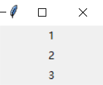
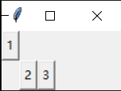
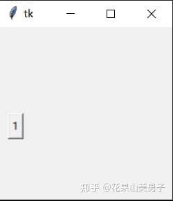

## 4.界面布局

**4.1 pack布局**

前面你已经见到过了一个pack()函数，任何控件都可以用它来实现自动的布局。它的默认方式是从上至下分布，系统会自动安排一个合适的位置。例如：

```python
from tkinter import *

root = Tk()
l = Label(root,text="1")
l.pack()
l = Label(root,text="2")
l.pack()
l = Label(root,text="3")
l.pack()
root.mainloop()
```



图4.1 pack布局示例

实际上，pack包含了几个参数：

*   expand 表示是否扩展，当它设置为True或YES的时候，它会占满父组件的剩余空间；
*   fill 指定填充的方向，可以是 X,Y,BOTH 和 NONE，即在水平方向填充，、竖直方向填充、水平和竖直方向填充和不填充；
*   side 指定了它停靠在哪个方向，可以为 LEFT,TOP,RIGHT,BOTTOM；
*   anchor 参数可以是 "n", "ne", "e", "se", "s", "sw", "w", "nw", 或 "center" 来定位（上北下南左西右东），默认值是 "nw"。

**4.2 grid布局**

grid布局，就是我们常说的网格布局。

grid也有4个可选参数：

*   row 指的是排在第几行，从0开始；
*   rowspan 指的是占有多少行；
*   column 指的是排在第几列，从0开始；
*   columnspan 指的是占有几列；
*   sticky 指的就是对齐固定方式，和anchor类似。

例如：

```python
from tkinter import *

root = Tk()
l = Button(root,text="1")
l.grid(row=0,column=0)
l = Button(root,text="2")
l.grid(row=1,column=1)
l = Button(root,text="3")
l.grid(row=1,column=2)
root.mainloop()
```



图4.2 grid布局示例

但**grid无法隔行或隔列设置**，也就是说，如果你只有三个控件，而前两个控件在第0和第1行，那么第三个控件会自动排列在第2行。

注：**grid布局无法与pack布局一起使用**。

**4.3 place布局**

place布局最重要的是x,y两个参数，可以用来指定与父组件的左上角的横坐标和纵坐标距离（绝对布局）。

其他参数也有，比如relheight、relwidth、relx和rely，它们是相对于父组件的高度、宽度、水平位置和垂直位置（相对布局），取值范围是0.0-1.0，一般和anchor结合使用，但并不建议大家使用，掌握好x、y实现精准定位就足够了。

可以说相对于其它布局，它是最灵活的，也是最精准的，只要给出x,y就可以精确地放置到任何想要的位置，但是因为需要计算距离，所以相对来说也更麻烦一些。

例如：

```python
from tkinter import *

root = Tk()
l = Button(root,text="1")
l.place(x=10,y=100)
root.mainloop()
```



图4.3 place布局

很显然，pack和grid的布局形式更多样，但没有place精准，在实际使用时，按照个人习惯选择布局方式就好了。

* * *

下一节我们会简单介绍tkinter的文本控件。
