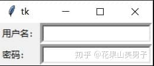
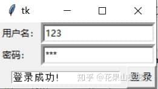

**5.文本控件**

与文本相关的基本控件主要有两种，一种是输入框Entry，另一种是文本框Text。顾名思义，输入框是用来输入简单文本的，而文本框则用来显示多行文本（当然，也可以输入）。

**5.1输入框Entry**

Entry通常用来输入及显示单行文本，如果你认为输入的长度会超过文本框宽度，那么可以利用xscrollcommand属性，并结合scrollbar（滚动条）控件来多行显示，具体实现方法等到讲解scrollbar的章节再说。现在，让我们来实现一个简单的登录界面：

```python
from tkinter import *
 
root = Tk()
L1 = Label(root, text="用户名：")
L1.grid(row=0,column=0,sticky=W)
E1 = Entry(root, bd =5)
E1.grid(row=0,column=1,sticky=E)
L2 = Label(root, text="密码：")
L2.grid(row=1,column=0,sticky=W)
E2 = Entry(root, bd =5)
E2.grid(row=1,column=1,sticky=E) 
root.mainloop()
```



图5.1 登录界面

Entry也能用tkinter中的通用属性，同时它还有一些独有的属性，例如：

*   **exportselection** 默认情况下，你如果在输入框中选中文本，默认会复制到粘贴板，如果要忽略这个功能刻工艺设置 exportselection=0。
*   **selectbackground** 选中文字的背景颜色
*   **selectborderwidth** 选中文字的背景边框宽度
*   **selectforeground** 选中文字的颜色
*   **show** 指定文本框内容显示为字符，值随意，满足字符即可。如密码可以将值设为 show="\*"
*   **state** 默认为 state=NORMAL, 文框状态，分为只读和可写，值为：normal/disabled
*   **xscrollcommand** 设置水平方向滚动条，一般在用户输入的文本框内容宽度大于文本框显示的宽度时使用
*   **takefocus** 指定使用 Tab 键可以将焦点移动到输入框中，默认为True

Entry还有很多方法，其中最重要的有两个：

1.delete ( index1, index2 ) 删除输入框里直接位置值，参数是起始位置和结束位置的索引值，例如：

```python
E1.delete(10)      # 删除索引值为10的值
E1.delete(10, 20)  # 删除索引值从10到20之前的值
E1.delete(0, END)  # 删除所有值
```

2.get() 获取输入框的值

**5.2文本框Text**

如果需要输入多行文本，则可以使用Text控件。当你创建一个 Text 组件的时候，它里面是没有内容的。为了给其插入内容，可以使用 insert() 方法以及 "insert" 或 "end" 索引号：

```python
from tkinter import *
 
root = Tk()
text = Text(root)
text.pack()
text.insert("insert", "林四儿")  # 插入光标当前位置
text.insert("end", "最帅")  # 插入末尾位置
root.mainloop()
```

Text的删除和获取也是delete()和get()，不同的是，Text的delete函数中，参数必须是浮点型，例如删除所有内容：

```python
text.delete(0.0,END)
```

Text 组件的 insert() 方法有一个可选的参数，用于指定一个或多个“标签”。该标签可用于设置文本的格式，让文本框中包含不同格式的文字，例如：

```python
from tkinter import *
 
root = Tk()
text = Text(root, width=20, height=5)
text.pack()
# 设置 tag
text.tag_config("tag_1", foreground="red")
text.insert("insert", "林四儿")
text.insert("end", "最帅", "tag_1")
root.mainloop()
```


图5.2 tag\_config的用法

在 Text 组件中插入对象，可以使用 window\_create() 和 image\_create() 方法。前者可以插入其他控件，后者则可以插入图片，例如在文本框中插入按钮：

```python
from tkinter import *
 
root = Tk()
text = Text(root, width=20, height=5)
text.pack()
text.insert("insert", "林四儿最帅\n")
b1 = Button(text, text="点我")
b1.pack()
text.window_create("insert", window=b1)
root.mainloop()
```


图5.3 文本框中插入按钮

删除刚才创建的按钮：

```python
text.delete(b1)
```

Text控件的方法要比Entry丰富得多，也更加灵活，这里我们就只介绍一些十分常用的，如果你有兴趣的话，可以自行查阅资料，了解两种文本控件的其他用法。

最后，结合两种控件和上一章学习的布局方法，完善一下登录界面吧：

```python
from tkinter import *

def login():
	text.delete(0.0,END)
	text.insert(0.0,"登录成功!")
	
root = Tk()
L1 = Label(root, text="用户名：")
L1.grid(row=0,column=0,sticky=W)
E1 = Entry(root, bd =5)
E1.grid(row=0,column=1,sticky=E)
L2 = Label(root, text="密码：")
L2.grid(row=1,column=0,sticky=W)
E2 = Entry(root, bd =5,show='*')
E2.grid(row=1,column=1,sticky=E) 
B = Button(root,text="登 录",command=login)
B.grid(row=2,column=1,sticky=E) 
text = Text(root, width=20, height=1)
text.place(x=15,y=65)
root.mainloop()
```



图5.4 登录界面的完善

* * *

接下来我们会介绍tkinter的菜单和事件。
