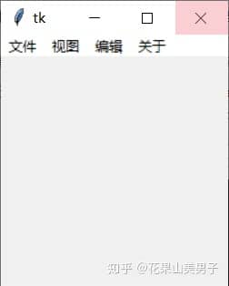
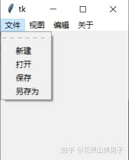
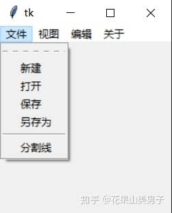
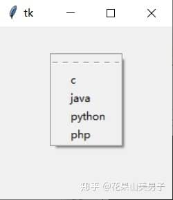
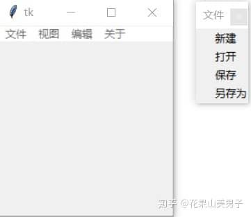

**7.菜单栏**

任何GUI都少不了菜单，tkinter当然也有自己的菜单栏。tkinter使用**Menu**类创建一个菜单，并用**add\_command**方法来添加菜单项。

下面让我们来创建顶层菜单：

```python
from tkinter import *

root = Tk()
menubar = Menu(root)
for i in ['文件','视图','编辑','关于']:
    menubar.add_command(label=i)
#这一步不可或缺，菜单实例要应用到窗口中
root['menu']=menubar
root.mainloop()
```



图7.1 顶层菜单

add\_command有下面几个属性：　　

*   label：指定菜单的名称
*   command:被点击时调用的方法
*   acceletor：快捷键
*   underline：是否拥有下划线

通常，顶层菜单是应用到窗口的父组件，要想继续创建子菜单，需要同时用到add\_command和**add\_cascade**方法。例如：

```python
from tkinter import *

root = Tk()
menubar = Menu(root)
#创建子菜单
fmenu = Menu(menubar)
for i in ['新建','打开','保存','另存为']:
    fmenu.add_command(label=i)
#为顶级菜单实例添加菜单，并级联相应的子菜单实例
menubar.add_cascade(label='文件',menu=fmenu)
menubar.add_cascade(label='视图')  #这里省略了menu属性，没有将后面三个选项与子菜单级联
menubar.add_cascade(label='编辑')
menubar.add_cascade(label='关于')

root['menu']=menubar
root.mainloop()
```



图7.2 子菜单

由此可见，我们需要通过add\_cascade方法级联子菜单和顶层菜单。在子菜单存在时，也不需要利用for循环先创建好顶层菜单的每个选项，与子菜单一一对应即可。（代码中省略了后面三个选项的级联，只是显示了菜单的选项名称。）

用**add\_separator()**方法可以添加分割线，调用的时候很简单，需要在哪添加，就把这行代码放在那个地方：

```python
from tkinter import *

root = Tk()
menubar = Menu(root)
fmenu = Menu(menubar)
for i in ['新建','打开','保存','另存为']:
    fmenu.add_command(label=i)
    
fmenu.add_separator()
fmenu.add_command(label='分割线')

menubar.add_cascade(label='文件',menu=fmenu)
menubar.add_cascade(label='视图')
menubar.add_cascade(label='编辑')
menubar.add_cascade(label='关于')
root['menu']=menubar
root.mainloop()
```



图7.3 分割线

除了默认的点击后无显示的效果，Menu还可以设置单选框（**add\_radiobutton**）与复选框(**add\_checkbutton**)，只需对应地替换掉add\_command，例如复选框的实现：

```python
from tkinter import *

root = Tk()
menubar = Menu(root)
fmenu = Menu(menubar)
for i in ['新建','打开','保存','另存为']:
    fmenu.add_checkbutton(label=i)
menubar.add_cascade(label='文件',menu=fmenu)
menubar.add_cascade(label='视图')
menubar.add_cascade(label='编辑')
menubar.add_cascade(label='关于')
root['menu']=menubar
root.mainloop()
```


图7.4 复选框

除了最基本的窗口菜单，tkinter还可以实现**弹出菜单**。由于通常用右键触发，因此也叫**右键菜单**。不过这并不是一个独立的实现方法，而是将Menu类与鼠标事件结合，创建好菜单后，使用**post**方法在指定位置弹出已创建的菜单：

```python
from tkinter import *

#菜单弹出事件
def pop(event):
    menubar.post(event.x_root, event.y_root)
    
root = Tk()
menubar = Menu(root)
for i in ['c','java','python','php']:
    menubar.add_command(label=i)
root.bind("<Button-3>",pop)
root.mainloop()
```



图7.5 弹出菜单

比较遗憾的是，tkinter的菜单栏只有默认的样式，但Menu和其他组件一样，可以通过一些通用属性来改变字体、颜色等等，不过也仅此而已了。

看了上面那么多的演示图，你有没有想过子菜单的长虚线有什么作用呢？这里我要介绍一个Menu特有的属性：

*   tearoff 点击子菜单中的 ---------，可以将其“撕下“，默认为True，设为False关闭



图7.6 ”撕下“菜单

* * *

关于菜单的内容就先介绍这么多，下一节我们来介绍各种对话框和消息框。
