有好几条留言都是关心如何将python脚本打包成10多M的？  
那今天小郑就给大家全面总结一下：Python如何打包成exe，以及如何打得足够小。  
## **标准打包**  
目前比较常见的打包exe方法都是通过`Pyinstaller`来实现的，本文也将使用这种常规方法。如果对这块已经很熟悉的小伙伴，可以直接下滑到本文下半部分。  
**为什么要打包？**  
众所周知，Python脚本不能在没有安装Python的机器上运行。  
那我们如果写了一个数据分析/自动化办公的小脚本，想分享给同事小姐姐使用，可她电脑又没有装Python。  
这个时候如果将脚本打包成exe文件，微信发送给她，即使她的电脑上没有安装Python解释器，这个exe程序也能在上面运行。岂不美哉？ 
  
（当然，想通过帮安装Python跟小姐姐建立感情的话，就当我没说）  
**安装Pyinstaller**  
首先我们要先安装Pyinstaller，直接在cmd使用pip命令  
pip install pyinstaller  
  
如果网速太慢可以切换国内源来加速，本文其他部分直接使用国内源，不再重复注释。  

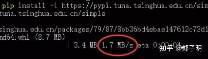

  
**Pyinstaller打包步骤**  
这里我们拿之前《[Python自动化办公 | 同事要我帮忙补写178份Word日报！](https://link.zhihu.com/?target=http%3A//mp.weixin.qq.com/s%3F__biz%3DMzU5Nzg5ODQ3NQ%3D%3D%26mid%3D2247496537%26idx%3D1%26sn%3Df185dd09ca14d99a7a803954aa6157ff%26chksm%3Dfe4ed6ddc9395fcb4cd4c9a946c7eaa8f1d281dfcba82655b6de4e9bc0ff359cb2f3d7da4623%26scene%3D21%23wechat_redirect)》这篇的python代码，作为案例来演示。将其中脚本`py_word.py`，待处理的表格文件`workbook.xlsx`，以及准备好的软件图标图片`chengzi.ico`放在了我电脑的`F:\py_word`目录下（如果大家感兴趣的话，可以在文末下载获取）  

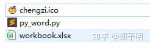

  
1、cmd切换到我们刚刚放文件的目录  

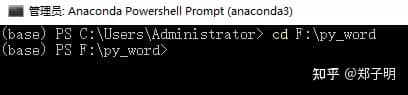

  
2、执行命令Pyinstaller -F -w -i chengzi.ico py\_word.py，执行过程特别漫长，就没有录制动图。  
执行完毕会发现当前目录多了几个文件夹，打开其中名为dist的文件夹。  

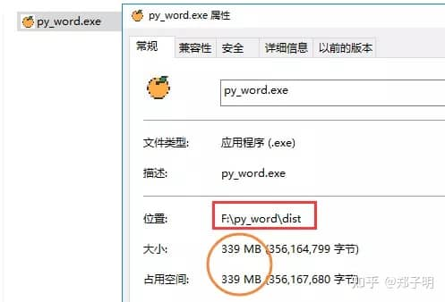

已经生成了一个名为`py_word`的exe应用程序，并且图标也是我们设置的橙子图案，看来已经成功一半了。  
要不运行一下，试试能否正常生成word日报？  

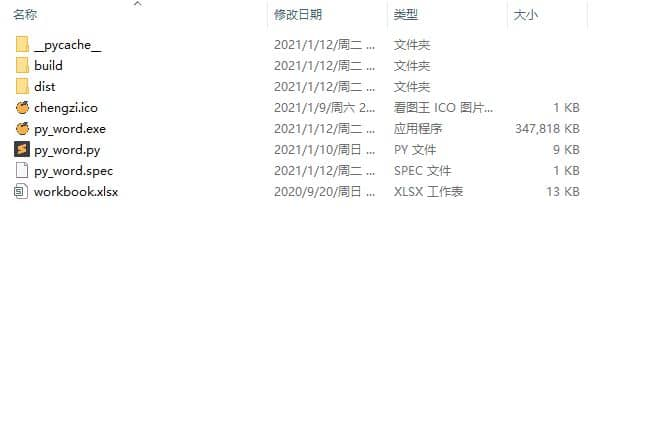

成功运行，可惜就是文件有点大（339M）  

  
**Pyinstaller参数详解**  
说回刚刚执行的命令  
Pyinstaller -F -w -i chengzi.ico py\_word.py  
  
给大家解释一下其中Pyinstaller的参数，其中`-F`参数代表制作独立的可执行程序。  
`-w`是指程序启动的时候不会打开命令行。如果不加-w的参数，就会有黑洞洞的控制台窗口出来。比如在刚才的脚本里我加一行`print('Hello World!')`，那么就不要放-w参数了，不然运行会报错，毕竟`Hello World!`需要在命令行里打印出来。此外，`-w`参数在GUI界面时非常有用。  
最后的`-i chengzi.ico`就是指设置自己的图标图案，因为默认打包图片是下图这样的。这个参数也可以写成`--icon=chengzi.ico`  

  
最后稍微总结一下：  
  
Pyinstaller -F py\_word.py 打包exe  
  
Pyinstaller -F -w py\_word.py 不带控制台的打包  
  
Pyinstaller -F -w -i chengzi.ico py\_word.py 打包指定exe图标打包  
  
以上三个是比较常用的参数，其他参数详见下表  

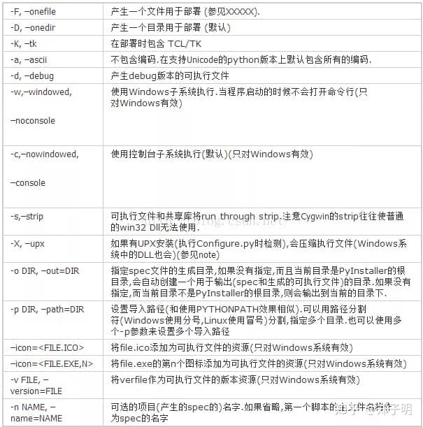

  
Pyinstaller参数大全  
**ico图片生成**  
自己做的软件都喜欢放上自己的图标，不过哪来那么多ico图片呢？  
一个是可以找专门的ico图片网站，不过都很小众，图片库也很小。  
  

**压缩打包**  
好了，小伙伴们  
来到了最激动人心的时刻，刚刚生成的exe实在太大了，300多M的软件程序想用微信传一下都费劲。  
我也试过很多方法，比如：修改spec文件自定义打包、pipenv 虚拟环境、使用开源的upx压缩等等，但是往往要么过程比较麻烦，要么成功率不高（压缩成不成功全看脸）。  
而我要分享的，是自己一直在用的，最简单且成功率极高的方法——conda创建虚拟环境。  

  
## **Python打包为什么大？**  
  
在压缩打包之前，先简单说一下为什么Python打包过大？  
Python打包exe，不但体积大而且运行奇慢。解释型语言大都是这个样子，只不过Python尤其突出。要解决大而慢，只能用编译型语言，如C，C++，甚至VB都好很多，体积最小的是汇编。**\[1\]**  
此外，还有知乎大佬说是因为“Anaconda里内置了很多库，打包的时候打包了很多不必要的模块进去，要用纯净的Python来打包。”  
所以我们可以模拟一个新环境，其中只安装我们本次打包所必要的工具包即可。  
那最适合的就是——虚拟环境了！  
**虚拟环境**  
Python创建虚拟环境的方法有很多，而我是个Anaconda忠实用户，如果你跟我一样，那就简单了。（大家也可以使用Virtualenv、Pipenv来设置虚拟环境，善用搜索，方法大同小异）  
先记几个命令，很简单  
conda create -n 虚拟环境名字 python==3.6 #创建虚拟环境  
  
conda activate 虚拟环境名字 #激活虚拟环境  
  
conda deactivate #退出虚拟环境  
  
从开始菜单运行“Anaconda Prompt”，出现的界面输入创建虚拟环境的指令。成功创建了一个名字为`aotu`，且基于python版本3.6的虚拟环境。  

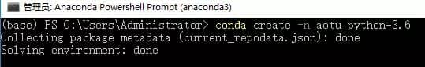

  
在创建过程中需要回复（y/n），Yes，再激活虚拟环境  

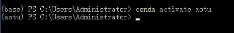

  
conda安装的虚拟环境，会把虚拟环境的目录生成在anaconda安装目录下的env目录下。  

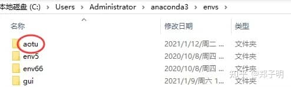

当然我们也可以在刚刚的窗口，使用命令`conda info --envs`，来查看conda环境下所有的虚拟环境  

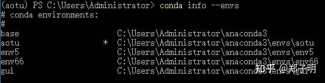

**安装所需的库**  
上面我们已经创建并激活了名为`aotu`虚拟环境，输入`conda list`可以查看当前虚拟环境里已经安装的库。  

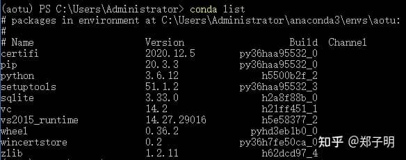

我们打开所要打包的Python脚本，对比上图，发现`pandas`，`docx`这两个库还需要额外安装。当然，也不能缺了打包必不可少的`pyinstaller`库。  

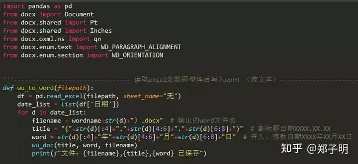

安装库的过程不再赘述  
pip install -i [https://pypi.tuna.tsinghua.edu.cn/simple](https://link.zhihu.com/?target=https%3A//pypi.tuna.tsinghua.edu.cn/simple) pandas  
  
pip install -i [https://pypi.tuna.tsinghua.edu.cn/simple](https://link.zhihu.com/?target=https%3A//pypi.tuna.tsinghua.edu.cn/simple) python-docx  
  
pip install -i [https://pypi.tuna.tsinghua.edu.cn/simple](https://link.zhihu.com/?target=https%3A//pypi.tuna.tsinghua.edu.cn/simple) pyinstaller  
  
安装后再看  

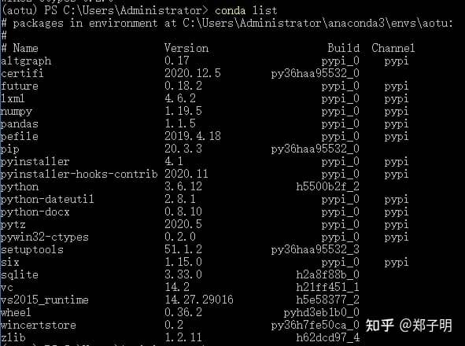

已成功安装，还有一些因为这几个库所附带安装的，就不管他们了。  
**Pyinstaller打包步骤**  
这里就不再重复了，只换个苹果图标试试  
Pyinstaller -F -w -i apple.ico py\_word.py  
  

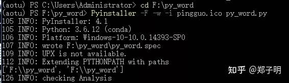

生成  

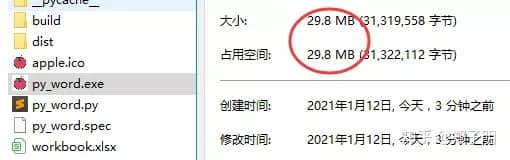

成功压缩到29.8M，如果不导入pandas这位大神，应该就可以10多M了  
运行一下，毫无问题  

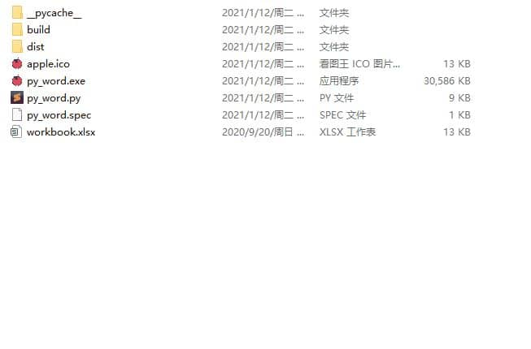

最后再简单总结一下**虚拟环境+打包的全过程**（只三步）： 

#创建虚拟环境  
conda create -n aotu python=3.6  
  
#激活虚拟环境  
conda activate aotu  
  
#Pyinstaller打包  
Pyinstaller -F -w -i apple.ico py\_word.py  
  
## **总结一些小坑**  
1、说起来还是有点玄学，上文中一模一样的过程我在两个电脑都执行过一遍。在其中一个上显示缺少`xlrd`这个库，安装后成功打包，也是一样的大小。小伙伴们可以在文末获取文件，也试试。  
2、在安装库是要注意一些库名，比如docx这个库不要`pip install docx`，而是需要  
pip install python-docx  
  
还有一些库可能因为版本不同导致不能使用，多碰碰壁就好了。  
3、为了防止打包时候有些库没安装好，可以先在虚拟环境中执行一下Python脚本。运行无误的话再打包，比较保险。  

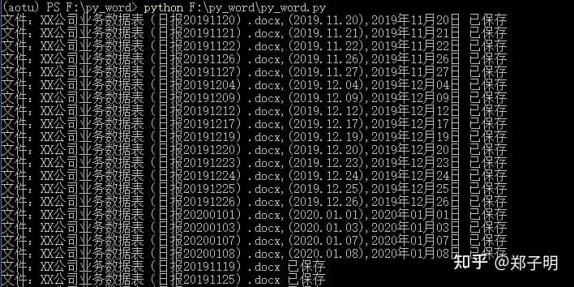

4、最后，如果想要删除虚拟环境的话，可执行下方命令  
conda remove -n aotu--all  
  
5、打包为exe的话，版本尽量选择python3.6+32位版本，因为win64位系统向下兼容32位程序，但是如果不考虑32位系统的话无所谓，直接python64位版本直接打包就可以，只是只能在win64位系统上跑。  
