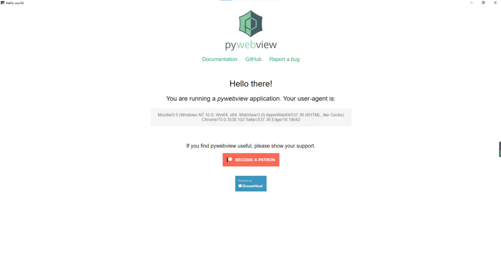

[pywebview (flowrl.com)](https://links.jianshu.com/go?to=https%3A%2F%2Fpywebview.flowrl.com%2F) 是围绕 webview 组件的轻量型跨平台包装器（wrapper），它允许在其自己的本机 GUI 窗口中显示 HTML 内容。它使您可以在桌面应用程序中使用 Web 技术，同时尽最大可能隐藏使用浏览器构建GUI的事实。您可以将 `pywebview` 与轻量级的 Web 框架（例如 [Flask](https://links.jianshu.com/go?to=http%3A%2F%2Fflask.pocoo.org%2F) 或 [Bottle](https://links.jianshu.com/go?to=http%3A%2F%2Fbottlepy.org%2Fdocs%2Fdev%2Findex.html)）一起使用，也可以单独使用 Python 和 DOM 之间的双向桥梁。

pywebview 允许您使用 HTML，CSS和 Javascript 为 Python 程序构建GUI， 将 pywebview 视为适用于 Python 的轻量级Electron。与 Electron 不同，pywebview 不捆绑 Web 渲染器，而是依赖于操作系统提供的渲染。旁注：捆绑渲染器仍然是一种选择，例如 CEF。

`pywebview` 使用本机 GUI 创建 Web 组件窗口：Windows 上的 WinForms，macOS 上的 Cocoa 和 Linux 上的 QT 或 GTK。如果选择冻结应用程序，则 `pywebview` 不会捆绑繁重的 GUI 工具箱或 Web 渲染器，从而使可执行文件的更小。`pywebview` 与 Python 3 兼容。

安装：

```py
pip install pywebview
```

Hello world：

```py
import webview
webview.create_window('Hello world', 'https://pywebview.flowrl.com/hello')
webview.start()
```

显示：



`create_window`函数返回一个窗口实例，该实例提供许多 window 操作和与 DOM 相关的功能。

> Explore _pywebview_ further by reading [documentation](https://links.jianshu.com/go?to=https%3A%2F%2Fpywebview.flowrl.com%2Fguide), [examples](https://links.jianshu.com/go?to=https%3A%2F%2Fpywebview.flowrl.com%2Fexamples) or [contributing](https://links.jianshu.com/go?to=https%3A%2F%2Fpywebview.flowrl.com%2Fcontributing). If React is your thing, get started right away with [React boilerplate](https://links.jianshu.com/go?to=https%3A%2F%2Fgithub.com%2Fr0x0r%2Fpywebview-react-boilerplate).

您可以根据需要创建任意多个窗口。GUI loop 启动后创建的 Windows 将会立即显示。所有打开的窗口都作为列表存储在 `webview.windows` 中。窗口按创建顺序存储。

`create_window`的第二个参数 `url` 可以指向远程或本地路径。另外，您可以通过设置 `html` 参数来加载HTML。

```python
import webview

webview.create_window('Woah dude!', html='<h1>Woah dude!<h1>')
webview.start()
```

请注意，如果同时设置了 `url` 和 `html`，则 `html` 优先。

`pywebview` 提供了多个 Web 渲染器的选择。要更改 Web 渲染器，请将 `start` 函数的 `gui` 参数设置为所需的值（例如 `cef` 或 `qt`）。有关详细信息，请参见 [Renderer](https://links.jianshu.com/go?to=https%3A%2F%2Fpywebview.flowrl.com%2Fguide%2Frenderer.html)。

## [HTTP server](https://links.jianshu.com/go?to=https%3A%2F%2Fpywebview.flowrl.com%2Fguide%2Fusage.html%23http-server)

`pywebview`提供了与 WSGI 兼容的 HTTP 服务器。要启动 HTTP 服务器，请将`url`设置为本地入口点（无 protocol模式），并将`start`函数的`http_server`参数设置为`True`。

```py
import webview

webview.create_window('Woah dude!', 'index.html')
webview.start(http_server=True)
```

如果希望将外部 WSGI 兼容的 HTTP 服务器与 `pywebview` 一起使用，则可以将服务器对象作为 URL 传递，即。在这种情况下，无需设置 `http_server` 参数。

```py
from flask import Flask
import webview

server = Flask(__name__, static_folder='./assets', template_folder='./templates')
webview.create_window('Flask example', server)
webview.start()
```

## [Threading model](https://links.jianshu.com/go?to=https%3A%2F%2Fpywebview.flowrl.com%2Fguide%2Fusage.html%23threading-model)

`webview.start` 启动 GUI 循环，并且是一项阻塞功能。由于 GUI 循环受阻，您必须在单独的线程或进程中执行后端逻辑。您可以手动启动线程或进程。另外，您可以通过将函数作为要启动的第一个参数 `func` 来执行代码。第二个参数设置函数的参数。这种方法在后台启动线程，与手动启动线程相同。

```py
import webview

def custom_logic(window):
    window.toggle_fullscreen()
    window.evaluate_js('alert("Nice one brother")')

window = webview.create_window('Woah dude!', html='<h1>Woah dude!<h1>')
webview.start(custom_logic, window)
# anything below this line will be executed after program is finished executing
pass
```

## [Make Python and Javascript talk with each other](https://links.jianshu.com/go?to=https%3A%2F%2Fpywebview.flowrl.com%2Fguide%2Fusage.html%23make-python-and-javascript-talk-with-each-other)

您可以将自定义逻辑视为与 HTML/JS 领域中的 前端代码进行通信的后端。现在，您将如何使二者互相交流？`pywebview` 提供了两种方式的 JS-Python 桥接器，使您既可以通过 Python（通过 `valuate_js`）执行Javascript，也可以通过 Javascript（通过 `js_api` 和 `expose`）执行 Python 代码。细节见：[interdomain commmunication](https://links.jianshu.com/go?to=https%3A%2F%2Fpywebview.flowrl.com%2Fguide%2Finterdomain.html)。另一种方法是在自定义逻辑中运行Python Web服务器（例如 Flask 或 Bottle），并使前端代码对它进行API调用。那将与典型的Web应用程序相同。例如，此方法适用于将现有的Web应用程序移植到桌面应用程序。有关这两种方法的更多信息，请参见 [Architecture](https://links.jianshu.com/go?to=https%3A%2F%2Fpywebview.flowrl.com%2Fguide%2Farchitecture.html)。

## 检索 DOM 节点

现在，您可以使用 `window.get_elements(selector)` 函数检索DOM节点。节点使用 [domJSON](https://links.jianshu.com/go?to=https%3A%2F%2Fgithub.com%2Fazaslavsky%2FdomJSON) 库进行序列化。[Example](https://links.jianshu.com/go?to=https%3A%2F%2Fpywebview.flowrl.com%2Fexamples%2Fget_elements.html)
