对程序员来说，界面设计的实现，要解决的一个主要问题就是如何根据界面设计的需求，将组件以规定的大小放置在规定的位置。tkinter是python语言中常用的界面实现模块，其中pack()方法，可创建浮动，自动伸缩扩展的软件界面，如以下界面。

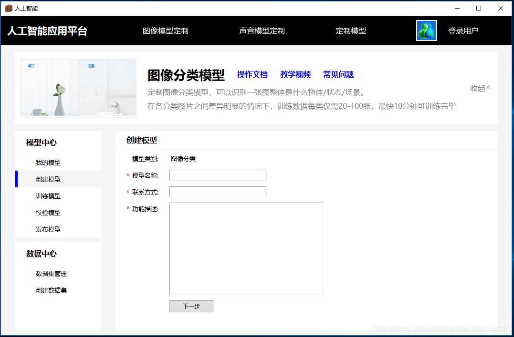

如果你对以上用tkinter.pack实现的界面布局有兴趣，觉得有些实现效果可以参考借鉴，请继续阅读下面的内容。

## 一. pack的组件空间布局原理分析

用pack进行的布局界面组件，可用以下一些界面布局空间来进行分析

**side = top 的布局空间**

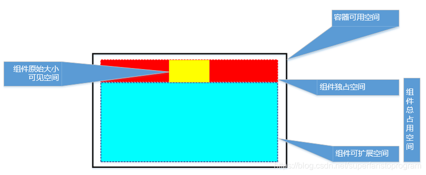

**side = left 的布局空间**

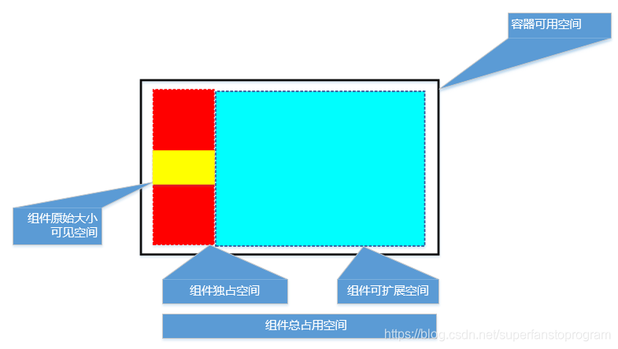

**1. 容器可用空间** 

系统严格按代码的前后组织顺序依次排列组件，前辈组件还没有占据的空间，是当前组件的可用空间，pack布局是在当前组件的可用空间内进行的。如上图的黑边白底的区域。（为了说明，我留出padding空间，若没有padding，组件将占据整个目前可用空间）

**2.组件原始大小可见空间**

设置了width, height, 或由具体内容确定的组件原始大小，也就是可以看得见的组件宽高。如上图的黄色区域。

**3.组件的独占空间**

组件不单只占据它原始可见的位置，而是会同时占据可用空间的整行空间或整列空间。如上图红色区域。

side = top / bottom 时，组件占据整行，后辈组件只能依次排在它的下面 / 上面；组件为上下排列方式

side = left / right 时， 组件占据整列，后辈组件只能依次排在它的右边 / 左边；组件为左右排列方式

pack() , 我分析下来，其实就是 pack(side=top)

组件独占空间，没有进行填充(fill)时，不可见，但我们必须了解到它的存在，因为它直接影响组件本身及后辈组件的布局。

组件独占空间，是固有的，其它后辈组件绝对不可能进入该空间，后辈组件最多只能紧靠它。

**4. 组件可扩展空间**

组件独占空间的另一个方向，是组件的可扩展空间方向。如上图的浅蓝色区域。

side = top / bottom 时，组件独占整行，并可向整列方向进行扩展。

side = left / right 时，组件独占整列，并可向整行方向进行扩展。

组件可扩展空间，没有进行填充(fill)时，也是不可见的，但它同样会直接影响自身和后辈组件的布局，必须掌握它的空间存在。

若设置了 expand = yes, 则启用可扩展空间；若 expand = no, 则不启用可扩展空间。

组件可扩展空间，是动态的，是可以被后辈组件的独占空间占据压缩的，后辈组件可以从前辈可扩展空间的边缘开始入侵，直至压缩到前辈组件自身的独占空间为止。 

**5. 组件占用总空间**

组件独占空间 + 组件可扩展空间，就是当前组件的总占用空间，若没有启用组件扩展空间（expand = no），则只包含组件独占空间。

接下来的 锚定位(anchor)和填充(fill)，都是基于**组件的占用总空间**来进行处理的。

**6. 空间定位和填充**

**锚定位（anchor ），加 padx, pady , 可将组件安排在指定位置**

锚定位有9个方向，缺省为 center, 居中

若 side = top / bottom ,  expand=no, 则合并到一行，即NW, W, SW的效果一样，其他同理。

若 side = left / right,  expand = no, 则合并到一列，即NW, N, NE的效果一样，其他同理

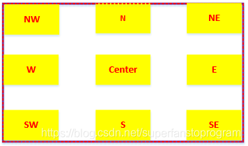

**填充（fill）组件，可以将组件的可见，可操作范围充满指定区域**

填充的方式有4种，缺省的方式是（none）,不填充。

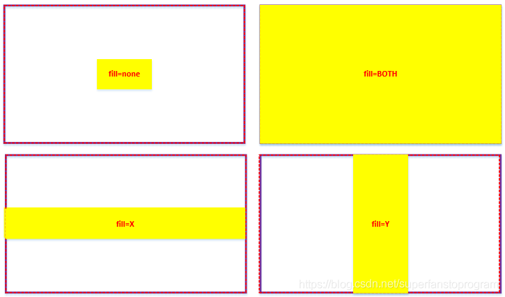

## 二. 单组件布局的分析步骤

以上描述的pack布局原理，需要仔细理解和掌握，这是pack布局的基础，当我们理解这些原理后，就可以用来控制单个组件的位置了。

**基本分析步骤为：**

1. 明确当前容器的可用空间范围

2. 分析是用上下排列方式（side=top / bottom）,还是左右排列方式（side=left/right）

3. 分析是否需要启用扩展空间，若需要则设置 expand = yes, 否则保持缺省值 expand = no

4. 利用锚定位（anchor），确定组件的具体位置

5. 利用填充（fill）, 对组件的可见区域进行填充

**举例分析**：

<table border="1" cellspacing="0" style="margin-left:-.25pt;"><tbody><tr><td style="vertical-align:top;width:143.35pt;">
<strong>设置代码</strong>
</td><td style="vertical-align:top;width:136.85pt;">
<strong>布局效果</strong>
</td><td style="vertical-align:top;width:134.85pt;">
<strong>说明</strong>
</td></tr><tr><td style="vertical-align:top;width:143.35pt;">
.pack(side=‘top‘)
</td><td style="vertical-align:top;width:136.85pt;">
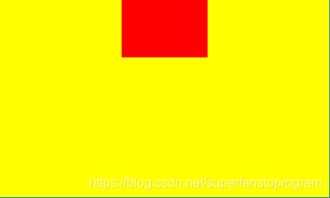
</td><td style="vertical-align:top;width:134.85pt;">
独占整行，缺省居中
</td></tr><tr><td style="vertical-align:top;width:143.35pt;">
.pack(side='top', anchor='sw')
</td><td style="vertical-align:top;width:136.85pt;">
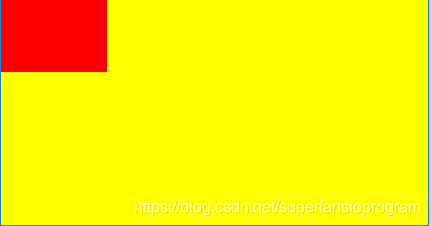
</td><td style="vertical-align:top;width:134.85pt;">
没有启用可扩展空间，只独占行，锚定位 nw, w, sw 都一样，定位在西边
</td></tr><tr><td style="vertical-align:top;width:143.35pt;">
.pack(side='top', expand='yes', anchor='sw')
</td><td style="vertical-align:top;width:136.85pt;">
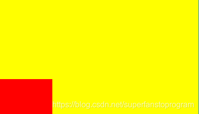
</td><td style="vertical-align:top;width:134.85pt;">
启用可扩展空间，除了独占的行空间，还扩展到了容器可用空间的所有列空间，锚定位'sw' ，定位到了容器的西南边
</td></tr><tr><td style="vertical-align:top;width:143.35pt;">
.pack(side='top', expand='yes')
</td><td style="vertical-align:top;width:136.85pt;">
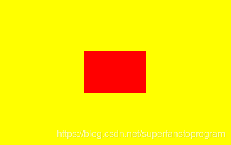
</td><td style="vertical-align:top;width:134.85pt;">
启动扩展空间，没有设置anchor，则缺省居中（整个组件占用空间的中间，不同于第1个例子）
</td></tr><tr><td style="vertical-align:top;width:143.35pt;">
.pack(side='top', expand='yes', fill='y')
</td><td style="vertical-align:top;width:136.85pt;">
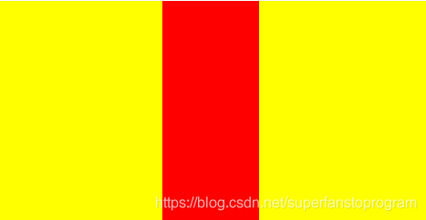
</td><td style="vertical-align:top;width:134.85pt;">
启用扩展空间，定位完后，进行“y”轴方向的填充，填满整个占用空间的列
</td></tr><tr><td style="vertical-align:top;width:143.35pt;">
.pack(side='top', fill='y')
</td><td style="vertical-align:top;width:136.85pt;">
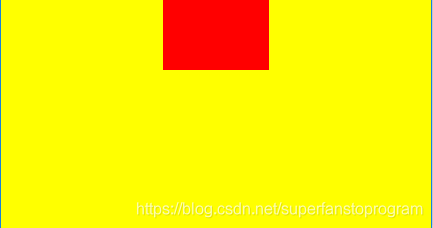
</td><td style="vertical-align:top;width:134.85pt;">
没有启用扩展空间，当选择进行“y”方向填充时，也只是在独占的行空间内进行“y”方向填充
</td></tr></tbody></table>

## 三.  多组件布局的分析

我们现在基本掌握了单个组件的布局定位分析方法，而实际的软件界面，一定是多组件的综合布局，涉及多组件之间的相互关系和影响。以上所有讲到的单组件布局分析，都有一个前提，就是在已知容器可用空间的前提下， 进行当前组件的布局定位。

**整理分析多组件布局的要点**：

1. 所有组件按代码的前后组织次序，依次进行布局定位

2. 设置side = top / bottom 的组件，为上下排列的组件，独占当时可用空间的整行 

3. 设置side = left / right 的组件，为左右排列的组件，独占当时可用空间的整列

4. 后辈组件不可进入任何前辈组件的独占空间，不论 side的设置如何，是否相同，一律都是前辈

5. 组件可扩展空间，是动态的，是可以被后辈组件的独占空间占据压缩的，后辈组件可以从前辈可扩展空间的边缘开始入侵，直至压缩到前辈组件自身的独占空间为止

6. 后辈组件的扩展空间，不能侵占前辈组件的扩展空间；既若扩展空间重叠，前辈享用扩展空间

7. 若整个界面空间缩小，出现后辈组件独占空间跟前排组件独占空间重叠时，后辈组件将被压缩，直至消失。

8. 若界面空间继续缩小，小到比组件独占空间小时，组件将被压缩，直至消失。

9. 空间优先级别为：界面空间 > 前辈组件独占空间 > 后辈组件独占空间 > 前辈组件可扩展空间 > 后辈组件可扩展空间

**10.可利用frame的多层嵌套，进行灵活布局**

**举例分析：**

<table border="1" cellspacing="0" style="margin-left:-.25pt;"><tbody><tr><td style="vertical-align:top;width:143.35pt;">
<strong>设置代码</strong>
</td><td style="vertical-align:top;width:136.85pt;">
<strong>布局效果</strong>
</td><td style="vertical-align:top;width:134.85pt;">
<strong>说明</strong>
</td></tr><tr><td style="vertical-align:top;width:143.35pt;">1.pack(side='left', expand='no', anchor='w', fill='y', padx=5, pady=5) 2.pack(side='top') 3.pack(side='right') 4.pack(side='bottom')</td><td style="vertical-align:top;width:136.85pt;">
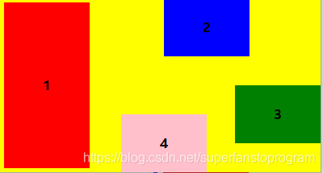
</td><td style="vertical-align:top;width:134.85pt;">
<strong>块1：</strong>

第一个组件，可用空间为整个界面空间，靠左，独占列，不启动扩展空间，按“y”方向填充，周围有5个像素的padding

&nbsp;

<strong>块2：</strong>

可用空间从<strong>块1</strong>的右边缘开始，靠上，独占行，位置居中，但注意是从<strong>块1</strong>右边缘到界面边缘的中间位置，而不是整个界面的中间位置

&nbsp;

<strong>块3:</strong>

靠右，居中；其上下可用空间大小是<strong>块2</strong>的下边缘，到界面边缘

&nbsp;

<strong>块4</strong>：

靠下，居中；其左右可用空间大小是从<strong>块1</strong>的右边缘 到 <strong>块3</strong>的左边缘
</td></tr><tr><td style="vertical-align:top;width:143.35pt;">1.pack(side='left', expand='yes', fill='x') 2.pack(side='top') 3.pack(side='right', expand='yes', fill='x') 4.pack(side='bottom') &nbsp;</td><td style="vertical-align:top;width:136.85pt;">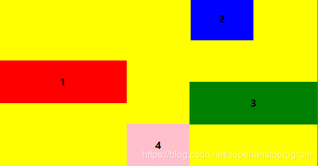</td><td style="vertical-align:top;width:134.85pt;">
这个例子比较复杂点

<strong>块1:</strong>

启用了扩展空间，往“x”行方向填充，但被<strong>块2，块3，块4</strong>的独占空间压回到了现在的大小。

&nbsp;

<strong>块2：</strong>

同上，始终位于<strong>块1</strong>右边缘和界面边界的中间靠上位置

&nbsp;

<strong>块3：</strong>

启用了扩展空间，但也越不过<strong>块4</strong>的独占列空间

&nbsp;

<strong>块4：</strong>

始终位于<strong>块1，块3</strong>的中间位置靠下
</td></tr><tr><td style="vertical-align:top;width:143.35pt;">
1.pack(side='left', expand='no', fill='y') 2.pack(side='top', fill='x') 3.pack(side='right', expand='yes', fill='both')
</td><td style="vertical-align:top;width:136.85pt;">
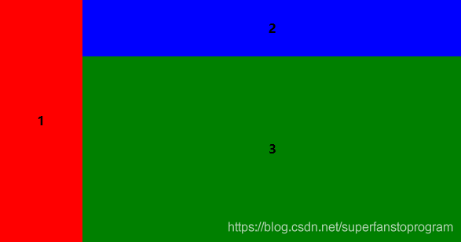
</td><td style="vertical-align:top;width:134.85pt;">
一个很常规的导航界面设置

<strong>块1：导航栏</strong>

靠左，上下填充，不可扩展

&nbsp;

<strong>块2：标题栏</strong>

靠上，左右扩展

&nbsp;

<strong>块3：内容栏</strong>

位置无所谓，全面扩展填充

&nbsp;
</td></tr></tbody></table>

## 四. 代码演示

我写了一个布局演示程序，包含文章开头展示的界面，可以对照界面实际效果和具体代码，来了解实现的细节。另外提供了单组件和多组件的演示工具，可以调整设置，观察效果，来理解和掌握pack布局的基本方法。演示程序中还包括一些其它窗体布局和实现的方法，希望对大家有帮助。

**源代码位置**：

[https://github.com/EdwinZhang1970/Python/tree/master/tkinter-pack%20Demo](https://github.com/EdwinZhang1970/Python/tree/master/tkinter-pack%20Demo)

