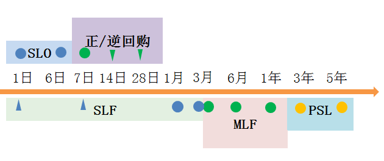

央妈最常用法宝公开市场操作，是指央妈通过在公开市场上拿钱买卖有价证券，来调节货币供应量和利率。这法宝其实是个百宝箱，央妈不断鼓捣出了很多小玩意儿，使用起来比较灵便，效果比较温和。最初主要是回购，后来补充了很多工具，有些还挺国际范儿。2013年初，央妈创设了常备借贷便利（SLF），2014年1月引入了短期流动性调节工具（SLO），2014年4月份创设了抵押补充贷款（PSL），2014年9月份创设了中期借贷便利（MLF），2015年10月，又扩大信贷资产质押再贷款扩围。百宝箱的工具越来越丰富多样。

下面我们打开百宝箱，来看看这些新奇的工具。我们可以先从三个方面整理比较下：

首先，工具长短不同。下图直观地显示了各类工具的贷款期限长度（图中圆点表示主要操作期限，三角形是辅助操作期限），从短到长分别为SLO(1-6天)，正/逆回购（7、14、28天）、SLF（一般1-3个月，1、7日较少），MLF（3个月到1年），PSL（3年到5年）。

第二，工具作用不同。不同长短的工具用来引导相应不同期限的利率，对应的，SLO引导超短期利率；逆回购引导短期利率，必要时用SLF调整；MLF引导中期利率。但有时央妈也会连续通过期限短的工具解决下稍长期的利率问题。此外，央妈也会通过调剂不同工具的使用量，来调整市场上资金的平均利率高低。

第三，使用范围不同，从窄到宽依次是PSL（政策性银行），MLF（政策性银行、商业银行），SLF与SLO（大中型金融机构）。

  

  

再一件一件看看这些工具的细节：

（1）回购，包括正回购和逆回购，这是央行最常用的工具。逆回购是指央行出钱，买交易商的证券，这样市场上钱就多了，同时约定几天后（7日为主，常态化操作，14、28日为辅），央行再按照原价加一定利息（按一定利率即逆回购利率计算）把券卖给交易商。正回购是指央行卖证券给交易商，交易商给央行钱，这样市场上的钱就少了，同时约定几天后央行再按照最初价加上利息买回来。这样，央行通过控制正/逆回购的节奏、规模、利率，来调节市场上钱的供应量和短期利率水平。

（正回购、逆回购的作用经常会搞混，大家只要记住，“水逆水逆”，放水的逆回购，逆回购就是给市场放水，钱就多了）

（2）短期流动性调节工具（Short-term Liquidity Operations，SLO）。（为了好记，姑且称为小“酸辣圈”吧）。这是用来调节比7天更短的货币供应和利率，也是采用回购的方式，时间从1天到6天都有。例如，2013年12月底，临近年末资金紧张，央行连续5天进行了SLO操作向市场投放钱，将资金利率缓和下来。

（3）常备借贷便利（Standing LendingFacility，SLF），市场俗称“酸辣粉”。大型金融机构缺钱了，可以向央行一对一申请抵押贷款，期限一般是1到3个月。一般在市场缺钱的时候，才用SLF来补充流动性，例如2013年下半年；市场不缺钱的石油一般不用，例如2016年第三季度仅操作了22.5亿元。央行可以通过SFL进行短期利率引导，将其作为“利率走廊”上限（下限是超额存款准备金率），就是说，如果市场利率大于某个值，有可能触发央妈强制使用，阻止金融机构之间的拆借，转向央行贷款。这个工具不常用，平常备着，所以叫“常备”。

（4）中期借贷便利（Medium-term Lending Facility，MLF），俗称“麻辣粉”。这工具要求借钱的银行投放于三农和小微贷款，期限一般为3个月、6个月和1年。MLF的量很大，央行每月进行常态化操作，2016年前三季度累计开展操作 3.2万亿元，期末余额为 1.9万亿元，成为基础货币供给的重要渠道，并以此引导中期利率。（央妈喜欢麻辣粉多于酸辣粉）

（5）抵押补充贷款（Pledged Supplementary Lending，PSL），就称为“颇酸辣”吧。央妈为了支持特定政策性银行完成国家重点项目（例如国开行的棚改项目），直接提供一部分低成本抵押资金，期限是3-5年，这就是抵押补充贷款。

随着利率市场化的推进，为了提高货币调控效果，央妈的百宝箱还在不断丰富着。

