我们使用Python统计出沪深300指数每个工作日的涨跌幅来验证，结果如下：

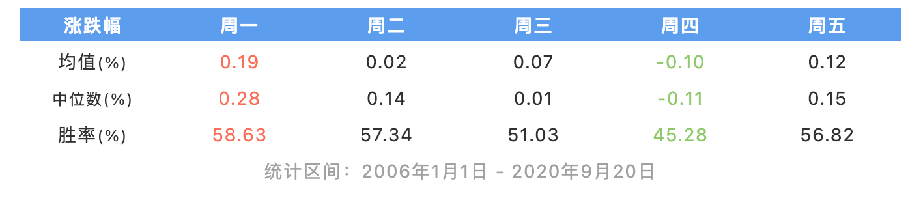

图中其他日涨幅的**均值**和**中位数**均为正，**只有周四为负。**在每天上涨概率方面**也只有周四的胜率低于50%。**

因此从统计结果看，周四确实更容易下跌。

回到最初的问题，为什么在周四的时候股票容易大跌？

目前主流的解释有以下三个方面：结算制度、信息冲击、投资者行为。

同时我不仅研究了周四，还研究了其他周内交易日，并用相应的结果构建了几个效果不错的量化策略。具体的探索过程如下：

## 周内效应

我们从问题出发，周四跌的比其他天多，是偶然现象还是长期存在的呢？我们可以利用Python程序来验证一下。

首先找来沪深300指数的历史数据：

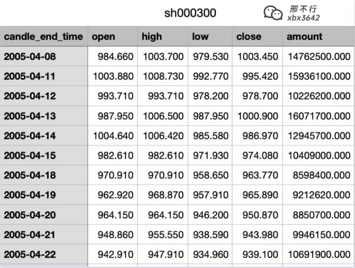

然后使用Python统计沪深300每个工作日的涨跌幅。非常简单，几行代码就能搞定：

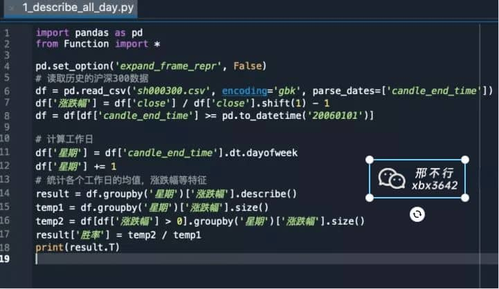

统计用的代码

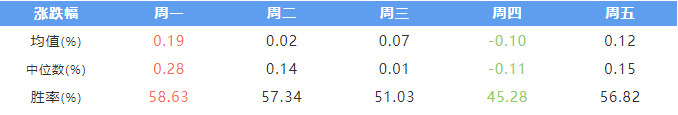

统计区间：2006年1月1日 - 2020年9月20日

**从统计结果看来，周四跌的确实最厉害**。

其他日涨幅的**均值**和**中位数**均为正，**只有周四为负。**在胜率（每天的上涨概率）方面**也只有周四的胜率低于50%。**

**除此之外，表现最好的是周一，平均涨幅高达0.19%，胜率接近60%，其次是周五。**

 

### 各个工作日表现

除了验证每日的涨跌幅之外，我还做了另外一个验证。

**假设沪深300指数每周只有周一，其他交易日都去掉。**

那么此时沪深300指数就**只和周一的涨跌幅相关**，再把指数画出来，就能清楚的知道**周一市场的表现**。

其他工作日也按照这个思路处理，就能得到下图：

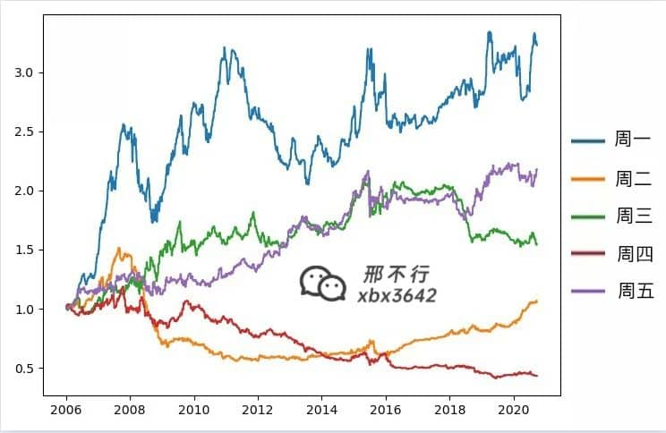

各工作日净值曲线

图中的**五条曲线分别对应五个工作日的净值**。

周一最终净值在3.5左右，这意味着2006年指数1000点，到现在已经3500点

周四的表现就不尽人意了，只有0.5。这意味着2006年指数1000点，到现在只剩500点。

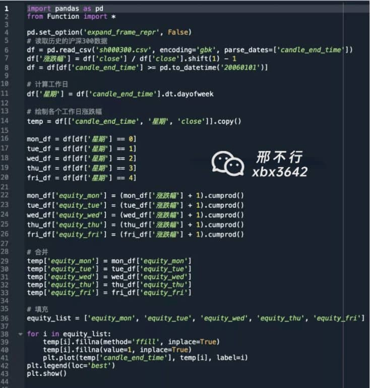

计算各个工作日净值

通过以上分析，我们发现**A股周一表现最佳，周五表现次之，周四表现最差。**

其实不光是A股，**世界上主要的股票交易市场都存在类似的现象。**例如美股市场，周一显著为正，周五显著为负。

全球主要市场的周内效应

这种一周之内存在某日收益明显为正或负的现象，就被称之为**“周内效应”**。

  

## 牛熊市的周内效应

  

之前我们统计了所有时期的数据，但股票市场存在牛市和熊市。

**那么周内效应在牛市和熊市当中是否有什么差别呢？**我们可以看一看。

  

### 定义牛熊市

在分析前需要先定义什么是牛市和熊市。

我们简单的按照20日均线来区分：**若今日收盘价高于20日均线则为牛市，否则为熊市。**

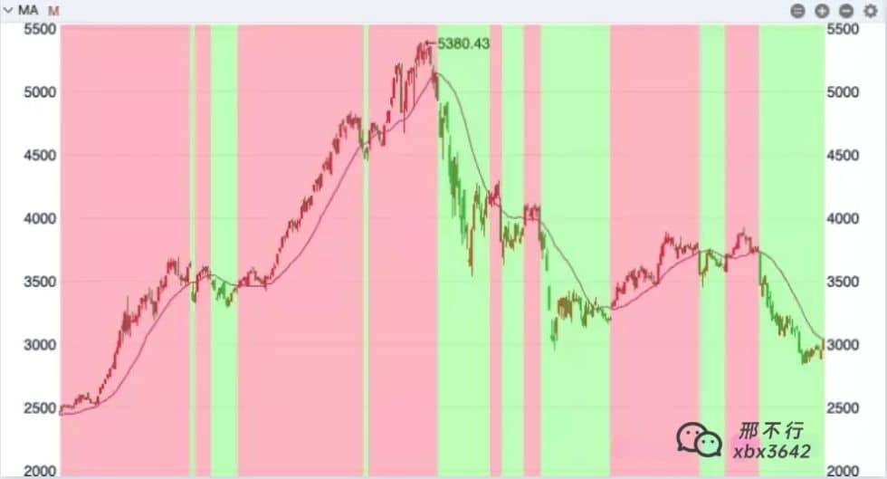

20日均线区分牛熊市

比如上图中**红色部分表示牛市**，**绿色部分表示熊市。**

制定好牛熊标准后，就可以查看在牛熊不同状况下的周内效应了。还是借助Python：

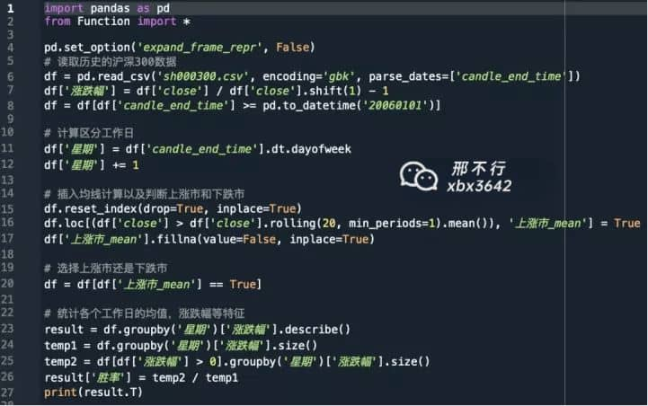

### 牛市的周内效应

  
下图为牛市时的每周平均涨幅：

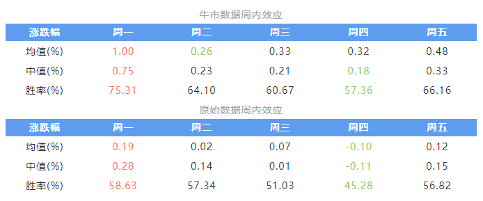

统计区间：2006年1月1日 - 2020年9月20日

通过对比可知，在牛市中周一的表现变得更好了，周四的表现依旧很差。但值得注意的是，**周二的表现也变差了**。

### 熊市的周内效应

再看熊市时每天平均涨幅的数据：

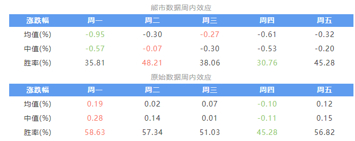

统计区间：2006年1月1日 - 2020年9月20日

通过对比发现，熊市中各交易日都跌得比较厉害，周二和周三的表现相对好一些，虽然周四的表现依旧差，但原本强势的**周一表现变得比周四还差**。

牛市和熊市中，周内效应依旧存在，但会有一些差别。

很多人可能会问，为什么会存在周内效应呢？

  

## 为什么会存在周内效应

周内效应的普遍存在，引起了业界和学术界的广泛关注，许多专家和学者都给出了自己的看法，目前主流的解释有以下三个方面：

### 结算制度

我国股市采取T+1的交易结算制度，卖出股票后资金在下一个交易日才可以提现。  

周一至周四卖出股票次日即可提现，**时间成本为1天**，但周五卖出股票需要到下周一才能提现，**时间成本为3天**。

当周末需要用钱时，投资者就会在周四卖出股票，周五取出现金。**很多人在周四集中卖出股票，就会导致周四的股市下跌**。

这也就解释了为什么周四的表现是最差的。

### 信息冲击

周末市场虽然不交易，但各类影响市场的宏观事件和微观事件仍在发生。**尤其是我国，很多重要的政策都在周五收盘后发布**。

周二至周五只包含了前日收盘到今日开盘**一夜**的信息冲击。

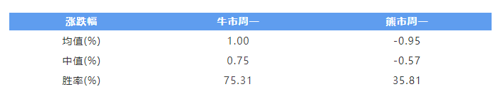

周一的价格波动是最大的

而周一包含了周五收盘到周一开盘**两天三夜**的信息冲击，这也就解释了为什么周一的价格波动是最剧烈的。

### 投资者行为

投资者在周末拥有更多的时间去思考，在**牛市**期间**乐观情绪得到进一步强化**，导致**周一集中买入**。在**熊市**期间思考会让投资者**更加悲观**，导致**周一批量卖出**。

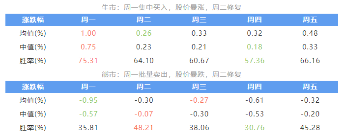

然而过度的思考往往是非理性的，**股价在周一剧烈波动后，会在周二和周三慢慢被修复**。

这一价格修复机制解释了，为什么**周二在牛市中的表现很差，但在熊市中却表现出很强的抗跌性**。

## 如何利用周内效应赚钱

全面了解了周内效应，该讲讲怎么用它赚钱了，我基于周内效应，尝试性的构建了3个实用的投资策略。

### 周内最优定投

了解了周内效应后，很多人第一时间想到的是定投。我那天发的动态，就有朋友回复：**周四定投岂不是美滋滋。**

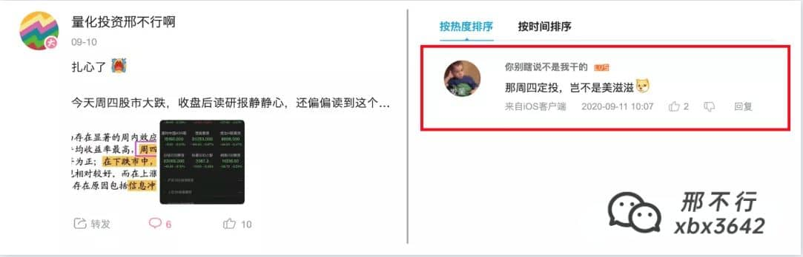

这位朋友的意思是，既然周四股市会大跌，那我每周定投的时候放在周四，等跌完之后买入，效果应该会更好一点。

要验证这个想法其实也很简单，之前写过一篇文章**[《在两万美金顶点买入比特币的他，现在怎么样了？》](https://zhuanlan.zhihu.com/p/66431021)**里面就讲过如何用Python来计算定投的收益率，直接用那个代码就可以计算了。

验证结果如下图：  

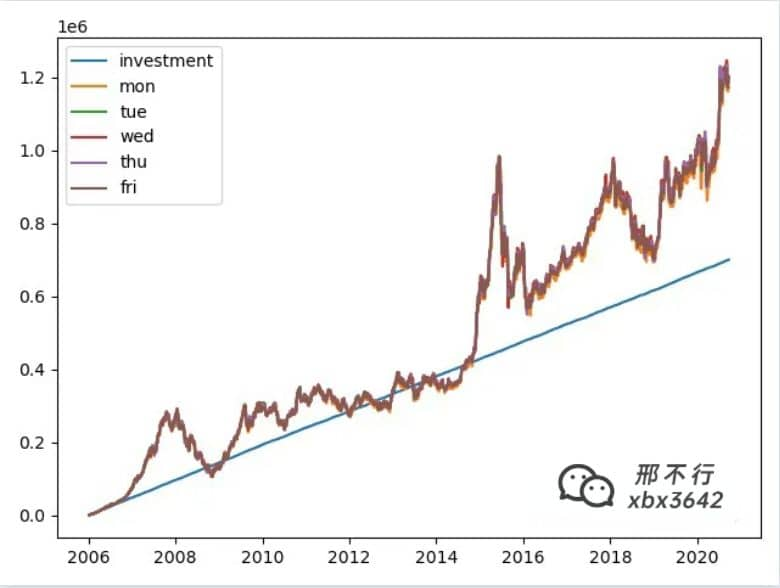

各工作日定投表现

图中**蓝线**表示**累计定投的总金额**，那根看似棕色的线，是分别在周一、周二...周五定投的**五根资金曲线**纠缠在一起产生的，可见差别很小。

从结果来看，各工作日定投的**投入资金**都在**72万**左右，最终**持有市值**也都在**120万**左右。

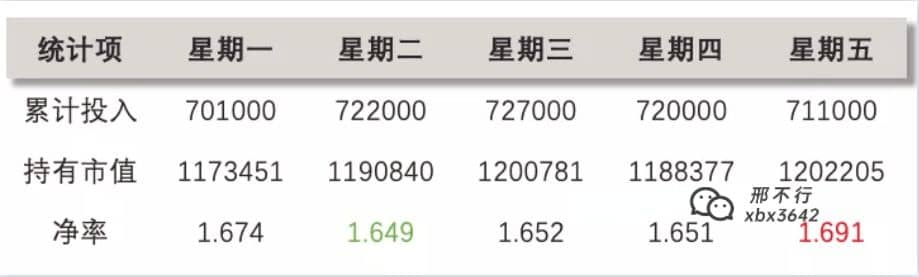

各工作日定投结果

**所以选择周四收盘定投并不会给我们带来明显的超额收益。**

### 排除周四策略

选择在周四下跌后定投效果并不好，那不如换个想法，我们干脆**避开整个周四**。

什么意思呢？通过之前的分析我们知道**周四的收益率是负的，其他日收益率均为正**。

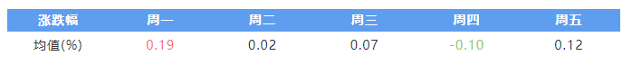

**那索性在周四收盘买入，持有到下周三收盘卖出，下周四收盘再买入，如此往复，使得整个仓位都避开周四的下跌行情。**  

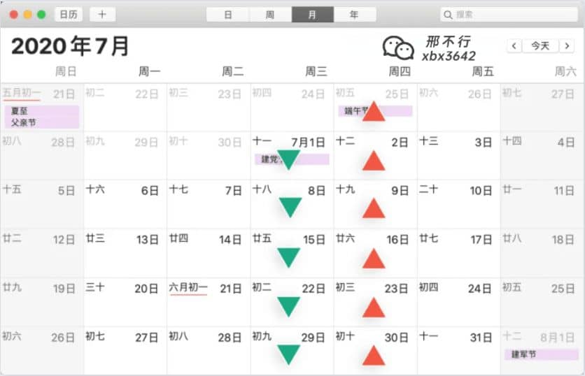

我们选择**沪深300ETF**作为投资标的，使用Python对这个策略进行了验证，得到以下结果：

  

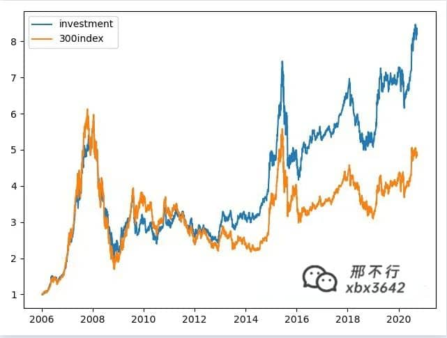

排除周四策略资金曲线

上图中**橙线**表示**沪深300**，**蓝线**表示**排除周四策略。**

  

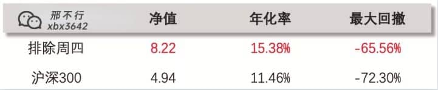

排除周四策略结果

通过对比我们发现，不管是**收益**还是**风险**，策略都比沪深300要好得多。

而且这个是扣除手续费的结果，ETF交易虽然不需要缴纳印花税，但高昂的手续费还是会影响最终的收益。

如果你想了解自己的手续费如何计算可以看我之前的文章[《实盘账户演示，如何算清楚自己股票交易的手续费》](https://zhuanlan.zhihu.com/p/259850001)

这个策略真的是专制手贱啊。很多人明知道长期持有收益较高，但是总控制不住想去交易，这个策略每周交易一次，既解决了他们想要交易的冲动，还能帮助他们轻松跑赢大盘。

### 牛熊市策略

最后的这个策略，需要用到之前的两个结论：

_牛市中，周一和周五表现较好，周二和周四表现较差_

_熊市中，周二和周三表现较好，周一和周四表现较差_

运用这个结论，我们构建了一个稍微复杂一点点的策略来买卖沪深300ETF。

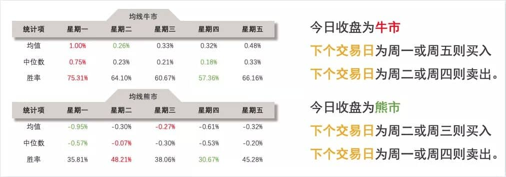

牛熊市策略

在**牛市中周一和周五表现较好**，所以如果下个交易日是周一或者周五则买入。**周二和周三在牛市中表现较差**，则下个交易日是周二或者周三则卖出。

以此类推，**在熊市中，下个交易日为周二或周三则买入，下个交易日为周一或周四则卖出。**

说起来可能比较复杂，我做了一张图片帮助大家理解，下图中**绿色背景**表示当天处于**熊市**，**红色背景**表示处于**牛市**，**绿色箭头**表示**卖出**，**红色箭头**表示**买入**。

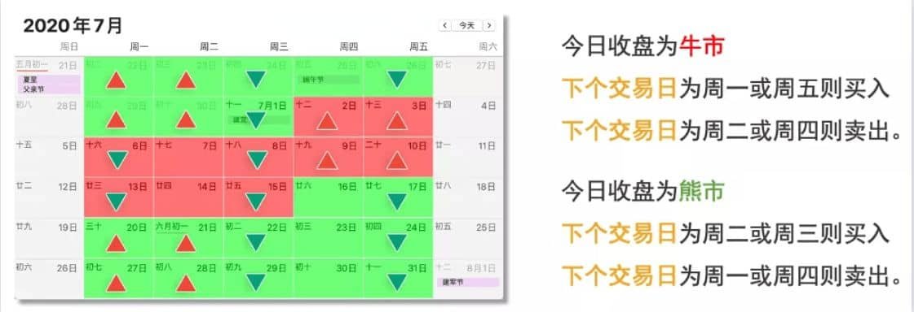

牛熊市策略交易信号

通过沪深300的历史数据和Python代码，我们对**牛熊市策略**进行回测，得到如下结果：

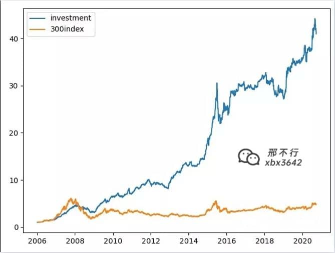

牛熊市策略资金曲线

上图中，**橙线**是**沪深300**，**蓝线**是**牛熊市策略**，这个策略的效果很不错。

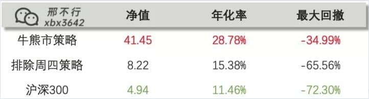

牛熊市策略结果

**年化收益率28.78%**，2006年至今**净值41.45**，这意味着你2006年投资1元钱，现在就能收获41.45元。而同期大盘只翻了4.94倍。

风险方面，最大回撤也从沪深300的**72.3%下降到了34.99%**。

策略并不复杂，但实际交易的效果很好，能够**轻松跑赢大盘指数近10倍**。

  

### 总结

本文的内容比较长，帮大家总结一下。

我们先谈了A股的周内效应，发现**A股星期一表现最好，星期四表现最差。**如果**区分牛熊市**来观察周内效应那么可以发现：

_牛市中，周一和周五表现较好，周二和周四表现较差_

_熊市中，周二和周三表现较好，周一和周四表现较差_

在全面了解周内效应后，我们据此构建了**周内最优定投**、**排除周四策略**、**牛熊市策略**，这3个策略对沪深300进行择时回测。

其中**牛熊市策略**的表现很不错，在**收益率**和**风险**上都**远远优于沪深300**，**净值**更是接近沪深300的**十倍。**

