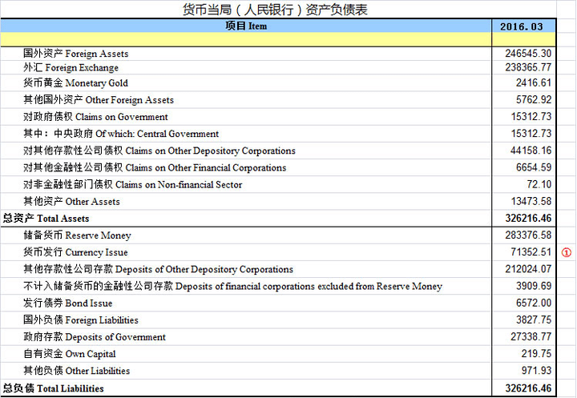
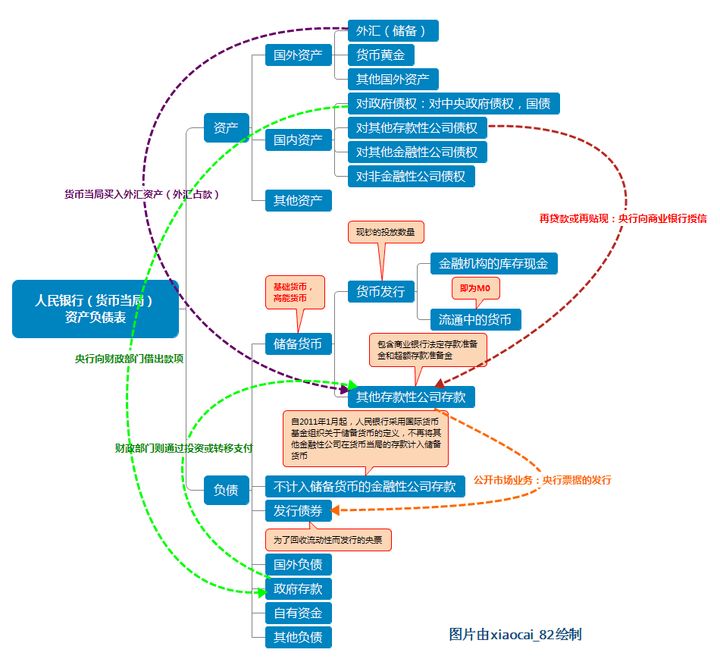
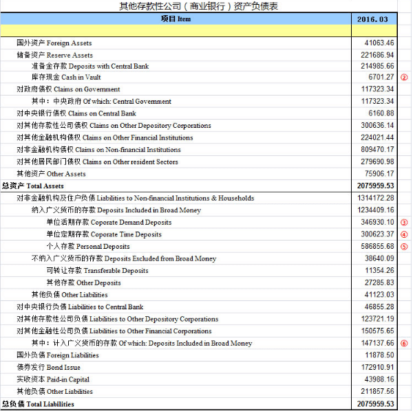
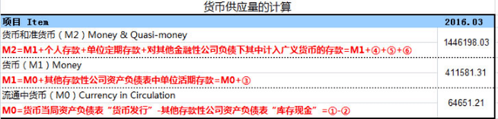

经常会被同事们问到M0、M1、M2 到底是什么意思？

其实，关于M0、M1、M2 是什么的解释网上也不少。

**比如，下面的一段是从网上摘录的解释（不代表本人观点）：**

> M0，M1，M2是货币供应量的三个定义，分别表示流通中的现金，狭义货币与广义货币。  
> M0=流通中现金  
> M1=M0＋可开支票进行支付的单位活期存款  
> M2=M1＋居民储蓄存款＋单位定期存款＋单位其他存款＋证券公司客户保证金  
> 在日常生活中，M0数值高证明老百姓手头宽裕、富足。衣食无忧的情况下这种可能性更高。M1反映着经济中的现实购买力，代表着居民和企业资金松紧变化，是经济周期波动的先行指标，流动性仅次于M0。  
> M2不仅反映现实的购买力，还反映潜在的购买力。流动性偏弱，但反映的是社会总需求的变化和未来通货膨胀的压力状况。通常所说的货币供应量，主要指M2。货币投放的渠道有两个，一是外汇占款投放，二是通过银行信贷投放。它们的投放增长越快M2的增速越大。  
> 我们一般可以通过M1和M2的增长率变化来揭示宏观经济运行状况。将M2的增长率和M1的增长率进行对比，有很强的分析意义。如果M1的增长率在较长时间高于M2的增长率，说明经济扩张较快，活期存款之外的其他类型资产收益较高。这样更多的人会把定期存款和储蓄存款提出进行投资或购买股票，大量的资金表现为可随时支付的形式，使得商品和劳务市场普遍受到价格上涨的压力。影响M1数值的原因很多，例如股票市场火暴就会影响到M1的数值变化，很多人会将定期存款和部分资产变现投放到股市，促使M1加速上扬。  
> 反之，如果M2的增速在较长时间内较M1的增速高，则说明实体经济中有利可图的投资机会在减少，可以随时购买商品和劳务的活期存款大量转变为较高利息的定期存款，货币构成中流动性较强的部分转变为流动性较弱的部分，这无疑将影响到投资继而影响到经济增长。  
> 中央银行和各商业银行可以据此判定货币政策。M2过高而M1过低，表明投资过热、需求不旺，有危机风险；M1过高M2过低，表明需求强劲、投资不足，有涨价风险。

**看完上面的解释后，你是不是会问：**

什么是流通中的货币啊？央妈是怎么计算出这些数据的呢？

除了大概的意思理解了，是不是还是感觉一脸懵逼、递归懵逼、甚至是高阶懵逼呢？

好吧，我们如果想要深入理解M0、M1、M2，个人认为首先需要对央行资产负债表、商业银行的资产负债表有个基础的认识。

为什么要了解央行和商业银行的资产负债表呢？

因为我国银行体系实行的是二级银行体制，所谓二级银行体制，就是一个国家由央行成为一级银行，而商业银行（存款货币银行）是二级银行，商业银行在央行那里开户，民居（企业和个人）在商业银行那里开户。而M0、M1、M2

就是通过二级银行体制下的央行和商业银行的资产负债表科目中的数值计算而来。你说要不要了解呢？

那么，我国央行的资产负债表和商业银行的资产负债表分别主要都包含了哪些科目呢？

央行资产项包括国外资产、外汇、货币黄金、对政府债权、对其他存款性公司债权、对其他金融性公司债权、对非金融性部门债权、其他资产，共8项。

央行负债项包括储备货币、货币发行、其他存款性公司存款、政府存款、央票发行、不计入储备货币的金融性公司存款、国外负债、自有资金、其他负债，共计10个项目。

图-1：央行资产负债表 来源：网络

  

图-2：央行资产负债表 来源：网络  

**资产项：**

**国外资产**

**外汇**

外汇，指的就是央行口径的外汇占款，即央行从居民或商业银行手中购买外汇而对应投放的人民币。

**货币黄金**

货币黄金，记录央行在国内和国际市场上购买黄金所投放的人民币。在国内市场直接用人民币购买黄金，在国际市场购买黄金利用外汇储备，但换算成人民币。

**其他国外资产**

其他国外资产，主要记录央行持有的国际货币基金组织头寸、SDR等。

**国内资产**

**对政府债权**  

对政府债权记录的是央行持有的中央政府发行证券，主要是特别国债。

**对其他存款性公司债权**

对其他存款性公司债权，是指央行对商业银行、政策性银行等其他存款性公司的再贴现、再贷款、逆回购操作和结构性货币政策工具余额。对其他存款性公司债权主要记录央行主动投放基础货币的方式，与其他存款性公司资产负债表中的“对央行负债”科目对应。

**对其他金融性公司债权**

对其他金融性公司债权，主要包括央行对其他金融性公司的金融稳定再贷款。主要是央行为维护金融稳定过程中提供的贷款。

其他金融性公司是指除中央银行和其他存款性公司以外的其他金融公司。在我国主要包括信托投资公司、金融租赁公司、保险公司、证券公司、证券投资基金管理有限公司、养老基金公司、资产管理公司、担保公司、期货公司、证券交易所和期货交易所等。

**对非金融性公司债权**

对非金融公司债权的形成主要是央行为支持老少边穷地区经济开发所发放的贷款。

**其他资产**

不知道包含哪些，毕竟具体明细央行是不会对外公开的。

**负债项：**

**储备货币**

储备货币，即基础货币。基础货币包括货币发行和存款准备金（又称为其他存款性公司存款）。其中货币发行又分为流通中的货币（亦为M0）和银行库存现金，存款准备金又分为法定存款准备金和超额存款准备金。

**不计入储备货币的金融性公司存款**

是指除去存款准备金之外金融机构在央行的存款，主要包括两部分内容，一部分是金融机构业务往来清算支付所需的资金，另一部分是非存款类金融机构向央行缴纳的法定存款准备金。

**发行债券**

主要是指为回收流动性而发行的央票。

**国外负债**

国外负债主要记录的是央行对非居民的负债，主要形式有非居民部门在本国央行存款、央行在国外发行央票等。

**政府存款**

上至中央政府国库、下至地方政府国库的财政存款都会记在中央银行资产负债表中的政府存款科目。

**自有资金**

央行的自有资金是央行资本金，就类似自己的钱存到自己的银行里，在账户上当然会放在负债项，这是银行欠自己的。

**其他负债**

其他负债主要包括正回购余额、金融机构以外汇形式缴存法定存款准备金等。

图-3：商业银行资产负债表 来源：网络

此外，关于基础货币投放，主要有四种形式（来源网络，版权归原作者）：

> **一是向财政部门借出款项或允许其透支。**  
> 财政部门则通过投资或转移支付等形式将这一部分基础货币注入生产、流通或消费领域，最终转化成企业和家庭的货币收入。  
>   
> 在货币当局的资产负债表中，向财政部门借出款项表现为资产项下“对政府债权”的增加以及负债项下“政府存款”的增加。然后经由财政资金的使用表现为负债项下“政府存款”的减少以及“储备货币（其他存款性公司存款）”的增加。而财政的透支则会直接表现为资产项下“对政府债权”的增加以及负债项下“储备货币（其他存款性公司存款）”的增加。  
>   
> 但《中国人民银行法》已经不允许中央银行以这种方式投放基础货币。《中国人民银行法》第二十九条规定，中国人民银行不得对政府财政透支，不得直接认购、包销国债和其他政府债券。第三十条规定，中国人民银行不得向地方政府、各级政府部门提供贷款，不得向非银行金融机构以及其他单位和个人提供贷款。但国务院决定中国人民银行可以向特定的非银行金融机构提供贷款的除外。  
>   
> **二是货币当局以再贷款或再贴现等形式向商业银行授信。**  
> 这部分基础货币经由商业银行的信贷投放、转账存款如此这般周而复始的派生存款创造过程，最终转化为众多商户或个人的支票存款和现金货币。  
>   
> 在央行的资产负债表中，这将表现为资产项下“对其他存款性公司债权”的增加以及负债项下“储备货币（其他存款性公司存款、货币发行）”的增加。  
>   
> **三是货币当局买入外汇资产。**  
> 这部分基础货币也将经由商业银行的信贷投放派生出大量的支票存款和现金货币。在央行的资产负债表中，这将表现为资产项下对“国外资产（外汇储备）”的增加以及负债项下“储备货币（其他存款性公司存款）”的增加。  
>   
> 在历史上，中国人民银行对商业银行的再贷款是我国基础货币投放的主要方式。但在目前，外汇占款已经成为中国人民银行基础货币投放的主要方式。  
>   
> **四是货币当局经由公开市场业务买入有价证券。**  
> 由于中央银行的公开市场业务以金融机构为交易对方，买卖的标的是国债，所以在货币当局的资产负债表中，这将表现为资产项下“对政府债权”的增加以及负债项下“储备货币（其他存款性公司存款）”或“不计入储备货币的其他存款性公司存款”的增加。  
>   
> 另外，中国人民银行还通过央行票据的发行、正回购交易以及外汇掉期交易等途径调控基础货币在不同时间点上的数量分布。在货币当局的资产负债表中，央行票据的发行表现为负债项下“储备货币（其他存款性公司存款）”的减少以及“发行债券”的增加；正回购交易中的第一次交易表现为负债项下“储备货币（其他存款性公司存款）”的减少以及“其他负债”的增加；外汇掉期交易当中的售出外汇表现为资产项下“外汇（储备）”的减少以及负债项下“储备货币（其他存款性公司存款）”的减少。
