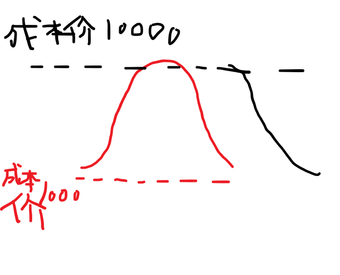
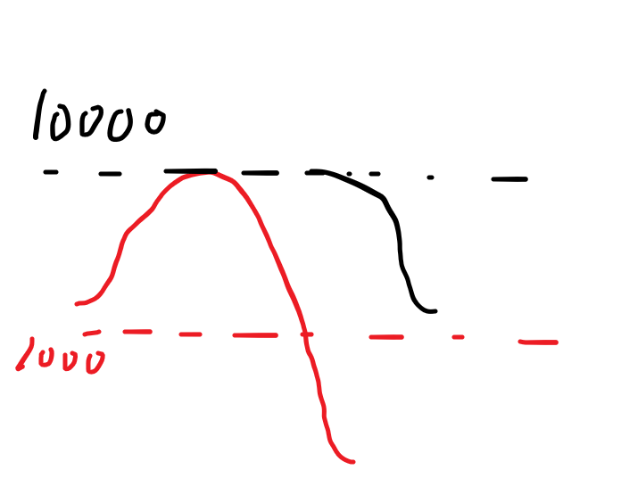
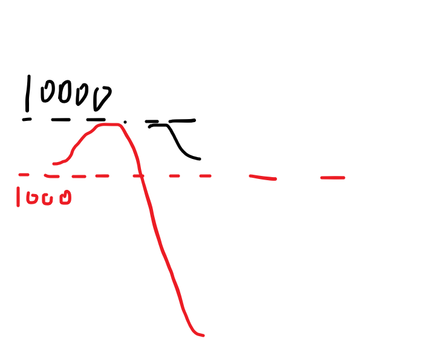
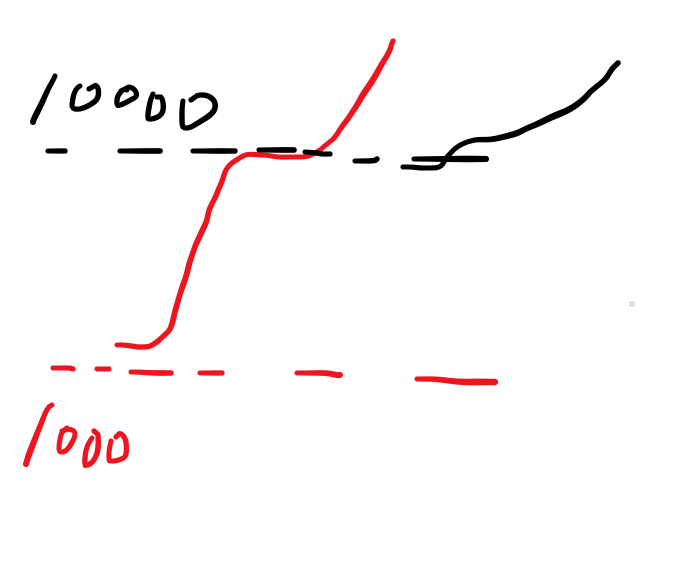
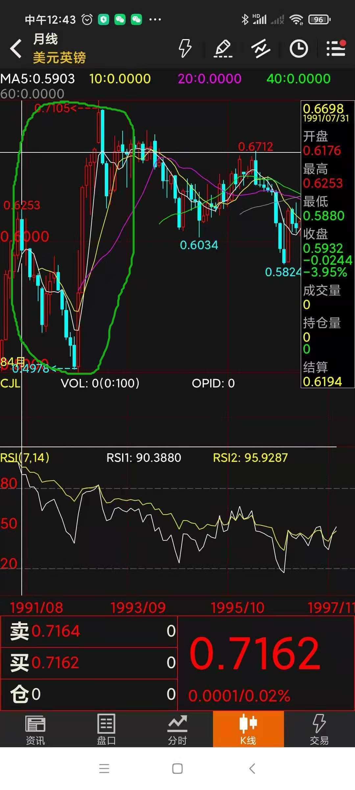
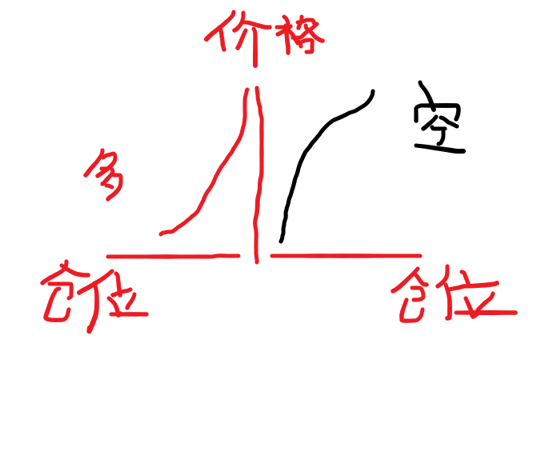
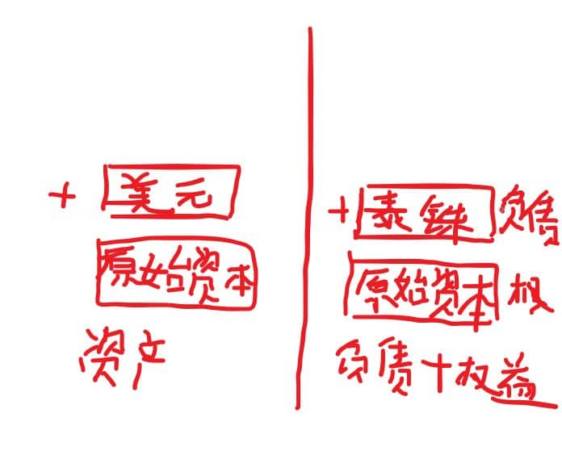
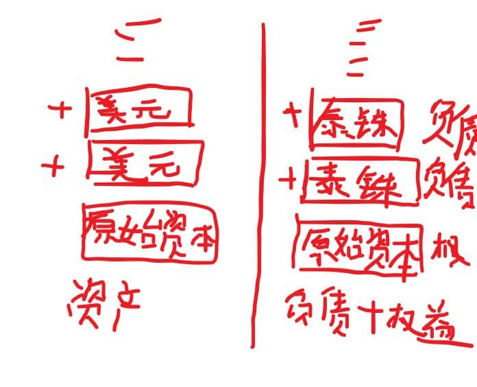

## 原理
我的导师恰好是索罗斯的学生，之前就一直想专门写一篇文章来谈谈庄家的套路，因为并没有什么多深奥的东西，简单到一篇文章就能讲完，后面顺便讲讲索罗斯的收割手法。

市面上大多数谈庄家的书都是错的，它们把庄家的手法就简单的看成就是拉高让跟风盘接盘达到出货目的，这样的“傻庄”其实是不存在的。

也没多少人能把索罗斯狙击英镑泰铢的过程讲清楚，很多人就简单的看成索罗斯就是通过庞大的资金一味的做空，硬是把盘砸下去，于是空单就盈利了——要是真那么简单谁都可以做索罗斯了，大部分人都还没理解对冲基金对冲的底层逻辑，本篇文章就是从底层逻辑出发，带大家理解索罗斯是如何通过对冲让自己在任何情况下都能处于不败的地位。

可以这么说，所有的庄家都是通过在即期与远期市场的对冲来实现盈利的。

然而同样是对冲，在外汇、大宗商品、贵金属市场的玩法与逻辑，跟股票市场的玩法与逻辑是完全不一样的。因为前者是分为现货与期货市场的对冲，是分别两个独立的市场，两个不同的盘面，资金规模也完全不一样；而后者股票市场的对冲是买入股票与融券做空，是在同个盘子里，共享同个盘面，这样的差异具体表现后面会详细解释。

这里我们先探讨前者外汇、大宗商品、贵金属的庄家对冲手法，因为它更容易理解。理解了之后，然后谈索罗斯狙击英镑、泰铢、港币的过程就轻松多了。

为了方便理解，我就拿比特币来说吧。如果你想做庄家，你想要实现控盘很简单，你只要资金足够雄厚，买下现货市场上99%的比特币，这时候99%的比特币就相当于“冻结”在你手里了，只剩下1%的流通盘，那你想拉多高价格都没问题啊，因为在现货市场上绝大多数的卖盘都只能出于你的手，因为现货市场的总盘子是有限的，你手握这99%的比特币，你只要不卖，基本上市场上就没卖盘，而你只要稍微用一点资金，想把成交价打多高都行。

因为资本市场价格分时走势的形成原理，就是每一分钟发生的平均成交价连成的线，而且跟成交量是无关的。假如原先比特币价格是1000元，而现货市场所有的比特币都在你手中，你挂一个卖单在10000块，然后自己再拿出10000块去买，那你就能看见分时走势上比特币的价格从1000元涨到10000块，瞬间翻了10倍。

这样看的话似乎你只用了10000块钱，就让自己的总资产翻了10倍——然并卵，你就算在现货市场分时走势上把成交价拉的再高，拉到1亿元也好，那都只是盘面上的浮盈，你要实现真正的盈利，就必须把手上所有的比特币卖出套现了，才算是真正的盈利。

那问题来了，你正想在10000元的价位清出所有的比特币套现的时候，发现没人接盘，没人愿意去买，那怎么办，你一味的卖出只会疯狂的砸盘，到头来还没赚多少。

所以正确的做法是这样：在拉升的过程中，在期货市场的价格高位建空单，实现对冲式建仓。

首先期货市场的价格涨跌是一个独立开来的市场与盘面，并且它不同于现货市场的有限盘，它的流通盘是可以无限的，只要有人在建多单或建空单的时候，有另外一个资金跟他做对手盘，那它的流通盘可以无限的扩张下去。而且期货市场的价格走势是可以跟现货不一样，甚至是局部时间内反着走，但最终它还是会回归到现货价格，它的涨跌完全是多空双方角力的结果。

（更多期货的基础知识，我建议大家去找教材看一下，这里不展开讲了，但这是相当重要的，你不去了解期货就冲进金融市场，就是给人做炮灰）

而期货市场是带杠杆的，如果是10倍杠杆，那么你建空单的资金量只需要是前面在现货市场买入比特币的总资金的1/10就够了。在建空单的同时，在现货市场上继续拉高比特币价格——为什么要这样做呢，就是为了尽可能的保证你空单的成本价在高位，当这么做的时候其他散户没人敢做空，只敢做多，这样你的空单不怕在这价位上没对手盘。如果有人敢做空跟你抢对手盘，你大可以继续拉涨现货价格，拉到他们的空单爆仓。

一旦在期货市场建空单完成，就是布局完成了，这时候你可以大胆的在现货市场上卖出比特币套现。这时候如果没人接盘，那么比特币价格会从10000块那里往下暴跌，而这时候期货市场一般都会跟跌——因为现货价格开始跌，拉开了与期货价格的距离，必然有人选择做空，又或者原先的做多盘选择止损平仓（而多单平仓就是在做空），就算退一万步真的没人做空，那么也不会有人敢做多，这时候你在期货市场可以用少量资金做空就可以把价格打到低位。

这样子你作为庄家，基本上是稳赚的，因为就算现货市场套现过程因为成交价不断拉低导致没赚到钱，但在期货市场上你因为做空了，所以期货市场大赚特赚，你在期货市场价格不断下跌的过程中逐步清仓获利了结。

——而在期货市场空单平仓就是在做多，与在现货市场卖出做空行为形成对冲，我们可以称之为对冲式清仓。

这个过程不外乎以下几种：（红线是现货市场价格，黑线是期货市场价格）

以上第一种，这个很好理解，期货价格下跌幅度跟现货价格同步，只要现货价格在你抛售的过程中没跌破1000元的成本价，你现货市场还是有赚的，而期货市场大赚。即使这个清仓过程中现货价格跌到1000，期货价格只跌了一点点，你还是有盈利的。

第二种情况：

这种情况就是你抛售的过程中，现货市场的价格跌破了1000元的成本价，但如果你在1000元以下抛售的仓位小于1000元以上抛售的仓位，你在现货市场上还是有赚的，但即使不是，只要整个过程中你在1000元以下的下跌幅度，小于在期货市场上从10000元开始的下跌幅度，那么你在期货市场的盈利是大于现货市场的亏损的，你依然是整体盈利的。

第三种情况，也是最最最完美的情况，就是你在现货市场的抛售过程中，价格居然不见下跌，同时期货市场却下跌了，那么就说明有人给你接盘，你两边都赚大了。

那么什么情况下你会亏损？

就是现货市场价格在1000元以下的下跌幅度，甚至大于期货市场上从10000元开始下跌的总幅度，就像这样：

这种就属于极端情况，几乎不可能发生，因为要实现这个，等于是有资金在现货市场疯狂卖出的同时，又有资金在期货市场疯狂做多——一方面期货市场那里看到现货价格跌成那样，不太可能有人敢做多，同时你作为现货市场的做空主力，你也不会那么傻砸成这样。

但有一种情况有可能发生，就是你在现货市场抛售清仓的整个过程现货市场不跌甚至大涨，期货市场价格也跟着涨——这样虽然你现货市场赚钱了，但有可能期货市场的拉升幅度太大，导致你期货市场的亏损大于在现货市场的盈利。就像这样：

——这种情况的发生，说明你被更大的庄家盯上了，他有意要整你。当年索罗斯尝试做空港股的时候，就是这样被我们国家队来反制。

其实索罗斯的量子对冲基金，就是经常用以上手法来收割。

在探讨索罗斯的手法前，先给没接触过外汇市场的人简单科普下，一个货币的汇率是如何决定的？是由这个货币兑外币的即期与远期市场决定的，就跟股票与其他大多数资本市场一样，由买卖双方撮合成交决定的，你看到的汇率分时走势，就是最新的成交价。如果美元兑港币的汇率在涨，说明这时候有人不断的用港币兑换美元，推高了美元兑港币的市场价。

### 索罗斯如何狙击英镑的？

索罗斯做空英镑前，他必须先做多，就是先大量买入英镑，其方法是除了在外汇现货市场上用美元或其他外币大量兑换英镑，同时会在它们本土银行那里大量借入（申请贷款）英镑——因为索罗斯会专门选择那个国家在量化宽松的时候做这事，因为利率很低。这两种行为都属于做多行为，因为他为了达到控盘目的而要把盘子里大量筹码囊入手里。

其实上面我是为了方便大家理解，才把成本价定在一个固定的价位，但现实中，当有人为了达到控盘目的而大量买入某个品种现货的时候，在这过程中价格必然已经开始涨了，所以现实情况是庄家在吸收筹码导致涨的时候，这过程就已经在期货市场建立空单，所以做多跟做空是同时进行的，这就是一个对冲的过程，其价位与仓位设置是门很大的学问，就不展开讲了。

而在这过程中，因为实体市场上大部分的英镑被索罗斯借走，或者被外币兑换走，于是导致市场本币流动性紧缺，这个时候本币的汇率已经开始升值了，加之本地因为本身过度杠杆导致债务规模过大，流动性一旦紧缺就会导致债务违约激增，于是会影响股票市场。

因为英镑的流动性紧缺，使得汇率市场上英镑价格大涨，而索罗斯在期货市场上布局空单建仓完毕，就开始在现货市场上卖出本币做空，他除了拿之前外币兑换的英镑兑换回外币，还拿之前大量借入的英镑去兑换外币，因为先有英镑升值，这时候他在高位兑换外币，等于赚了一波套汇差价，同时因为现货市场的大量做空，使得期货市场本币汇率大跌，于是他的空单也大赚一笔，而在这个过程中期货市场不断平仓了结获利，相当于做多，形成对冲式清仓。

以上这个过程对应的就是上面第二张图，整个过程英镑即期跟远期汇率都在暴跌，其幅度远高于之前的上涨幅度，所以整个过程虽然现货市场亏损，但期货市场大赚，远高于现货市场的亏损。其中他最高明的一点就是他利用了本地的借贷市场，以低利率大量借入英镑，在英镑汇率高位兑换成外币，又在后来被打到低位的时候用外币兑换回本币来偿还债务。

整个走势如下图：

这图是美元兑英镑的汇率走势图，所以下跌的话就是英镑升值，上升就是英镑贬值。我们可以看到绿圈圈内，是先有英镑大幅升值，然后开始贬值，贬值幅度要大于之前的升值幅度。

接下来是做空泰铢。

狙击泰铢的时候，情况有点不一样，因为泰铢汇率虽然跟英镑一样也是开放市场，但是泰国政府因为某些因素的考量，有意让泰铢在开放市场上维持兑美元稳定的汇率，这意味着当有人想在外汇市场上大量用泰铢兑换美元的时候，泰国政府要用美元储备来买入泰铢来维持汇率稳定。

所以索罗斯就换了思路，他的做法其实是做多美元兑泰铢汇率，其实就是做空泰铢，但却是围绕着美元来实行对冲。

先是跟做空英镑前一样大量在泰国本土市场借入泰铢，然后用泰铢买入美元，但因为泰国的紧盯美元汇率的货币政策，不管用多少泰铢买入美元，汇率依然保持不变，这给索罗斯带来极大的成本优势。因为那时候泰国处于降息周期，而美国则处于加息周期，索罗斯用贷来的泰铢兑换美元后，用美元购买美元债券，因为美联储在加息周期内会通过在公开市场售出债券来缩进美元，债券价格会降低，债券价格降低就意味着利率收益提高，这样索罗斯就可以赚取利差。

然后因为泰国政府顶不住压力，美元储备不足，最终无法维持泰铢兑美元汇率，于是泰铢贬值——也就是美元升值，索罗斯采取跟之前一样的手法，当美元兑泰铢汇率逐步攀升的过程中，在泰铢兑美元的远期市场建美元空单，实现对冲式建仓。最后跟之前一样，又恰逢美联储进入降息周期，，美元债券价格上涨，索罗斯卖出之前低价买入的美元债券换回美元，又拿着美元在汇率高位兑换泰铢（相当于做多泰铢），用以偿还泰铢贷款，这样子泰铢汇率回升，而因为已经在远期市场布局美元空单，于是远期市场上美元空单获利，但同时又在期货市场平仓美元空单（相当于做多美元，也等于做空泰铢），实现对冲式清仓。

接下来就是狙击港股。

与前面不同的是，索罗斯这次直接盯上的就是香港股市。他先早期从香港本土银行大量借入港币买入股票，当然也通过自有资金兑换港元买入港股，在97之前港股都是处于上升周期。

如上面演示的那样，索罗斯在做多港股的时候也逐渐在恒指期货里建空单，在97年恒指处于高位的时候开始在现货市场抛盘，意图通过这样是恒指期货指数大跌，实现期货空单的大赚。

但这时中国国家队全面支持港府，大量做多港股与恒指期货，以至于保住了期指指数，索罗斯在期货市场失利。

有人问虽然保住了港股，那索罗斯有没亏损呢？亏损多少呢？显然他是没有亏损的，甚至获利不少，只是没有预期得多，因为他先有早期买入做多港股，当国家队在他砸盘时接盘，就决定了他在港股现货市场是完美套现离场的，虽然他在期货市场亏损了，但想要这个亏损值大于他在现货市场的盈利，就要把恒指从那个已经是高位的基础上继续拉高，其幅度必须要大于之前他做多港股时候的幅度，显然并没有做到。

——这就是对冲的强大，只要资金足够雄厚且先手控盘，那他就可以处于不败的地位。

  

### 补充
其实上面那几张图，是为了让大家方便理解其盈利逻辑，所以就简单的把现货市场的买盘仓位设在1000元低位，期货市场空单成本价设在10000。

但现实中，庄家的仓位其实是分布在整个波段，不管是现货买入的仓位还是期货空单的仓位，只不过分布比例有所不同，也就是说现货买入跟期货做空是一开始就同时进行的。

只不过一开始价格处于低位的时候，现货做多的仓位会重些，期货做空的仓位会轻，但随着价格推高，现货那里继续买入的仓位会边际递减，而期货空单仓位会边际递增。

如下图：

上图是对冲式建仓的多空仓位分布图，当现货市场价格低位的时候，买入仓位是最重的，空单仓位是最轻的，而到了价格高位则反过来。

但开始对冲式清仓的时候，现货市场在顶部卖出的最多，随着价格下跌边际递减，而期货市场顶部平仓的最少，随着价格下滑，清仓的仓位会边际增加。

为什么要采取这方式？为什么不直接现货市场底部全部买入，拉涨之后，再在期货市场价格高位开空单不好吗？——如果从盈利的角度看，能做到这样当然是最香的，但是现实中这市场上不只有你一个庄家，这么做的好处是具有良好防御性可以随时全身而退。

首先一个很重要的原因上面已经提到过了，就是如果你的期货市场空单等到现货拉涨完再建仓，那可能会面临一个问题，就是你建空单的时候，没有对手盘，也就是没人做多，这样的话你硬是建空单很容易提前把期货价格打下去，那你的期货空单主要仓位就无法建在一个理想的价位。但如果在一边现货市场买入拉涨的同时去期货市场建空单，就能避免这种局面，因为现货价格在涨的时候，期货价格很难不跟涨，当现货跟期货的价差达到一定幅度必会有人看到这利润空间涌进去做多，那你顺势挂空单，就不怕没有对手盘跟你成交。

上面已经提到过，你在现货市场不断买入的时候，价格肯定在过程中不断上涨的，因为卖盘会不断减少，都去到你手里了，然而虽然价格越来越涨，但你继续推高它所需付出的资金是不断减少的，也就是越来越容易涨了，因为卖盘越来越少——这就是为什么一样东西只要总量固定或增量很少，它就很容易被炒作，例如比特币，还有贵金属，它是越涨越容易涨。

所以你在现货市场的买入资金分布（也是仓位分布）就到上面越少，所以你的平均成本价集中在下方。

而你在这么做的过程中，例如价格还在低位的时候，如果有别的庄家加入，他也想控盘吃光所有现货筹码，而他的资金比你雄厚你知道争不过他，那你可以顺势在现货市场出货套现离场，虽然这时候你期货市场的空单亏损了，但是因为你的空单仓位远小于现货买入仓位，所以你的盈利是大于亏损的。

这时有人要追问了，那如果一开始不去建空单，就没有亏损了啊，这样不更香吗？

那你有没想过另外一种情况，市场出现利空，于是其他人在现货与期货市场做空。这时候你从控盘角度看，更加有利于你现货市场的吸筹，你吸筹的成本价位更低了，同时因为你在期货市场一早建了空单，你期货市场实现盈利。

——所以对冲的精髓在于，不管处于什么状况，你都能处于不败的地位。如果单纯的做其中一个方向，那不叫对冲，那叫赌博。索罗斯的量子基金，就是靠这样实现稳定盈利，有人说索罗斯做空泰铢的时候不断散步消息制造恐慌情绪——其实根本不需要，我索罗斯没那么low，靠的是雄厚资金先手控盘带来的不败地位。

## 索罗斯量子基金这样的对冲操作，又是如何影响到实体经济的呢？

我们知道90年代的亚洲金融风暴让不少新兴经济体进入了衰退，大量企业倒闭，金融市场的动荡对实体经济造成真实伤害，要理解这样的过程与逻辑联系，首先要理解现代经济是如何依附国际贸易与金融体系快速发展起来的，例如亚洲四小龙是如何快速发展起来的。

下面的内容比较多，适合对世界经济体系感兴趣的人，我会用最通俗的话语由浅入深的带大家理解，其实我之前写过不少文章来阐述金融与经济秩序，下面也是搬我之前写过的文章。

所谓“经济”，我觉得可以拿另外一个词去替换，那就是“交换”，货币只是中间媒介，它最终是为了成全“物物交换”，通过扩大市场交易的规模来拉动整体产出，实现物质财富的增长。我们的交易体系从最初的原始物物交换（无中间等价物），到后来的以贵金属货币为媒介的交易体系，以及金银本位纸币，再到现在的信用货币体系。

很多人对“信用货币”并不太了解，由于我们从小的关于经济学的教育是马克思主义为基础的教育，我们很多人会以为“信用货币”之所以能流通是基于“信心”（是的，以为信用就是信心的意思），是因为大家都相信它能流通所以能流通，这是马克思货币符号论的逻辑，而人民币之所以能流通是因为国家强制力，你不接受人民币作为支付媒介甚至是犯法的。然而，在西方世界里根本就不存在的这样的说法，你在美国接不接受美元作为支付手段完全是你个人的自由，那为何大家都愿意接受？那是因为所有的美元都是从中央银行“借”出来的，人们必须追求它去还债，这就是美元能够流通的逻辑基础——这就是信用货币的真正内涵，基于债务发行的货币。

**现代世界经济发展，主要是靠债务驱动，通过扩大信贷来扩大整个市场。**

怎么理解这句话呢？我们回过头看看贵金属货币时期，社会的经济规模直接取决于贵金属的总量，想想看，本来有一块地方，有丰富的资源，但因为没有足够的贵金属货币，所以只能晾在那，贵金属的开采量限制了经济的发展。

后来犹太人就发明了债务货币化，简单来讲就是以贵金属货币或贵金属本位纸币为锚，利用存款派生来撬动整个市场规模，我就直接拿现代的例子来解释说明吧：现在有个菜农，还有一个建筑师，菜农想要请建筑师建一个房子，需要100万元，但菜农没那么多钱于是找银行申请贷款，贷款了100万通过电子转账给建筑师，这时候银行并不需要真的用到100万的现金，只需要在账户上操作下，这时候建筑师的电子账户瞬间多了100万，于是他给菜农建了一套房子，而菜农接下来的30年时间为了还款，于是不停的种菜卖菜，而建筑师因为有了100万的收入于是每天都找菜农买菜（也是通过电子转账），30年过后，债务还清了。

而这债务从发生到消亡的过程，社会上多了一个价值100万的房子，跟总值100万的菜，总共200万的产值（GDP），数倍于债务本身的产值。

事实上银行并不需要真的存在100万的现金，甚至我们可以说建筑师一开始多出的100万收入是凭空诞生的，但同时，建筑师也因此给社会创造了一个房子，另一方面，债务可以看做是负债者在未来劳动生产创造的承诺，菜农因此不断的种菜。所以你瞧，100万的债务，转化成200万的物质财富。

当然，过去并没有电子账户转移支付，我只是为了让大家方便理解所以取一个比较贴近生活的例子，过去虽然没有电子账户，但用的是商业汇票、支票、债券等方式进行会计账簿上的转移支付，而对象一般也是不同领域的大型开发商之间的大宗交易上，直到后来电子账户的运用才普及到日常交易中。

简单来讲，近代就是以贵金属货币与金银本位货币作为基础货币，然后用基础货币为锚，以商业票据的转移支付、债券货币化等方式来实现存款派生，从而扩大债务规模（或者说信贷规模），从而拉动整个社会的产值。那时候的铁路债券甚至是硬通货，可以直接作为支付媒介。

近代史的大英帝国，还有另外几个列强，就是通过这样拉动债务来拉动整体产值，信贷、债务是现代经济快速发展的核心秘诀，这种方式基本不用担心货币滥发导致物价上涨（暂时是这样的），因为上面解释过了，有多少债务，就意味着将有数倍于债务本身的产值，社会产品的增量是数倍于债务本身，这也实现了刚刚所说的经济发展的目的——丰富社会物质财富。

我国的教育灌输的是近代西方列强靠的是血腥掠夺积累财富，然而真实情况是利用信贷扩张来拉动产能，实际上他们更多的是用温和的方式侵略：首先尝试让当地加入列强主导的信贷体系，接受诸如铁路债券、物流港债券、工厂债券等公司债券作为其支付手段，当然这不是强迫的，而是利用其本身具备的国内或已经跟其他国外建立好的贸易市场保证这些债券的流通力，同时因为其市场产品的品质使得这些债券在国际贵金属交易平台上获得稳定的汇率，那么接下来的事情就很简单了，资本家如果看上了一块地，然后让地主开价，然后直接开具债券，直接用其发行的债券买下地并建设好工厂，且雇佣员工，然后开始生产东西，而因为当地人多了这些债券收入，他们的消费力就增加，于是生产的东西不愁卖不出去，债券重新流回到资本家手里，债务消亡。如果不具备开具债券的资格怎么办，或者说一个一无所有的英国小伙想要去那边买地创业，该如何做到？可以直接走银行贷款的渠道，银行开出的是以英镑标的债券，因为银行具有高信用度，所以这种债券也同样可以流通，于是用这债券买下了地建了工厂，那么同样的，因为这一系列操作使得当地收入增加，生产的东西不愁卖，于是债券流回到英国小伙手里，英国小伙于是还清了贷款，同时他手里多出了一块地跟一个工厂。

这样的造富神话在当时多如牛毛，利用债务货币化拉动经济，是西方列强崛起的秘诀。而关于近代清政府的失败，我国教育会归结到体制或国情上，但西方学者认为，虽然清政府学习了西方先进的工业技术，甚至也学习了西方的政治体制（三民主义运动），然而这些都只能算是枝蔓，真正的心脏——也就是银行业主导的信贷扩张体系，却没有学到，这才是我国近代失败的根本原因。而我国改革开放经济开始腾飞，最重要的事件是银行业与信贷体系改革，当然出于某些原因，不敢对此大肆宣扬。

上面的整个债务货币化的过程，可以看成是广义货币总量扩张的过程，在广义货币总量里面，基础货币是占非常小的比例，所谓基础货币在现代就是实实在在印出来的纸币，而在近代就是金银本位货币，基础货币是作为信贷扩张的基础资产，它本质上还是跟黄金挂钩，以此为基础通过债务的一放一收实现产值增加。如果你看懂了上述过程，就会发现黄金已经不是必须存在的了，就算没有黄金作为担保资产，这样的系统照样能够运转，那些以基础货币为锚派生出的货币化的票据，之所以能流通，是因为它本身就是银行借出来的，所以人们需要它去还债，那它就有了能够流通的逻辑基础，事实上这样的流通基础是比过去的黄金白银更加厚实，想想看，黄金白银为什么能够流通？其实是基于某种“信心”，而这种因债务而生的货币并不需要信心，只要社会上有人需要追求它去还债，那它就必定能流通。 而马克思就是因为没看透这点，误解了信用货币，他提出货币符号论，依然把货币的价值视为一种“集体幻觉”，可以说这是他犯下的最严重的错误，正是这样的错误使得我国曾经在货币发行走了几十年的弯路，诞生过诸如粮票商品券这样畸形的产物，最终又不得不走回西方的那一套。

上面是二战之前的信贷与货币体系，二战之后的今天，我们已经很少用到支票、或是债券等作为支付手段了，因为我们找到了更强大的替代品——银行电子账户与电子转账的广泛运用，它使得存款派生涉及到社会的方方面面，让上述的债务驱动经济模式更加广泛庞大。现代世界经济秩序是如何建立的，我会在后面详细谈到，还会谈到马歇尔计划于布雷顿森林体系，现在我们先集中探讨下现代银行的存款派生方式。

大家可以去百度银行存款派生与法定存款准备金这个概念，在这里我只是简单带过下。为了方便大家理解，我就假设现在整个社会就只有一家商业银行也增加。如果债务人把申请到的100万贷款以现金方式提取出来，那么银行的资产负债表里的负债项银行存款减少了100万，同时资产项里的存款准备金也减少了100万。

当然，为了方便大家理解，我这里假定社会所有的人都不会把银行账户里的钱提取出来，所有的交易都以银行电子账户转移支付的方式进行。如果忽略法定存款准备金制度而言，银行是可以以上述方式无限的扩张自身的资产负债表，不断的扩大社会债务。这样带来的好处是，社会产值增加了，因为企业们申请贷款肯定是为了扩大产出，这时候就业岗位也增加，居民收入增加，同样的居民收入的增加也是体现在电子账户上，事实上社会的基础货币（实实在在的现金）总量并没有增加，居民是因为由企业申请来的贷款聘用他们而获得收入，同样这笔收入是存在银行账户里，它并没有足够的现金与之对应，我们称这就是银行存款派生出的货币（简称派生货币），但没有现金对应也不要紧，因为居民的日常交易都是以电子账户转账的形式。企业扩大了产出的同时，居民收入提高而消费水平提高，企业的产品不愁卖不出去，而居民因为消费使得派生货币又去到了企业手里，企业因为有了这笔收入，于是就可以把钱还给银行，债务消失，派生货币也消失，然而这整个过程，使得社会多出了那么多的产值。

我相信不少人会很困惑，这种银行存款派生模式真的没问题吗？符合道德吗？如果所有居民都一同前去提现，也就是所谓的挤兑，那银行怎么办？

大家先清楚一个事实，能够随时提现的是活期存款，真正占大头的是定期存款，还有企业存款。定期存款的意思，就是你必须要到了某个约定的日期后才能提取或转账，这给银行带来很大的统筹空间。

但即使我们退一万步，假设所有的存款都是活期存款，社会的任何人或企业，都可以在任何时候提现，货币体系照样可以应对，怎么做到的呢？

首先我们得明白，派生货币是因为债务而生，有多少派生货币，就意味着同时社会欠了银行多少钱。所以我们可以把商业银行看成是搭建债务的桥梁，其实是社会不同个体之前的相互负债，商业银行只是个中间人的角色。当所有人都去银行那提现，银行该怎么办呢？银行没有足够的准备金应对啊。这时候商业银行可以选择把所有债权打包成债券，去公开市场上出售来换取现金。有多少银行存款，就意味着有多少的债权，那么公开市场上谁来出钱买呢？那就是中央银行。这涉及到基础货币的发行机制，按照美国的联邦储备法的第18章第6条，美联储（美国中央银行）可以通过公开市场操作来投放基础货币，其中一个就是购买债券。如果发生商业银行挤兑，那么央行可以这么操作来实现基础货币的投放，然后等量的基础货币去到商业银行手里，自然有足够的现金来应对人们的提现。

这时候有人要问了，突然这么多现金流入到社会，不会引起通货膨胀物价上涨吗？当然不会，因为原本大家的钱包里就有这么多钱，只是原来是存在银行的电子账户里，现在变成了现金的形式，实际上货币总量并没有变。而这些钱最终还是会流回央行，因为央行是通过购买债券来实现这些基础货币的投放，有多少货币的投放，就意味着央行购买了多少债券，而这些债券的债务人最终还是社会里的个体，因为它原本是商业银行的债权，还记得吗？有多少派生货币就意味着社会欠商业银行多少钱。

所以你瞧，在正常情况下根本无需担心挤兑的问题。

看完以上部分并理解了，我们就可以接下来探讨亚洲新兴经济体是如何快速发展起来的。

就直接拿泰国为例。

首先泰国从一穷二白开始，如何利用国际金融体系来快速发展呢？

有人可能第一个想到的就是印钞，不停的印钞，钱多了经济就热起来了嘛——如果你理解了上文就知道这样肯定行不通的，最终结果会变成现在的委内瑞拉那样。货币扩张是对的，但关键要严格按照上面的以“借贷”方式来发行，除此之外，基础货币的发行必须要有担保抵押资产，例如贵金属，或者有价证券。

当时泰国是这么做的：

1、对外开放本土资本市场，包括房地产与股票市场。

2、开放外汇市场，外币可以无障碍的兑换泰铢。

为什么要这样做？开放资本市场，是为了吸引外资进入，但外币无法直接在泰国本土投资，首先要去外汇市场去兑换泰铢。

当外资拿着美元去外汇市场换泰铢的时候，，泰国央行就可以拿着泰铢去外汇市场成交，于是泰国央行的资产负债表上资产端就增加了一笔美元资产，同时负债端增加等价的泰铢（发行在外的货币计为央行的负债），具体如下图：

这时泰国央行多了一笔美元资产，它可以继续拿这美元资产作为抵押来发行新的泰铢，又用这新的泰铢在外汇市场上购买新的美元，就是这样不断的扩大资产负债表——一方面外汇储备美元不断增加，另一方面泰铢基础货币不断的发行出去流入市场。

同时这样操作还可以起到稳定汇率的作用，只要泰国央行坚持以固定汇率成交，那么就能保持兑美元的汇率；如果市场出现大量抛售泰铢换取美元，导致泰铢存在贬值压力的时候，泰国央行就可以卖出美元换取泰铢，从而稳定汇率。

另一方面，外资拿着换来的泰铢，在泰国境内投资，于是泰国资产价格上升，同时会导致泰铢货币流通量上升，于是通货膨胀上升，拉动经济。

资产价格的上涨，其中又主要以股票与房地产市场的上涨体现，于是上市公司的融资能力增强，能够通过增发股权的方式融得更多得资金，用以扩大产能，于是增加就业岗位，社会整体收入提升。

同时上市公司得融资手段除了增发股票，还有就是以股权质押得方式向银行申请贷款，股价越高，能申请得贷款额度越高，加之泰国央行当时施行低利率，从而导致M2货币总量增加，于是更加扩大产能，居民收入进一步增加。

到这里，相信有聪明的小伙伴发现问题所在了——股权质押贷款会带来的派生存款增加，于是M2货币总量增加，但这会导致M2货币总量必然大于泰铢的发行抵押担保资产美元储备的总量，因为央行美元储备虽然跟泰铢基础货币量对应，但是M2总量是远高于基础货币总量的。

于是索罗斯就抓住了这个漏洞，利用泰国当时的低息政策从银行那借来大量的泰铢——而这是属于派生存款，不是基础货币，然后在外汇市场不断用这泰铢来兑换美元。

接下来的事情上面讲过了，泰国央行如果为了维持汇率稳定而不得不释放美元储备兑换泰铢，但这样美元储备必然会耗尽，因为索罗斯利用的是M2，它总量必然大于基础货币量。

最终泰国政府抵不住压力宣布放弃对美元的固定汇率。加之美国美联储当时处于加息周期，美元本身在缩紧，所以很少有人拿美元去换泰铢，大部分的人会拿泰铢去兑换美元，于是泰铢大幅贬值。

因为大量资本选择抛售泰国资产（股票与房地产），股市大跌，股票价格大跌除了会大幅削弱公司融资能力，还有一点是股权质押贷款其质押的资产价格下跌超过一定幅度，银行就会要求公司补足其保证金，这样会给上市公司造成更进一步的财务压力。

因为大量M2泰铢出逃去兑换美元，使得泰国境内本币流通量减少，于是消费与投资降低，这样更进一步打压企业，股市更进一步下跌，加之之前的高杠杆，使得债务违约激增，大量企业倒闭，形成费雪式螺旋恶性循环，国家经济进入衰退期。

通过这例子，我们可以看出，当一个国家过度依赖外资，又过度开放资本市场，就很容易被索罗斯这样的大型游资冲击并收割。

我们可以想象一下，如果当年香港没有中央的支持，会发生什么事？我们可以推演下，索罗斯抛售港股的同时，没人接盘，恒指价格会大幅下跌，于是他的恒指期货空单大幅盈利，同时港股一路下滑，索罗斯因为期货的大幅盈利使得总资金增加，他又可以等港股跌到低位抄底，然后故技重施，继续控盘，又继续用这种对冲手段大幅盈利，于是又能在港股低位收购更多的港股，如此循环。

同时索罗斯期货市场的盈利，就意味着香港投资银行与各种公募与私募基金的亏损，而这些公司又是香港创收的主要来源，于是经济雪上加霜。

最后索罗斯等一众国外资本集体就会把港股收购的一干二净，等于整个香港都被他们抄底了，而上市公司的资产包含了土地、港口等，等于是国外资本通过合法的途径进行侵略，整个香港落入他们囊中。

这就是国际金融的可怕之处，但大家却无法离开它，它能极大的促进经济发展，同时又存在被大鳄收割的风险，要避免这局面，国家就必须拥有足够的外汇储备，实现这个的前提就i是对外贸易顺差，同时实现对本土资本市场的控盘。

### 例子
大家可以回去想下，就是我们中国2015年的那次股灾，到底是怎么一回事。
**为了避免不必要的麻烦，先声明从这段开始下面的内容都是我胡思乱想瞎编的，如有雷同，纯属巧合。**

2015年那次股灾大家还有没有印象，很多传言说是外资做空，还有一个梗是“侠之大者，为国接盘”。

其实如果真正了解A股，或者有认识的朋友在交易所做过，就知道根本不可能是外资，即使那时候有沪港通，但外资能流入的体量很少，这样的体量根本不足以控盘整个A股。因为外资流入是严格限制的，即使是现在，沪港通跟深港通能流入的池子非常有限，中国的资本市场是不开放的。

跟大家说一个事实，A股的股指期货上证50和中证500股指期货合约是2015年4月16日才上市的，是股灾爆发的前两个月上市，所以，懂了吧？（而在此之前还有一个股指期货品种是沪深300股指期货，它是国内最早的股指期货，是2010年才上市，但它的标的范围很小。）

所以整个过程是内资几个大庄在搞事情，方法就是上面说的那样，先集体买入A股现货股票，集体控盘，那时候整个货币环境是大水漫溉，资金成本极低，于是一直拉高上证指数，然后就盼着上证50跟中证500的股指期货上市，接着就可以按上文那样对冲式建仓，在上证50跟中证500股指期货大量建空单——不知大家有没印象，在股灾爆发前，上证50跟中证500的股指期货指数是对现货指数贴水的（意思是现货指数在涨，期货指数却没见涨或涨的幅度不大，以至于拉开了距离）

然后布好局后就开始在现货市场砸盘，股灾发生，期货空单大赚。正如上文所论述的，只要资金雄厚且先手控盘，后面不管发生什么庄家都是赚的，如果当时时另一种情况没有发生股灾，庄家抛盘时被接盘，那么庄家在现货市场完美套现离场。

那期货市场上亏钱的就是那些庄家的对手盘，也就是做多的盘，是哪些人呢？就是那些大大小小的基金公司，但其实它们的上游金主就是那些做空的庄家，等于拿散户的钱给庄家收割。（所以我一直以来都苦口婆心的劝大家不要买基金不要买基金，不管是公募还是私募，宁可自己选股，你以为它们给你做对冲，其实是拿你的钱给自己上游老板做对冲，即使是现在，不妨去看看一直以来市场上的基金肯定有一半是赚一半是亏的）

而他们这样做难道不搞垮中国经济吗？其实实体经济丝毫没受影响，因为没有爆发债务危机，其实所有的经济危机都是债务大量违约导致的，而A股这波操作不单止没涉及到债务，反而还填补了一些窟窿，好了不敢再说下去了，意思下就好。

以上的套路跟索罗斯的套路其实是一模一样的，索罗斯的手法在圈子里都是广泛口传的，只是不会让大众知道，所以不要指望能在书上还是在大学里找到真正的知识，哪怕是清华北大，（顶级操盘手都不屑于去学校教书的），更不可能在杂志或《亿万》这类美剧找到。

