最近女儿喜欢上机器猫，于是我们每天都会给她读一小段故事。因为看纸书不是很方便，就找了一个电子版，放在电脑上，让她一边看，我们一边讲。

网上能在线看的版本主要有两种，第一个是吉林美术出版社翻译的《哆啦A梦》，另一个是台湾翻译的繁体版《哆啦A梦》。

而我小时候看的纸质版本，是人民美术出版社的《机器猫》。按理说这三者应该没什么区别，但是看到第28卷的时候，出现了非常强烈的违和感。

  

28卷的第一个故事是《词语接龙变身丸》，吃了这个药之后，会根据自己念出的词来变身，但每个词语的第一个字必须和上一个词语的最后一个字一样。

野比在这个故事里面，需要变成天马（派格萨斯），他先想了一个变身顺序，但是他第一个变身失误了，变成了妈妈，接下来应该怎么变成派格萨斯呢？

吉林美术出版社是这样翻译的：

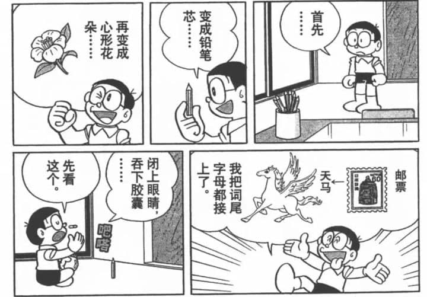

想象很美好，但实际上……

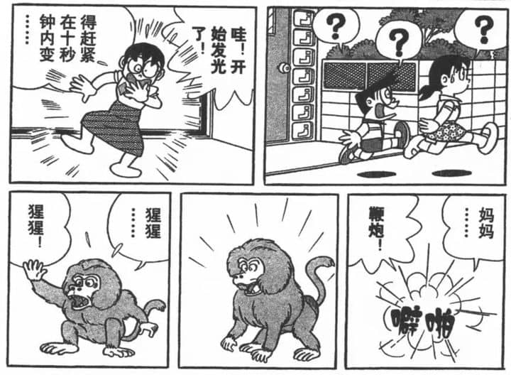

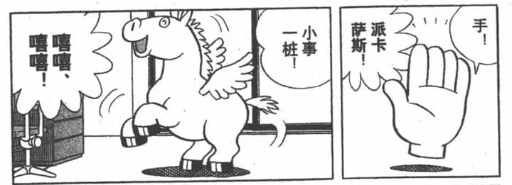

接下来，野比在静子家门口等得太久了，又要变成别的东西之后再变成天马，他是这么变的：

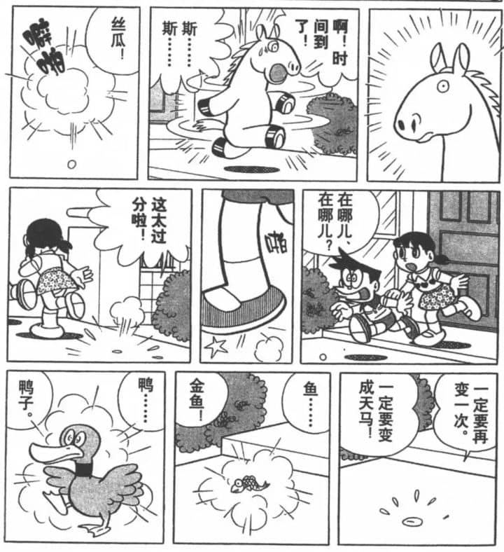

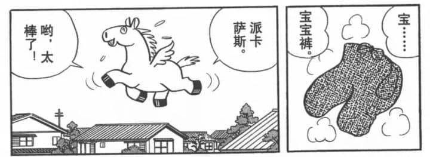

说实话，这个翻译让我完全看不懂，他和「词语接龙」一点儿关系都没有，除了从「铅笔芯」到「心形花朵」，从「派格萨斯」到「丝瓜」，这里哪个词接龙了？

而且我也没看出来这个变出来的东西到底哪里像丝瓜了……

  

这个版本和我印象中看到的也不一样。为了确认，我又找到了台湾翻译的繁体版本，同样的情节是这样的：

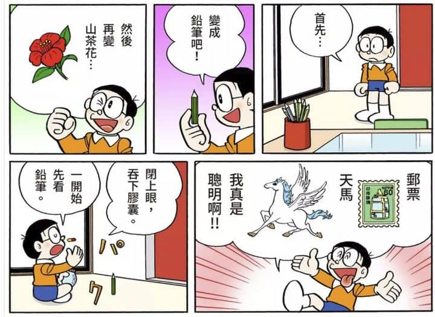

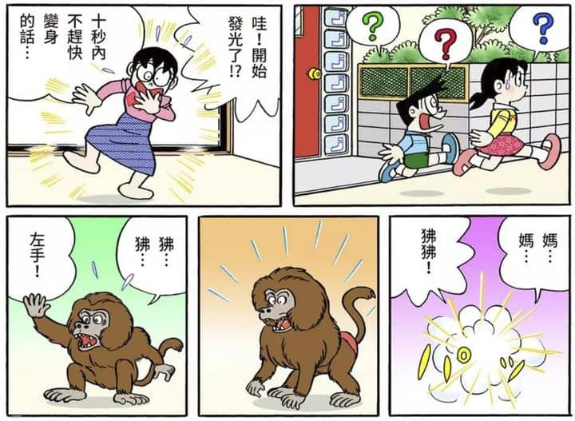

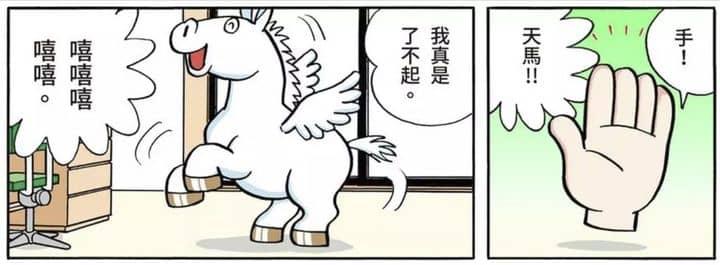

以及这个：

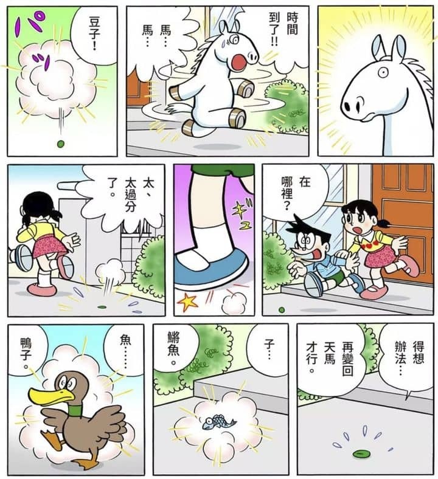

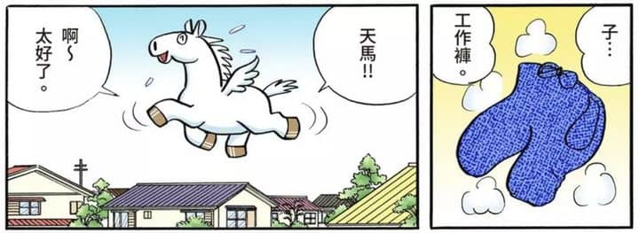

这个版本里面，「狒狒」到「左手」这一段，从动作上我可以知道他是想这么变的；吉林美术出版社的「丝瓜」，在这里原来是「豆子」，这里也能看懂了。

但其他的部分，一样完全看不懂。

看不懂其实是正常的，因为毕竟原文是日语，比如「狒狒」到「左手」到「天马」，就是hihi到hidarite到tenba，而且作者的原画放在这里了，改动起来也很不容易。

  

但是我总是感觉，20多年前，我第一次读到人民美术出版社的《机器猫》时，是完全没有这种看不懂的感觉的。于是今天我从书柜里拿出了老版本的机器猫，翻到这个故事看，是这样的：

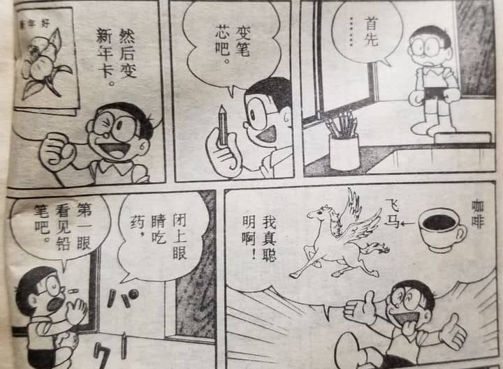

从笔芯，到新年卡，到咖啡，再到飞马。

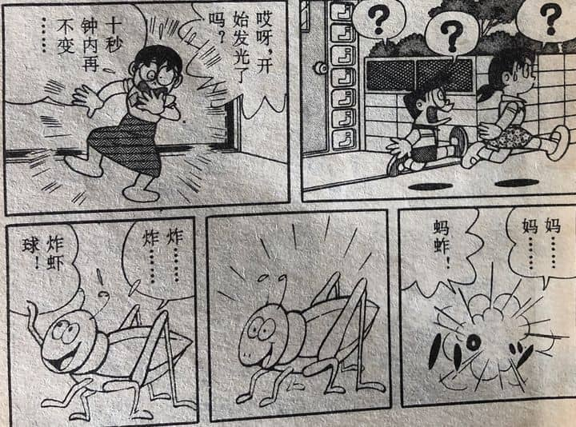

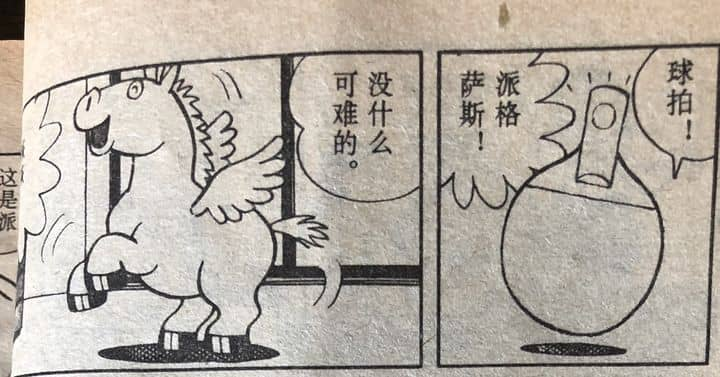

下一个情节是这样：

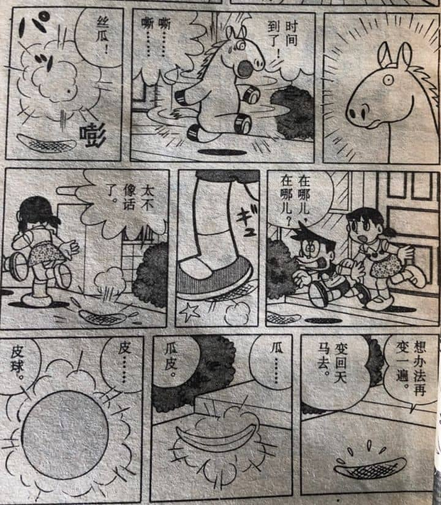

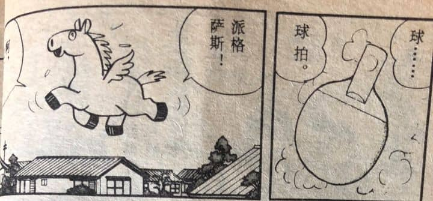

看到这里，我几乎掉下泪来。

笔芯——新年卡——咖啡——飞马

妈妈——蚂蚱——炸虾球——球拍——派格萨斯

派格萨斯——丝瓜（这个翻译甚至影响了后来的吉林美术出版社）——瓜皮——皮球——球拍——派格萨斯

人民美术出版社的前辈，为了让当时的小朋友能看懂机器猫，挖空心思想出了这样毫无违和感的翻译，更让人感动的是，为了配合这个翻译，他们连画面都重新画了。

咖啡、蚂蚱、球拍、皮球……全都是重新画出来的。

你能在《机器猫》别的情节里面看到这么有童趣，这么好玩儿的蚂蚱吗？

在这个故事的最后一段，是一个非常出彩的部分，野比变成派格萨斯之后，想要变回去，却怎么都变不回去，最后变成了恐龙。

台湾的繁体版本是这么画的：

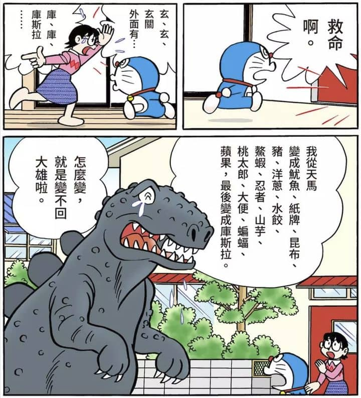

虽然看不懂，但好歹知道「哦哦这之前是日语」，然后表示理解就可以了。

吉林美术出版社是这样翻译的：

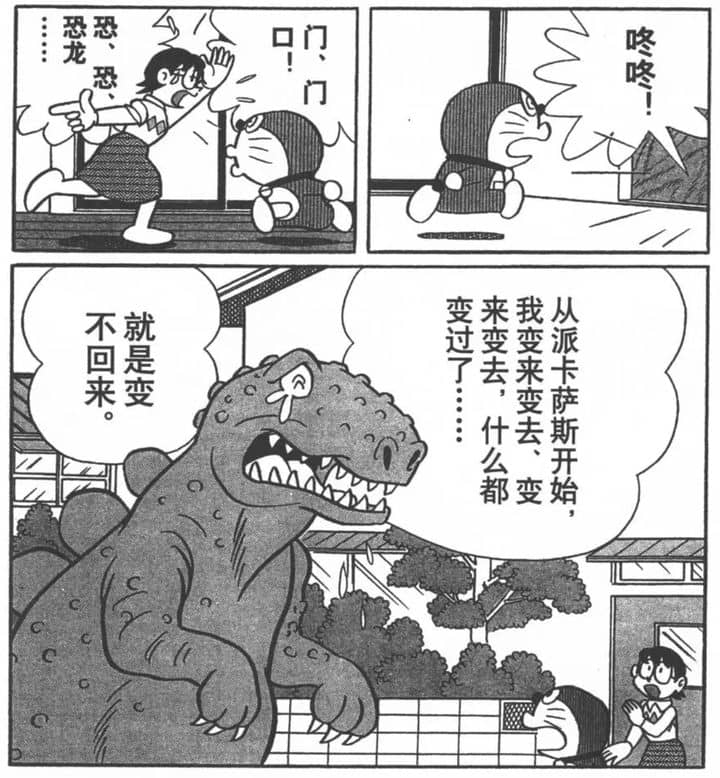

无比偷懒，根本就放弃了这段翻译。

而人民美术出版社，是这样翻译的：

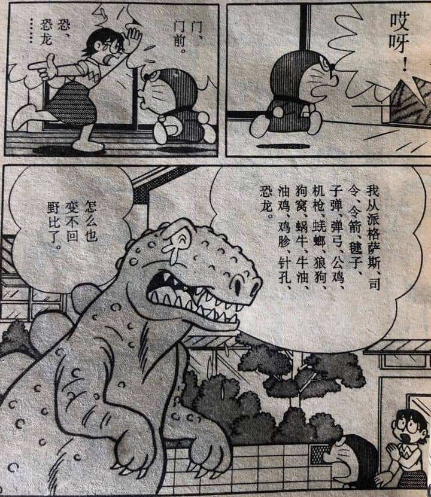

想想看，要用和日语完全没关系的汉字，既要表现「变来变去」的次数，又要从派格萨斯变成恐龙，难度有多大。

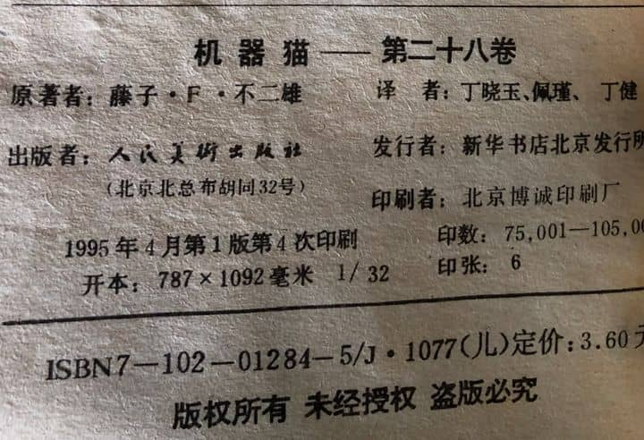

向人民美术出版社的丁晓玉老师、佩瑾老师和丁健老师致敬，你们为每一个《机器猫》的小读者们，贡献了最最棒的翻译。
