## 前言
第一部分为游戏推荐。大多数游戏为本人玩过觉得值得推荐的，部分为网友们的补充。**受本人经验，口味，精力等各方面因素限制，本文不可能收录所有优秀游戏。**特别是本人老游戏玩得比较少，且其他答案珠玉在前，实在做不了太好的推荐，在这里先抱歉了。本文目的仅为做一个自己的微小的总结，给新玩家们一些帮助。**注意，本文游戏顺序不分先后，标号仅为计数之用。**

第二部分为正版游戏商店介绍，注意事项和我的一些话。不感兴趣的可以跳过。注意，文中的游戏我都建议大家支持正版，购买正版不仅可以减少不必要的麻烦，还是对游戏业的支持。

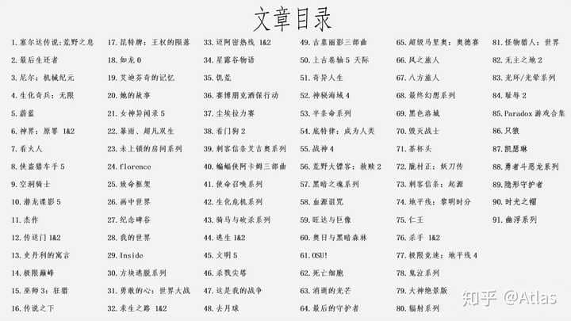

请点开大图查阅目录，手机端请查看原图。为照顾排版，部分游戏名字有修改。

  

  
## 游戏推荐
**1.塞尔达传说：荒野之息（The Legend of Zelda: Breath of the Wild）**

平台：NS、WiiU

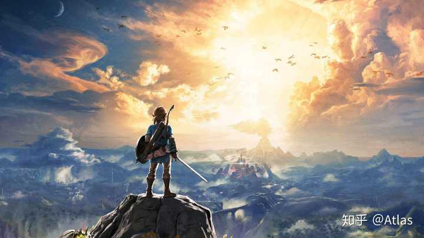

最近通关的一款游戏，剧情其实是很老套的勇者打败恶魔拯救公主的故事，它的亮点在于游戏性。游戏提供了百余个神庙解谜，近千个收集要素，毫无保留的开放世界。游戏的物理系统真实，画面卡通却不幼稚，战斗易于上手却不缺乏深度。开放世界后期体验重复的通病在这款游戏上完全不见踪影，从始至终充满了惊喜。毫不夸张的说，这款游戏定义了开放世界新的标准，玩完这款游戏对别的游戏也许会有新的看法。适合于喜欢探索和解谜的玩家。

  

**2.最后生还者/美国末日（The Last of Us）**

平台：PS4、PS3

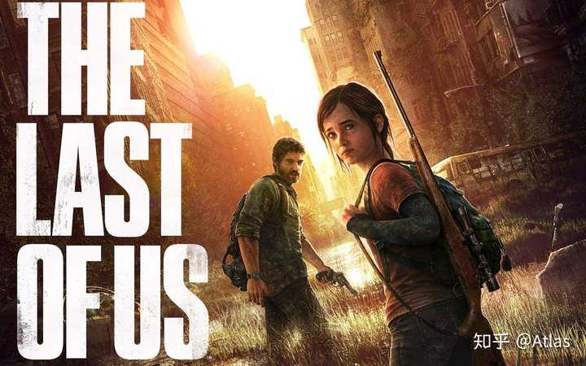

在末世中，人性才更显光辉。乔尔和艾莉两位主人公在僵尸末世中相识相熟，再逐渐产生胜似“父女”的感情，玩家也在这段跌宕起伏的冒险历程中陪伴两人成长。优秀的线性体验，自然的引导，真实的环境氛围渲染，使得本作上升到了神作的高度。PS3时代的作品，PS4高清重置。最近发售的part 2拉胯了，对于我来说，这款游戏只有part 1，没有part 2。

  

**3.尼尔：机械纪元（NieR:Automata）**

平台：PS4、PC、XBOX ONE

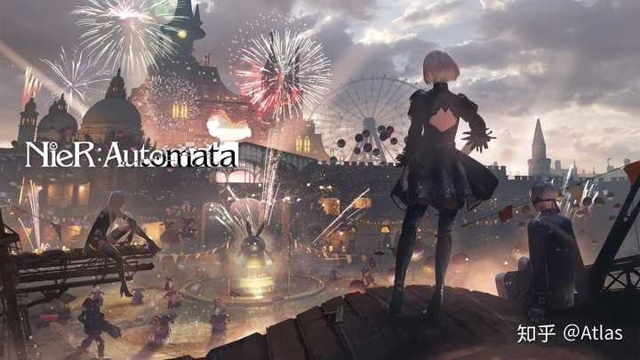

女主人公的靓丽身影使得本作成了一时的话题之作。其实抛开胸和臀，本作的剧情、配乐和系统都是十分的优秀，可谓始于颜值，忠于内在。游戏讲述了在被摧毁的地球上，人造人部队同外星机械生命体之间的战争故事。多主人公多周目才能体验全部剧情，虽说有一定的偷工减料，但也可以说游戏制作人将有限的资源玩到了极致，时常令人惊呼原来游戏还能这么玩的？本作的战斗系统十分优秀。玩惯了模式化的大作，可以尝试下这款游戏，画面虽说算不上出众，但有些地方真的刷新了原有的观念，有不少的新鲜感。可谓缺点优点都很突出的佳作。另，发行商SE有反向打折等神奇操作，请注意。

  

**4.生化奇兵：无限（BioShock Infinite）**

平台：PC、XBOX 360、PS3

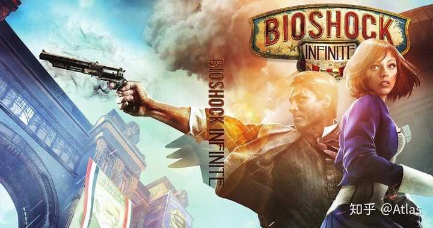

被无数人誉为代表“第九艺术”的游戏。游戏讲述了玩家在天空之城“哥伦比亚”同女主人公伊丽莎白的冒险故事。本作的剧情略微有点复杂，但在理顺后只能大呼神作。游戏对于天空之城“哥伦比亚”的刻画可以说上升到了艺术品的高度。女主人公的AI设计也经过足够的考虑打磨，能令玩家产生陪伴感。生化奇兵系列前作也相当出色，但恐怖氛围更甚，同样也是十分推荐游玩的。

  

**5.蔚蓝（Celeste）**

平台：PC、NS、PS4、Xbox One

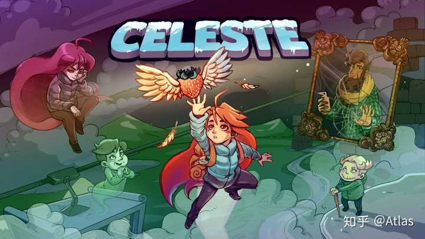

横版平台跳跃游戏。游戏具有不小的难度，但又不至于令人绝望，难度曲线控制十分合理，场景设计也很精妙，关卡难度随玩家自身技术的提升而提升，失败了大不了多试几次，只要有毅力，最终一定能登上山顶。另一方面，游戏剧情探讨了个人心理或是心理疾病，对玩家的心理成长有一定作用的。本作可以推荐给对平台跳跃游戏感到恐惧的玩家，是平台跳跃类游戏的集大成之作。

  

**6.[神界：原罪](https://www.zhihu.com/search?q=%E7%A5%9E%E7%95%8C%EF%BC%9A%E5%8E%9F%E7%BD%AA&search_source=Entity&hybrid_search_source=Entity&hybrid_search_extra=%7B%22sourceType%22%3A%22answer%22%2C%22sourceId%22%3A589663455%7D)、神界：原罪2（Divinity: Original Sin、Divinity: Original Sin 2）**

平台：PC、PS4、XBOX ONE

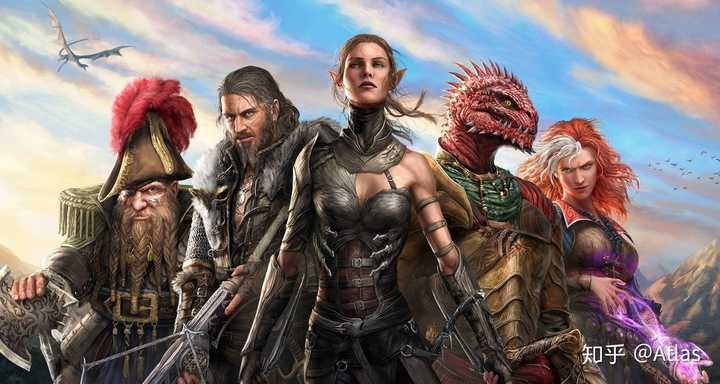

开放选择的角色扮演游戏。NPC的生杀，战斗的进行方式，剧情的推进进度都可由玩家自主选择。游戏使用类战棋的俯视角进行，玩家需要运用场景、技能、元素和道具实现战斗和解谜，内容十分充足，轻松花去几十个小时的时间。但如同同类游戏，本游戏的任务系统缺乏引导，使得探索难度较高，可以适当结合攻略游玩。

  

**7.看火人（Firewatch）**

平台：PC、PS4、NS

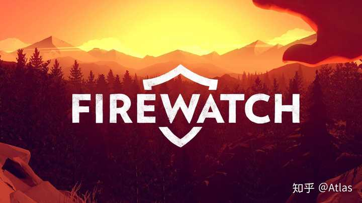

小品级步行模拟器，主要讲述两个护林员之间的故事。游戏的画风十分清新舒服，令人不时感叹自然的美好，使人对这样的生活心生向往。游戏全程玩家都不能见到女主人公的身影，只有从对讲机中温柔的声音才能感受到她的陪伴。护林员的冒险当然称不上史诗，但充满温情。游戏的流程不长，适合闲下来体验不一样的感受。本作的素质可能没有像文中其他游戏那样出众，但确实给了我独特的体验，所以我还是列了出来。

  

**8.侠盗猎车手5（Grand Theft Auto V）**

平台：PS3、XBOX 360、PS4、XBOX ONE、PC

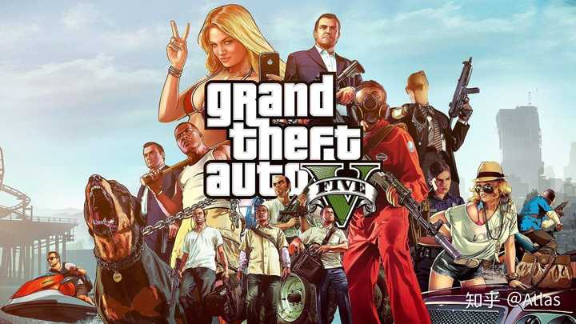

大名鼎鼎的GTA5。最初是于13年发行的游戏，时至今日steam销量榜上还常常有他的身影，以如今的眼光，这款游戏仍然没有一点落伍。简单来说，这是玩家扮演三名种族背景不同的角色在洛圣都烧杀抢夺的故事。玩游戏就是为了体验现实中体验不到的生活和感情，在这座充满活力的城市中，金钱、暴力和兄弟情义交织在一起，为我们带来震撼的游戏体验。

  

**9.空洞骑士（Hollow Knight）**

平台：PC、NS、XBOX、PS4

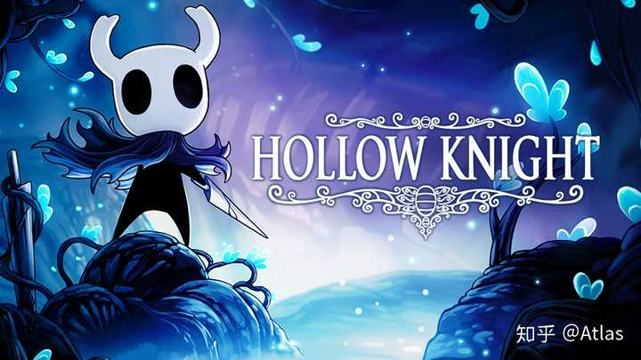

横版动作冒险游戏，画风清新，内容却十分硬核，远超一般独立游戏的水准。游戏以可爱的画风描绘了一段发生在虫子王国中的传奇故事。剧情部分如同黑暗之魂，玩家需要从细节处还原真实的游戏故事。本作游玩难度不低，系统扎实，一旦适应，便会沉迷在探索中无法自拔。没有玩过这类游戏的玩家可以尝试下，路痴建议配合攻略食用。补一条，制作组公布了大黄蜂小姐姐的个人新作预告，不是DLC，是一部新作哦，可自行搜索丝线之歌/丝与歌（Silksong），超赞！

  

**10.潜龙谍影5/合金装备5（Metal Gear Solid V）**

平台：PS3、PS4、XBOX 360、XBOX ONE、PC

潜龙谍影5由两个游戏，序章原爆点（Ground Zeroes）和正章幻痛（The Phantom Pain）组成，推荐打包购买。开放世界潜入游戏，解决问题的方式由玩家自己决定，拥有极大的自由度。剧情精彩且有深度，讨论哲学、人性、战争与和平，这也使得本作遭致一些争议。可惜的是本作的剧情明显遭到阉割，缺少最终章蝇之国度，但瑕不掩瑜。感兴趣的玩家可以至少尝试下序章原爆点。系列前作也都是十分优秀，创造了一段段神话，若玩完本作仍然意犹未尽，十分推荐游玩。

  

**11.杰作（Opus Magnum）**

平台：PC

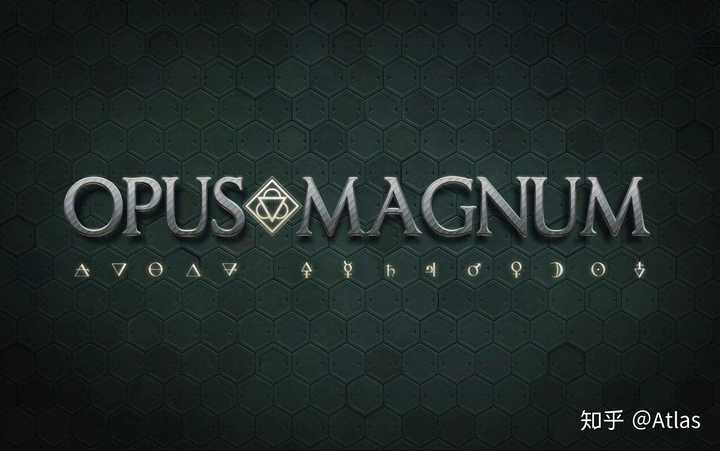

使用各种给定零件实现自动化生产的游戏。游戏画面精致复古。为实现速度快、省钱、体积小地生产炼金产品，往往需要绞尽玩家的脑汁。不同玩家往往能有完全不一样的思路。推荐给喜欢解谜动脑筋的玩家。

  

**12.传送门1&2（Portal、Portal 2）**

平台：XBOX 360、PS3、PC

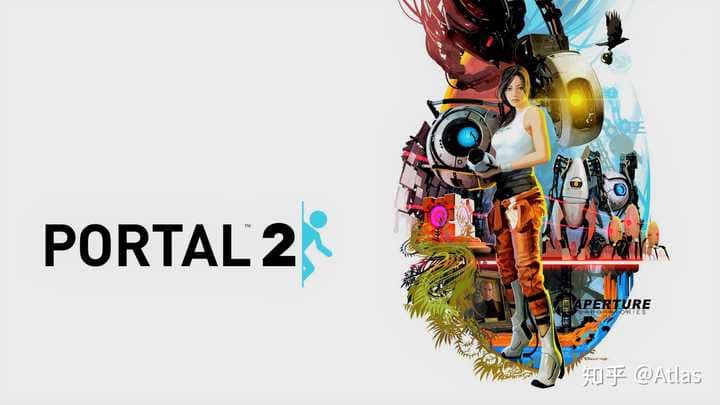

解谜游戏。游戏将两点传送门这个概念玩出了花，谜题设计巧妙，让人大呼过瘾，搭配上无处不在的搞笑元素，实在是不可多得的佳作。这款游戏还能两人联机，合作闯关，别有一番风味。玩家自行制作的地图也为游戏续命一波。

  

**13.[史丹利的寓言](https://www.zhihu.com/search?q=%E5%8F%B2%E4%B8%B9%E5%88%A9%E7%9A%84%E5%AF%93%E8%A8%80&search_source=Entity&hybrid_search_source=Entity&hybrid_search_extra=%7B%22sourceType%22%3A%22answer%22%2C%22sourceId%22%3A589663455%7D)（The Stanley Parable）**

平台：PC

不像游戏的游戏，讨论游戏的游戏。游戏中一位神经兮兮的话痨旁白引导玩家游戏，服从或是反抗他的指挥会带来不一样的结果，指向不一样的结局，也暗示了现实游戏中玩家只能按照游戏制作人设定好的剧本前行。玩完这款游戏，能对游戏这一概念有一点自己的思考。

  

**14.极限巅峰（Steep）**

平台：PC、XBOX ONE、PS4

雪上极限运动游戏。虽然游戏只提供了几种游玩方式，但各具特色趣味十足的挑战还是能轻松耗去几十个小时。游戏中的山脉在现实中均有对应，现实中受于条件限制的我们终于也能探索这美丽的自然。购买dlc，你甚至还能参加冬奥会为国争光。反正我玩完这款游戏是燃起了对滑雪的极大兴趣。需要注意的是，这款单机游戏需要全程联网，而育碧为这款游戏提供的网络服务不太稳定，可能需要加速器帮助。

  

**15.巫师3：狂猎（The Witcher 3: Wild Hunt）**

平台：PC、XBOX ONE、PS4

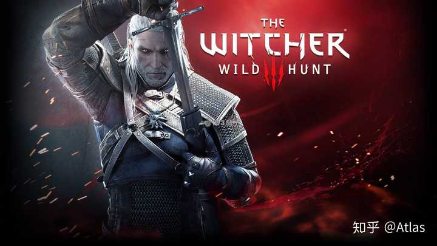

讲述了白狼杰洛特和命运之子希里之间的冒险故事，为角色扮演动作游戏。剧情宏大有深度，系统优秀易于上手但不至于单调，任务多变有趣引人深思，角色形象丰满讨喜，地图宏伟广大，内容扎实有料，真的是怎么夸都不够。各种意义上的集大成之作，强烈推荐。游戏开发商波兰蠢驴更是时不时取消限时原价的活动，看准时机入手年度版不会错的。

  

**16.传说之下（Undertale）**

平台：PC、PS4、PSV、NS

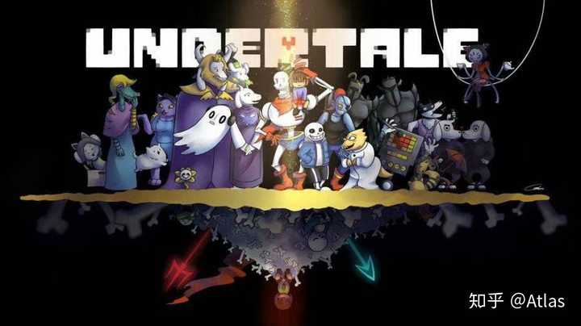

剧情佳作。讲述了一个小孩在地下怪物世界中的冒险故事。这款游戏为像素风，第一眼看上去并不讨喜，然而他的核心亮点在于剧情，能时不时给人的惊喜和感动。玩家不同的通关方式能展开不同的游戏剧情，保证了本作拥有很高的重玩价值。喜欢剧情的玩家请不要因为画面而错过了这款佳作。

  

**17.巫师之昆特牌：王权的陨落（Thronebreaker: The Witcher Tales）**

平台：PC、PS4、XBOX ONE

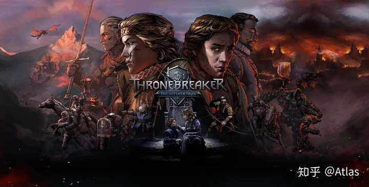

熟悉波兰蠢驴的玩家肯定知道，他们做的卡牌游戏怎么可能只是简单的卡牌游戏呢？他们为巫师3中的小游戏昆特牌单独做了一个RPG游戏，是的，一个完完整整，游玩时间在30h以上的RPG游戏。游戏是以俯视角操纵进行，战斗和解谜都是昆特牌。制作组精心设计每一场战斗和解谜，把这个简单的比大小的卡牌游戏玩出了花。是本人非常推荐的一款卡牌游戏，对一般卡牌游戏无爱的玩家也可以尝试下。

  

**18.如龙0（Yakuza 0）**

平台：PC、PS3、PS4

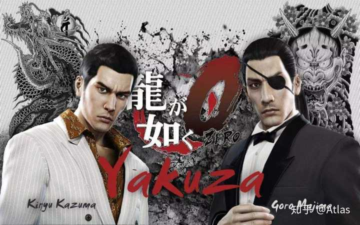

讲述了在一个时代的终结，“堂岛之龙”桐生一马和“嶋野狂犬”真岛吾朗传奇开始的故事。剧情优秀，男人的道义与利益的冲突令人热血沸腾。游戏可玩内容超级丰富，你可以上一秒在仇人老家拳脚无情，下一秒在神室町载歌载舞，还有四驱车、卡拉OK、麻将、棒球等等小游戏玩到爽，从各方面体验这纸醉金迷的时代。每名角色都有几种不同的战斗风格，炫酷帅气打击感十足。本作是如龙系列最推荐新玩家入手的一作。

  

**19.[艾迪芬奇](https://www.zhihu.com/search?q=%E8%89%BE%E8%BF%AA%E8%8A%AC%E5%A5%87&search_source=Entity&hybrid_search_source=Entity&hybrid_search_extra=%7B%22sourceType%22%3A%22answer%22%2C%22sourceId%22%3A589663455%7D)的记忆（What Remains of Edith Finch）**

平台：PC、PS4、XBOX ONE

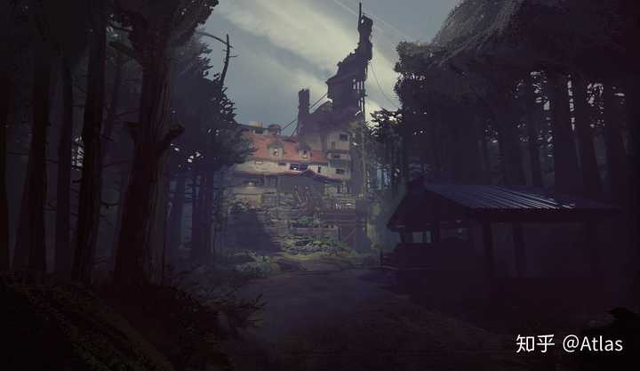

步行模拟器游戏，玩家以家族后人的视角探索老宅，探明这一大家子人死亡的原因。剧情优秀，每名家庭成员都有自己引人深思的故事。本作贡献了几段我觉得称得上年度最佳的游戏体验，尤其是切鱼小哥那段，十分惊艳。流程不长，推荐体验。

  

**20.她的故事（Her Story）**

平台：PC、IOS、Android

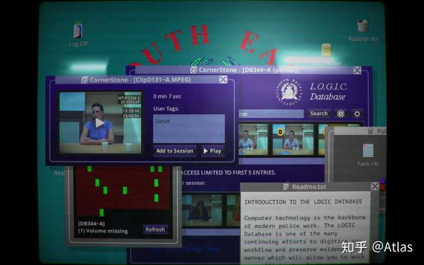

独一无二、富有新意的游玩方式，制作人将一段完整的审讯记录裁成小段，玩家需要通过每段视频中的关键词自行搜索相关视频，分析案情，最后得出真相。游戏对于汉化的支持不是很好，毕竟关键词搜索都是需要英文，建议有一定英语水平（六级左右足矣）的玩家游玩。

  

**21.女神异闻录5（Persona 5）**

平台：PS4、PS3

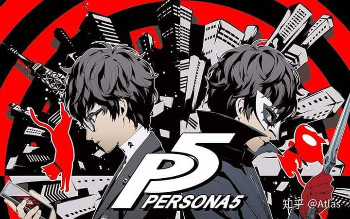

白天是高中生，晚上化身为怪盗拯救世界。剧情非常优秀，UI时髦度爆表，演出中二帅气，系统有趣，迷宫更是经过精心设计，符合每名罪人的心理。创造了一众经典饱满的游戏角色，在游戏过程中，这些虚拟角色仿佛也成了玩家自己的朋友。十分推荐尝试。犹豫的玩家可以看下同名番剧，番剧虽比不上游戏的高度和水平，但对于推广游戏确实发挥了一定的作用。

  

**22.暴雨、超凡双生（Heavy Rain、Beyond: Two Souls）**

平台：PS4、PS3

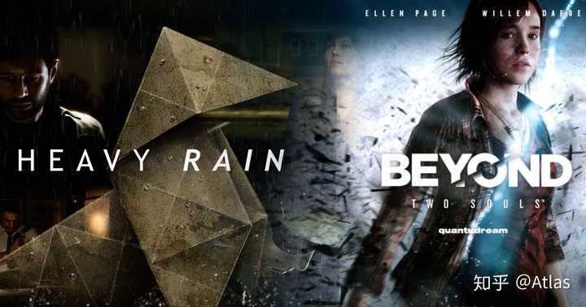

这是两款游戏，由于我当时是购买的是合集盘且两作同属一个开发商，便放到一起来讲。暴雨讲述了一个失去一切的父亲同折纸杀人魔“搏斗”，最终夺回儿子的故事。[超凡双生](https://www.zhihu.com/search?q=%E8%B6%85%E5%87%A1%E5%8F%8C%E7%94%9F&search_source=Entity&hybrid_search_source=Entity&hybrid_search_extra=%7B%22sourceType%22%3A%22answer%22%2C%22sourceId%22%3A589663455%7D)讲述了自幼便拥有沟通两个世界能力，身体中寄宿着两个灵魂的女主一生的故事。两款游戏皆为互动电影式游戏，游戏中很多细小的操作都需要玩家QTE操作，虽然繁琐，但一旦适应，便能带来无与伦比的浸入感。注意，像这样的游戏，按键是自己按下的还是别人按下的有很大的区别，因此非常不建议视频通关，请自己尝试。

  

**23.未上锁的房间系列（The Room）**

平台：IOS、Android、NS、PC

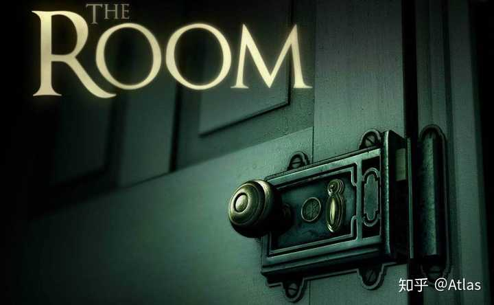

最初是在手机平台上接触的解谜游戏，现在已移植到各个平台。游戏中的解谜精致巧妙，直到现在还是会时不时翻出来再次游玩。我认为第一作是系列最优秀的，游戏全程只集中于一个小小的平台，却能带来丝毫不输于大空间的惊喜感。注：本人手机游戏玩得很少，但不可否认的是近几年手机平台也涌现出一批佳作，以后会有少量手机单机游戏更新。

  

**24.florence**

平台：IOS、Android

2018年TGA最佳移动游戏。游戏流程不算长，却用巧妙的方法将一个爱情与生活的故事娓娓道来，将一名少女在恋爱中的情感变化展现地淋漓尽致。玩惯了大作，闲下来不妨试试本作，相信一定能带来十分奇妙的体验。

  

**25.致命框架（FRAMED）**

平台：IOS、Android

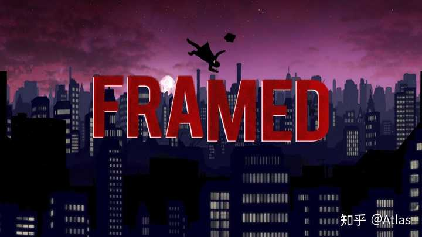

极具创意的一款手机解谜游戏，现已出到系列第二作。游戏中每个关卡都被分为几个漫画分镜格，每个分镜格独立却又有着相互的关联，玩家所要做的是发挥想象拖动格子，合理安排每个格子的顺序，最终让小人逃脱追捕。让人眼前一亮的佳作，十分推荐尝试。

  

**26.[画中世界](https://www.zhihu.com/search?q=%E7%94%BB%E4%B8%AD%E4%B8%96%E7%95%8C&search_source=Entity&hybrid_search_source=Entity&hybrid_search_extra=%7B%22sourceType%22%3A%22answer%22%2C%22sourceId%22%3A589663455%7D)（Gorogoa）**

平台：PC、IOS、Android、NS

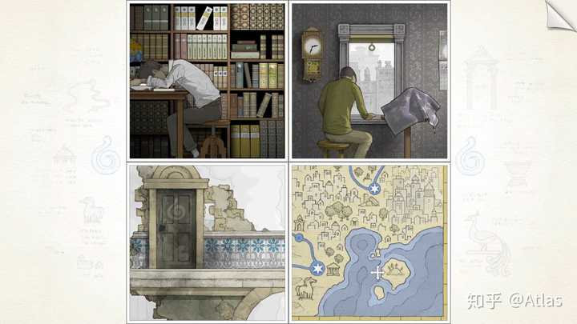

惊艳了无数人的解谜神作。游戏所有的精华都集中在四个小小的格子中，玩家需要拖动格子，让看似毫无关系的场景产生联系，最终一步步到达谜底。现在制作人终于放出了完整版，请一定试试宛如艺术品版的本作。

  

**27.纪念碑谷（Monument Valley）**

平台：IOS、Android

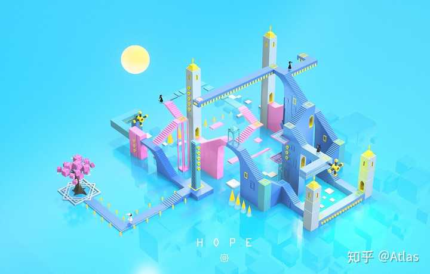

小清新的解谜游戏。游戏大量运用视觉欺骗技巧，引导玩家将“不可能”化为“可能”。游戏体验舒服却又不失挑战性。是犹如艺术品般的佳作。

  

**28.我的世界（Minecraft）**

平台：多平台

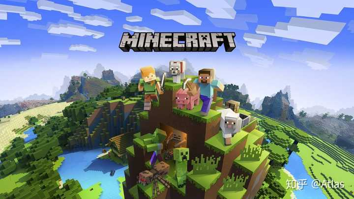

游戏史上销量第一的传奇游戏。游戏中的一切皆由方块构成，粗糙却拥有无穷的可能性。从火柴盒小农田，惧怕夜晚和怪物，到各式风格建筑，研究方块、红石和怪物特性，随着玩家的成长，这个世界也越来越接近世外桃源的模样。游戏并没有明确的目标限制，玩家需要自己指定计划、寻找目标，最终收获独一无二的乐趣和成就感。原版单机游戏玩厌了，还能载入大量玩家制作的mod和存档，加入光影水反改善画面，进入服务器同其他玩家一起游玩。推荐所有玩家尝试游玩，请给它一点时间，不要因为画质而迅速放弃。类似自由度推荐的还有2D游戏泰拉瑞亚（Terraria）、[星界边境](https://www.zhihu.com/search?q=%E6%98%9F%E7%95%8C%E8%BE%B9%E5%A2%83&search_source=Entity&hybrid_search_source=Entity&hybrid_search_extra=%7B%22sourceType%22%3A%22answer%22%2C%22sourceId%22%3A589663455%7D)（Starbound）等。

  

**29.Inside**

平台：PC、XBOX ONE、PS4、NS、IOS

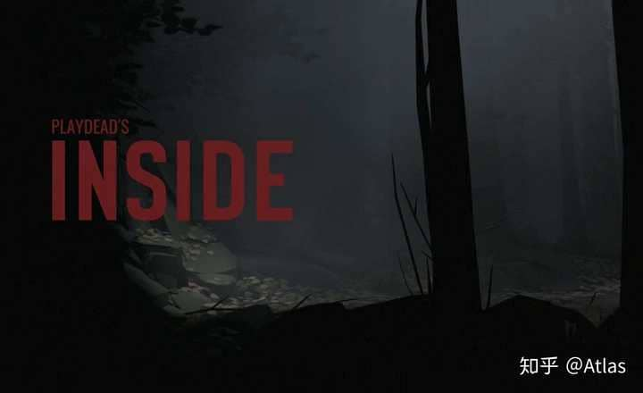

地狱边境（Limbo）开发商的新作。同地狱边境一样，游戏全程没有语言或文字描述，靠场景环境渲染出阴暗沉重的氛围，最后的结局引人深思。游玩体验流程舒服，解谜难度适中，是不可多得的佳作。另，地狱边境也十分推荐，游戏只使用黑白两色，阴暗沉重的氛围更甚。

  

**30.方块逃脱系列&锈湖系列（Cube Escape&Rusty Lake）**

平台：PC、IOS、Android

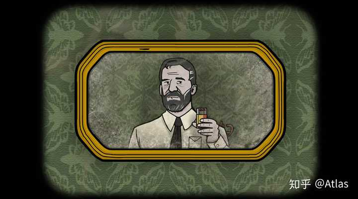

移动平台上优秀的解谜游戏。玩家需要在有限的空间内寻找各种道具，最终找到脱出的方法。画面虽为卡通风格，氛围却略显诡异。系列几作均有剧情上的联系，感兴趣的玩家可以搜索相关资料游玩。推荐的游玩顺序为:季节 (Seasons)、湖泊 (The Lake)、阿尔勒 (Arles)、哈维的盒子 (Harvey's Box)、23号案件 (Case 23)、磨坊 (The Mill)、[锈湖旅馆](https://www.zhihu.com/search?q=%E9%94%88%E6%B9%96%E6%97%85%E9%A6%86&search_source=Entity&hybrid_search_source=Entity&hybrid_search_extra=%7B%22sourceType%22%3A%22answer%22%2C%22sourceId%22%3A589663455%7D) (Hotel)、生日 (Birthday)、剧院 (Theatre)、根源 (Roots)、洞穴 (The Cave)、天堂岛 (Paradise)、悖论 (Paradox)。

  

**31.[勇敢的心：世界大战](https://www.zhihu.com/search?q=%E5%8B%87%E6%95%A2%E7%9A%84%E5%BF%83%EF%BC%9A%E4%B8%96%E7%95%8C%E5%A4%A7%E6%88%98&search_source=Entity&hybrid_search_source=Entity&hybrid_search_extra=%7B%22sourceType%22%3A%22answer%22%2C%22sourceId%22%3A589663455%7D)（Valiant Hearts: The Great War）**

平台：PC、PS3、PS4、NS、XBOX 360、XBOX ONE、IOS、Android

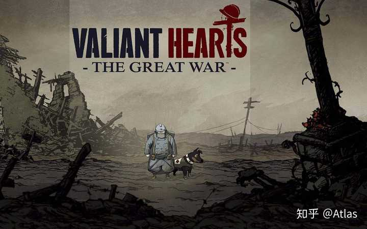

本作主要讲诉了在残忍无情的一战中，命运交织的几位士兵与一条忠犬的故事。游戏难能可贵地使用了2D手绘风格，既重现了战争的残酷，又高歌了人性的光芒。游戏结合解谜动作元素，不算困难的游玩体验中，玩家的心随着几位主角浮浮沉沉。是不可多得的剧情佳作，游戏流程不算长，但回味无穷。

  

**32.求生之路、求生之路2（Left 4 Dead、Left 4 Dead 2）**

平台：PC、Xbox360

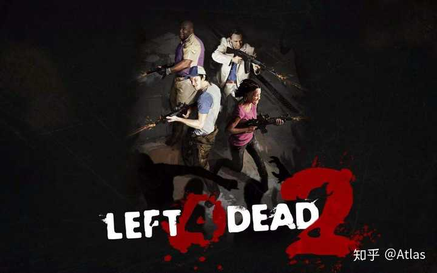

合作FPS游戏，玩家需要扮演一名幸存者同三名伙伴在丧尸潮中逃出生天。游戏基于起源引擎开发，射击手感和CS相近。游戏如潮的普通丧尸配合特殊感染者的方式，保证了游戏在爽快的同时具有一定的难度，需要玩家相互配合达成目标。玩家社区庞大，不时涌现质量极高的战役地图。十分推荐找三名小伙伴开黑玩耍。

  

**33.[迈阿密热线](https://www.zhihu.com/search?q=%E8%BF%88%E9%98%BF%E5%AF%86%E7%83%AD%E7%BA%BF&search_source=Entity&hybrid_search_source=Entity&hybrid_search_extra=%7B%22sourceType%22%3A%22answer%22%2C%22sourceId%22%3A589663455%7D)、迈阿密热线2（Hotline Miami、Hotline Miami 2: Wrong Number）**

平台：PC、PSV、PS4

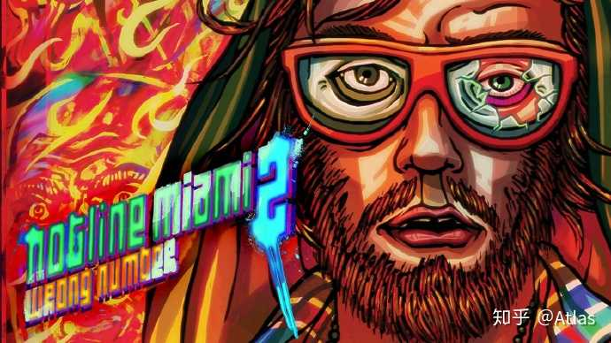

俯视角像素风动作游戏。玩家需要扮演一名有精神问题的杀手，闯入建筑刺杀热线指示的目标。虽为像素风游戏，游戏的血腥癫狂程度可一点也不输3D游戏。玩家需要灵活运用地形、掩体和敌人掉落的武器，杀光所有的人。由于敌人和玩家都是一击必死，游戏对于操作有一定的要求，同一张地图往往需要尝试多次才能达到完美帅气的刺杀。游戏体验十分爽快暴力，推荐给寻求发泄的玩家。

  

**34.[星露谷物语](https://www.zhihu.com/search?q=%E6%98%9F%E9%9C%B2%E8%B0%B7%E7%89%A9%E8%AF%AD&search_source=Entity&hybrid_search_source=Entity&hybrid_search_extra=%7B%22sourceType%22%3A%22answer%22%2C%22sourceId%22%3A589663455%7D)（Stardew Valley）**

平台：PC、PS4、XBox One、Switch、PS Vita

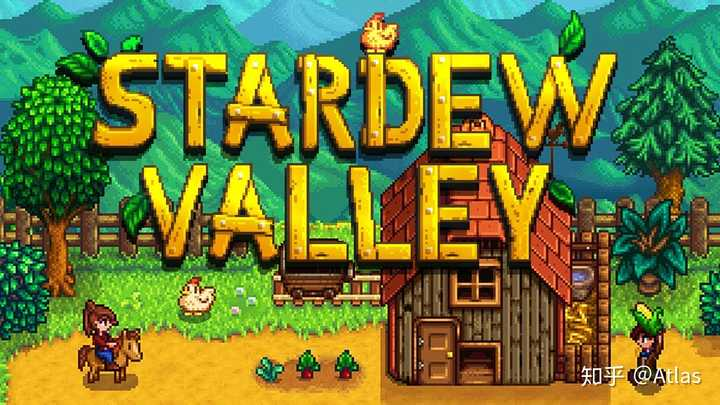

2D农场模拟游戏。主人公厌倦了机械的办公室生活，继承了爷爷留给他的一座农场，从此开始了爆肝的生活。在这座乡野小镇中，玩家可以种田、钓鱼、挖矿、打怪、和NPC发展关系，四季变化，天雨天晴，语言描述是空洞的，这种难能可贵质朴平静的感觉只能自己进入游戏体验。和Firewatch一样，我把这款游戏推荐给喜欢农场模拟游戏或想悠闲地体验不一样生活的玩家。

  

**35.饥荒（Don't Starve、Don't Starve Together）**

平台：PC、XBOX、PS4、NS、PSV、WiiU、IOS、Android

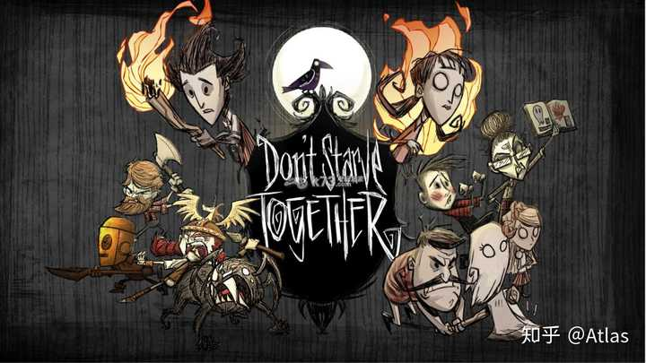

卡通画风的生存游戏。在这款游戏中，玩家需要收集资源，建造家园，打败怪物，在这片土地上存活下去。十分推荐和小伙伴一起游玩，快乐会翻倍的。游戏分为单机版和联机版，购买时需要注意区分。同时，本作的游戏开放组Klei的其他游戏也十分推荐，如缺氧（Oxygen Not Included）等游戏。

  

**36.VA-11 HALL-A:[赛博朋克酒保行动](https://www.zhihu.com/search?q=%E8%B5%9B%E5%8D%9A%E6%9C%8B%E5%85%8B%E9%85%92%E4%BF%9D%E8%A1%8C%E5%8A%A8&search_source=Entity&hybrid_search_source=Entity&hybrid_search_extra=%7B%22sourceType%22%3A%22answer%22%2C%22sourceId%22%3A589663455%7D)（VA-11 Hall-A: Cyberpunk Bartender Action）**

平台：PC、PS4

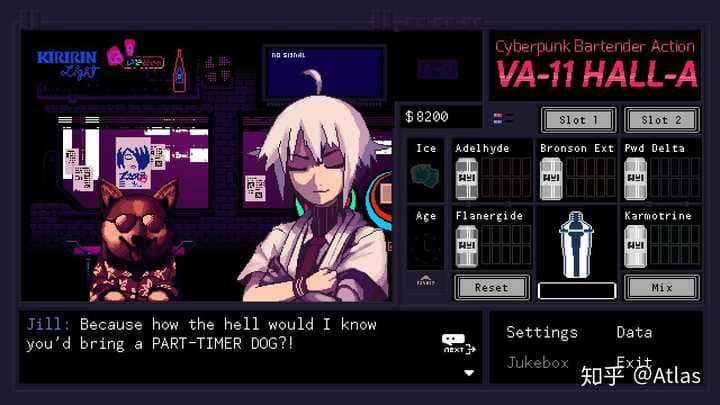

文字冒险游戏。提起赛博朋克，我们首先想到的会是高科技低生活，大公司垄断或永远下不停的雨那样的事物，由于赛博朋克阴郁黑暗的内核使得这种题材生来就适合探讨人性哲学等话题，近年来也涌现了一大批佳作。在本作中，玩家将扮演一名小小的酒保，所要做的工作就是为上门的客户调酒。本作做的极佳的一点在于这个世界的塑造，虽然玩家只能往返于酒吧和自宅两地，但从客人的只言片语，网络上的新闻，我们能还原出一个生动的赛博朋克城市，以旁观者的视角体会一段段耐人寻味的故事。适合静下心来游玩的佳作。

  

**37.[尘埃拉力赛](https://www.zhihu.com/search?q=%E5%B0%98%E5%9F%83%E6%8B%89%E5%8A%9B%E8%B5%9B&search_source=Entity&hybrid_search_source=Entity&hybrid_search_extra=%7B%22sourceType%22%3A%22answer%22%2C%22sourceId%22%3A589663455%7D)（Dirt Rally）**

平台：PC、PS4、XBOX ONE、PS3、XBOX 360

拉力赛拟真赛车游戏。注意，本游戏及其硬核，有赛车界的黑魂之称。本作收录了几十辆老至上世纪六七十年代，新至时下热门的车辆，更有地形气候完全不同的欧洲赛道和几种具有深度的游戏模式供玩家游玩。本作的驾驶手感十分出色，无论是路况还是赛车的故障，都能清晰地反馈给玩家。本作十分拟真，推荐使用游戏方向盘体验，建议开始先熟悉赛道减少碰撞，接着再想怎样提速。最后，引用电影《头文字D》中的一句台词，“赛车场？还是山路好玩。”

  

**38.看门狗2（Watch\_Dogs 2）**

平台：PC、PS4、XBOX ONE

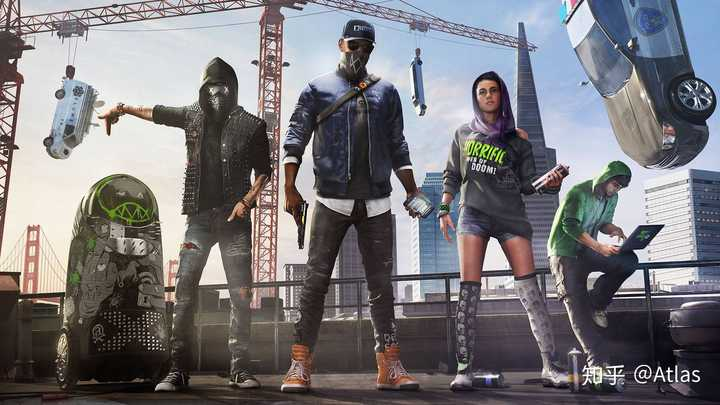

黑客主题的开放世界游戏。在这款游戏中，玩家需要扮演黑人小哥马可仕，与个性分明的伙伴们共同对抗互联网巨头。游戏用轻松愉快地氛围展开故事，很贴近现实，但其实已很有赛博朋克的感觉了。游戏本身素质不错，虽然仍然是育碧公式化沙盒世界，或许比不上前文推荐的如塞尔达传说、侠盗猎车手，但还是十分推荐游玩的。

  

**39.刺客信条 艾吉奥三部曲（Assassin's Creed II、Brotherhood、Revelations）**

平台：PS3、PS4、XBOX ONE、XBOX 360、PC

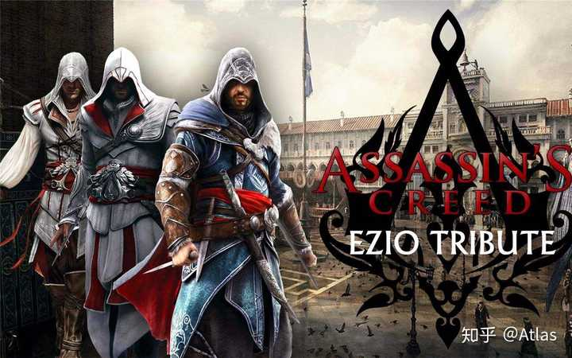

三部游戏讲述了艾吉奥继承父亲刺客的使命并为其报仇，最终成长为一位伟大刺客导师的故事。10年前的游戏，系统画面已略显落后，但这段传奇故事却是一直闪耀着光芒。另，系列其他作，如黑旗（Black Flag）等也十分推荐游玩，具体内容可自行搜索，系列最新两作起源（Origins）和奥德赛（Odyssey）由于与前作有较大不同，下文有单独的推荐。

  

**40.蝙蝠侠 [阿卡姆](https://www.zhihu.com/search?q=%E9%98%BF%E5%8D%A1%E5%A7%86&search_source=Entity&hybrid_search_source=Entity&hybrid_search_extra=%7B%22sourceType%22%3A%22answer%22%2C%22sourceId%22%3A589663455%7D)三部曲（Batman: Arkham Asylum & Arkham City & Arkham Knight）**

平台:PC、PS3、PS4、XBOX ONE、XBOX 360

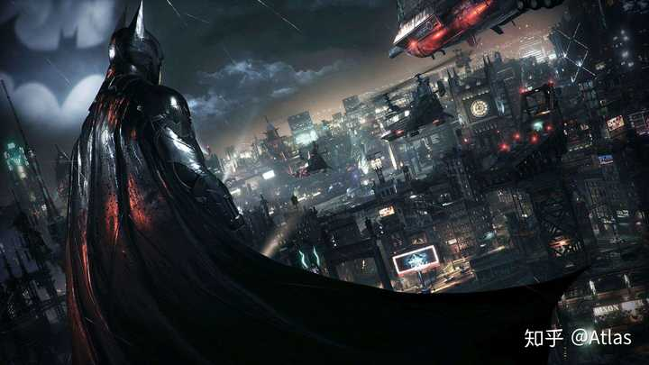

老爷及各位充满魅力的反派角色齐聚一堂，不必多说，自然击中了粉丝们的心。系列游戏开发商可不干拿版权随便做游戏赚粉丝钱的事，他们在系列作中付出了十足的心血，逐渐完善的游戏系统和剧情安排演出，使得系列作当之无愧最优秀的漫改游戏系列称号。强烈推荐。

  

**41.使命召唤系列（Call of Duty）**

平台：PC、PS3、PS4、XBOX ONE、XBOX 360

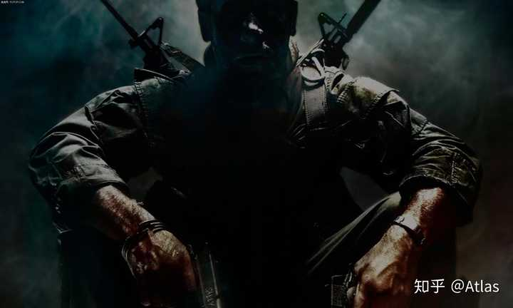

小时候玩过了黑色行动和现代战争最初几部，剧情演出给与了当时的我极大的震撼，某种程度上可以算是我射击游戏的启蒙之作。但接下来的几部越来越科幻，不是很合我的胃口。系列最新作回归二战题材，有空我应该会去尝试下。

  

**42.生化危机系列（Resident Evil）**

平台：多平台

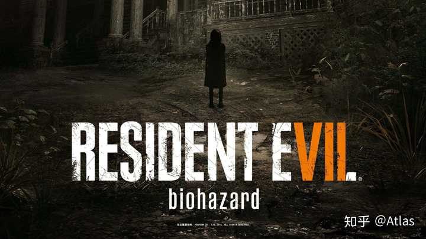

生化危机系列在游戏界中一直有着很高的地位，系列几作以对恐怖环境的刻画而闻名于世。本人由于对恐怖游戏接受不能而没有太多尝试，喜欢恐怖游戏的玩家不要错过。最近生化危机2重制版发售，480p的蟑螂变成了4k的蟑螂，恐怖爱好者不要错过。

  

**43.骑马与砍杀系列（Mount & Blade）**

平台：PC

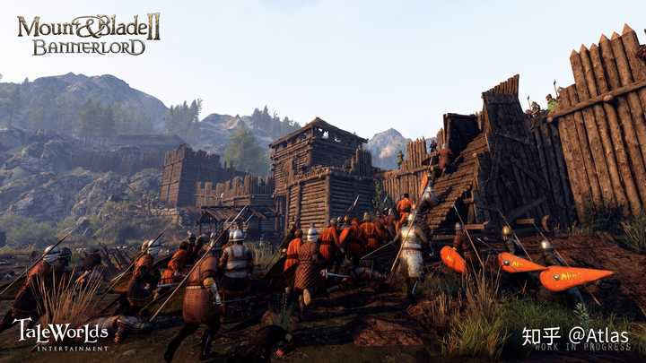

这是一款策略与动作角色扮演的游戏。游戏的动作系统朴实而有趣，四个方向的攻击格挡能带来真实的刀刃相接之感，熟练之后真能把自己带入古时名将，在敌阵中杀个七进七出；宏观来看，玩家需要招兵买马，提升自己的军队实力，也需要关心粮食物价等，扮演好一名指挥官的角色，与各方势力周旋。目前骑砍2已经发售，虽然还是未完成品，但已十分好玩，接受不了上代画面可以试试这作。本作推荐给热爱历史，渴望带兵打仗建功立业的玩家；还在犹豫的，可以先去看看《冰海战记》之类的影视作品，代入其中会非常有趣。

  

**44.逃生1&2（Outlast、Outlast 2）**

平台：PC、NS、XBOX

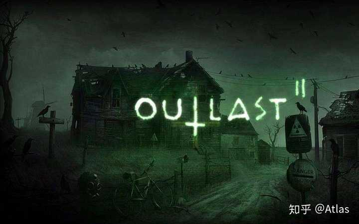

近年来十分优秀的恐怖游戏新秀，讲述了一名记者对于离奇事件和邪恶实验真相的探索故事。由于玩家扮演的不是身怀神力或手持机枪的家伙，而只是一位需要为相机电量担心的普通记者，游戏给予玩家的压迫感和无力感更甚，更能令人感受到切身的恐怖。玩家口碑优秀，受到恐怖游戏爱好者一致好评。注，官方甚至推出了纸尿裤产品，真是贴心呢。

  

**45.文明5（Sid Meier's Civilization V）**

平台：PC

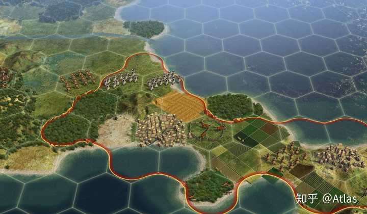

战争策略游戏，玩家需要操纵一个文明发展壮大，攻城掠地，最终通过几种方式征服世界。游戏画面算不上优秀，系统十分硬核扎实，经得起琢磨。官方经过一段时间的更新和DLC发售，游戏已趋于完善，玩家社区十分壮大。唯一需要注意的是本作超级杀时间，下一回合按钮是有毒的。另，在一系列更新和DLC发行后，文明6完成度已十分不错，感兴趣的可以试试。。

  

**46.[杀戮尖塔](https://www.zhihu.com/search?q=%E6%9D%80%E6%88%AE%E5%B0%96%E5%A1%94&search_source=Entity&hybrid_search_source=Entity&hybrid_search_extra=%7B%22sourceType%22%3A%22answer%22%2C%22sourceId%22%3A589663455%7D)（Slay the Spire）**

平台：PC

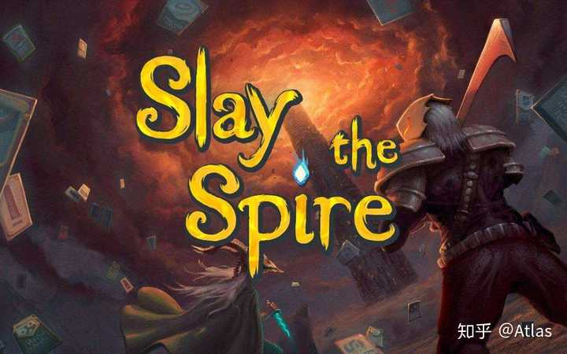

近年很火的爬塔卡牌游戏。每一局游戏都是独一无二的体验，每次爬塔都是不同的牌组构筑过程。大量的敌人，道具，宝箱和奇遇，使得游戏充满了随机性。个人沉迷了一段时间，但多局游戏过后游玩体验偏向重复。感兴趣的玩家可以尝试下，每局游戏时间适中，适合在空闲时打发时间。

  

**47.这是我的战争（This War of Mine）**

平台：PC、NS、IOS、Android

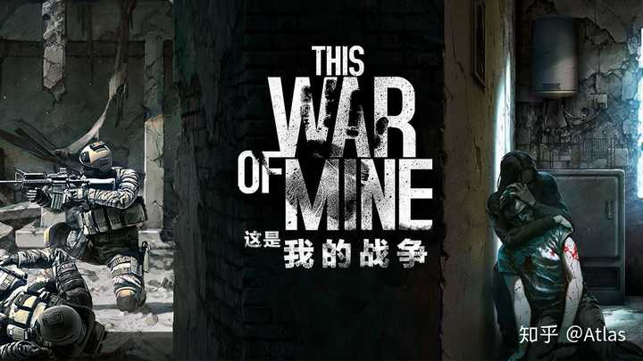

在这款游戏中，我们扮演的不是自带主角光环的英雄，而是每一场战争真正的受害者——平民，我们需要分配有限的资源和药品，在道德和人性的问题前做出抉择，因此本作的基调十分沉重的。希望玩家们都能玩玩本作，了解认识到战争的残酷，体会到现今我们的和平是多么的珍贵。

  

**48.去月球（To the Moon）**

平台：PC、IOS、Android

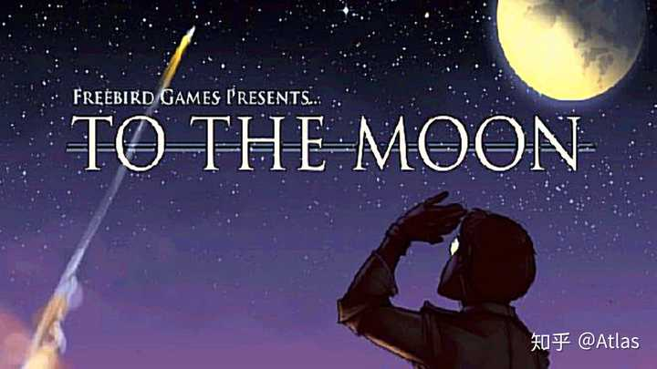

“十分感人的一款游戏”，这是玩过本作的玩家的一致评价。讲述了两位博士为使约翰尼·威尔士死后不留遗憾，使用机器改变他的记忆的故事。游戏流程不长，但剧情非常优秀，我在此不多做剧透，请各位玩家都去尝试看看。

  

**49.古墓丽影三部曲（Tomb Raider、Rise of the Tomb Raider、Shadow of the Tomb Raider）**

平台：多平台

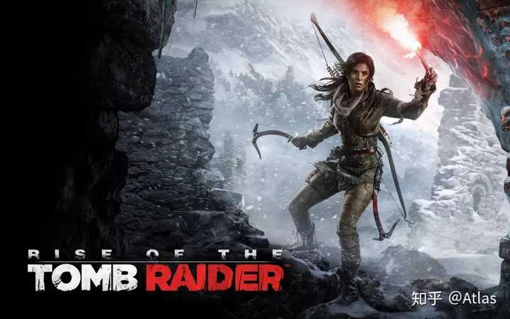

古墓丽影重启三部曲从零开始，讲述了劳拉从一个青涩的小丫头成长为经验丰富的拆迁专家的故事。古墓丽影系列最初几作其实是把“以性感女性为主角”作为卖点，劳拉很大程度上是给玩家送福利的存在，这对于塑造游戏角色是非常不利的。重启三部曲将目光聚集在劳拉自身的经历和她的成长上，使这位经典的角色形象更加扎实真实。如果你对劳拉的传奇冒险故事感兴趣，那就赶快去玩吧。

  

**50.上古卷轴5 天际（The Elder Scrolls V: Skyrim）**

平台：PC、PS3、XBOX360、PS4、Xbox One、NS

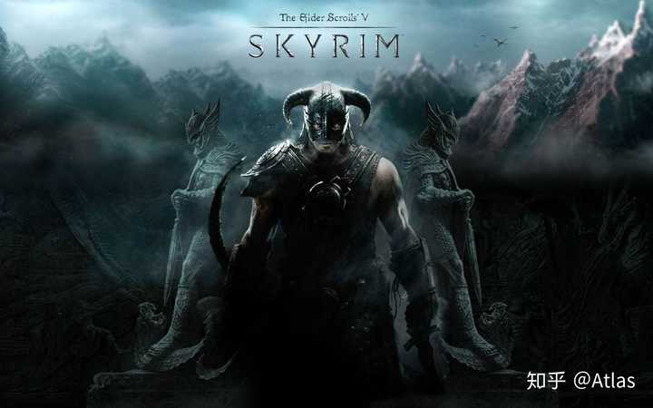

十分出名的一作，各大榜单的常客，明明距离发售已经超过了七年，游戏却还是拥有不低的人气。玩家社区十分庞大，时不时会有优秀mod涌现。B社炒了几次冷饭，却还是没有修复一些致命bug，他们把问题全交给玩家解决了。游戏本体就是个内容庞大的优秀RPG动作游戏，但想要玩得爽，有必要要装各种补丁、mod。网上已有先行者们放出了mod合集包，大大简化了游玩前的配置过程，十分感谢他们。

  

**51.奇异人生（Life is Strange）**

平台：XBOX ONE、PS4、XBOX360、PS3、PC

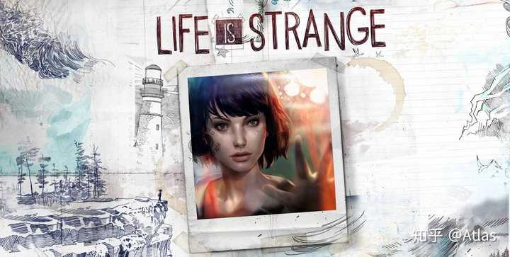

剧情十分优秀的游戏，目前2代已经开始发售。游戏像是美剧剧集一样分章节发售，讲述了拥有时间倒流能力的女主和她所处小镇发生的故事。另，除开本作外，系列游戏已发行前传风暴前夕（Before the Storm），建议先游玩本体再玩前作，注意，游戏的论坛、评测等地方有剧透的风险。最新作（Life is Strange 2）还没放出全部章节，不做评价。感兴趣的玩家也可以尝试同一开发商的预告性质免费游戏超能队长（The Awesome Adventures of Captain Spirit）。

  

**52.[神秘海域4：盗贼末路](https://www.zhihu.com/search?q=%E7%A5%9E%E7%A7%98%E6%B5%B7%E5%9F%9F4%EF%BC%9A%E7%9B%97%E8%B4%BC%E6%9C%AB%E8%B7%AF&search_source=Entity&hybrid_search_source=Entity&hybrid_search_extra=%7B%22sourceType%22%3A%22answer%22%2C%22sourceId%22%3A589663455%7D)（Uncharted 4: A Thief's End）**

平台：PS4

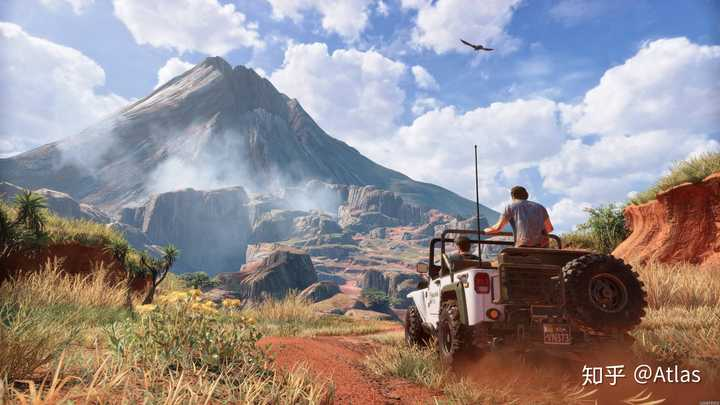

是同古墓丽影一样类型的拆迁游戏，不同之处在于本作是完全的线性游戏，制作组是技术力更为优秀的顽皮狗，因此游戏在画面、细节、表现力和剧情上都十分优秀。本作是系列主人公德雷克的金盆洗手之作。想要爽玩游戏的玩家可以尝试下，若还是意犹未尽，那等什么呢，快去玩前作啊。

  

**53.半条命/半衰期系列（Half-Life）**

平台：多平台

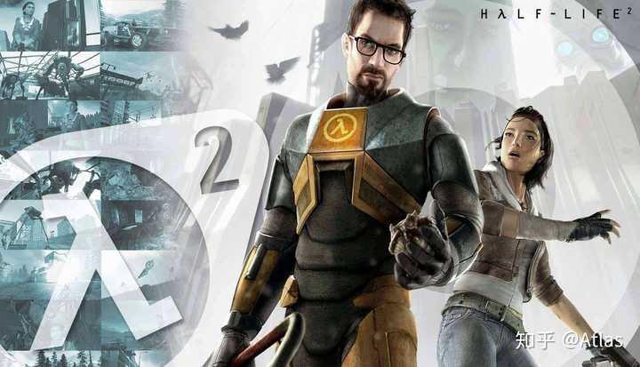

十分经典的游戏系列，同时也是一个游戏时代的开创者。经典的物理学圣剑撬棍的梗就出自这个系列。由于年代比较久远，画质系统上有这样那样的缺点，但某些时候还是能惊艳到我的。对于游戏历史感兴趣的玩家可以尝试本作。

  

**54.底特律：成为人类（Detroit: Become Human）**

平台：PS4、PC

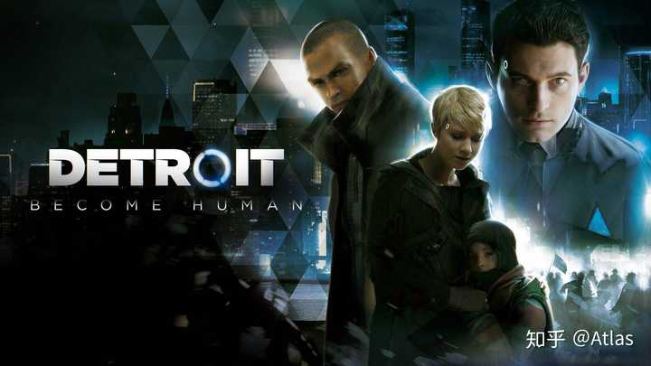

和暴雨，超凡双生出自同一家公司，是同类的互动电影式游戏。剧情讲述了人工智能发达的底特律，人造人们为取得人权而抗争的故事。制作组技术力十分优秀，演出逼真细致，很多时候几可乱真。再提醒一次，此类游戏，不建议视频通关，按键是不是自己按下去的有很大差别。

  

**55.战神4（God of War）**

平台：PS4

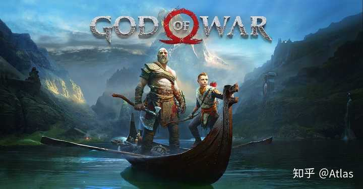

角色扮演动作游戏，荣获2018年TGA最佳年度游戏、最佳动作冒险游戏、最佳游戏指导。游戏的画面观感优秀，更是创新性的使用了一镜到底的长镜头叙事手法。一镜到底实现的难度在此就不赘述，单就它带来的收益就值得制作组花费的心思。本作的英文名并没有数字编号，代表着系列的重启，而战神系列也确实到了不变则亡的境地。新战神以出色的游戏素质，收获了玩家媒体们的赞誉，仿佛在向游戏界大声宣告，那个男人回来了。

  

**56.荒野大镖客：救赎2（Red Dead: Redemption Ⅱ）**

平台：PS4、XBOX ONE、PC

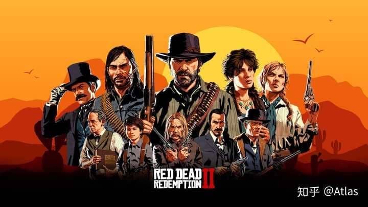

R星出品的开放世界角色扮演游戏，荣获2018年TGA最佳音效设计，最佳配乐/音乐，最佳叙事游戏。游戏发生在十九世纪末，二十世纪初的美国西部，玩家将扮演亚瑟摩根在这片土地上展开冒险故事。游戏的画面观感极佳，R星投入了大量精力在游戏细节上，只为还原最真实的美国西部，美术风格相比前作更加偏向写实。若是对电影中萧瑟的美国西部和潇洒的牛仔心生向往，那找到这部游戏你算是来对了。

  

**57.黑暗之魂系列（Dark Souls）**

平台：多平台

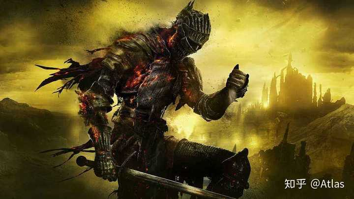

受苦神作，以高难度，高死亡惩罚闻名于世，甚至开创了新的游戏类型“魂系游戏”。剧情晦涩深邃，至今仍有魂学家在道具简介中寻找世界的真相。系统优秀扎实硬核，每种武器都有自己的武器系统，属于难入门难精通的游戏，高难度的游戏能带来高反馈，这款游戏中击败强敌的成就感是其他游戏所不能给的。游戏舞台有种诡异的美感，压抑，却又在细节处展现曾经的辉煌。这类游戏强调玩家成长胜于角色成长，只有克服心理的恐惧，才能品味到烈酒的醇香。

  

**58.血源诅咒（Bloodborne）**

平台：PS4

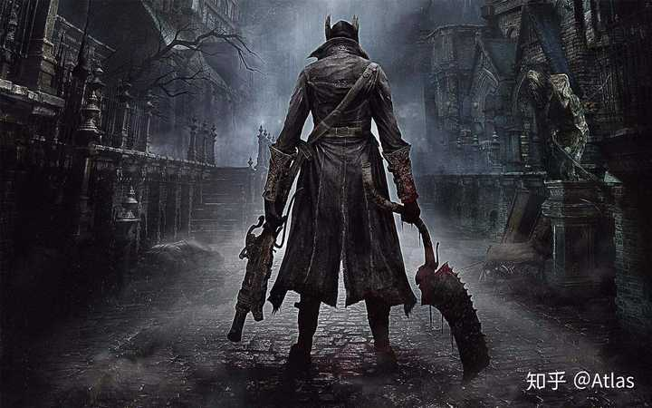

和黑暗之魂来自同一个制作组，同样出自宫崎英高之手，当然是一样的味道。玩家需要扮演一名为求医而进入亚楠的冒险者。本作的场景氛围渲染更甚于黑暗之魂，压抑阴暗的氛围，厚重的哥特式建筑，一股绝望的气息扑面而来。本作质量极高，喜欢高难度游戏、受苦的玩家不要错过。

  

**59.旺达与巨像（Shadow of the Colossus）**

平台：PS4

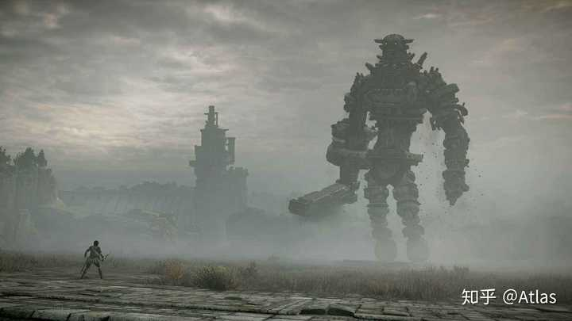

角色扮演动作游戏，最近发布了重置版，又将人们的目光聚焦回了这款神作。男主人公为了拯救少女的灵魂，不惜拔剑同巨像们搏斗，玩家们将扮演男主人公，踏上这场艰苦之旅。游戏着重渲染了这个世界的荒凉和孤独，为少年的征程再添一分悲壮。16头巨像，16场史诗级的战斗，最后留在玩家心中的是久久不能散去的感动和震撼。

  

**60.奥日与黑暗森林（Ori and the Blind Forest）**

平台：PC、XBOX ONE

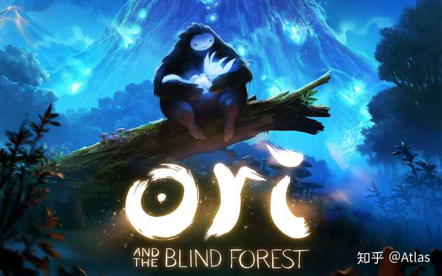

横版动作冒险游戏。画风清新美丽，随手截屏都可做壁纸。剧情优秀，十分感人。但对我个人而言，它的动作系统略微有点拖泥带水，很多地方过不去不是因为手残，而是“不安定”的动作系统的锅。除此之外，这是一款优秀的游戏，也是一款难度不低的游戏。若是能克服操作的不适应和关卡的高难度，定能收获一段美好的回忆。

  

**61.OSU!**

平台：PC

经典的音乐游戏，至今仍有不俗的玩家热度。玩家需要操纵光标按特定的轨迹按钮行动达成高分，游戏谱面由流行歌曲或ACG歌曲制成，难度不低。对音乐游戏感兴趣的玩家可以尝试尝试。另，我音乐游戏玩得不多，这里再稍稍推荐几个，古树旋律（deemo）、音乐世界（Cytus）。

  

**62.死亡细胞（Dead Cells）**

平台：PC、NS、PS4、XBOX ONE

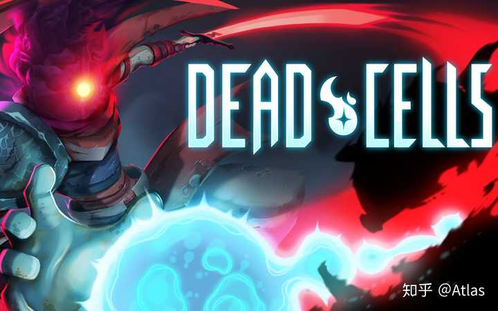

Roguelite类横版动作游戏，加入了类银河战士恶魔城的元素。游戏荣获2018年TGA最佳动作游戏，除手感扎实的动作系统外，游戏加入了上百种武器道具，使玩家闯关能有丰富的战术变化。初期的游玩体验还是十分受苦的，等到重要物品得到升级，熟悉了各种怪物的攻击套路，玩家感受到的就是爽快的打击系统和精致时髦的画面带来的优质体验。唯一的缺点也是很多独立游戏的通病，是游戏“新鲜”流程比较短。游戏有近二十个地图，但其中不少是boss战，大地图虽是随机生成的，但在死亡重来或是多周目游玩几次后新鲜感会有所降低。总的来说，这是一款十分优秀的小品游戏，非常推荐玩家们游玩。

  

**63.消逝的光芒（Dying Light）**

平台：PC、XBOX ONE、PS4

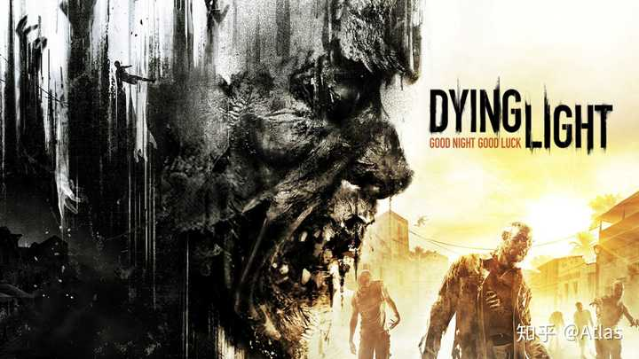

游戏将僵尸末世和跑酷结合起来，配以不错的剧情和系统，使得本作成了十足的佳作。白天黑夜不同的敌人强度，为游戏增添了恐怖紧迫的氛围。长时间的更新和DLC发布，已使得本作游戏内容非常充实，非常推荐游玩。

  

**64.食人的大鹫/最后的守护者（The Last Guardian）**

平台：PS4

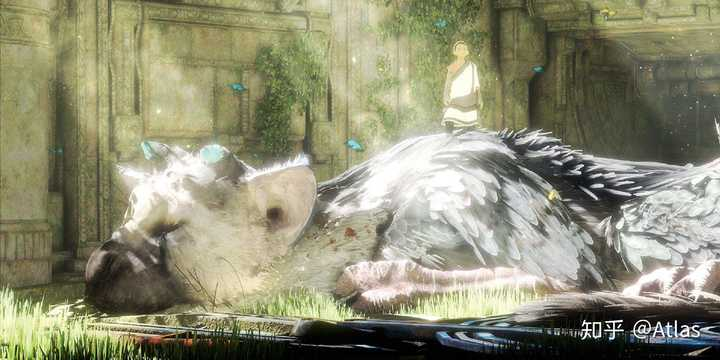

游戏讲述了男孩与神奇生物大鹫之间的故事。玩家需要扮演小男孩以同大鹫合作解谜的方式推动游戏发展。本作的解谜不算困难，但时常由于大鹫过于智能的AI而受到阻碍，在游戏的前期时常有无奈和想退游的冲动，但随着游戏的进行，玩家和大鹫的默契度越来越高，游玩体验也越来越流畅，也使得玩家越来越舍不得这只呆呆的巨兽。在现实中自己养有宠物的玩家肯定对游戏中少年和大鹫的情感深有体会。本作同《旺达与巨像》一样是十分挑人的游戏。

  

**65.超级马里奥：奥德赛（Super Mario Odyssey）**

平台：NS

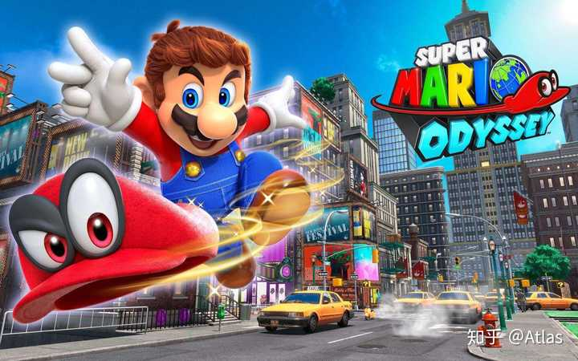

马里奥系列一直拥有超高的人气和口碑，本作的推出更是将粉丝们的心推向了更高潮。游戏中玩家不仅可以操纵马里奥，还加入了控制帽子+帽子附身的玩法，让玩家们在精心设计的箱庭关卡中自由探索。同《塞尔达传说：荒野之息》一样，属于NS必入游戏。

  

**66.风之旅人（Journey）**

平台：PSN、PS3、PS4

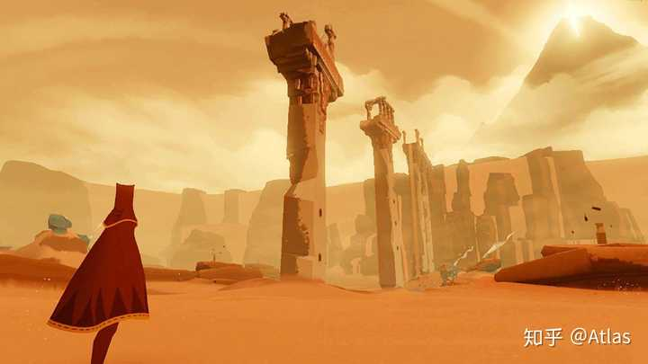

游戏“第九艺术”的又一大代表。游戏中玩家扮演身着披风的旅人，展开一场穿越沙漠的绝妙之旅。简洁的技能、难度适中的解谜、偶尔出现的同行者的身影都在尽力令玩家享受这一场优雅的旅程。游戏的场景设计十分优秀，明暗变化时常带来耳目一新的感觉。有条件的玩家请一定尝试下。

  

**67.八方旅人/歧路旅人（Octopath Traveler）**

平台：NS、PC

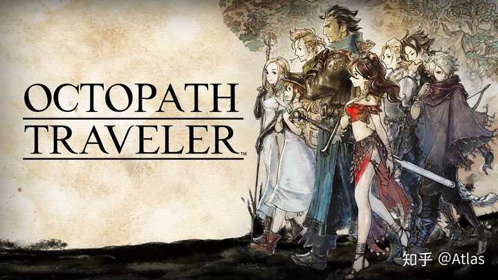

角色扮演游戏。这款像素风游戏第一眼吸引我的，正是那奇特优雅的画风。角色们都是2D的，而场景却是像素风格的3D世界，在虚幻4引擎加持下，这个低像素的世界显得那么真实。玩家可以操纵8位角色，每位角色都有各自富有新意的剧情。游戏的战斗系统杰出且有深度。这款复古而又新颖的游戏，实在不可错过。游戏目前支持中文，十分建议体验。

  

**68.最终幻想系列（Final Fantasy）**

平台：多平台

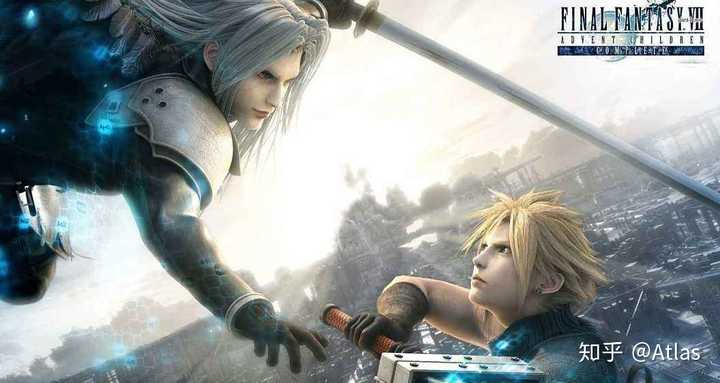

最终幻想系列被很多人誉为JRPG界的王者，是日本游戏界的一块金字招牌。系列游戏创造了太多太多的神话传奇和经典人物，由于牵扯内容太多，在这里就不赘述，感兴趣的玩家请自行搜索相关资料。最终幻想系列中不少作品真正达到了载入史册的高度，是确确实实的不玩会很遗憾的作品。

  

**69.黑色洛城（L.A. Noire）**

平台：PC、XBOX 360、XBOX ONE、PS4、NS

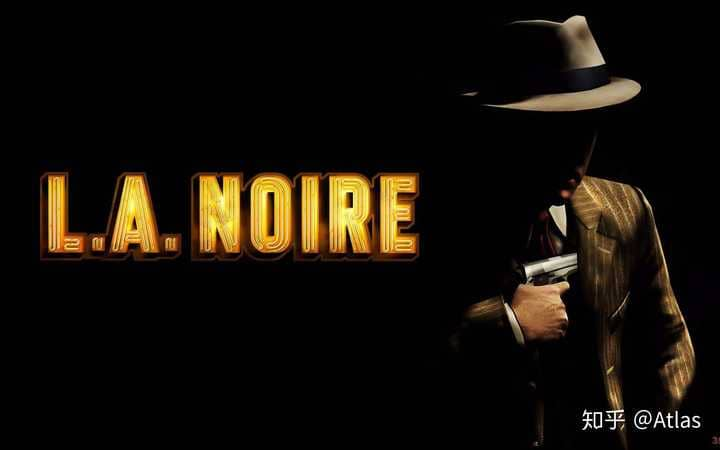

R星出品的一款经典的侦探类游戏。玩家需要扮演一名刑警，在疑云重重的洛杉矶寻找真相。游戏运用当时先进的面部捕捉技术，生动的还原了人物们的表情心理，即使放到现今，也依旧使人惊艳。游戏中的案件许多都有现实案件作为依据，玩家们需要从各种看似毫无联系的证据线索推理出真相。喜欢侦探类游戏的玩家请一定不要错过。

  

**70.毁灭战士（DOOM）**

平台：XBOX ONE、PS4、PC、NS

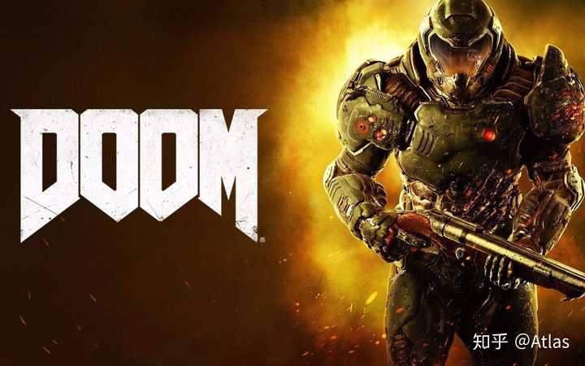

DOOM的初代曾是整个FPS游戏的老祖宗，而现今，它带着别具一格的运动化射击体验强势归来。游戏的突出特点就是爽快，无论是精心设计的场景还是千锤百炼的射击手感，全都是为其服务。现今的FPS游戏同质化越来越严重，而本作回归射击的本质反而显得与众不同。无论是射击游戏爱好者，还是心情正处在低谷寻求发泄的人士都十分推荐尝试。注意，本作游戏画面血腥且运动较快，可能引起某些人的不适，请在确认身体状况后游玩。

  

**71.茶杯头（Cuphead）**

平台：PC、XBOX ONE、NS

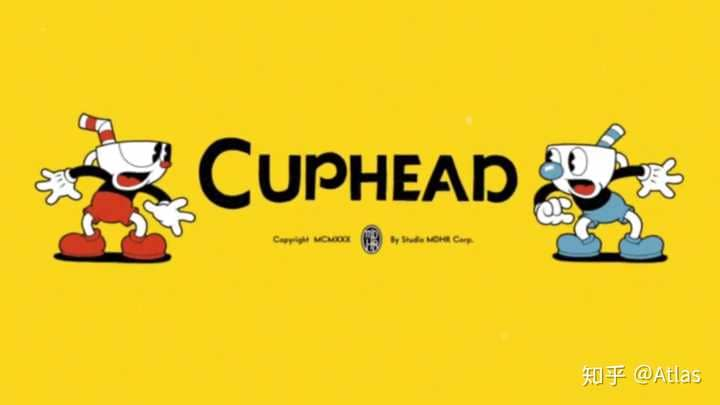

这是一款以BOSS对战为主要形式的2D横版动作游戏。制作人受上世纪橡皮管动画影响，游戏中每一帧都是由手工根据上世纪笨重的动画制作流程绘制，配乐也皆为充满戏剧感的爵士乐，一切的一切只为再现当年的辉煌和向经典致敬。游戏的画风在一众游戏中显得新颖少见，但可不要以为他只是卖情怀的作品。游戏的难度很高，十分考验玩家的操作，同样的，玩家的敌人——BOSS们各具特色，喜感十足，制作组也花大力气刻画这些可爱又迷人的反派们。若是没有被游戏的难度劝退，定能收获独一无二的游戏体验。

  

**72.胧村正：妖刀传（Oboro Muramasa: The Demon Blade）**

平台：Wii、PSV

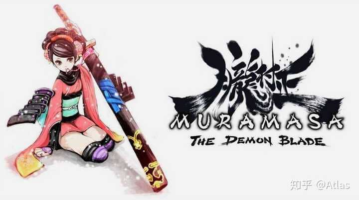

动作角色扮演游戏。玩家可以扮演逃忍或公主体验不同的剧情，收集失落的妖刀。游戏的动作系统扎实有深度，剧情节奏明快，最令人叫绝的要属那浮世绘般唯美的画风，着实在一众游戏中脱颖而出。另，游戏的开发组香草社可谓是游戏界的艺术家，致力于将2D游戏推向极致，感兴趣的玩家可以关注他们的作品，品质也都十分出色。

  

**73.刺客信条：起源（Assassin's Creed Origins）**

平台：PC、XBOX ONE、PS4

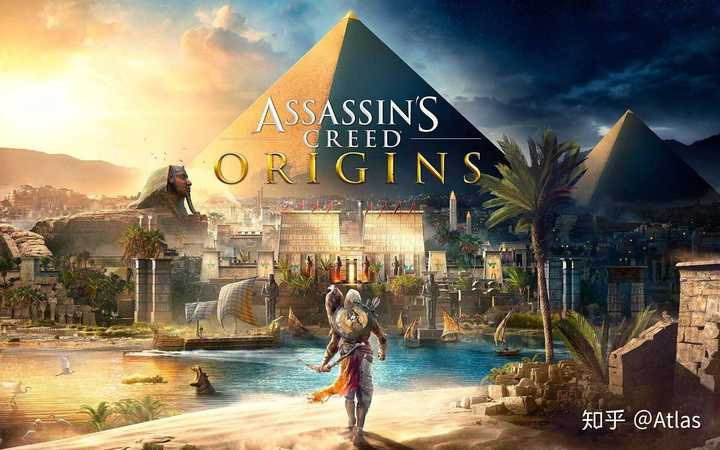

在经历了前两作的失败后，育碧似乎也进行了反思。本作不同于以往的年货系列，拥有更长的开发周期，而事实也证明，只要育碧想，他们也是能做出好游戏的。本作在游戏系统、叙事手法、任务设置、收集要素、AI设计等等方面，均异于前代作品，虽仍有少量BUG，但瑕不掩瑜，是刺客信条中十分推荐的一作。另，新作刺客信条：奥德赛，剧情在起源之前，系统则在起源的基础上更加RPG化，可以说奥德赛延续了起源的优点和部分缺点，也十分推荐尝试。

  

**74.地平线：黎明时分（Horizon: Zero Dawn）**

平台：PS4

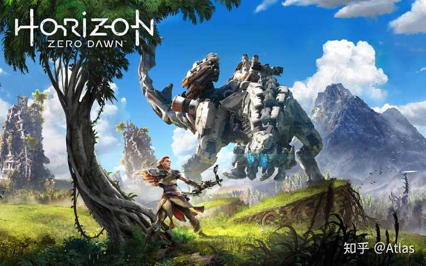

开放世界ARPG。游戏主要讲述了在距今1000多年的荒蛮与机械交织的大地上，女主人公探寻自己身世，寻找身边神秘事件真相的故事。本作最为出色的一点在于画面观感，精心制作的建模与贴图，真实的光照系统，再配合自然的生态地貌，拥有独立生态圈的机械生物，可以说本作是本时代游戏中画面观感最好的。剧情方面虽说达不到神作的高度，但也可圈可点；系统方面吸取了同类游戏的经验，无功无过。哪怕只是为了画质，本作也值得一试。

  

**75.仁王（NIOH）**

平台：PS4、PC

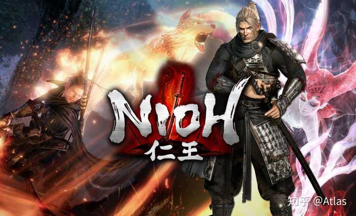

魂系角色扮演动作游戏。本作师承黑魂但不止于黑魂。开发组将自己丰富的动作游戏开发经验同黑魂类游戏模式结合在一起，打造出了极具深度的动作系统。游戏的场景设计显然花费了不少心思，不是简单的拿来主义，而是实实在在与游戏背景和剧情结合的产物。另一方面，本作的剧情只能说是差强人意，画面也略显阴暗沉闷，部分BOSS设计过于重复。是优点与缺点都十分明显的佳作，喜欢魂类游戏的玩家可以尝试下。

  

**76.杀手、杀手2（Hitman、Hitman 2）**

平台：PC、PS4、XBOX ONE

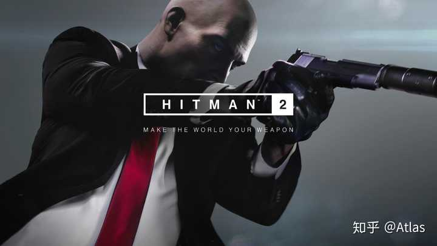

潜入暗杀类游戏。杀手系列最新两作直接命名为Hitman和Hitman 2，颇有系列重启的意味。而事实上他们也确实给我们带来了不一样的体验。游戏分章节发售，每一章都是一个大地图，制作组在其上安排各种目标与机遇，鼓励玩家寻找每一种暗杀的可能。游戏的地图设计优秀，每一张地图风格迥异，结构复杂，拥有丰富的重玩价值。续作Hitman 2可以看做是Hitman的大型DLC，新增了几张地图，加入了更多道具和游戏模式。但游戏服务器质量较差，脱机模式下游戏内容有限。

  

**77.极限竞速：地平线4（Forza Horizon 4）**

平台：XBOX ONE、PC

开放世界拟真向赛车游戏。先不谈极限竞速这个系列有多经典，单单看本作。本作将游戏舞台设置在英国，地域十分辽阔，地形起伏富有变化。游戏中四季更迭，天气变化，出色的光照系统配合上优秀的车辆建模和环境建模，给人以极佳的视觉观感。游戏提供了几百辆赛车，丰富有趣的挑战，富有深度的系统供玩家游玩。实在是赛车游戏爱好者不可错过的佳作。

  

**78.鬼泣系列（Devil May Cry）**

平台：多平台

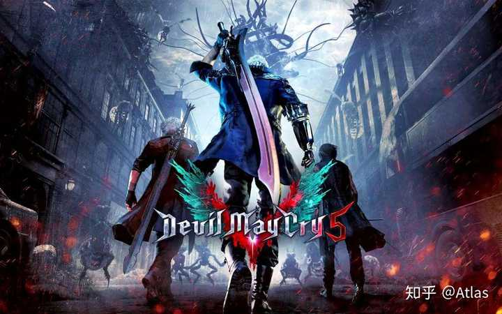

角色扮演动作游戏系列，是CAPCOM公司乃至日本游戏界的一块金字招牌。从初代游戏至今，它凭借着爽快华丽的动作系统，帅气迷人的角色，独特的世界观设定吸引了无数玩家，创造了如尼禄、但丁等一众耳熟能详的经典角色。系列最新作鬼泣5临近发售，虽为迎合当代玩家口味做出一定改变，引得部分老玩家的不爽，但相信发售时他们一定还是会大呼真香，解开腰包。

  

**79.大神绝景版（OKAMI HD）**

平台：PS2、Wii、NDS、PS3、PS4、PC、NS

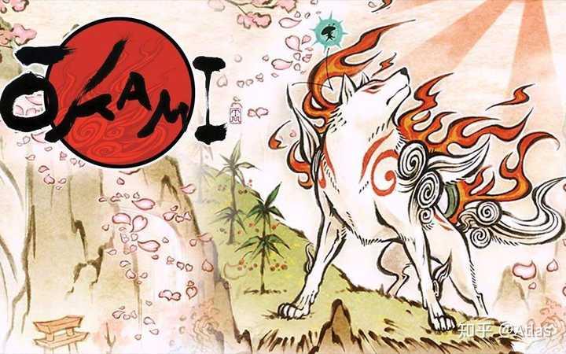

大神曾经是PS2时代最优秀的游戏之一，而这次，卡普空终于炒了次令人叫好的冷饭，发布了原游戏的高清重置大神绝景版。重置版虽仅为提升分辨率，将材质高清化，但游戏本身的素质，即使放到今天，仍令人称赞。相信看过本作截图的玩家一定会对其独特的水墨画风印象深刻，不止于此，以日本神话为背景的剧情，仍然有趣的系统。如有机会，请一定尝试一下。

  

**80.辐射系列（Fallout）**

平台：多平台

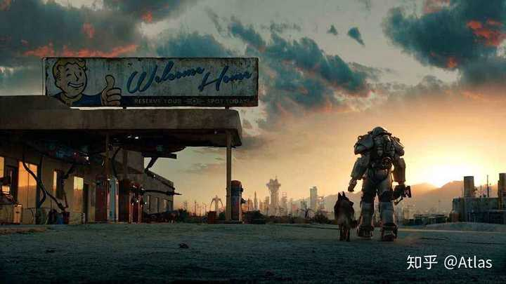

十分经典的游戏系列，系列作品给我们带来了太多美好的回忆。系列新作为辐射4，本身的素质还说得过去，但B社加价、mod收费等骚操作着实令人心凉。回到游戏，系列背景设定为核爆后的末世世界，核辐射令这个世界诞生了无数的怪物和怪人，而玩家要扮演的是一名避难所的幸存者，或为找回儿子，或为避难所的生存，需要踏入这个世界。游戏对于后启示录世界描写得十分到位，在这里先不赘述，感兴趣的玩家请自行进入游戏游玩。另，系列最新作是辐射76，一款糟糕的网游，不推荐，请直接游玩前作。

  

**81.怪物猎人：世界（MONSTER HUNTER: WORLD）**

平台：PC、XBOX ONE、PS4

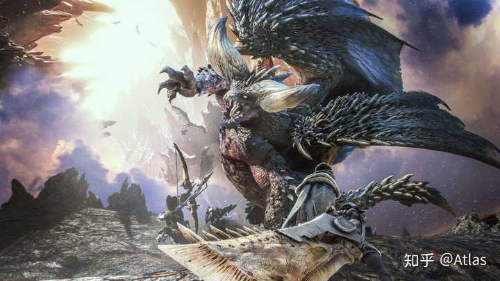

多人共斗打倒巨兽的ARPG游戏。本作相比前作，画面有了质的提升，为了迎合当代大众玩家的口味，适当简化了游戏系统，使其更加人性化。除此之外，新加入的中文，更是彻彻底底掏空了中国玩家们的钱包。本作很肝，但约上两三好友，还是十分能体会到刷素材的乐趣的。本作是系列新玩家最推荐入门的一作，但由于新系统几乎需要将所有怪物的模型贴图动作重置，导致本作参战怪物略少，简单来说“不够肝”。如果入了怪猎这个大坑觉得意犹未尽的话，推荐去玩玩前作“末代皇帝”怪物猎人XX（MHXX/MHGU），虽然被老玩家诟病创新之处不多，但历代最多的参战怪物、6种战斗风格\*14种武器、超级多的任务与幻化系统等等要素使得MHXX肝力爆表，完完全全可以玩几百上千小时。

  

**82.无主之地2（Borderlands 2）**

平台：PC、XBOX 360、PS3

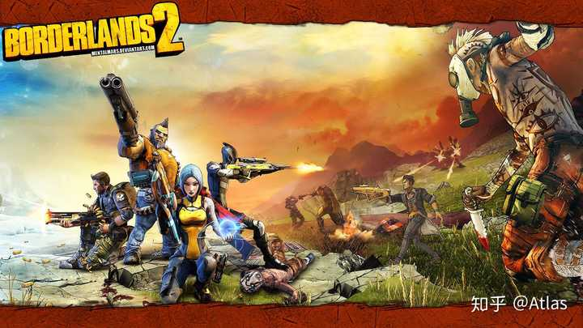

动漫画风的FPS游戏。二代游戏继承了独特的美漫画风，初看可能不太适应，但看久了竟也别有一番风味。怪异癫狂的角色们和黑色幽默为游戏增添了一分别样的气质。本作有别于一般的FPS采用等级系统，这也使得越级挑战怪物变得十分困难，游戏也鼓励玩家爆肝刷武器来提高伤害输出。个人认为这款游戏最有趣的玩法是叫上几个好友一起游玩，十分欢乐。

  

**83.光环/光晕系列（Halo）**

平台：PC、XBOX ONE、XBOX 360

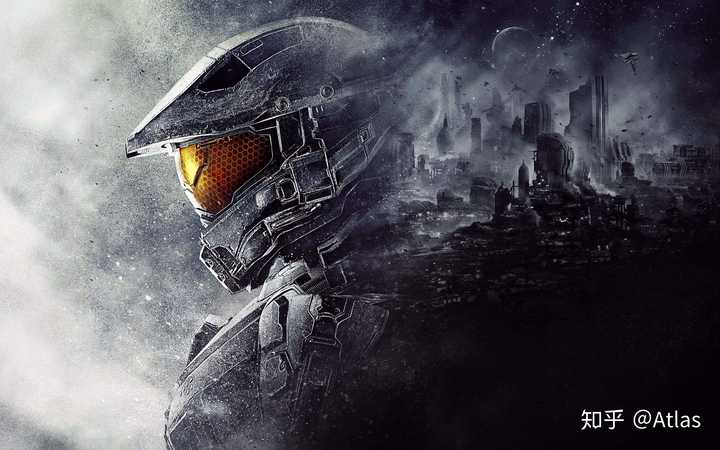

非常非常著名的FPS游戏系列。从游戏衍生出影视剧、漫画、小说等，共同创造了如士官长等深入人心的游戏角色。其他的我就不赘述了，你若是喜欢射击游戏，对科幻题材感兴趣，真的非常推荐游玩。近期光环士官长合集登录了PC平台，使广大无盒党也能体验光环系列的魅力。需要注意的是，登录PC的几作最初发售日期最晚也在2012年，不可避免会有不符合当前时代审美与习惯的情况出现，请考虑清楚再购买游玩。

  

**84.耻辱2/羞辱2/冤罪杀机2（Dishonored 2）**

平台：PC、PS4、XBOX ONE

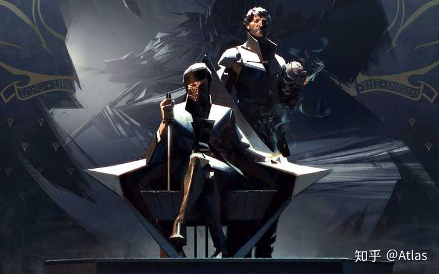

第一人称潜入暗杀游戏。玩家需要扮演艾米丽或是科尔沃，面对一场政变危机。玩家可以运用各种道具，甚至是魔法达成刺杀任务。个人觉得这款游戏做得非常好的两点是地图设计和场景设计，游戏背景是以鲸油为动力的蒸汽朋克世界，再加上优秀甚至惊艳的地图场景设计，使得潜入拥有非常多种可能。总之，推荐给喜欢潜入类游戏的玩家。

  

**85.Paradox游戏合集（P社四萌）**

平台：PC

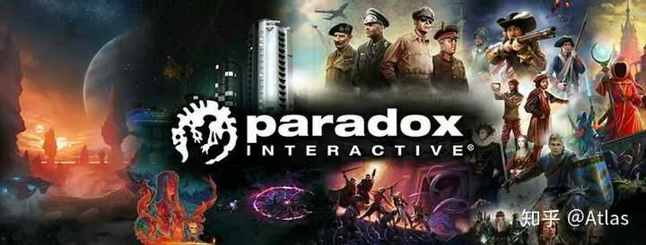

P社四萌：欧陆风云（Europa Universalis），钢铁雄心（Hearts of Iron），维多利亚（Victoria），王国风云（Crusader Kings），还可以再加上一个群星（Stellaris）。来自瑞典的这一群人，凭借着对历史的深刻理解和还原，获得了众多历史模拟游戏爱好者的支持。其实这些游戏可以说上手还是蛮困难的，系统复杂，缺少引导，因此注定了玩家群体的小众。但就像前文所有游戏一样，也许“吾之珍宝，人之糟粕”，请给这些优秀的游戏一次机会，也许你会爱上这种“指点江山”的感觉。

  

**86.只狼（SEKIRO: Shadows Die Twice）**

平台：PC、PS4、XBOX ONE

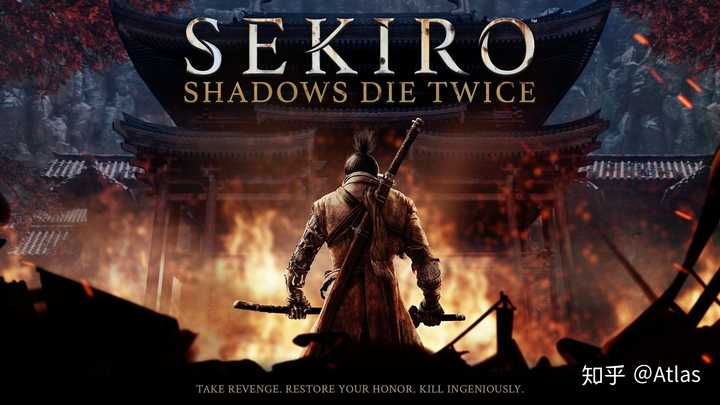

曾开发过黑暗之魂系列制作组from software的新作，说到这你们应该知道这款游戏该是什么德行了吧。第一感觉，游戏一改黑暗之魂和血源诅咒黑暗压抑的画面，为场景注入了更多的颜色和活力，武士，日本刀，和式建筑，这些帅气的元素似有魔力般吸引着我。但一上手体验你会立即发现这游戏还是那么硬核难咬，继承自魂系列的内核，升级的动作系统，和更高的难度，一切只为击败强敌后的成就感服务。综上，本作不是一款适合所有玩家游玩的游戏，但如果你已经被魂系列与血缘调教成了宫崎老贼的形状，买就是了。

  

**87.凯瑟琳（Catherine）**

平台：PS3、PS4、PSV、Xbox 360、PC

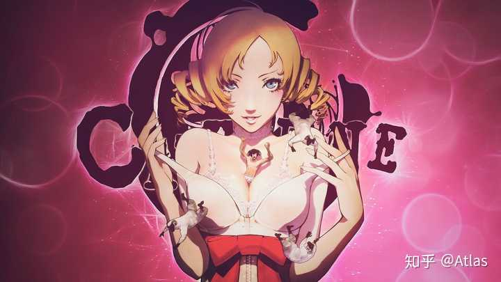

这是一款推箱子爬塔的游戏，但先别急着离开，这款游戏少有的探讨了关于婚姻的话题。是和现任女友结婚，还是投向更加理想的“情人”怀抱。游戏的主要形式是由动画和3d演出和爬塔推箱子解谜组成，类似于女神异闻录的画风。诚然，这不是一款大制作的游戏，但游玩本作，确实能让人对婚姻与爱情有更多的认识。

  

**88.勇者斗恶龙系列（Dragon Quest）**

平台：多平台

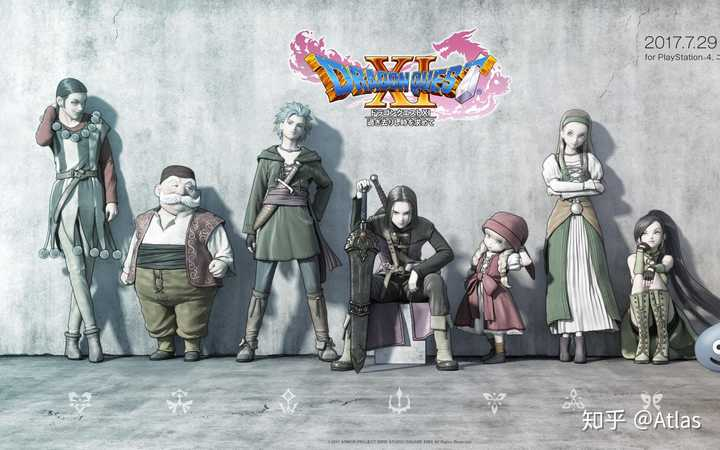

最最正统王道的RPG游戏，在日本有“国民RPG”之称。同最终幻想系列不创新就会死相反，这个系列有一点大胆出格的改变，就可能会面临销量和口碑的下滑，所以整个系列一直以来都是王道的勇者拯救世界的剧情，系统也是回合制战斗。开发组能做的，是在这个框架上把游戏打磨到极致，相对前作更好的画面，精致的剧情安排和演出，更多的可玩要素。如果想要体验原汁原味的日式正统RPG，玩它就对了。

  

**89.隐形守护者（The Invisible Guardian）**

平台：PC、IOS、Android

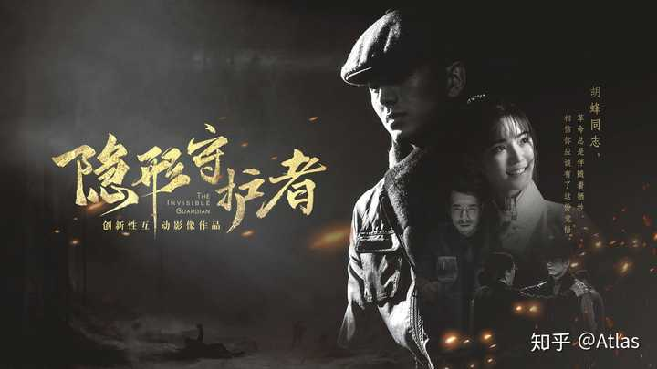

一款优秀的国产互动电影游戏。游戏讲述了在抗战年代，爱国青年肖途潜伏敌后的故事。生活中我们经常能看到抗日神剧各种没脑子没逻辑的操作，但当真正优秀的抗日题材作品端上来时，不要看轻了他。隐形守护者就是这么一款游戏，游戏的主要形式是由静态图片加配音的演出和玩家选择组成，与Galgame相似。游戏的剧情与配音十分出色，多结局的设定满足了我对潜伏的全部想象。强烈推荐游玩，一起成为中国革命事业的隐形守护者吧。

  

**90.时光之帽（A Hat in Time）**

平台：PC、PS4、XBOX ONE、NS

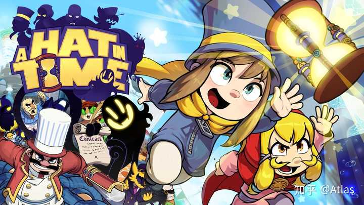

动作冒险游戏，游戏体验与超级马里奥：奥德赛类似，但主角小女孩超级超级可爱，完全不是马大叔能比的。玩家扮演小女孩，为寻回飞船燃料回家而穿梭于各个星球之间。每个星球的设计都非常有意思，富有童真想象力又不觉得幼稚。游戏的操作手感不错，配合女孩的小动作，真的有养女儿的感觉。这款游戏，不论男女都是非常推荐的，比较偏向休闲。另，游戏的默认视角设置并不友好，请自行百度视角设置指南来愉快游戏。

  

91.幽浮系列（XCOM/XCOM2）

平台：PC、PS4、Xbox One

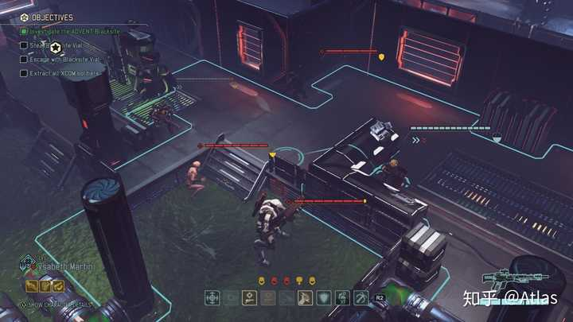

外星题材的策略战旗游戏，可以说是近年来最出色的一批策略战棋游戏。我以Xcom 2为例，玩家需要扮演指挥官，带领反抗军夺回被外星人掌握的地球，这是战争层面的目标；而玩家需要在外星人的压力下，有选择地在世界各地进行反抗活动或是支援活动，这是战役层面的需求；每一场小战斗，玩家需要操控几名不同职业的XCOM特工，潜入据点，进行战棋式的战斗。同时我们还需要关注据点设施的开发、资源的控制和人员的培养。游戏从全方面展现了这场反抗战争，也全方面提升了玩家的乐趣。同时，本作PC版支持创意工坊，玩家可以下载mod改善游戏体验，或是游玩其他玩家制作的地图，某些地图的质量非常高，完全不亚于官方DLC。

## **游戏商店/平台**

这里只列出部分商店，更多的请自行搜索。在商店搜索游戏时，请用英文名搜索。

**1.Steam**：目前最大的网上游戏商店，绝大多数的PC游戏均在此发售。逢年过节均有折扣，是万恶之源。

[Welcome to Steam​store.steampowered.com/](https://link.zhihu.com/?target=https%3A//store.steampowered.com/)

**2.GOG**：Cd projekt自家的网上游戏商店。主要贩售自己的游戏和精良的老游戏独立游戏。主要特点为贩卖的游戏均为未加密。

[GOG.com​www.gog.com/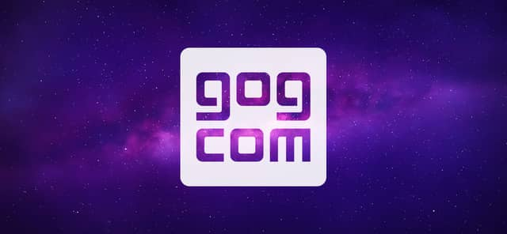](https://link.zhihu.com/?target=https%3A//www.gog.com/)

**3.Uplay**：育碧自家的网上游戏商店。主要贩卖育碧自家的游戏。

[Ubisoft​uplay.ubisoft.com/](https://link.zhihu.com/?target=https%3A//uplay.ubisoft.com/)

**4.Origin**：EA自家的网上游戏商店。主要贩卖EA自家游戏。

[Origin​www.origin.com/](https://link.zhihu.com/?target=https%3A//www.origin.com/)

**5.Playstation Store**：索尼PS平台网上商店，贩卖主机PS游戏

[Playstation Store​store.playstation.com/zh-hant-hk/home/games](https://link.zhihu.com/?target=https%3A//store.playstation.com/zh-hant-hk/home/games)

**6.战网**：暴雪游戏网上商城

[战网​www.battlenet.com.cn/zh/](https://link.zhihu.com/?target=https%3A//www.battlenet.com.cn/zh/)

**7.微软商城**：微软网上商店，主要贩卖XBOX和WINDOWS游戏

[微软官方商城​www.microsoftstore.com.cn/c/apps](https://link.zhihu.com/?target=https%3A//www.microsoftstore.com.cn/c/apps)

**8.Epic商城**：虚幻引擎开发商自家商店。

[Epic Games​www.epicgames.com/store/zh-CN/](https://link.zhihu.com/?target=https%3A//www.epicgames.com/store/zh-CN/)

## **低价游戏**

这里只列出部分渠道，更多的请自行搜索。

**1.Humble Bundle**：著名慈善包网站。慈善包含义及更多慈善包网站请自行百度。

[Humble Bundle​www.humblebundle.com/store](https://link.zhihu.com/?target=https%3A//www.humblebundle.com/store)

**2.GMG**：小绿人，逢西方节日可以关注下。

[Green Man Gaming​www.greenmangaming.com/](https://link.zhihu.com/?target=https%3A//www.greenmangaming.com/)

**3.杉果**：国内的正版游戏分销商，时常能爆出低价。

[杉果游戏​www.sonkwo.com/](https://link.zhihu.com/?target=https%3A//www.sonkwo.com/)

以上仅为简要介绍几个购买正版游戏的渠道，更多的请自行搜索。PC端低价游戏还可以在steam跳蚤市场，淘宝等地购买，但由于是和个人交易，需要自行鉴别小心购买。同时，购买游戏还有国际区，国区，亚洲区，俄区，港版，日版，美版，欧版等区别，在购买前请自行了解。主机游戏电子版可在主机内商城中购买，卡带光盘版可在电商购买。文中的许多游戏在PC端用手柄游玩能有很好的体验，建议财力允许的玩家入手一只XBOX ONE手柄。

  

注1：若是发现自己喜欢的游戏，请善用搜索功能，寻找系列前作、同一制作组的其他游戏或同类型经典游戏。自己动手，丰衣足食。

注2：游戏图片皆为网络寻找，如若侵权，请私信，我立马删除和更换。

  

都看到最后了，那我说两句吧。写这篇答案是为了做一个个人的微小的总结，给新玩家做个参考，所以可能不太符合题目“不玩会很遗憾”，因为这个实在太主观了。每个人都有自己非常喜欢的游戏，真的十分感谢大家在评论中给我的建议，也谢谢大家对我的支持和鼓励。还有，游戏固然有趣，但还是要合理安排时间。最后的最后，别光收藏不点赞啊，看到收藏数是赞同数两倍我都快哭了好吗\_(°:з」∠)\_
