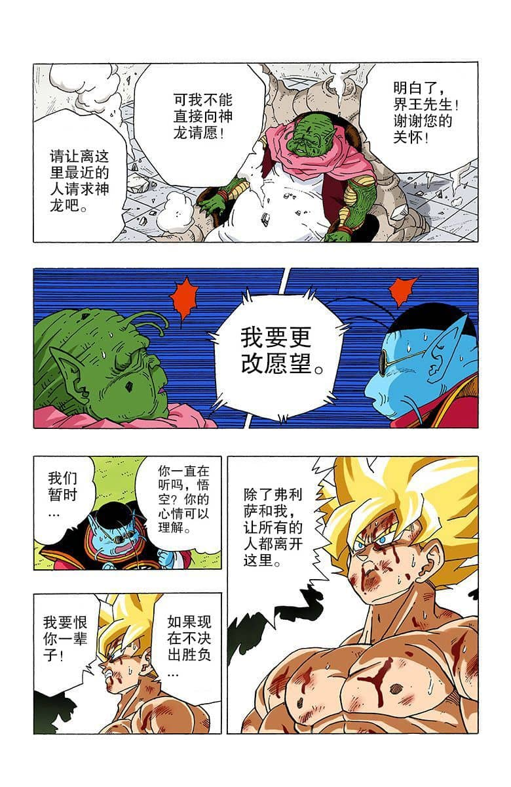
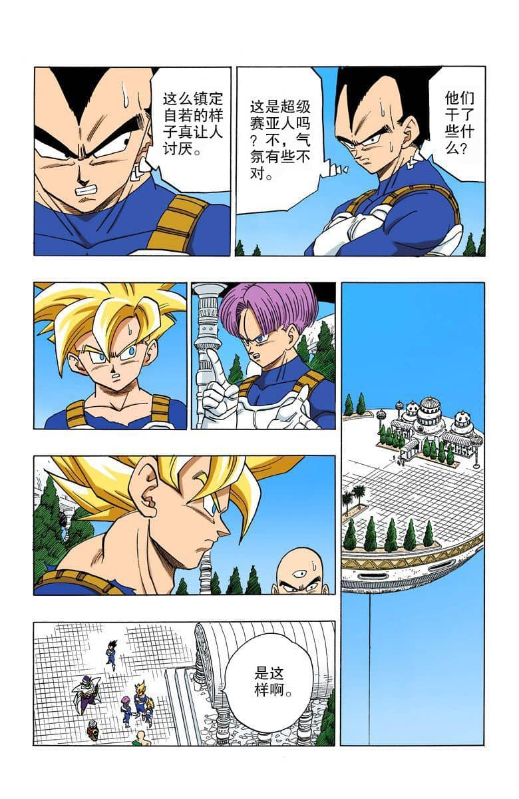
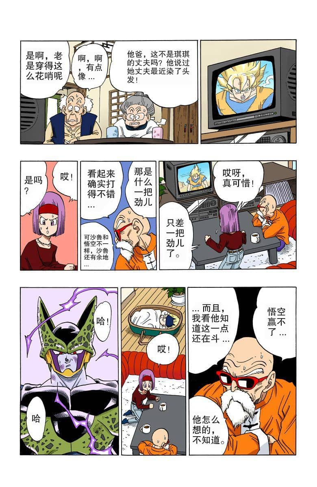
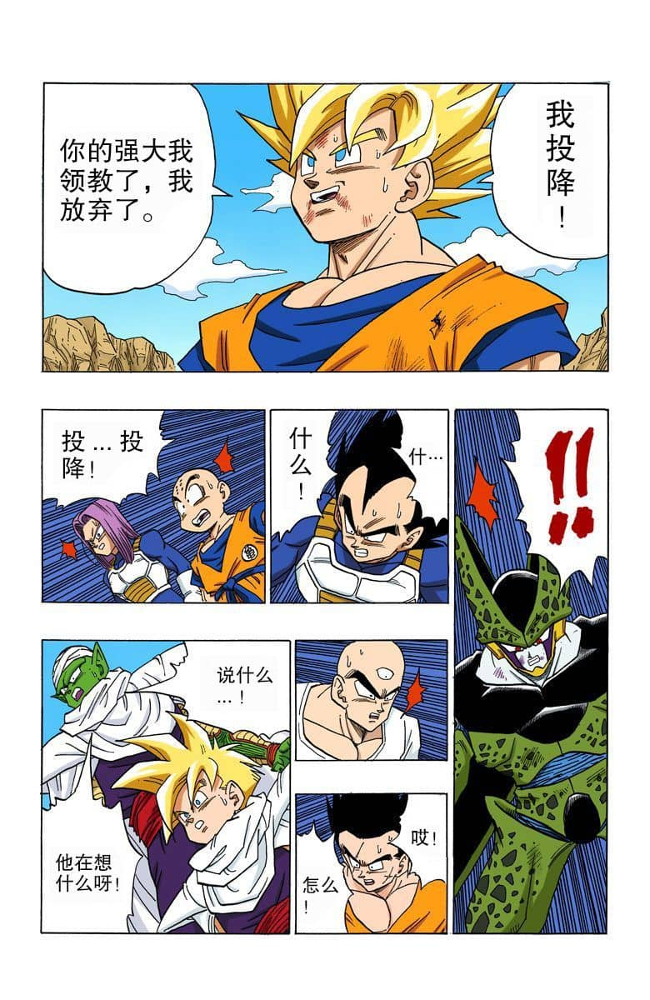
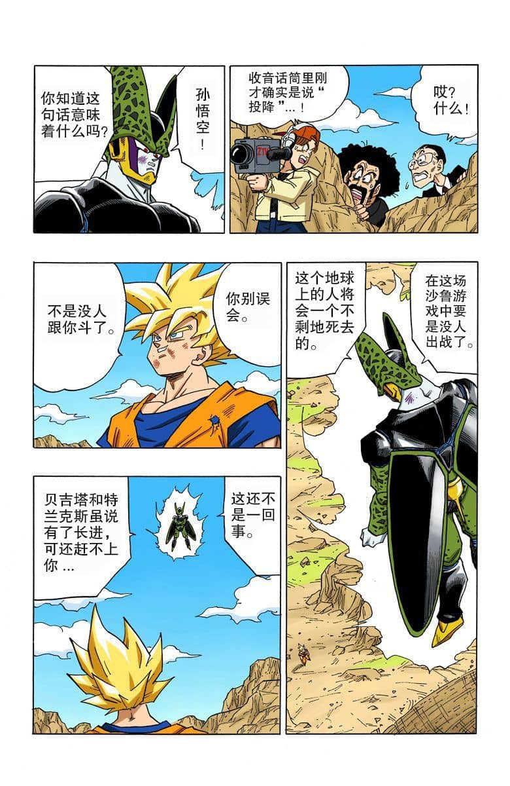
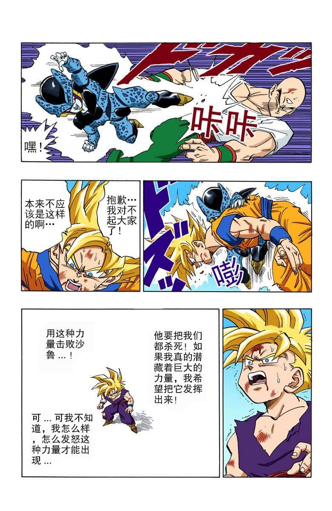
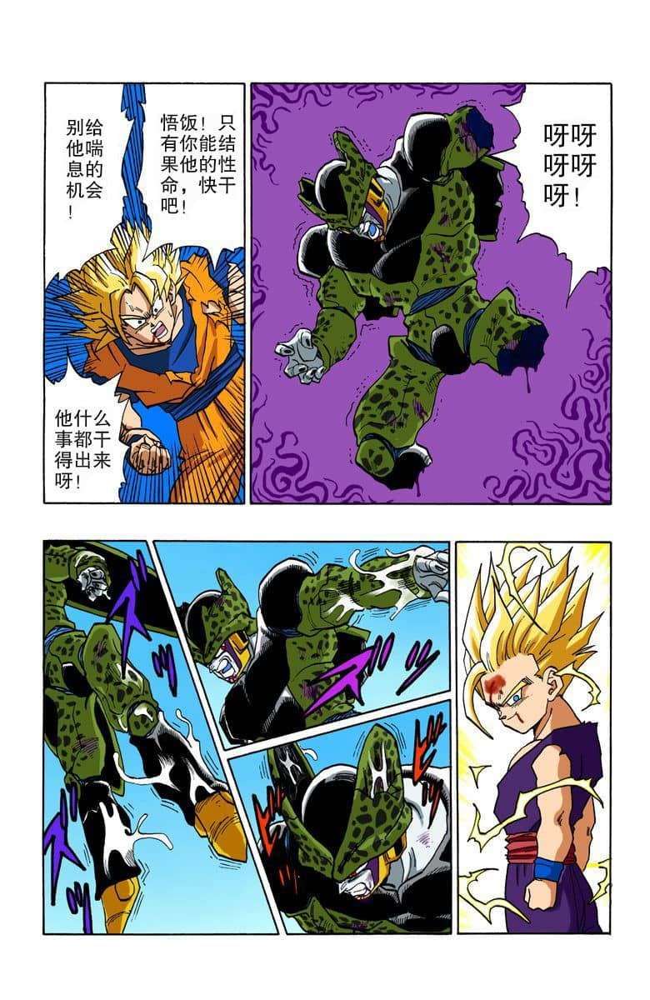
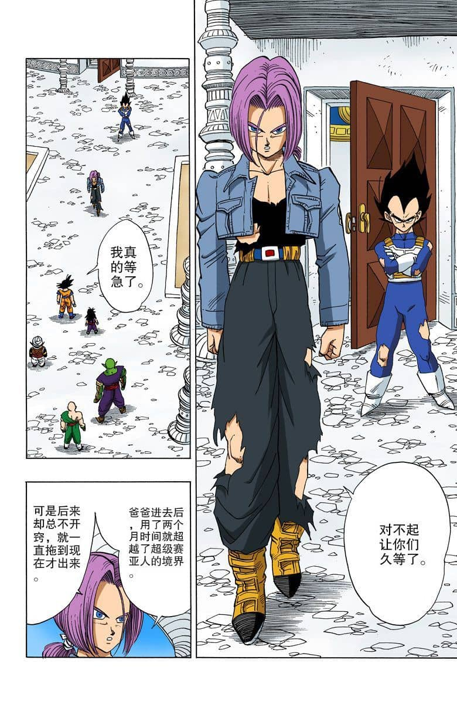

因为超赛全功率，就是普通超赛的改良版。这一点在孙悟空与孙悟饭修练时有明确说过的。

一张图**将孙悟空的想法，以及超级赛亚人全功率的全部都描述得很清楚了。**

1、孙悟空认为，从能量的平衡上来看，普通的超级赛亚人是最合适的。因此，**决定从普通超赛、超赛第二阶、超赛第三阶三种超赛一变身里选择了普通超赛作为改良的基础。**

**2、**超赛全功率第二步、日常保持**超级赛亚人状态，让身体适应超赛的变身。也即是，一步到位，直接提升五十倍的实力。**

**3、**超赛全功率第三步、**消除成为超级赛亚人时的兴奋状态。**

可能很多人对于这一步，觉得有些摸不着头脑。**但事实上，超赛全功率的改良，最重要的就是这一点。**

**消除了变身超级赛亚人的兴奋感为的是什么？为的是能够以最冷静的状态面对敌人，将超级赛亚人的好战本能降至最低。**

要清楚知道，超级赛亚人的好战本能是极其可怕的东西，有时候**为了战斗，哪怕要被星球毁灭导致死亡也不在乎！**

可是消除了兴奋感，消除了大部分战斗欲的超赛全功率是什么样子的呢？

**好战的贝吉塔王子表示，这样镇定自若的超级赛亚人真的讨厌，太冷静了，一点都不像超级赛亚人。**

那么，从这里也可以看出，**贝吉塔是不太可能走超赛全功率的这个路线的，因为这个状态的超级赛亚人他很讨厌。**

而说回超级赛亚人全功率的孙悟空

他变得做每一件事情都有自己的想法，让人琢磨不透。

  

甚至，在**弗利萨篇，承担着灭星的压力下，仍然要跟弗利萨决一胜负的超级赛亚人孙悟空，在沙鲁游戏，向对手投降了！**

**从未投降过的孙悟空，第一次，投降了！在他尚未竭尽全力之时，戛然而止。**

**出乎在场所有人的意料。但这就是消除了兴奋感的超赛全功率，不再是以战为乐，而是甘愿做绿叶，马前卒，为孙悟饭上场开路。**

同样的，为什么**之前剧情里，很容易就触发愤怒天赋的孙悟饭，在全功率状态，却迟迟怒不起来？正是因为情绪被压制得太厉害了**

而且，全功率状态下的孙悟饭还想着**如何发怒，使出潜在力量，击败沙鲁。**

可当他变身超级赛亚人二之后，**被压抑的兴奋感重新出现后**

**变得张狂而好战，明明未变身前还想着击败沙鲁**

**变身之后却成了如何虐待沙鲁为乐。**

由此可见，超赛全功率的消除兴奋感**究竟有多重要了！**

**4、在日常保持超赛状态的同时，苦练基本功，重新打基础！**

这一点的话，其实也正好回应了题主的问题**，为什么孙悟空和孙悟饭的基础战斗力会比贝吉塔高那么多。**

**因为他们一年精神时光屋都是在打基础。**

**而贝吉塔与特兰克斯却陷入了突破境界的误区。**

他两花费了大量的时间去探索，超赛第二阶、第三阶甚至**第三阶以上。**可惜没成功。

**这也就导致，他两的基础战力跟一开始就明确要练基础的孙悟空、孙悟饭比，会落后很多。**

而再**根据他两再次进入时光屋，却收获无多的情况来看。他们第二次仍然想着突破境界的事，而非锻炼基础。**

于是，**就有了超赛全功率孙悟空，孙悟饭远强于第二阶水准的贝吉塔、特兰克斯了。**

所以说，**所谓的超赛全功率。其实就是完全适应了超赛变身，消除了兴奋感、好战感的普通超级赛亚人而已。其增幅的确就五十倍。**
