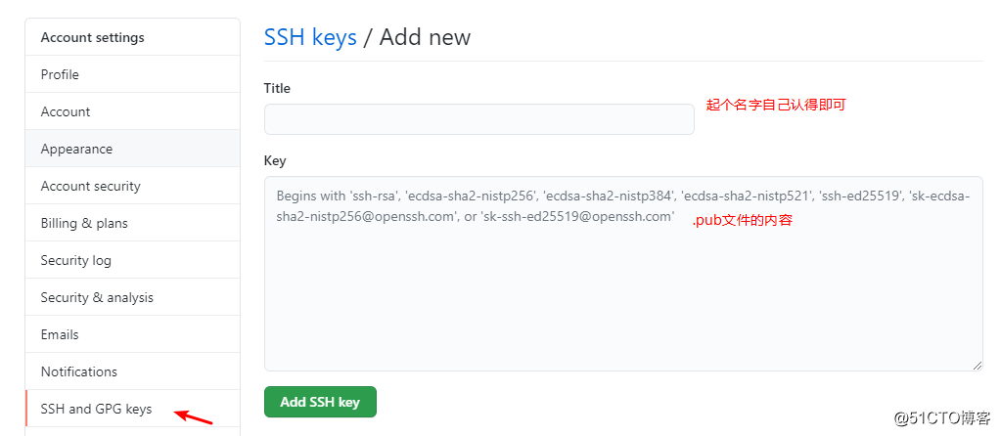

# Git配置多个github账号

  

在公司开发中，有时候会存在公司账户跟私人账户共存，并随时需要切换的情况，这种情况下git可以配置多个ssh-key，无缝切换账号。  
假如有两个github账号，一个是私人github账号，一个是公司github账号  
私人账号:

*   github用户名：my
*   email：convict@qq.com

公司账号：

*   github用户名：company
*   email：convict.yellow@work.com  
      
    

### 一、在用户目录下的.ssh目录下生成秘钥与公钥

如果用户目录下没有.ssh目录，则需要新建一个

```plain
cd ~/.ssh
ssh-keygen -t rsa -f id_rsa_my
ssh-keygen -t rsa -f id_rsa_company
1.2.3.
```

一路回车即可

上面ssh-keygen 命令参数：

*   \-t: 指定生成rsa 类型秘钥
*   \-f: 指定生成秘钥的名字，可以不指定该参数，默认就会生成2个文件：私钥id\_rsa，公钥id\_rsa.pub。因此上面的命令需要指定-f，否则生成两次后，私钥跟公钥会覆盖

因此上面的命令调用完后至少会生成四个文件：

*   id\_rsa\_my
*   id\_rsa\_my.pub
*   id\_rsa\_company
*   id\_rsa\_company.pub  
      
    

### 二、将公钥配置到对应的github账号中

公钥即.pub文件可以直接用文本打开，内容粘贴到github的 Settings -> SSH and GPG keys -> New SSH Key，Title随便起，自己能认出来即可，Key里面填写复制的.pub里的内容，这样公钥就配置好了  


### 三、将私钥配置到git中

#### 1\. 依次使用命令

```plain
ssh-agent bash
ssh-add id_rsa_my
ssh-add id_rsa_company
1.2.3.
```

*   ssh-agent bash（或eval $(ssh-agent)）会启动一个进程在内存里管理这些私钥，可以把它理解成一个私钥管理中心
*   ssh-add分别把两个私钥添加进来  
      
    

#### 2\. 查看私钥添加结果

调用 ssh-add -l查看添加结果，添加成功的话如下所示：

```plain
2048 SHA256:X5HtSLQFgc55bQJ8kNwChmcfTOS6vvjIpAmj9PCX2Fs id_rsa_my (RSA)
2048 SHA256:C+UmpLUGhSgoSdMDebJeJ6hDrodYFjtkyCcBqvFWO1o id_rsa_company (RSA)
1.2.
```

  

#### 3\. 创建config文件

在.ssh目录下创建config 文件，git通过这个文件才知道哪个私钥去对应哪个公钥

```plain
touch config
1.
```

  

config文件内容：

```plain
# my
Host my
HostName github.com
IdentityFile ~/.ssh/id_rsa_my

# company
Host company
HostName github.com
IdentityFile ~/.ssh/id_rsa_company
1.2.3.4.5.6.7.8.9.
```

  

config文件部分参数含义，仅做记录-

```plain
# Host: 主机别名
# HostName: 托管平台域名地址，如github.com
# IdentityFile : 指明上面User对应的identityFile路径
# User: 托管平台用户名
# Port: 端口号，可不填（如果不是默认22号端口则需要指定）
# PreferredAuthentications publickey
1.2.3.4.5.6.
```

  

#### 4\. 测试ssh-key是否连通

```plain
ssh -T git@my
ssh -T git@company
1.2.
```

成功的情况下会返回：

```plain
Hi xxx! You've successfully authenticated, but GitHub does not provide shell access.
1.
```

此时私钥 和 公钥 都配置正常了  
  

#### 5\. 自动切换github

此时测试一下clone私人git仓库，必须使用SSH方式clone。SSH类型的链接格式为：

```plain
git@github.com:github用户名/仓库名.git
1.
```

比如：

```plain
git@github.com:convict/my-repo.git
1.
```

若要clone这个仓库，应使用git clone git@my:convict/my-repo.git，即把github.com 换成my，此时clone成功，同理需要clone公司账户下的仓库，需要把github.com 换成company即可  
  

若直接使用git clone git@github.com:convict/my-repo.git，会clone失败：

```plain
Cloning into 'test'...
Warning: Permanently added the RSA host key for IP address '13.250.177.223' to the list of known hosts.
git@github.com: Permission denied (publickey).
fatal: Could not read from remote repository.

Please make sure you have the correct access rights
and the repository exists.
1.2.3.4.5.6.7.
```

解释：

1.  在SSH中，@与:之间就是Host，因此在git clone git@github.com:convict/my-repo.git中，Host就是github.com，但在前面配置的config文件中，指定了两个Host，分别为my与company，而没有一个加github.com的Host！这是尤其需要注意的。
2.  使用git clone git@my:convict/my-repo.git时，会在config中找到一个值为my的Host，接着到其HostName上找到与其私钥对应的公钥的仓库地址。在本例中，就是根据其私钥id\_rsa\_my，在github.com托管平台上，匹配对应的公钥，然后匹配到convict/my-repo.git这个仓库。