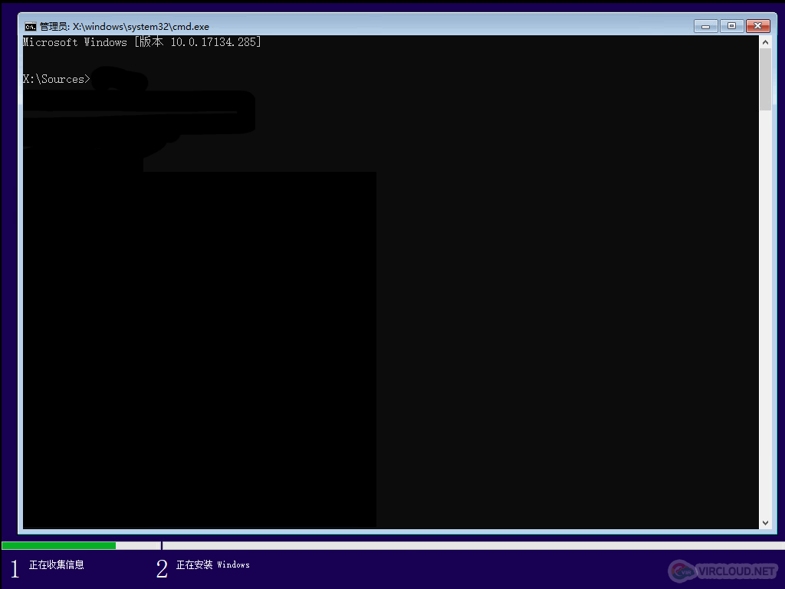
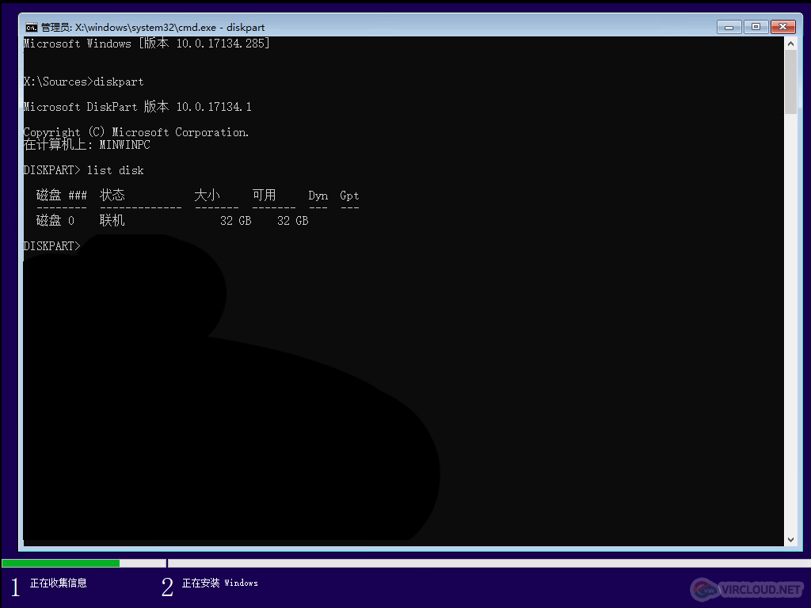
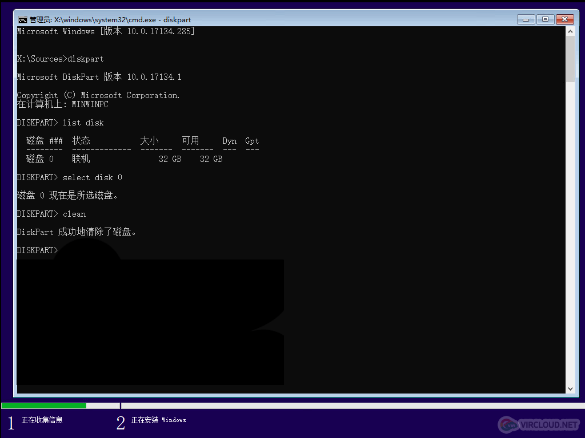
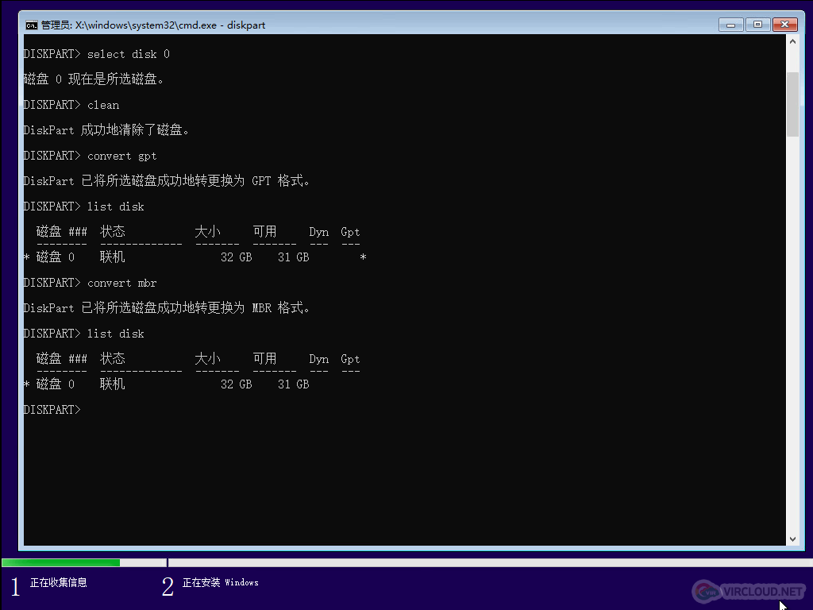
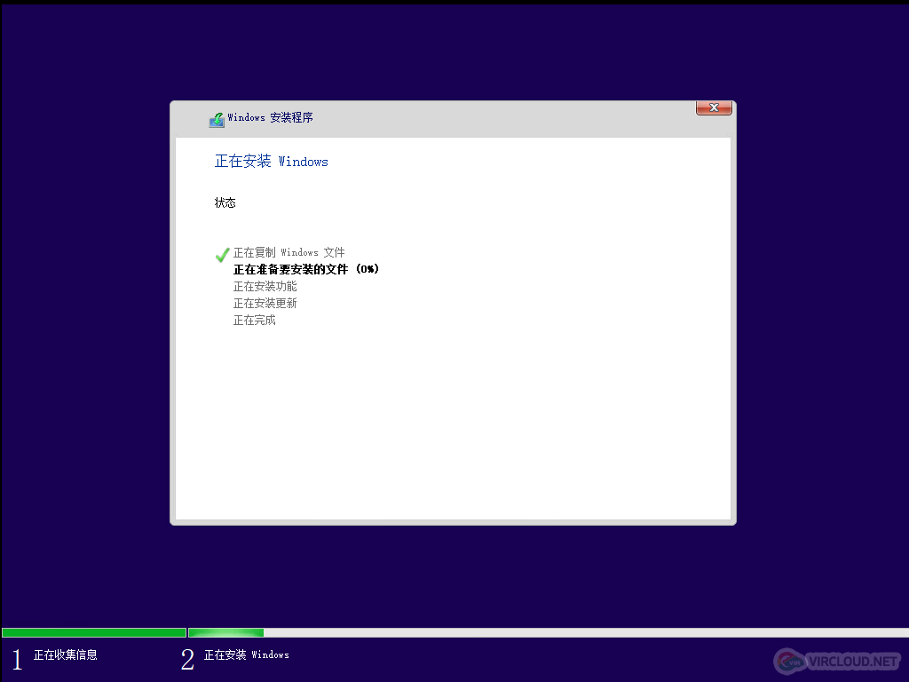

## 问题

在预装 Windows10 的电脑上，想要通过 U 盘重装系统，在引导的 Boot Options 中看不到 U 盘选项，修改引导模式为 Legacy，再次引导可以看到 U 盘选项，U 盘启动安装程序，在选择磁盘时提示 “ windows 无法安装到这个磁盘 选中的磁盘采用GPT分区形式 ” 。

## 分析

Windows 8 及之后的版本（包括 Windows10）的系统均添加了快速启动功能，因此预装 Windows 8（及之后的版本）的电脑默认都是 UEFI 引导和 GPT 硬盘，而传统的引导方式则为 Legacy 引导和 MBR 硬盘，需要注意的是 `UEFI 必须跟 GPT 对应，同理 Legacy 必须跟 MBR 对应`，即如果 BIOS 开启 UEFI，而硬盘分区表格式为 MBR ，那么识别不到，如果 BIOS关闭 UEFI 而硬盘分区表格式为 GPT，也是无法安装 Windows。

## 方案

如果 BIOS 开启 UEFI 而硬盘分区表格式是 MBR，那么直接修改 BIOS 为 Legacy 引导即可，也可以修改分区表格式为 GPT。

如果 BIOS 开启 Legacy 而硬盘分区表格式是 GPT，那么可以修改 BIOS 为 UEFI，或修改硬盘分区表格式为 MBR。

修改分区表格式可以参考下列方法：

注意事项：转换分区表格式会清空硬盘所有数据

1、在当前安装界面按住 `Shift+F10` 调出命令提示符窗口：

2、输入 `diskpart`，按回车执行，进入 DISKPART 命令模式后，输入 `list disk` 回车，列出当前磁盘信息：

3、如果要转换磁盘0 的格式，则输入 `select disk 0` 回车（就是磁盘几的意思），输入`clean`，删除磁盘分区：

4、根据自己实际情况和需要，若输入 `convert gpt` 则转为 GPT，若输入 `convert mbr` 则转为 MBR：

5、最后输入两次 `exit` 回车或直接右上角点 X 退出命令提示符，然后就可以返回安装界面继续安装系统了：

以上就是通过转换分区表格式解决安装 win8/win10 提示无法在驱动器0 分区上安装 windows 的解决方法。

如果觉得以上操作复杂或者不想清空数据，那么就只能通过光盘安装了。

