**W A R N I N G ！**

*   **※阅读正文前请保持房间明亮，并年满18岁。**


**~——只为给伟大的日本劳动女性献上赞歌。~**

本文将深入浅出，从无到有，以日本“成人视频”为例。

**——由影片元数据抓取（EverAver）开始，到服务端软件选择（Emby），再到客户端配置（Kodi），做出完整的教程指南。**

无论您是搭建本地媒体库，还是影片归类管理，相信都能在文中找到合适工具。

请善用文章右侧的`CATALOG`快速跳转至您需要的教程。

# 元数据 / EverAver

#### 什么是“元数据”

`元数据（metadata）`即影片信息：如影片封面 / 影片标题 / 发行时间 / 影片简介 / 制作公司 / 演员表 / Staff表。

越是完善的`元数据`，导入plex/emby等本地媒体库后就越是美观便利。

就像这样：


而我们平时下片 ~发电~ 显然不会保留这些信息。

所以搭建本地片库的第一步，便是补全影片`元数据`。

#### 元数据有四种抓法

就像~[Android App的网络访问方式有四种](https://raw.githubusercontent.com/Pockies/pic/master/741f9461ly1g1e0o5njpoj20f80fjdix.jpg)~，元数据抓取也有的是招：

*   **Plex / Emby自带“刮削器”**

普通电影/日本动画使用自带tmdb/anidb等`刮削器（metadata agents）`便能实现`元数据`自动抓取。

成人类视频的`刮削器`则在plex/emby的社区论坛内提供，作为扩展插件安装即可。

但`刮削器`对文件名要求极高，**视频文件名必须需包含影片英文名（普通视频）或番号（成人视频）**。

而我们下载的AV却普遍如下画风

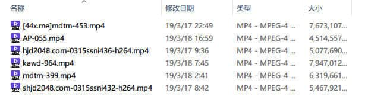

自动工具根本无法应对**如此复杂且混乱**的命名方式。

要么识别错误，要么无法识别，而一旦识别错误，改起来更是蛋疼无比，因为你甚至不知道哪部错了。

**——日本爱情动作片对不懂爱的“自动程序”而言，显然是超纲了。**

*   **[JavHelper](https://javhelper.blogspot.com/)**

一款由台湾人开发的AV`元数据`抓取工具。

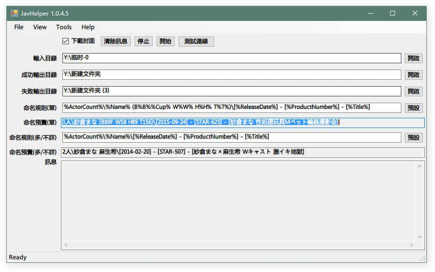

**集自动重命名 / 元数据抓取 / 大批量操作于一身。**

弊端与plex/emby的`刮削器`相同，基于程序识别的“自动批量”终有极限，虽识别精度高于`刮削器`，但依然不是可用级别。

并且该软件抓取的`元数据`相对简陋，只有单张封面和简单信息，无法满足搭建“媒体库”的需求。

**——仅适用于轻度粗略的文件管理。**

*   **[EverAver](https://everaver.blogspot.com/?zx=2aeb97a65a8c97a9)**

又一款台湾人开发的AV`元数据`抓取工具。

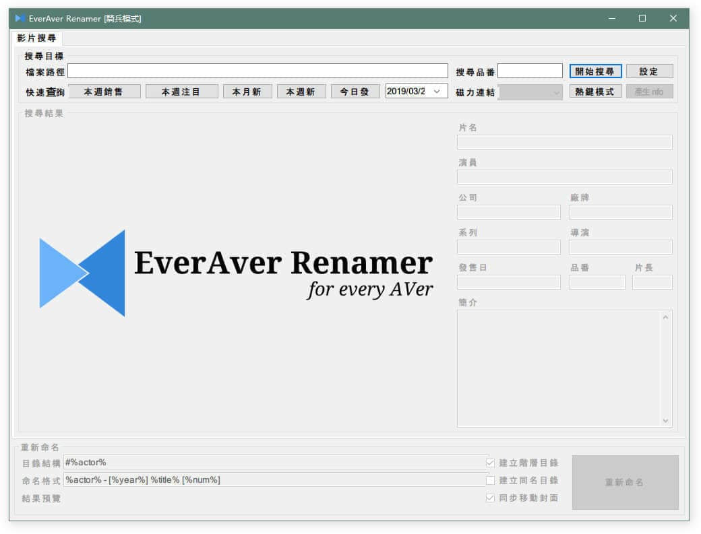

功能强大：

1.  自动识别番号并抓取`元数据`，无法识别的影片能立刻通过手动输入查询，**彻底杜绝“识别错误”**。
2.  `元数据`信息非常完善，并提供多个版本供人选择；
3.  支持自动重命名；
4.  支持自动建立文件夹并归类（如按“女优名字”建立分类文件夹），给媒体库的本地管理提供了巨大便利；
5.  几乎所有影片都能正确抓取`元数据`，本次搭建媒体库合计扫描800+部作品，只有24部没有找到；
6.  没找到`元数据`的作品，支持手动添加补全信息。

缺点则是：

1.  不支持批量，需要一部一部抓取；
2.  对存在**多个分集**的作品支持不好，需手动修改`nfo`文件进行合并（将在后文详述）；
3.  为了速度，推荐挂日本代理使用。

**由于[EverAver](https://everaver.blogspot.com/?zx=2aeb97a65a8c97a9)功能强大且没有致命缺陷，自然成为本次媒体库搭建的主力工具。**

**——为毛片 / 里番管理而生！**

*   **手动编辑nfo**

**原始但有效。**

以EverAver生成的数据为例，影片`元数据`通常以`nfo`文件+封面/封底图片的形式，储存于影片同目录。

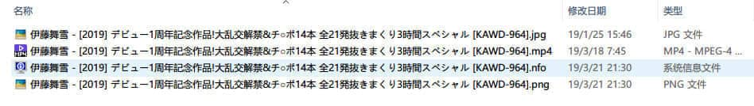

用文本文档 / 编辑器打开`nfo`文件便能看到整个`元数据`的结构与编写规则。

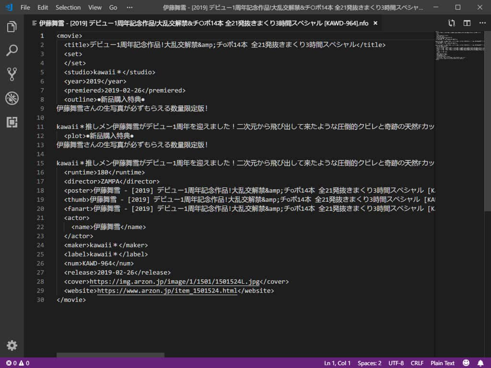

规则非常简单，看tag英文便能明白需要填入什么，比如：

```html
<movie>
  <title>影片标题</title>
  <studio>制作组</studio>
  <year>发行年份</year>
  <premiered>具体发行时间</premiered>
  <outline>影片大纲</outline>
  <plot>内容简介</plot>
  <runtime>影片时长</runtime>
  <director>导演</director>
  <actor>
    <name>演员</name>
  </actor>
</movie>
```

更多的`nfo`编写规则请参阅wiki：[NFO files](https://kodi.wiki/view/NFO_files)。

**优缺点不言自明，纯人工是最准确的方案，也是最费事的方案。**

而当我们无法通过软件找到影片`元数据`时，也只能参考日本通贩网站上的信息（如[DMM](http://www.dmm.co.jp/digital/)），手动编写`nfo`了。

**~——软件搞不定问题的话，用人力搞定不就行了？~**

#### 明确文件夹层级[](#%E6%98%8E%E7%A1%AE%E6%96%87%E4%BB%B6%E5%A4%B9%E5%B1%82%E7%BA%A7)

比起通过plex/emby的媒体库页面管理影片，在windows资源管理器添加`网络位置`映射NAS上的硬盘，通过`smb`管理文件显然更加便利。

**所以我们在动工之前，最好明确影片存放层级，利用文件夹归类。**

我的目录层级如下：

```plain
硬盘根目录/顶层文件夹
——演员实用度/等级（第一层子文件夹）
————演员名字（第二层子文件夹）
–——————演员所有影片
```

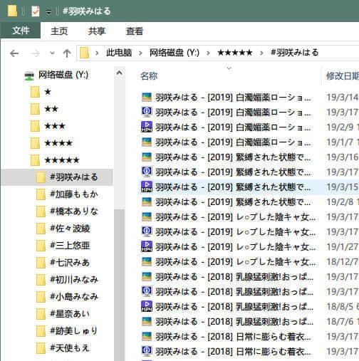

~为了方便理解，我特地把原本N/R/SR/SSR/UR的沙雕抽卡等级改成了“星级”。~

毕竟出演AV的老师实在太多，不划分层级并归类，直接全扔一起会完全不知道谁是谁。

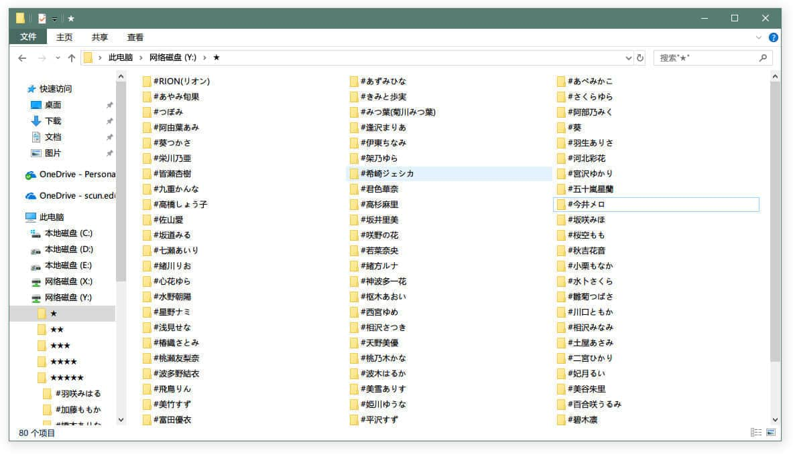

**当然——**

**~——您也能按个人性癖归类（比如裤袜 / 屁股 / 熟女 / JK）。~**

这里我只提供一种归类思路，而明确想要的文件夹层级后，才能配置EverAver做到搭配使用。

换做普通电影 / 日本动画，做一层“星级目录”也能当作一种豆瓣式的“评分”筛选，最后在Emby的媒体库能更方便的找到喜爱作品。

不得不说Emby的“评分系统”只有“喜欢/不喜欢”，实在残废。

#### 配置EverAver[](#%E9%85%8D%E7%BD%AEeveraver)

EverAver的默认规则会建立复杂的文件名+繁琐的文件夹层级，**使用前请按需修改配置。**

点击右上角`设定`：

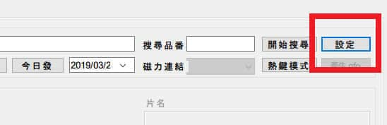

*   第一页`操作设定`勾选如下：

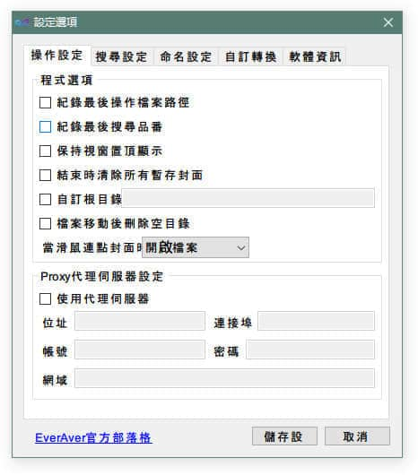

*   第二页`搜寻设定`勾选如下：

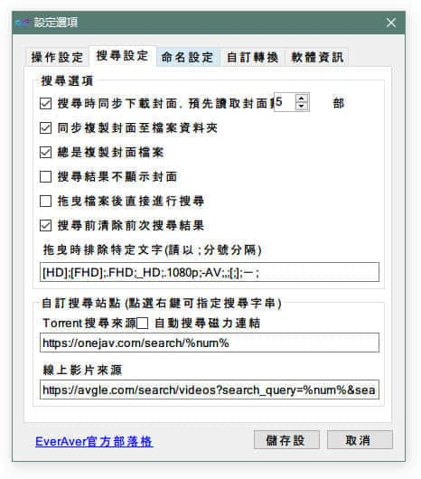

需要填写的部分保持默认，`排除特定文字`的规则可按需增加（用来过滤文件名中的垃圾信息以识别番号）。

*   第三页`命名设定`勾选如下：

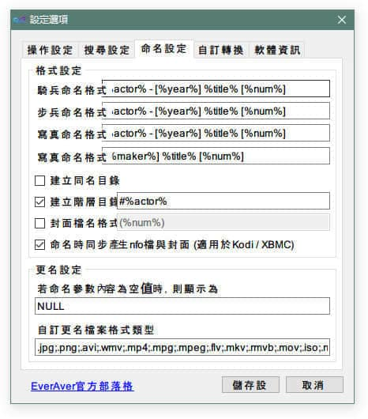

`格式设定`中的`命名格式`修改为：

```plain
%actor% - [%year%] %title% [%num%]

显示效果如下：
女优名字 - [作品年份] 作品标题 [作品番号].mp4
```

`建立层级目录`修改为：

```plain
#%actor%
```

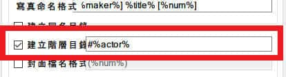

务必加一个符号在`%actor%`前面（如“#”号），否则导入时Emby会将演员目录下的所有片子错误识别成“同一作品”。

`更名设定`的第一项建议修改为：

```plain
NULL
```

EverAver配置完毕。

#### 使用EverAver[](#%E4%BD%BF%E7%94%A8everaver)

使用前请在`搜寻品番`的文本框内右键，选择你的影片类型。

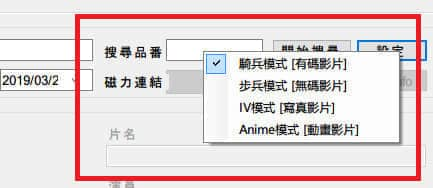

将一部AV拖入软件，EverAver会自动提取出番号，并填写在`搜寻品番`的文本框内。

偶尔番号会提取不干净 / 错误，请手动修改，不用在意大小写。

点`开始搜寻`便开始抓取`元数据`。

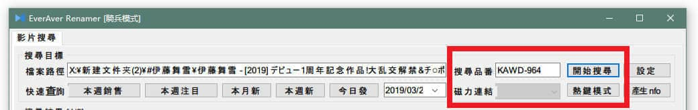

*   抓取到多个版本的`元数据`时，点击封面右下角进行切换，选择最完善的一个；
    
*   第一个版本的`元数据`封面尺寸偶尔会**偏扁**，请切换`元数据`版本解决；
    
    **（偏扁的封面会被Emby拉伸，非常难看）**
    
*   `品番`一栏便是番号，有时会出现`R`/`TK`之类的无用前缀，推荐删除；
    
*   `片名`一栏也不时出现`【数量限定】`的无用前缀，为保持Emby的媒体库排序整洁，务必删除。
    


`元数据`确认无误后，点右下角`重新命名`便会按我们配置的规则，自动生成目录+移动文件+添加封面与`nfo`文件+重命名。

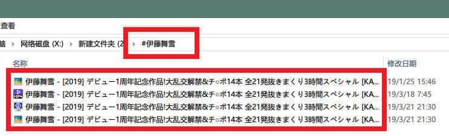

一部AV影片的`元数据`便抓取完成。

#### 修改nfo合并“多集作品”[](#%E4%BF%AE%E6%94%B9nfo%E5%90%88%E5%B9%B6%E5%A4%9A%E9%9B%86%E4%BD%9C%E5%93%81)

上文提到，EverAver不支持**具有多个分集**的“大型”作品，比如这部。

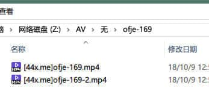

解决方法很简单：

1.  用EverAver抓取并`重新命名`其中一集，获得封面与`nfo`文件。
    
2.  用编辑器打开并编辑`nfo`文件。
    
    在`<title>` `<poster>` `<thumb>` `<fanart>`四个tag的文件名末尾，添加数字代表集数，我用的是CD1 / CD2 / CD3。
    
    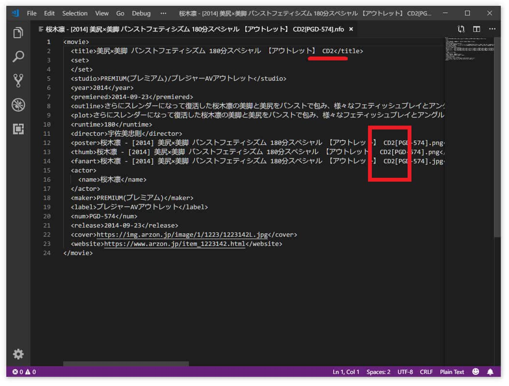
    
3.  **重命名硬盘里的图片 / 视频 / nfo文件，让它们与`<poster>` `<thumb>` `<fanart>`指定的文件名保持一致。**
    
4.  重复上述操作，直到**每集都修改完毕**，最后以`影片名字`新建一层文件夹，将影片全部拖入即可：
    

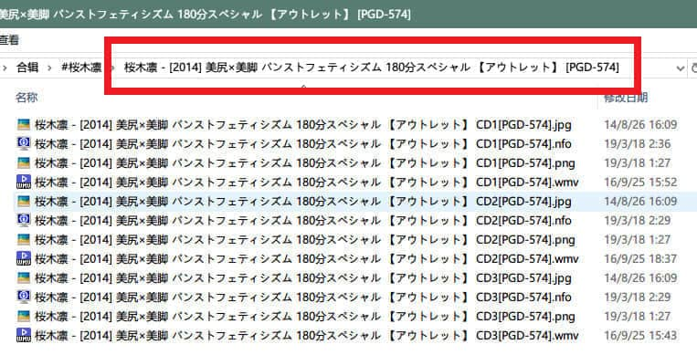

在Emby中，其它集数将作为“附加内容”展示。

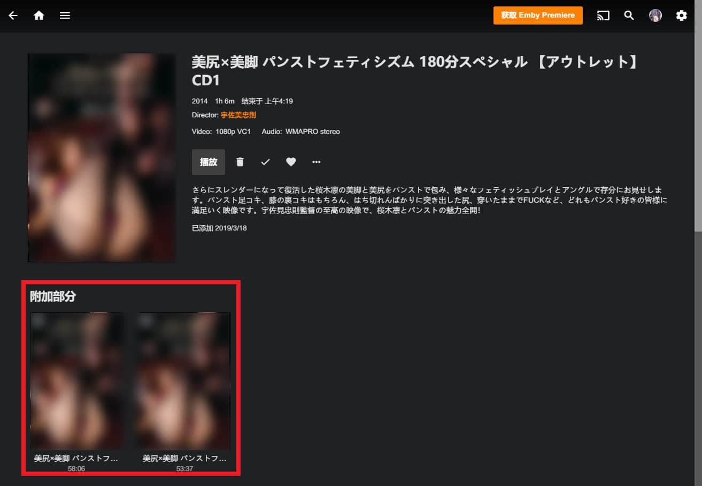

* * *

`元数据`部分的教程至此结束。

现在让我们泡壶红茶，放段评书，**重复以上操作，直到片库整理完毕。**

最终完成效果如图（右键查看大图）：

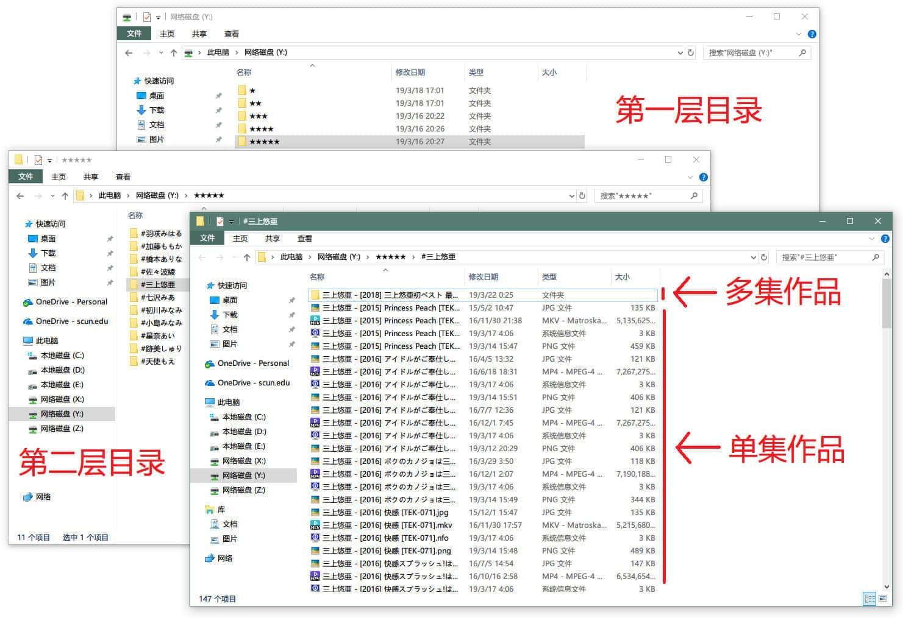

# 服务端 / Emby[](#%E6%9C%8D%E5%8A%A1%E7%AB%AF--emby)

#### Emby与Plex[](#emby%E4%B8%8Eplex)

市面上成熟的本地媒体库工具，无外乎[Emby](https://emby.media/index.html)与[Plex](https://www.plex.tv/)。

*   **在搭建AV / 里番的媒体库上：**

Plex根本**无法正确读取**我们手动抓取创建的`nfo`文件与封面，直接出局。

*   **在搭建普通电影 / 动画的媒体库上：**

Emby的`刮削器（metadata agents）`更加强大，并且集成官方插件库，非常方便。

*   **在移动客户端上：**

Plex除网页与桌面客户端外的**所有移动客户端**均需要购入会员解锁使用。

Emby类似，但Android客户端能**免费使用**。

*   **在TV客户端 / Kodi插件上：**

两者的官方TV客户端都是废品，Plex不支持本地硬解（现在似乎支持了），Emby则无法识别有线网络连接，**并且都收费。**

作为TV客户端的免费替代，Plex的Kodi插件非常简陋。

Emby则官方提供emby与embycon两套插件，前者能拉取媒体库，后者能浏览媒体库的本地目录，并提供一套风骚的Kodi皮肤。

*   **在服务迁移上：**

**Emby有一个开源分支替代，Plex则相对封闭。**

此前因不满Emby的闭源决定，由用户社区独立出的[Jellyfin](https://jellyfin.github.io/)在功能乃至界面上与Emby无异，并且自由免费。

如果未来Emby官方出现作死问题，在数据上可以完全无痛的迁移到[Jellyfin](https://jellyfin.github.io/)。

_（※[Jellyfin](https://jellyfin.github.io/)的客户端目前问题不少，不推荐需要稳定体验的普通用户使用。）_

#### 安装Emby并添加媒体库[](#%E5%AE%89%E8%A3%85emby%E5%B9%B6%E6%B7%BB%E5%8A%A0%E5%AA%92%E4%BD%93%E5%BA%93)

打开[Emby官网](https://emby.media/download.html)，按照您的NAS系统下载安装对应的`Emby服务端软件`：

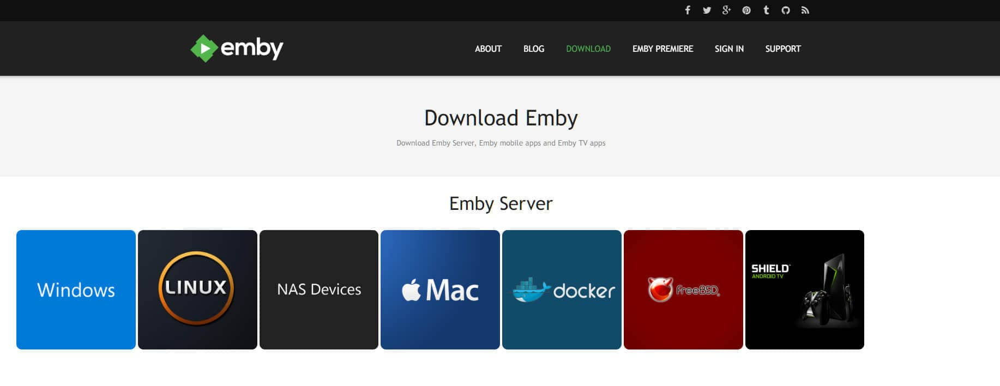

安装完成会弹出设置引导，选择您的语言，然后`下一步`。

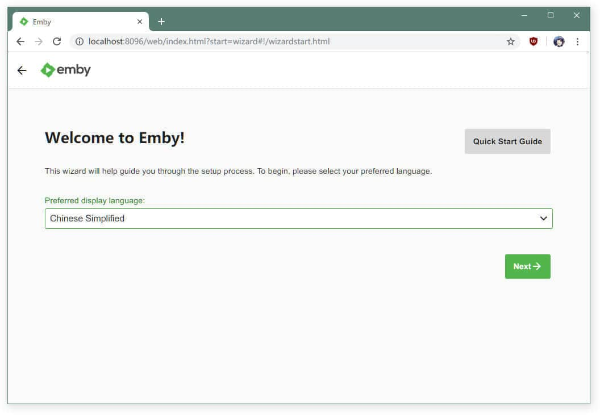

`添加媒体库`推荐跳过，直接`下一步`。

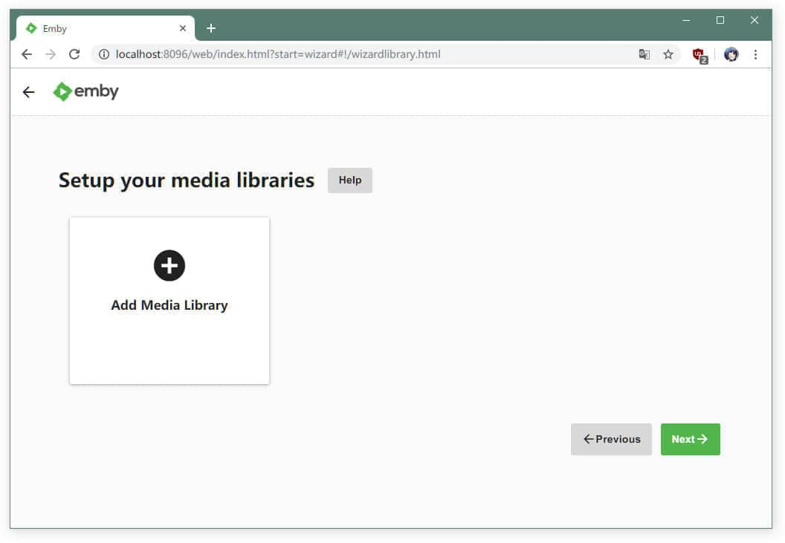

首选`元数据（metadata）`的语言/国家，选择“日本”并`下一步`。

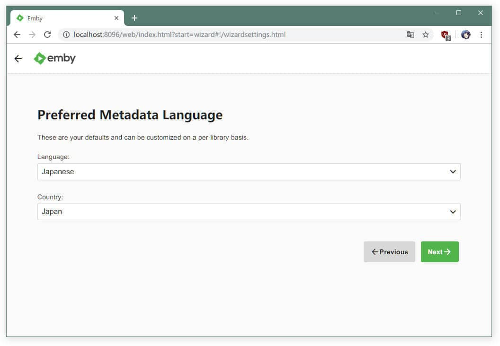

剩下几页保持默认，一直`下一步`直到完成引导。

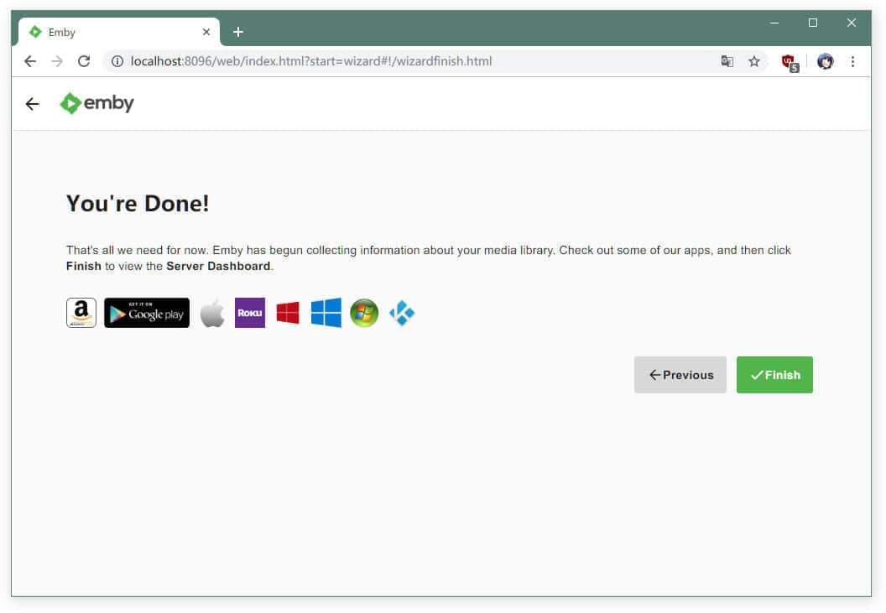

如果您在引导开头将语言设置为`简体中文`，请重启`Emby服务端软件`以生效。

在浏览器输入网址 `您的Emby服务端本地IP:8096` 进入Emby主页面；

点击左上角“汉堡菜单”→`管理服务器`进入控制台。

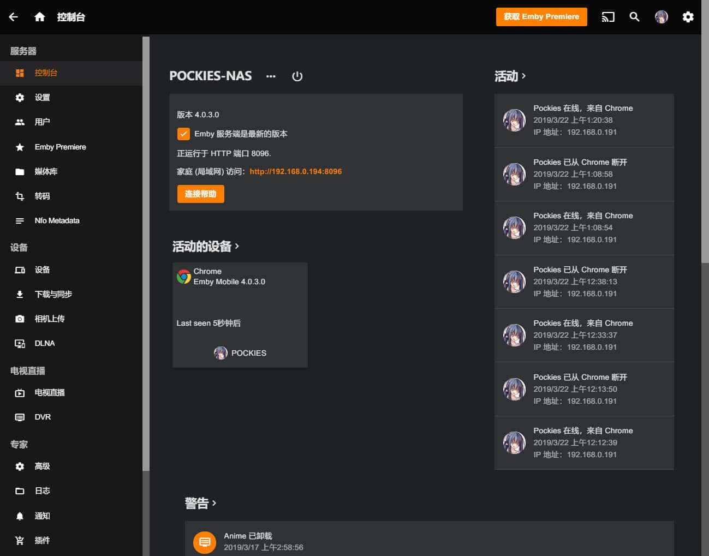

左侧每个项目都可以进去看看，按需开启/关闭功能，比如开机启动 / 转码方式 / 定制通知之类，不做赘述。

我个人关闭了DLNA，并删除了完全用不上的自带`刮削器`插件，只保留了两个。

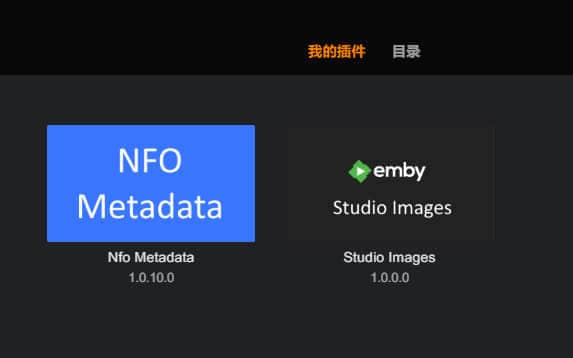

最后选择`媒体库`→`添加媒体库`。

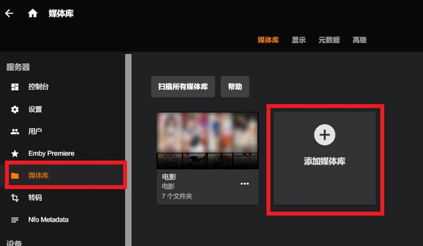

`内容类型`内选择`电影`，勾选右上`显示高级设置`，点击“+号”添加我们此前整理的AV文件夹。

`媒体库设置`则按图勾选（实时监控自行选择是否开启）：

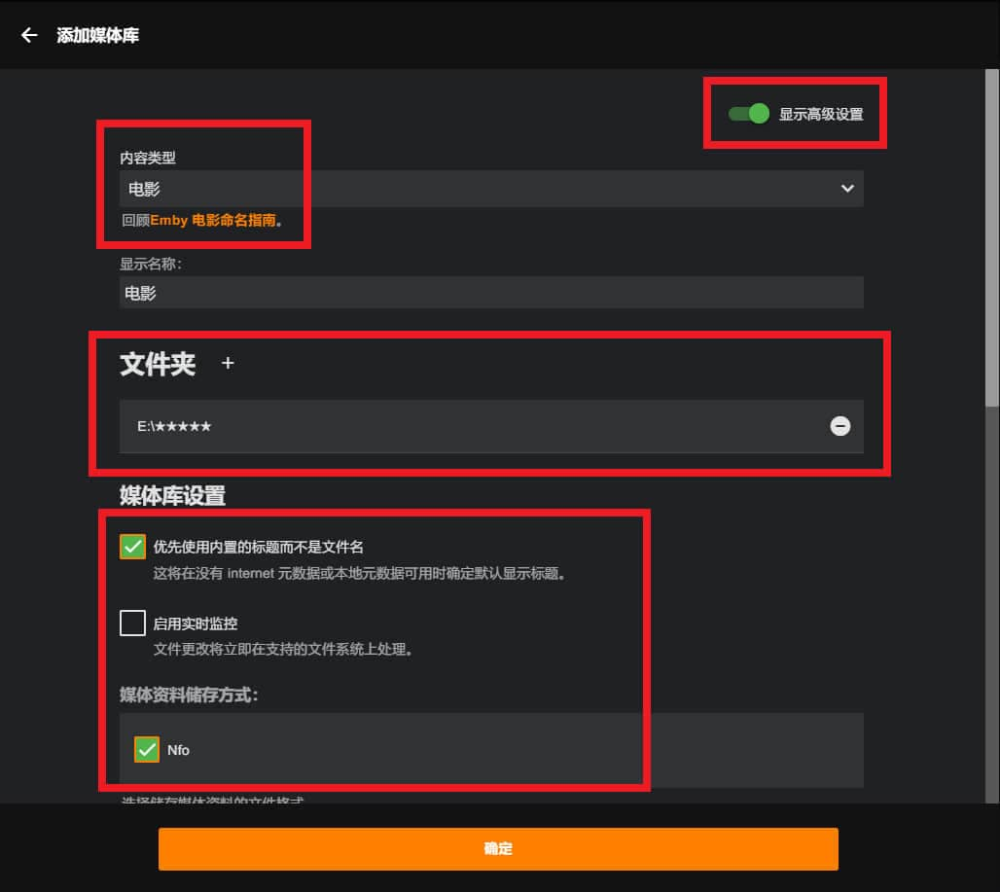

其它保持默认，`确定`后回到控制台，点击`扫描所有媒体库`。


#### 自定义Emby皮肤[](#%E8%87%AA%E5%AE%9A%E4%B9%89emby%E7%9A%AE%E8%82%A4)

Emby原生支持自定义css，[官方论坛](https://emby.media/community/index.php?/forum/144-web-app-css/)中有很多样式。

我选择了一个简单的[暗色主题](https://benzuser.github.io/Emby-Web-Dark-Themes-CSS/)，只需进入[网站](https://benzuser.github.io/Emby-Web-Dark-Themes-CSS/) 点击你喜欢的颜色，css代码便复制到了剪贴板。

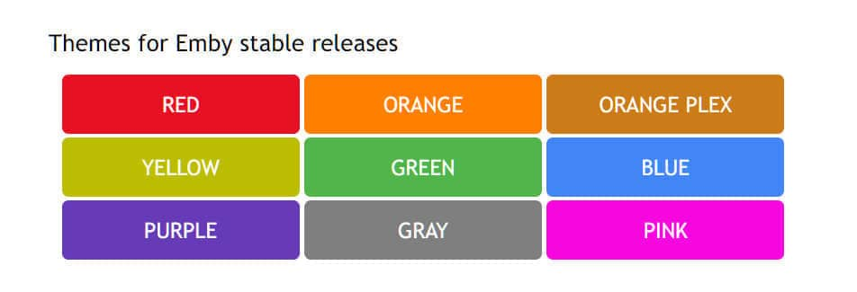

回到Emby控制台，进入`设置`，将代码粘贴至`自定义css`，`保存`并刷新网页即可。

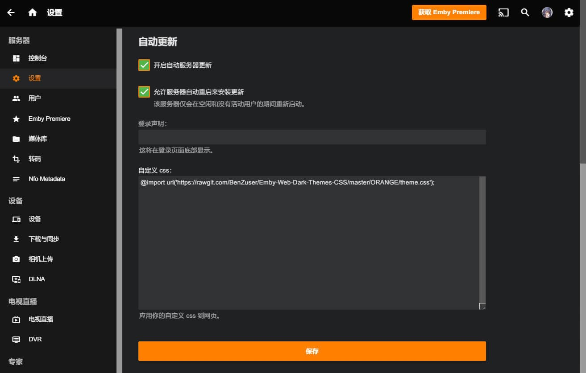

#### 多用户管理+骚操作[](#%E5%A4%9A%E7%94%A8%E6%88%B7%E7%AE%A1%E7%90%86%E9%AA%9A%E6%93%8D%E4%BD%9C)

Emby有非常强大的“多用户管理”功能。

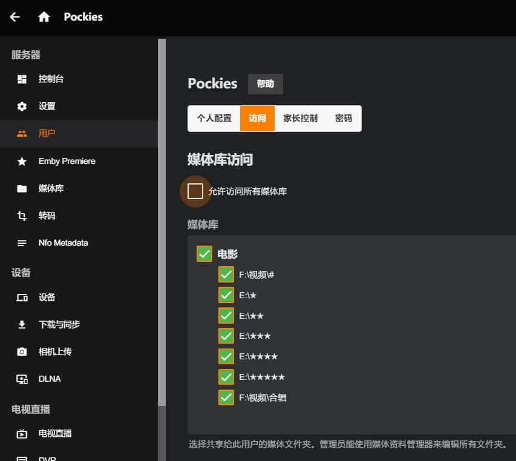

可以额外添加多个“用户”，并指定用户的媒体库编辑/访问权限，做到每个账户都能拥有“专属”的媒体库，如：

*   “电影”给老爸；
*   “韩剧”给老妈；
*   “卡通”给小鬼；
*   “毛片”给弟兄。

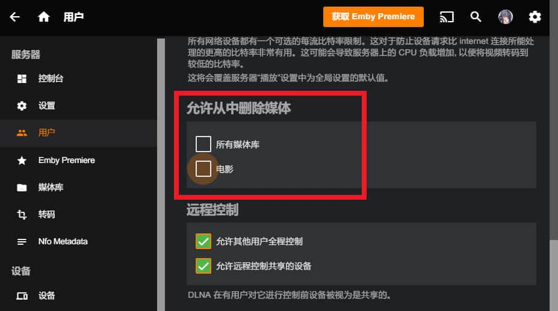

这里我们重点注意`删除`权限的管理。

**——任何账户都最好关闭`删除媒体`的权限，以防悲剧。**

**（emby的“删除视频”是彻底删除，没有挽回余地）**

而当你的弟兄们正通过Emby客户端访问媒体库，并开始看片儿时。

你不仅能通过网页`控制台`暂停 / 播放 / 停止客户端正在播放的视频，还能直接拖动的它的进度条。

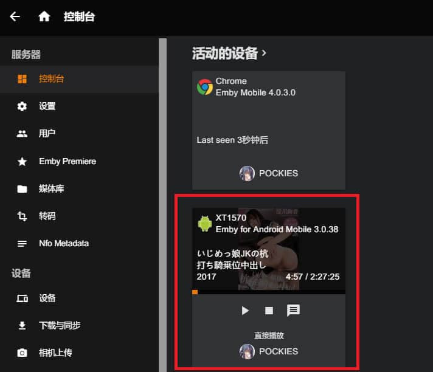

你甚至能向客户端发送消息文本：

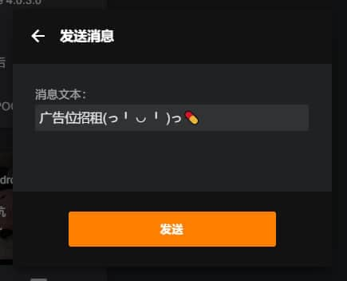

将在客户端左下角弹窗显示：


~可以用来恶作剧，比如发一整段的[《般若心经》](https://zh.wikipedia.org/wiki/%E8%88%AC%E8%8B%A5%E6%B3%A2%E7%BE%85%E8%9C%9C%E5%A4%9A%E5%BF%83%E7%B6%93)在对方性致昂然时盖住对方屏幕。~

*   **~※本操作引发的一切后果请自行承担。~**

#### 一切努力都是值得的[](#%E4%B8%80%E5%88%87%E5%8A%AA%E5%8A%9B%E9%83%BD%E6%98%AF%E5%80%BC%E5%BE%97%E7%9A%84)

由于我们已经用EverAver抓完`元数据`并做好分类，Emby导入媒体库的过程其实飞快。

当媒体库扫描完成后，让我们重返Emby首页。

**——本地AV媒体库已经完全成型：**


点击`我的媒体`下的`电影`即可进入完整列表，浏览 / 筛选 / 搜索影片：


点进一部影片，我们抓取的所有`元数据`都正常显示，Emby还会向您贴心推荐“更多类似”：

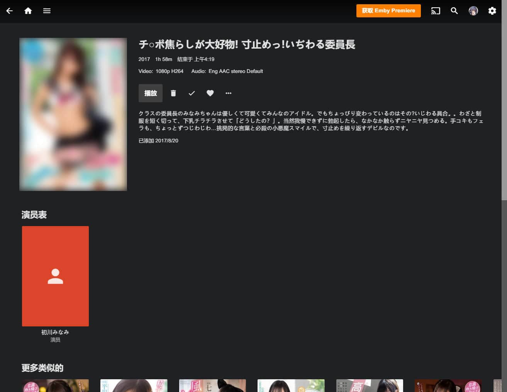

由于都是些“俩人就能演完的小电影儿”。

Emby这套为普通电影 / 动画 / 电视剧设计的布局，在只有一个“女演员”时会显得很空。

让我们点击老师名字，她的参演作品也将完整呈现：

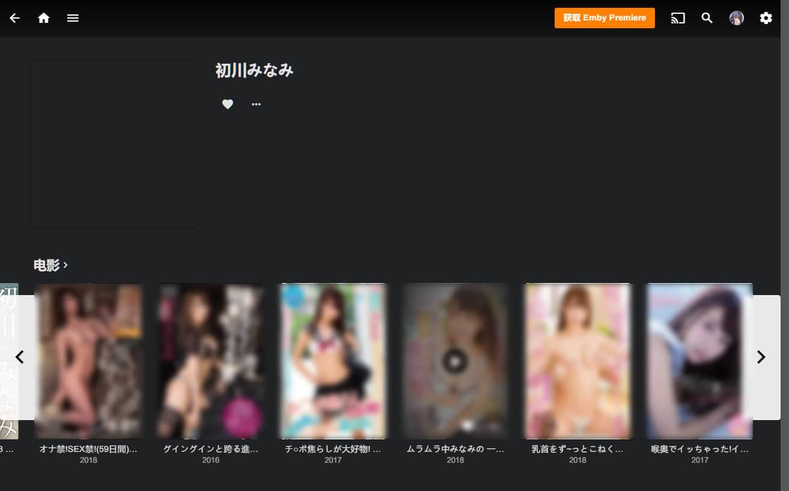

进入`文件夹`，此前我们按“星级”归类的文件夹，同样可以通过Emby网页/客户端直接浏览。

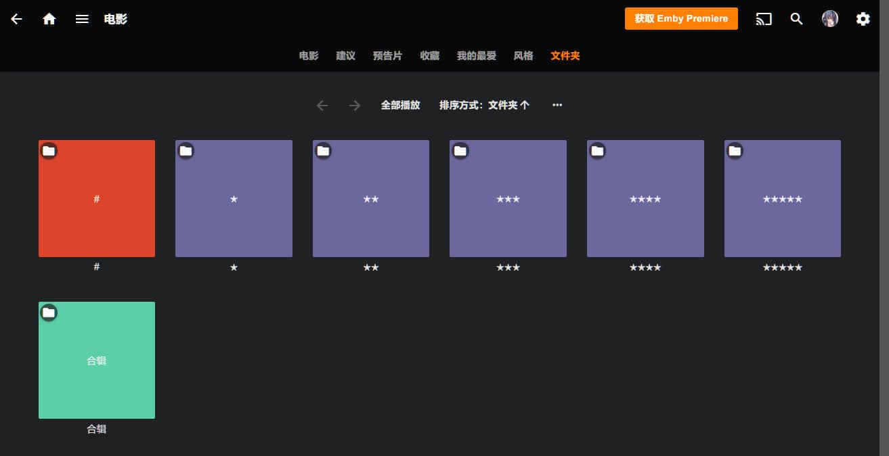

这时的浏览逻辑已经与windows资源管理器无异，点进一个文件夹就能看见我们之前按`#演员名字`命名的目录。

还有作品封面作为文件夹预览，从此不怕忘记老师是谁！


> 是啊，我们一直以来累积的东西并没有白费。
> 
> 今后也是，只要我们不停下脚步，道路就会不断延伸——

**所以，所以啊！**

**——不要停下来啊！（指丰富本地毛片库）**

`服务端`部分的教程至此结束。

# 客户端 / Kodi[](#%E5%AE%A2%E6%88%B7%E7%AB%AF--kodi)

上文`服务端`部分已经在开头提到，Emby/Plex的TV端不仅废品还收费。

所以推荐使用[Kodi](https://play.google.com/store/apps/details?id=org.xbmc.kodi)+插件作为TV端，来做到0成本的本地解码播放。

*   **※鉴于Kodi的操作逻辑异常反人类，本部分将以详细图文的形式写教程。**

#### 设置Kodi为中文[](#%E8%AE%BE%E7%BD%AEkodi%E4%B8%BA%E4%B8%AD%E6%96%87)

打开Kodi，进入`系统`设置。

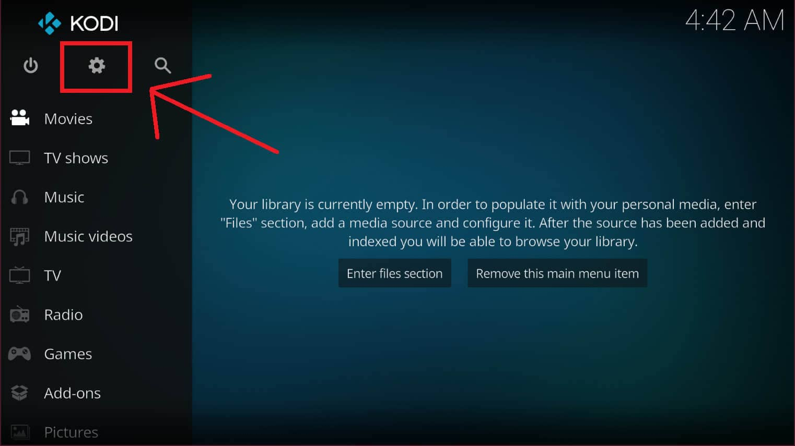

进入`Interface`。

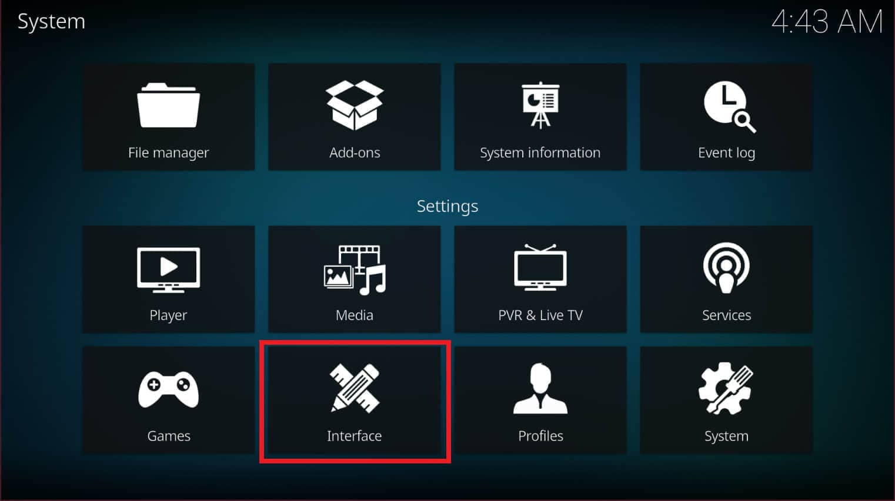

将`Fonts`修改为`Arial based`。

**（无论语言为何都必须修改字体，默认字体将无法显示AV媒体库中的日文。）**

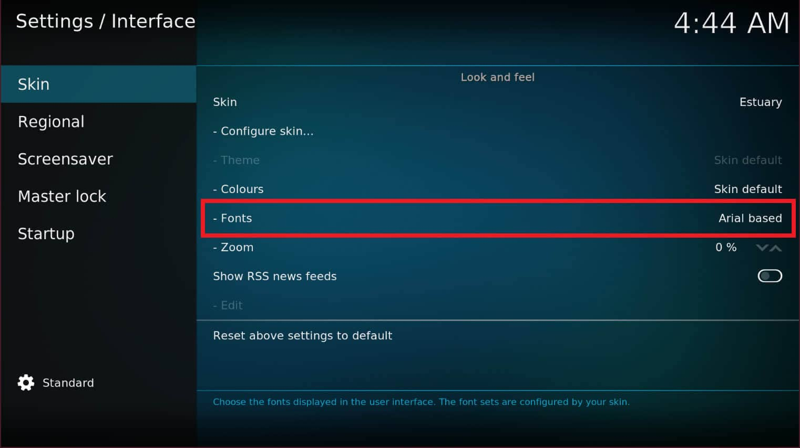

进入`Regional`，修改语言为`中文`。


#### 添加Emby官方源并安装插件库[](#%E6%B7%BB%E5%8A%A0emby%E5%AE%98%E6%96%B9%E6%BA%90%E5%B9%B6%E5%AE%89%E8%A3%85%E6%8F%92%E4%BB%B6%E5%BA%93)

回到`系统`设置，进入`文件管理`。


点击`添加源`。

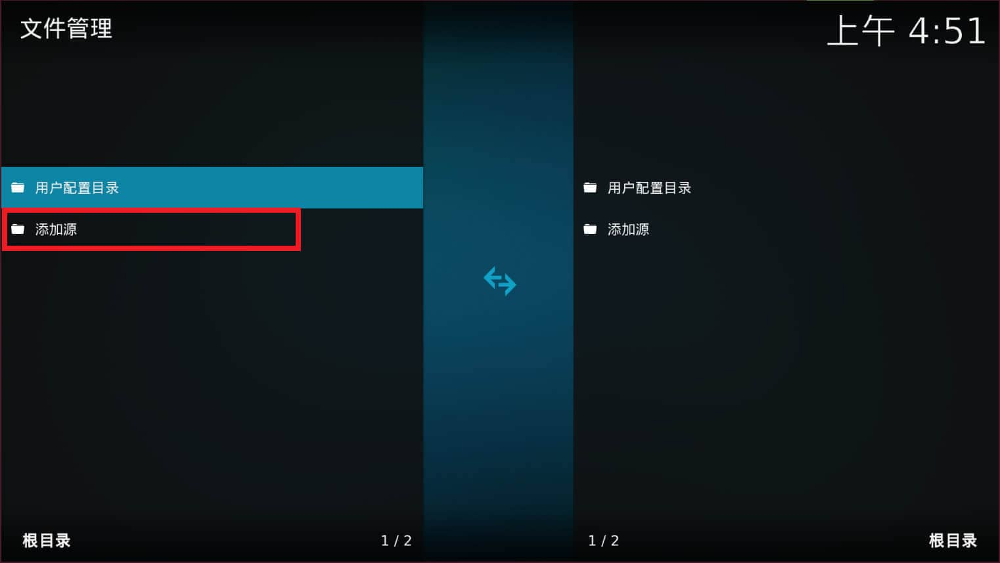

输入路径`http://kodi.emby.media`，命名为`emby`后确定。

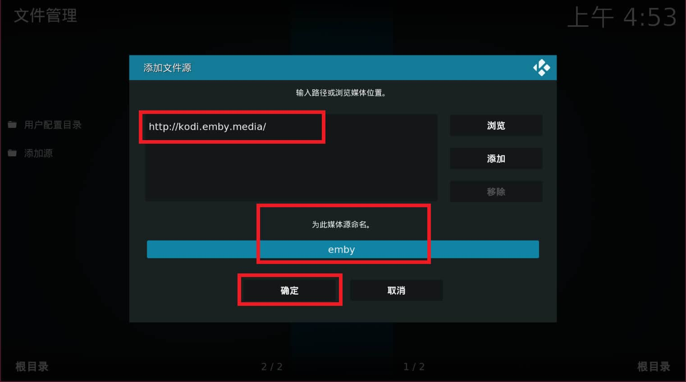

回到`系统`设置，进入`系统`。

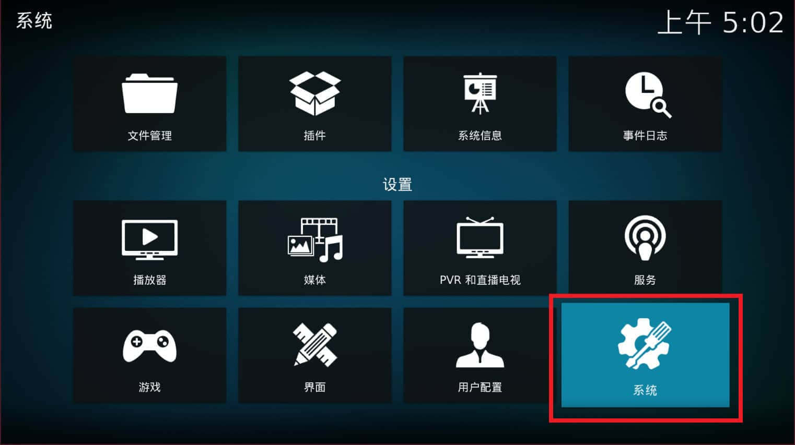

选择`插件`，将`未知来源`打开。

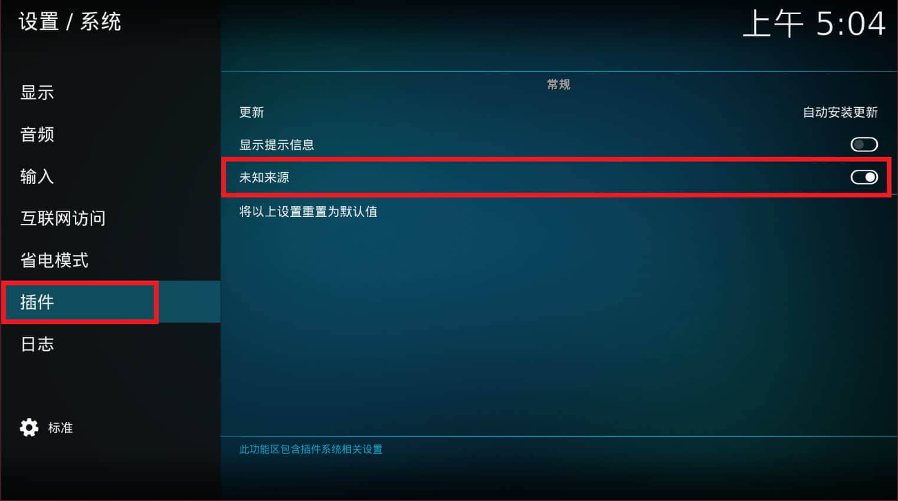

回到`系统`设置，进入`插件`。

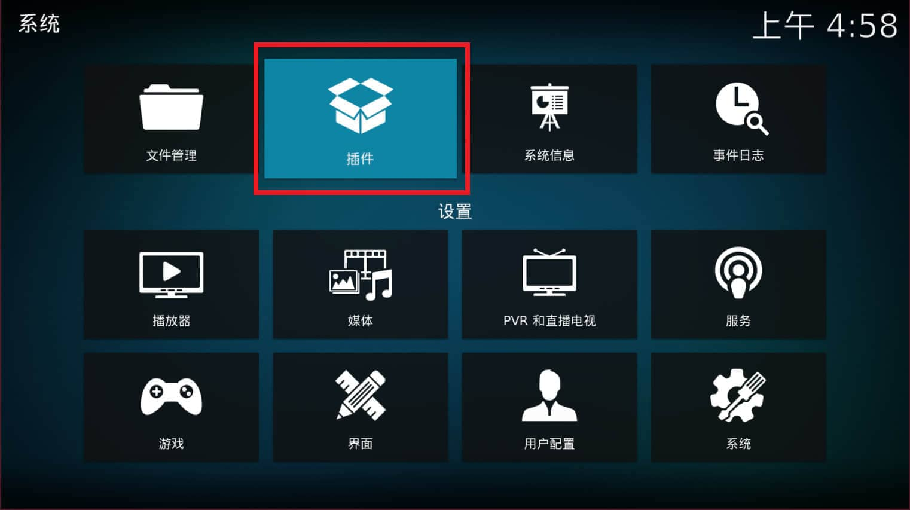

点击`从zip文件安装`。

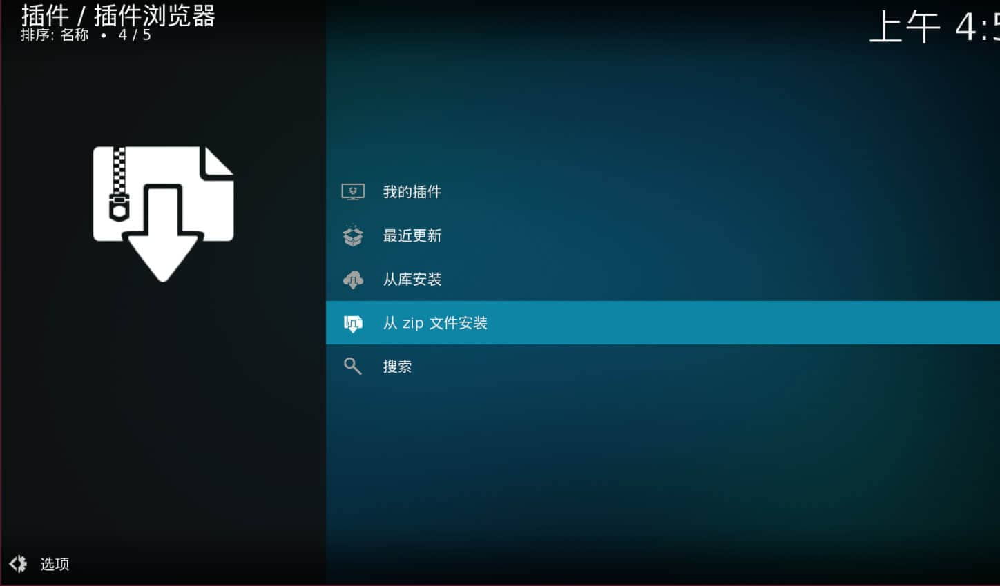

进入我们刚刚添加的`emby`。

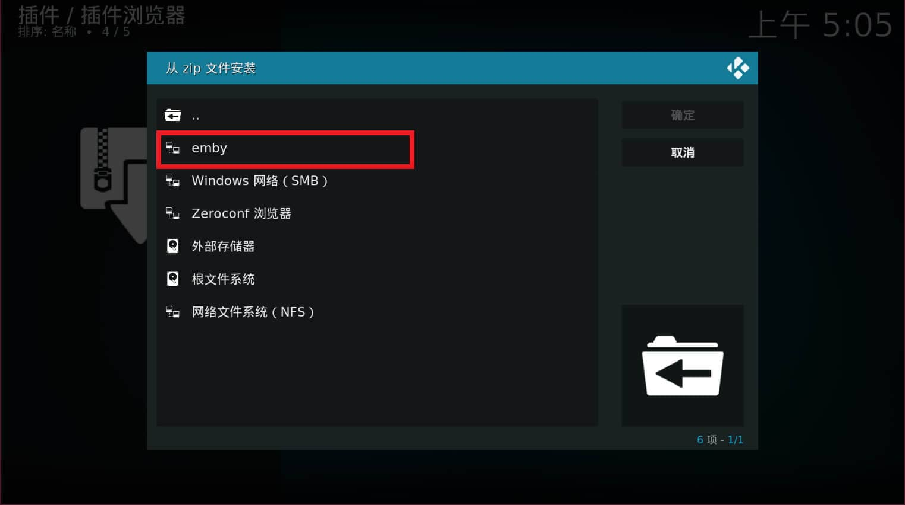

点击`repository.emby.kodi-1.0.4.zip`以安装插件库。

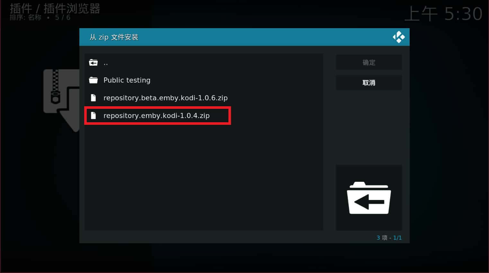

#### 安装Emby视频插件[](#%E5%AE%89%E8%A3%85emby%E8%A7%86%E9%A2%91%E6%8F%92%E4%BB%B6)

插件库安装完毕后，点击`从库安装`。


按目录进入`Kodi Emby Addons`→`视频插件`→`Emby`。

点击`安装`。

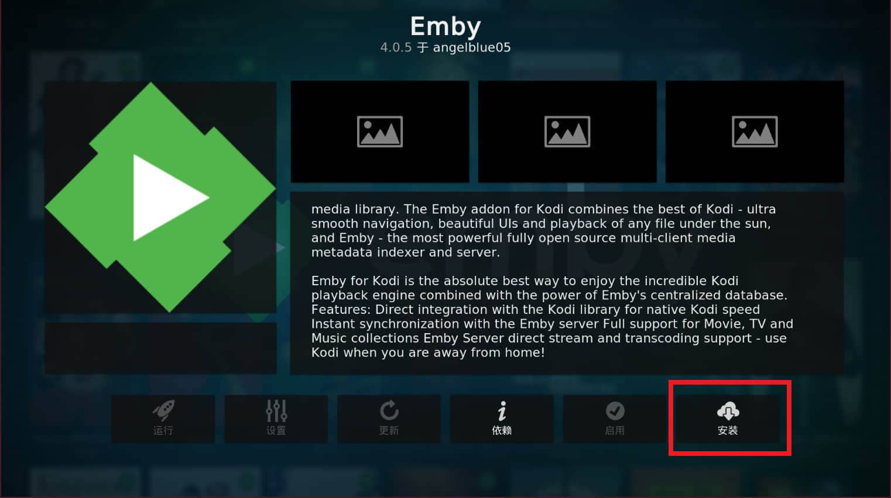

安装完毕会弹出配置对话框。

一般会自动扫描到服务端，比如我的NAS。

如果没有，则点击`Manually add server`手动输入您的服务端ip与端口。


连接服务端后点击用户头像登录。


随后会弹出一系列对话框，如：

1.  选择图片缓存方式；
2.  是否同步empty（没用选“否”）；
3.  是否同步烂番茄评分（更没用同样选“否”）之类。

请按需选择。

最后会让您选择需要同步到Kodi的媒体库，点击`Proceed`继续。


选择您想同步的媒体库名称（如我的AV媒体库就叫“电影”）后`确定`便开始同步。


同步会很快完成。

返回Kodi主页，能看到Emby里的“小电影”已经全部出现在Kodi中。

如果没有进阶需求，此时就可以完成Kodi配置并投入使用了。


#### 调整Kodi快进速度[](#%E8%B0%83%E6%95%B4kodi%E5%BF%AB%E8%BF%9B%E9%80%9F%E5%BA%A6)

Kodi默认快进/快退速度非常反人类，推荐调整。

打开`系统`设置，进入`播放器`。


将`跳过步骤`改为如下设置即可。


#### 换上Embuary皮肤[](#%E6%8D%A2%E4%B8%8Aembuary%E7%9A%AE%E8%82%A4)

Kodi的默认皮肤长得过于“避孕”，好在emby官方提供了一套风骚的Kodi皮肤——Embuary。

打开`系统`设置，进入`插件`。


按目录进入`从库安装`→`Kodi Emby Addons`→`界面外观`→`皮肤`。

选择对应Kodi版本的皮肤并安装。


**安装完毕不要立即切换，会乱码。**

打开`系统`设置，进入`界面`。


切换皮肤到`Embuary`。


然后顶着乱码点**左侧的“按钮”**，以确认切换皮肤。


再顶着乱码把字体改为`Arial`，随后字体显示恢复正常。


回到Kodi首页会弹出提示，选择`OK，do it for me`。


Emby皮肤安装完毕。

~从此，Kodi无论主页还是播放控件都成了Emby的形状：~


此前提到的“多集作品”，同样可以正常播放。

点击播放控件的“列表按钮”便能选择集数。


除此之外，这套皮肤还有丰富的界面自定义功能。

打开`系统`设置，进入`皮肤设置`就能自定义首页控件。


这部分写起来过于繁琐，推荐修改的项目已用红框框出，请自行研究。


我个人将`标题` / `年份` / `演员` / `制作公司`几个项目添加到主页`menu`方便快速筛选，并移除了`游戏` / `插件` / `android应用`等无用项目。

`widget`同样移除一堆无用项目，修改皮肤配色后的最终成品如图：


#### 选装EmbyCon视频插件[](#%E9%80%89%E8%A3%85embycon%E8%A7%86%E9%A2%91%E6%8F%92%E4%BB%B6)

EmbyCon的用处只有一个，就是配合Embuary皮肤使用时，能快速访问我们此前在NAS上按“星级”归类的本地文件夹。

无此需求不用安装。


打开`系统`设置，进入`插件`。


按目录进入`从库安装`→`Kodi Emby Addons`→`视频插件`→`EmbyCon`。

选择版本号高的安装。


按提示填入你的Emby服务端ip与端口，选择账户并登录。


如果你已经装好Embuary皮肤，此时会发现首页多了个“入口”控件。


进入后就能看见本地文件夹了。

#### 连接Kore遥控器

由于Kodi“太重”，各项操作都不跟手，于是决定用手机遥控器提升体验。

遥控器用的[Kore](https://play.google.com/store/apps/details?id=org.xbmc.kore)，干净免费功能强大。

配置虽然有[官方教程](http://syncedsynapse.com/kore/kore-faq/)，但已经过时，所以这里将重新总结：

打开`系统`设置，进入`服务`。


开启红框内的项目即可。

（端口为避免冲突，改为`8083`之类就好。）


掏出手机，打开Kore，马上就能扫描到你的Kodi，点击添加。

没有就按照提示，手动输入电视盒子ip与刚刚修改的Kodi端口添加。


添加成功后能通过手机浏览媒体库，控制视频播放，快速关闭Kodi，etc.

最实用的莫过于可以在手机上“拖拽”控制Kodi进度条。


#### 别忘了设置Kodi密码！

**——无数前人用[血的教训](https://raw.githubusercontent.com/Pockies/pic/master/741f9461ly1g1faqmvg43j20eg0lx76n.jpg)告诉我们：做事要锁门。**

打开`系统`设置，进入`用户配置`，开启`启动时显示登录界面`。


进入左侧的另一个`用户配置`，点击`Master user`。


进入`锁定偏好设置`，在`管理员锁定`一栏添加密码并`确定`。

其它项目保持默认即可。


重启Kodi，此时就会要求密码登录了。


`客户端`部分的教程至此结束。

* * *

**全部教程也至此完结。**

**若您能从本篇指南中获得一点参考，将是我最大的荣幸。**

# 尾巴

做完片库，写完文章，我坐在电视机前，优雅的褪去裤子。

左手端着红茶，右手握着法杖——

——屏幕中`1920*1080`的日本工作女性正以`29.96 fps`的稳定帧率朝我微笑。

——她婀娜着身姿，透过喇叭传出`48kHz 16bit`的撩人娇声。

* * *

曾几何时，拥有自搭AV片库是我的一大梦想。

**当梦想实现之时，一切竟索然无味。**

本次片库的完整搭建耗时不过一周，搭建完成后却没再使用，以至于拖到月底才整理成文。

**一点一点搭建出片库的折腾过程，其乐趣早已凌驾于影片本身。**

* * *

关闭电视，掏出手机。

点开由田辺京老师绘制的儿童色情漫画——

**~——“还是纸片人适合老子。”~**
