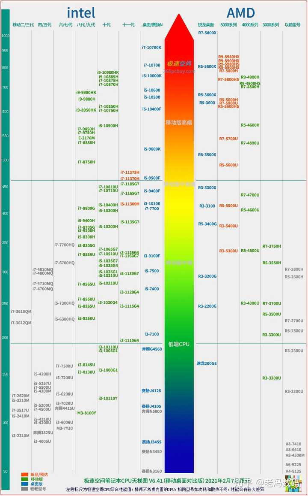
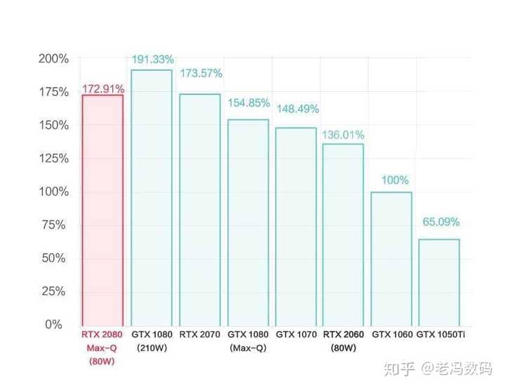
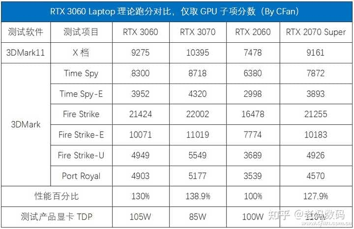
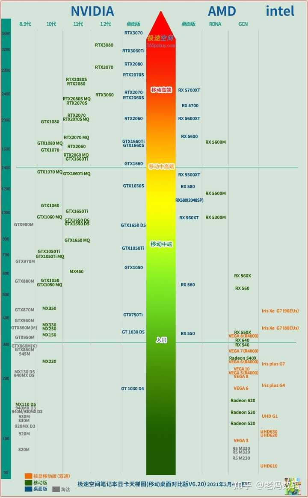

首先，你在买笔记本之前，需要考虑两个关键问题：**预算**和**需求**

## **预算**

预算很好理解，即你有多少钱来买笔记本。一般来说，我把笔记本预算分为以下几个档：

5000元以下：这个档位**电子垃圾**层出不穷，轻薄本还有一些不错的，高性能笔记本/游戏本大部分都有**或轻或重的缺陷**，例如瞎眼屏幕，垃圾散热等等。一般来说如果你对性能需求不大，仅仅是看看视频，上上网，聊个微信qq炒个股票的话，这个档位的大部分机型足够满足你需求了。但是如果你要一款高性能笔记本，用来打游戏/跑CAD/视频剪辑渲染的话，**建议加钱**

5000元-8000元：这个价位神机辈出，不管是高性能笔记本还是轻薄本，都有各方面均衡的产品，这也是绝大部分人的预算区间，同时也是各大品牌的走量机型的主要区间。因此这一区间我也会尽量多介绍一些。

8000元-15000元：各家品牌炫技机型的集中价位区间之一，这一价位普遍是各家品牌的**中高端产品线**，不管是配置还是散热均属于不错。

15000元以上：旗舰机价位区间，凡人钱包无力支撑的价格，我闻到了土豪的味道。

## 需求

以我过去推荐笔记本的经验来看，绝大部分人的需求可以分成两类：

一类是**性能需求**，即要求笔记本有尽可能强大的性能，不管是处理器性能还是显卡性能的需求，都属于性能需求。一般来说买笔记本都是为了**游戏，制图，3D渲染，剪辑视频**等等需求。同样，对应这种需求的笔记本普遍为了性能牺牲了便携性，**重量可观**，习武之人必备。

这种类型的笔记本我称之为**高性能笔记本**

二类是**便携需求**，要求笔记本在能完成基本任务的前提下尽可能做到便携。适合需要**经常出差的办公党，泡图书馆的学霸，体力不足的娇软萌妹**。对应这种需求的笔记本往往重量控制都比较优秀，但是同样为了续航和轻量化，不会配备高性能的CPU和GPU，而是使用低压处理器这种省电的配置。不过性能方面你大可以放心，常规的word，PPT，看视频，上网，聊qq微信等都能满足。

这种类型的笔记本我称之为**轻薄型笔记本**

注意，这二者是不可调和的矛盾性需求，即**追求性能就不要考虑轻薄，追求轻薄就别考虑性能**。因为性能起来了，发热量必然大，就必须配备多个散热风扇和铜管来进行散热，带来重量上的增加。当然市面上也有轻薄+高性能的笔记本，例如雷蛇零刃系列，但是普遍**铁板煎熊掌**，表面温度热的一批，使用体验比较糟糕一些。同时价格也贵出天际，例如刚才说到的雷蛇零刃，其15寸独显机型一万五开外。

这里，可能有很多学生党要问了：我既要玩大型3A游戏，又想经常带去图书馆自习，我应该怎么选呢？

**个人建议**，优先选择高性能笔记本。虽然高性能笔记本动辄2Kg-3Kg的重量，但是对于绝大部分人并不是一个不可以接受的重量，短途负重（10分种内）不会是太大的负担。

另外，对于有专业性需求的，例如环艺，计算机，动画，视频剪辑等专业或者领域（需要**使用AE，3DMax，MAYA，CAD等等**），你们没得选，**一定要上高性能笔记本（工作站）**。毕竟笔记本是你们吃饭的家伙，如果连个作业or项目都做不了，这笔记本基本就白买了。

## 购买渠道

购买渠道的话，业内公认首推京东，其次天猫or苏宁，最后淘宝。京东最大的优势就是售后，不管你在中国哪个角落都可以使用京东的送修通道。对于联想戴尔这些品牌而言还好说一点，基本二三线城市都有售后点，小米华为机械革命等品牌全国售后网点很少，走京东的送修更方便一些；如果是天猫苏宁购买的话需要联系当地品牌官方实体维修点来售后，一旦新买的机子出了问题需要找当地的维修点出具报告才能退换，相对而言麻烦一些。

至于实体店，奸商凶猛，我就不多说了，知乎很多对实体店的血泪控诉，搜一下就能看到了。9012年了没有必要去实体店买笔记本了。

  

## 笔记本配置的基本知识

### CPU

CPU是笔记本核心部分，CPU的强弱决定了你网站和软件的打开速度，程序编译速度，文件解压压缩速度和非线编视频剪辑渲染速度等等。

目前你能买到的CPU品牌只有两个：**英特尔**和**AMD**。

英特尔，外号牙膏厂，因为年年性能提升都不大，最近十年只有第七代酷睿升第八代性能提升较大，其他都跟挤牙膏似的，故得名牙膏厂。2020年以前牙膏厂占据笔记本市场主流，但是！2021年由于AMD全面碾压了英特尔，因此今年很有可能出现五五开的局面

AMD，外号农企。过去移动端产品线很少，但是随着这几年性能的巨量提升，AMD也逐渐在笔记本市场开始发力，2021年AMD发布了11款型号的新处理器，标压版8款，低压版6款。后面我会详细讲解一下哪款值得购买

说完品牌，再说分类。CPU目前有两个大类：**低压处理器**和**标压处理器**。

**低压处理器**耗电量低，续航强，但是无法长时间维持高性能，一般情况性能比标压要差一些一般用于轻薄笔记本。**标压**性能强，但是续航捉急，一般用于游戏本，高性能笔记本，移动工作站上。

**低压处理器**结尾以**U**来结尾，例如i7-10710U，R5-4600U。**标压处理器**英特尔一般以**H**为结尾（过去以QM，HQ为结尾），例如I5-9300**H**。另外还有以HK结尾的高端CPU，意思是不锁倍频，例如i9-8950HK，一般只有顶级发烧友或者工作站需求才会买这种。

另外，今年的英特尔低压U有的在命名最后挂着G7，G1等字样，例如i7-1065G7 .这个G代表的是集成显卡性能等级。你只要知道G1最差G7最强即可，性能是按照G后面的数字排列的。集成显卡再强玩游戏也吃力，因为集显运行需要占用一部分内存，导致性能损耗。

  

另外，**赛扬处理器和奔腾处理器，性能太弱，不建议选购！**

  

**简单点评一下英特尔和AMD的2021年新款CPU：**

AMD低压六款：**R7-5800U、R7-5700U**、**R5-5600U**、R5-5500U、R3-5300U、R3-5400U

值得推荐的就是上方标黑的三款。其中需要特殊说明的是，R5-5600U是六核十二线程， Zen 3 架构。相较于上一代Zen2架构的4600U性能提升了大约20%，但是集成显卡性能并没有太大变化。去年4600U被联想包场了，今年5600U大概率还是被联想包了，而联想也是出了名的供货不足。因此买不到也可以退而求其次买六核十二线程的R5-5500U，5500U是4600U的马甲U，名字不一样但是本质是一个东西，都是Zen2架构

AMD标压八款：**R9-5980HX、R9-5980HS、R9-5900HX、R9-5900HS、R7-5800H、R7-5800HS、R5-5600H、R5-5600HS**

都值得买，理由看一下英特尔就知道了

英特尔标压三款：i7-11375H、i7-11370H、i5-11300H

其中的旗舰级i7-11375H只有四核八线程····英特尔你在搞什么？上一代i5-10500H还是六核十二线程，这一代直接回到五年前了？！你家旗舰级和对面的低端货R3一样的线程核心数，今年这是直接举白旗了吗？

英特尔今年是完全溃败，暂时不建议购买英特尔的任何移动端处理器。然而由于厂商的惯性和AMD本身产能限制，估计还是会有很多新本搭载英特尔处理器。我的观点是能不买则不买。

另外，由于AMD老大苏姿丰明确表示2021年不会再打价格战了，专注于提升产品利润，因此今年价格会上涨不少，”AMD，YES“估计喊不出来了。

另附2021年CPU性能天梯图，红色标志的是今年新款CPU：

### 内存

内存决定了你能同时运行多少程序，另外绝大部分专业软件和游戏都有内存容量要求，例如战地5要求至少8G内存，你4G内存的游戏本都打不开游戏。

在2020年的今天，个人认为笔记本选购至少要8G内存，游戏本应当考虑16G或者更大的内存。你想想，win10 64位都占了3.4G的内存，4G内存的本子开网页都开不了太多。

内存现在有DDR3和DDR4两种规格，市面上绝大部分都是DDR4的了，看到DDR3的古董就算了吧。另外内存条的频率也各不一样，2133，2400等等。这个对体验的影响不算很大，频率肯定越高越好，但是2133这种低端货一样能用。

另外，和CPU，显卡不同，大部分笔记本内存是可以加装和更换的。因此内存如果觉得不足可以自己再加一条，构成双通道内存，性能还能有所提升。

但是！

**大部分轻薄本，内存是焊死在主板上的，无法更换和添加！**

因此如果要买轻薄本的话，还是一步到位大内存吧。

  

**高性能笔记本内存容量推荐：16G起步，32G够用**

**轻薄型笔记本内存容量推荐：16G够用，看需求和钱包丰盈程度是否选购32G**

### 硬盘

硬盘的容量决定了你能存多少文件，硬盘的协议和接口决定了你读写文件，打开软件和进入游戏的速度。

目前硬盘有两种规格：机械硬盘（HDD）和固态硬盘（SSD）

机械硬盘主流有5400转和7200转，不管哪种都够慢的。。。。

固态硬盘的分类就多了：

按照接口分的话，有SATA，mSATA，M.2，SATA Express， PCI-E以及U.2；

按照协议分的话，有SATA协议和NVME协议

按照颗粒类型分的话，有SLC，MLC，TLC，QLC四种。

有朋友可能要说，哇这么多分类，不知道怎么挑怎么办啊

其实，这个问题很简单：一般笔记本厂商都是大批量采购某一品牌某一型号的硬盘，这样能够压缩成本。因此**你没得选**2333

厂商给你啥，你就用啥吧，只要记住，**固态硬盘比机械硬盘好得多**就行了。现在，**优先选购配备大容量SSD的机型。**

当然，也可以日后加装。

**高性能笔记本推荐SSD：Nvme协议MLC或者TLC颗粒，256G以上。**

**轻薄型笔记本推荐SSD：啥都行，有就可以了。容量看个人需求和荷包丰盈程度决断**

### 显卡

这一段，如果你不玩游戏或者没有图形性能需求（AE，3DMax，MAYA，CAD等等），那么没必要看，买个配**集显**或者MX450的本子就可以了。

其实说笔记本显卡是不准确的，应该叫显示芯片。台式机那个才叫显卡，只不过大家都说习惯了，懒得改了。

移动端显卡（笔记本显示芯片）也是主要有两个品牌：Nvida，俗称N卡，和ATI，俗称A卡

原先网上有说法，什么A卡色彩好，N卡速度快啥的，作为一个修电脑的业余老师傅，本人表示：都鸡儿瞎扯。论色彩，二者都一样，仅仅是游戏驱动支援方面的差异。一般来说现在大型游戏都优先对N卡优化适配，A卡会稍晚一些，毕竟N卡市场占有率高于A卡。但是也不一定，ATI也和很多游戏公司搞PY交易（送钱送技术），有的游戏反而会优先给A卡适配。

虽然在桌面端（台式机）N卡和A卡互有胜负，N卡性能强，A卡性价比高。但是笔记本显卡主流还是N卡，A卡很少见。

N卡同样有几个系列：

GTX系列：高性能游戏显示芯片，主要是给游戏玩家准备的。2020年比较常见的是GTX1660和GTX1650Ti

RTX系列，N卡旗舰系列，相较于GTX系列增加了光追技术支持，同时性能和规格也要强于GTX系列，例如N卡旗舰RTX3080，次旗舰RTX3070均为RTX系列。

MX系列：低功耗显示芯片，一般用于轻薄本，发热量较低，同时由于功耗较低，延长了笔记本的续航。MX系列仅有M450值得购买，其他都是性能比集显还弱鸡的鸡肋。MX450已经足够玩CSGO和LOL这一类低性能需求的游戏了。

另外，部分N卡后缀有一个MAX-Q的标志（有的写作MAQ)，你可以看作是该显卡的低功耗版本，而标注MAX-P则是该显卡的完全版（啥都不标的一般都是MAX-P）。例如RTX3060就有80W、90W、115W三种不同的功耗，功耗越大，性能越强，发热量也就越大，对模具的要求也就越高。由于超高功耗必须搭配更强的散热系统，而更强的散热必然导致成本升高，售价升高，因此目前来看大部分厂商均不愿意采用高功耗版本的GPU。

往年我还会批评一下这种情况：

> 举个简单点的例子：微星旗舰笔记本GS75配备的是RTX2080 Max-Q 80W版，次旗舰笔记本GE75配备的是RTX2070，二者差价9000元，但是在显卡上的差距呢？

> 次旗舰干掉了顶级旗舰，可喜可贺可喜可贺（滑稽

今年我已经懒得说了，已经成了大势所趋了，诸位笔记本厂商在降本增效的路上越走越远。我能做到的只有给大家标注出功耗来，尽量给大家挑出同价位性能最强的本子。

另外，今年上半年会出现20系显卡和30系显卡同台竞技的场面，毕竟老黄的显卡库存还没消耗完。如果价位相同还是推荐购买30系显卡，因为性能提升太大了，甜品级RTX3060 105W版性能略胜上一代次旗舰RTX 2070 Super 110W版

上一张显卡天梯图吧，方便大家查看，注意，写着桌面版的是台式机显卡，和笔记本端的移动版不能同日而语：

**简单点评一下常见的笔记本显卡芯片**

#### GTX1650/GTX1650Ti/GTX1660TI

常见于5000元以下价位游戏本，可以中低特效运行2021年的3A大作和常见网游，例如LOL，CSGO高特效足够稳定60帧。吃鸡中低特效稳定40帧左右。

#### RTX3050/RTX3050TI

常见于5000-7000价位游戏本，虽然是入门级RTX显卡，但是仍然性价比较高。可中特效60帧运行目前的3A大作。LOL，CSGO最高特效可稳定100帧以上，吃鸡中特效可稳定60帧。

#### RTX3060/3070

常见于7000-15000价位，3060足够中高特效运行目前3A大作，3070满血版足够最高特效60帧运行今年的3A大作，已经没有电竞游戏能够限制住这几款显卡了。可以考虑上240Hz刷新率的电竞屏幕了，完全带的动了。

#### RTX3080

常见于各种带有奢侈品属性的笔记本中，价格突破天际，土豪之选。性能怪物，足够秒杀90%的台式机显卡了。已经没有几个游戏能阻止3080开最高特效了。

### **屏幕**

目前笔记本屏幕主流材料有三种：IPS，VA，TN

IPS就是俗称的硬屏，苹果手机4系列就是用的这种屏幕，优势是可视角度好，色彩饱满；缺陷是延迟高，响应慢。

TN就是俗称的软屏，优点是，响应时间极快，延迟低；缺陷是可视角度不佳，屏幕发白。

VA：优势是对比度高，缺陷是延迟高。

屏幕材料的话前两者都不错。各有各的优缺点

另外，屏幕色域方面也有各种评价表准，例如sRGB,NTSC,adobeRGB等等。

绝大部分笔记本屏幕都是45% NTSC，也就是所谓的瞎眼屏。这种屏幕没啥好说的，降低成本的存在。

少部分宣称72% NTSC，这个需要分开来看了，有的sRGB偏离严重，也不算是好屏幕。

但凡是宣称sRGB大于95%的，屏幕素质都算不错了。

列一个简单的对比方式

adobeRGB≈100% **强于** sRGB≈100% **强于** NTSC≥72 and sRGB≥90% **强于** NTSC=45%

当然，这些数据厂商都不会给你，厂商只会宣传对其有利的数据。因此你需要谷歌一下你心仪的笔记本的民间测评报告。

对于撸图党（环艺，动画，艺术设计等）对色彩的要求比较高，**建议选择sRGB或者adobe RGB接近100%的屏幕，越接近100%，屏幕色彩就和真实世界的色彩越靠近**。注意，**是接近100%**而不是超过100%，超过色彩一样会失真。

另外针对这几年流行的高刷新率屏幕做个简单介绍：

高刷新屏幕主要就是屏幕的刷新率更高（废话）目前8000元以内主流的高刷屏是144hz的，8000元以上就能看到240hz的。如果你玩FPS游戏（吃鸡，战地，彩虹六号等），有多高上多高，没毛病老铁。

另外需要强调的一点，**高刷屏只对游戏有较大的影响**，如果你不玩游戏，买个高性能笔记本只是为了撸图剪片子，那没必要上高刷，买个sRGB接近100%的就可以了  

