头像能直观地了解一个人的外貌和性格特点，画起来也比全身简单，所以新手同学可以试着先从头像画起。

多数人画头像得借助圆、十字线的辅助。

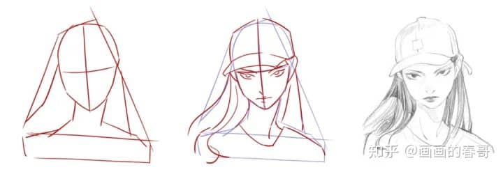

而且“**圆+十字线+五官表情**”的步骤，可以算得上是绘画界最基础的头像公式。

但对于新手村的同学来说，即使有了步骤公式，也不一定能把头像画得生动好看。

原因和做数学题一样，不思考公式原理，靠死搬硬套是解不出答案的。

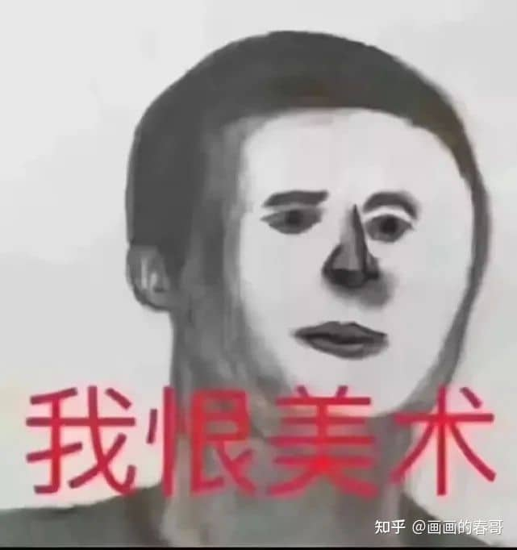

  

那么咱们今天就来拆解一下，这个常见的头像公式中，圆、十字线、五官表情各自存在的意义，以及怎么灵活运用它们！

## **_01_ 圆有什么用？**

但凡摸过自己小脑袋瓜子的同学，都知道头的整体形状是圆形。所以画圆，是为了概括头部的整体形状。

但是呢，头并非平面，而是有立体空间的。单是这么一个圆，只是外部轮廓而已，没办法体现立体感。

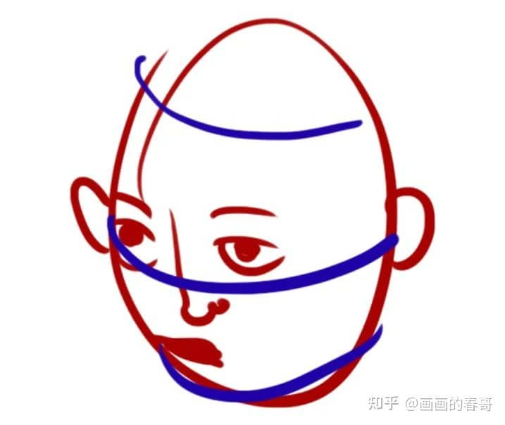

所以需要借助立方体和圆柱体，去概括内部空间。

方块对后续塑造人物有很大的帮助。比如利用方块体画不同角度的头像，或者是用柱体弧度刻画头像透视感。

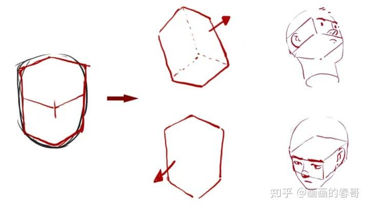

“方圆结合”的两种角度示范

有些画师习惯省略方块环节，直接用圆起稿，是因为他们已经把空间立体感印在脑海里，形成肌肉记忆了，不需要再画出来。

如果是刚入门的新手，建议多尝试用“方圆结合”的方式起稿画头像。

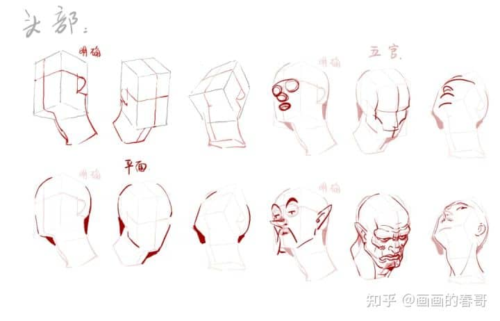

可能一开始画得不够好看。但是不要紧，重点是要通过这些体块，培养空间意识。

画得多了，逐渐有空间立体意识后，随便一个不像头的形状，都能给你画成有趣好玩的头像。

比如下图的脑洞画法：

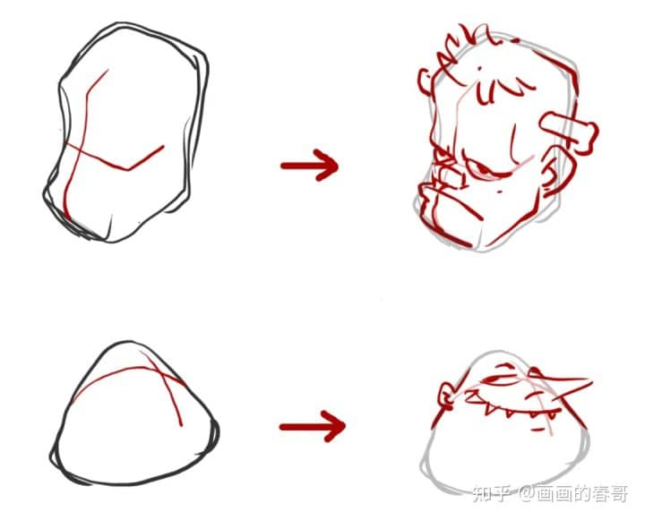

其实靠平面形（圆）和空间关系（方块体）的配合，才是打开头像画法的第一步。不经历这一阶段的练习，可能你画的头像永远是这样的：

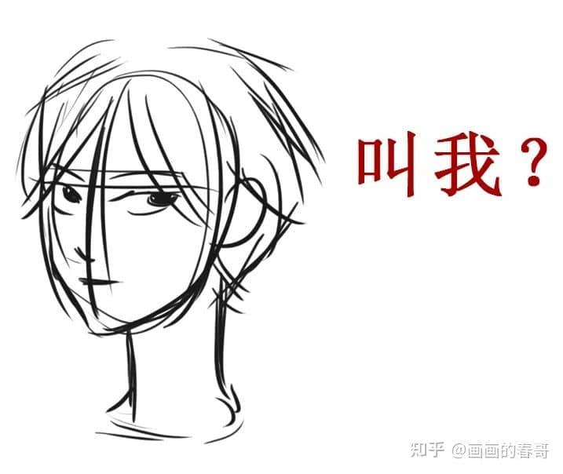

## **_02_ 十字线有什么用？**

一般画完轮廓草稿，接着就是画十字线。但因为十字线和祷告标志很像，所以有网友曾调侃说：我画十字线不是为了确定五官位置，而是祈祷能把图画好。

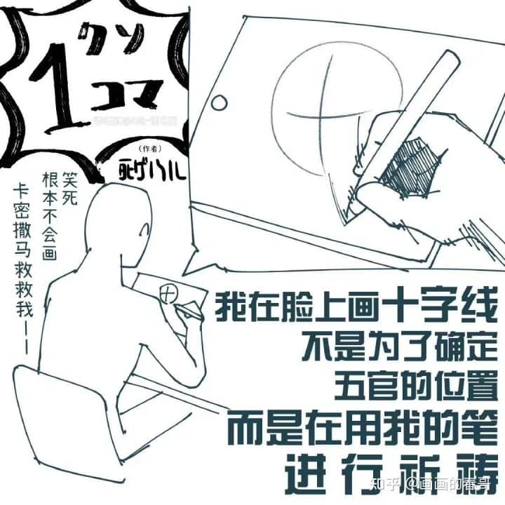

实际上十字线的主要作用，确实是用来确定五官位置。

在有透视的情况下，十字线同样可以作为五官位置参考的坐标。

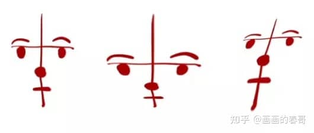

  

不过仔细观察会发现：明明按照十字线坐标去画五官了，它们之间的组合关系还是太平面、不好看？

注意，十字线的作用是五官的位置参考，直接在十字线上画五官，没办法画得立体有细节。

要想画出五官的起伏变化，需要增加一个步骤：

**在十字线上，先圈出五官的区域位置，定义它们的空间。然后借助这个空间，再去添加五官。**

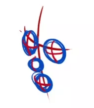

说的比较灵魂，具体来看看演示：

*   **在十字线上圈出五官区域**

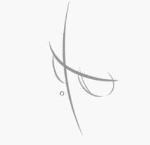

*   **添加五官**

**

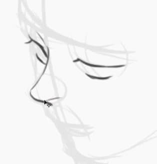

**

*   **最终效果**

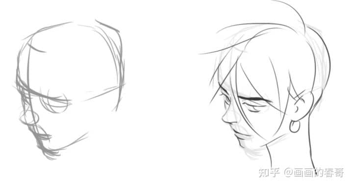

由此可见，五官的立体关系与十字线的位置配合，是画头像的第二大要点。如果单靠十字线，极其容易把五官画平。

## **_03_ 五官怎么体现情绪？**

前面讲的圆和十字线，都强调空间立体感，目的是为了让头像不扁平、有看头。

在此基础上，要想画的人物有辨识度、有故事感，表情的塑造又是一大关键。

同时表情也是画人的难点之一。不少有绘画经验的画手，可以把人画得很漂亮，却很难画出情绪感。

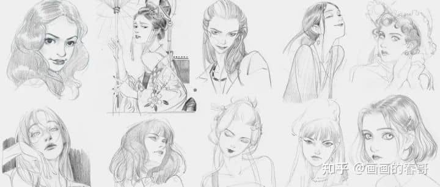

春哥的头像练习

可能大家在网上搜索表情教程的时候，会发现很多画手是通过调节五官形状，去画出不同表情。

比如人物不开心时，就把眉毛往上画；人物大受震撼时，就把眼睛画得更大更圆。

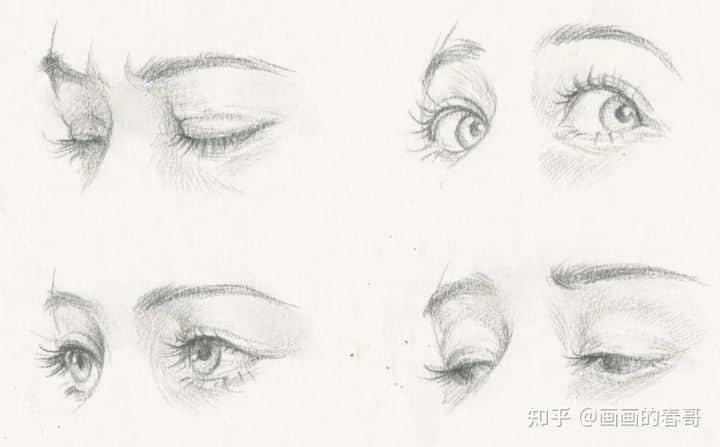

春哥的情绪练习

这种塑造方式没问题，但比较小心翼翼，稍不留神可能就把五官画不协调。

春哥觉得，先抛开“要把五官画得细致漂亮”的想法，利用面部肌肉挤压带动五官变化，更容易塑造出人物的不同情绪。

以下为3种力度挤压下的情绪效果：

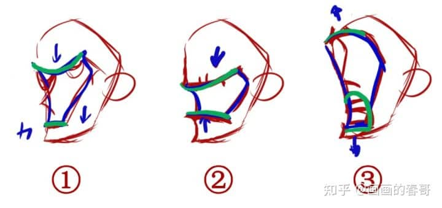

虽然没画五官，但还是能感受到他们仨不同的情绪，对吧？

可以把这种塑造效果，运用到了表情练习中：

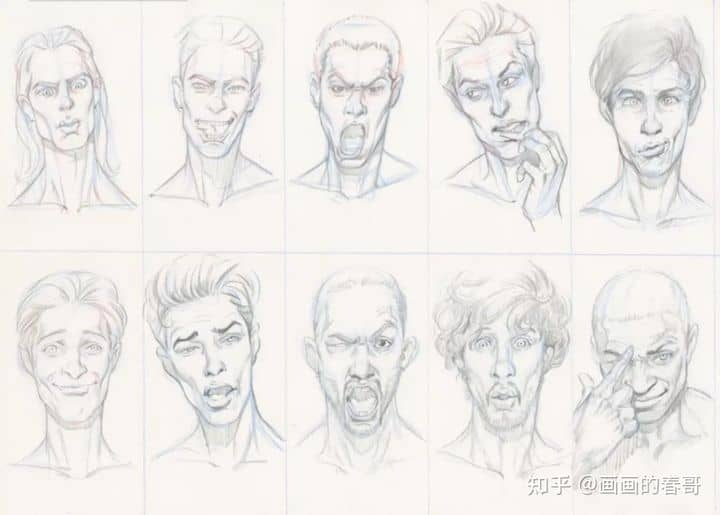

表情可以说是非常放飞自我了~

到这一步，常见的画头像步骤就说完啦。下面进入春哥的完整步骤演示环节！

## **_04_ 头像演示环节**

先选择一张黑皮小哥：

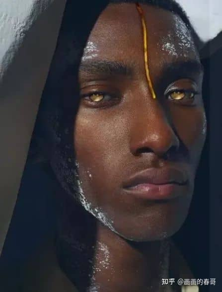

**1.草图阶段**，不必太拘束，放松画就完事儿了。

*   “圆方结合”，画出有立体的外轮廓

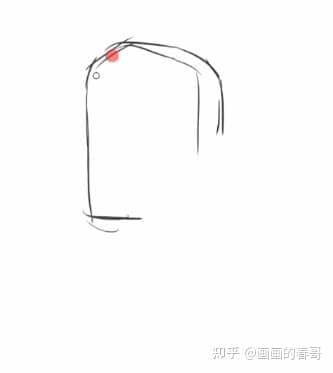

*   添加十字线，圈出五官区域

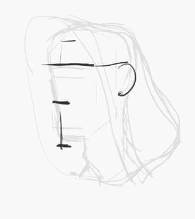

*   刻画人物情绪

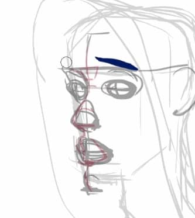

**2.线稿阶段**，把草图该有的结构，更清晰地画出来，但不要急着加细节。

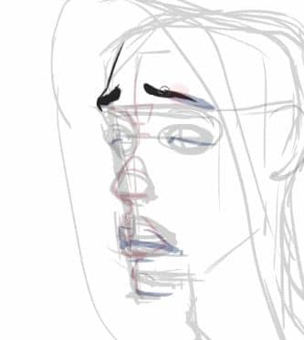

**3.加细节**，根据自己的喜好，添加细节，不用完全照着照片素材去画。

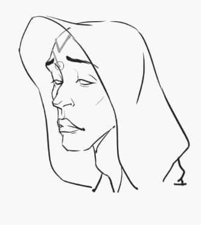

步骤过程图展示：

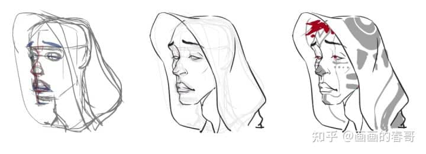

根据以上步骤，春哥还画过这些头像作品：

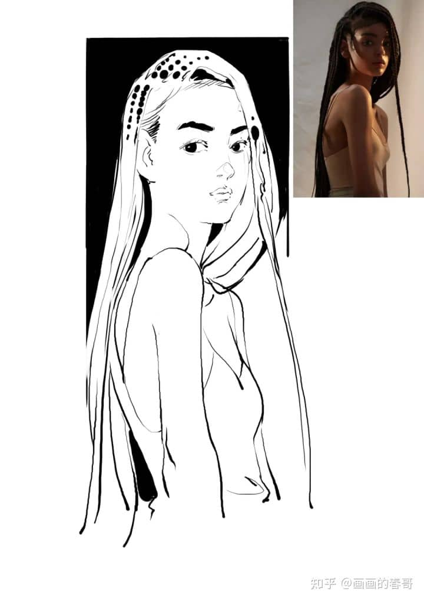

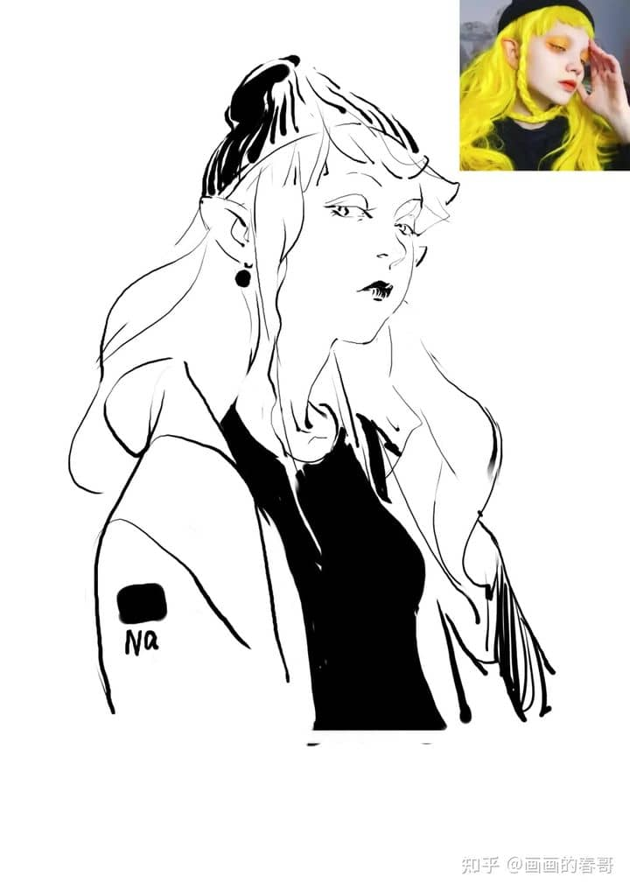

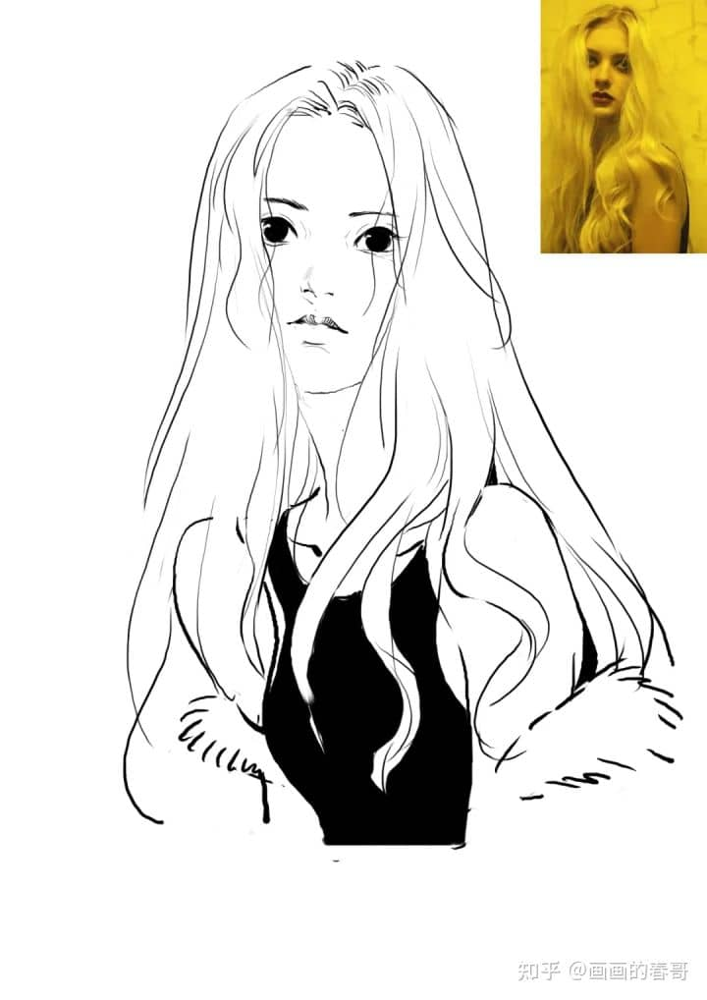
