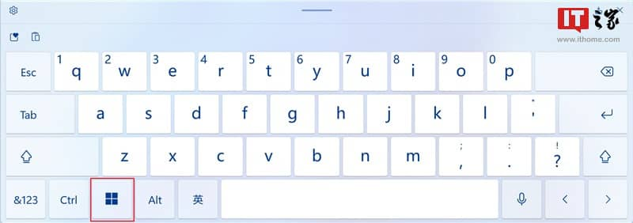
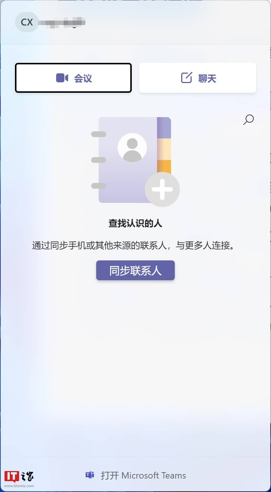
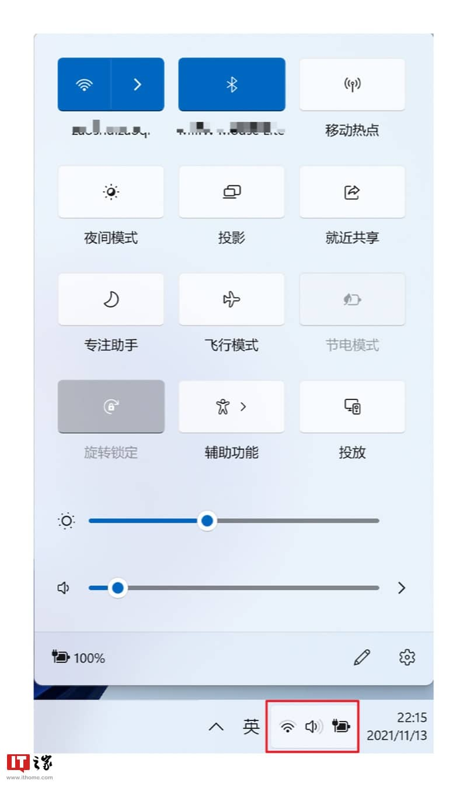
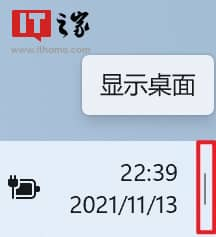
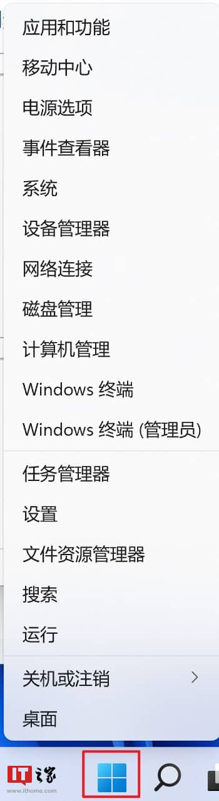
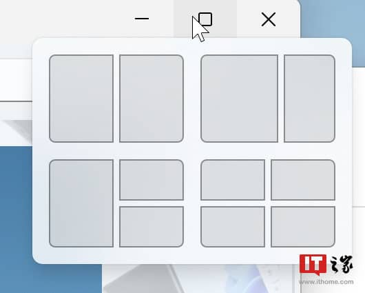
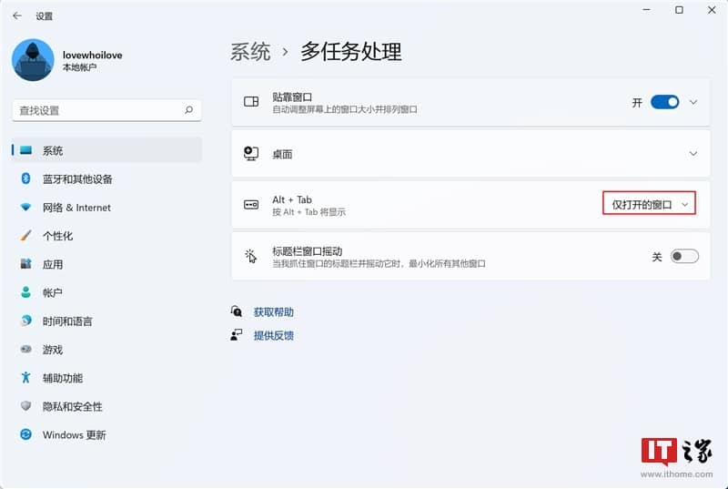

## 前言

如下图所示，以系统的触摸键盘为例，红色框标记的按键即为 **Windows 徽标键**，这个标识很像汉字 “**田**”，因此大家也戏称微软的品牌为 “**田牌**”，下文会用 **Win** 简写来表示该按键，并且会针对该按键展开讲解。

▲ Windows 11 触摸键盘

## 系统常用快捷键

如下图所示：首先来看红色框标记的 6 个图标，依次为：**开始**、**搜索**、**切换任务与虚拟桌面**、**小组件**、**聊天**、**文件资源管理器**。

▲ Windows 11 任务栏

下面将依次列举其键盘快捷键。

*   **Win**：按下 Windows 徽标键即可打开 “**开始**” 菜单，再次按下即可关闭。记忆方法：**Win**dows 徽标键。
    
*   **Win+ S** 或 **Win\+ Q**：按下该组合键即可打开**搜索框**。记忆方法：当我们需要搜索（英文为 **S**earch，取其首字母 S）、提问（**Q**uestion，首字母为 Q，下同）时可以使用搜索框。
    
*   **Win\+ Tab**：在打开的窗口、应用或虚拟桌面之间**显示**和**切换**（需要进一步点击要切换的应用或虚拟桌面）。
    
*   **Win+ W**：打开 / 关闭**小组件**，按下该组合键即可打开小组件面板，再次按下即可关闭。记忆方法：组件的英文为 **W**idget（官方翻译为小组件，个人认为翻译为小部件更佳）。
    
*   **Win+ C**：打开聊天软件 **Microsoft Teams**（在 Windows 10 中按下该组合键默认打开的是 **Cortana 语音助手**）。记忆方法：如下图所示，该软件主要用于会议（**C**onference）与聊天（**C**hat）。
    

▲ 聊天界面

*   **Win+ E**：打开**文件资源管理器**。记忆方法：该软件的英文为 **E**xplorer。
    

再来看任务栏右侧，还有三个快捷键与任务栏有关。

*   **Win+ A**：打开常用**设置**面板（如下图）。记忆方法：在 Windows 10 中，常用的设置项位于控制中心，Windows 11 将其独立为一个面板，但还可以称之为控制中心，其英文为 **A**ction Center（或者我们称其为助手 **A**ssistant）。
    

▼ 常用设置面板

*   **Win+ N**：打开**日历**和**通知**面板。Windows 11 将日历和通知面板放在了一个分组，这点我们在日期区域右击即可弹出的【调整日期和事件】及【通知设置】菜单即可看出来（要是没有通知消息，则不显示通知面板）。记忆方法：通知的英文为 **N**otification。
    

▲ 右击日期区域弹出的菜单项

*   **Win+ D**：**将所有打开的窗口最小化，并转到桌面**，再次按下即刻恢复所有内容。记忆方法：桌面的英文为 **D**esktop。另外，如下图所示，可以将鼠标置于任务栏最右端，即可弹出提示【显示桌面】，点击此区域的效果等同于按下该组合键。
    

除此之外，还有 10 个好用的系统快捷键：

*   **Win+ G**：打开 **Xbox Game Bar**。按下该组合键可以进行录屏（以及设置音频、查看系统性能等信息），一般用于**录制游戏**。记忆方法：由于和游戏有关，而游戏的英文为 **G**ame。
    
*   **Win+ H**：按下该组合键即可使用电脑进行**听写**，即使用语音识别将口语转换为文本（中文支持还挺好，并且支持加标点）。记忆方法：让电脑聆听你说话，听的英文为 **H**ear。
    
*   **Win+ I**：打开**设置**应用。记忆方法：由于设置的英文为 Setting，和该快捷键没有对应，我想到了快速（即时）设置，该词可以翻译为 **I**nstant Setting，即快速进入设置的意思。
    
*   **Win+ L**：**锁定屏幕**，即锁屏。记忆方法：锁的英文为 **L**ock。
    
*   **Win+ P**：**投影**，就是**投屏**，开会的时候会经常用，也可以用于**扩展屏幕**。记忆方法：投影的英文为 **P**roject。
    
*   **Win+ R**：打开**运行**对话框（如下图所示）。记忆方法：**R**un 就是运行的意思。
    

*   **Win+ V**：打开**系统粘贴板**，上面有最近复制或剪切的项目，可以将其粘贴至其他应用或跨设备同步。记忆方法：系统（即 **Win**dows）粘贴板（结合**粘贴**的快捷键 Ctrl+ **V**，取第二个按键 V 即可）。
    
*   **Win+ X**：效果等同于**右击开始菜单**。记忆方法：打开**好多个**（别人问你多少个， 个吧，具体没数过）菜单项。推荐大家使用这个快捷键，它包含了常用的功能菜单。
    

*   **Win+ .**（**句号**）或 **Win\+ ;**（**分号**）：可以快速打开**表情符号面板**。它其实和粘贴板属于同一个面板（位于最后一个选项卡）。
    
*   **Win+ Shift+S**：屏幕**截图**，按下该组合键即可打开系统截图应用并按默认方式进行截图。记忆方法：截图工具翻译过来就是 **S**nipping tool。
    

这里再补充一个不常用的快捷键：

**Win+ F**：打开**反馈中心**应用。我们可以按下该组合键快速反馈系统的 bug 以及意见或建议。记忆方法：按中文拼音首字母（**F**ankui）记忆即可，另外反馈的英文为 **F**eedback。

## 快速调整应用窗口位置

**Win+** **←/→**（方向键）：可以自动将应用窗口完全贴靠到屏幕两侧 - 无需手动调整大小或定位。效果等同于点击 “将鼠标悬浮在最大化按钮上方” 弹出的菜单选项。

**举一反三**：

*   **快速将窗口贴靠于屏幕右下角四分之一处**：按住 **Win** 键不放，先按下 **→** 键，再按下 **↓** 键（顺序不能颠倒)，同样地，使窗口快速贴靠左上角、右上角及左下角操作类似，但是需要注意的是：先按下 **←** 或 **→** 键，再按下 **↑** 或 **↓**键。
    
*   **Win+ ↑**：可以将应用**窗口最大化**。
    
*   **Win+ ↓**：可以将应用**窗口最小化**。若是当前窗口处于最大化状态，则按住 **Win** 键不放，**连续按两下** ↓ 键即可将窗口最小化。
    

## 切换后台应用

上面提到的 **Win****\+ Tab** 快捷键仅仅是打开后台应用和虚拟桌面的界面，不是专门用于快速切换应用的。接下来介绍的两个快捷键，可以用于快速切换打开的应用。

*   **Alt+ Tab**：在打开后台应用界面后快速切换应用。为了方便我们需要对相关选项进行设置。如下图，导航至【系统】→【多任务处理】下的【Alt+Tab】选项，并改为【仅打开的窗口】选项。
    

*   **Alt+ Esc**：与 **Alt+Tab** 不同的是，该组合键**并不会打开后台界面**，仅仅按照打开的顺序进行应用的快速切换。使用场景：适合打开应用较少的场景，例如打开了**两个**应用，我们便可以借助该组合键迅速进行应用切换。
    

## 打开任务管理器

**Ctrl+ Shift+Esc**：打开**任务管理器**，也适用于 Windows 10。使用原因：由于 Windows 11 无法在任务栏上右击打开任务管理器，使用该组合键可快速打开任务管理器。记忆方法：有时打开任务管理器是为了去强制关闭应用，可以理解为使应用逃离（**E****sc**ape）后台。

