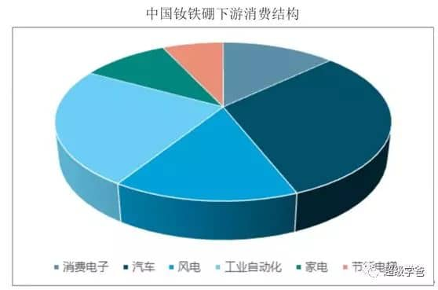
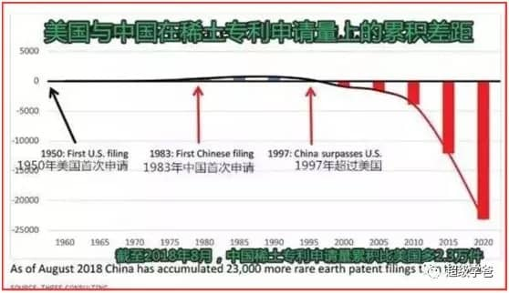
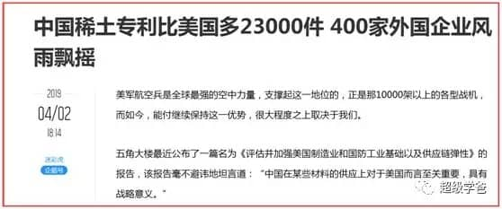

今天（2021年12月23日）有件大事发生，中国稀土巨无霸——**中国稀土集团**正式成立。其中国务院国资委占股31.21%，中铝、中国五矿和赣州稀土集团分别占股20.33%。  
  
其实中铝集团，唯一的股东也是国务院国资委，中国五矿集团公司，唯一的股东还是国务院国资委，因此国务院国资委至少占了中稀集团的71.87%的股份。  
  
由此可见，中国稀土集团是标准的中字头央企，而中字头央企必然体现了国家的意志，承载着国家的使命，要实施国家的重大战略。  
  
中国是当之无愧的稀土大国。长久以来，稀土都被当做中国的一张**王炸**。1992年邓小平南巡时说过一句话：“**中东有石油，中国有稀土**。”  
  
邓公此言不虚，这句话包含了两层含义；第一，稀土对现代工业有和石油相媲美的地位；第二，中国稀土**当时的储量**有和中东石油相媲美的地位。  
  
先说稀土有多重要。蛋总认为稀土的重要性越来越大，可能超过石油。石油被誉为现代工业的血液，而稀土被誉为工业的维生素，在民用和军事方面用途十分广泛。  
  
而且稀土有个非常独特的特点，越是高科技，对稀土就越依赖，可以说全球所有的高科技产品，都离不开稀土，并且比石油更加残酷的是，几乎没有替代品。  
  
举个简单的例子，**钕**（nǚ）这种元素，就是十七种稀土元素之一，其实已经是无处不在了，因为制造手机、耳机甚至是汽车，都会用到这种稀有的元素。  
  
1983年，**钕铁硼**永磁体横空出世，轰动世界，因为这种材料一跃成为世界上磁性最强的永磁材料，比铁氧体高10倍（比如四氧化三铁为主的磁铁石），号称**永磁之王**。  
  
蛋总曾经感兴趣，在网上给孩子买了几个钕磁铁玩具，吸引力超强，薄薄的两小片曾经把孩子的手夹伤了，才认识到这种磁铁的威力，大家一定都要注意。  
  
以前收音机、扩音器都有一块大大的磁铁，无论体积还是重量都很大。但是有了钕铁硼磁铁之后，体积和质量就可以做很小了。  
  
由于磁力超强，很快就被应用到了很多行业，包括永磁电动机、发电机、核磁共振成像仪、仪器仪表，已经成了汽车制造、通用机械、电子信息产业和尖端技术不可缺少的功能材料。  
  

  
  
另外，钕还可以被用作激光材料，既可以作为激光晶体，还可以用作大功率激光玻璃，然后被用在金属材料切割、打孔、焊接和激光手术等方面，甚至还被用于激光核聚变研究。  
  
钕的作用还远不止这些，可以说简直是**威力倍增器**。所以在第四次科技革命中，钕也将大显身手。  
  
比如特斯拉的Model3电动车，就离不开钕铁硼永磁电动机，因为它们比基于铜线圈的感应电机更轻、更强、更高效。而目前BMW、日产、吉利都在使用永磁体发展电动汽车。  
  
钕这种材料，当然也可以用在国防领域，比如电磁弹射、电磁炮、激光武器、超静音潜艇，我不可以再多说了……  
  
这只是17种稀土金属中的一种。这17种金属，已经在不同的高科技领域大显身手，而且作用不可替代，地位不言而喻。  
  
在导弹，战机、核武器等军事武器装备的合金材料当中，同样需要掺入稀土成分，才能够大幅度提高产品性能。毫无疑问，稀土是一种涉及国防安全的**战略资源**。  
  
稀土资源还关系到第四次科技革命和人类未来的竞争，目前世界每年的发明专利中，跟稀土有关的专利占据了总数的五分之一，稀土科技是人类未来的天王山。  
  
因此可以得出结论，人类科技越发达，稀土的重要性就越突出。相反，越落后的国家越无所谓，因此中美日三国，在拼命地申请稀土专利，三国稀土专利占全球的一半。  
  
说完了稀土的重要性，再说中国稀土优势。  
  
**第一个优势，储量大**。2017年底，中国稀土的储量高达4400万吨，储量占世界总储量的36.35%，位居世界第一。  
  
其次是巴西及越南，储量达2200万吨，占全球总储量的18.17%；俄罗斯占14.87%；印度占5.7%。  
  
**第二个优势**，中国稀土17种元素样样齐全、没有短板，产品线涵盖度百分之百，就像中国工业体系的完整度一样，这是外国所不具备的。  
  
稀土共有17种元素，分为**轻稀土**（镧、铈、镨、钕）、**中稀土**（钷、钐、铕、钆、铽、镝）和**重稀土**（钬、铒、铥、镱、镥、钪、钇）。  
  
其中中稀土和重稀土更为珍贵。外国目前发现的稀土储量都是轻稀土，而中稀土和重稀土中的钆、铽、镝、钬、铒、铥、镱、镥和钇已知可采储量，几乎**为中国独有**。  
  
重稀土矿附加值高，放射性低、高科技应用元素多、综合利用价值大，是我国南方地区**独有**的珍稀矿种。  
  
以“镝”(dī )为例，凡是激光、核反应堆、计算机硬碟、汽电共生引擎等，都必须要使用镝，更令美国捉鸡的是，美国最自豪的“精准打击武器”，关键零件缺少镝就无法制造。  
  
**第三个优势，容易开采。**更令人欣慰的是，中国南方的中稀土和重稀土矿以离子形态存在，易采、易提取，可用电解质淋洗出来，天佑中华。  
  
**第四个优势，中国是稀土储量大国，还是稀土技术强国。**从1983年，我国就开始申请国际稀土专利，14年后的1997年，我们的稀土相关专利超越美国。  
  
  

  
  
到了2011年，我国的稀土相关专利则比全球其它国家加起来都多，2011年到2018年之间，我们的申请速度增加了250%，比美国多了2.3万多件稀土相关专利。  
  
  

  
  
说完了优势，再说中国稀土的劣势。  
  
中国稀土最大的劣势就是内卷严重，不掌握稀土定价权。为什么？重要原因就是中国的稀土企业非常分散，为了争夺市场自相残杀、相互倾轧。  
  
就像当年南车和北车，虽然都是央企，控股股东都是国务院国资委，但是内卷起来毫不留情。  
  
2012年，阿根廷他的一条铁路项目，北车报了239万美元一辆，让列强含泪退出了竞赛。  
  
北车眼看就要把肉吞下去的时候，南车突然杀出，报了127万的腰斩价，令阿根廷方面感到非常震惊。  
  
阿根廷随即要求北车重新报价，并且要求价格不能高于127万。无奈之下，北车只好报出了126万一辆的低价。  
  
然而这还没完，南车继续卷，又报出了121万美元的价格。原本十几亿美元的生意，南车到手只剩下5.14亿美元。  
  
问题是减掉的都是净利润，剩下的几乎全是成本，还要承担各种风险，不白干就不错了。  
  
南车和被车在海外自相残杀的事情，不只是发生了一次。还有土耳其的机车招标项目，这一次轮到北车来搅局了。  
  
南车报了200万美元一辆的价格，北车就报了120万。这把土耳其给吓到了，他们担心这么低的价格不安全，最终花落韩国。  
  
就在前不久，国内的赣锋锂业要收购加拿大的千禧锂业，眼看就要成了，突然有人加价7%。而加价的不是旁人，是另一家中国企业。  
  
同样中国稀土产业也存在这样自相残杀的情况，虽然稀土产量冠绝全球，技术也十分领先，但却不掌握稀土定价权。  
  
如何掌握国际定价权？必须走中车的路线，这就是中国稀土集团公司成立的意义。只有形成了一个拳头，才能一致对外。  
  
  
中稀集团成立后，跟北方稀土一起，形成**一南一北**格局，总配额将超过全国的90%。尤其是重稀土，几乎完全被控制在中稀集团手中，这才是王炸。  
  
美国的王炸是什么？是高科技和厚脸皮。美帝不仅可以管住本国的英特尔，还可以通过长臂管辖，管住ASML和台积电。  
  
最近，英特尔给各个供应商发了函，要求各供应商拒绝来自新疆的原材料、零部件或服务。我们很想抵制英特尔，奈何高端芯片受制于人。  
  
但是我建议，中国稀土集团总部干脆设在新疆。美国不是口口声声要抵制新疆制造、新疆特产么，那就让他抵制个够。  
  
稀土不仅是我们的牌，而且是好牌。“你打你的，我打我的”一向是毛泽东军事思想的精华之一，那么反制美国霸凌，就从稀土开始吧。  
  
但归根结底，我们要战胜美帝，还是要靠自力更生，攻克核心技术。伟大复兴的道路上，没有捷径可言。
