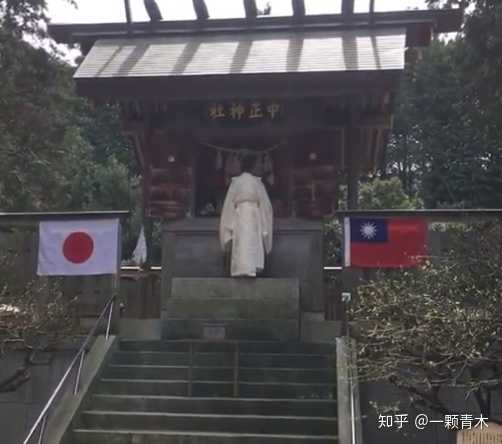
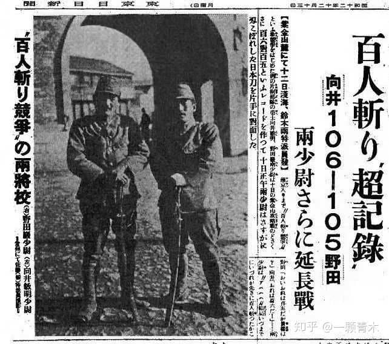
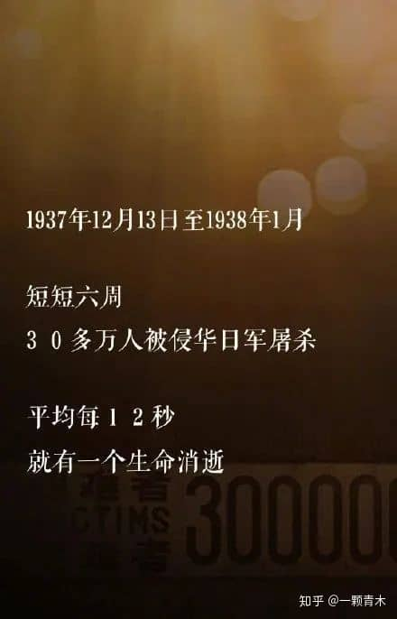
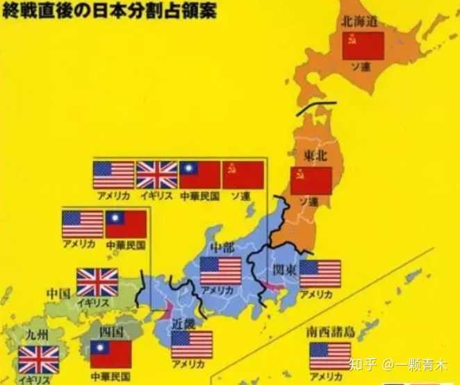
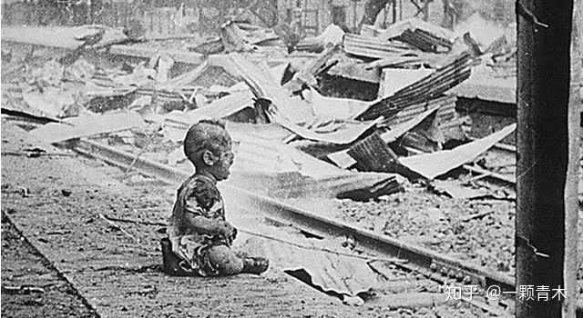
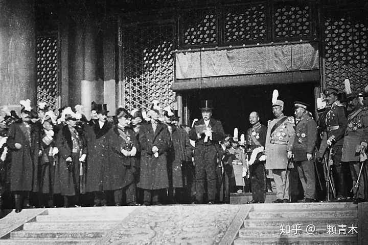
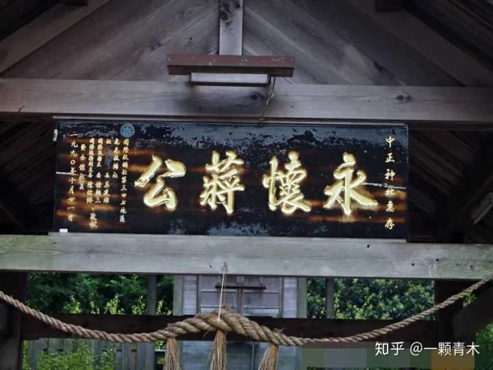
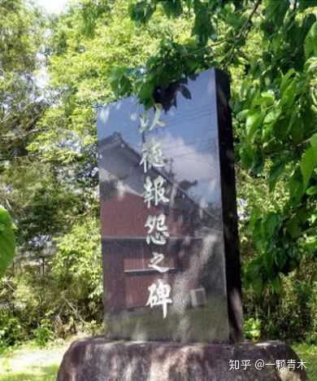
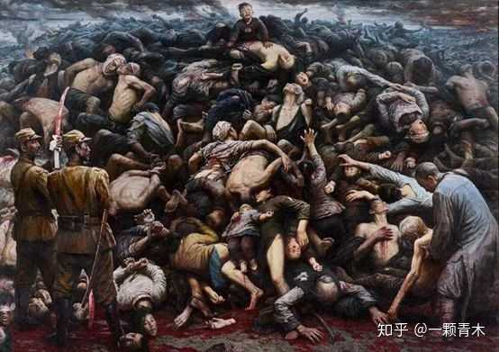
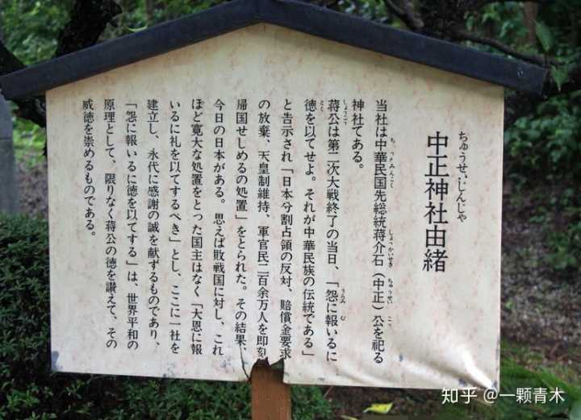

神社，是日本人祭拜神灵的地方，他们认为这里是神居住的地方。

日本有很多神社，最出名的莫过于靖国神社，对国家利益有突出贡献的日本军人，均被供奉在靖国神社之内。

但大家不知道的是，日本还为一个外国人修建了一座神社。

这是迄今为止，日本政府唯一专门为外国人修建的大型神社。

**这座神社叫中正神社，祭拜的对象是蒋介石，地点位于日本爱知县的幸田町。**

在和中国激战十余年后，日本人认为蒋介石对日本有巨大贡献，甚至为他修了神社。

这是为什么？

## **以德报怨**

1937年12月13日，两名日本军官在南京城进行了杀人比赛，先杀满100人者获胜，这种事甚至还上了日本的官方新闻。

从12月13日这天开始，一直到1938年1月，短短6周的时间内，南京城足足有30万同胞惨死在日军刀下，平均每12秒被杀戮一人。

毫无疑问，日本侵略者在中国的土地上，犯下了滔天罪行，欠下了累累血债。

**蒋介石长期生活在南京，但凡有一点点良知，都不应该对此无动于衷。**

1945年8月15日，日本宣布无条件投降。

作为战胜国，中国人终于可以清算日本人罪行了。但

是在8月15日当天，蒋介石却在重庆广播电台发表了题为《抗战胜利告全国军民及全世界人士书》的广播讲话。

在讲话中，蒋介石明确了对日本的处理方案，那就是宽大处理，以饶恕为主，呼吁中国人要爱敌人，不要报复。

> “我说到这里，又想到基督宝训上所说的“待人如己”与“要爱敌人”两句话”  
> “我们一贯声言，只认日本黩武的军阀为敌，不以日本的人民为敌……我们并不要报复，更不可对敌国无辜人民加以污辱”“要知道假如以暴行答复敌人从前的暴行，以奴辱来答复他们从前错误的优越感，则冤冤相报，永无终止，绝不是我们仁义之师的目的，是我们每一个军民同胞所应该特别注意的。”

第二天，日本媒体报道蒋介石的讲话时，标题直接就拟定成了**《以德报怨》**这四个字。

这个词汇，后来被日本政界和史学界，公认为国民政府对日政策的主基调，在日本官方的外交场合被多次提及，大量记载于日本文献之中。

1946年7月31日，日本官媒发表社评，盛赞蒋介石人格及领导力量之伟大，并对蒋公予以感谢。

**你的敌人在自己的官方文献中，记载你对他“以德报怨”，还天天写文章夸你**，你到底做了什么，让他如此感恩？

## **四大“德政”**

日本人如此感恩蒋介石，主要是因为他对日的四大“德政”。

分别是：**维持日本天皇制、放弃驻军权、反对报复性战争赔偿、善待日本在华军民。**

### **1、保住天皇**

天皇作为日本的最高领导人，理所当然的要对战争负责任。

英美国家极其讨厌天皇制，他们想废除这种制度，并把现任天皇“放逐到西伯利亚”或者直接处以“绞首刑”。

在日本战败之前的举行的开罗会议上，罗斯福询问蒋介石对于天皇制的看法时，蒋介石回应到：

> “发动战争的人，只是一小撮日本军阀，我以为必须的条件是根本铲除军阀，不能让他们再起干政；至于日本的国体应该如何，最好待战争结束之后留日人民自己来决定。”

天皇制由日本“人民自决”这一观点，就是蒋介石首先提出来的。

在随后占领日本的过程中，出于实际控制需要出发，美国最终采纳了蒋介石的这一提议。

日本天皇的去留由“人民自决”，结果当然就是保留，因为那个年代的天皇就是日本人民的信仰，代表着日本的历史和文化传承。

对此，蒋介石立下了大功，大大影响了美国的决断，对此日本人民一直很感恩。

### **2、放弃驻军权，使日本免于被瓜分命运**

二战结束时，美国曾要求中国一起占领日本。

作为战胜国，中国有这个权利。

按当时各国谈出来的方案，中国要占领三块地方，至少需要5万驻军。

但蒋介石后来就派了一个宪兵队作为象征性驻军，放弃了驻兵权，甚至两次拒绝了罗斯福让中国驻军琉球的要求，让罗斯福非常难以理解。

因为蒋介石的带头放弃，后来其他国家也都没驻军，美国一家拿下了所有日本领土的驻兵权，日本避免了被列强肢解的命运，保留下了一个完整的政体。

如果中国在日本有驻军，那我相信两国就不会有什么钓鱼岛争执了。

甚至琉球归谁控制，那都不好说了。

### **3、反对报复性战争赔偿**

在抗日战争中，中国军民伤亡人数总计高达3500万人，各种损失折合当时美元计价高达1000亿元以上。

让日本赔偿中国的损失，天经地义。

而美国人也打算让日本赔一个天价。

在1945年7月的《波茨坦公告》中，各国明确了日本的赔偿原则，就是把整个日本拆光运光，只留下维持基本生活所需之工业，把日本全国上上下下的东西都拿光，全部用来赔偿。

而第一个提出反对报复性战争赔偿的大国领导人，就是蒋介石。

赔还是要赔的，但不能报复性赔偿，我们要点到即止，以德服人。

1949年菲律宾派特使访问蒋介石，寻求共同向日本索取更多赔偿的可能性，蒋介石说：

> “要对这次战争负责任的是日本军阀，而不是日本人民。要求日本人民负担战争赔偿的作法是不公平的”。

日本战败后全国上下的财富就那么点了，僧多肉少。

你不要，别人就要了。

过了几年之后风云突变，美国开始全力扶持日本以对抗红色势力在亚洲的蔓延，就再也不谈什么赔偿的事情了，此事不了了之。

最终，中国只从日本拿到了相当于2250万美元的实物赔偿。

别说和大国比，就算和一些小国比也远远不如。

随便列举几个小国获得的赔款清单明细：印度尼西亚，8亿美元。菲律宾，8亿美元。

韩国，3亿美元。

缅甸，2亿美元。

西班牙，20亿日元。

瑞士，11亿日元。

丹麦，7亿日元。

瑞典，5亿日元。

而对日作战的主力，也是受损最大的中国，仅仅拿到了0.25亿美元的实物赔偿。

哪怕是腐朽的北洋政府，在一战胜利后，也从德奥身上获得了总计8400万银元的赔款，加上赔偿的船只以及免去的庚子赔款，总赔偿金达到了2.5亿银元之巨。

_北洋政府在太和殿前阅兵，庆祝一战胜利_

国民政府对于赔款的漠不关心，导致前期没有拿到钱，而后期没办法拿到钱，在美国对于日本的态度变化后，最终不得不在1952年正式放弃赔款。

而到了1972年中日建交之时，面对国民党造成的历史事实，我们也只能捏着鼻子接受。

蒋介石真的是太坑了。

### **4、 善待日本在华军民**

战败后，日本在中国遗留了200多万战俘。

苏联抓了60多万日本战俘，直接运到西伯利亚做苦力了，挖煤、修铁路，什么活累让他们干什么。

但中国这边就不一样了，直接把所有军民战俘都给遣返了。

不仅遣返，且允许携带必备衣物、行李，及少量财产，让日本人体体面面的回家。

对于暂时呆在战俘营尚未被遣返的日军战俘，享受和中国正规军相同的伙食待遇，甚至还有零用钱发，让日军自行采购副食。

从士兵到将军，每个人都可以领钱，一个不落。

日军侵华总司令冈村宁次曾感叹道：

> 日本的士兵从东南亚回来时，就跟乞丐一样，唯有从中国回来时，跟走富亲戚一样，什么毛毯、衣服、皮靴、手提包什么都有，还有现金！

日本从未见过如此宽容的国家领导人，所以特别的感恩。

> “因为日本，才有蒋介石；因为蒋介石，才有战后的日本”

蒋介石去世后，日本成立了“蒋公遗德显彰会”来纪念这位日本的“恩人”，并为其修建神社，奉其为主神。

在神社的入口处，高挂一块牌匾，上书四个鎏金大字：**永怀蒋公。**

1985年8月，“蒋公遗德显彰会”修建了“以德报怨”碑，

气派的石碑后是这么写的：

> 我等为报答蒋介石“总统”的恩情， 特在此设立此以德报怨之碑。 在缅怀蒋“总统”遗德之余， 我等亦在此立誓，日中将永保和平亲善， 直至后世不绝。

真的是大恩大德，永世难忘。

蒋介石对得起日本人，但却对不起惨死的3500万中国人，更对不起南京城里被屠杀的30万同胞。

## **国家利益不可交易**

为什么蒋介石对日本这么好？

日本在中国杀了那么多人，就算蒋介石是一个自私自利的人，觉得3500万军民的死活和自己无关，那也应该借机敲日本竹杠啊。

何必去装圣人。

蒋介石之所以如此大度的宽恕了日本，那是因为在蒋介石的眼里，国家利益是一种可以拿来交换的商品。

1945年的蒋介石，最需要的并不是日本的赔偿金，也不是把日本战俘抓回去干苦力，更不是跑到日本去驻军。

而是尽快的接收日军的地盘和装备，准备和共产党发动全面内战。

日本确实投降了。

但在中国大陆的日军，既可以向国民政府投降，也可以向共产党投降。

如果日军非要向共产党投降，那么蒋介石是拿他们一点办法都没有的。

打是肯定打不过的，要是能打得过早就打了。为了最快速度的争取在华日军的投降，蒋介石给出了一个让所有盟国都目瞪口呆的宽厚条件。只

要日军向蒋介石投降，就可以获得这么好的条件。

而蒋介石只要拿到了日军的投降，就可以获得中国绝大多数的地盘和绝大多数的武器装备。

然后顺势打赢共产党，赢下全国。

这就是蒋介石的策略。

为了尽可能的争取日军，蒋介石甚至宽恕了日军侵华总司令冈村宁次。

身为侵华日军总司令，冈村宁次明显应该是甲级战犯。

结果他却被蒋介石判决无罪。

侵华日军的最高总指挥是无罪的，连个领导责任都没有，好玩吧。连总指挥都无罪，下面的军人当然更无罪了，只是抓几个倒霉鬼充数而已。

这种宽恕带来了日本高级军官的大批效忠，他们坚持和八路军作战，只向国民党投降。

为报答蒋介石的恩情，岗村宁次不仅下令日军只能向国民党投降，还自愿成为了蒋介石的军事顾问，为其出谋划策，携手对抗共产党，继续发挥其“军事才能”。

根据公开档案，在1946-1948年，日军总司令岗村宁次为蒋介石撰写了大量作战方案，包括但不限于：《毛泽东的兵法及对付办法》、《围点打援是共军的作战特点》、《从敌对立场看中国军队》、《以集中兵力对集中兵力歼灭共军》等。

军事水平很高，蒋介石看了之后很开心。

甚至到了1949年1月，汤恩伯布置长江防线时，都曾携带江防布置图向岗村宁次讨教“高见”。

1949年8月，国民党兵败如山倒，形势崩坏到不可挽回的地步。

为给国民政府续命，岗村宁次甚至向蒋介石提议，由其来招募旧日本军人，组建十万精兵，来中国大陆和共军作战。

> “为反守为攻，击破匪军攻势起见，应速选拔中日两国军人中意志坚决果敢有为之青年，组成一个军，……，逐次加强扩大，练成精兵十万，编成数个军，组成一强有力之义勇军，成为击灭共军之骨干兵团。”

这种事不可能会得到同意的，蒋介石绝不敢批，而且就算他批准了美国也不会批。

但岗村宁次对蒋介石的报恩之心，由此可见一斑。

侵华日军在中国犯下了累累血债，结果其总司令不仅无罪，还成了国民政府的死士，为其报效尽忠，真的是太荒唐了。

**只要自身武装集团的利益可以最大化，蒋介石可以交易一切东西。**

赦免日本，并不特殊。

为了拿到美国人的援助和支持，蒋介石出卖的国家利益更多。

1945年12月，《美国在华空中摄影协议》，授予美国军机在中国全部领空做军事侦察的权力。

1946年5月，《成渝铁路修建协定》，授予美国对成渝铁路的所有权。

1946年9月，《中美三十年船坞秘密协定》，授予美国军舰自由出入中国所有港口的权力。

1946年10月，《中美宪警联合勤务议定书》，授予美国人在中国的治外法权。

1946年11月，《中美友好通商航海条约》，这个就厉害了， 原文是：

> “中国全部领土、全部事业一律对美国开放”

1946年12月，《中美航空协定》，向美国彻底开放中国所有领空。

1946年11月，《青岛海军基地秘密协定》，将青岛港赠予美国作为军事基地。

1947年10月，《国际关税与贸易一般协定》，部分放弃中国的关税权，将此权力移交给美国。

1947年10月，《美军驻华美蒋秘密协定》，授予美军在中国大陆合法驻军的权力。

1948年7月，《双边协定》，让美国企业拥有了对华倾销工业品的权力。

1948年8月，《中美农业协定》，彻底对美国开放农产品市场，将中国粮食安全的控制权拱手送给了美国人。

**基本上，能卖的国家主权都已经被蒋介石给卖光了。**

所以解放军占领南京时，美国大使馆根本就不随着国民政府南迁，而是直接留在南京和共产党谈判。

美国开出的条件很简单，只要共产党承认了国民政府和美国签的条约，那么美国会立即承认共产党为中国的合法政权，并协助共产党占领台湾。

但是蒋介石捅的窟窿太大也太多了。这么多卖国条约，**不是哪一个不能承认的问题，而是都一条都不能认。**

所以，新中国干脆直接不承认一切不平等条约。

想签约可以，我们重新一条条的谈。

而共产党开的价码，美国人根本接受不了。

因为新中国连一点点国家主权都不愿意交易。

上世纪50年代，苏联的核潜艇在太平洋威慑美国的时候有个问题，距离苏联本土太远，核潜艇无法接收到司令部的信号，需要在亚洲南端修建一座长波电台。

其次，苏联核潜艇需要有一个靠岸维修和短期休整的地方。

核潜艇太过机密，苏联只敢把这事放在盟国来做。

而苏联第一个想到的，就是中国。

1958年7月，援建了新中国大批工业基础设施的苏联，其总书记赫鲁晓夫专程来到北京，商讨和中国成立联合舰队，并在海南岛修建一座长波电台的事情。

苏联人开的条件看起来并不过分，在海南岛的长波电台，苏联人出技术，中国人出资金，建成后主权和管理权都归中国人，苏联的核潜艇有使用权。

而所谓联合舰队，其实就是联合潜艇舰队，更直接点说就是要拨给苏联一个港口做军事基地，让苏联的核潜艇可以在这里维修和整顿。

作为对等，苏联的摩尔曼斯克军事基地也可以给中国的潜艇部队使用。

表面上看，苏联的条件确实不算过分，需求也合情合理。

所谓的苏联军事基地，虽然中国不可能用得到，但毕竟面子上是没问题的。

而且苏联援助了中国那么多工业基础设施，对苏联投桃报李，给一点实际利益，完全可以称之为公平的交易。

但毛泽东很刚烈，一切涉及国家主权的问题都不谈，一点交易都不做。

无论苏联人开什么价码，此事都没得谈。

中苏关系就此交恶。

1959年6月，苏联停止对中国的核子援助项目。

1959年底，中苏发生论战，互相指责对方。

1960年，苏联撤出在中国的所有专家，停止了所有项目的援建工作。

苏联停止援建，毫无疑问中国的损失很大。

只是一座军事基地和一个电台，而且苏联也给足了对等的面子，为此放弃所有援建项目是不是划算？

> “大西洋公约组织国家还在互助合作，北约国家把这看成平常小事，可是，我们却连这样的小事都达不成协议。”  
> ——愤怒的赫鲁晓夫

但毛泽东却认为，这不是一个可以谈判的话题。

> ”英国人、日本人，还有许多别的外国人，已经在我们的国土上呆了很多年，被我们赶走了。赫鲁晓夫同志，我再说一遍，我们再也不想让任何人利用我们的国土来达到他们自己的目的。”  
> ——毛泽东

**中国的主权，在任何情况下都不允许交易，哪怕对方开的价码再高都不行。**

而1949年美国的出价，连苏联的零头都没有，毛泽东自然不可能接受。

只有中国人才认可毛泽东，美苏日都不会去说毛泽东的好话。

而屠杀了中国几千万同胞的日本人，却为蒋介石蒋中正修建了中正神社。

在神社内部的木牌上，写明了修建这座神社的理由。

翻译过来就是：

> 本社是为了纪念中华民国前总统蒋中正而建立的神社。在第二次世界大战结束当日，蒋公曰：“与人为善”是中华民族的传统美德，反对分区占领日本，放弃战争赔款，反对罢黜天皇，200多万军民即行遣归日本。由此，才有如今日本之兴旺。想来对于战败国，这种宽容是各国领导人所未见的。大恩无以为报，特立斯社于此，以表诚挚感谢，永世不忘。

**这样的政权，岂有不灭亡的道理。**

作者：远方青木（ID：YFqingmu）

原文：[为报答蒋介石的恩德，日本人修建了中正神社](https://link.zhihu.com/?target=https%3A//mp.weixin.qq.com/s/2ZhwzNff7h0FP_GSd1YeBg)
