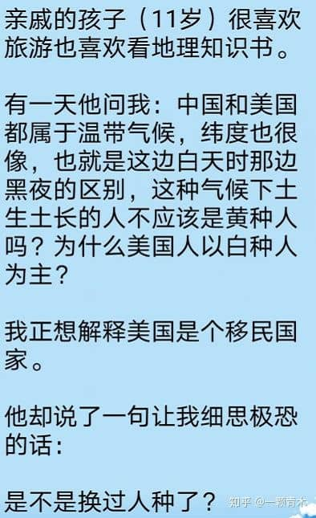
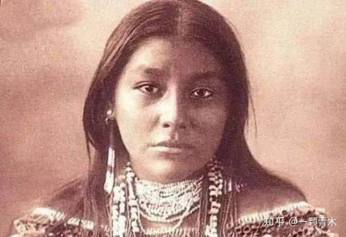
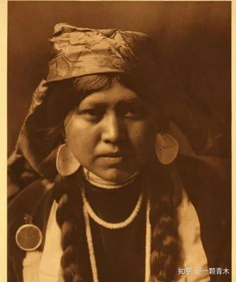
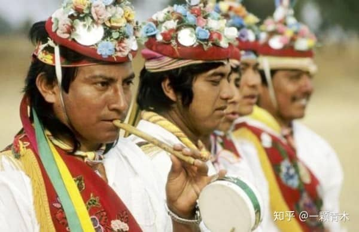
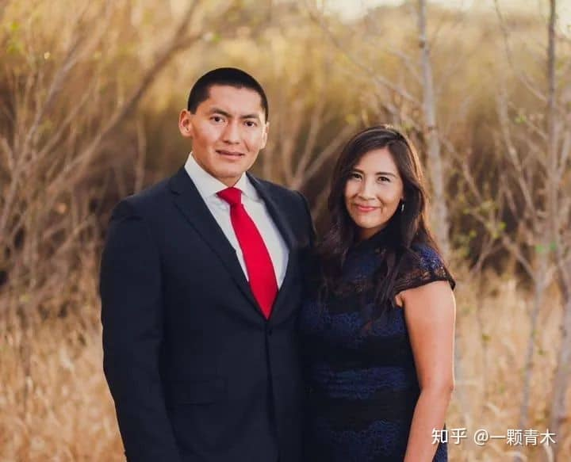
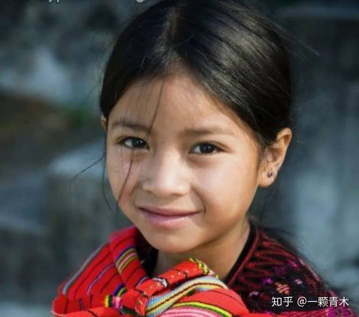
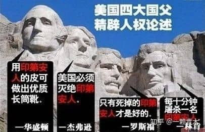
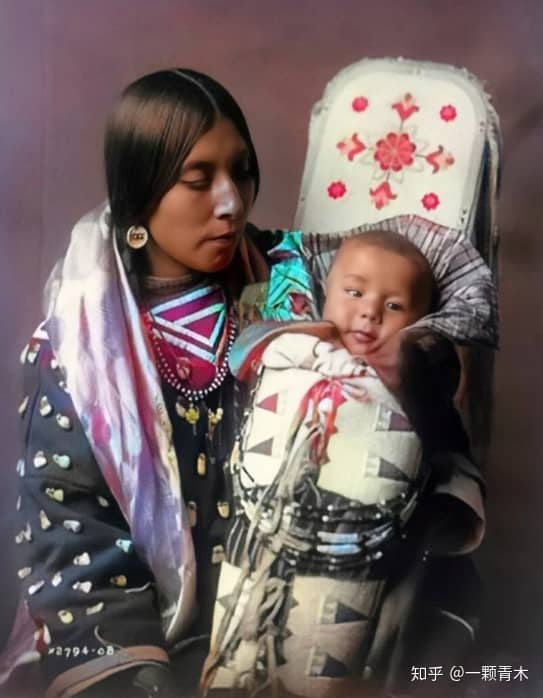

根据优胜劣汰的自然进化论，热带地区最适宜黑种人的生存，温带地区最适宜黄种人的生存，而寒带地区最适宜白种人的生存。

但是中国和美国都属于温带气候，纬度也非常相似，按理说都是最适宜黄种人生存的土地。

为何在中国生存的是黄种人，而在美国生存的是白种人。

一个 11 岁的小孩，提出了这个问题。

而这个小孩自行推导出了一个结论:**美国的土地上，是不是换过人种了？**

这个聪明的小孩，无意间就猜透了历史的奥秘。

**美国的土地上，确实已经换了人种。**

而且是用特别血腥的手段，将原本生存在美洲大地上的黄种人，给近乎于彻底灭绝。

## **蒙古人种美洲支系**

印第安人喜欢在脸上涂抹红色颜料，这是他们的文化传统，因此欧洲白人入侵者在最开始的时候，称呼印第安人为红种人。

但实际上他们是彻彻底底的黄种人。

如今的人类学家和考古学界，已对印第安人的出身做出了明确的结论。

**印第安人，是蒙古人种的美洲支系。**

为什么印第安人是蒙古人种？因为无论是从基因溯源还是从考古证据，他们都是彻底的蒙古人种。

和中国人的血统非常的接近。

这带来的结果，就是真正的印第安人，长的和中国人非常的相似。

这是照相技术刚发明时，拍摄下来的一个真正的纯印第安女人。

你觉得像不像中国的蒙古人？

还有另外一张流传下来的印第安女人照片，外貌和中国北方少数民族非常的相似。

古老的纯印第安人照片流传下来的不多，但今天的地球上，还残存少量的印第安人，他们有更加高清的照片。

这是印第安保留地里的舞蹈表演队，都是印第安人出演，黄种人血统特征一目了然。

而下图，是位于美国亚利桑那州的印第安保留地，Navajo 部落的主政官员夫妇的照片，纯正印第安人。

你看看他们的长相，你觉得像哪国人?

换上西装后，连少数民族的风情都没了，很像我们小区里的普通邻居。

而下面这个小姑娘，是纯种的玛雅人，印第安人的一个分支，目前生活在美洲的危地马拉地区。

**纯正的黄皮肤，外加黑头发黑眼睛，如果单纯从外表上看，典型中国人。**

除此之外，对印第安人遗迹的考古，也发现了大量的中国元素。

中国有句歌词，叫**「黑眼睛黑头发黄皮肤,永永远远是龙的传人」。**

巧了，古印第安人也崇拜龙图腾，在古印第安人的壁画中，考古学家发现了大量的龙状石刻。

印第安人族群里口口相传天狗吃月亮的传说，以及和大禹治水非常相似的洪水故事（人名不一样）。

而在 1953 美洲出土的科藩遗址墙上的印第安族鸟形王冠上，竟然发现了太极图。

除此之外，人类考古学家目前已经在美国亚利桑那州、加州、新墨西哥州、俄克拉荷马州、犹他州和内华达州的岩壁上发现了 84 处殷商甲骨文或中国象形文字遗迹。

对，**在美国的土地上，在印第安人的古遗迹中，发现了中国殷商时期的甲骨文和象形文字。**

而且印第安人的语言，其发音习惯和音色，也和中国人有少许雷同。

目前，历史学家高度怀疑美洲印第安人中有中国的殷商后裔，但证据不够充分，仅仅 84 处殷商甲骨文遗迹做不到铁证如山。

但其他领域的证据是充分的。

所以，目前人类学家已形成公论，把印第安人定义为了蒙古人种美洲支系。

而中国人，也是蒙古人种的一个支系。所以中国人和印第安人才长的如此相似。

## **对印第安人的大屠杀**

1620 年，「五月花」号搭载了 102 名清教徒来到了美洲。

由于缺乏生存物资，这些人差点被全部冻死饿死。

这时候，善良的印第安人及时送给了他们一批粮食和生活必需品，让他们熬过了在美洲的第一个冬天。

次年开春，印第安人还教他们如何在本地狩猎、捕鱼和种植作物，帮助他们完成了定居。

到了秋季丰收时，为了感谢上帝的恩赐和印第安人的帮助，清教徒们宴请印第安人，作为救命之恩的回礼，这一天是 1621 年 11 月下旬的星期四。

后来，每年 11 月下旬的周四都被定为美国的法定节假日，命名为**感恩节。**

欧洲殖民者和印第安人的关系本来是非常好的，但双方有一个不可调和的矛盾。

印第安人要土地，但欧洲殖民者也要土地，但只有一个人可以拿到土地。

欧洲殖民者的土地多一点，印第安人的土地就会少一点。

如果欧洲殖民者只有几十人几百人也就罢了，等几千几万殖民者定居后，巨大的矛盾会冲淡之前的一切友谊。

你能劝说欧洲殖民者放弃对土地的要求，乖乖的返回欧洲么？

当然不能。那接下来会发生什么就很容易预测了。

1776 年，美国正式建国。

为扩张国力，美国的四大国父均发表过精辟的人权论述。

华盛顿说：**「用印第安人的皮可做出优质的长筒靴」。**

杰佛逊说：**「美国必须灭绝印第安人」。**

罗斯福说：**「只有死掉的印第安人才是好的印第安人」。**

林肯说：**「美国应每 10 分钟屠杀一名印第安人」**

除此之外，华盛顿还曾对印第安人公开发表过这样的言论：

> 「两者都是掠食的野兽，仅仅在形状上不同。」「印第安人居留地被有效摧毁前不要听取任何和平的建议。」

华盛顿还在打扫战场时指点过自己手下的军士：

> 「从臀部往下剥皮，这样可以制作出高的或可以并腿而长的长统靴来。」

1807 年，美国另一位国父，第三任美国总统杰斐逊则说：

> 「如果印第安人反抗美国人去获取他们的土地，那么，对印第安人的反抗就要用短柄斧头反击，」「在战争中，他们也会杀死我们中的某些人，但我们会杀死他们全部！」

林肯麾下著名战将谢尔顿将军还说过一句名言：

> 今年多杀点（印第安人），明年就能少杀点。

1818 年，美国政府正式颁布了一项法令，并通过了国会的审批。

任何美国公民，每上缴一张 12 岁以上印第安男子的头皮，可以获得 100 美元的奖励，每上缴一张印第安妇女和儿童的头皮，可以获得 50 美元的奖励。

200 年前的印第安妇女和儿童，大概长下面这个样子。

**黑头发黑眼睛，外加一身黄皮肤。**

**只要把她们的头皮剥了，上缴给美国政府，就可以拿到 2 张 50 美元的钞票。**

自从剥皮令下达后，美国印第安人的数量急剧减少，整个美洲都是惨无人道的虐杀。

美国陆军名将谢里丹的日记里，描述了印第安人的惨状。

> 「自 1862 年以来，在我的辖区里至少有八百名男女和儿童惨遭杀害，其被害情况令人发指。男人通常被剥去头皮，肢体分离，他们的生殖器被凶手割下，放在他们嘴里。妇女被暴徒强奸，有时多达五六十次，然后被杀害，她们的头皮被凶手剥下，阴道里被插入棍棒，有的在她们死之前，有的在她们死之后。」

直到 1891 年，美国的纽约时报，还采访了陆军将领，将美国陆军屠杀印第安人的战绩当成「丰功伟绩」来进行大篇幅报道。

那可是 1891 年，光绪 17 年，中国马上就辛亥革命了，美国那边依然在对印第安人持续屠杀。
