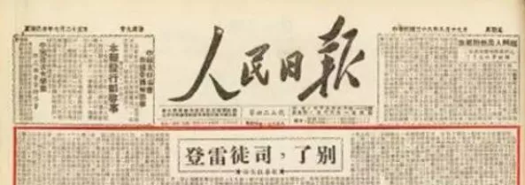
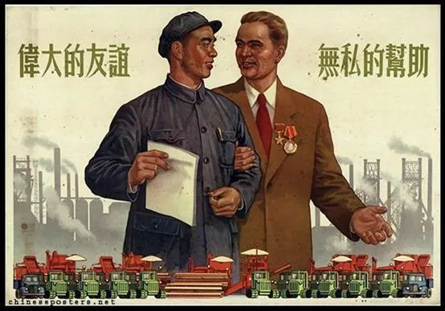
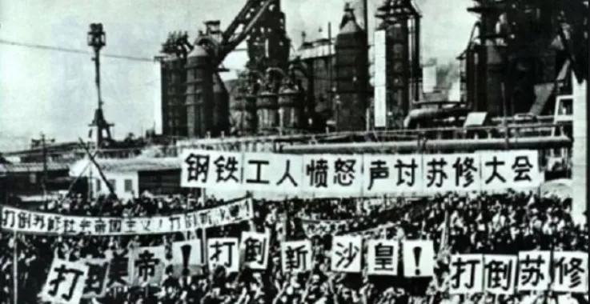
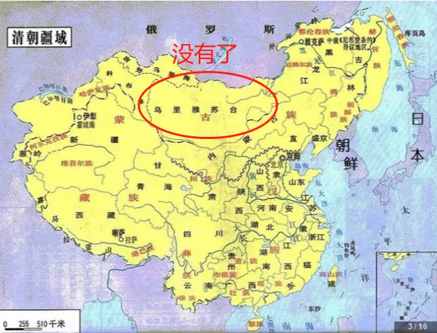
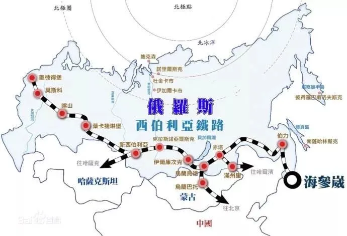
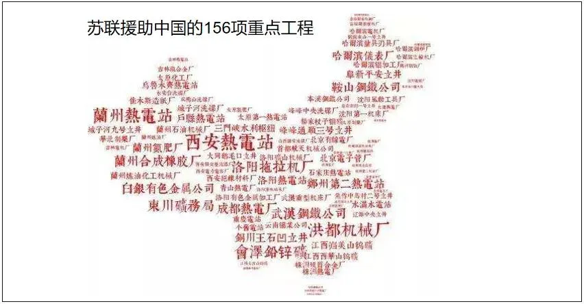
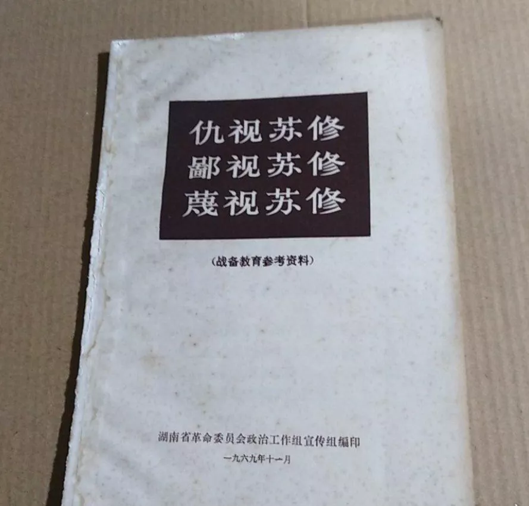
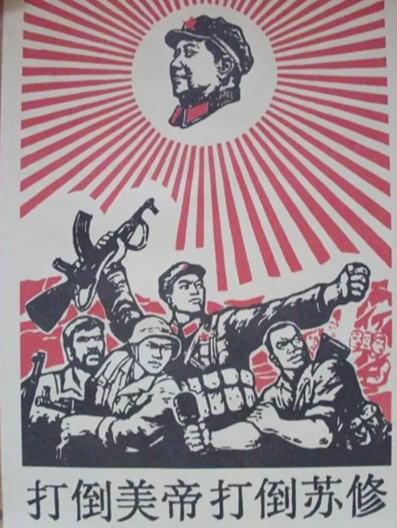

中苏之间的关系，是非常诡异的。

不了解历史细节的人，通常都会感到非常困惑，无法理解。

1948年12月底，三大战役结果已基本结束，国民党精锐尽灭，全国解放指日可待。

1949年1月~3月，斯大林多次通电中国，要求国共和谈，制止中国共产党解放全国的行为，希望国共划江而治，在事实上分裂中国。

1949年8月8日，毛主席亲自撰文《别了，司徒雷登》，和美国决裂，彻底站在苏联这一边，实行一边倒的战略。 

1950年朝鲜战争爆发，中国抗美援朝，而苏联作为社会主义国家的老大却没有什么反应，甚至连一票否决权都没有用，好像对美国的入侵无动于衷，任由中国和朝鲜人民流血牺牲。

1953年，中国实行第一个五年计划，苏联决定大规模无私援助中国，提供很多绝密的技术和设备，帮助中国建立全套工业化，两国关系进入蜜月期。 

1960年，中苏决裂，中国掀起一股批评苏修，打击苏修的浪潮。在苏联刚刚援建完毕的钢铁厂里，中国工人大骂苏修。 

以上种种矛盾之处，诡异不？

大国关系，好像成了过家家。

如果单独看这些史实，你想破脑袋也想不出当年为什么会发生这样的事情。

但如果你看了更详细的史料，那你就能理解为什么了。 

《中苏友好同盟条约》是一切的根源

自从王明和博古被赶下台后，苏联一直对中国共产党不感冒。  

王明博古是不是导致了第五次反围剿的失败，是不是差点断送了中国革命，这不重要。

**重要的是，他们听话，苏联能够通过他们随意指挥中共的人事，军事，党建工作。**

失败了不要紧，团灭了也不要紧，苏联老大哥不关心这个。

苏联有钱有装备有培训能力，随时可以再扶持一批人出来，还叫中国共产党。

但遵义会议和整风运动后，以毛泽东为首的一批共产党人上台了，苏联就不怎么喜欢中国共产党了。

你有没有能力这不重要，重要的是，你不怎么听话。

苏联的指示你不完全遵从，总是有自己的想法。

动不动就说“没有调查就没有发言权”，动不动就反对本本主义。

谁的调查最少？谁最依赖本本主义约束中国？苏联啊。

你这么玩，苏联怎么可能喜欢你。

所以抗日战争期间，**苏联的援助，基本都给了国民党，而不是共产党。**

**并不是你打着共产党的旗号，苏联就会无条件帮你的。**

1945年，美苏达成了雅尔塔协定，约定由苏联进攻中国东北的日军，同时将中国和日本的一些权益，划分给了苏联。

1945年8月8日，苏联对日本宣战，迅速占据东北。

1945年8月14日，日本投降的前一天，在美苏的共同逼迫下，国民政府被迫和苏联签订丧权辱国的《中苏友好同盟条约》。

这份条约规定中国同意外蒙古公投独立；同意苏联拥有旅顺和大连的驻军权和使用权；同意苏联拥有中长铁路经营管理权。 

根据蒋经国自传，最开始蒋介石死活不愿意签这个协议。  

但苏联威胁说，**你不签，那我就把整个东北移交给中国共产党。**

东北已经在苏联手上了，请神容易送神难，蒋介石能怎么办。。。

于是蒋介石就签了，换取苏联把东北交给自己的承诺。

中国共产党，只不过是苏联谈判桌的一个砝码而已。

而苏联拿到了自己满意的权益后，**转而支持国民党，希望国共两党握手言和，不要再打了，以长城为界分别立国就挺好。**

1949年初，为什么在国民党明显要灭亡，共产党即将一统天下的时候，苏联依然出面调停，希望国共两党划江而治。

那是因为共产党提出要**废除和外国的一切不平等条约，建立新中国。**

虽然没指名道姓的提苏联，但也没提豁免，显然苏联也属于外国，而旅顺和大连是苏联梦寐以求的不冻港，是断然不可能放弃的。

但国民党已经签约承认了苏联有在旅顺和大连的驻军权和使用权，苏联当然要保国民党。

南京被攻占后，英美的大使馆都留在南京等共产党，只有苏联大使馆收拾了行李，追着国民政府去了广州。

**核心原因，就是《中苏友好同盟条约》**

而1949年8月，为什么毛主席要写《别了，司徒雷登》，彻底和美国决裂。

因为司徒雷登提出，美国承认新中国没问题，和新中国建交也没问题，**只要共产党承认美国和旧中国签订的协议，那大家永远是好朋友。**

这是美国的要求，也是谈判的底线。

只要同意，国民党就立刻会成为历史名词，美国全力支持共产党统一天下。

**但这个底线，共产党无法接受。**

而在共产党占领全国后，新中国是否倒向苏联，对苏联而言有极大的战略意义。

所以苏联提出，旧合约可以废除，一切都可以重新谈，苏联支持新中国加入联合国。

美苏之间，中国必须要选择一个，因为新生的中国太弱小。

**美国不愿意放弃旧条约，而苏联表示可以谈。**

所以我们对苏联采取了一边倒战略。

1949年10月1日，新中国宣布成立。

11月，毛主席向苏联表示，想在12月来苏，以便在12月21日斯大林70寿诞时亲自祝贺他生日。

1949年12月6日，毛主席出访苏联，16日抵达。

但一开始的谈判，很不愉快。

斯大林**根本不愿意交还给中国旅顺及大连**，双方互不相让，会谈现场一度陷入尴尬的长时间沉默。

斯大林没有任何让步的意思，对中方的合理要求不予理睬，想重签一份和旧条约一样的或者说差不多的《中苏友好同盟互助条约》。

这怎么可能。

毛主席一度被气得闭门不出，说要等周恩来。

斯大林很不解，为此当面问过毛主席：

> “如果我们不能确定要完成个什么事情，让周恩来过来干什么?”

但毛泽东不松口，于是只能等周恩来同志到了再谈。  

其实毛主席的用意很明显，胳膊拧不过大腿，得智取，先拖时间。

1949年12月底，英国政府已经倾向于承认我国，这一信息由负责外交的周恩来，在国务院会议上宣布。

而周恩来透露给英国的一些信息，也让英国人感觉自己有机可趁。

同期，英国报纸上大篇幅报道： 

> 根据传闻，“毛泽东被斯大林软禁了！”

1950年1月，英国政府宣布承认中华人民共和国（非大使级建交）。  

此举给斯大林施加了极大的压力。

美国也察觉到了机会，趁势来给苏联捣点乱。

1950年1月5日，杜鲁门总统发表声明称，台湾应归还于中国，美国不准备武力干涉中国内政。

苏联要坚持霸权主义，继续殖民侵占中国的领土。

而美国却要把台湾还给中国。

**斯大林的压力更大了。**

1950年1月20日，周恩来带领的外交团**“姗姗来迟”**，双方开始正式谈判。

1月22日，毛泽东和斯大林举行第三次正式会谈。

1月26日，中国代表团正式向苏联提交中国方面的方案，要求收回旅顺、大连和中长铁路的主权。

1月28日，苏联方面回复中国代表团，基本同意了中国的方案。但加了一条，要求苏联有权自由利用中长铁路运兵和军用物资，为了中苏两国的安全。

中方表示同意，但要求对等利用苏联的西伯利亚铁路，从东北至新疆一线，自由运兵和军用物资。

如果苏联同意，那就等于中国把刚独立的外蒙古给包围了，同时拥有了武力干涉苏联的能力，苏方怒了，不同意。

于是这一条也给去掉了。  

1950年2月17日，中苏谈判结束，双方签订新的《中苏友好同盟互助条约》，达成协议如下： 

> 苏方不迟于1952年末将中长路的一切权利及该路的全部财产无偿地移交中国政府；
> 
> 苏方不迟于1952年末从旅顺口撤回其驻军，并将该地区设施移交中国政府，中方偿付旅顺港的恢复与建设的费用；
> 
> 苏方保证将大连的行政管理权完全交予中国政府……

为了拉拢新中国，斯大林放弃了苏联在东北的生命线中长铁路，放弃了在旅顺港和大连港的驻军权和使用权。  

只有外蒙古，苏联强行保留了下来，作为代价，苏联承诺给中国援建50个工业项目，并贷款3亿美元给中国，利率1%。

**蒋介石送给苏联的四大特权，毛泽东经过艰苦的谈判，拿回来三个。**

如此曲折的过程，可以明显看出，苏联是被迫做出这个决定的。

这份新条约的签订，意味着苏联在远东永远的失去了不冻港，也失去了武力干涉中国内政的能力。

苏联的损失太大了。

斯大林会心甘情愿的吃这个亏？

1950年1月30日，也就是中方提出要用中长铁路的运兵权对等置换西伯利亚铁路的运兵权的2天之后，斯大林秘电金日成，要援助北朝鲜扩军，推翻之前反对的态度，开始支持朝鲜统一。

1950年2月4日，斯大林同意金日成提前使用1951年的苏联贷款，金额为7000万卢布，把兵力扩编至10个师。

1950年6月25日，金日成不宣而战，突袭南朝鲜，朝鲜战争爆发。

掀起朝鲜战争，对斯大林有什么好处？

**好处非常大。** 

天才到极致的阳谋

站在中国人的立场上，我们可能不怎么喜欢斯大林。  

但是站在苏联人的立场上，斯大林是一个非常优秀的领袖和统帅，为苏联争取到了非常多的利益。

新中国刚建国，就迫使苏联归还了中长铁路以及旅顺和大连两个港口，这让斯大林非常不满。

这可是苏联在太平洋的出海口和唯一的不冻港，是苏联远东战略的支撑点，是俄国数百年来梦寐以求的战略要地，是苏联出动百万大军，威逼利诱，才从国民党政府手里拿到的权利。

就这么在斯大林手里丢了，愧对列祖列宗。

**毛主席拿回了特权，高兴的是中国人，而不是苏联人。**

但如果支持金日成发动朝鲜战争，斯大林就可以拿回失去的一切。

**这是一个天才到极致的阳谋。**

朝鲜战争爆发后，苏联反应异常迟钝，好像没有任何预案，也不知道该怎么应对。

其实斯大林的预案，就是没有预案，任由其发展。

金日成掀起战争后，有如下几个可能的走势。 

**第一种走势：**

北朝鲜利用苏联支援的大量装备和贷款，出其不意的突袭之下，是必然可以击败南朝鲜的。

如果美国没有任何干涉，那朝鲜将统一。

元山，仁川，釜山，济州四个都是天然良港，作为苏联支持的回报，金日成已许诺统一后租借给苏联。

这都是很不错的不冻港，完全可以顶替失去旅顺和大连的损失。

这种走势苏联很满意！

**第二种走势：** 

美国出兵干涉，北朝鲜奇迹般的顶住了美国的进攻。

那苏联就等于用极少的物资，利用一个代理人缠住了美国，苏联可以趁机在欧洲大幅扩张势力，美国不敢有任何动作。

这种走势苏联很满意！

**第三种走势，**

美国出兵干涉，北朝鲜失败，中国不出兵干涉。

那北朝鲜将被迫退入东北境内组建流亡政府，而美国将兵临中国边境。

长期的军事对峙将给中国造成极大的压力，从而将被迫请求苏联的军事协助。

那苏联的军队，就能名正言顺的留在旅顺和大连，并继续使用中长铁路运兵。

这种走势苏联很满意！

**第四种走势：**

美国出兵干涉，北朝鲜失败，而中国出兵干涉。

很显然，中国是不可能单独抗衡美国的，依然必须要请求苏联的军事援助。

一旦苏联地面部队进入东北，那等于重新获得了驻军权。

通过保持苏联在东北地区的军事存在，重新拿回新版《中苏友好同盟互助条约》中失去的利益。

1945年，就是因为苏军进了东北，蒋介石才被迫低头签订的老版《中苏友好同盟条约》。 

这种走势苏联很满意！

**综上所述，朝鲜战争一旦爆发，无论局势怎么走，苏联都将大赚特赚。**

无论美国、朝鲜还是中国，都是斯大林手中的棋子，将会同时被削弱，而苏联的利益将得到极大的强化。

所以苏联在联合国关于朝鲜问题的讨论上，放弃了一票否决权，甚至在联合国再三邀请参会的前提下，连会议都明确拒绝参加。

**这是最顶尖的国际战略，近乎于完美无瑕，苏联必然是最后赢家，而且你明知他战略，还必须按他的意思去走，没有其他的选择。**

斯大林，不愧是个政治天才。  

偏要走出新路

斯大林的这个战略几乎完美，你没有什么选择，交还旅顺港和大连港几乎是中国必然的宿命。  

**但很幸运的是，毛泽东也不是常人，经常能在没有路的死局中，硬生生的走出一条新路来，逆天而行。**

1950年6月25日，朝鲜战争爆发，世界震惊。

1950年6月27日，美国总统杜鲁门下令第七舰队进驻台湾海峡，公然以武力干涉中国内政。

这个时候，中国内部没有几个人想在朝鲜和美国开战。

新中国初创，百废待兴，西南山区还有100万以上的国民党残匪尚未肃清，这个时候和世界第一强国在战场上硬碰硬，实属不智。

中国大多数领导人，是不愿意出兵的。

但毛主席却从中看出了不一样的东西，他力排众议，压上了自己一生打拼的政治荣誉和地位，终于通过了出兵决议，

这一仗必须打，打了之后，美国和苏联，才会知道中国不再是列强可以随意欺凌的玩物，才会真正的和中国平等对话。

要靠外交手腕，借美国的力才能和苏联平等谈判的日子，毛主席受够了。

而且中国几乎所有的工业，都在东北，必须要保，绝不能让战火烧入中国境内。

毛主席说：

> 参战利益极大，不参战损害极大。 

1950年10月，中国人民志愿军跨过鸭绿江，和18个国家组成的联合国军，进行了硬碰硬的较量。  

斯大林一切都猜对了。

中国参战后，确实被迫邀请苏联海军驻扎旅顺口，以威慑美国海军，确实邀请苏联空军进入中国东北，以防御志愿军的后勤补给线。

但斯大林没想到的是，中国没有邀请苏联陆军进驻东北协防。

志愿军居然在没有海军和空军协助进攻的情况下，顶着美军的狂轰滥炸，节节胜利，硬生生的把美军赶到了38线之外。

**中国陆军战斗力之强，甚至还要高于苏联军队。**

很多人认为朝鲜战争之所以胜利，是因为苏联援助了中国大批军火，让志愿军在装备上和美军等同。

这是大错特错的谣言，**苏联的本意就是迫使中国向苏联求援，怎么可能给中国太多装备。**

朝鲜战争3年，志愿军一共打了24万发迫击炮弹，榴弹96万发左右，九二加农炮弹4903发，只有对手的零头。

而美军，仅在上甘岭战役，就投放了81毫米口径以上各种炮弹197万发。

中国军队近几十年来，都患有严重的火力不足恐惧症，特别喜欢重火力的装备，这一切都是拜朝鲜战争所赐。

朝鲜战争能赢，那是靠顽强的意志打出来的。

战场上中美打成了平手，我们这边的死伤人数还要多一点，为什么我说中国赢了朝鲜战争？

**因为战争的输赢不是看战果，而是看你有没有达成自己的战略目的。**

北朝鲜参战的目的，是统一朝鲜，没有达成，所以北朝鲜失败了。

美国参战的最初目的，是保护韩国，这一目的达成了，所以从这个角度说美国赢了。

但在1950年10月1日，美国将战争目标从“保护韩国”改为了“征服朝鲜”，这一目标没有达成，所以从这个角度说美国失败了。

韩国参战的目标，是避免被北朝鲜吞并，从这个角度说，韩国赢得了战争。

而中国参战的战略目的，从头到尾只有一个，那就是保护朝鲜，把战线推回38线。

**中国的战略目的达成了，所以说中国赢了。**

在仅依靠苏联海军威慑和少量空军参战的前提下，中国陆军硬生生的在战场上逼平了美国，并成功实现了自己的战略目标。

**这份战果震惊了世界，也震惊苏联。** 

纵观全球，哪怕是苏联自己，也只敢说和美国打个平手而已。

中国在苏联心中的地位，立刻大大提升了。

二战结束后，苏联始终处于有浓烈的不安全感。

人口损耗太多，工业实力也不如美国，苏联迫切的需要安全屏障。

这个时候，亚洲出现了一个4.5亿人口的社会主义大国，这个国家敢于正面抗击美国，并能战而胜之。

这是苏联梦寐以求的盟友。

苏联需要拉拢中国，作为对抗美国的屏障，而中国也需要苏联的工业技术。

**斯大林的局，被毛泽东给破了。** 

国家利益高于一切

朝鲜战争中，在美国亲自上场的时候，苏联做壁上观，任由小弟们和对方老大火拼。

而下场肉搏的中国，居然打赢了。

这种行为，大大损害了斯大林的威信，同时大大提升了毛泽东的威信。

**但一个优秀的领袖，永远是国家利益高于一切。**

掉了面子的斯大林，丝毫不在意自己威信的损失，热烈的给中国送去了橄榄枝。 

1952年，依照协定，苏联应从旅顺撤军，但朝鲜正打的热火朝天，苏军有留在旅顺的必要。

于是中国不得不主动请求苏联继续驻扎旅顺，连驻军期限都没提！

一切都如斯大林所料。

但朝鲜战争中国打的太好了，于1953年成功逼平了美国人。

1955年，苏联海军正式撤离旅顺和大连，中国终于收回了这两块国土。

如果不是朝鲜战争中国打的太好，你觉得苏联海军会撤么？

政治家，有的是理由和手段来继续延长驻军期限。 

1953年5月，苏联决定在1950年《中苏友好同盟互助条约》约定的50个援建项目的基础上，再增加91个规模巨大的工业项目，后来又增加了几个，总共是156项，涉及到方方面面。 

1956年4月7日，苏联再次主动增加55个援建项目，同年9月又增加12项。  

在1957年最高峰时，苏联援建的项目达到了291个，援助金额达到了30亿美元，是1950年承诺金额的10倍以上。

苏联慷慨的拿出核心技术和生产设备，派出大批专家和工程师，手把手的帮助一穷二白的中国建立了一个完整的工业体系，构建了中国工业的根基。

拥有完整的工业体系，很多发达国家都做不到，而在发展中国家中，唯有中国一个做到了。

**苏联这么好心，为啥不帮北朝鲜建立全套工业体系？**

一切都是有原因的，这就是抗美援朝“战争红利”的变现过程。

以前的所谓中苏同盟，只是纸面上的同盟而已，苏联实质上是把中国视为附庸国。

朝鲜战争之后，苏联才真正把中国视为了盟友。  

中苏交恶

和毛泽东打交道的三位苏联领导人，不论是斯大林、赫鲁晓夫还是勃列日涅夫，都是实用主义者，都尊崇苏联国家利益至上，基本不考虑意识形态。

斯大林支持国民党，勃列日涅夫和台湾合作，掉了面子也一点不生气，一切都为了国家利益。

1958年4月，赫鲁晓夫提出要在中国领土上建立长波电台，并和中国组建联合舰队，以此来交换核武器技术。

苏联不同意长波电台主权属于中国，试图建立事实上的特权区。

而中国没有海军，所谓联合舰队其实就是苏联舰队，苏联将重新获得旅顺口的驻军权。

**这个提议被毛泽东拒绝后，中苏的蜜月期结束了。**

事后看，赫鲁晓夫可能并没有毛主席设想中吞并中国的野心，而赫鲁晓夫可能也觉得给了中国这么多援助，结果中国一点权力都不愿意让渡，实在是太过分了。

地球上为了援助而自愿放弃港口驻军权的国家，简直不要太多。

不好说谁对谁错，但苏联碰到了中国人最敏感的那根神经，这种极度敏感的特性俄国人和西方人都很难理解。

因为俄国的领土内，没有挂过“俄国人与狗不得入内”的牌子，所以他们不会理解。

这是中国的历史造成的，是一种历史现象。

**所以我并不认为毛主席拒绝了长波电台和联合舰队的提议，并认为苏联别有用心的看法，是错误的。**

1958年8月，中国人民解放军炮击金门，事先未通报苏联。

1959年6月，苏联以和美国达成禁止核武试验的协议为由，停止对中国核项目的援助。

1959年8月，中印边境纠纷，苏联在未和中国沟通的前提下，发布对中印冲突中立的声明。

1960年4月22日，中共发表了《列宁主义万岁》等三篇文章，公开点名批评了南斯拉夫修正主义，实际矛头则指向赫鲁晓夫。

1960年6月底，苏共在五十多个国家共产党参加的布加勒斯特会议上率队围攻彭真率领的中共代表团，抨击中国的社会主义理论。

1960年7月16日，苏联单方面撕毁和中国的合约，召回全部苏联专家，销毁部分技术图纸。

中苏至此，全面交恶，互相敌视了十几年。 

1962年，中印冲突中，苏联甚至选择支持印度，在北方边境调兵给中国施压。  

那个阶段的中国，遗世而独立，拳打苏修，脚踢美帝，成了地球第三极。 

中苏双方的领导人，实际上都是在为了本国利益而不断博弈。  

个人情谊不好使，意识形态也没啥用，一切以国家利益说话。

**这就是中苏关系不断诡异波动的核心原因。**

**国家政策是无法用道德来评判的，善恶无法形容国家行为。**

**100年来，外国对中国的一切援助或者侵略，本质上都是为了谋求本国利益的最大化，并不是因为他们爱中国人，或者恨中国人。**

没有永远的朋友，只有永远的利益。

所以在朝鲜战争中，苏联的表现，才如此的诡异。

而在朝鲜战争中，毛泽东以远超常人的魄力和卓越见识，背水一战赌国运，打破了斯大林为中国设定的死局。

我非常钦佩。

**参战后，中国的利益果然极大。**

不仅能真正和苏联平等对话，拿回了自己的合法权益，并趁机建立了自己全套的工业体系，打下了真正的强国根基。

而且经过这次铁血战争，中国终于成为了一个政治强国，让全世界所有国家，都对中国有了敬畏之心。

1962年，周总理仅仅轻描淡写的说了一句：

> 美国如果越过17度线，中国就会出兵。 

结果美国在越南打了十年，真的不敢越雷池一步。

中国不用出一兵一卒，哪怕没入联合国，也可以用一句话让美国不敢轻举妄动，这是事实上的一票否决权。

有如此能力的国家，成为联合国五常，是必然结果。  

这一切，都源自于朝鲜战争，那是我们的立国之战。

