很高兴又上了日报，不枉费我拼拼接接五六个小时——可惜日报上登的是我几天前的回答，里面把何晴描述成唯一演过四大名著（其中一部《红楼梦》是电影版，非央视版）的演员，其实还有位演员王忠信也演全过四大名著（其中《水浒传》是山东版，非央视版），我在最新回答已经更新了。

多图预警，流量党慎点！！！第一次上图居然全部失败，兢兢业业度娘，现在**第一季二十八位**已全部传完！  
第二季名单已经整理出来，蜗速美图拼接更新中——**第二季三十六位**已全部更新完毕。  
**第三季名单正在筹备，名单数量暂时为零，知友若有知晓望在评论区提醒，还有千万别提醒什么张飞李逵是一个演的，这道题问的央视老版（之所以将何晴和王忠信的非央视版图片贴出，只因为他俩演全过四大名著，仅此而已）：**  
 

拼图不易，且赞且珍惜。知友们可分享，转载注明出处，公众号转载请私信本人。  
图片皆个人度娘搜集，多有舛错，感谢众位知友指出部分演员配图错误，已删已换。  
  
  
**PS****：当时因为档期资金或角色定位问题，很多角色都是由多位演员来演，如《三国演义》的赵云张辽许褚司马懿贾诩魏延廖化姜维；《西游记》的唐僧沙僧龙王等人；求不要再问张辽为什么是三个人来演的问题了。**  
  
### 何晴
她是中国唯一一个演过四大名著的女演员
不过《红楼梦》饰是**电影版《红楼梦》饰** 秦可卿  
《三国演义》饰 小乔  
《水浒传》饰 李师师  
《西游记》饰 怜怜（四圣试禅心）  

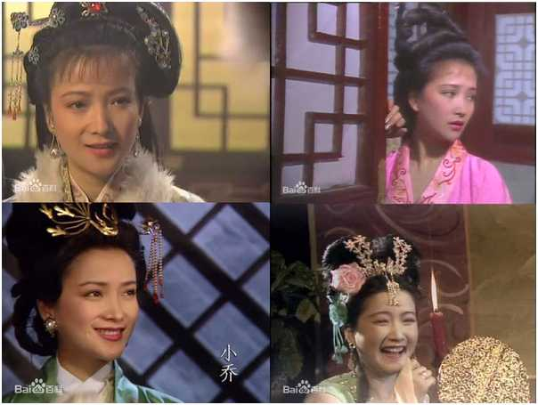

  
### 王忠信
唯一一位演遍四大名著的男演员
《红楼梦》饰甄士隐
《西游记》饰太白金星
《三国演义》饰伏完、华佗  
另有山东版《水浒传》饰吴用

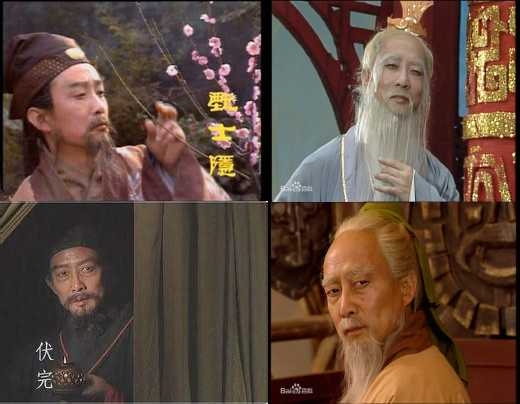

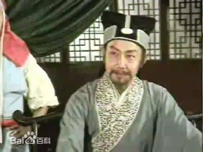

  
### 徐少华  
《三国演义》饰张辽**（演张辽的有徐少华、张亚坤、王卫国三位）**  
《西游记》饰 唐僧  

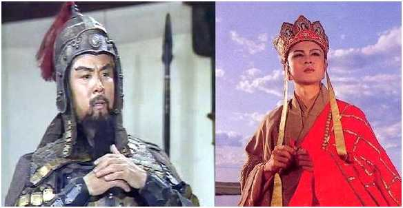

郭家庆  
《三国演义》饰普净（小说里是和尚，电视剧里为道人）、孙乾  
《西游记》饰观音长安送袈裟化身、黄风怪  

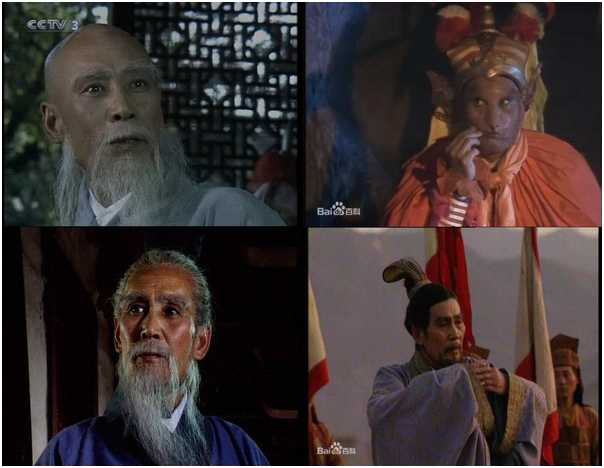

### 邰祖辉

《三国演义》饰曹仁  
《水浒传》饰传 刘唐  

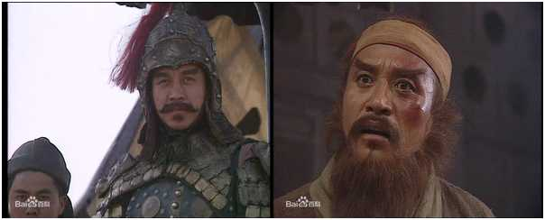

  
### 杨凡  

《三国演义》饰公孙瓒、赵云（青年中年）
《水浒传》饰石秀  

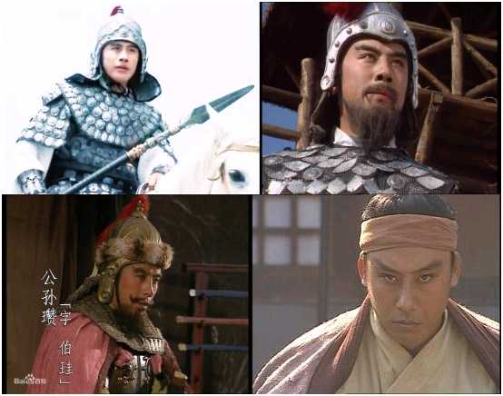

  

### 常玉平  

《三国演义》饰郭淮  
《水浒传》饰施恩  

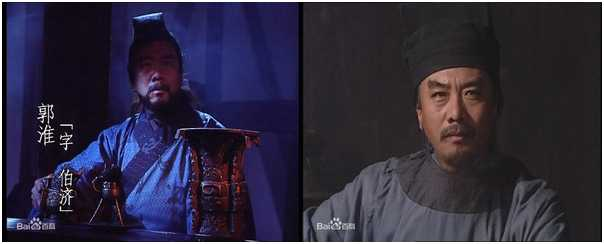

### 张连仲 

《三国演义》饰田丰  
《水浒传》饰朱贵  

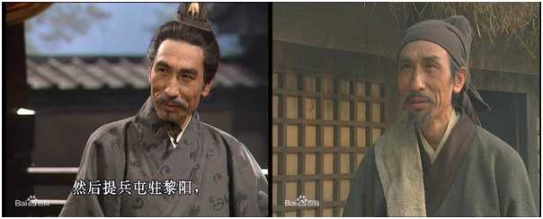

### 唐国强  

《三国演义》饰诸葛亮  
《水浒传》饰苏东坡（虽然历史上应是苏辙，但电视剧里演员表是苏轼，故不予更改）  

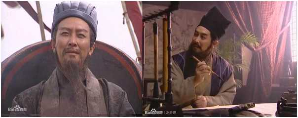

### 陈之辉  

《三国演义》饰 太史慈、廖化、许褚、鲍信  
《水浒传》饰 王进、杨雄  

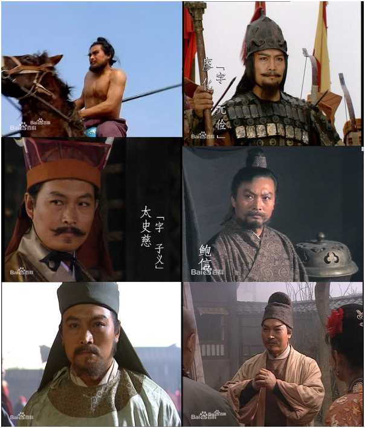

### 李冬果  

《三国演义》饰孟优  
《水浒传》饰阮小七  

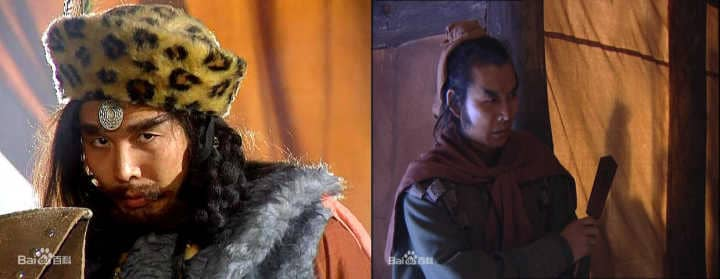

  
### 张治中  

《三国演义》饰马谡  
《水浒传》饰晁盖  

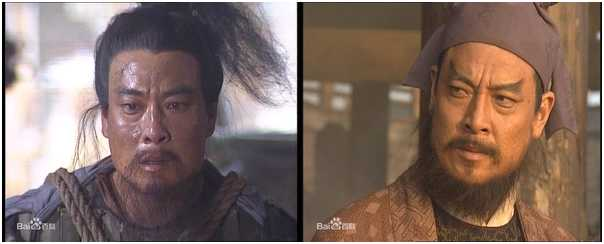

### 郑强  

《三国演义》饰曹真  
《水浒传》饰柴进  

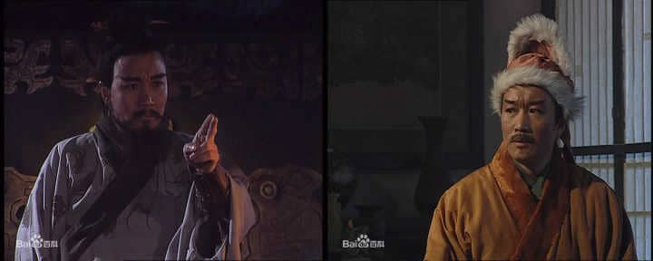

  
### 王光辉  

《三国演义》饰曹睿  
《水浒传》饰燕青

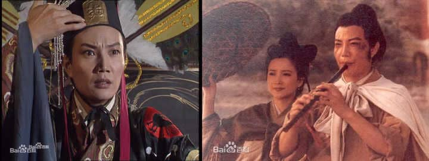
  
### 崔岱  

《三国演义》饰王平  
《水浒传》饰方腊  

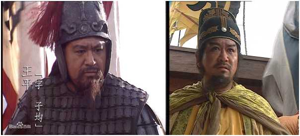

### 魏宗万 

《三国演义》饰司马懿  
《水浒传》饰高俅  

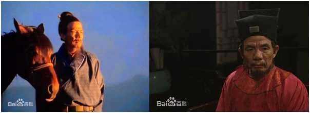

### 李志毅  

《三国演义》饰邓芝  
《水浒传》饰宿太尉  

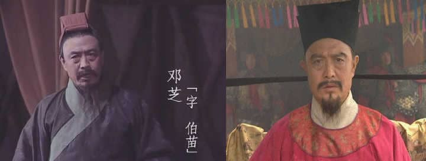

### 潘引来

《三国演义》饰司马师
《水浒传》饰扈成

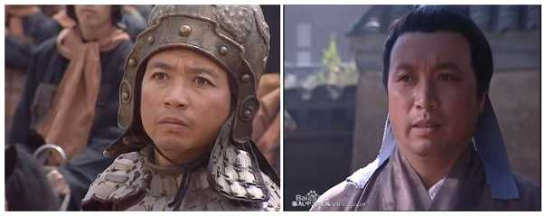

### 啜二勇

《三国演义》饰吕范
《水浒传》饰张文远  

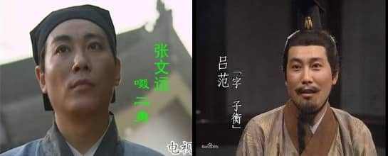

### 张亚坤

《三国演义》饰张辽（演张辽的有徐少华、张亚坤、王卫国三位）
《水浒传》饰张顺

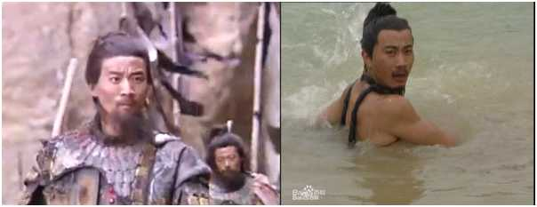  

### 王基明

《三国演义》饰夏侯懋
《水浒传》饰戴宗

### 邢国洲

《三国演义》饰张郃
《水浒传》饰薛霸、蔡福

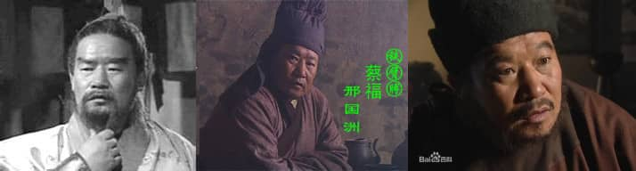
 

### 谢加起

《三国演义》饰颜良
《水浒传》饰曾涂

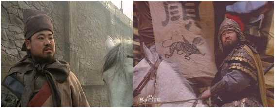
  

### 刘立伟

《三国演义》饰秦琪
《水浒传》饰郑天寿

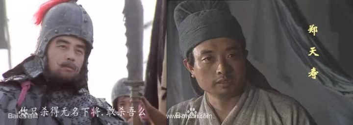

  

### 阎怀礼

《西游记》饰沙僧
《三国演义》饰程普

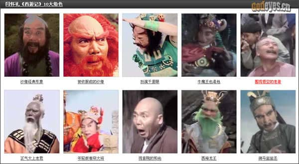

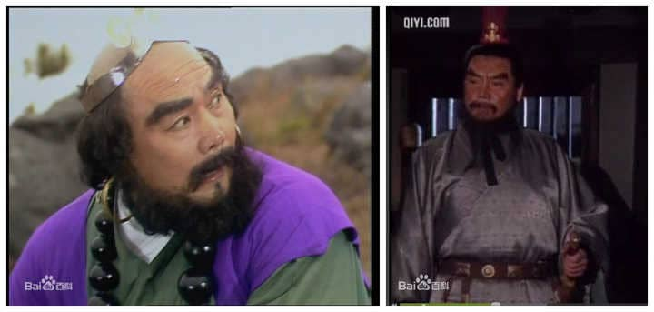

  

### 吴晓东

《三国演义》饰孙权、孙坚
《红楼梦》饰贾芸

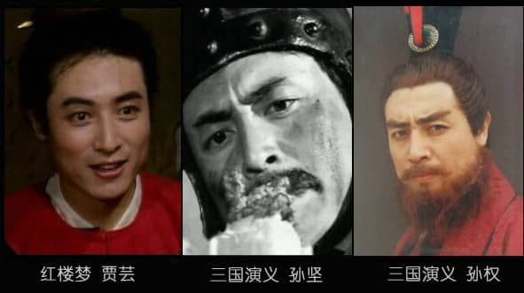

  

### 杨俊勇

《三国演义》饰曹丕
《红楼梦》饰贾蓉

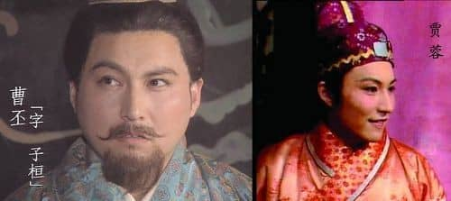

  

### 李凤英

《三国演义》饰卞夫人
《红楼梦》饰梦薛姨妈

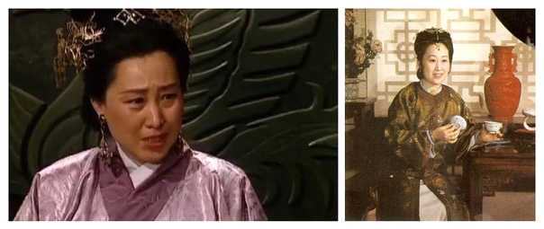

### 魏慧丽

《西游记》饰高翠兰
《三国演义》饰邹氏

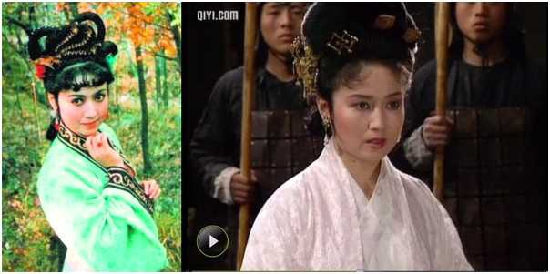

### 王卫国

《西游记》饰玉皇大帝、黄牙老象
《三国演义》饰张辽（演张辽的有徐少华、张亚坤、王卫国三位）
《水浒传》饰卢俊义

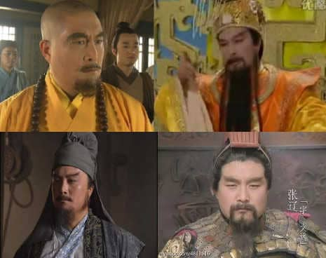

### 黄宗洛

《西游记》饰铜台府刺史
《水浒传》饰郓城知县

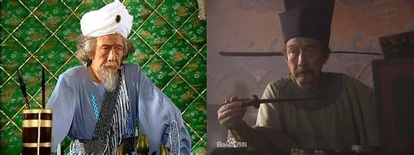

### 刘大刚

《西游记》饰沙僧（《西游记》饰续集）
《三国演义》饰孙綝

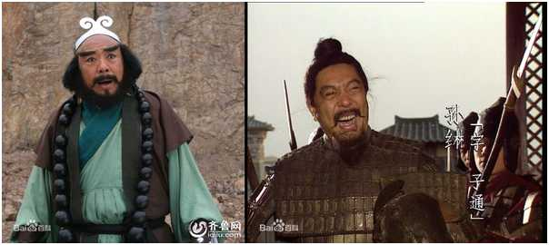

### 贾石头

《西游记》饰青毛狮子怪
《水浒传》饰呼延灼

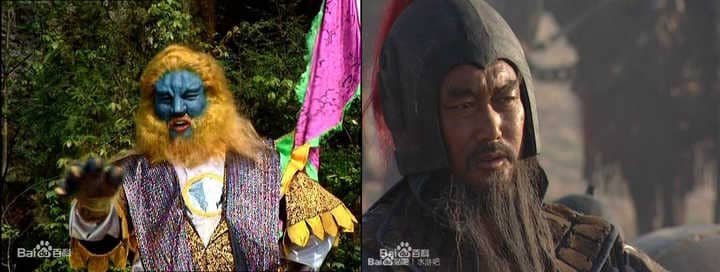

  

### 姬玉

《西游记》饰斑衣鳜
《红楼梦》饰妙玉

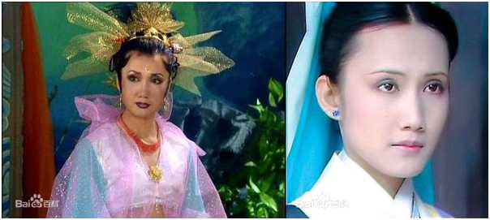

### 郑榕

《西游记》饰太上老君
《三国演义》饰孔融

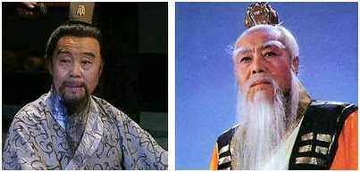

### 孔芮

《西游记》饰蟠桃园土地、高太公
《红楼梦》饰焦大

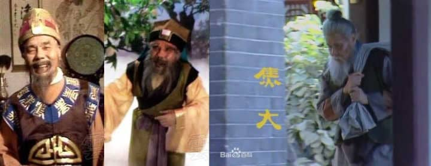

### 陈长龙

《三国演义》饰秦良
《水浒传》饰蔡庆

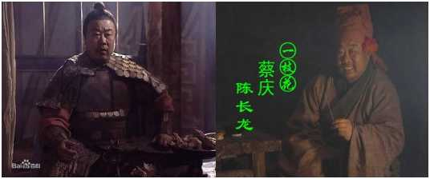

### 张浩

《三国演义》饰马忠（蜀）
《水浒传》饰索超

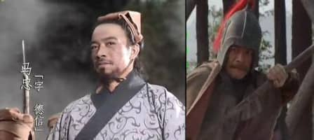

### 曾革

《西游记》饰鹿力大仙
《三国演义》饰黄皓

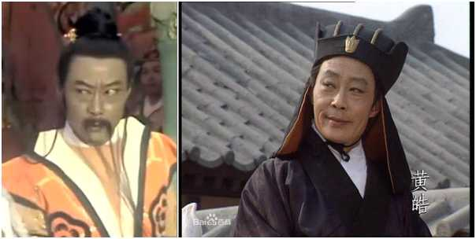

### 王德林

《西游记》饰如意真仙
《三国演义》饰王累  

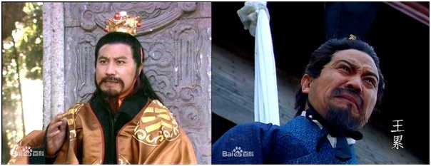

### 韩善续

《西游记》饰独角鬼王、唐朝武将、刘洪、老丈
《三国演义》饰张绣

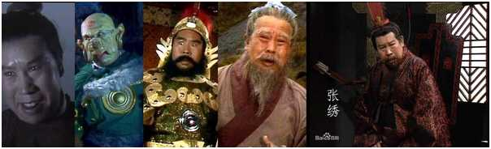

### 于伟杰

《西游记》饰九头虫
《三国演义》饰胡车儿

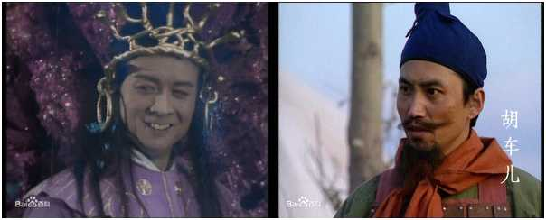

  

### 郭军

《西游记》饰大鹏金翅雕
《水浒传》饰史进、史文恭

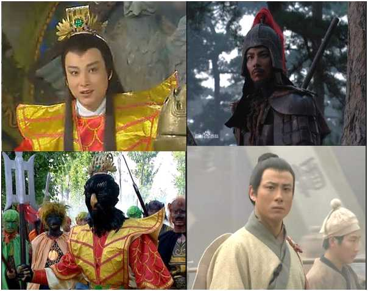

### 王羊

《西游记》饰明月
《红楼梦》饰薛宝琴   

### 李连义

《西游记》饰堂倌、强盗、骷髅精
《水浒传》饰刘高

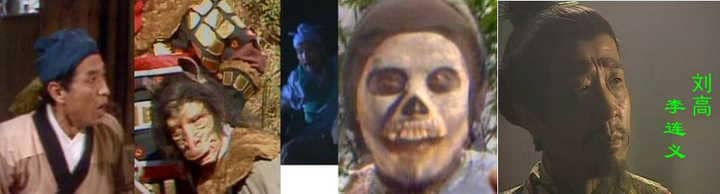

### 汪瑞

《三国演义》饰胡遵
《水浒传》饰赵都头

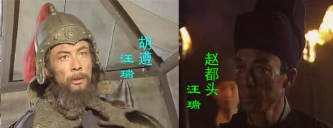

  

### 张洪英

《三国演义》饰王经
《水浒传》饰赵员外

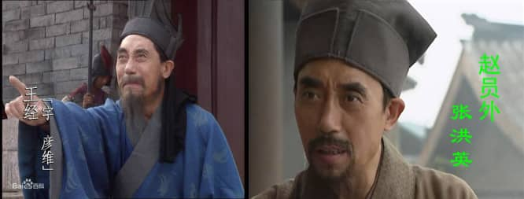

  

### 杨兆权

《三国演义》饰卢植
《水浒传》饰金老汉、草料场老军

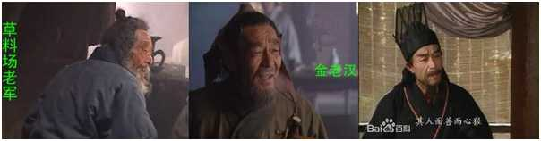

### 李洪涛

《西游记》饰泾河龙王、独角兕大王
《三国演义》饰太史慈

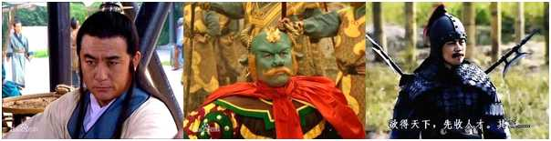

### 白春香

《西游记》饰仙童
《红楼梦》饰蓉儿媳妇

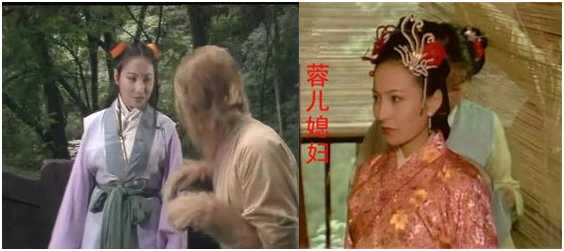

### 安亚平

《西游记》饰鼋龙
《三国演义》饰马超

### 赵玉秀

《西游记》饰车迟国国王
《红楼梦》饰瘦子（许多知友说我写错了演员名字，但我是从百科得到的[赵玉秀（战友文工团演员）](https://link.zhihu.com/?target=http%3A//baike.baidu.com/subview/2439557/9809960.htm%23viewPageContent)）

### 尼格木图

《西游记》饰玉华王
《三国演义》饰徐晃

### 吴桂苓

《西游记》饰镇元大仙
《三国演义》饰黄盖

### 顾岚

《西游记》饰宝象国国王
《三国演义》饰荀彧

### 朱秉谦

《西游记》饰太乙天尊
《三国演义》饰糜竺

### 郭寿阳

《西游记》饰银角大王
《三国演义》饰郭图

  
### 王文友

《三国演义》饰严颜
《水浒传》饰张都监

### 任大惠

《红楼梦》饰钱大人
《水浒传》饰宋太公

### 王鹰

《西游记》饰比丘国国王
《三国演义》饰薛综、邵悌

### 李云娟

《西游记》饰蝎子精
《三国演义》饰祝融夫人

### 王辉

《三国演义》饰伊籍
《红楼梦》饰跛足道人

### 葛治兴

《西游记》饰黑水河河神
《水浒传》饰柳老汉

### 迟国栋

《西游记》饰西海龙王
《三国演义》饰张苞

