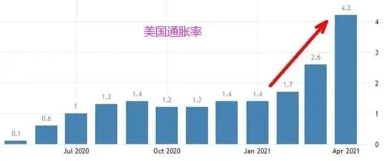
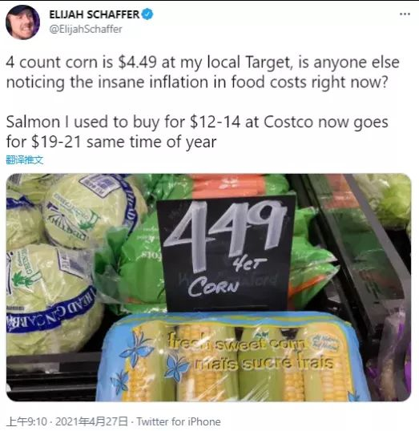
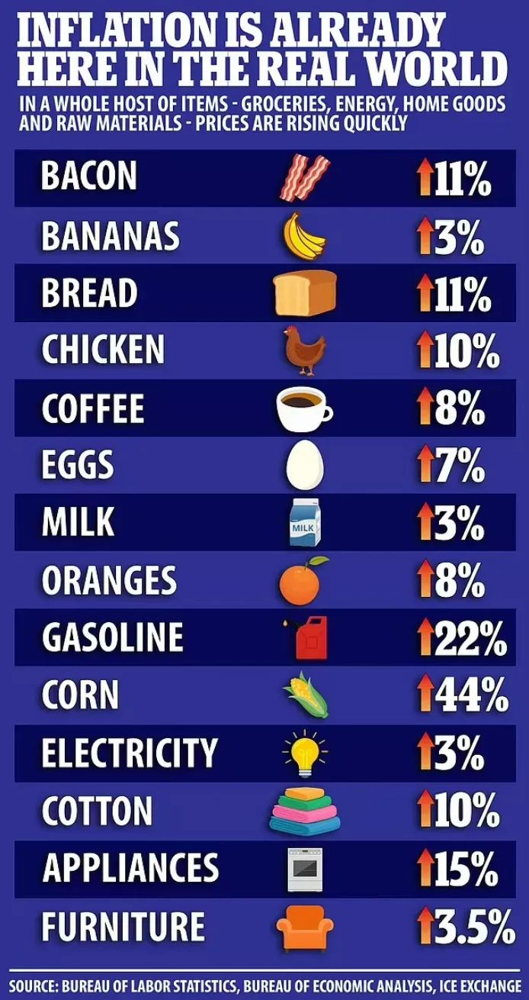

自2020年新冠疫情爆发以来，美国政府应对经济危机的办法就只有一招，那就是印钱。

滔天的美元流入了市场。

一年之内，美联储的资产负债表扩表超过50%，大约印了10万亿美元。

滥印美元不稀奇，稀奇的是，美国居然没产生严重通胀，也就是说印这10万亿美元是没有副作用的。

自2008年金融危机以来，美国一直在印钞，通胀始终控制在2%的温和范围内，到了2020年疯狂的加速印钞，通胀还是很温和。

很多人产生了这样的疑问，连无限印钞都打击不了美元信用，美元霸权真的无解吗？

进入2021年后，拜登继续加足马力印钞票，短短几个月又印了几万亿美元砸进市场。

美国老祖宗们留给后代的庞大底蕴，终于被耗空了。

严重的通胀，降临了美国。

从今年3月份开始，美国的物价开始飞速上升，4月份的情况更加严重，通胀率已经达到了4.2%的严重程度，远远超过2%的警戒线。 

推特上一位美国人发的帖子，能反映出美国目前的基层实际情况。

我给大家翻译一下：“大家有注意到食物涨价了吗？我逛Target的时候发现，4个玉米居然就要4.49美元了！ 还有我逛Costco的时候，发现过去我花12-14美元买的三文鱼，现在要19到21美元了！” 

根据美国记者的调查，目前美国各大超市的日常生活物资集体涨价，其中：

培根涨价11%，香蕉涨价3%，面包涨价11%，鸡肉涨价10%，咖啡涨价8%，鸡蛋涨价7%，牛奶涨价3%，橙子涨价8%，汽油涨价22%，玉米涨价44%，家用电器涨价约15%。 

而美国5月份的房租数据，同比增长达5.4%。  

这一切的大涨价，都是集中在短短一两个月内发生的，美国普通群众对此感知非常明显。

目前美国网站上最流行的评论是，什么都涨，就是工资不涨。

为什么美国以前滥印钞票没事，但这一次就有事。

答案在于中国，以及印度。

以前美国一印钞，全球所有主要国家都得跟着印钞，不印就会被收割。

为什么会这样，我先给大家解释一下。

如果美元印钞，中国不印人民币，那会发生什么后果？

人民币会升值。

人民币升值不好么？

当然不好，这会导致中国制造的商品在海外的价格提升，导致出口困难，本来卖10美元就能保本的东西，现在得卖12美元。

在出口困难的同时，因为人民币升值，以美元计价的产品变得便宜了，于是进口大量增加。

出口减少，进口增加，这会导致你本国的制造业生存困难。

如果你硬撑着不印人民币，那么很快中国的企业就会破产，工人们就会下岗。

你的企业破产了，市场生态位就空出来了，美国的经济问题就解决了。

所以，我们必须跟着印钞。

美元放水，全世界都得跟着通胀。

当美国自身的经济问题得到缓解的时候，他又会退出量化宽松，进入加息周期，境外的美元纷纷回流美国。

突然失去大量的货币，会导致其他国家的资产价格遭遇重创，经济再次遭遇危机。

严格来说，如果美元放水你就放水，美元紧缩你就紧缩，你和美国其实是平等的，理论上来说美国无法通过美元破坏你的经济结构。

但问题的关键是，美元什么时候放水，什么时候回收，这是由美国根据自己的经济需求来决定的。

美国需要放水的时候，你未必需要，美国需要紧缩的时候，你也未必需要，这自然会给其他国家的经济带来极大的困难。

我热的时候喝冰水，这时候不管你冷不冷，你都必须给我喝冰水。

我冷的时候喝热水，这时候不管你热不热，你都必须给我喝热水。

我很舒服，而你当然会很难受。

搞不好，你的身体就会出问题。

一旦你出问题，那美国的问题就解决了。

因为国家之间的竞争，讲究的是相对优势，而不是绝对优势。

我不需要宇宙最强，我只需要比你强，我的国家就很稳定，民众幸福感就会爆棚，这样就不会有太大的社会矛盾。

为什么美国可以这么玩，而其他国家不行？

因为美元是世界货币，这是一种霸权，因为美国逆天的国力，全世界都认美元，只有美元才能采购到商品，这一点你没得办法。

服或者不服，你都得接受美元。

但这一次，中国选择了和美元对抗，没有跟着美国的脚步去印人民币。

美国爆发严重通胀以来，人民币相对美元出现了快速升值。

去年同期的时候，1美元大概可以兑换7人民币，而如今只能兑换6.38人民币了。

这说明在美国狂印美元的时候，中国并没有跟着印等量的人民币，所以导致了人民币升值。

你不跟着美元的脚步印本国货币，这个很简单，但随后带来的出口困难，怎么办？

中国是一个出口大国，外贸对中国而言非常重要，因此以前历次美元放水，中国都会跟，确保人民币不大幅升值，以此来稳定沿海制造业。

为什么这次中国敢让人民币升值了？

因为印度。

货币的信用本质，在于商品。

钞票必须能兑换成商品，它才会具有价值，否则就是废纸一张，你有原子弹都没用。

为什么以前美元的历次放水，都没有引起通胀？

不仅没有在美国引起通胀，也没有在全世界其他地方引起通胀。

因为过去的十几年，本质上是生产过剩，需求不足的十几年。

商品太多了，卖不掉。

还通胀，通胀个鬼，你涨个价试试？我看你胆有多肥。

商品过多，货币不足，你多印点货币自然不会引发通胀，反而更有利于供需平衡。

而作为商品生产的头号大国，在商品供大于求的实际情况面前，中国相当的弱势，话语权并不够，只能跟着印钞。

为什么每次美元一印钞中国的房价就跟着涨，这是最大的原因。

那为什么这次中国敢不印钞了，是什么给了中国不印钞的勇气？

难道不怕中国货卖不掉？

因为新冠疫情和印度。

2020年新冠疫情爆发后，中国奇迹般的抗疫，让中国成为了世界上唯一可以保证开工率的国家。

几十年来，全世界的商品都是供大于求。

但是在2020年，突然变成了供不应求。

商品不足，各种商品都不足，不管你生产出来多少都能卖得掉。

整个2020年，中国的外贸出口订单直接爆了，各大码头都忙到几乎瘫痪。

在美国对中国打贸易战，对中国商品加征25%关税的情况下，中美贸易逆差再创新高。

这说明中国的商品哪怕加价25%，美国人也要买，而且买的比以前更多。

因为这些常规的日用商品，只有中国这边才有货，其他地方一律货源不足，如果不用中国货，那巨大的需求缺口没有办法填平。

美国希望印度能成为替代中国的世界工厂。

可惜印度货质次价高，就算去掉25%的关税成本，也没办法和中国货竞争。

而今年3月初，印度的疫情突然二次爆发，日增感染人数突破天际，给印度的国内生产带来了极大的破坏和干扰。

印度货的缺失，让中国货变成了全世界最硬的硬通货。

有多硬？比美元还硬！

今年以来，美元放水，导致全世界大宗原料迅速涨价。

这是美国试图遏制中国的又一利器。

请注意，美国不是制造业大国，大宗商品里面美国只需要原油。

铁矿石，铜矿石，煤炭等大宗商品，只有中国这样的制造业大国才会需要。

美国要的是商品成品，而不是原料，因为加工厂不在美国。

如果中国商品不涨价，但原材料大幅涨价，中国等于帮美国做义工，在疫情期间打出的优势就荡然无存。

但全世界的原料产地，捏在美国及其盟友手里，你不用也得用。

对此，中国的策略是让人民币升值。

只要人民币升值了，以美元计价的原材料就等于便宜了，中国工厂的成本压力就没那么大了。

但人民币升值，会立即带来出口商品的涨价。

本来卖100美元就能保本的商品，现在得卖110美元才能换回和以前同样多的人民币。

你涨多少是你的事，消费者不认，你岂不就破产了？

按以前的历史惯例，中国从来不敢让人民币升值，这会严重削弱中国商品的竞争力。

但2020年的实际战绩告诉我们，中国货是刚需，美国人只能要，必须要，而3月份印度疫情的大爆发，让美国对中国货的依赖性再次增强。

这种依赖性强到什么程度？

强到人民币升值后，会反过来让美国境内通胀。

中国的日用百货涨价了，但涨价了美国人还是买，因为没有更便宜的货源了。

这不就是通胀么?

虽然核心根源还是美元自身过多，已经击破了临界值，但中国商品的供不应求确实是直接诱因。

几十年来的市场经济，从来都是商品过多，货币过少，商品制造方，尤其是日用商品制造方硬气的情况，前所未见。

像2021年这样，日用商品的制造者一涨价，持币方就只能接受，导致自身通胀的情况，真的是可以写进经济学教科书了。

极为反常。

美国的经济学家做梦也没有想到，中国居然敢让出口商品涨价，而涨价后美国居然还只能硬生生接受。

对于美国普通民众来说，他们可不管什么国与国之间的大道理，他们看到的就是自己生活所用的普通商品全部大幅涨价，但自己的工资没涨。

这会带来严重的社会矛盾。

资产的价格可以随便涨，底层民众不关心，但和老百姓生活息息相关的普通商品，这是万万不能涨价的，尤其是在工资不涨的前提下。

解决美国的通胀问题，有三个办法。

第一个办法，取消对中国商品征收的25%关税，这会直接让中国货大幅降价，通胀问题自然就解决了。

很明显，拜登政府他不敢这么做。

第二个办法，停止美元大放水，加息，回收过多的美元，紧缩货币。

很明显，拜登政府更不敢这么做，加息的口风只要一提，美股就立刻死给你看，因为美国的经济本质上还在疫情困扰中，目前全靠放水续命。

第三个办法，扶持一个中国的替代国，生产出足够的普通商品来替代中国货。

这一招是最可行的，也是最有利于美国的，本来美国扶持了印度，打算让印度成为第二个中国，为美国代工，提供普通商品。

但没想到，印度太不靠谱了，简直是烂泥扶不上墙。

三招都不用或者失效，美国就必然出现通胀，因为钞票的数量超过了商品的数量。

通胀降临后，美国国内的痛苦指数会急速飙升。

美国觉得中国离不开美国的市场，必须向美国低头。

中国觉得美国离不开中国的工厂，必须平等姿态和中国谈判。

国家之间不讲感情，只谈实力。

谁对谁错，战果说话。

没想到，疫情给中国送上了一个天大的助攻，直接把美国给打蒙了。

中国货涨价也爆卖，甚至供不应求导致通胀，这是贸易战以前，任何人都不敢想的事。

但没想到，这真的成为了事实。

有人会说，中国的命真好，连疫情都能送助攻，真是国运昌隆。

但你看看这个疫情在全世界掀起的风波，这病毒真的那么好对付么？

危机危机，危中有机。

全世界拿到的考题都是一样的，为啥只有中国得到的是机遇，其他国家得到的全是危险？

而且中国还是第一个进考场的。

有些国家，它不是运气好，而是实力强。
