名著里西游记的谣言应该是最多的地方，虽然西游记家喻户晓，但大多数人是通过影视和网络了解的，并没有真正通过原著了解，之前在贴吧写过一篇针对西游记一些流传甚广的谣言进行辟谣的帖子，就在这里发一下吧，顺便修改完善一些论证

贴吧地址：[https://tieba.baidu.com/p/6819860614#133464303076l](https://link.zhihu.com/?target=https%3A//tieba.baidu.com/p/6819860614%23133464303076l)

### 孙悟空是女娲石

这个是经典老谣言了，至今仍被许多西游记创作作品所引用，但实际上原著里孙悟空和女娲石压根没八竿子打不着，我们看原著第一回怎么写的

>那座山正当顶上，有一块仙石。其石有三丈六尺五寸高，有二丈四尺围圆。三丈六尺五寸高，按周天三百六十五度；二丈四尺围圆，按政历二十四气。上有九窍八孔，按九宫八卦。四面更无树木遮阴，左右倒有芝兰相衬。盖自开辟以来，每受天真地秀，日精月华，感之既久，遂有灵通之意。内育仙胞。一日迸裂，产一石卵，似圆球样大。因见风，化作一个石猴。五官俱备，四肢皆全。便就学爬学走，拜了四方。目运两道金光，射冲斗府。

孙悟空是开天辟地以来就存在的一块仙石，书里称呼孙悟空是【天地育成之体，日月孕就之身。】是纯纯天生地养的天产石猴，天地之子，正所谓【生身父母是天地，日月精华结圣胎。仙石怀抱无岁数，灵根孕育甚奇哉。】,甚至还能和大道扯上关系，第一回标题就是【灵根育孕源流出心性修持大道生】。

而孙悟空寻找到水帘洞被众猴尊为猴王后作者给他写了一首赞诗

>三阳交泰产群生，仙石胞含日月精。借卵化猴完大道，假他名姓配丹成。

逼上甩女娲石几百条街

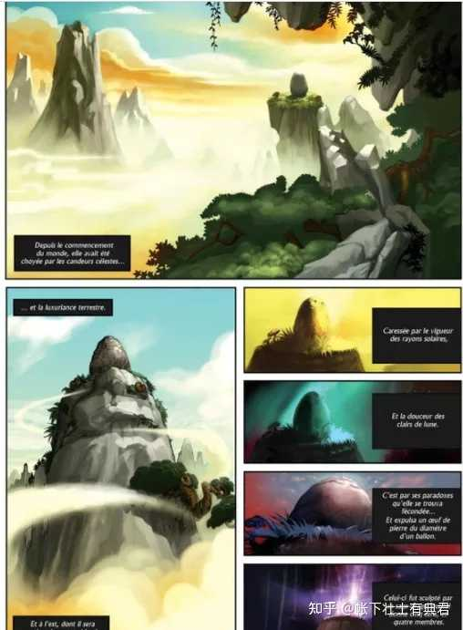

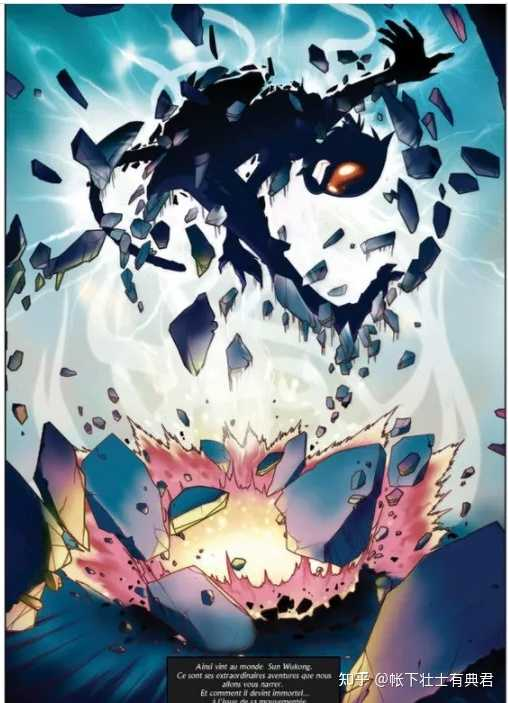

图片来自国人漫画家张健一老师创作的法国版西游记猴神

***

### 孙悟空原著没打进南天门

我们看原著第七回

>这一番，那猴王不分上下，使铁棒东打西敌，更无一神可挡。只打到通明殿里，灵霄殿外。

一句话直接打脸了，原著孙悟空更无一神可挡打到通明殿里，凌霄殿外，通明殿与凌霄殿是一体的，都在金阙云宫之内，是玉帝朝见群臣的地方，也是天庭最后防线，唯一没被孙悟空拔掉的地点，毕竟在打下来天庭真的没了，所以在和王灵官打斗的赞词里我们能发现这一句

>这个是太乙雷声应化尊，那个是齐天大圣猿猴怪。金鞭铁棒两家能，都是神宫仙器械。今日在【灵霄宝殿】弄威风，各展雄才真可爱。一个欺心要夺斗牛宫，一个竭力匡扶玄圣界。

再看西天路上孙悟空上南天门，南天门守将的反应

>好行者，一筋斗跳上南天门里，唬得个庞刘苟毕躬身，马赵温关控背，俱道：“不好了！不好了！那闹天宫的主子又来了！”——第十六回
>那大圣一时忍不住怒发，攥着铁棒，打个筋斗，只跳到南天门上。慌得那庞刘苟毕、张陶 邓辛等众，两边躬身控背，不敢拦阻，让他打入天门——第三十一回

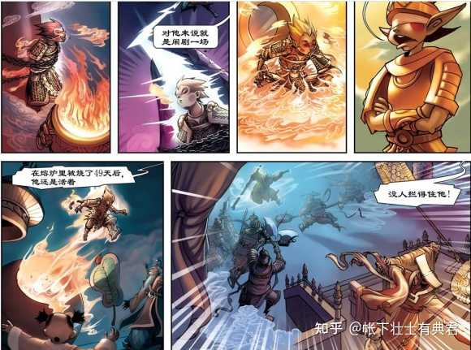

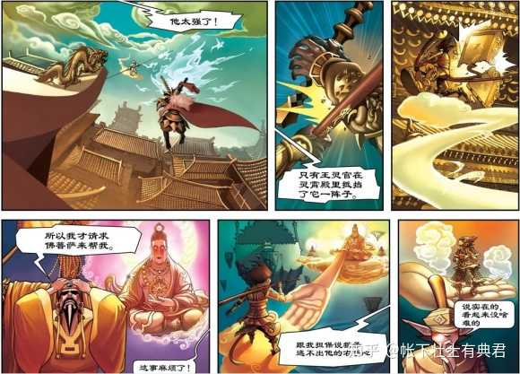

图片来自国人漫画家张健一老师创作的法国版西游记猴神

***

### 猪八戒实力强大取经路上隐藏实力在高老庄和孙悟空打了三天三夜平手，最后肚子饿了才归顺

以前由吴闲云 煮酒论西游衍生出来的谣言，槽点巨多，我们直接看原著高老庄孙悟空vs猪八戒究竟是个什么情况吧

>他两个自二更时分，直斗到东方发白。那怪不能迎敌，败阵而逃，依然又化狂风，径回洞里，把门紧闭，再不出头】
>“我才试他一试耍子，此去一定拿来与你们看，且莫忧愁。”

猴子耍了猪八戒一晚上把猪八戒耍得败阵而逃，我实在不知道三天三夜平手何在。

>行者闻言，收了铁棒道：“呆子不要说嘴！老孙把这头伸在那里，你且筑一下儿，看可能魂消气泄？”那怪真个举起钯，着气力筑将来，扑的一下，钻起钯的火光焰焰，更不曾筑动一些儿头皮。唬得他手麻脚软，道声“好头！好头！”

第二次孙悟空看直接站着让猪八戒打，猪八戒的全力一击，连孙悟空的一根毫毛都伤不了，自己反而被震得手麻脚软，直接服了孙悟空，随后孙悟空道出取经一事，猪八戒发现唐僧就是观音要他等的取经人，遂归降

但仅仅对孙悟空的这一场记录还无法说明猪八戒的水平，要明确论证原著猪八戒的实力还得继续结合他后续的表现，那原著猪八戒具体实力究竟如何？还得继续结合他后续的表现，这就不得不先提到这几位猪八戒的一生之敌了

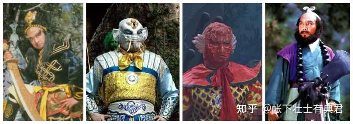

首先有请第一位，前期的大BOSS，他不但贡献了西游记里唯一战斗力公式，还对西游记的论武以及打击地摊网文有着不可磨灭的伟大功绩，也是猪八戒的绝对克星，他就是奎星奎木狼先生。

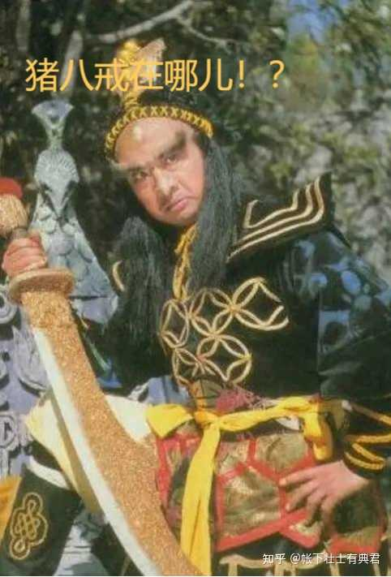

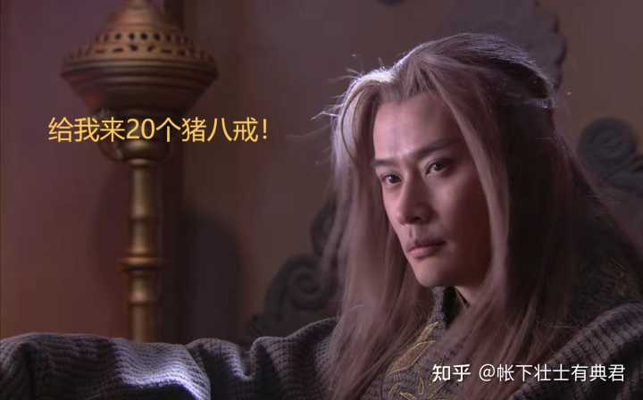

我们先来看看被誉为头号打猪高手的奎木星官与猪八戒的首次交手情况

>【却说那八戒、沙僧与怪斗经个三十回合，不分胜负。你道怎么不分胜负？若论赌手段，莫说两个和尚，就是二十个，也(敌不过)那妖精。只为唐僧命不该死，暗中有那护法神祇保着他，空中又有那六丁六甲、五方揭谛、四值功曹、一十八位护教伽蓝，(助着)八戒沙僧。】
>【他们在那山坡前，战经八九个回合，八戒(渐渐不济)将来，钉钯难举，气力不加。你道如何这等战他不过？当时初相战斗，有那护法诸神，为唐僧在洞，暗助八戒沙僧，故仅得个手平；此时诸神都在宝象国护定唐僧，所以(二人难敌)。那呆子道：“沙僧，你且上前来与他斗着，让老猪出恭来。】

作者旁白钦定二十个猪沙都不是奎木狼的对手，在保护唐僧的那群护法神的暗中帮助下才能与奎木狼战了三十回合，而后面在失去护法神的暗中帮助后，猪八戒加上沙僧在奎木狼面前不堪一击，仅八九个回合就被打爆了，猪八戒以要拉屎的借口狼狈逃跑，留下沙僧一个人被奎木狼活捉，战斗力差距可以说相当巨大。

后面猪八戒智激孙悟空，把猴哥请回来降妖后，看看孙悟空打奎木狼是什么表现

>行者心中暗喜道：“这个泼怪，他那口刀，倒也抵得住老孙的这根棒。等老孙丢个破绽与他，看他可认得”好猴王，双手举棍，使一个高探马的势子。那怪不识是计，见有空儿，舞着宝刀，径奔下三路砍，被行者急转个大中平，挑开他那口刀，又使个叶底偷桃势，望妖精头顶一棍就打得他无影无踪。
>你道他在那里(躲)避？他原来是孙大圣大闹天宫时打怕了的神将，闪在那山涧里(潜灾)，被水气隐住妖云，所以不曾看见他。他听得本部星员念咒，(方敢)出头。

奎木狼与猴子平A打了五六十回合后被猴子用武术技巧击败，当年还是被猴子打怕的神将。奎木狼这一章是展现孙悟空与猪八戒的实力对比最为强烈的一个章节了，通过猪沙马与孙悟空对战妖王的强烈反差来告诉读者，取经没有孙悟空，基本寸步难行，这里还有一个很有意思的点，奎木狼是除了白骨精外唯一一个被孙悟空三打的角色，十万天兵围剿花果山一次，大闹天宫一次，取经路上一次。

如果一个例子不能证明什么我们在看第二位，他是西游记里往往被人忽略的阿卡林妖王，虽然手下只有区区数百人的小妖，但本人确拥有能和统领八万天河水军的带元帅超绝激斗的强悍战力，他就是狐阿七大王。

登场于平顶山一节，与金角一起组成复仇军团来讨伐孙悟空等人，联手金角大王与孙悟空猪八戒发生了激烈战斗，原著里是这么写的

>【狐王阿七与行者在山头一来一往，战经(三四回合)，那怪力软，(败阵回走)。行者赶来，却被金角接住，又斗了三合，只见那狐阿七复转来攻。这壁厢八戒见了，急掣九齿钯挡住。一个抵一个，(战经多时)，(不分胜败)】

这个不分胜败就相当的有灵性

接着请第三位，他是狮驼岭隐藏的最深的大王，妖祖的欧尼酱，玉皇大天尊 在妖界开的隐藏小号，一条铁鼻无敌手，打遍西方万里游，他就是大家熟悉的狮驼岭三基佬中的白象天尊

先看白象天尊与猪八戒的第一次打斗

>二怪即出营，见了八戒，更不打话，挺枪劈面刺来。这呆子举钯上前迎住。他两个在山坡前搭上手，斗不上七八回合，(呆子手软，架不得妖魔)，急回头叫：“师兄，不好了！扯扯救命索，扯扯救命索！”

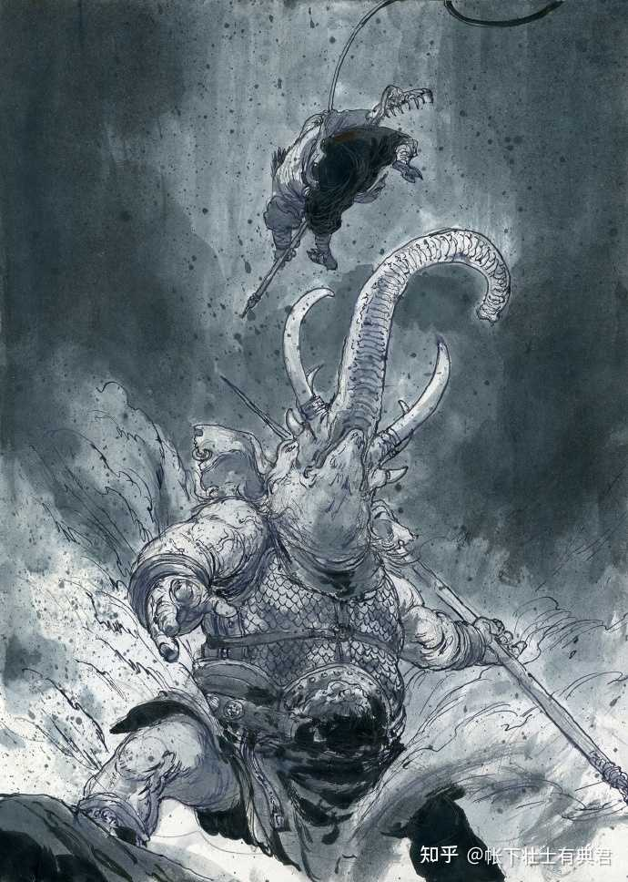

图片来自于刘冬子老师画的狮驼岭

仅用武力七八回合便打得猪八戒手软，架不住。但遇上孙悟空后就变成了这样

>那妖精见行者棒重，满身解数，全无破绽，就把枪架住

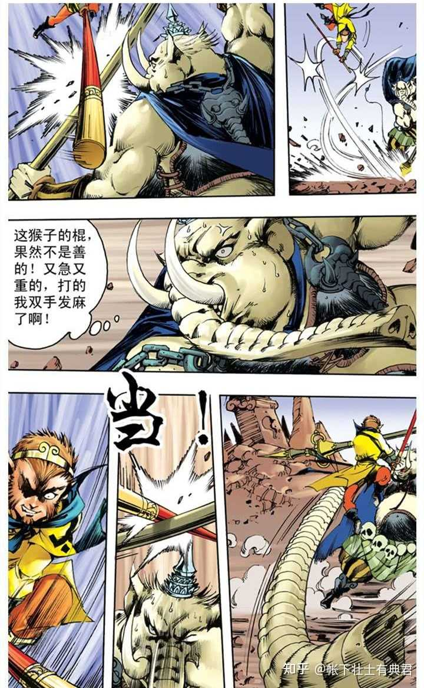

再来第四位，他是能在水底压制掌管天河水军的水军统领的强大海王，手持一柄八亿斤九瓣铜锤，一念飘雪冰封八百里天地君临陈家庄，鱼中第一好汉，他就是灵感大王

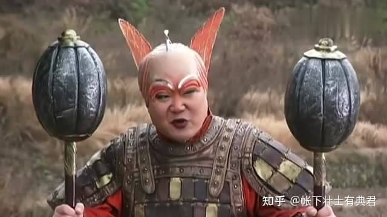

原著里八戒沙僧首次在水中联合作战便是对灵感，但打了两个时辰后

【三人在水底下斗经两个时辰，不分胜败。猪八戒料道不得赢他，对沙僧丢了个眼色，二人诈败佯输，各拖兵器，回头就走】猪+沙自料打不赢灵感

——————————————————————

而悟空三回合就把灵感打得败阵逃命，灵感被打的心有余悸，后面提到，如若再打三回合，灵感恐怕就要把命也交代了

【我闪过与他相持。也不知他那棍子有多少斤重，我的铜锤莫想架得他住，战未三合，我却败回来也】

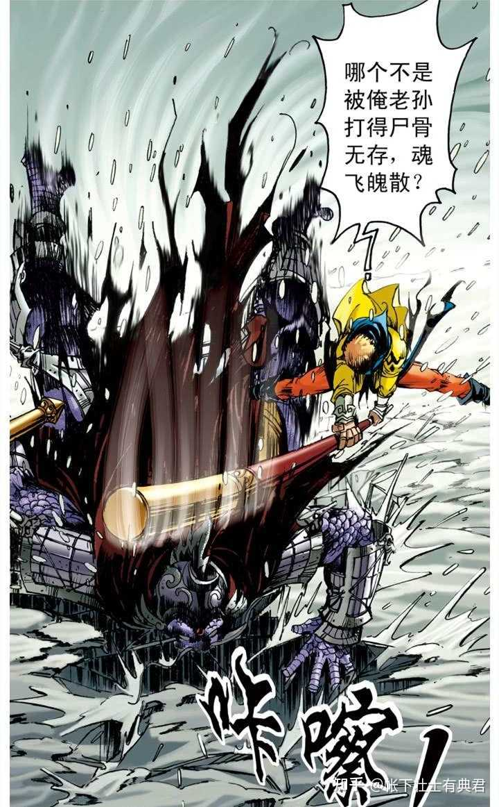

图片来自于神界村人的漫画西游记

除了这五个最明显的例子外，原著里还有诸如蜘蛛精九头虫木叉南山大王虎先锋蟒蛇精等一大堆对比，随便列举其中一个

七蜘蛛足矣生擒八戒

>跳出水来，都跑在亭子里站立，作出法来：脐孔中骨都都冒出丝绳，瞒天搭了个大丝篷，把八戒罩在当中。那呆子忽抬头，不见天日，即抽身往外便走，那里举得脚步！原来放了绊脚索，满地都是丝绳，动动脚，跌个禋踵：左边去，一个面磕地；右边去，一个倒栽葱；急转身，又跌了个嘴躭地；忙爬起，又跌了个竖蜻蜓。也不知跌了多少跟头，把个呆子跌得身麻脚软，头晕眼花，爬也爬不动，只睡在地下呻吟。那怪物却将他困住，也不打他，也不伤他，一个个跳出门来，将丝篷遮住天光，各回本洞。

而七蜘蛛碰上悟空，惨不忍睹，乱杀

>好大圣，把叉儿棒幌一幌，复了一根铁棒，双手举起，把七个蜘蛛精，尽情打烂，却似七个暧肉布袋儿，脓血淋淋。

其他这里就不详细的一一举例了

并且猪八戒还有一个致命弱点，极其不擅以一敌多，战斗心态很差，这里在原著三十二回有明显的提及

>即回头招呼小怪，一齐动手。若是一个打一个，其实还好。他见那些小妖齐上，慌了手脚，遮架不住，败了阵，回头就跑。原来是道路不平，未曾细看，忽被蓏萝藤绊了个踉跄。挣起来正走，又被个小妖，睡倒在地，扳着他脚跟，扑的又跌了个狗吃屎，被一群赶上按住，抓鬃毛，揪耳朵，扯着脚，拉着尾，扛扛抬抬，擒进洞去。

一旦被群殴，几个战斗力强的小妖都能生擒猪八戒，每次三兄弟打团战，你会发现猪八戒总是最先掉链子败阵的那一个，比如狮驼岭对狮象鹏三兄弟，青龙山对三犀牛，竹节山对七狮，盘丝洞对七虫【蜘蛛精的干儿子】，猪八戒往往第一个败阵，或者被擒，最后基本都会变成孙悟空1V3的情况，这一点在清代汪象旭 编纂的西游证道本里也有吐槽，并且在对阵七狮和七虫这两战中三兄弟处于劣势的时候，也都是靠孙悟空的神通进行破局，反杀，未见隐藏实力的猪八戒用出过什么大神通来在战斗里证明自己

对战七狮子，猪八戒随便被两个活捉孙悟空直接用神通秒杀

>【众妖精一齐赶来，被行者拔一把毫毛，嚼碎喷将去，叫声：“变！”即变做百十个小行者，围围绕绕，将那白泽、狻猊 、抟象、伏狸并金毛狮怪围裹在中。沙僧行者却又上前攒打。到晚，拿住狻猊、白泽，走了伏狸、抟象。】
>【行者闻得城上人喊嚷，情知中了他计，急唤沙僧仔细；他却把臂膊上毫毛，尽皆拔下，入口嚼烂喷出，变作千百个小行者，一拥攻上，当时拖倒猱狮，活捉了雪狮，拿住了抟象狮，扛翻了伏狸狮，将黄狮打死】

对战七虫

>那些怪见呆子凶猛，一个个现了本象，飞将起去，叫声“变！”须臾间，一个变十个，十个变百个，百个变千个，千个变万个，个个都变成无穷之数。只见：满天飞抹蜡，遍地舞蜻蜓。蜜蚂追头额，蜍蜂扎眼睛。班毛前后咬，牛蜢上下叮。扑面漫漫黑，翛翛神鬼惊。
>八戒慌了道：“哥啊，只说经好取，西方路上，虫儿也欺负人哩！”行者道：“兄弟，不要怕，快上前打！”八戒道：“扑头扑脸，浑身上下，都叮有十数层厚，却怎么打？”行者道：“没事！没事！我自有手段！”沙僧道：“哥啊，有甚手段，快使出来罢！一会子光头上都叮肿了！”好大圣，拔了一把毫毛，嚼得粉碎，喷将出去，即变做些黄、麻、鴏、白、雕、鱼、鹞。八戒道：“师兄，又打甚么市语，黄啊、麻啊哩？”行者道：“你不知，黄是黄鹰，麻是麻鹰，鴏是鴏鹰，白是白鹰，雕是雕鹰，鱼是鱼鹰，鹞是鹞鹰。那妖精的儿子是七样虫，我的毫毛是七样鹰。”鹰最能啄虫，一嘴一个，爪打翅敲，须臾，打得罄尽，满空无迹，地积尺余。

七虫把八戒蛰得毫无办法，只能靠悟空解救，悟空使用身外身配合七十二变瞬间解决了七虫

原著里还有一些侧面细节描写对比孙悟空与猪八戒，比如孙悟空在力量上一只手就能按住猪八戒，猪八戒根本无法挣脱

>【八戒道：“哥啊，他们都是经过帐的，风响便是妖来。他都去躲，我们又不与他有亲，又不相识，又不是交契故人，看他做甚？”原来行者力量大，不容说，一把拉在天井里站下】
>【八戒、沙僧也都要躲，被行者左右手扯住他两个道，“兄弟们，不要怕得，我和你认他一认，看是个甚么妖精。”八戒道：“可是扯淡！认他怎的？众官躲了，师父藏了，国王避了，我们不去了罢，炫的是那家世！”【那呆子左挣右挣，挣不得脱手，被行者拿定多时】

猪八戒得知孙悟空要打他，经常会吓破胆

>八戒慌了道：“那个哭丧棒重，擦一擦儿皮塌，挽一挽儿筋伤，若打五下，就是死了！”

时常沦为孙悟空使用技能装逼的陪衬，例如在三十八回里一口气救吹飞了猪八戒

>好大圣，捻着诀，念声咒语，往巽地上吸一口气，吹将去就是一阵狂风，把八戒撮出皇宫内院

而原著里无论是作者还是其他角色对猪八戒实力的评价基本都是诸如【呆子】【放屁添风】【没什么大本事】【无能】【不顶用】之类的，从没有哪个角色还是作者指出猪八戒实力其实很强，但隐藏实力，出工不出力的，毕竟猪八戒好几次都要被妖怪蒸了，祈祷着猴哥来救他，都要被蒸了还放水不出力。

***

### 孙悟空怕三昧真火

这个属于影视误导，但很多居心叵测的人常拿这一点来说西游记什么阴谋下大棋，比如吴闲云就结合电视剧里太上老君炉子里的也是三昧真火，拿这一点来说太上老君当年放水，并且扯出红孩儿是老君私生子的经典神论

我们看看原著是不是这样的呢？

原著四十一回

>【他也不顾行者，跑过涧去了。这行者神通广大，捏着避火诀，撞入火中，寻那妖怪。。。。。行者被他烟火飞腾，不能寻怪，看不见他洞门前路径，抽身跳出火中。】
>
>【那雨淙淙大小，莫能止息那妖精的火势。原来龙王私雨，只好泼得凡火，妖精的三昧真火，如何泼得？好一似火上浇油，越泼越灼。大圣道：“等我捻着诀。钻入火中！”轮铁棒，寻妖要打。那妖见他来到，将一口烟，劈脸喷来。行者急回头，刍得眼花雀乱，忍不住泪落如雨。【原来这大圣不怕火，只怕烟。当年因大闹天宫时，被老君放在八卦炉中，锻过一番，他幸在那巽位安身，不曾烧坏，只是风搅得烟来，把他刍做火眼金睛，故至今只是怕烟。】那妖又喷一口，行者当不得，纵云头走了。】

我想原著说得非常明白了，孙悟空不怕火，一个避火诀就能免疫三昧真火，只怕烟，怕烟是因为孙悟空当年在八卦炉遗留下了一个老害病眼火眼金睛。

而且原著红孩儿释放三昧火的方式也和电视剧不一样

需要命人搬出五辆五行车在门口摆列，然后自己站在中间的车上，锤破自己的鼻子释放
（没有五行车的话红孩儿是无法用出三昧真火的，必须得五行车配合，三昧真火的主要火力也是来自于五行车随即放出来的火焰，五行车原著被称为火具）

>二人赶到他洞门前，只见妖精一只手举着火尖枪，【站在那中间一辆小车儿上，一只手捏着拳头，往自家鼻子上捶了两拳。】。。。。【念个咒语，口里喷出火来，鼻子里浓烟迸出，闸闸眼火焰齐生。那五辆车子上，火光涌出。连喷了几口，只见那红焰焰、大火烧空，把一座火云洞，被那烟火迷漫，真个是谶天炽地。】
>
>【急纵身，挺着长枪，教：“小的们，推出火车子来！”】
>
>【那妖王与行者战经二十回合，见得不能取胜，虚幌一枪，怎抽身，捏着拳头，又将鼻子捶了两下，却就喷出火来。那门前车子上，烟火迸起；口眼中，赤焰飞腾。】

原著太上老君炉子里的火叫六丁神火

>老孙其实有手段，全然不怕半分毫。送在老君炉里炼，【六丁神火慢煎熬。】
>百计千方弄不死，将吾押赴老君堂。【六丁神火炉中炼】，炼得浑身硬似钢。

那么除了红孩儿外另一个会三昧火的人是谁呢，没错，就是孙悟空

>【那猴吃了蟠桃，饮了御酒，又盗了仙丹。我那五壶丹，有生有熟，被他都吃在肚里，运用【三昧火】，锻成一块，所以浑做金钢之躯，急不能伤。】金刚之躯就是孙悟空用三昧火把金丹蟠桃御酒炼成一块炼成的

后面还吹真火点过灯

>【他喜孜孜跳出方丈，径来佛殿看时，天上有星，月还未上，那殿里黑暗暗的。他就吹出真火，点起琉璃，东边打鼓，西边撞钟。】

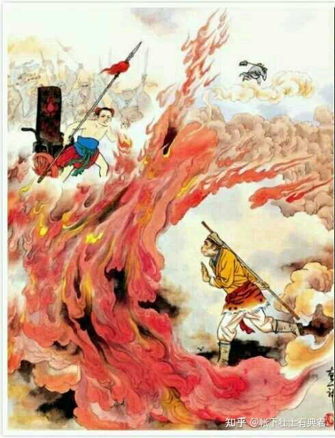

***

### 哪吒师父是太乙真人

这个属于封神演义的锅，太乙真人复活哪吒，并且是哪吒师父，属于封神演义原创。

西游记中，哪吒是由如来复活，并且师父也是如来

>【他左手掌上有个“哪”字，右手掌上有个“咤”字，故名哪咤。这太子三
>朝儿就下海净身闯祸，踏倒水晶宫，捉住蛟龙要抽筋为绦子。天王知
>道，恐生后患，欲杀之。哪咤奋怒，将刀在手，割肉还母，剔骨还父，还了父精母血。一点灵魂，径到西方极乐世界告佛。佛正与众菩萨讲经，只闻得幢幡宝盖有人叫道：“救命！”佛慧眼一看，知是哪咤之
>魂，即将碧藕为骨，荷叶为衣，念动起死回生真言，哪咤遂得了性命
>。运用神力，法降九十六洞妖魔，神通广大。后来要杀天王，报那剔骨之仇。天王无奈，告求我佛如来。如来以和为尚，赐他一座玲珑剔透舍利子如意黄金宝塔。那塔上层层有佛，艳艳光明。唤哪咤以佛为
>父，解释了冤仇。】——出自原著八十三回

而复活哪吒以及哪吒的师父是如来源于三教搜神大全，哪吒其实是一个梵神，很合理

>以故托胎於托塔天王李靖。母素知夫人生下长子金吒，次木吒，帅三胎哪吒。生五日化身浴於东海，脚踏水晶殿，翻身直上宝塔宫。龙王以
>踏殿故，怒而索战。帅时七日，即能战，杀九龙。老龙无奈何而哀
>帝，帅知之，截战於天门之下而龙死焉。不意时上帝坛，手搭如来弓
>箭，射死石记娘娘之子，而石记兴兵。帅取父坛降魔杵西战而戮之。父以石记为诸魔之领袖，怒其杀之以惹诸魔之兵也。帅遂割肉刻骨还
>父，而抱真灵求全於世尊之侧。世尊亦以其能降魔故，遂折荷菱为骨、
>藕为肉、丝为筋、叶为衣而生之。授以密旨，亲受木长子三字，遂能
>大能小，透河入海，移星转斗；吓一声，天颓地塌；呵一气，金光罩
>世；砖一响，龙顺虎从；枪一拨，乾旋坤转；绣球丢起，山崩海裂。

不过现代封神原创的太乙真人版本传播更广

小科普：西游记版本的哪吒六般兵器为斩妖剑、砍妖刀、缚妖索、降
妖杵、绣球儿、火轮儿，而不是乾坤圈，火尖枪浑天绫，风火轮，金
砖。

现在大部分人对于哪吒武器的了解更多的是乾坤圈，火尖枪浑天绫，风火轮这个封神演义的版本，在哪吒的武器上，封神演义的版本流传
的比较广泛，而西游哪吒流传下来的更多是对外貌的设定【清秀可
爱】，封神的哪吒是个四米壮汉

如今我们看到的哪吒，是封神西游的双重结合版【西游的外貌，封神的武器和师父】这些设定经过流传融合演变已经深入人心了

题外话的题外话
李靖一家都是佛教的，和四大天王一样在天庭任职，天庭的组成属于
佛道混合

木吒是观音护法，金吒侍奉如来，做前部护法

>【大小儿名金咤，侍奉如来，做前部护法；二小儿名木叉，在南海随观世音做徒弟】

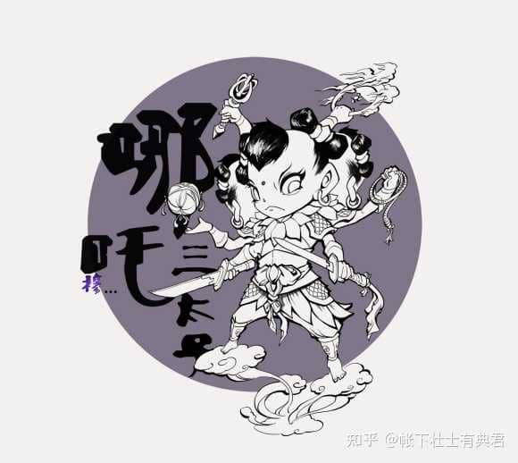

图片来自西游记吧一吧友所绘

***

### 太上老君是创世神

很多人一定是看到网上有一篇西游记地摊文里面，作者拿原著的一句【李老君乃开天辟地之祖，尚坐于太清之右】然后断章取义+脑补说太上老君是创世神，这篇地摊文叫勘破西游，作者叶知秋 ，西游圈里和吴闲云并称两大阴谋论毒瘤的存在，还经常在西游贴吧窥屏

那么原著的世界观究竟是怎么回事呢？我们看第一回

原著第一回开头就表明了西游记的世界是如何诞生的

>诗曰：混沌未分天地乱，茫茫渺渺无人见。自从【盘古破鸿蒙，开辟从兹清浊辨。】
>覆载群生仰至仁，发明万物皆成善。欲知造化会元功，须看西游释厄传 。
>盖闻天地之数，有十二万九千六百岁为一元。将一元分为十二会，乃子、丑、寅、卯、辰、巳、午、未、申、酉、戌、亥之十二支也。每会该一万八百岁。且就一日而论：子时得阳气，而丑则鸡鸣；寅不通光，而卯则日出；辰时食后，而巳则挨排；日午天中，而未则西蹉；申时晡而日落酉，戌黄昏而人定亥。譬于大数，若到戌会之终，则天地昏缯而万物否矣。再去五千四百岁，交亥会之初，则当黑暗，而两间人物俱无矣，故曰混沌。又五千四百岁，亥会将终，贞下起元，近子之会，而复逐渐开明。邵康节曰：“冬至子之半，天心无改移。一阳初动处，万物未生时。”到此天始有根，再五千四百岁，正当子会，轻清上腾，有日有月有星有辰。日月星辰，谓之四象。故曰【天开于子】。又经五千四百岁，子会将终，近丑之会，而逐渐坚实。《易》曰：“大哉乾元！至哉坤元！万物资生，乃顺承天。”至此，地始凝结，再五千四百岁，正当丑会，重浊下凝，有水有火有山有石有土。水火山石土，谓之五形。故曰【地辟于丑。】又经五千四百岁，丑会终而寅会之初，发生万物。历曰：“天气下降，地气上升；天地交合，群物皆生。”至此，天清地爽，阴阳交合。再五千四百岁，正当寅会，生人生兽生禽，正谓天地人，三才定位。故曰【人生于寅。】
>感【盘古开辟】，三皇治世，五帝定伦，世界之间，遂分为四大部洲：曰东胜神洲，曰西牛贺洲，曰南赡部洲，曰北俱芦洲。

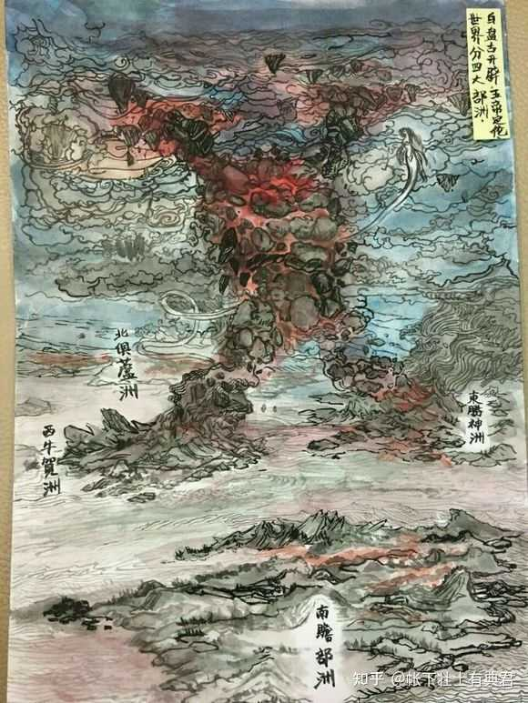

西游记的世界观起源引用了邵康节的《皇极经世》中元会运世的概念，而在其之上又增加了盘古开辟的传说，盘古破鸿蒙，自此有了清浊之分，清为天，浊为地，无论天地人都是自然形成的，没有所谓开天辟地之人，有了清浊之分之后开始元会运世。
所以关于盘古的描述，作者只写感盘古开辟，而没有加上开天辟地，天开地辟等描述，因为盘古破开了鸿蒙，让世间有了清浊之分，后才自然形成了最初的天地，天开于子，地辟于丑，并没有什么开天辟地之人，西游记所有描写开天辟地，天开地辟的地方基本是在说某个人物和物体在开天辟地时期就已经存在或者有历劫的能力。

这都没太上老君什么事，猴子说的所谓开天辟地之祖那是猴子拿来嘲讽南山大王有多大年纪敢妄称南山，顺便介绍一下三教祖师，提倡一下本书主旨三教合一的思想，开天辟地之祖就是道祖的意思，道教认为道生万物，老君发现道，是道祖就叫开天辟地之祖，顺便形容老君年龄大，开天辟地时期就有了，人参果树 还是【天开地辟】之灵根呢猴子是听完银角的话才知道老君的事的
看一下有多像

>【那观里出一般异宝,乃是【混沌初分 】,【鸿蒙始判,天地未开之际】,产成这颗灵根。】
>【我这葫芦是【混沌初分】，【天开地辟】，有一位太上老祖】

开天辟地之祖是【混沌初分，天开地辟，有一位太上老祖】，形容老君岁数大，辈分高，在天开地辟时期就存在的一位老祖还是道祖而已，而且这又没什么，玉兔在开天辟地之前的混沌就已经存在了【仙根是段羊脂玉，磨琢成形不计年。混沌开时吾已得】。

而且这有什么稀奇的如来狮驼国那里旁白也说开天辟地，猴子也有劈开数劫的赞词，玉帝经历1750劫

>玉帝：【他自幼修持，苦历过一千七百五十劫。每劫该【十二万九千六百年。】你算，他该多少年数，方能享受此无极大道？】
>孙悟空：【本性圆明道自通，翻身跳出网罗中。修成变化非容易，炼就长生岂俗同？
>清浊几番随运转，辟开【数劫】任西东。逍遥万亿年无计，一点神光永注空。
>此诗暗合孙大圣的道妙。】
>如来：【满天缥缈瑞云分，我佛慈悲降法门。明示开天生物理，细言辟地化身文。】

其中孙悟空和如来还都是旁白

什么老君开天，创世神，造物主是叶知秋网文瞎传的东西，断章取义截两段来误导没看过原著的和吴闲云一个尿性，第一回就说了天地人的生成是一个自然演变的过程，就算引用传说典故也是拿盘古开辟的传说。

***

### 化胡为佛

这又是一个叶知秋先生搞出来的神论，叶知秋先生在他的网文里写的化胡为佛是太上老君是佛教创始人的师父【叶知秋想说的是燃灯】，然后他的这论调传着传着还分裂出新版本，太上老君是如来佛祖的师父，理由就是原著里太上老君说过自己化胡为佛，并且历史有化胡为佛的说法，并且有相关典籍化胡经 ，但可惜叶知秋先生很明显自我脑补过度，没时间去了解这些化胡的典籍，历史上化胡为佛的说法版本很多，但都和太上老君是佛教创始人的师父以及太上老君是如来佛祖的师父相差很远。

首先老君化胡的意思是老君出函谷关，变成佛教化胡人，化胡说最传统的版本化胡经就是说老君变成释迦牟尼教化胡人，后来有其他版本只说了老君变成佛教化难教化的胡人，或者老君出函谷为浮屠【和尚】，比如后汉书就写过【或言老子入夷狄为浮屠】，或者直接写老子教化某个胡王成佛，基本是没老君是如来老师的版本【如果有，麻烦发一下】

曾经有人喜欢拿魏略的一段记载说事，但很明显是断章取义

>临兒国，《浮屠经》云其国王生浮屠。浮屠，太子也。父曰屑头邪，母云莫邪。浮屠身服色黄，发青如青丝，乳青毛，蛉赤如铜。始莫邪梦白象而孕，及生，从母左胁出，生而有结，堕地能行七步。此国在天竺城中。天竺又有神人，名沙律。昔汉哀帝元寿元年，博士弟子景卢受大月氏王使伊存口受《浮屠经》曰复立者其人也。《浮屠》所载临蒲塞、桑门、伯闻、疏问、白疏间、比丘、晨门，皆弟子号也。《浮屠》所载与中国《老子经》相出入，盖以为老子西出关，过西域之天竺、教胡。浮屠属弟子别号，合有二十九，不能详载，故略之如此。——《魏略》

这一段的意思是:《浮屠经》对佛陀的记载是正儿八经的临儿国王子，和中国流传的《化胡经》不一样【这里所说的化胡经是比王浮写的更早的古本化胡经】也就说任何一个版本的化胡中，都没有所谓“佛陀是老君弟子“的说法，“化胡为佛”的意思老子点化释迦摩尼创办佛教应该是网友望文生义出来的，我能找到的早期来源是佛本是道 这本小说

>【正是如此，李老君 乃是人教圣人，掌管人道，因为人间界业力深重，难成仙道，民不修身，是以于封神后，逗留人间，点化世人，那多宝道人自然随在其后，后来李老君于春秋之时，将多宝道人带出函谷关，化胡为佛，多宝道人化为释迦牟尼佛降生中央娑婆世界，便是人间界】

而且老子化胡说，道教这里更喜欢称之为化胡成佛【于阗西五百里有比摩寺，云是老子化胡成佛之所。】，而化胡为佛这个词出现频率要低很多，基本都是和尚反驳道士化胡说说出来的，比如甄正论 【反驳化胡说，表示不是老君化为如来，是老君拜如来为师】，集古今佛道论衡

查化胡为佛的资料，多搜出来的是佛道之间的辩论，可以从中参考一二

>【老子化胡成佛图。素曰：承闻老子化胡，胡人不受，老子变身为佛，胡人方受，是则佛能化胡，道不能化，何言老子化胡乎？老子安用【化胡为佛】？何不化胡为道？道流不能对。】

但无论化胡成佛，还是和尚喜欢说的化胡为佛，其实意思都一样，为了教化胡人而变成佛来教化胡人

西游记中的化胡为佛显然不可能采用化胡经化身释迦牟尼创建佛教的版本【同时也不可能是因为望文生义出来老君点化如来】

西游记原文采用的是如来雪山顶山成佛的典故

>【孔雀出世之时最恶，能吃人，四十五里路把人一口吸之。我在雪山顶上，修成丈六金身，早被他也把我吸下肚去。我欲从他便门而出，恐污真身，是我剖开他脊背，跨上灵山。欲伤他命，当被诸佛劝解，伤孔雀如伤我母，故此留他在灵山会上，封他做佛母孔雀大明王菩萨。】

时间位于不知道地第几元会天地交合时期，时间也对不上

如来雪山顶上修行典故参考

>【何似当时释迦老子。弃万乘尊荣。直入雪山。劳形忍饿。至六载。果满功圆。】
>【　悉达就彼二仙五年修学。知非究竟。即诣雪山。六年苦行。成等正觉。】

而化胡经在吴承恩的时代是一本伪经，历史上三次关于化胡的佛道辩论，次次都是道教被打爆脸，第三次也就是元代那一次，道士输的一塌葫芦，参加辩论的道士当场被剃度出家，化胡经被烧毁，打成伪经，道士自己也不认，所以不可能是化胡经的版本

西游记里安天大会有三清拜献如来的情节，如来明确和老君并非一个角色

>玉帝传旨，即着云部众神，分头请三清、四御、五老、六司、七元、八极、九曜、十都、千真万圣，来此赴会，同谢佛恩。又命四大天师、九天仙女，大开玉京金阙、太玄宝宫、洞阳玉馆，请如来高坐七宝灵台。调设各班座位，安排龙肝凤髓，玉液蟠桃。　　不一时，那玉清元始天尊、上清灵宝天尊、太清道德天尊、五气真君、五斗星君、三官四圣、九曜真君、左辅、右弼、天王、哪吒、元虚一应灵通，对对旌旗，双双幡盖，都摔着明珠异宝，寿果奇花，向佛前拜献曰：“感如来无量法力，收伏妖猴。蒙大天尊 设宴，呼唤我等皆来陈谢。请如来将此会立一名，如何？

之后还提到过如来【乾坤大地皆称祖】

以及书里提过如来经书是三教源流

>【此经功德，不可称量，虽为我门之龟鉴，实乃三教之源流。若到你那南赡部洲，示与一切众生，不可轻慢】

如果是化胡经的说法，这么写就会很奇怪

西游记的化胡为佛只是一个表达三教合一以及附会典故，很有可能参考的是因为胡人难以教化，老君变为佛用佛法教化胡人的说法【西游记三教你中有我，我中有你，如来讲道经，燃灯和老君一起讲课】，这种说法老君并不是释迦，不是创建佛教的人，在他之前就有佛的存在。

***

### 地煞七十二变和天罡三十六变

相信肯定有人被一段详解天罡地煞变化内容的百度百科资料骗过，事实上那里所列举的天罡三十六强于地煞七十二出自明朝冯梦龙增补的《三遂平妖传》【罗贯中的原版并没有，冯梦龙后来增补在创作的同名书的才有】
《三遂平妖传》（冯梦龙版）提到的天罡三十六变化与地煞七十二变化与《西游记》的完全不同。“西游记”中的是天罡数三十六变和地煞数七十二变【祖师说：“也罢，你要学那一般？有一般天罡【数】，该三十六般变化；有一般地煞【数】，该七十二般变化。”】天罡地煞只代表数字而西游记的地煞变化是至高无上的变化法，躲避三灾之用。而“三遂平妖传”中的地煞变化是72种法术，其中虽然也包括变化术，但是更多的还是豆人纸马、鬼刀神剑种种害人之术，其中还有最恶的乌龙斩将法。
“三遂平妖传”的地煞法首先修炼条件就与“西游记”的不一样，需要选择一个僻静之地修炼，需要用许多的金银财宝帮助修炼，需要请来天上的六丁六甲等众神帮助自己修炼，还需要两三个人同心协力修炼，缺一不可。这种修炼条件一看就与“西游记”的不一样。
另外，“三遂平妖传”的地煞法只是与呼风唤雨，役鬼驱神之类的法术等级差不多，半斤八两。
“三遂平妖传”的地煞法又叫金刚禅邪法，而天罡法又叫五雷天心正法，专破金刚禅邪法。一听名字是不是很熟悉？没错，五雷天心正法就是五雷法，也就是“西游记”中车迟国的虎鹿羊所修炼的法术，“水浒传”的罗真人，公孙胜也精通此法。这也难怪地煞法如此垃圾了，远远比不上五雷法啊，更是和菩提老祖传授的躲三灾的七十二变不是一个档次。五雷法都被孙悟空完虐，更何况乎档次低下的金刚禅邪法呢！
毕竟学了金刚禅邪法，被天庭照妖镜秒败，这种实力真是一言难尽

而具体内容则是出自清朝的二流小说《历代神仙演义》而且里面说的是天罡三十六法和地煞七十二术，两本书年代均晚于《西游记》，而西游记里是天罡【数】三十六般变化，地煞【数】七十二般变化，天罡地煞就是代表个数目，和那里面的天罡三十六法地煞七十二术相差甚远。

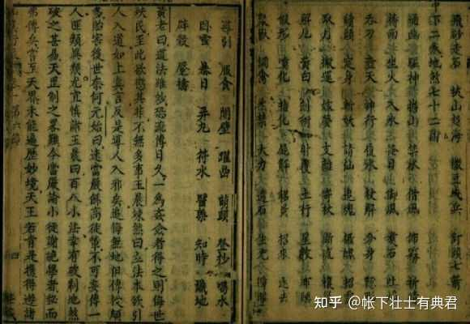

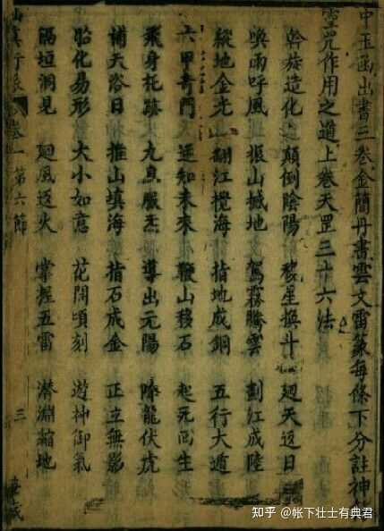

并且搞笑的是历代神仙演义里这所谓的天罡三十六法的内容，在西游记中，孙悟空反而会好几个，例如移星换斗，孙悟空得拿手绝活，在原著四十六，六十七，八十七回，都能找到相关描述，还有呼风唤雨，我记得曾在网上看过一种言论，孙悟空不会呼风唤雨，理由是车迟国斗法孙悟空靠作弊，这很明显没有看完西游记全书，且不说孙悟空经常说自己呼风唤雨是是小意思，在朱紫国一节里，孙悟空就施展过一招撒酒成雨，熄灭了赛太岁先锋放的妖火，并且孙悟空与虎力大仙这种传统的做法走程序上表天庭，请司掌风雨雷电的神仙来下雨的不同，孙悟空是原著里少数除了雨部神仙外可以通过自己能力下私雨的角色，至于呼风，孙悟空的风在原著中表现仅次于黄风怪的三昧神风，并且施法效果和黄风怪的三昧神风很类似，第三回去傲来国偷兵器就施展过，一阵风让傲来国皇都闭门闭户，在被唐僧赶回花果山，看见猴子猴孙被猎人欺负后，也是用这一招起到飞沙走石的效果从而团灭了千余猎人，在观音院和尚们放火准备烧死唐僧盗取袈裟的片段里，孙悟空在保障了唐僧的安全后，一口风直接吹的和尚们放的凡火赛过老祖开炉，蔓延整个寺庙，比起历代神仙演义里从水浒传摘抄来的回风返火，我看这个表现力丝毫不逊色

再有像推山填海潜渊缩地翻江搅海这类的技能，孙悟空也能在书中找到类似描述，例如他分别在在红孩儿一节里施展过移山缩地的法术，在五庄观一节里用推山移岭的神力撸翻百丈高的人参果树，在鹰愁涧一节里使用翻江搅海的神通搅浑了千丈深的鹰愁涧，再来什么振山撼地，不说孙悟空与妖王的战斗经常被描写各种撼山摇岭，惊天动地，原著十四回就有一个直接的表现，孙悟空出五行山的时候，在唐僧揭下了六字真言的帖子后，孙悟空瞬间崩碎了金木水火土五座联山，顺带产生了地裂山崩这种类似地震的效果，大小如意这点孙悟空更是时常展现，大可瞬间千丈，小则能如芥菜子儿，孙悟空还能算到一些唐僧的劫数，例如九十九回孙悟空能精准预测到唐僧还有一难未完，因此故意不使用法术，不知道能不能算得上预知未来，九十七回中，孙悟空还有一个起死回生之圣的描述，此外孙悟空的身外化身能战败十万天兵天将，我怎么看都比撒豆成兵要强上许多，还有诸如游神御气，降龙伏虎，腾云驾雾这种基础技能我都不用解释，书里一大堆的描写。

而猪八戒？恕我直言，除了【驾雾腾云】【飞沙走石】这种大部分仙妖都掌握的基础神通外，或许就这个【导出元阳】如果从字面意义来看，可能相对契合八戒最引以为傲的鏖战之法？还有掌握五雷指石成金，精通此二技却无一不被孙悟空吊打的狮俐怪，虎力大仙等表示有一句mmp必须要讲。

有人问，那原著里七十二变和三十六变哪个强？

原文说话

>【我老猪本来有三十六般变化，若说变轻巧华丽飞腾之物，委实不能；若说变山，变树，变石块，变土墩，变赖象、科猪、水牛、骆驼，真个全会。】

三十六变变不了轻巧飞腾之物

通天河一节

>【八戒道：“你看师父说的话！我只会变山变树，变石头变癞象，变水牛变大胖汉还可，若变小女儿，有几分难哩。】
>【八戒道：“哥呀，似这般小巧俊秀，怎变？”行者叫：“快些！莫讨打！”八戒谎了道：“哥哥不要打，等我变了看。”这呆子念动咒语，把头摇了几摇，叫：“变！”真个变过头来，就也象女孩儿面目，只是肚子胖大，郎伉不象。行者笑道：“再变变！”八戒道：“凭你打了罢！变不过来，奈何？”行者道：“莫成是丫头的头，和尚的身子？弄的这等不男不女，却怎生是好？你可布起罡来。”他就吹他一口仙气，果然即时把身子变过，与那孩儿一般。】

连小女孩都变不了还得孙悟空给他变化

后面玉华州一节，变古怪刁钻也要孙悟空教他，吹一口仙气才变得【一般无二】

狮驼岭一节

>【好大圣，捻着诀，摇身一变，变做个干干净净的小和尚几，真个是目秀眉清，头圆脸正，行动有斯文之气象，开口无俗类之言辞，抖一抖锦衣直裰，拽步上前，向唐僧道：“师父，我可变得好么？”三藏见了大喜道：“变得好！”八戒道：“怎么不好！只是把我们都比下去了。【老猪就滚上二三年，也变不得这等俊俏！】”】

猪八戒自认论变化，三五个也赶不上猴子

>八戒道：“师父，莫怪我说。若【论赌变化】，使促掐，捉弄人，【我们三五个也不如师兄】；若论老实，象师兄就摆一队伍，也不如我。”

猪八戒有次变和尚摇了七八摇才变化成功：

>好呆子，捻着诀，念个咒，【把身摇了七八摇】，变作一个食痨病黄胖和尚，口里哼哼喷喷的，挨近门前，叫道：“施主，厨中有剩饭，路上有饥人。贫僧是东土来往西天取经的，我师父在路饥渴了，家中有锅巴冷饭，千万化些儿救口。”

我们在看看西游证道本对于七十二变和三十六变的解释

>【祖师道：“有一般天罡数，该三十六般变化；有一般地煞数，该七十二般变化，你学那一般？”悟空道：“愿多里捞摸，学一个地煞变化罢。”
>噫！道成之后，千变万化，又何限乎三十六变、七十二变哉？盖金丹之道，有有为无为二法，一般天罡数变化者，上德者无为之事；一般地煞数变化者，下德者有为之事。盖上德者，先天未伤，后天未发，行无为之道，温养先天，运内炉天然真火，剥尽一身后天阴质，阴尽阳纯，永久不坏。此抱一守中，虚无中自然变化，故有天罡数变化，变化者少。其曰该三十六般变化者，《坤》阴六六之数，仅变化其阴也。【下德者，先天已伤，后天已发，必须行有为之功，窃阴阳，夺造化，进阳火，运阴符，后天中返先天，先天中化后天，增之损之，自有为而入无为。此脚踏实地，其用不休之变化，故有地煞数变化，变化者多。其曰该七十二变化者，按七十二候，阴阳进退之节，阴阳俱变化也。】【【【地煞变化，乃金丹全始全终之事，既统天罡变化】】】；【天罡变化，惟上德者能之，其次中下之人难行，非金丹之全功，故祖师不传天罡变化，而传地煞变化也。既知变化，循序而进，即可到功果完满，霞举飞升之地，更何有三灾乎？】
>沙僧不变，八戒三十六变，行者七十二变。虽说七十二变，其实千变万化，不可以数计，何则？行者为水中金，乃他家之真阳，属命，主刚主动，为生物之祖气，统七十二候之要津，无物不包，无物不成，全体大用，一以贯之，所以变化万有，神妙不测。【八戒为火中木，乃我家之真阴，属性，主柔主静，为幻身之把柄，只能变化后天气质，不能变化先天真宝，变化不全，所以七十二变之中，仅得三十六变也】。至于沙僧者，为真土，镇位中宫，调和阴阳，所以不变。知此者，方可读《西游》。】

七十二变包含三十六变，相当增强版的三十六变，三十六变达不到金丹之全功，变化不全，七十二变方能达到，千变万化。

最后，只要脑子正常，都看得出来，会七十二变的四个，孙悟空，六耳，二郎神，牛魔王都是同档次，一等一的高手，而会三十六变的猪八戒，除非觉得二郎神牛魔王也脑子不正常挑垃圾的学。

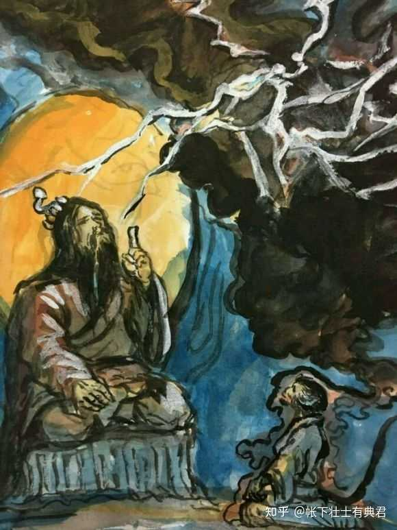

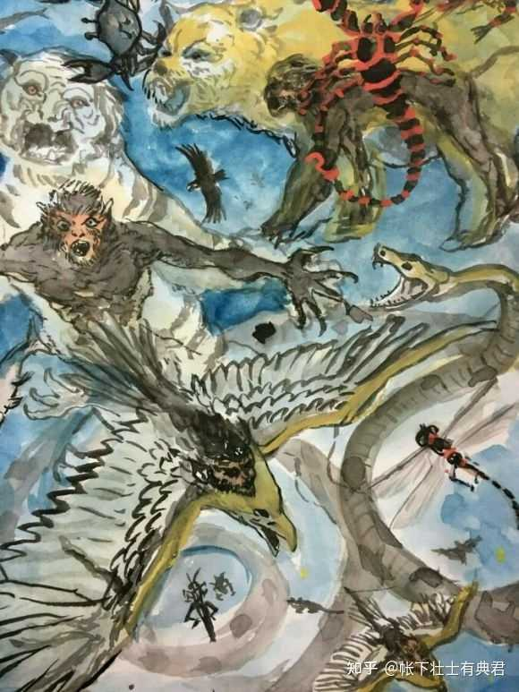

图片来自西游记吧吧友刀在手跟我走所绘插图

***

### 前面说到七十二变，那么就要牵扯到一个经典谣言了，二郎神七十三变

二郎神七十三变其实是清代后的民间说法，和西游记原著无关。

原著明确表明二郎神也是七十二变【威逼玉帝传旨意，灌江小圣把兵扬。相持七十单二变，各弄精神个个强。】原著七十二三十六对应天罡地煞的数字，七十三变属于不伦不类，并且二郎神也没有所谓的天眼。

原著通篇找不到二郎神有三只眼的描述，大家看电视剧应该记得一个经典情节二郎神睁开第三只眼看到孙悟空变成麻雀站在树上，其实原著没有提到第三只眼，是二郎神睁大了眼睛仔细看，看见的，原著写到是【圆睁凤目】凤目就是描写二郎神的眼睛形态，和孙悟空火眼金睛一样【火眼金睛的问题我们后面在写】。

>二郎圆睁凤目观看，见大圣变了麻雀儿，钉在树上

原著二郎神和孙悟空是互相看破对方变化，他们靠的是生物知识，而不是什么天眼balabala

>二郎看见道：“打花的鱼儿，似鲤鱼，尾巴不红；似鳜鱼，花鳞不见；似黑鱼，头上无星；似鲂鱼，鳃上无针。他怎么见了我就回去了，必然是那猴变的。”
>等待片时，那大圣变鱼儿，顺水正游，忽见一只飞禽，似青鹞，\*\*不青；似鹭鸶，顶上无缨；似老鹳，腿又不红：“想是二郎变化了等我哩！”

吴承恩题的二郎神搜山图里二郎神也是两只眼

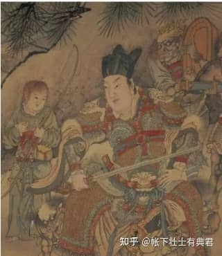

明代版本的封神演义里的杨戬也没第三只眼

哦，对了，杨二郎也不是杨戬，杨戬是封神演义里按照杨二郎为原型创作的一个人物，名字来源应该可能来源于北宋太监杨戬。

此外还有人扯什么二郎神肉身成圣不死不灭啥的，我也是佛了，肉身成圣这个词是出自封神演义，并且只是指在大战中没死的人肉身飞升成仙，李靖、金咤、木咤、哪咤、杨戬、韦护、雷震子，这七个都是肉身成圣

>【子牙不忍分离，又送了一程，各洒泪而别。──后来李靖、金咤、木咤、哪咤、杨戬、韦护、雷震子，此七人俱是肉身成圣。】——封神演义第一百回

***

### 神仙增加寿命的方式很少，主要靠蟠桃来增加寿命

这又是一个吴闲云扯出来的经典神论，还把什么蟠桃搞成神仙勾心斗角争夺的资源，还来个灵山恰金蝉子的扯淡言论

首先，原著靠修行修为到极致是可以达到真正的万劫长生不老的，不过这比较少，这些人是不需要靠什么狗屁蟠桃来增加寿命的，他们是真正意义上的永生。

原著明确提过的有以下这么几位1.孙悟空2.玉帝3.如来4.菩提祖师

举例：

>孙悟空：【我有七十二般变化，万劫不老长生。会驾筋斗云，一纵十万八千里。】
>【好猴精，有诗为证。诗曰：混元体正合先天，【万劫千番只自然】。渺渺无为浑太乙，如如不动号初玄。】
>清浊几番随运转，辟开数劫任西东。【逍遥万亿年无计】，一点神光永注空。

而神仙们，延长自己寿命的方式主要是修炼，这一点三星提过

>【你这猴子，不知好歹。那果子闻一闻，活三百六十岁；吃一个，活四万七千年，叫做万寿草还丹。我们的道，不及他多矣！他得之甚易，就可与天齐寿。我们还要养。精、炼气、存神，调和龙虎，捉。坎。填。离，不知费多少工夫。】

而且神仙们增加寿命的玩意也很多啊，人参果就不提了

寿星赤脚大仙的火枣火梨，还有紫芝瑶草，碧藕，黍米之丹这些玩意都能复活的东西

>病延年之法。寿星笑道：“我因寻鹿，未带丹药。欲传你修养之方，你又筋衰神败，不能还丹。我这衣袖中，只有三个枣儿，是与东华帝君献茶的，我未曾吃，今送你罢。”【寿星还有其他延寿的丹药】

灵山更是土豪，灵山的斋饭吃了就能长生

>【二尊者即奉佛旨，将他四众领至楼下，看不尽那奇珍异宝，摆列无穷。只见那设供的诸神，铺排斋宴，并皆是仙品、仙肴、仙茶、仙果，珍馐百味，与凡世不同。师徒们顶礼了佛恩，随心享用，其实是：宝焰金光映目明，异香奇品更微精。千层金阁无穷丽，一派仙音入耳清。素味仙花人罕见，【香茶异食得长生】。向来受尽千般苦，今日荣华喜道成。【这番造化了八戒，便宜了沙僧，佛祖处正寿长生，脱胎换骨之馔，尽着他受用。】】

灵山啥必要去吃金蝉子，吴闲云这神论我也是罪了

***

### 原著三清地位在玉帝之上，玉帝只是傀儡云云

原著玉帝的地位是最高的，大天尊，三界之主，权力最高，代表皇权，也是上天【参考凤仙郡一节】有昊天上帝融合的因素【原著玉帝和四御也没任何关系】
原著的主旨就是三教合一，所以不存在什么三清在玉帝之上

原著明确表明，三清只是玉帝的臣子

>老君【朝礼毕】，道："老道宫中，炼了些'九转金丹'，【伺候陛下】做'丹元大会'，不期被贼偷去，特启陛下知之。"
>玉帝闻言，即教六丁、六甲，将他解下，付与老君。老君【领旨】去讫。
>【玉帝传旨，即着雷部众神，分头请三清、四御、五老、六司、七元、八极、九曜、十都，千真万圣，来此赴会，同谢佛恩。又命四大天师、九天仙女，大开玉京金阙、太玄宝宫、洞阳玉馆，请如来高座七宝灵台，调设各班坐位，安排龙肝凤髓，玉液蟠桃。
>不一时，那玉清元始天尊、上清灵宝天尊、太清道德天尊、五气真君、五斗星君、三官四圣、九曜真君、左辅、右弼、天王、哪吒、元虚一应灵通，对对旌旗，双双幡盖，都摔着明珠异宝，寿果奇花，向佛前拜献】

太上老君要对玉帝进行朝礼，要伺候玉帝做丹元大会，要领玉帝的旨意，三清被玉帝设宴呼唤就得乖乖的过来和玉帝同谢佛恩，拜谢如来。

至于有人说太上老君来了玉帝出迎说明太上老君＞玉帝，不好意思，观音来了玉帝也出迎

>【观音闻言，即与木叉撞上南天门里，早有邱、张二天师接着，问道：“何往？”菩萨道：“贫僧要见玉帝一面。”二天师即忙上奏，玉帝遂下殿迎接。】

科普：玉帝修持了1750劫，方享此无极大道，原著张老板其实是个很可爱的角色【猴子虐我千百遍，我待猴子如初恋】

不要被什么网文的三清四御实力划分洗脑了，这和实力排名没什么关系，地位也≠实力，原著倒是有文官和武官的区分【文选武选仙卿】

***

### 如来是五老

如来不是五老
原著有两个五老，一个蟠桃会请客名单的五老

>【上会自有旧规，请的是西天佛老、菩萨、圣僧、罗汉，南方南极观音，东方崇恩圣帝、十洲三岛仙翁，北方北极玄灵，中央黄极黄角大仙，这个是五方五老。还有五斗星君，上八洞三清、四帝，太乙天仙等众，中八洞玉皇、九垒，海岳神仙；下八洞幽冥教主、注世地仙。各宫各殿大小尊神】

一个道教的五老

>【玉帝传旨，即着雷部众神，分头请三清、四御、五老、六司、七元、八极、九曜、十都，千真万圣，来此赴会，同谢佛恩。】

如来两个都不是

1.孙悟空和五方五老称兄道弟

>【见三清称个“老”字，逢四帝道个“陛下”。与那九曜星、五方将、二十八宿、四大天王、十二元辰、五方五老、普天星相、河汉群神，俱只以弟兄相待，彼此称呼。今日东游，明日西荡，云去云来，行踪不定。】

然而孙悟空和如来互相不认识

>【大圣也收了法象，现出原身近前，怒气昂昂，厉声高叫道：“你是那方善士，敢来止住刀兵问我？”如来笑道：“我是西方极乐世界释迦牟尼尊者，南无阿弥陀佛。今闻你猖狂村野，屡反天宫，不知是何方生长，何年得道，为何这等暴横？”】

如来降服孙悟空后，玉帝喊来三清四御五老等等等同谢佛恩，如来自己拜自己？

>【玉帝传旨，即着雷部众神，分头请三清、四御、五老、六司、七元、八极、九曜、十都，千真万圣，来此赴会，同谢佛恩。又命四大天师、九天仙女，大开玉京金阙、太玄宝宫、洞阳玉馆，请如来高座七宝灵台，调设各班坐位，安排龙肝凤髓，玉液蟠桃。
>不一时，那玉清元始天尊、上清灵宝天尊、太清道德天尊、五跂真君、五斗星君、三官四圣、九曜真君、左辅、右弼、天王、哪吒，玄虚一应灵通，对对旌旗，双双幡盖，都捧着明珠异宝，寿果奇花，向佛前拜献】

这里的五老就很明显是道教五老，而不是蟠桃会请客名单的五老了

蟠桃会请客名单的五老是六个方位一大群神仙，西天罗汉菩萨都是这个请客名单的五老，而此时他们都在雷音寺等如来回去

>【话表我佛如来，辞别了玉帝，回至雷音宝刹，但见那三千诸佛、五百阿罗、八大金刚、无边菩萨，一个个都执着幢幡宝盖，异宝仙花，摆列在灵山仙境】

如来也不是蟠桃会请客名单的五老

>【如来问：“玉帝何事烦二圣下临？”二圣即启道：“向时花果山产一猴，在那里弄神通，聚众猴搅乱世界。玉帝降招安旨，封为弼马温，他嫌官小反去。当遣李天王、哪吒太子擒拿未获，复招安他，封做齐天大圣，先有官无禄。着他代管蟠桃园，他即偷桃；又走至瑶池，偷肴、偷酒，搅乱大会】

如来去都没去蟠桃会，更不知道发生了什么请况【从孙悟空搅乱蟠桃会到请如来救驾时间过了天上的四十九天，如来都不知道发生了什么，一直在灵山讲经】

>【话表南海普陀落伽山大慈大悲救苦救难灵感观世音菩萨，自王母娘娘请赴蟠桃大会，与大徒弟惠岸行者，同登宝阁瑶池，见那里荒荒凉凉，席面残乱；虽有几位天仙，俱不就座，都在那里乱纷纷讲论。菩萨与众仙相见毕，众仙备言前事。】

在这个请客名单里的观音就去了蟠桃会，并且都知道发生什么事。

***

### 原著孙悟空被王灵官一个小保安拦下来了

首先，王灵官不是什么小保安，原著写过他全称【太乙雷声应化天尊】

>【豪杰英雄同赌赛。铁棒凶，金鞭快，正直无私怎忍耐？这个是太乙雷声应化尊，那个是齐天大圣猿猴怪】

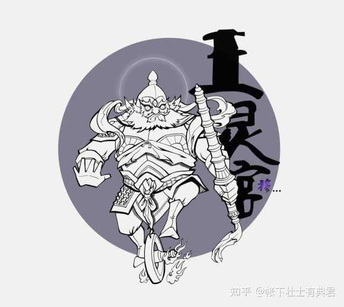

其次，原著王灵官就挡了一会儿，真武就调来了雷部三十六正神，随后被孙悟空一个三头六臂打得莫能相近，天庭只好事在紧急，特请如来救驾

>【他两个斗在一处，胜败未分，早有佑圣真君，又差将佐发文到雷府，调三十六员雷将齐来，把大圣围在垓心，各骋凶恶鏖战。那大圣全无一毫惧色，使一条如意棒，左遮右挡，后架前迎。一时，见那众雷将的刀枪剑戟、鞭简挝锤、钺斧金瓜、旄镰月铲，来的甚紧。他即摇身一变，变做三头六臂；把如意棒幌一幌，变作三条；六只手使开三条棒，好便似纺车儿一般，滴流流，在那垓心里飞舞，众雷神【莫能相近。】真个是
>圆陀陀，光灼灼，亘古常存人怎学？入火不能焚，入水何曾溺？光明一颗摩尼珠，剑戟刀枪伤不着。也能善，也能恶，眼前善恶凭他作。善时成佛与成仙，恶处披毛并带角。无穷变化闹天宫，雷将神兵不可捉。】
>
>【佑圣真君的佐使王灵官挡住苦战，又调三十六员雷将，把他困在垓心，终不能相近。事在紧急，因此玉帝特请如来救驾。】
>【我去时，正在雷将中间，扬威耀武，卖弄精神】

原著里孙悟空一个三头六臂就打得王灵官+雷部三十六将莫能相近，导致天庭只能事在紧急特请如来救驾，如来来了的时候，孙悟空还在耀武扬威，很明显猴子占据绝对上风，如来不来，猴子打进去也就是迟早的事，而雷将们有好几位都被孙悟空打出了心理阴影

【又查了雷霆官将陶张辛邓，苟毕庞刘】原著明确表示陶张辛邓，苟毕庞刘是三十六雷将里的

>【好行者，一筋斗跳上南天门里，唬得个庞刘苟毕躬身，马赵温关控背，俱道：“不好了！不好了！那闹天宫的主子又来了！”】
>【那大圣一时忍不住怒发，攥着铁棒，打个筋斗，只跳到南天门上。慌得那庞刘苟毕、张陶邓辛等众，两边躬身控背，不敢拦阻，让他打入天门】
>【邓天君道：“大圣吩咐，谁敢不从！但只是得一个号令，方敢依令而行；不然，雷雨乱了，显得大圣无款也。”行者道：“我将棍子为号罢。”那雷公大惊道：“爷爷呀！我们怎吃得这棍子？”】

可以说，他们在用生命拼死抵抗孙悟空，为天庭争取去请如来的时间

用这个来黑孙悟空大闹天宫的我简直是醉了

合着到成了某些人嘴里吹天庭的证据了，合着就只剩一座凌霄殿没被猴子打进去，天庭特别光荣，看猴子凌霄殿都没打进去，天庭真厉害，王灵官+雷部拼死拖延住猴子=猴子被一个小保安轻松拦下来，是没看过原著只看过地摊网文还是睁眼瞎？

猴子打王灵官和三十六雷将也就是没想到如来会来，用了个三头六臂耀武扬威

我们看一个战例

>【【说不了，沙僧、行者也都战败。】众妖精一齐赶来，被行者拔一把毫毛，嚼碎喷将去，叫声：“变！”即变做百十个小行者，围围绕绕，将那白泽、狻猊、抟象、伏狸并金毛狮怪围裹在中。沙僧行者却又上前攒打。到晚，拿住狻猊、白泽，走了伏狸、抟象。】
>【行者闻得城上人喊嚷，情知中了他计，急唤沙僧仔细；他却把臂膊上毫毛，尽皆拔下，入口嚼烂喷出，变作千百个小行者，一拥攻上，当时拖倒猱狮，活捉了雪狮，拿住了抟象狮，扛翻了伏狸狮，将黄狮打死】

七狮是西游记纯武力巅峰，实打实打得孙悟空败阵，这种表现，王灵官和三十六雷将这种平A孙悟空都只能持平的恐怕是比不上七狮，然后因为七狮打败阵了孙悟空+惹怒了他被孙悟空一个身外身秒杀。。。导致没人吹。

***

### 孙悟空没打过十万天兵，只是靠筋斗云逃跑

说这话的大概就是拿原著七十七回一句话断章取义【当时如行者闹天宫，十万天兵也拿他不住者，以他会驾筋斗云，一去有十万八千里路，所以诸神不能赶上。】，这里只是说孙悟空筋斗云都没有神仙能追上，居然被解读成当年猴子只靠筋斗云逃跑，明显忽悠没看过原著的人。

原著孙悟空反天为5-7回，其中只有第六回和二郎神赌斗变化的时候跑去灌江口偷家用过一次筋斗云，其他地方都在正面硬刚，原著孙悟空与十万天兵的交锋有两次。

我们先来看看十万天兵是什么阵容

>【四大天王，协同李天王并哪吒太子，点二十八宿、九曜星官、十二元辰、五方揭谛、四值功曹、东西星斗、南北二神、五岳四渎、普天星相，共十万天兵，布一十八架天罗地网，下界去花果山围困，定捉获那厮处治。众神即时兴师，离了天宫。这一去，但见那：
>黄风滚滚遮天暗，紫雾腾腾罩地昏。只为妖猴欺上帝，致令众圣降凡尘。四大天王，五方揭谛：四大天王权总制，五方揭谛调多兵。李托塔中军掌号，恶哪吒前部先锋。罗侯星为头检点，计都星随后峥嵘。太阴星精神抖擞，太阳星照耀分明。五行星偏能豪杰，九曜星最喜相争。元辰星子午卯酉，一个个都是大力天丁。五瘟五岳东西摆，六丁六甲左右行。四渎龙神分上下，二十八宿密层层。角亢氐房为总领，奎娄胃昴惯翻腾。斗牛女虚危室壁，心尾箕星个个能。井鬼柳星张翼轸，轮枪舞剑显威灵。停云降雾临凡世，花果山前紥下营。】

这是天庭最精锐的主力部队，全是精锐，没有杂鱼，最次的都是星象，就像海贼王顶上战争的十万海军精锐一样

第一次
第五回孙悟空头次VS十万天兵

战到天晚，猴子这里战局失利，孙悟空使出身外化身击败哪吒和五大天王，顺带打退十万天兵

>【大圣一条如意棒，翻来覆去战天神。杀得那空中无鸟过，山内虎狼奔。扬砂走石乾坤黑，播土飞尘宇宙昏。。。。。。。这大圣一条棒，抵住了四大天神与李托塔、哪吒太子，俱在半空中，杀彀多时。大圣见天色将晚，即拔毫毛一把，丢在口中，嚼碎了喷将出去，叫声：“变！”就变了千百个大圣，都使的是金箍棒，打退了哪吒太子，战败了五个天王。】
>【后我等亲自提兵，那厮也排开阵势。我等十万天兵，与他混战至晚，他使个分身法战退。】
>
>【当天倚力打天王，挡退十万八千将。】——旁白

---------------------
第二次第七回大闹天宫

十万天兵又被孙悟空鞭尸了一次

>十万军中无敌手，九重天上有威风。

大闹天宫孙悟空出八卦炉，放倒兜率宫所有丁甲，把太上老君摔个倒栽葱以后就出去大闹天宫了，原著明写了

>【即去耳中掣出如意棒，迎风幌一幌，碗来粗细，依然拿在手中，不分好歹，却又大乱天宫，打得那九曜星闭门闭户，四天王无影无形。好猴精！有诗为证。。。。这一番，那猴王不分上下，使铁棒东打西敌，更无一神可挡。】

一路从兜率宫打到灵霄殿前通明殿里，在哪用筋斗云逃跑过？猴子都是硬刚过去的

从后文我们可以得知，十万天兵里的奎木狼大闹天宫被猴子打怕

>“那二十七宿星员，领了旨意，出了天门，各念咒语，惊动奎星。你道他在那里躲避？他原来是孙大圣大闹天宫时打怕了的神将，闪在那山涧里潜灾，被水气隐住妖云，所以不曾看见他。他听得本部星员念咒，方敢出头，随众上界。”

孙悟空砸翻了北斗宫南极院斗牛宫

>【上方击坏斗牛宫，下方压损森罗殿。天将曾将九曜追，地府打伤催命判。】
>【只因大闹斗牛宫，天上诸神难取胜。】掌朝天使尽皆惊，护驾仙卿俱搅乱。【举棒掀翻北斗宫，回首振开南极院。】

事实上，原著里十万天兵从来都是孙悟空的陪衬，给孙悟空刷\*\*的，孙悟空面对十万天兵从来没逃过只有迎头痛击的，原著里是个人都知道当年猴子暴打十万天兵的事情，这都能拿来黑猴子，我也是佛了

>那猴子神通广大，变化多端。他曾大闹天宫，玉皇上帝差十万天兵，布下天罗地网，也不曾捉得他。
>棍打诸神没躲藏，天兵十万都逃窜。
>想我闹天宫时，玉帝遣十万天兵，布天罗地网，更不曾有一将敢与我比手。向后来，调了小圣二郎，方是我的对手。
>他曾大闹天宫，使一条金箍棒，十万天兵，无一个对手，只闹得太上老君害怕，玉皇大帝心惊。
>那孙行者神通广大，变化多端！他五百年前曾大闹天宫，上方二十八宿、九曜星官、十二元辰、五卿四相、东西星斗、南北二神、五岳四渎、普天神将，也不曾惹得他过
>这个人其实神通广大，五百年前曾大闹天宫，十万天兵也不曾拿得住。他专意寻人的，他便就是个搜山揭海、破洞攻城、闯祸的个都头

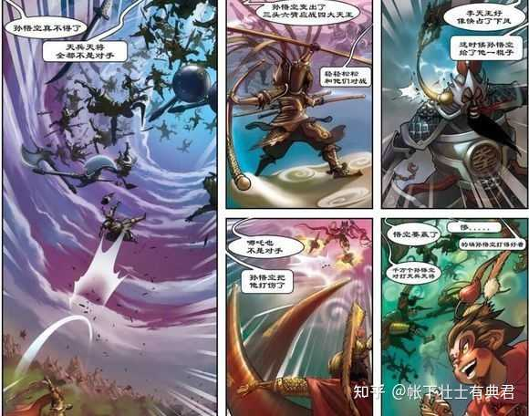

***

### 天庭没把大闹天宫当回事，只是小打小闹

我们看看原著天庭各位大佬的态度吧

>1.又见行者跟入，天王即又作怒。你道他作怒为何？当年行者大闹天宫时，玉帝曾封天王为降魔大元帅，封哪吒太子为三坛海会之神，帅领天兵，收降行者，屡战不能取胜。还是五百年前败阵的仇气，有些恼他，故此作怒。
>2.好行者，一筋斗跳上南天门里，唬得个庞刘苟毕躬身，马赵温关控背，俱道：“不好了！不好了！那闹天宫的主子又来了！”
>
>3.那大圣一时忍不住怒发，攥着铁棒，打个筋斗，只跳到南天门上。慌得那庞刘苟毕、张陶邓辛等众，两边躬身控背，不敢拦阻，让他打入天门
>4.
>好大圣，执着这牌位香炉，将身一纵，驾祥云直至南天门外。时有把天门的大力天王与护国天王见了行者，一个个都控背躬身，不敢拦阻，让他进去。
>5.那二十七宿星员，领了旨意，出了天门，各念咒语，惊动奎星。你道他在那里躲避？他原来是孙大圣大闹天宫时打怕了的神将，闪在那山涧里潜灾，被水气隐住妖云，所以不曾看见他。他听得本部星员念咒，方敢出头，随众上界。
>6.众神搪抵不住，放开天门，直至灵霄宝殿，马元帅同张葛许邱四天师奏道：“下界有一般两个孙悟空，打进天门，口称见王。”说不了，两个直嚷将进来，唬得那玉帝即降立宝殿。
>7.玉帝：“只得他无事，落得天上清平是幸。”
>8.他曾大闹天宫，使一条金箍棒，十万天兵，无一个对手，只闹得太上老君害怕，玉皇大帝心惊。
>9.弼马温果是神通广大！末将战他不过。
>10.
>父王，弼马温真个有本事！孩儿这般法力，也战他不过
>11.是有能有力的大齐天，无量无边的真本事！
>12.好大圣，好大圣！着实神通广大！孩儿战不过，又败阵而来也！

看来天庭是影视学校，演了五百年还在继续演，孙悟空威胁说要动起刀兵都还要敬业的继续演戏

>好大圣，低头捻诀，念个咒语，叫那日游神、夜游神、五方揭谛神：“即去与我奏上玉帝，说老孙皈依正果，保唐僧去西天取经，路阻高山，师逢苦厄。妖魔那宝，吾欲诱他换之，万千拜上，将天借与老孙装闭半个时辰，以助成功。若道半声不肯，即上灵霄殿，动起刀兵！”

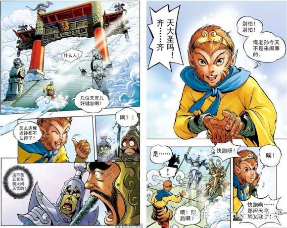

***

### 玉帝原著是传旨宣召如来，不是请

>原著第七回——
>当时众神把大圣攒在一处，却不能近身，乱嚷乱斗，早惊动玉帝。遂传旨着游奕灵官同翊圣真君上西方【请】佛老降伏。
>终不能相近。事在紧急，因此玉帝【特请】如来救驾。

传旨给的是游奕灵官不是如来，让他去请如来，天庭方对如来的态度一直都是请，游奕灵官和翊圣真君请如来甚至得礼佛三匝

>那二圣得了旨，径到灵山胜境，雷音宝刹之前，对四金刚、八菩萨礼毕，即烦转达。众神随至宝莲台下启知，如来召请。二圣礼佛三匝，侍立台下。如来问：“玉帝何事烦二圣下临？”

说宣如来的无非是用这句断章取义
【老僧承大天尊宣命来此，有何法力？】这是如来方面客气一下，并不矛盾

宝象国国王对猪八戒说宣，然后实际行动是请，这两个不矛盾

【国王道：“你既这等样说了一遍，寡人怕他怎的？宣进来。”随即着金牌至馆驿相请。那呆子听见来请】

***

### 孙悟空取经路上被妖怪吊打

网络上总是流传着孙悟空打不过妖怪都得请救兵的谣言，什么只有白骨精是自己打死的，有的连灵感大王这种被孙悟空几回合打爆的对手都能说成完虐了孙悟空，真的无力吐槽

不说这种跟风言论不知道从哪传出来的

首先，为了体现修行的苦难，百灵下界，取经路上的妖怪基本都是不正常的强妖，很多都有天上背景【正常的妖怪参考开局的巩州三怪，白骨精，猪八戒，沙僧，狐阿七大王等以及背景的那一群】，凶险异常，而孙悟空是钦定的保护唐僧最佳人选，综合实力强，容错率高。没有孙悟空的千变万化以及过硬实力，金刚之躯，几个法宝关卡就一波交代了，原著几番说明了取经全靠孙悟空。

>【正是那孙大圣护定唐三藏，取经僧全靠美猴王。】——西游记八十二回

取经路上，孙悟空一样是胜多负少，能让他吃瘪的就那几个，有的还是沾了孙悟空眼病的光，而且让猴子吃瘪，作者基本会给出客观的理由，也会在后面打补丁证明不是综合实力不如，而且孙悟空的任务是保护唐僧，首先得考虑唐僧的人生安全救他，要保护一个人的周全，在以他的性命安全为最先考虑的前提下降伏对手，和了无牵挂单纯的战胜难度不在一个等级，猴子取经要凸现修行的苦难，而且西游的一些故事都是有原型，每一章都有寓意和隐喻，一些地方的怪物本身故事来源原型就注定要有特定的神仙来收服，不能当单纯的打怪闯关小说看。

这里就不多说了
统计一下西游记所有关卡详情以及孙悟空（取经团）单独解决的妖怪和其他（这里的解决指打死降服击败降服后饶一条性命即将击杀降服之时有人出来救命，红孩儿这种因为猪八戒帮倒忙因此得救的就不算了，只算主人救命的，单纯打赢，对方逃跑而自己没能达成目的的也不算）

1蛇盘山鹰愁涧2观音禅院3黑风山4高老庄云栈洞5黄风岭6流沙河7四圣试禅心8五庄观9白虎岭10宝象国碗子山波月洞11平顶山莲花洞12乌鸡国13号山14黑水河15车迟国16通天河17金兜山18解阳山19女儿国20毒敌山21二心22火焰山23祭赛国碧波潭24荆棘岭25小西天26陀罗庄27七绝山28朱紫国29麒麟山30盘丝洞31黄花观32狮驼岭（包含狮驼国）33比丘国34清华洞35无底洞36灭法国37隐雾山38凤仙郡39豹头山虎口洞40竹节山九曲盘桓洞41青龙山42天竺国43铜台府（漏了一个陈家庄（救小儿）算44毕竟最后也又到陈家庄一次）总计44关

取经团单独解决关卡事件

>观音禅院云栈洞四圣试禅心白虎岭碗子山波月洞平顶山莲花洞乌鸡国车迟国陈家庄解阳山女儿国荆棘岭陀罗庄七绝山朱紫国麒麟山盘丝洞比丘国清华洞灭法国隐雾山凤仙郡豹头山（计七狮）天竺国铜台府共25

请帮手解决事件

>鹰愁涧黄风岭流沙河五庄观号山黑水河通天河金兜山毒敌山黄花观狮驼岭（狮驼国）无底洞九曲盘桓洞
>共13

帮手与取经团共同解决事件

>黑风山六耳火焰山碧波潭小西天青龙山共6

被取经团单独解决降伏（击杀）的妖怪，小妖盗贼老虎之类不计

>白花蛇怪——被孙悟空打死
>凌虚子——被孙悟空打死
>猪八戒——被孙悟空降服
>虎先锋——被孙悟空击败猪八戒补刀
>白骨精——被孙悟空打死
>奎木狼——被孙悟空打得无影无形
>压龙大仙——被孙悟空打死
>银角——被孙悟空装进紫金葫芦
>金角——被孙悟空装进紫金葫芦
>狐阿七——被击败溃逃，猪八戒补刀
>狮猁怪——被孙悟空击败，逃入城变做唐僧被识破被取经组围住，孙悟空要下杀手文殊救命
>虎力——被孙悟空玩死
>鹿力——被孙悟空玩死
>羊力——被孙悟空玩死
>如意真仙——被孙悟空击败，饶了一命
>玉面狐狸——被猪八戒打死
>万圣公主——被猪八戒打死
>万圣龙王——被孙悟空打死
>龙子——被猪八戒打死
>十八公孤直公凌空子拂云叟赤身鬼杏仙——被猪八戒打死
>红蟒——被孙悟空整死
>麒麟山先锋——被孙悟空击败逃命
>金毛犼——被孙悟空降服观音救命
>七虫【蜜、蚂、蠦、班、蜢、蜡、蜻】——被孙悟空用神通弄死
>七蜘蛛——被孙悟空打死
>青狮——被孙悟空降服，饶了一命
>白象——被孙悟空降服（有猪八戒提醒），饶了一命
>白鹿：被孙悟空击败，寿星救命
>南山大王——被孙悟空降服，猪八戒补刀
>竹节七狮—【黄狮，狻猊、抟象，白泽、伏狸，猱狮、雪狮】—被孙悟空身外身KO
>玉兔——被孙悟空击败太阴救命
>阴魔——被孙悟空打散

帮手与取经团共同解决的妖怪

>黑熊——孙悟空出计谋观音配合最后孙悟空钻其肚子降服
>六耳猕猴——大众围住，如来使其现原形，孙悟空打死
>牛魔王——太长了，具体看下面牛魔王篇
>龙孙——被梅山六圣二郎神和孙悟空打死
>黄眉——弥勒出计谋孙悟空配合最后被孙悟空钻肚子降服
>三犀牛——被四木禽星孙悟空摩昂KO

帮手解决的妖怪

>小白龙——观音
>黄风怪——被灵吉菩萨降服
>沙僧——观音
>红孩儿——观音
>鼍龙——被摩昂太子降服
>灵感——被观音降服
>斑衣鳜婆——被观音无差别杀伤弄死了
>青牛——被老君拿着芭蕉扇收服
>蝎子精——被昴日星官叫死
>九头虫——二郎神拿弹弓打九头虫，被九头虫掠到身前，要伸出隐藏的头咬，细犬一旁跳出咬下脑袋，逃命
>蜈蚣精——被毗蓝婆菩萨降服
>青狮——被文殊念咒降服
>白象——被普贤念咒降服
>大鹏——被如来降服
>白鼠精——被李天王父子带走
>九灵元圣——被太乙天尊念咒降服

如有遗漏欢迎补充

再加上收服白龙马猪八戒沙和尚三关，西游路上大概44的关卡，其中取经团单独解决一大半往上，同帮手一同解决6,，请人靠帮手解决只有13

光计算主要基本靠孙悟空个人出力解决的关卡就有一半左右，妖怪也是他降服的最多（只算妖王也是所有妖王的一半往上），【类似黑熊和六耳这种算到孙悟空头上也未尝不可，最后假扮黑熊朋友，钻黑熊肚子的计谋是孙悟空出的，观音属于辅助+补刀，六耳是孙悟空的二心，最终孙悟空扫灭了自己的二心，基本都能算半个孙悟空自己解决的】

而且其他请救兵更不代表孙悟空打不过，很简单，举几个例子，孙悟空三回合秒灵感大王，他还是去请观音，还有鼍龙等等这些渣渣，猴子一样请救兵，白鼠之类他明明打得过，发现她和李天王父子的关系后也还是请了父子两，更好解决，打红孩儿特地找观音给自己侄子一个编制，念及了当年和牛魔王结拜的兄弟情，打九头虫的时候则是九头虫被屡次打得龟缩，二郎神带着他的军队正好路过，被喊过来一起帮忙，猴子请人解决的妖怪很多都输给了猴子，而不是什么YY的打赢了猴子，猴子主要目的是救唐僧，图个方便，有时候请人更快。

PS：玉兔问题的原文：

>行者躬身施礼道：“老太阴，那里来的？老孙失回避了。”太yīndào：“与你对敌的这个妖邪，是我广寒宫捣玄霜仙药之玉兔也。他私自偷开玉关金锁走出宫来，经今一载。【我算他目下有伤命之灾，特来救他性命】，望大圣看老身饶他罢。”行者喏喏连声，只道：“不敢，不敢！”——没太阴解救，玉兔已经交代了。

附上孙悟空全篇战斗记录【全书基本百分之九十以上的打斗都和孙悟空有关，西游记上班最勤的靶子】

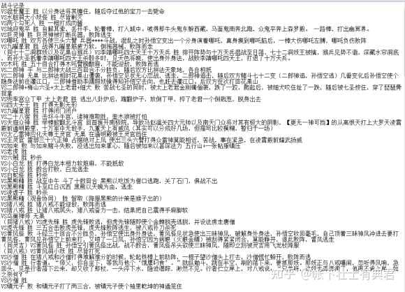

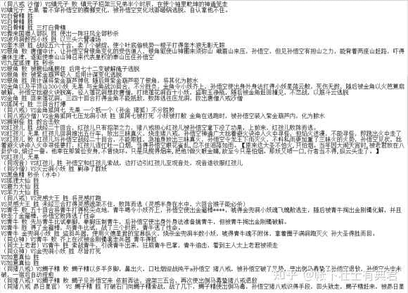

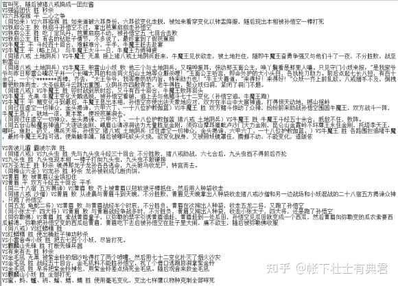

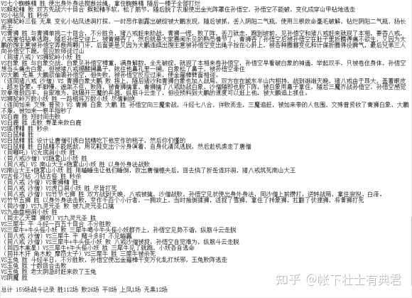

总计159场战斗记录胜112场败26场平8场上风1场无果12场

败绩中有12场被法宝击败5场被群战击败

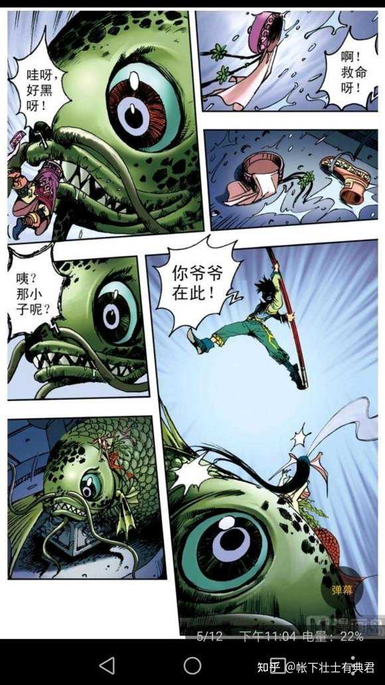

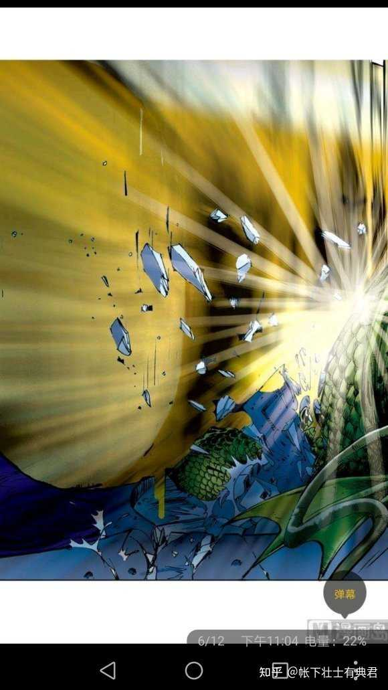

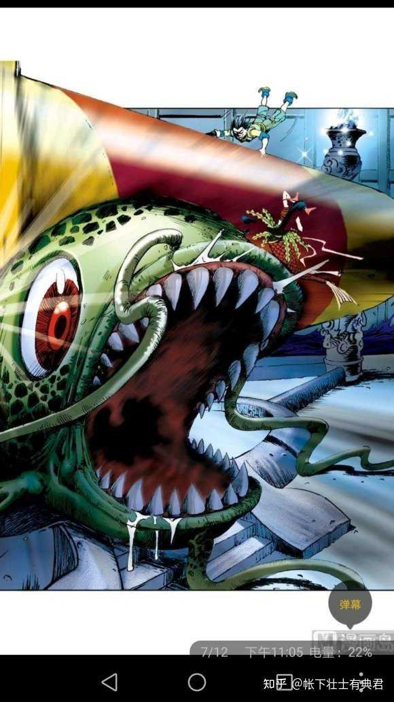

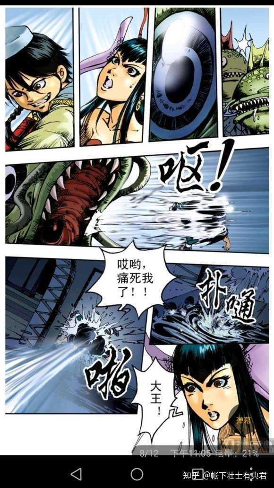

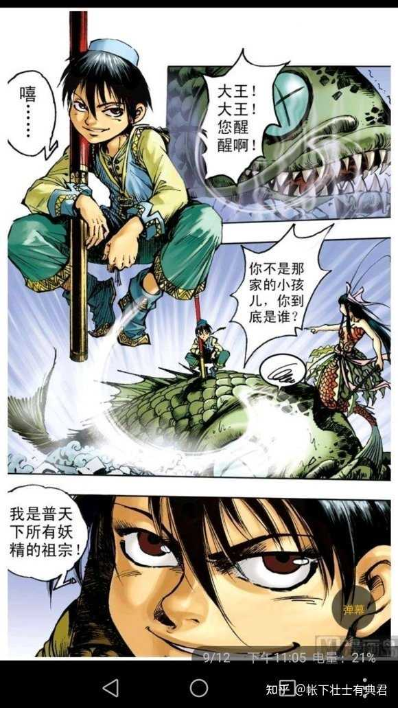

***

### 天庭放水

原著没有任何天庭放水的原文，倒是有孙悟空取经路上知道唐僧有哪些劫难，有时候故意不用法力划水凑难的原文【虽然就这样也没多少能和平A孙悟空打】

>1师父该有这一夜牢狱之灾，老孙不开口折辨，不使法力者，盖为此耳】
>
>2【虽是我师父该有此难，还不可教他十分受苦】。
>
>3行者笑道：“天宫原是我的旧家。当年我做齐天大圣，因为乱了蟠桃会，被我佛收降，如今没奈何，保唐僧取经，将功折罪。一路上辅正除邪，我师父【该有此难】，汝等却不知也。”
>
>4行者频频的暗笑道：“驾不去，驾不去！”你看他怎么就说个驾不去?若肯使出神通，说破飞升之奥妙，师徒们就一千个河也过去了；只因心里明白，知道唐僧九九之数未完，还该有一难，故羁留于此。
>
>5象这泼魔毒怪，使摄法，弄风头，却是扯扯拉拉，就地而行，不能带得空中而去。象那样法儿，老孙也会使会弄。还有那隐身法、缩地法，老孙件件皆知。但只是师父要穷历异邦，不能彀超脱苦海，所以寸步难行也。我和你只做得个拥护，保得他身在命在，替不得这些苦恼，也取不得经来，就是有能先去见了佛，那佛也不肯把经善与你我。正叫做若将容易得，便作等闲看。”那呆子闻言，喏喏听受。

还有很多处，不一一贴了

不过说明一下孙悟空取经凑难划水的原文主要用来对付那些张嘴就来大闹天宫天庭放水，取经路上被随便妖怪虐，没看过书，被拿原文打脸还死皮赖脸的，一般讨论没必要张嘴就孙悟空取经划水来贬低一些角色，本身西游记取经路上讲的就是修心，修行有各种寓意象征和原型的，除了对付一些黑子，不建议太过于扣字眼，有时候反而曲解原著的原意了

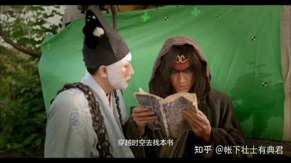

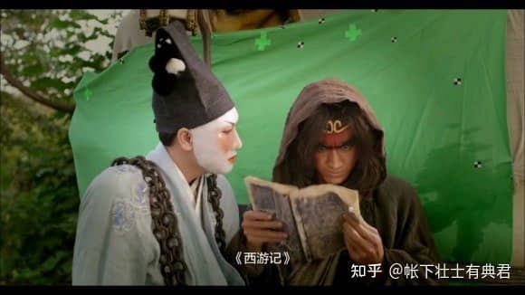

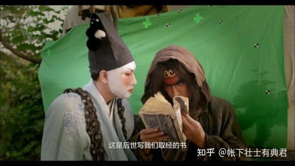

PS：孙悟空在取经路上不喜欢先手大招，而是喜欢先比武的原因其实也有解释【孙悟空开大基本是被打败阵后才开来反杀或者被群殴了，见势不谐才用，要不就是对方开大，孙悟空才跟着开大】

喜欢比武的理由是因为憋久了，手痒

>【自从降了黄风怪，下山来，这个把月不曾耍棍，我见你和他战的甜美，我就忍不住脚痒，故就跳将来耍耍的。那知那怪不识耍，就走了。”】

***

### 孙悟空万年平手帝

这也不知道哪传出来的，很多人看到原著有一个不分胜败的字眼，就表示是平手，我也是醉了

首先，要纠正一点的就是，不分胜败不等于平手，不是写一个不分胜败就代表是平手，不分胜败只是代表还没有分出胜负而已，和平手没什么关系

这里原文就有明显的解释

>【战经二十合，【不分胜败。】猪八戒在旁边，看得明白：妖【精虽不败降，却只是遮拦隔架，全无攻杀之能；行者纵不赢他，棒法精强，来往只在那妖精头上，不离了左右。】八戒暗想道："不好啊，行者溜撒，一时间丢个破绽，哄那妖魔钻进来，一铁棒打倒，就没了我的功劳。"】
>
>【那怪更不怕，乱舞枪遮拦。在那半空中，一来一往，一上一下，斗到三更时分，【未见胜败。】八戒沙僧在李家天井里看得明白，原来那怪只是舞枪遮架，【更无半分儿攻杀，行者一条棒不离那怪的头上。】】

PS：明清小说里很多战斗都有不分胜败的字眼，只是代表还没分出胜负而已，通常都是描写一下双方的打斗场面，然后以一句斗有XX时间内，不分胜败概括，之后马上转折，写出最终战斗结果。

这里我们举个例子，青牛和黑熊奎木狼【也是网上经常传的和孙悟空平手对象，我们看看究竟是不是平手】

青牛

>【战经三个时辰，不分胜败，早又见天色将晚。妖魔支着长枪道：“悟空，你住了。天昏地暗，不是个赌斗之时，且各歇息歇息，明朝再与你比迸。”行者骂道：“泼畜休言！老孙的兴头才来，管甚么天晚？是必与你定个输赢。”那怪物喝一声，【虚幌一枪，逃了性命】，帅群妖收转干戈，入洞中将门紧紧闭了】

黑熊

>【那怪与行者斗了【十数回合】，不分胜负。渐渐红日当午，那黑汉举枪架住铁棒道：“孙行者，我两个且收兵，等我进了膳来，再与你赌斗。”行者道：“你这个孽畜，教做汉子？好汉子，半日儿就要吃饭？似老孙在山根下，整压了五百余年，也未曾尝些汤水，那里便饿哩？莫推故，休走！还我袈裟来，方让你去吃饭！”那怪虚幌一枪，撤身入洞，关了石门】
>【叫他出来与他赌斗。他已承认了，是他拿回。战够这半日，不分胜负。那怪回洞，却要吃饭，关了石门，惧战不出。】

奎木狼

>【他两个战有五六十合，不分胜负。行者心中暗喜道：“这个泼怪，他那口刀，倒也抵得住老孙的这根棒。等老孙丢个破绽与他，看他可认得。”好猴王，双手举棍，使一个高探马的势子。那怪不识是计，见有空儿，舞着宝刀，径奔下三路砍。被行者急转个大中平，挑开他那口刀，又使个叶底偷桃势，望妖精头顶一棍，就打得他无影无踪。】
>【那二十七宿星员，领了旨意，出了天门，各念咒语，惊动奎星。你道他在那里躲避？他原来是孙大圣大闹天宫时打怕了的神将，闪在那山涧里潜灾，被水气隐住妖云，所以不曾看见他。他听得本部星员念咒，方敢出头，随众上界。】

特别说明一点原著里孙悟空的武力是西游记最顶级的存在，全作纯武力单挑，孙悟空从来没有输过，靠着精湛的武艺和神力以及金刚之躯和超级续航，和孙悟空对打的大部分都是被孙悟空几回合内打爆，厉害些的十数回合到三十回合左右，强力的妖王能撑到五六十回合打上挺长时间场面不至于一边倒的也只有青牛金毛犼黄眉奎木狼蜈蚣精白象等等寥寥几个，两只手数的过来，而且大部分不是最后被直接怼败，被孙悟空武艺压制，就是体力不支败逃。

只有二郎神牛魔王六耳猕猴三人能在武力上与孙悟空匹敌，真正战成平手，不分上下，最多再加个黄眉，镇元子武力也很强，但依旧无法在武力上打败孙悟空，能在纯武力上让孙猴子吃瘪的只有竹节七狮和狮驼岭三妖这种团体群殴，单挑，一个都没有。

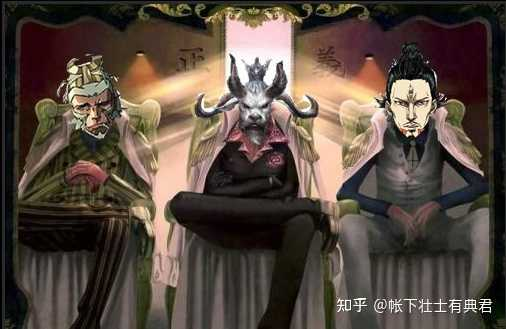

真正和孙悟空平手得结合表现和定位评价来看
首先战斗时间回合数，起码得打上一百回合，双方都没显示任何劣势之处，最好还要有旁白描述双方平手之类的意思。
例如（六耳就不说了）

二郎神

>【昭惠二郎神，齐天孙大圣，这个心高欺敌美猴王，那个面生压伏真梁栋。两个乍相逢，个人皆睹兴。从来未识浅和深，今日方之轻与重。铁棒赛飞龙，神锋如舞凤，左挡右攻，前迎后映。这阵上梅山六弟助威风，那阵上马流四将传军令。摇旗擂鼓各齐心，呐喊筛锣都助兴。两个钢刀有见机，一来一往无丝缝。金箍棒是海中珍，变化飞腾能取胜；若还身慢命该休，但要差汽为蹭蹬。真君与大圣斗经三百馀合，不知胜负。】

牛魔王

>金箍棒，混铁棍，变脸不以朋友论。那个说："正怪你这猢狲害子情！"这个说："你令郎已得道休嗔恨！"那个说："你无知怎敢上我门？"这个说："我有因特地来相问。"一个要求扇子保唐僧，一个不借芭蕉忒鄙吝。语去言来失旧情，举家无义皆生忿。牛王棍起赛蛟龙，大圣棒迎神鬼遁。初时争斗在山前，后来齐驾祥云进。半空之内显神通，五彩光中施妙运。【两条棍响振天关，不见输赢皆傍寸。】这大圣与那牛王斗经百十回合，不分胜负。正在【难解难分】之际

再不济也得打上五十回合（西游记里能扛猴子五十回合的一只手数的过来，扛猴子五十回合就已经是一流武力了）

其次，角色的定位，他人评价，最好还有后世一些权威的评书注解评价

>【好魔王，他也有七十二变，【武艺也与大圣一般】，只是身子狼犺些，欠钻疾，不活达些】

>土地道："那牛王神通不小，法力无边，正是孙大圣的【敌手。】"

>牛魔与行者，原有兄弟之好，想其神力亦相为伯仲，故此处三调之役，惊天动地，劳师动众，而后乃几几得之，岂非西方路上第一勃敌乎？【出自西游证道书】牛魔王

>想我闹天宫时，玉帝遣十万天兵，布天罗地网，更不曾有一将敢与我比手。向后来，调了小圣二郎，方是我的【对手。】二郎神

>【李本旁批:说出。此变化,乃五百年前曾与二郎赌过者,今乃再见于牛王。可见高棋敌手,亦自难逢。】

不奢求能达到牛魔王和二郎神这种几乎一个武力定位的标准，起码也要达到黄眉的标准（各种方面来看都足够优异的表现，不是吹出来的水分），不然就别说什么和猴子平手了。

***

### 孙悟空被黄风怪吹瞎

这个也是电视剧的误导

>【那妖怪使出这阵狂风，就把孙大圣毫毛变的小行者刮得在那半空中，却似纺车儿一般乱转，莫想轮得棒，如何拢得身？慌得行者将毫毛一抖，收上身来，【独自个举着铁棒，上前来打】，又被那怪劈脸喷了一口黄风，把两只火眼金睛，刮得紧紧闭合，莫能睁开，因此难使铁棒，遂败下阵来。那妖收风回洞不题。】
>【行者道：“救师父且等再处，不知这里可有眼科先生，且教他把我眼医治医治。”八戒道：“你眼怎的来？”行者道：“我被那怪一口风喷将来，吹得我眼珠酸痛，这会子冷泪常流。”】
>【行者道：“果然，果然！我们虽不是神仙，神仙还是我的晚辈，这条命急切难休，却只是吹得我眼珠酸痛！”】

原著孙悟空本体顶着三昧神风冲进去要打黄风怪，但被黄风一口风吹到他的老害病眼火眼金睛导致眼睛流冷泪，酸痛，吃瘪了一次，和红孩儿那一次的情况一样

很多人受电视剧影响，认为黄风这里把孙悟空吹瞎了，这是电视剧原创内容，原著孙悟空被黄风吹了只是眼珠酸痛会流冷泪，并没瞎，一些地摊网文经常结合电视剧内容断章取义，一会说不要被电视剧误导，一边拿各种电视剧内容来凑原著【孙悟空被三昧神风吹瞎，太上老君炉子的是三昧火等等】

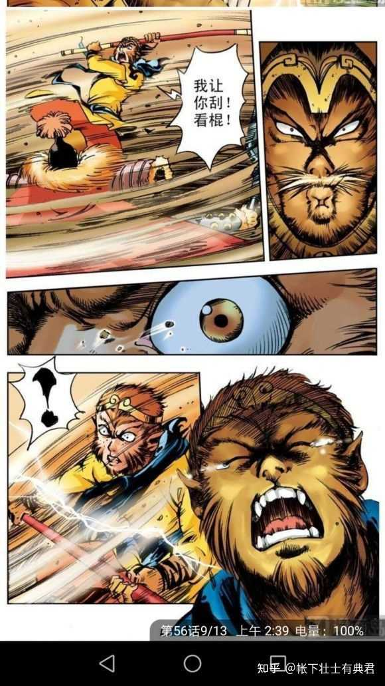

***

### 大鹏大闹灵山，吊打十八罗汉

又是一个来自电视剧的误导

>【三魔道：“大哥休得悚惧，我们一齐上前，使枪刀搠倒如来，夺他那雷音宝刹！”这魔头不识起倒，真个举刀上前乱砍，却被文殊、普贤，念动真言喝道：“这孽畜还不皈正，更待怎生！”唬得老怪、二怪，不敢撑持，丢了兵器，打个滚，现了本相。二菩萨将莲花台抛在那怪的脊背上，飞身跨坐，二怪遂泯耳皈依。二菩萨既收了青狮、白象，只有那第三个妖魔不伏，腾开翅，丢了方天戟，扶摇直上，轮利爪要刁捉猴王。原来大圣藏在光中，他怎敢近？如来情知此意，即闪金光，把那鹊巢贯顶之头，迎风一幌，变做鲜红的一块血肉。妖精轮利爪刁他一下，被佛爷把手往上一指，那妖翅膊上就了筋。飞不去，只在佛顶上，不能远遁，现了本相，乃是一个大鹏金翅雕。】

原著三魔在孙悟空出去屠了狮驼岭之后担心孙悟空在回来，散布唐僧死的谣言，导致孙悟空伤心欲绝，去找如来，然后如来看了一下表示唐僧没死，道出狮驼岭三怪的来历，就叫上文殊普贤以及一群小弟去狮驼国收三妖了，过程也很简单，孙悟空去叫战引三怪，如来带小弟把三怪包围了，大鹏怂恿青狮白象打头阵，搠倒如来，自己缩在后面，然后青狮白象被文殊普贤收服，大鹏狗急跳墙然后被如来一根手指秒杀，并没有什么打上西天，大战十八罗汉

央视版加的大鹏斗十八罗汉，应该来源于京剧十八罗汉斗大鹏，但是央视加强了大鹏，京剧十八罗汉斗大鹏，是十八罗汉降服大鹏，央视版改成大鹏击败十八罗汉

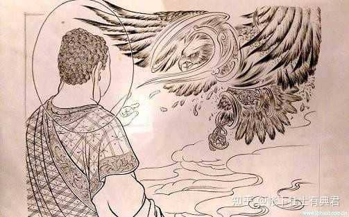

***

### 所谓如来说孙悟空胜不过大鹏

如来从没说过那妖精是大鹏，而且前后也对不上，如来说完那妖精后，首先介绍的是青狮白象，不是什么大鹏，不要乱YY，那妖精说的应该狮驼三魔这个集体，而不是大鹏，不要瞎YY

因为西游记中的那妖精
根本不是单指一个人
西游记中经常用【那妖精】【这妖精】【他】指一群妖精，如：

这点很好找
比如三犀牛一章就有

>行者闪在石崖上，仔细观看，【那妖精】生得——
>彩面环睛，二角峥嵘。尖尖四只耳，灵窍闪光明。一体花纹如彩画，满身锦绣若蜚英。第一个，头顶狐裘花帽暖，一脸昂毛热气腾；第二个，身挂轻纱飞烈焰，四蹄花莹玉玲玲；第三个，威雄声吼如雷振，獠牙尖利赛银针。个个勇而猛，手持三样兵：一个使钺斧，一个大刀能；但看第三个，肩上横担扢挞藤。

>洞中有三个妖精：大的个名辟寒大王，第二个号辟暑大王，第三个号辟尘大王，【这妖精】在此有千年了。【他】自幼儿爱食酥合香油……难救！难救！【那妖精】神通广大，我弟兄三个，与他三个斗了多时，被他呼小妖先捉了八戒，后捉了沙僧，老孙幸走脱了。

这妖精、他、那妖精都是指的三个犀牛。

还有七个蜘蛛精这里

>【那妖精】到此，住不上十年。小神自三年前检点之后，方见【他】的本相，乃是七个蜘蛛精。
>【他】吐那些丝绳，乃是蛛丝。

不但包含了【那妖精】，还包含了【他】
有的人看到你贴出了那妖精指一群人的原文后，开始转进到【你胜不得他】中【他】，说【他】只能指一个人

>所以：
>——今至狮驼山狮驼洞狮驼城，有【三个毒魔】，乃【狮王、象王、大鹏】，把我师父捉将去，连弟子一概遭迍，都捆在蒸笼里，受汤火之灾。幸弟子脱逃，唤龙王救免。是夜偷出师等，不料灾星难脱，复又擒回。及至天明，入城打听，叵耐【那魔】十分狠毒，万样骁勇，把师父连夜夹生吃了，如今骨肉无存。
>——悟空少得烦恼。【那妖精】神通广大，你胜不得【他】，所以这等心痛
>——不瞒如来说，弟子当年闹天宫，称大圣，自为人以来，不曾吃亏，今番却遭【这毒魔】之手！

这段话自始至终都是说的三个毒魔，从来没单指过大鹏。三个毒魔＝那魔＝那妖精＝他＝这毒魔＝狮王象王大鹏。

>八戒也说了八戒听见，战兢兢的道：“哥哥，你听。【那妖精】计较要蒸我们吃哩！”

原著三魔一直并提关系【群魔】

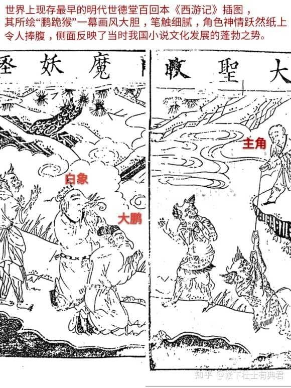

***

### 西游记观音是男的

经常看网上有人为了卖弄一下自己的知识抖机灵在西游记的视频说观音其实是男的，不好意思，原著观音是个纯粹的美女，观音被传入中原后，经过多年演变，形象早已娘化，西游记里的观音就是女的，不用怀疑，而且是个绝世美女，老鼠精和比丘美后的相貌形容词都有观音
所以是观音姐姐，不是什么观音哥哥，颜值高到让唐太宗和文武百官，忘了江山，失却朝礼

>一
>　　喜的个唐王朝天礼拜，众文武跪地焚香，满寺中僧尼道俗，士人工贾，无一人不拜祷道“好菩萨！好菩萨！”有词为证，但见那：瑞霭散缤纷，祥光护法身。九霄华汉里，现出女真人。那菩萨，头上戴一顶金叶纽，翠花铺，放金光，生锐气的垂珠缨络；　　身上穿一领淡淡色，浅浅妆，盘金龙，飞彩凤的结素蓝袍；胸前挂一面对月明，舞清风，杂宝珠，攒翠玉的砌香环珮；腰间系一条冰蚕丝，织金边，登彩云，促瑶海的锦绣绒裙；面前又领一个飞东洋，游普世，感恩行孝，黄毛红嘴白鹦哥；手内托着一个施恩济世的宝瓶，瓶内插着一枝洒青霄，撒大恶，扫开残雾垂杨柳。玉环穿绣扣，金莲足下深。三天许出入，这才是救苦救难观世音。喜的个唐太宗，忘了江山；爱的那文武官，失却朝礼；　　盖众多人，都念“南无观世音菩萨”。太宗即传旨：教巧手丹青，描下菩萨真象。旨意一声，选出个图神写圣远见高明的吴道子，此人即后图功臣于凌烟阁者。当时展开妙笔，图写真形。

>　二
>行者久等不见，心焦道：“列位与我传报传报，但迟了，恐伤吾师之命。”诸天道：“不敢报，菩萨吩咐，只等他自出来哩。”行者性急，那里等得，急纵身往里便走。噫
>这个美猴王，性急能鹊薄。诸天留不住，要往里边狖。
>拽步入深林，睁眼偷觑着。远观救苦尊，盘坐衬残箬。
>懒散怕梳妆，容颜多绰约。散挽一窝丝，未曾戴缨络。
>不挂素蓝袍，贴身小袄缚。漫腰束锦裙，赤了一双脚。
>披肩绣带无，精光两臂膊。玉手执钢刀，正把竹皮削。

>三
>孙悟空曾经骂过观音＂该她一世无夫！＂

顺便观音也是少数斗嘴能干倒猴子的女人

>菩萨道：“我把你这个大胆的马流，村愚的赤kao！我倒再三尽意，度得个取经人来，叮咛教他救你性命，你怎么不来谢我活命之恩，反来与我嚷闹？

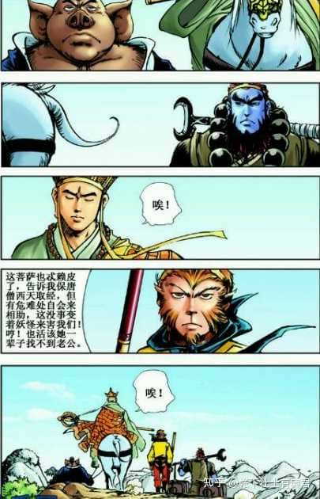

***

### 如来用金丹砂买路

吴闲云经典神论之一

如来拿十八座金山当买路财让老君来收了青牛

这原文说得很清楚

>【行者再拜称谢道：“如来助我什么法力？”如来即令十八尊罗汉开宝库取十八粒“金丹砂”与悟空助力。行者道：“金丹砂却如何？”如来道：“你去洞外，叫那妖魔比试。演他出来，却教罗汉放砂，陷住他，使他动不得身，拔不得脚，凭你揪打便了。”】
>
>【行者即招呼罗汉把金丹砂望妖魔一齐抛下，共显神通，好砂！正是那——
>　　似雾如烟初散漫，纷纷霭霭下天涯。白茫茫，到处迷人眼；昏漠漠，飞时找路差。打柴的樵子失了伴，采药的仙童不见家。细细轻飘如麦面，粗粗翻复似芝麻。世界朦胧山顶暗，长空迷没太阳遮。不比嚣尘随骏马，难言轻软衬香车。此砂本是无情物，盖地遮天把怪拿。只为妖魔侵正道，阿罗奉法逞豪华。手中就有明珠现，等时刮得眼生花。
>　　那妖魔见飞砂迷目，把头低了一低，足下就有三尺余深，慌得他将身一纵，跳在浮上一层，未曾立得稳，须臾，又有二尺余深。那怪急了，拔出脚来，即忙取圈子，往上一撇，叫声：“着！”唿喇的一下，把十八粒金丹砂又尽套去，拽回步，径归本洞。】

>【罗汉道：“如来吩咐我两个说，那妖魔神通广大，如失了金丹砂，就教孙悟空上离恨天兜率宫太上老君处寻他的踪迹，庶几可一鼓而擒也。”】

>【孙大圣才同天王等众打入洞里，把那百十个小妖尽皆打死，【各取兵器，谢了天王父子回天，雷公入府，火德归宫，水伯回河，罗汉向西】】

原文说得很清楚，金丹砂是类似流沙之类的法宝，作用是陷住敌人，而不是什么狗屁金山，青牛面对的表现根本不知道这是啥玩意，又慌又急

最后写得也很明白了，

>【各取兵器，谢了天王父子回天，雷公入府，火德归宫，水伯回河，罗汉向西】

兵器全部归还了，包括西天借来的金丹砂。

请不要黑道德天尊的品德，道德天尊太上老君需要受人贿赂？别侮辱人家了好吗？

***

### 西游记是禁书

这个论调出自当年明月的明朝那些事儿然而这只是当年明月瞎掰的，他自己也拿不出出处，更没有史料可以证明这点。相反，明清的西游记评批本和同人本有很多。

***

### 路上的妖怪都不怕孙悟空大闹天宫的事，嘲笑孙悟空是弼马温

首先，原著只有两个妖怪光明正大喊过孙悟空弼马温，一个是黑熊，一个是玉兔，还有一个暗暗叫过，那就是青狮，此外没人叫过

>【玉兔：我认得你是五百年前大闹天宫的弼马温，理当让你。但只是破人亲事，如杀父母之仇，故此情理不甘】
>【黑熊：你原来是那闹天宫的弼马温么？】

黑熊最后被猴子计谋降服，钻肚子搞得痛得直打滚，玉兔差点被孙悟空一棍子打死，多亏太阴及时出来救人，青狮我就不说了，看电视剧的也应该知道原著青狮被猴子搞得有多惨

那么其他妖怪对孙悟空的态度呢?

>白骨夫人：几年只闻得讲他手段，今日果然话不虚传
>
>奎木狼：你道他在那里躲避？他原来是孙大圣大闹天宫时打怕了的神将，闪在那山涧里潜灾，被水气隐住妖云，所以不曾看见他。他听得本部星员念咒，方敢出头
>
>黄风怪：手执着如意的铁棒，答道：“你孙外公在此，送出我师父来！”那怪仔细观看，见行者。。。。。不满四尺，笑道：“可怜，可怜！我只道是怎么样扳翻不倒的好汉，原来是这般一个骷髅的病鬼！”行者笑道：“你这个儿子，忒没眼色！你外公虽是小小的，你若肯照头打一叉柄，就长三尺。”那怪道：“你硬着头，吃吾一柄。”大圣公然不惧。那怪果打一下来，他把腰躬一躬，足长了三尺，有一丈长短，慌得那妖把钢叉按住
>
>银角：你们不曾见他那条铁棒，有万夫不当之勇，我洞中不过有四五百兵，怎禁得他那一棒？
>
>金角：只是还不曾拿住那有手段的孙行者。须是拿住他，才好吃唐僧哩。若不曾拿得他，切莫动他的人。那猴王神通广大，变化多般，我们若吃了他师父，他肯甘心？————兄弟，把唐僧与沙僧、八戒、白马、行李都送还那孙行者，闭了是非之门罢。
>
>灵感大王：那帮手轮一条铁棒打我，我闪过与他相持。也不知他那棍子有多少斤重，我的铜锤莫想架得他住，战未三合，我却败回来也。
>
>斑衣鳜婆：大王啊！亏了你识俊，逃了性命！若再三合，决然不得全生！那和尚我认得他。————“我当年在东洋海内，曾闻得老龙王说他的名誉，乃是五百年前大闹天宫、混元一气上方太乙金仙美猴王齐天大圣，如今归依佛教，保唐僧往西天取经，改名唤做孙悟空行者。他的神通广大，变化多端，大王，你怎么惹他！今后再莫与他战了。”
>
>青牛：那妖魔听说是齐天大圣孙悟空，老大有些悚惧，口内不言，心中暗想道：“久闻那厮神通广大，如今不期而会。”————好猴儿！好猴儿！真个是那闹天官的本事！
>
>红孩儿：「噫！不知是那个有眼力的，想应认得我了，似此模样，莫想得那唐僧的肉吃。”」
>「那怪闻言，心中害怕，就知大圣是个能人」
>
>牛魔王：和我赌斗一场，未分胜负。我却丢了他，径赴盛会。那猴子千般伶俐，万样机关，断乎是那厮变作蟹精，来此打探消息，偷了我兽，去山妻处骗了那一把芭蕉扇儿也！”众精见说，一个个胆战心惊，问道：“可是那大闹天宫的孙悟空么？”牛王道：“正是。列公若在西天路上，有不是处，切要躲避他些儿。”
>
>黄眉老佛：一向久知你往西去，有些手段，故此设象显能，诱你师父进来，要和你打个赌赛。
>
>赛太岁：「那妖王听他说出悟空行者，遂道：“你原来是大闹天宫的那厮，你既脱身保唐僧西去，你走你的路去便罢了。怎么罗织管事，替那朱紫国为nu，却到我这里寻死！”……
>那妖王见行者手段高强，料不能取胜」
>
>青狮：几年都说猴儿狠，话不虚传果是真！————兄弟，你说那里话，孙行者是个广施仁义的猴头，他先在我肚里，若肯害我性命，一千个也被他弄杀了。却才揪住你鼻子，若是扯了去不放回，只捏破你的鼻子头儿，却也惶恐。快早安排送他去罢
>
>大鹏：“大哥啊，我就不曾吩咐你，孙行者不中吃！”————只因怕他一个徒弟孙行者十分利害，自家一个难为，径来此处与我这两个大王结为兄弟，合意同心，打伙儿捉那个唐僧也。————如今在外叫战，谁敢与他打个头仗？”更无一人答应，又问又无人答，都是那装聋推哑。老魔发怒道：“我等在西方大路上，忝着个丑名，今日孙行者这般藐视，若不出去与他见阵，也低了名头。等我舍了这老性命去与他战上三合！三合战得过，唐僧还是我们口里食；战不过，那时关了门，让他过去罢。”
>
>白鹿精：那国丈听见，急睁睛仔细观看，见那和尚变了面皮，不是那般模样。咦！认得当年孙大圣，五百年前旧有名。却抽身，腾云就起，被行者翻筋斗，跳在空中喝道：“那里走！吃吾一棒！”
>
>白鼠精：咬牙恨齿道：“几年家闻人说孙悟空神通广大，今日见他，果然话不虚传
>
>铁背苍狼：那孙行者神通广大，变化多端！他五百年前曾大闹天宫，上方二十八宿、九曜星官、十二元辰、五卿四相、东西星斗、南北二神、五岳四渎、普天神将，也不曾惹得他过
>
>九灵元圣：那毛脸雷公嘴者叫做孙行者，这个人其实神通广大，五百年前曾大闹天宫，十万天兵也不曾拿得住。他专意寻人的，他便就是个搜山揭海、破洞攻城、闯祸的个都头！你怎么惹他？

基本上在天庭呆过，比较有本事的妖王都忌惮孙悟空。

倒是也有看不起孙悟空的，比如虎先锋，赛太岁先锋，九头虫，黄狮精，南山大王，狐阿七，小鼍龙，这些妖怪的共同点就是菜+没见识，结局都很惨，都被孙悟空锤过。

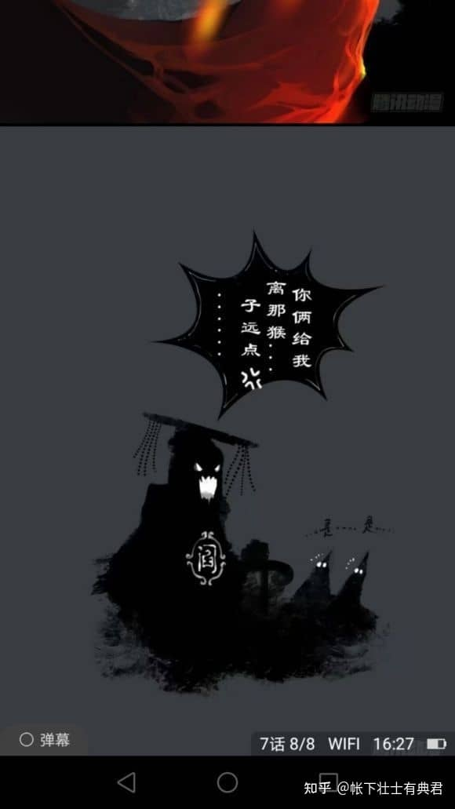

图片来自漫画驱魔录

***

### 和孙悟空结拜的除牛魔王外的5大圣一定就是取经路上出现的六耳猕猴，青狮，白象，大鹏等等

这个最早出自无性大象的脑补，并没有相关的决定性证据，古人评批本的意见是举牛魔一例而知其他。

***

### 西游记是佛道之争

原著主旨是三教合一，多次提示，比如菩提祖师以及孙悟空担须弥峨眉泰山等等

佛道神仙关系很好，老君和观音经常一起玩耍，互相打赌，燃灯和老君谈经论道等等，天庭也是由佛道神仙组成的，原著没有任何一处佛道神仙之间勾心斗角的原文，西游记的神仙被赋予了人性，但不是满脑子坏水勾心斗角，有的反而很可爱，网上那些佛道之争基本靠意淫脑补，没有任何实质的原文证据

佛道之争是作者最看不起的，车迟国就是批判佛道之争的，搞斗争的三妖被批判为外道，不被作者认可【外道弄强欺正法心猿显圣灭诸邪】

车迟国最后作者明确点明三教合一的主旨

>【望你把三教归一，也敬僧，也敬道，也养育人才，我保你江山永固。】

***

### 孙悟空怕法宝，太上老君随便一件法宝都能秒孙悟空

首先西游记路上有四关法宝关卡，分别是金银角青牛黄眉赛太岁，除了黄眉外，其他三关拿的都是太上老君的法宝。其中孙悟空明确打不过的只有黄眉，和青牛互相奈何不了，救不出师父，但场面上互有胜负，剩下金银角和赛太岁都被孙悟空单人摆平

而除了黄眉的金饶和人种袋外，我们看看孙悟空对剩下三关的法宝的表现

金银角

幌金绳

>【他见面前无人，就弄神通，顺出棒来，吹口仙气，叫：“变！”即变做一个纯钢的锉儿，扳过那颈项的圈子，三五锉，锉做两段；扳开锉口，脱将出来。】

被七十二变轻松完爆，更别提在金银角这一章孙悟空还展现过的聚则成形，散则成气的手段，抓住孙悟空也是出其不意，根本困不住猴子。

七星剑

>【那怪将绳一扯，扯将下来，照光头上砍了七八宝剑，行者头皮儿也不曾红了一红。】

破不了防

芭蕉扇

被七十二变的避火诀完克，也对孙悟空本人没有丝毫作用，但可以克制一下他的身外化身小科普：太上老君的芭蕉扇和铁扇的不是一把哦，铁扇的是阴扇，扇风，传承于元杂剧的设定，老君的是阳扇，出火

紫金葫芦

>【一条心又想着道：“没事，化不得我！老孙五百年前大闹天宫，被太上老君放在八卦炉中炼了四十九日，炼成个金子心肝，银子肺腑，铜头铁背，火眼金睛，那里一时三刻就化得我？且跟他进去，看他怎的！】
>【老魔欢喜道：“贤弟请坐。不要动，只等摇得响再揭帖儿。”行者听得道：“我这般一个身子，怎么便摇得响？只除化成稀汁，才摇得响是。等我撒泡溺罢，他若摇得响时，一定揭帖起盖。我乘空走他niang罢！”又思道，“不好，不好！溺虽可响，只是污了这直裰。等他摇时，我但聚些唾津漱口，稀漓呼喇的，哄他揭开，老孙再走罢。”大圣作了准备，那怪贪酒不摇。大圣作个法，意思只是哄他来摇，忽然叫道：“天呀！孤拐都化了！”那魔也不摇。大圣又叫道：“娘啊！连腰截骨都化了！”老魔道：“化至腰时，都化尽矣，揭起帖儿看看。”那大圣闻言，就拔了一根毫毛。叫：“变！”变作个半截的身子，在葫芦底上，真身却变做个桀栝虫儿，钉在那葫芦口边。只见那二魔揭起帖子看时，大圣早已飞出，打个滚，又变做个倚海龙。】

化不了孙悟空，而且需要别人答应才能收人，被孙悟空掌握情况后拿来反把银角装进去了，而另一个瓶子功能和葫芦差不多，金角都吐槽不中用

>【老魔道：“那瓶子不中用，原是叫人，人应了就装得，转把个口诀儿教了那孙行者，倒把自家兄弟装去了。不用他，放在家里，快将剑与扇子拿来。”】

赛太岁
紫金铃

>【这行者只顾看玩，不觉沙灰飞入鼻内，痒斯斯的，打了两个喷嚏，即回头伸手，在岩下摸了两个鹅卵石，塞住鼻子，摇身一变，变做一个攒火的鹞子，飞入烟火中间，蓦了几蓦，却就没了沙灰，烟火也息了。】
>【他将头一个幌一幌，有三百丈火光烧人；第二个幌一幌，有三百丈烟光熏人；第三个幌一幌，有三百丈黄沙迷人。烟火还不打紧，只是黄沙最毒，若钻入人鼻孔，就伤了性命。”行者道：“利害，利害！我曾经着，打了两个嚏喷，却不知他的铃儿放在何处？”】

让孙悟空打两个喷嚏，然后施点变化熄灭的水平。

至于金刚镯

唯一的作用是收孙悟空的兵器，奈何不了孙悟空本人，这也就是为什么青牛和孙悟空互相干瞪眼的原因，太上老君当年没用金刚镯也很正常，孙悟空是徒手把他打个倒栽葱的。

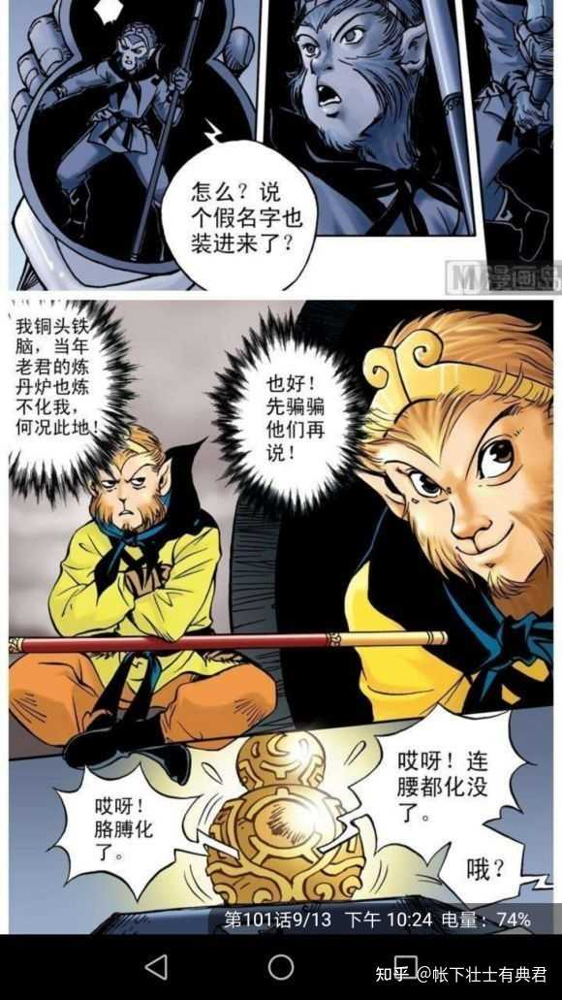

***

### 孙悟空吃人

原著孙悟空说自己吃人是吓唬唐僧的，警告唐僧白骨精这类的妖怪是如何吃人的

>【三藏道：“你这猴头，当时倒也有些眼力，今日如何乱道！这女菩萨有此善心，将这饭要斋我等，你怎么说他是个妖精？”行者笑道：“师父，你那里认得！老孙在水帘洞里做妖魔时，若想人肉吃，便是这等。或变金银，或变庄台，或变醉人，或变女色。有那等痴心的，爱上我，我就迷他到洞里，尽意随心，或蒸或煮受用；吃不了，还要晒干了防天阴哩！师父，我若来迟，你定入他套子，遭他毒手！”【那唐僧那里肯信】】

唐僧自己都不信，猴子这等本事，想吃个人需要这么麻烦

而且旁白大于人物言语

>【原来猪八戒自幼儿伤生作孽吃人，是一口浊气，惟行者从小修持，咬松嚼柏，吃桃果为生，是一口清气。】

如果这段还不够，那再来看看下面这两段

>【原来孙行者不大吃烟火食，只吃几个果子，陪他两个。】
>
>【二老苦劝，没奈何，略见他意。孙大圣自来不吃烟火食，也道：“彀了。”】

孙悟空连烟火食都不吃，需要的话说明孙猴子不吃人的证据还有

***

### 孙悟空不敢走北天门因为有真武大帝坐镇

不知道哪传出来的

首先原著四大天门由四大天王轮流镇守

>行者道：“有事要见玉帝，你在此何干？”广目道：【今日轮该巡视南天门。”】说未了，又见那马赵温关四大元帅作礼道：“大圣，失迎，请待茶。”
>好大圣，又驾筋斗云，径到【北天门】外，忽抬头，见多闻天王向前施礼道：“孙大圣何往？”行者道：“有一事要入乌浩宫见水德星君，你在此作甚？”多闻道：“今日轮该巡视。”

而大闹天宫四大天王不分好歹，却又大乱天宫，打得那九曜星闭门闭户，【四天王】无影无形。

其次猴子大闹天宫真武就在现场，调了三十六雷将前来

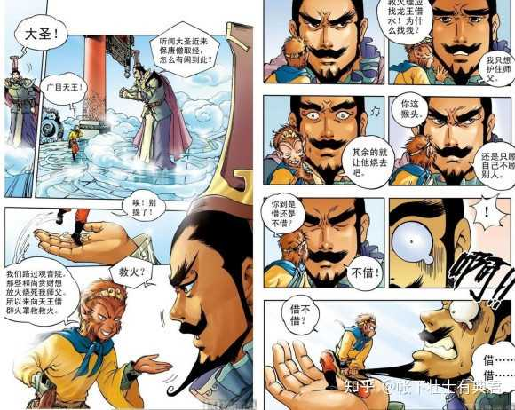

***

### 火眼金睛

关于火眼金睛，平常广泛印象里是可以看破妖怪变化的法眼，但原著里其实个老害眼病，如前面所说，孙悟空在红孩儿黄风怪那里吃瘪就是因为这个老害病眼。

原文写的很清楚，因为在八卦炉里躲在巽位49天，被烟熏红了眼【红眼病】，所以叫做火眼金睛【猴子是金瞳】

>原来那炉是乾、坎、艮、震、巽、离、坤、兑八卦。他即将身钻在巽宫位下。巽乃风也，有风则无火，【只是风搅得烟来，把一双眼刍红了，弄做个老害病眼，故唤作“火眼金睛”。】

后文出现的火眼金睛等字眼，都是在形容孙悟空的眼睛模样的

>这长老近前细看，你道他是怎生模样：尖嘴缩腮，【金睛火眼】。头上堆苔藓，耳中生薜萝。鬓边少发多青草，颔下无须有绿莎
>那怪转过眼来，看见行者咨牙俫嘴，【火眼金睛】，磕头毛脸，就是个活雷公相似，慌得他手麻脚软，划剌的一声，挣破了衣服，化狂风脱身而去。
>使一根金箍铁棒，他生得【火眼金睛】
>妖邪道：“是一个毛脸雷公嘴，查耳朵，折鼻梁，【火眼金睛】和尚。

六耳变成孙悟空的样子也一样是火眼金睛

>大圣本是良心，沙僧却有疑意，真个二人同驾云而去。不多时，果见花果山，按下云头，二人洞外细看，果见一个行者，高坐石台之上，与群猴饮酒作乐。模样与大圣无异：也是黄发金箍，【金睛火眼】；身穿也是锦布直裰，腰系虎皮裙；手中也拿一条儿金箍铁棒

火眼金睛其实就是特指孙悟空眼睛的模样，形容孙悟空的眼睛就是火眼金睛，听起来比较帅

让人误解火眼金睛有看破效果应该是书中有不少处，孙悟空睁火眼金睛观看的描述，但这就跟二郎神圆睁凤目看的意思一样，就是睁眼仔细看，孙悟空眼睛形容是火眼金睛就是睁火眼金睛观看，二郎神眼睛是凤目，所以就是睁凤目观看（二郎圆睁凤目观看，见大圣变了麻雀儿，钉在树上【西游记二郎神没有第三只眼睛】）

>好大圣，【睁开火眼金睛】，漫山越岭的望处，却无踪迹。
>有土地、山神、监押大圣的天将，都来拜接了菩萨，引至那大圣面前。看时，他原来压于石匣之中，口能言，身不能动。菩萨道：“姓孙的，你认得我么？”大圣【睁开火眼金睛】，点着头儿高叫道；“我怎么不认得你。你好的是那南海普陀落伽山救苦救难大慈大悲南无观世音菩萨。承看顾！承看顾！
>只见那行者自南山顶上，摘了几个桃子，托着钵盂，一筋斗，点将回来，【睁火眼金睛】观看，认得那女子是个妖精
>行者道：“想是钻进洞去了，等我去看。”好大圣，【急睁火眼金睛】，漫山看处，果然不见动静
>行者暗里欣然，丁在那毗卢帽顶上，运神光，【睁火眼金睛观看】，又只见那两班彩女，摆列的似蕊宫仙府，胜强似锦帐春风。

那孙悟空是如何看破妖怪的呢？

1.孙悟空的眼睛本身就有异能，出生的时候就目射两道金光惊动玉帝

>一日迸裂，产一石卵，似圆球样大。因见风，化作一个石猴。五官俱备，四肢皆全。便就学爬学走，拜了四方。目运两道金光，射冲斗府。惊动高天上圣大慈仁者玉皇大天尊玄穹高上帝

有时候看破他人的时候都有【运神光】一个动作

从后文看虽然在八卦炉留下来眼病，但视力极好，白日里常看千里，夜里也还看三五百里，堪比千里眼

>老孙火眼金睛，白日里常看千里，凶吉晓得是，夜里也还看三五百里。如今通看不见边岸，怎定得宽阔之数？”

2.经验，看妖氛来辨别

>正自家这等夸念中间，忽然见林南下有一股子【黑气，骨都都的冒将上来。行者大惊道：“那黑气里必定有邪了！我那八戒沙僧却不会放甚黑气。”那大圣在半空中，详察不定。】
>“我王万岁，万万岁！”慌的个长老战战兢兢，莫知所措。【行者早已知识，见那公主头顶上微露出一点妖氛】，却也不十分凶恶，即忙爬近耳朵叫道：“师父，公主是个假的。”长老道：“是假的，却如何教他现相。”行者道：“使出法身，就此拿他也。”
>【今逢大圣认妖氛，救援活命分虚实。】
>那物在空中，明明看着，忍不住心头火起道：“这猴和尚，十分惫懒！就作我是个妖魔，要害你师父，却还不曾见怎么下手哩，你怎么就把我这等伤损！早是我有算计，出神走了，不然，是无故伤生也。若不趁此时拿了唐僧，再让一番，越教他停留长智。”好怪物，就在半空里弄了一阵旋风，呼的一声响亮，走石扬沙，诚然凶狠。好风：淘淘怒卷水云腥，黑气腾腾闭日明。岭树连根通拔尽，野梅带干悉皆平。黄沙迷目人难走，怪石伤残路怎平。滚滚团团平地暗，遍山\*\*发哮声。刮得那三藏马上难存，八戒不敢仰视，沙僧低头掩面。【孙大圣情知是怪物弄风，急纵步来赶时】，那怪已骋风头，将唐僧摄去了，无踪无影，不知摄向何方，无处跟寻。
>行者近前仔细看处，【又见那怪雾愁云漠漠，妖风怨气纷纷。行者在空中赞叹道：“若是真王登宝座，自有祥光五色云；只因妖怪侵龙位，腾腾黑气锁金门。”】

说起来，很少有影视形象还原孙悟空火眼金睛的样貌，一般都是直接作为神通，发动的时候两眼闪光，我能想到把火眼金睛样子还原出来的只有一个伏妖篇

这也是我认为最符合原著猴哥形象的一个版本

雷公嘴、孤拐面、骨挝脸，磕额头、塌鼻子、金睛火眼、黄发金箍、尖嘴咨牙、一身黄毛、皮里裹着一团筋。两耳过眉查又硬。挺挺身才变化多，相貌像个猢狲

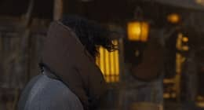

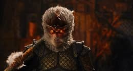

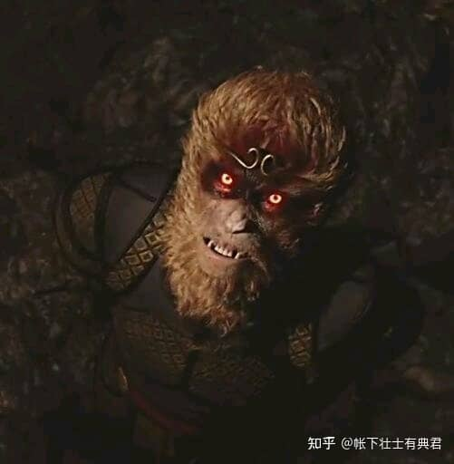

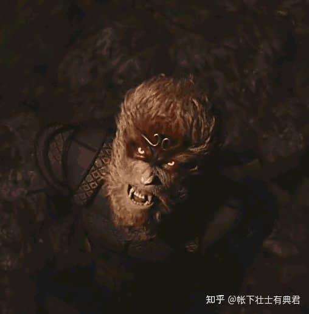

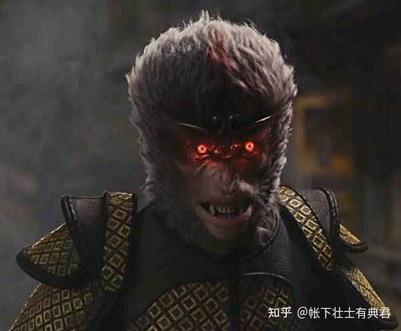

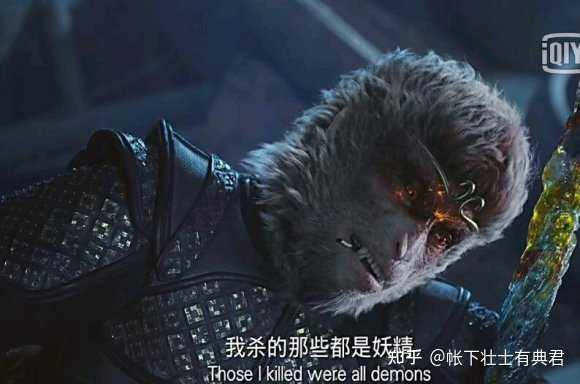

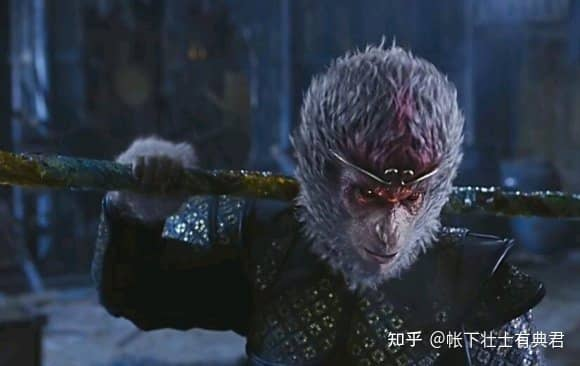

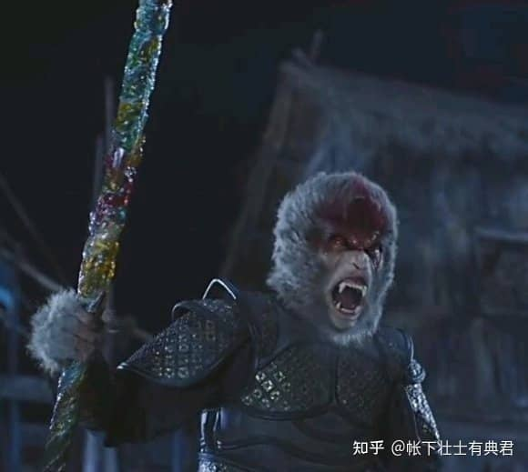

***

### 孙悟空是太乙散仙，修为很低

散仙其实和等级没关系，散仙就是指没有编制的神仙，孙悟空取经的时候是戴罪之身，没有编制，自然是散仙，镇元子也是散仙

散仙是一个道教专有名词，指天界中未被授予官爵的神仙

>
>【为散仙人，不得处职】
>
>【上界真人足官府，岂如散仙鞭笞鸾凤终日相追陪。】

孙悟空真正的修为是混元一气上方太乙金仙

>【原来是你不知！他还有一个大徒弟，是五百年前大闹天宫上方太乙金仙齐天大圣，如今保护唐僧往西天拜佛求经】
>【乃是五百年前大闹天宫、混元一气上方太乙金仙美猴王齐天大圣，如今归依佛教，保唐僧往西天取经，改名唤做孙悟空行者。他的神通广大，变化多端。】
>【那三藏肉眼凡胎，不知是计；孙大圣又是太乙金仙，忠正之性】
>【盖为神通多变化，无真无假两相平。一个是混元一气齐天圣，一个是久炼千灵缩地精。】
>【认得齐天大圣名。棒起致令神鬼怕，斧来刀砍乱飞腾。好一个混元有法真空像！抵住三妖假佛形。】
>【棒架威风长，枪来野性狂。一个是混元真大圣】

在天庭是齐天大圣(玉帝亲封，后来大闹天宫后变成孙悟空固定名号，三界承认）

在佛教是大觉金仙斗战胜佛

在大闹天宫的时候，猴子就有旁白诗证明已证混元

好猴精，有诗为证。诗曰：

　　混元体正合先天，万劫千番只自然。渺渺无为浑太乙，如如不动号初玄。

　　炉中久炼非铅汞，物外长生是本仙。变化无穷还变化，三皈五戒总休言。

有趣的是封神演义里通天教主的出场诗词正是抄自这一段的

>混元正体合先天，万劫千番只自然。渺渺无为传大法，如如不动号初玄。炉中久炼金非汞，物外长生尽属乾。变化无穷还变化，西方佛事属逃禅。

同时万劫长生不老，不死不灭

>【我有七十二般变化，万劫不老长生。会驾筋斗云，一纵十万八千里。】

>清浊几番随运转，辟开数劫任西东。【逍遥万亿年无计】，一点神光永注空。

前面那段描述大闹天宫孙悟空的赞诗也有【万劫千番只自然。】

关于混元
根据黄帝阴符经注关于混元描述

>【得混元之气】，方可超凡入圣。修行之士，若将混元之气修炼纯粹之精，尽成极阳之体而作神仙，岂是难乎？凡有所学不见者，如隔万里山水之外，大小亦然。明圣人制伏之源，【夺天地造化之功。】假令水至冬寒而结成冰，非冷之至也，遇朔风乃结。朔风者，北风也。至夏月不畏其热，畏南风能消其冰，后化为水也。夫人真精要结成丹者，使北方肾气朔风也。其精结成丹药，要化真一之精。南方心火，化精为气，熏蒸四大，纯阳流注，人无死生矣。老母曰：飞禽身道虚空之中者凭其气，况人为万物之灵，能修养炼自己者，尽成【纯阳之体】，气遂能【入金石而无碍，行日月而无影】，岂不能变形证果，御气游玄哉？

恰好欲西游记第三回孙悟空的自述，以及菩提祖师传授的大品天仙决中的描述相符

>悟空道：“我自闻道之后，有七十二般地煞变化之功；筋斗云有莫大的神通；善能隐身遁身，起法摄法；上天有路，入地有门；【步日月无影，入金石无碍】；水不能溺，火不能焚。那些儿去不得？”
>
>祖师道：“此乃非常之道，【夺天地之造化】，侵日月之玄机。丹成之后，鬼神难容。
>
>并且孙悟空是明确描绘的纯阳之体，并且至阳【与二郎神相对照，小圣至阴，这个我们后文在述】
>
>又是老孙轮着铁棒，使【纯阳之性】，护持住了丨【一体纯阳喜向阳】，阴魔不敢逞强梁。

西游记里得了混元之气，便是上真

>【原来是个不伏天不伏地【混元上真】】

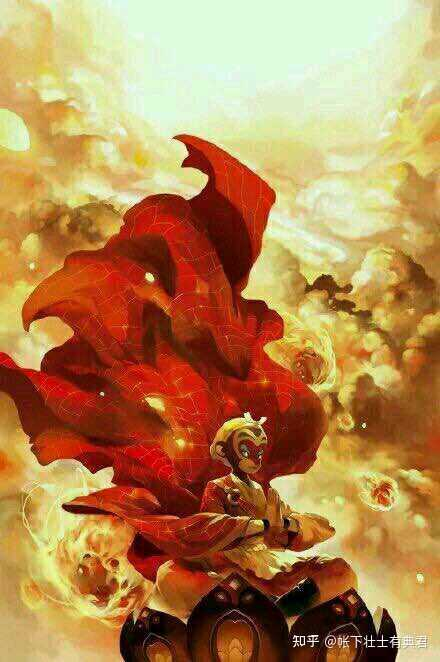

***

### 九头虫在孙悟空和二郎神的围攻下逃脱

原著九头虫被孙悟空打得不敢出头，被引出来后，他现本相，二郎神用弹弓射他，虽然一下都没射中，被九头虫掠到身前要咬，但随后九头虫就被二郎神一旁的细犬窜上去咬掉了头，负痛逃生他能逃走，纯粹因为孙悟空不想追。

***

### 镇元子的袖子的效果是像吸尘器一样把别人吸进去

原著袖里乾坤的释放方式为，将自己的袖子变大，然后飞过去笼人，很多人被电视剧影响，对袖里乾坤有个错误的认知，认为袖里乾坤是类似人种袋一样的效果像吸尘器一样直接把人吸进来，但是其实不是

>【大仙把玉麈左遮右挡，奈了他两三回合，使一个袖里乾坤的手段，在云端里把袍袖迎风轻轻的一展，刷地前来，把四僧连马一袖子笼住。】

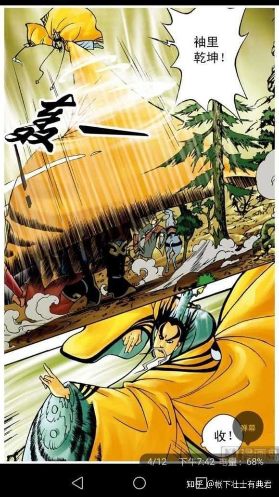
