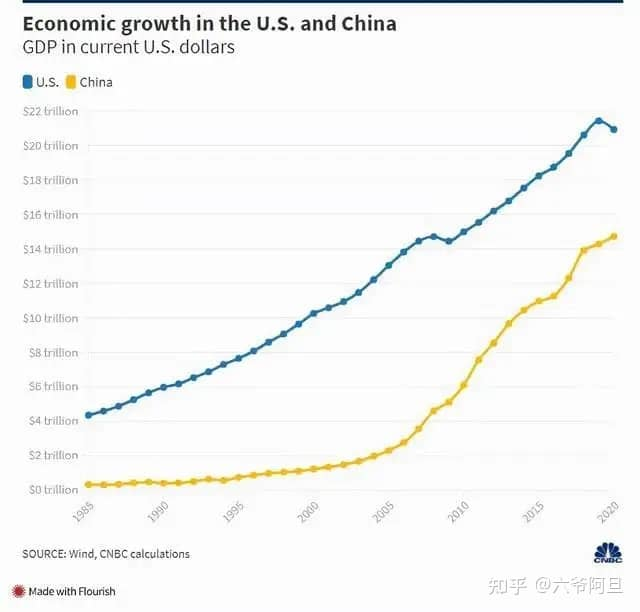

现在中美的问题，可以说就是世界的问题，中美之间的路，今后怎么走，可能就决定了未来，世界的格局会怎么变化。这是个大问题，不只是我们，其实全世界都很关心。尤其是小国家，你可以不关心这个问题，但这个问题可能迟早会来关心你。

在疫情之前，美国针对我们的打压，搞得特别凶，所以有很多自己给自己找毛病的言论，意思其实就是责任在我们自己，这本质上不过就是为了给美国的打压，进行妥协和投降，找些道义上的依据。
 

这些打压，当然也激起了很多人的义愤，我们只是想过好日子，凭什么还要经过别人允许呢？到了疫情期间，美国国内也是问题一大堆，所以也有很乐观的看法，觉得2030年左右，我们就可以超过美国了。

这两种观点，有点抗日时期的投降论和速胜论的那个味道了。那么在新时代，尤其是百年未有的变局之下，我们和美国的这一场竞争，究竟会持续多久呢？大部分人可能也倾向于认为，这会是场持久战。

既然是持久战，那就有三个问题，我们有必要搞清楚。第一，什么是持久战？第二，为什么是持久战？第三，怎么进行持久战？要把它说清说透，我也把它分成三篇文章来说，今天先说第一个问题，什么是持久战？

## 既不可能妥协

说一千道一万，中美之间的问题，最后还是个老大和老二的问题，国外把这个叫修昔底德陷阱。当老大自然有很多不一样的好处，好处是什么？你当了老大自然就知道了。但是在没当老大之前，首先还得要面临来自老大的打压。

一旦这种打压到来，有的人就惶惶不可终日，觉得天要塌了。他们有这么几种论据，来证明不能跟美国作对，只能跟美国合作，否则就没有好日子过。

第一种是说我们今天的成就，就是加入西方经济体系之后，才取得的。

这么一种论调，把西方经济体的作用放到最大，而完全忽视了中国人自己的努力。今天我们的经济规模已经是世界第二，而我们隔壁，就有个现成的例子，那个老子什么都是天下第一的印度，早就已经加入西方经济体系了，为什么发展没有我们快呢？

世界贸易组织有164个成员，我们2001年加入的时候，不过是它的第143个成员国，印度早在1995年就加入了，比我们还早了6年。如果西方经济体系就是灵丹妙药，不可能印度先吃的，见效还比我们慢。我们的发展，在这20年是有加速作用的，但是把发展的功劳，全部归结到西方经济体系上去，不仅言过其实，而且是妄自菲薄。

还有第二种说法，也很常见，就是说凡是跟美国关系好的，都过上好日子了，比如日本韩国，凡是跟美国作对的，都过得不好，比如朝鲜古巴。

这种说法有没有道理呢？这是典型的偷换概念，那凭什么一个国家过得好不好，要美国答应才行？这难道不应该才是问题的根本吗？一个国家的发展，要以美国的意志为准，那你的发展必然有个上限，就是不能超过美国，这还有没有王法了？

跟美国作对的国家，他们也有权利选择自己的路，而在美国的制裁和打压下过得不好，这不正是证明了，美国通过建立全球化市场，把持全世界的经济资源，搞国际垄断主义那一套吗？我们只能顺着它，那还怎么超过它，世界的发展，真的就以美国为极限了？那还得了。

你不反对这个根子，作为一个受害者，还去为加害者说话，这叫斯德哥尔摩综合症，得治。中国人从来不信邪，领先世界两千年，也没说不能让别人领先，西方工业革命走到了前面，我们学习追赶便是了，你卡着资源不让人超车，这不是道义，这是恐慌吧。

还有第三种说法，说之前的世界老二，苏联，还有日本，最后都被美国整惨了。

这跟第一种说法一样，又是把外部因素，夸大为全部的决定性因素。苏联和日本，尤其是日本，本身就是美国的军事殖民地，这个已经跟第二种说法相矛盾了。日本跟美国关系好，甘愿做它的跟班，这三十年没怎么发展，咱们以前没发展起来，看着日本都是好日子，你现在发展起来了，日本那是什么好日子，躺平的好日子吗？

苏联跟美国作对，苏联输了那是结果，美国赢了，但并不是终点。用它们的失败，证明美国不可战胜，那是在神话美国。美国要是有那么牛逼，何必这么慌张，把各种下三滥的手段都使出来。那说明首先在美国自己，它就不认为自己不可战胜。

它自己都不敢这么想，我们去给它脸上贴金，你这不是在毒奶它吗？日本，苏联的失败，对我们来说，可以引以为鉴，但是不足为凭。

总之这种投降论的观点，还有很多，核心思想其实都差不多，是一种恐美心态在作祟。七十年前抗美援朝，能大嘴巴削它，怎么经过七十年大发展，咋还倒退了呢。最关键的是，这帮人没有想清楚，这个事，解释权在美国。那美国会妥协吗？将来也许，但现在绝对不会。

你怕挨打，不敢站着，但是不管是跪着，还是趴着，它就不打你啦？苏联解体到如今，整整三十年，俄罗斯从跪着到趴着，挨打了三十年。这就是美国给的答案。醒醒吧，绥靖是不会有出路的，乞求，永远求不来好日子。

要过好日子，得靠自己去争取，要靠双手，靠拳头，而不是靠膝盖。

## 也不可能速胜

既然我们只能靠自己，而且这两年赶超美国，有加速的迹象，那有没有可能我们在经济体量超过美国的时候，就在竞争中胜出了呢？

我们先看下今年的情况，我们前三季度GDP为823131亿元，同比增长9.8%，按美元计价是127232亿美元。美国前三季度GDP为169915.5亿美元，同比增长5.7%。

> 预计2021年，中国的GDP为17.7万亿美元；美国GDP将达到22.8万亿美元。中美两国GDP差距将由2020年的6.2万亿美元缩小1万亿美元左右，中国GDP相当于美国的比例将从2020年70.5%提高到今年的77.5%左右。

  

  

  

按照现在的这个发展趋势，有很多对未来经济增长的预测，虽然还有区别，但是基本上都认为中国的经济规模，迟早要超过美国。有认为快的，在2028年，就有可能超过。也有认为慢的，会在2035年超过。

不管快还是慢，超过美国是个共识。这当然是个很重要的节点，但是认为超过了美国，就算是结束了竞争，而长期领先，甚至是全面超越了，没有后顾之忧了，这可能也并不符合实际情况。

之所以说速胜论也不可能，关键不在于这个表面上的数字，而在于支撑这个数字实现的基础，那些看不见的东西，比看得见的东西，要更难得搞定。

这里很多人要说科技了，其实科技也好，军事力量也好，这些方面的竞争和超越，其实已经在路上了。包括现在说得最多的就是芯片，光刻机。这些东西很关键，但也并不是决定性的，把几个关键的卡脖子的点，夸大为全局，也不客观。

如果说有人以为，把这几个关键的卡脖子的点突破了，超越了，就算是超过美国了，那可能还高兴得太早。因为毫不夸张的说，这些看得见的点，只要是已经纳上了议事日程，你且等着，突破不会太久。

反倒是那些看不见的东西，是需要日积月累，久久为功的，甚至说，如果美国不从内部出问题，我们的机会就要等更久。

具体有哪些呢？

我认为首先即便是在经济上，当今世界，有三大国际体系，我们现在还撑不起来，甚至说短时间内，可能都还不行。

第一个是产业链分工体系。

这一块我们有很好的基础，但是这里面我们也有两个问题，一个是中高端，我们还有很多领域没有解决，所以这个话语权不够。另一个是我们的经济纵深太大，自己就可以把产业链上中下游全部吃掉，所以这个分工体系，能分工到国际上去的，可能还只以原材料为主。

或者反过来说，我们自己的这个条件，是全产业链类型，要在国际上再建一套分工体系，不管是话语权，还是利益分配上，短期之内，都还有困难。

第二个是国际贸易体系。

国际贸易体系，现在是美国主导的，它把贸易全流程的各个环节，标准化了。这样可以节省资源，提高效率。我们目前本身是在用这套体系，要是另起一套，可能需要借助于新技术的突破。比如说区块链技术，数字货币等等的应用。

国际贸易体系，要从规则上开始改变，而我们在规则建立上，不管是主观方面，还是客观方面，都还有很长的路要走。

第三个是货币金融体系。

美国为什么能持续吸收全世界的财富，很大程度上在于它设计打造的这套货币金融体系，全世界都知道不合理，但是现在依然离不开它。就在于美元还是能解决很多问题，是其他货币替代不了的。这背后，带给美元这个地位的，就是世界当前的货币金融体系。

我们现在谈货币金融体系还为时尚早，因为人民币的国际化，都还没有实现，要搞另一套货币金融体系，远比前两个体系更难，它涉及的利益面太深太广了。

经济规模只是一个数字，而这些支撑经济规模的体系，才是根本。我们的经济发展，有一部分就是依赖于这三个体系，所以这才是美国进行各种打压，要搞产业链转移，组建新的经济贸易圈子，甚至威胁要把我们踢出美元结算系统的核心支撑。是这些带给它在经济上制裁的话语权，而不是它的GDP，所以说经济规模的超越，只是花不是根。

其实在这三个体系之下，还有一个更深层次的体系，就是世界军事安全体系。没有军事安全上的保障，搞产业链分工，进行利益分配，是不现实的。甚至来说现在的国际贸易体系，骨架是海运，而海运背后是海权的掌控，美国为啥要这么多航母，就是控制全球的海权，这是一脉相承的。

而我们在军事安全体系的建设上，现在有很多点已经开始突破了，但是要达到覆盖全世界，超越美国，而组建一个新的体系，这显然不会像经济规模的超越那么简单。除了军事安全体系，还有文化上的价值观体系，国际舆论与话语权体系，这些方面我们的路都还很长。

从这几个方面来说，我们的竞争，不可能以经济规模的超越为结束，也不是简单以几个卡脖子点的突破为标志。搞清楚了这个，现在不会盲目乐观，未来也不会因此失落。我们需要成体系的，整体的超越，这就决定了我们超越美国，不可能是一场速胜。

## 为什么我们一定会胜利

既然不可能妥协，也不可能速胜，那么就必定只能是持久战。很多人会想，即便是持久战，那么讲道理，为什么我们就一定会胜利，美国就一定会失败呢？

我们要是讲点对点的比较，一定是会吵三天三夜，也讲不清楚个所以然来。更何况这些都是在动态之中，在发展变化着的。美国有美国问题，也有它们的优势，我们有我们的优势，也有我们的问题，而且都是在发展变化的。

比如说我们讲人口，过去资源少负担重，觉得人口不是优势，后来移动互联网的规模基数，可以跟美国形成竞争，消费要靠人口拉动，劳动力红利要有人口基础，这时候又觉得人口是优势。现在生育率下降，未来可能还会成为劣势。

这个优劣势的变化，是在发展中不停转变的。很多个类似这样的点，都在不停变化，你去点对点的比较，容易一叶障目，得不出靠谱的结论来。

但是，如果我们以趋势的角度去看，就不一样了。最大的不一样，就在于这种大国的发展趋势，不以个人的意志为转移，不以短期变化为依据，用老话来说，是八个大字：大势已定，天命难违。

这个大势，就是长周期的大趋势。这个大趋势，是鸦片战争以来，无数仁人志士，一点一点努力推动的结果，经千千万万人奋斗，而成就的趋势。你只看到今日之势头迅猛，不知道趋势的形成，是无数个点的累积。这二十年的进步与爆发，只是前面的付出积累，从量变到质变的逐步兑现。而我们现在，投入依然比以前还大，这只会让后面的趋势，更大更强。

除了我们的向上趋势，不可逆转之外，美国的趋势，却有逆转的迹象。关于这一点，我在文章《[百年兴衰的疑问，美国的贫富差距，是如何缩小又彻底失控的？](http://mp.weixin.qq.com/s?__biz=MzU1NDY5NDczMg==&mid=2247488337&idx=1&sn=19190a6dac6ca9991c161f00efc596c9&chksm=fbdef272cca97b64b2b45504cc2bef6ece938c7bcb591578da2a78dac3d146f16869c52c2107&scene=21#wechat_redirect)》中，有详述。

做投资的都知道一个规律，向上的趋势，越到后面会越猛烈。向下的趋势，一经逆转，就会猛的下挫。这就是牛尾熊头的说法，在于趋势总是会倾向于自我加强。那么以中美双方现在的发展趋势看，美国之必然被全面超越，也是大势所趋，不以少数人的意志为转移。

这是我们之必然胜利的基础，大势已成，天命难违。

## 最后

我们说百年未有之大变局，其实只要趋势在，这变局不管怎么变，都只会加强这个趋势，使它按照既定的方向演进。这场百年未遇的疫情，从发生到现在，从一开始西方的欢呼，到现在的悲哀，这难道证明的还不够清楚吗？趋势是削弱了，还是加强了？

如果还有什么疑虑，那我们面对疫情时，所体现出来的中国人，独有的精神，正是自鸦片战争以来，千千万万仁人志士，所积累的一种信念，它没有散，而是更凝聚了，这就是趋势得以加强的保障。

什么是持久战？就是在必胜的信念下，不让不贪，让趋势顺其自然的发展，实现趋势发展本身，就必然完成全面超越，必然实现伟大复兴。

  

  

扩展阅读：

  

《[百年兴衰的疑问，美国的贫富差距，是如何缩小又彻底失控的？](http://mp.weixin.qq.com/s?__biz=MzU1NDY5NDczMg==&mid=2247488337&idx=1&sn=19190a6dac6ca9991c161f00efc596c9&chksm=fbdef272cca97b64b2b45504cc2bef6ece938c7bcb591578da2a78dac3d146f16869c52c2107&scene=21#wechat_redirect)》
